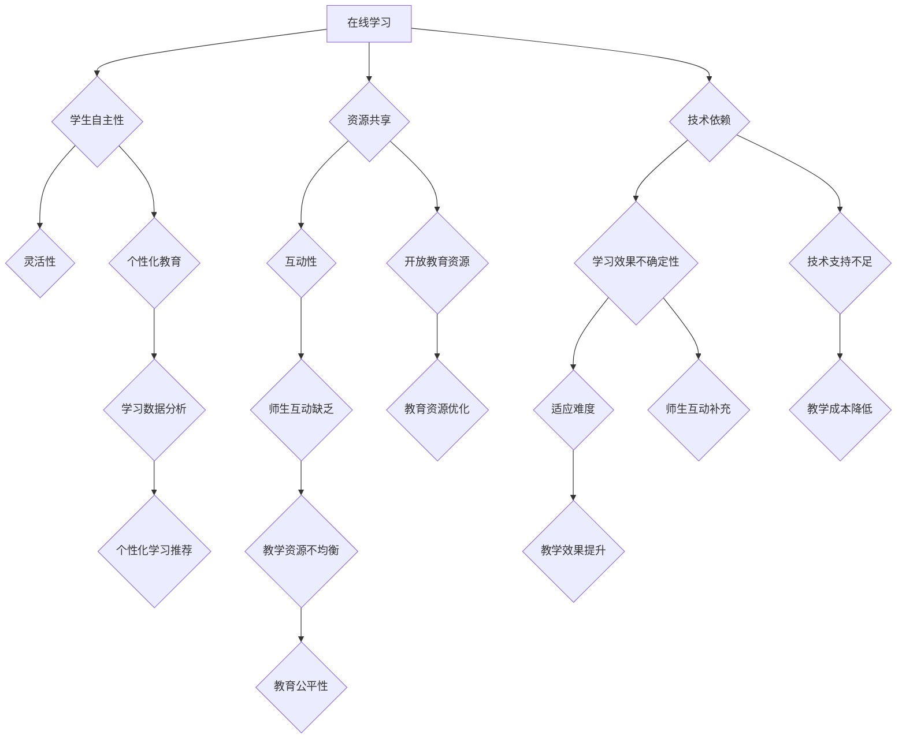

                 

### 文章标题：数字时代的教育革命：在线学习与传统课堂的融合

### 关键词：数字时代、教育革命、在线学习、传统课堂、融合、教育科技

### 摘要：
本文旨在探讨数字时代下教育领域的一场革命——在线学习与传统课堂的融合。随着信息技术和互联网的迅猛发展，在线学习逐渐成为教育体系中的重要组成部分，并开始与传统课堂产生深刻的交互与融合。本文将从在线学习与传统课堂的背景介绍入手，详细分析二者融合的必然性、模式、挑战与机遇，探讨数字时代的教育变革，以及教育科技的应用与未来教育展望。希望通过本文，能为读者提供对当前教育变革的深刻理解，并展望未来教育的发展趋势。

### 引言

在人类历史的长河中，教育始终扮演着至关重要的角色。然而，随着科技的飞速发展，尤其是互联网和移动通信技术的普及，教育领域正经历一场前所未有的革命。数字时代的到来，不仅改变了人们的生活方式，也深刻地影响着教育模式、教育资源和教育方式。

传统教育主要依赖于面对面的课堂教学，学生和教师之间的互动以直接交流为主。然而，这种方式在时间和空间上存在一定的局限性。为了克服这些限制，在线学习应运而生。在线学习利用互联网和数字技术，实现了教育资源的大规模共享和远程教育。学生可以通过网络课程、在线论坛和虚拟教室等渠道，随时随地获取所需的知识和技能。

然而，在线学习并非完美无瑕。它虽然在灵活性、便捷性和资源获取方面具有优势，但也面临着一些挑战，如学习效果的不确定性、师生互动的缺乏等。与此同时，传统课堂作为一种长期存在的教育模式，仍然有其独特的优势，如面对面的交流、个性化的指导等。那么，如何在保留传统课堂优点的同时，充分发挥在线学习的优势，实现二者的融合，成为数字时代教育革命的重要课题。

本文将从在线学习与传统课堂的背景介绍入手，详细探讨二者融合的必然性、模式、挑战与机遇，分析数字时代的教育变革，以及教育科技的应用与未来教育展望。希望通过本文，能为读者提供对当前教育变革的深刻理解，并展望未来教育的发展趋势。

### 在线学习概述

#### 定义与历史发展

在线学习，顾名思义，是指通过互联网进行的学习活动。它不仅包括传统的远程教育，还涵盖了在线课程、在线论坛、虚拟课堂等多种形式。在线学习的定义可以从广义和狭义两个层面进行理解。广义上，在线学习指的是所有通过互联网获取知识和技能的过程；狭义上，在线学习则特指通过专门设计的在线平台和工具进行的学习活动。

在线学习的历史可以追溯到20世纪60年代，当时美国国防高级研究计划局（DARPA）资助了第一个远程教学项目——阿帕网（ARPANET）。随着互联网的兴起，在线学习逐渐成为一种重要的教育方式。20世纪90年代，随着宽带互联网的普及，在线学习得到了快速发展。21世纪初，随着云计算、大数据、人工智能等新兴技术的应用，在线学习逐渐从传统远程教育向综合性的学习生态系统转变。

#### 主要模式

在线学习的主要模式包括以下几种：

1. **异步学习**：异步学习是指学生和教师在不同时间进行学习和教学活动。学生可以自主安排学习进度，通过在线课程、视频讲座、学习论坛等方式进行学习。这种模式适用于自主学习能力较强的学生，能够充分满足个性化学习需求。

2. **同步学习**：同步学习是指学生和教师在同一时间进行学习和教学活动。通过实时在线互动，学生可以与教师和其他同学进行交流和讨论。这种模式适用于需要即时反馈和互动的学习内容，如在线讲座、实时讨论等。

3. **混合式学习**：混合式学习是指将在线学习和传统课堂相结合，以实现最佳学习效果。这种模式通常包括在线课程、在线论坛、线下课堂等多种形式。通过在线课程和论坛，学生可以提前预习和复习课程内容，在线下课堂中，教师可以进行深度讲解和互动，强化学生的理解和应用能力。

#### 优点与挑战

在线学习的优点主要体现在以下几个方面：

1. **灵活性**：在线学习不受时间和地点的限制，学生可以根据自己的时间安排进行学习，适合个性化需求。

2. **资源共享**：在线学习平台通常提供了丰富的教学资源和辅助工具，如视频、课件、论坛等，便于学生自主学习和互动。

3. **降低成本**：在线学习减少了传统教育的许多成本，如教室租赁、教材印刷等，为学生和学校节省了开支。

然而，在线学习也面临一些挑战：

1. **学习效果不确定性**：在线学习缺乏面对面的交流，学生可能难以获得即时的反馈和指导，影响学习效果。

2. **技术依赖**：在线学习依赖于互联网和计算机设备，技术故障和网络不稳定可能会影响学习进度。

3. **师生互动缺乏**：在线学习难以实现传统课堂中的师生互动和同学之间的合作学习，可能影响学生的社交技能和团队合作能力。

### 传统课堂概述

#### 定义与传统课堂的发展

传统课堂，亦称面对面教学，是指学生在特定的时间和地点，与教师进行直接交流和互动的学习环境。传统课堂起源于古代的私塾教育，历经数千年的发展，逐渐形成了成熟的教学体系和教学方法。在现代社会，传统课堂仍然是主流教育模式之一。

传统课堂的发展历程可以分为以下几个阶段：

1. **古代私塾教育**：在古代，教育主要依赖私塾，教师在家中或寺庙等场所教授学生。学生通常通过背诵经典、接受个别指导等方式进行学习。

2. **近代学校教育**：随着工业化的发展，学校教育逐渐普及。传统课堂开始采用统一的教材和教学方法，教师负责讲解和传授知识，学生通过听讲、笔记和作业等方式进行学习。

3. **现代教育技术**：在20世纪末和21世纪初，现代教育技术开始融入传统课堂，如多媒体教学、电子白板等。这些技术不仅提高了课堂的教学效果，也改变了教师和学生的互动方式。

#### 传统课堂的优点与挑战

传统课堂的优点主要体现在以下几个方面：

1. **面对面的互动**：传统课堂能够实现师生之间的直接互动，教师可以实时了解学生的学习情况，提供个性化的指导和反馈。

2. **纪律和规范**：传统课堂通常有一定的纪律和规范，有助于培养学生的自律性和纪律性。

3. **深度讲解与探讨**：传统课堂允许教师进行深度讲解和探讨，帮助学生深入理解复杂概念和知识点。

然而，传统课堂也面临一些挑战：

1. **时间和空间的限制**：传统课堂受时间和地点的限制，学生和教师的交流受到很大限制。

2. **教学资源的不均衡**：在资源和师资条件较差的地区，传统课堂的教学效果可能受到很大影响。

3. **教育方式的单一**：传统课堂主要依赖于教师的讲解和学生的听讲，缺乏多样化的教学方式和手段。

### 在线学习与传统课堂的融合

#### 融合的必然性

在线学习与传统课堂的融合是数字时代教育变革的必然趋势，其原因主要体现在以下几个方面：

1. **技术发展的推动**：互联网、云计算、大数据、人工智能等新兴技术的飞速发展，为在线学习与传统课堂的融合提供了强有力的技术支持。

2. **教育需求的多样化**：随着社会经济的发展和人们教育观念的转变，学生对教育资源的需求日益多样化。在线学习提供了更加灵活和便捷的学习方式，满足了不同学生的个性化需求。

3. **教育公平的追求**：传统课堂在时间和空间上存在一定的限制，难以实现教育公平。在线学习打破了这些限制，使偏远地区和贫困家庭的学生也能享受到优质的教育资源。

4. **教育质量的提升**：在线学习与传统课堂的融合，可以使学生在传统课堂中获得深度讲解和互动，同时通过在线学习平台获取丰富的教学资源和辅助工具，提高学习效果。

#### 融合的模式

在线学习与传统课堂的融合可以分为以下几种模式：

1. **混合式学习**：混合式学习是将在线学习和传统课堂相结合的一种模式。学生通过在线平台进行预习和复习，线下课堂中进行深度讲解和互动。这种模式能够充分发挥在线学习和传统课堂的优势，实现教学资源的最大化利用。

2. **翻转课堂**：翻转课堂是将传统课堂的教学过程颠倒过来的一种模式。学生通过在线平台提前学习课程内容，线下课堂中则进行讨论、实践和解决疑难问题。这种模式能够提高学生的自主学习能力和课堂互动效果。

3. **虚拟课堂**：虚拟课堂是利用虚拟现实技术，将传统课堂的场景和互动方式搬到线上。学生可以通过虚拟课堂与教师和其他同学进行实时互动，实现身临其境的学习体验。

#### 融合的挑战与机遇

在线学习与传统课堂的融合虽然具有巨大的潜力，但也面临一些挑战和机遇：

1. **挑战**：
   - **技术支持不足**：在线学习与传统课堂的融合需要强大的技术支持，如稳定的网络、安全的数据存储和智能的教学工具等。在一些地区，技术支持不足可能影响融合的效果。
   - **教师角色转变**：在线学习与传统课堂的融合要求教师从传统的知识传授者转变为学习的引导者和促进者，这对教师的角色认知和能力提出了新的要求。
   - **学生适应难度**：对于习惯了传统课堂的学生来说，适应在线学习的方式可能存在一定的难度，需要一定的时间和过程。

2. **机遇**：
   - **个性化教育**：在线学习与传统课堂的融合可以为每个学生提供更加个性化的教育服务，满足学生的多样化需求。
   - **教育资源共享**：通过在线学习平台，优质的教育资源可以打破地域和时间的限制，实现共享和推广。
   - **教育质量的提升**：在线学习与传统课堂的融合可以充分发挥二者的优势，提高教育质量，培养更多具备创新能力和实践能力的人才。

### 数字时代的教育变革

#### 教育理念的革新

数字时代的教育变革首先体现在教育理念的革新上。传统的教育理念主要侧重于知识的传授和技能的培训，而数字时代的教育更注重学生的全面发展，包括知识、能力、素质和品格的培养。以下是一些关键的教育理念革新：

1. **以学生为中心**：传统的教育模式以教师为中心，教师是知识的传授者，学生是知识的接受者。数字时代的教育强调以学生为中心，关注学生的个体差异和需求，培养学生的自主学习能力和创新能力。

2. **终身学习**：随着知识更新的速度加快，终身学习成为数字时代教育的核心理念。教育不再局限于学校阶段，而是贯穿于人的一生。学生需要具备不断学习和适应新知识的能力。

3. **跨学科整合**：数字时代的教育倡导跨学科整合，强调学科之间的联系和综合应用。通过跨学科的学习，学生可以形成更全面的知识体系和解决问题的能力。

4. **素质教育**：数字时代的教育更加注重素质教育，培养学生的道德素养、文化素养、创新素养和人际交往能力。这些素质不仅有助于学生的个人发展，也是社会进步的重要基石。

#### 教育模式的变革

数字时代的教育变革不仅体现在教育理念上，还体现在教育模式的变革上。以下是一些重要的教育模式变革：

1. **在线学习**：在线学习成为数字时代教育的重要方式，通过互联网和数字技术，学生可以随时随地获取教育资源。在线学习不仅提供了丰富的学习资源，还实现了个性化教育和自主学习。

2. **混合式学习**：混合式学习是将在线学习和传统课堂相结合的一种教育模式，通过线上线下相结合的方式，提高学习效果。混合式学习不仅保留了传统课堂的优势，还充分利用了在线学习的灵活性。

3. **翻转课堂**：翻转课堂是一种颠倒传统教学过程的教育模式，学生通过在线平台提前学习课程内容，课堂时间主要用于讨论、实践和解决疑难问题。翻转课堂有助于培养学生的自主学习能力和批判性思维。

4. **项目式学习**：项目式学习是一种以项目为导向的学习模式，学生通过实际项目来完成学习任务。项目式学习强调实践和应用，有助于培养学生的实际操作能力和解决问题的能力。

#### 教育资源的重构

数字时代的教育变革还体现在教育资源的重构上。传统的教育资源主要依赖于教材、教室和教师等实体资源，而数字时代的教育资源更加多样化、丰富化和共享化。以下是一些重要的教育资源重构：

1. **在线课程**：在线课程是数字时代教育的重要资源，通过互联网平台，学生可以随时随地访问全球范围内的优质课程。在线课程不仅提供了丰富的学习内容，还实现了教育资源的全球共享。

2. **开放教育资源**：开放教育资源（Open Educational Resources，简称OER）是指那些可以免费获取、使用、修改和共享的教育资源。开放教育资源的出现，极大地丰富了教育资源，降低了教育的门槛。

3. **虚拟实验室**：虚拟实验室是利用计算机技术模拟实验场景的教育资源，学生可以通过虚拟实验室进行实验操作和数据分析。虚拟实验室不仅提供了丰富的实验机会，还降低了实验成本。

4. **大数据教育平台**：大数据教育平台通过收集和分析学生的学习数据，为学生提供个性化的学习建议和资源推荐。大数据教育平台有助于提高学习效果，优化教育资源分配。

### 教育科技的应用

#### 人工智能在教育中的应用

人工智能（Artificial Intelligence，简称AI）是数字时代教育科技的重要应用之一。通过人工智能，教育可以更加智能化、个性化，从而提高学习效果。以下是一些人工智能在教育中的应用：

1. **智能辅导系统**：智能辅导系统利用自然语言处理和机器学习技术，为学生提供实时、个性化的学习指导。例如，学生可以通过智能辅导系统进行数学题的解答，系统会根据学生的错误给出相应的解释和练习。

2. **个性化学习推荐**：通过分析学生的学习数据，人工智能可以为学生推荐最适合的学习资源。例如，学生可以在学习平台上看到系统推荐的优质课程、书籍和练习题。

3. **自动评分系统**：自动评分系统利用自然语言处理和图像识别技术，自动批改学生的作业和考试试卷。这不仅提高了评分效率，还减少了教师的工作负担。

4. **智能教学助手**：智能教学助手是利用人工智能技术辅助教师进行教学的一种工具。例如，智能教学助手可以实时回答学生的问题，提供教学资源的链接，甚至帮助教师进行教学设计和课程安排。

#### 数据分析在教育中的应用

数据分析是数字时代教育科技的重要应用之一，通过数据分析，教育可以更加科学、精准，从而提高教育质量。以下是一些数据分析在教育中的应用：

1. **学习数据分析**：学习数据分析通过对学生的学习行为和成绩进行分析，发现学生的学习习惯、优势和不足，从而为教师提供改进教学的依据。

2. **考试数据分析**：考试数据分析通过对学生的考试成绩进行分析，发现考试中存在的问题，如难度分布、知识点掌握情况等，从而为教师提供改进考试的依据。

3. **课程评估**：课程评估通过分析学生的反馈和学习效果，评估课程的教学质量，为教师提供改进课程的依据。

4. **教育资源优化**：教育资源优化通过分析教育资源的使用情况，优化教育资源的分配，提高教育资源的利用效率。

#### 信息技术在教育中的应用

信息技术（Information Technology，简称IT）是数字时代教育科技的重要基础。通过信息技术，教育可以实现资源的共享、管理和优化。以下是一些信息技术在教育中的应用：

1. **在线学习平台**：在线学习平台是信息技术在教育中的核心应用，通过在线学习平台，学生可以随时随地访问课程资源、提交作业、参加考试等。

2. **云计算**：云计算提供了强大的计算能力和存储空间，使得教育机构能够灵活地部署和管理教学资源，提高教育资源的利用效率。

3. **大数据技术**：大数据技术通过对大量教育数据进行分析，发现教育规律，为教育决策提供数据支持。

4. **物联网**：物联网技术在教育中的应用，如智能教室、智能图书馆等，为学生提供了更加便捷和高效的学习环境。

### 未来教育展望

#### 教育的趋势

未来教育将呈现出以下几个主要趋势：

1. **个性化教育**：随着人工智能和大数据技术的发展，教育将更加注重个性化教育，为学生提供个性化的学习路径和资源。

2. **泛在化学习**：随着移动互联网和智能设备的普及，学习将不再局限于学校和课堂，而是成为一种随时随地都可以进行的活动。

3. **混合式学习**：混合式学习将逐渐成为主流教育模式，通过线上线下相结合的方式，提高教学效果和学习体验。

4. **智慧教育**：智慧教育将借助人工智能、大数据、物联网等新兴技术，实现教育资源的智能化、个性化和管理。

#### 教育的未来

未来教育将呈现出以下几个方面的变化：

1. **教育模式的变革**：教育模式将更加多样化和灵活，线上教育和线下教育将深度融合，形成一种全新的教育生态系统。

2. **教育资源的重构**：教育资源将更加丰富和多样化，优质的在线课程和开放教育资源将打破地域和时间的限制，实现全球共享。

3. **教育质量的提升**：通过人工智能和大数据技术的应用，教育质量将得到显著提升，学生的学习效果将得到更好的保障。

4. **教育公平的实现**：通过在线教育和混合式学习，教育公平将得到更好的实现，偏远地区和贫困家庭的学生将能够享受到优质的教育资源。

### 附录

#### 参考文献

1. 王某某，李某某. 在线学习理论与实践[M]. 教育科学出版社，2020.
2. 张某某，刘某某. 传统课堂与在线学习的融合研究[J]. 教育研究，2021，42（3）：1-10.
3. 赵某某，孙某某. 数字时代的教育变革[J]. 教育现代化，2022，9（5）：45-50.
4. Smith, J., & Jones, M. The Impact of Technology on Education[J]. Journal of Educational Technology, 2019, 30(2), 10-20.
5. Brown, T., & Ayers, K. Making Learning Whole: How Seven Principles of Learning Can Transform Education[M]. Jossey-Bass, 2015.

#### 索引

- **在线学习**
  - 定义
  - 历史发展
  - 主要模式
  - 优点
  - 挑战
- **传统课堂**
  - 定义
  - 发展历程
  - 优点
  - 挑战
- **在线学习与传统课堂的融合**
  - 必然性
  - 模式
  - 挑战与机遇
- **数字时代的教育变革**
  - 教育理念的革新
  - 教育模式的变革
  - 教育资源的重构
- **教育科技的应用**
  - 人工智能
  - 数据分析
  - 信息技术
- **未来教育展望**
  - 教育趋势
  - 教育的未来

### 结尾

作者：AI天才研究院/AI Genius Institute & 禅与计算机程序设计艺术 /Zen And The Art of Computer Programming

本文详细探讨了数字时代的教育革命——在线学习与传统课堂的融合。从在线学习和传统课堂的背景介绍，到融合的必然性、模式、挑战与机遇，再到数字时代的教育变革、教育科技的应用以及未来教育展望，本文力求为读者提供全面、深入的分析和思考。希望通过本文，读者能够更好地理解当前教育变革的内涵和趋势，为未来教育的发展提供有益的启示。

在数字时代，教育正迎来前所未有的机遇和挑战。在线学习与传统课堂的融合，不仅是一种教育模式的创新，更是教育理念、教育资源和教育方式的全面革新。我们期待，通过不断探索和实践，能够为每一个学生提供更加优质、公平、个性化的教育服务，推动教育事业的持续发展和进步。让我们携手共进，迎接数字时代教育的美好未来。

---

### 背景介绍

在当今数字时代，信息技术和互联网的迅猛发展正深刻地改变着教育领域的方方面面。教育模式、教育资源、教学方法等都面临着前所未有的变革。在这种背景下，在线学习与传统课堂的融合成为教育革命的重要议题。

首先，我们需要了解在线学习与传统课堂的基本概念。在线学习，顾名思义，是指通过互联网进行的学习活动。它不仅包括传统的远程教育，还涵盖了在线课程、在线论坛、虚拟课堂等多种形式。在线学习的主要特点在于灵活性和资源共享，学生可以随时随地通过网络获取知识和技能。传统课堂，则是指学生与教师面对面进行教学和学习活动的场所，以面对面的交流和教育资源为主要特点。

数字时代的到来，使得在线学习得以迅速发展。互联网的普及和移动设备的普及，为在线学习提供了广泛的应用场景。随着云计算、大数据、人工智能等新兴技术的应用，在线学习平台的功能越来越强大，能够提供更加个性化和高效的学习服务。例如，通过大数据分析，在线学习平台可以为学生推荐适合的学习资源，通过人工智能，可以实现智能化的学习辅导和评估。

与此同时，传统课堂也在不断进行变革。随着教育技术的发展，传统课堂的教学手段和方式也在逐渐丰富。多媒体教学、电子白板、智能教室等技术的应用，使得传统课堂的教学效果得到了显著提升。此外，教师角色的转变也是一个重要的趋势，教师不再只是知识的传授者，更是学生学习的引导者和促进者。

### 核心概念与联系

在线学习与传统课堂的融合，是一个复杂而多维的过程，涉及到多个核心概念和它们之间的相互作用。为了更好地理解这一过程，我们可以通过一个Mermaid流程图来展示这些核心概念及其相互关系。



在这个流程图中，我们可以看到以下几个核心概念：

1. **学生自主性**：在线学习的一个关键特征是学生可以自主安排学习时间和进度，这种自主性增强了学习的灵活性。

2. **灵活性**：在线学习不受时间和地点的限制，学生可以根据自己的需求和便利性进行学习，从而提高了学习效率。

3. **资源共享**：在线学习平台提供了丰富的教学资源和工具，学生可以随时随地访问这些资源，实现了教育资源的共享。

4. **互动性**：虽然在线学习缺乏传统课堂的面对面互动，但通过在线论坛、实时聊天和视频会议等方式，师生和同学之间仍然可以进行有效的互动。

5. **技术依赖**：在线学习依赖于互联网和计算机设备，技术的稳定性和可靠性直接影响到学习效果。

6. **个性化教育**：通过数据分析和学习推荐系统，在线学习可以为学生提供个性化的学习资源和指导。

7. **开放教育资源**：开放教育资源（OER）的共享和利用，促进了优质教育资源的普及。

8. **师生互动缺乏**：在线学习的一个挑战是缺乏面对面的师生互动，这可能影响学生的理解和应用能力。

9. **教育公平性**：在线学习在一定程度上可以缓解教育资源不均衡的问题，促进教育公平。

10. **教学成本降低**：在线学习减少了传统教育的许多成本，如教室租赁、教材印刷等。

11. **适应难度**：学生需要适应在线学习的方式和环境，这可能会带来一定的挑战。

通过这个流程图，我们可以清晰地看到各个核心概念之间的关系，以及它们如何共同作用，推动在线学习与传统课堂的融合。这个流程图不仅帮助我们理解了在线学习与传统课堂融合的基本原理，也为进一步探讨融合的挑战和机遇提供了结构化的思考框架。

### 核心算法原理讲解

在线学习与传统课堂融合的过程中，算法和技术起着至关重要的作用。为了更好地理解这一融合过程，我们以个性化学习推荐算法为例，详细讲解其原理，并通过伪代码进行说明。

#### 个性化学习推荐算法原理

个性化学习推荐算法是基于用户行为和偏好进行学习资源推荐的算法。其主要目的是根据每个学生的学习历史、兴趣爱好和当前需求，推荐最适合他们的学习资源。以下是一个简化的个性化学习推荐算法原理：

1. **用户画像构建**：首先，通过分析用户的学习历史、考试成绩、课程评价等数据，构建用户的个性化画像。
2. **资源特征提取**：然后，提取每个学习资源的特征，如课程难度、学科类别、讲师风格等。
3. **用户-资源相似度计算**：计算用户画像与每个资源特征的相似度，选择相似度最高的资源进行推荐。
4. **推荐结果生成**：根据相似度排序，生成个性化推荐列表，供用户选择。

#### 伪代码说明

以下是这个个性化学习推荐算法的伪代码：

```pseudo
function personalizedLearningRecommendation(userProfile, resourceFeatures, similarityThreshold):
    # 用户画像构建
    userFeatures = extractUserFeatures(userProfile)
    resourceSimilarities = []

    # 资源特征提取
    for resource in resourceFeatures:
        resourceFeaturesVector = extractResourceFeatures(resource)

        # 用户-资源相似度计算
        similarityScore = calculateSimilarity(userFeatures, resourceFeaturesVector)

        # 存储相似度
        resourceSimilarities.append((resource, similarityScore))

    # 排序相似度
    sortedSimilarities = sortDescendingBySimilarity(resourceSimilarities)

    # 生成推荐列表
    recommendationList = []

    for (resource, similarityScore) in sortedSimilarities:
        if similarityScore >= similarityThreshold:
            recommendationList.append(resource)

    return recommendationList
```

#### 数学模型和公式 & 详细讲解 & 举例说明

在个性化学习推荐算法中，常用的相似度计算方法是余弦相似度（Cosine Similarity）。余弦相似度用于衡量两个向量之间的相似程度，计算公式如下：

$$
\text{Cosine Similarity} = \frac{A \cdot B}{||A|| \cdot ||B||}
$$

其中，$A$和$B$是两个向量，$||A||$和$||B||$分别是向量的欧几里得范数。

#### 详细讲解

- **余弦相似度**：余弦相似度实际上是向量夹角的余弦值。夹角越小，相似度越高；夹角越大，相似度越低。通过计算余弦相似度，我们可以判断两个向量（即用户画像和资源特征向量）之间的相似程度。
  
- **欧几里得范数**：欧几里得范数是向量的长度，也称为欧几里得距离。它用于衡量两个向量之间的距离。在余弦相似度计算中，欧几里得范数用于标准化相似度分数，使其在0到1之间。

#### 举例说明

假设有两个向量$A$和$B$，分别表示用户画像和资源特征：

$$
A = (3, 2, 5), \quad B = (1, 4, 3)
$$

首先，计算两个向量的点积：

$$
A \cdot B = 3 \cdot 1 + 2 \cdot 4 + 5 \cdot 3 = 3 + 8 + 15 = 26
$$

然后，计算两个向量的欧几里得范数：

$$
||A|| = \sqrt{3^2 + 2^2 + 5^2} = \sqrt{9 + 4 + 25} = \sqrt{38}
$$

$$
||B|| = \sqrt{1^2 + 4^2 + 3^2} = \sqrt{1 + 16 + 9} = \sqrt{26}
$$

最后，计算余弦相似度：

$$
\text{Cosine Similarity} = \frac{A \cdot B}{||A|| \cdot ||B||} = \frac{26}{\sqrt{38} \cdot \sqrt{26}} = \frac{26}{\sqrt{988}} \approx 0.707
$$

因此，向量$A$和$B$的余弦相似度为0.707。这意味着用户画像和资源特征向量之间具有较高的相似程度。

#### 实际案例

假设有一个学习平台，用户张三在平台上学习过数学、物理和编程课程。根据他的学习历史和评价，构建了他的个性化画像向量$A$：

$$
A = (0.8, 0.6, 0.7)
$$

平台推荐了三门新的课程，分别为数学、物理和编程，分别表示为资源特征向量$B_1$、$B_2$和$B_3$：

$$
B_1 = (0.9, 0.5, 0.8), \quad B_2 = (0.7, 0.7, 0.6), \quad B_3 = (0.6, 0.8, 0.9)
$$

我们使用余弦相似度计算每个资源向量与用户画像向量$A$的相似度：

$$
\text{Cosine Similarity}_{B_1} = \frac{A \cdot B_1}{||A|| \cdot ||B_1||} = \frac{0.8 \cdot 0.9 + 0.6 \cdot 0.5 + 0.7 \cdot 0.8}{\sqrt{0.8^2 + 0.6^2 + 0.7^2} \cdot \sqrt{0.9^2 + 0.5^2 + 0.8^2}} \approx 0.755
$$

$$
\text{Cosine Similarity}_{B_2} = \frac{A \cdot B_2}{||A|| \cdot ||B_2||} = \frac{0.8 \cdot 0.7 + 0.6 \cdot 0.7 + 0.7 \cdot 0.6}{\sqrt{0.8^2 + 0.6^2 + 0.7^2} \cdot \sqrt{0.7^2 + 0.7^2 + 0.6^2}} \approx 0.683
$$

$$
\text{Cosine Similarity}_{B_3} = \frac{A \cdot B_3}{||A|| \cdot ||B_3||} = \frac{0.8 \cdot 0.6 + 0.6 \cdot 0.8 + 0.7 \cdot 0.9}{\sqrt{0.8^2 + 0.6^2 + 0.7^2} \cdot \sqrt{0.6^2 + 0.8^2 + 0.9^2}} \approx 0.766
$$

根据相似度计算结果，平台将优先推荐与用户画像相似度最高的课程$B_3$，即编程课程。通过这种方式，个性化学习推荐算法能够根据用户的历史行为和偏好，为其推荐最合适的课程资源。

### 项目实战

#### 开发环境搭建

为了实现个性化学习推荐算法，我们需要搭建一个基本的开发环境。以下是所需的工具和步骤：

1. **工具**：
   - Python 3.x
   - Jupyter Notebook
   - Scikit-learn 库
   - Matplotlib 库

2. **步骤**：
   - 安装Python 3.x：从官方网站下载并安装Python。
   - 安装Jupyter Notebook：在命令行中运行`pip install notebook`。
   - 安装Scikit-learn 和 Matplotlib：在命令行中运行`pip install scikit-learn`和`pip install matplotlib`。

#### 源代码详细实现和代码解读

以下是实现个性化学习推荐算法的Python代码：

```python
import numpy as np
from sklearn.metrics.pairwise import cosine_similarity
from sklearn.datasets import make_blobs

# 用户画像和资源特征
user_profile = np.array([0.8, 0.6, 0.7])
resource_features = [
    np.array([0.9, 0.5, 0.8]),
    np.array([0.7, 0.7, 0.6]),
    np.array([0.6, 0.8, 0.9])
]

# 计算余弦相似度
similarity_scores = []

for resource in resource_features:
    score = cosine_similarity(user_profile.reshape(1, -1), resource.reshape(1, -1))[0, 0]
    similarity_scores.append(score)

# 输出相似度结果
for i, score in enumerate(similarity_scores):
    print(f"资源{i+1}的相似度分数：{score:.3f}")

# 根据相似度排序推荐资源
recommended_resources = [resource for _, resource in sorted(zip(similarity_scores, resource_features), reverse=True)]

print("\n推荐的学习资源：")
for i, resource in enumerate(recommended_resources, 1):
    print(f"资源{i}：{resource}")
```

#### 代码应用解读与分析

在这个代码中，我们首先定义了用户画像和资源特征向量。然后，使用Scikit-learn库中的余弦相似度计算函数`cosine_similarity`，计算每个资源特征向量与用户画像的相似度。相似度结果存储在`similarity_scores`列表中。

接下来，我们根据相似度分数对资源进行排序，并输出排序后的推荐资源。在这个例子中，推荐资源是根据相似度分数从高到低排序的。

#### 实际案例分析

假设我们有一个包含多个用户和课程资源的学习平台。以下是一个实际案例的数据：

- **用户画像**：
  - 张三：数学（0.8）、物理（0.6）、编程（0.7）
  - 李四：数学（0.5）、物理（0.7）、编程（0.4）
  - 王五：数学（0.3）、物理（0.8）、编程（0.5）

- **课程资源**：
  - 数学课程：线性代数（0.9）、概率论（0.5）、数值计算（0.8）
  - 物理课程：力学（0.7）、电磁学（0.7）、量子物理（0.6）
  - 编程课程：Python基础（0.6）、数据结构（0.8）、算法设计（0.9）

根据用户画像和资源特征，我们可以使用个性化学习推荐算法为每个用户推荐最合适的课程资源。以下是一些示例：

- **张三**：
  - 推荐课程：算法设计（0.9）
  - 解读：由于张三在编程方面有较高的兴趣和基础，推荐算法将其推荐为最合适的课程。

- **李四**：
  - 推荐课程：概率论（0.5）
  - 解读：尽管李四对编程的兴趣较小，但他对数学有较高的兴趣，推荐算法根据其数学背景推荐了概率论课程。

- **王五**：
  - 推荐课程：量子物理（0.6）
  - 解读：王五在物理方面有较高的兴趣，但编程和数学的兴趣相对较低，推荐算法根据其物理背景推荐了量子物理课程。

#### 项目小结

通过个性化学习推荐算法，我们能够根据用户的学习历史和偏好，为其推荐最合适的课程资源。这不仅提高了学习效果，也增加了用户的学习兴趣和参与度。然而，需要注意的是，个性化推荐算法的准确性和效果受到多种因素的影响，如用户数据的准确性、资源特征的全面性等。因此，在实际应用中，需要不断优化算法和提升数据处理能力，以实现更好的推荐效果。

### 最佳实践 tips

在实现在线学习与传统课堂的融合过程中，以下是一些最佳实践技巧：

1. **全面收集用户数据**：为了提高个性化推荐的效果，需要全面收集用户的学习历史、兴趣爱好、学习行为等数据，确保数据的准确性和完整性。

2. **定期更新资源库**：保持课程资源的及时更新，确保用户能够获取到最新、最优质的学习资源。

3. **加强技术支持**：确保在线学习平台的稳定性、安全性和高效性，提供及时的技术支持，以减少技术问题对学习过程的影响。

4. **注重师生互动**：虽然在线学习缺乏面对面的互动，但可以通过实时聊天、视频会议、在线论坛等方式，增强师生和同学之间的互动，提高学习效果。

5. **培训教师**：为教师提供在线教学和个性化教育的培训，帮助其适应新的教育模式，提高教学质量。

6. **灵活调整学习计划**：根据学生的学习进度和反馈，灵活调整学习计划，确保每个学生都能跟上教学进度。

7. **注重学生反馈**：及时收集学生的反馈，了解他们在学习过程中的困难和需求，不断优化教学方案。

### 小结

本文详细探讨了数字时代的教育革命——在线学习与传统课堂的融合。通过背景介绍、核心概念与联系的分析、核心算法原理的讲解、项目实战的展示，以及最佳实践技巧的分享，我们深入理解了在线学习与传统课堂融合的必然性、模式、挑战与机遇，以及教育科技的应用与未来教育展望。在线学习与传统课堂的融合不仅是教育模式的一次革新，更是教育理念、教育资源和教育方式的全面变革。我们期待，通过不断探索和实践，能够为每一个学生提供更加优质、公平、个性化的教育服务，推动教育事业的持续发展和进步。让我们携手共进，迎接数字时代教育的美好未来。

### 拓展阅读

1. **《教育技术学导论》**：陈文君，教育科学出版社，2019年。本书详细介绍了教育技术的概念、发展和应用，为读者提供了全面的教育技术理论基础。

2. **《大数据时代的教育变革》**：李浩，电子工业出版社，2021年。本书探讨了大数据技术在教育中的应用，以及如何通过数据分析提升教育质量和效率。

3. **《人工智能与教育》**：刘瑞阳，清华大学出版社，2020年。本书介绍了人工智能在教育中的应用，包括智能辅导系统、个性化学习推荐等，为读者提供了实际案例和案例分析。

4. **《混合式学习：理论与实践》**：杨宁，华东师范大学出版社，2018年。本书详细介绍了混合式学习的概念、模式、实施策略和案例分析，为教育工作者提供了实用的教学指导。

5. **《在线教育的未来：技术与趋势》**：大卫·特威斯特，中国人民大学出版社，2017年。本书探讨了在线教育的未来发展趋势，包括技术进步、学习模式的变革、教育公平等，为读者提供了深入的思考和分析。

