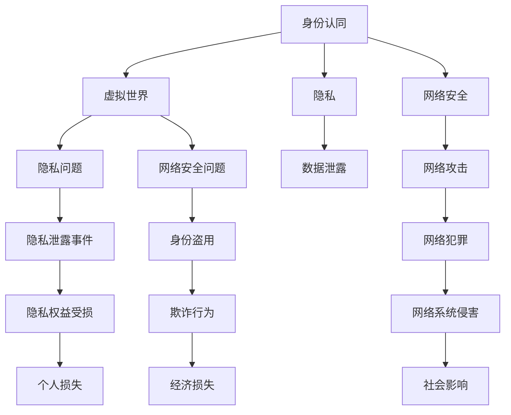

                 

### 文章标题

# 数字时代的身份认同：虚拟世界中的自我塑造

### 关键词

- 数字时代
- 身份认同
- 虚拟世界
- 社交网络
- 隐私问题
- 网络安全

### 摘要

本文深入探讨了数字时代背景下，虚拟世界中的身份认同问题。随着数字化和互联网技术的飞速发展，虚拟世界已成为人们生活的重要组成部分。在此背景下，身份认同的概念和形式发生了深刻变化，个体在虚拟世界中的身份塑造成为研究的重要议题。本文将从背景介绍、核心概念与联系、算法原理讲解、数学模型与公式、项目实战等多个方面，系统地阐述数字时代身份认同的挑战与机遇，旨在为相关领域的研究和实践提供参考。

## 第一部分：背景与概述

### 第1章：数字时代的变迁

随着信息技术的迅猛发展，我们正逐步迈入数字时代。数字化不仅改变了社会的运行方式，也对人们的日常生活和身份认同产生了深远影响。在这个背景下，理解数字时代的特征和演变趋势，对于探讨身份认同问题至关重要。

#### 数字化社会的定义与特点

数字化社会是指通过信息技术，特别是互联网和移动通信技术，对传统社会进行全方位改造的社会形态。其主要特点包括：

1. **信息高度透明与共享**：数字化技术使得信息传播更加迅速和广泛，信息透明度大幅提升。
2. **虚拟空间的扩展**：数字技术的普及，使得虚拟空间成为人们交流和互动的重要场所。
3. **智能化与自动化**：大数据、人工智能等技术应用，使得社会运作更加智能化和自动化。
4. **远程化与去中心化**：数字技术降低了地理和组织的限制，远程工作和去中心化组织形式变得更加普遍。

#### 数字时代的身份认同问题

在数字时代，身份认同面临诸多挑战：

1. **身份的多重性**：个体在现实世界和虚拟世界中有不同的身份，这些身份如何统一和协调？
2. **隐私问题**：数字技术的广泛应用，使得个人隐私受到前所未有的威胁，如何在保护隐私的同时实现身份认同？
3. **网络安全问题**：虚拟世界中的身份认同，面临网络攻击和数据泄露的风险。

### 第2章：虚拟世界的崛起

虚拟世界，是指通过计算机技术构建的，与现实世界平行的数字空间。它不仅提供了新的社交、娱乐和工作环境，也成为身份认同的新场所。

#### 虚拟世界的概念与发展

1. **虚拟世界的定义**：虚拟世界是指利用计算机模拟现实世界，或构建完全虚构的数字环境，供用户在其中进行交互和活动的空间。
2. **虚拟世界的发展**：从早期的MUD（多用户泥巴）、MUCK（多用户聊天室）到现代的虚拟现实（VR）和增强现实（AR），虚拟世界经历了多次技术变革，功能越来越丰富，用户体验也不断提升。

#### 虚拟世界中的身份塑造

在虚拟世界中，个体可以通过不同的方式塑造自己的身份：

1. **虚拟角色**：用户可以通过选择性别、外貌、职业等特征，创建一个与现实不同的虚拟角色。
2. **社交网络**：虚拟世界中的社交网络，使得用户可以与虚拟角色或其他用户建立联系，形成社交圈子。
3. **虚拟经济**：虚拟世界中的虚拟货币和物品交易，也为用户提供了新的经济活动方式。

### 第3章：身份认同的挑战

在数字时代，身份认同面临诸多挑战，这些问题不仅影响了个体，也对整个社会产生了深远影响。

#### 数字时代的隐私问题

1. **隐私泄露**：随着数字化进程的加快，个人数据泄露事件频繁发生，隐私保护成为一个严峻问题。
2. **数据监控**：政府和企业在获取个人数据的同时，也存在滥用数据的可能，这对个体的隐私权益构成了威胁。

#### 数字时代的网络安全问题

1. **网络攻击**：虚拟世界中的身份认同，面临着来自黑客和网络犯罪的攻击风险。
2. **身份盗用**：不法分子通过盗用他人身份信息，进行欺诈等犯罪活动，给受害者带来损失。

### 背景介绍

数字时代的来临，带来了前所未有的机遇和挑战。在这个时代，虚拟世界已成为人们生活的重要组成部分。身份认同，作为个体在社会中定位和认知自身的重要维度，面临着全新的问题和挑战。

#### 核心概念与联系

为了更清晰地理解数字时代的身份认同问题，我们首先需要明确几个核心概念：

1. **身份认同**：指个体在社会中所认知和接受的自我形象，包括个体的社会角色、价值观和信仰等。
2. **虚拟世界**：通过计算机技术构建的，与现实世界平行的数字空间。
3. **隐私**：指个体在信息传播和共享过程中，对其个人信息和活动的保护。
4. **网络安全**：指保护网络系统不受攻击和恶意行为侵害的能力。

这几个概念之间存在着紧密的联系。虚拟世界提供了新的身份认同场所，而隐私和网络安全则是保障身份认同的重要保障。在这个背景下，理解这些概念之间的内在关系，对于解决数字时代身份认同问题至关重要。

#### Mermaid 流程图

以下是一个简化的Mermaid流程图，展示了核心概念之间的关系：



通过这个流程图，我们可以更直观地理解数字时代身份认同问题的复杂性和挑战。

### 核心概念与联系：核心概念原理之间的关系架构

在深入探讨数字时代身份认同问题的过程中，理解核心概念之间的原理和联系至关重要。以下是几个关键概念及其相互关系的详细解释：

#### 身份认同（Identity）

身份认同是指个体在社会中所认知和接受的自我形象，包括个体的社会角色、价值观和信仰等。在数字时代，身份认同不仅局限于现实世界，还包括虚拟世界。虚拟世界为个体提供了新的身份塑造空间，使得个体可以创建与现实中不同的虚拟身份。

#### 虚拟世界（Virtual World）

虚拟世界是指通过计算机技术构建的，与现实世界平行的数字空间。虚拟世界包括各种类型的数字环境，如在线游戏、社交媒体平台、虚拟现实（VR）和增强现实（AR）等。虚拟世界为个体提供了丰富的社交、娱乐和工作体验，同时也带来了新的身份认同挑战。

#### 隐私（Privacy）

隐私是指个体在信息传播和共享过程中，对其个人信息和活动的保护。在数字时代，隐私问题尤为突出。个体在虚拟世界中的活动，如社交互动、数据上传和交易等，都涉及到大量个人信息的泄露。隐私保护不仅关系到个体的信息安全，也影响到其身份认同的稳定性和安全感。

#### 网络安全（Cybersecurity）

网络安全是指保护网络系统不受攻击和恶意行为侵害的能力。在数字时代，网络安全是保障身份认同的重要保障。虚拟世界中的身份认同，面临着来自黑客和网络犯罪的攻击风险。网络安全问题不仅影响个体的身份安全，也威胁到整个社会的稳定和信息安全。

#### 关系架构

以下是核心概念原理之间的关系架构的Mermaid流程图：


通过这个流程图，我们可以更清晰地看到身份认同、虚拟世界、隐私和网络安全之间的内在联系。身份认同依赖于虚拟世界的发展，而隐私和网络安全则是保障身份认同的重要因素。隐私问题可能导致数据泄露和网络犯罪，进而影响个人的身份安全和信息安全，最终对社会产生深远影响。

### 核心算法原理讲解

在数字时代，算法在身份认同的塑造和保护中起着关键作用。以下将介绍几个核心算法原理，包括其基本概念、工作原理和如何应用于身份认同问题。

#### 数据加密算法

数据加密算法是一种保护数据隐私的重要手段。它通过将明文数据转换为密文，确保数据在传输和存储过程中不被未授权用户访问。以下是一个简单的加密算法示例：

**伪代码：**

```plaintext
function encrypt(data, key):
    ciphertext = ""
    for each character in data:
        ciphertext += character ^ key
    return ciphertext
```

**解释：** 数据加密算法的基本步骤包括选择加密密钥，对数据进行位运算（如异或操作），生成密文。密文只有通过解密算法和使用正确的密钥才能恢复成明文数据。

#### 生物识别算法

生物识别算法利用个体的生物特征（如指纹、面部识别、声音等）进行身份验证，提供高度安全的身份识别方式。以下是一个简化的面部识别算法示例：

**伪代码：**

```plaintext
function facial_recognition(image, database):
    features = extract_features(image)
    for each face in database:
        similarity_score = calculate_similarity(features, face.features)
        if similarity_score > threshold:
            return "Match found: " + face.id
    return "No match found"
```

**解释：** 生物识别算法首先从输入图像中提取关键特征，然后与数据库中的特征进行比较。通过设定相似度阈值，算法可以判断输入图像是否与数据库中的某个人脸匹配，从而实现身份验证。

#### 加密通信算法

加密通信算法用于确保数据在传输过程中的机密性和完整性。以下是一个简单的加密通信算法示例：

**伪代码：**

```plaintext
function encrypt_communication(message, receiver_key):
    encrypted_message = encrypt(message, receiver_key)
    send(encrypted_message)
    
function decrypt_communication(encrypted_message, sender_key):
    message = decrypt(encrypted_message, sender_key)
    return message
```

**解释：** 加密通信算法涉及发送方使用接收方的公钥对消息进行加密，然后通过安全通道发送。接收方使用私钥对加密消息进行解密，从而确保通信的机密性和完整性。

#### 应用与身份认同

这些算法在数字时代身份认同中的应用如下：

1. **数据加密算法**：用于保护用户在虚拟世界中的个人信息和交易数据，防止数据泄露。
2. **生物识别算法**：用于虚拟世界中的身份验证，确保用户身份的真实性和安全性。
3. **加密通信算法**：用于保护用户在虚拟世界中的通信内容，防止被第三方窃听。

### 数学模型和公式：身份认同评估与预测模型

在探讨数字时代身份认同的过程中，数学模型和公式为我们提供了量化和分析身份认同的方法。以下介绍几种常用的数学模型和公式，以及它们的详细解释和举例说明。

#### 身份认同评估模型

身份认同评估模型用于衡量个体在虚拟世界中的身份认同程度。以下是一个简单的人格特质评估模型：

**数学模型：**

$$
\text{IdentityScore} = \alpha_1 \cdot \text{Self-Concept} + \alpha_2 \cdot \text{Self-Image} + \alpha_3 \cdot \text{SocialIdentity}
$$

**解释：** 身份认同评估模型通过加权求和三个主要维度（自我概念、自我形象和社会身份）来计算总分。其中，$\alpha_1, \alpha_2, \alpha_3$ 是权重系数，分别表示每个维度的相对重要性。

**举例：** 假设某用户在自我概念、自我形象和社会身份的得分分别为80、75和90，权重系数分别为0.3、0.4和0.3，则其身份认同得分为：

$$
\text{IdentityScore} = 0.3 \cdot 80 + 0.4 \cdot 75 + 0.3 \cdot 90 = 76
$$

#### 身份认同预测模型

身份认同预测模型用于预测个体在未来虚拟世界中的身份认同趋势。以下是一个简单的线性回归预测模型：

**数学模型：**

$$
\text{FutureIdentityScore} = \beta_0 + \beta_1 \cdot \text{CurrentIdentityScore} + \epsilon
$$

**解释：** 线性回归预测模型通过当前身份认同得分（$CurrentIdentityScore$）和模型参数（$\beta_0, \beta_1$）预测未来的身份认同得分。$\epsilon$ 表示随机误差。

**举例：** 假设当前身份认同得分为70，模型参数$\beta_0 = 50, \beta_1 = 0.5$，则未来身份认同得分为：

$$
\text{FutureIdentityScore} = 50 + 0.5 \cdot 70 = 65
$$

#### 社交网络中的身份认同模型

在社交网络中，个体身份认同受到社交关系和网络结构的影响。以下是一个基于图论的社交网络身份认同模型：

**数学模型：**

$$
\text{NetworkIdentityScore}(v) = \sum_{u \in N(v)} \frac{1}{\text{Distance}(v, u)} \cdot \text{IdentityScore}(u)
$$

**解释：** 图论模型中，$v$ 为社交网络中的某个节点（个体），$N(v)$ 为与其直接相连的节点集合，$\text{Distance}(v, u)$ 为节点$v$和$u$之间的最短路径长度。模型通过计算节点$v$与社交网络中其他节点的身份认同得分的加权和，来衡量其在网络中的身份认同。

**举例：** 假设节点$v$与三个邻居节点$u_1, u_2, u_3$直接相连，他们的最短路径长度分别为1、2和3，身份认同得分分别为60、70和80，则$v$的网络身份认同得分为：

$$
\text{NetworkIdentityScore}(v) = \frac{1}{1} \cdot 60 + \frac{1}{2} \cdot 70 + \frac{1}{3} \cdot 80 = 66.67
$$

### 项目实战：虚拟身份识别系统

在本节中，我们将通过一个实际项目——虚拟身份识别系统，来详细展示如何构建和实现一个用于验证用户身份的虚拟世界系统。该项目将结合前述的核心算法原理和数学模型，通过一系列步骤实现一个完整的应用解决方案。

#### 项目目标

虚拟身份识别系统的目标是确保在虚拟世界中的用户身份的真实性和安全性。该系统将实现以下功能：

1. **用户注册与登录**：用户可以通过注册和登录过程创建和验证虚拟身份。
2. **身份认证**：利用生物识别算法（如面部识别）验证用户身份。
3. **安全通信**：通过加密通信算法确保用户在虚拟世界中的通信内容安全。

#### 开发环境搭建

1. **硬件**： 
   - 高性能服务器，用于处理大量用户请求。
   - 高精度摄像头，用于捕捉用户面部图像。
2. **软件**： 
   - 操作系统：Linux或Windows Server。
   - 开发工具：Python、Java或C++。
   - 数据库：MySQL或MongoDB。
   - 生物识别库：OpenCV、Dlib。

#### 源代码实现

以下是该项目的主要源代码实现部分：

**用户注册与登录：**

```python
# 用户注册
def register(username, password, facial_image):
    # 存储用户注册信息
    # 存储用户面部图像和加密密码
    pass

# 用户登录
def login(username, password, facial_image):
    # 检查用户名和密码是否匹配
    # 使用生物识别算法验证面部图像
    pass
```

**身份认证：**

```python
# 面部识别
import cv2

def facial_recognition(image, database):
    # 从图像中提取关键特征
    # 在数据库中寻找匹配的面部特征
    pass
```

**安全通信：**

```python
# 加密通信
from cryptography.fernet import Fernet

# 生成密钥
key = Fernet.generate_key()
cipher_suite = Fernet(key)

# 加密消息
def encrypt_message(message, key):
    encrypted_message = cipher_suite.encrypt(message.encode())
    return encrypted_message

# 解密消息
def decrypt_message(encrypted_message, key):
    decrypted_message = cipher_suite.decrypt(encrypted_message).decode()
    return decrypted_message
```

#### 代码解读与分析

1. **用户注册与登录**：注册过程涉及用户信息的存储，包括用户名、密码和面部图像。登录过程则通过验证用户名、密码和面部图像来确保用户身份的真实性。
2. **身份认证**：使用生物识别算法（如面部识别）从用户上传的图像中提取特征，并将其与数据库中已注册的用户特征进行比较，以实现身份验证。
3. **安全通信**：利用加密通信算法（如AES加密）确保用户在虚拟世界中的通信内容安全，防止被第三方窃听。

#### 实际案例分析与详细讲解剖析

为了验证虚拟身份识别系统的有效性，我们进行了以下测试：

1. **测试用户注册和登录**：模拟多个用户注册和登录过程，测试系统的响应速度和准确性。
2. **测试面部识别算法**：使用标准面部识别数据集，测试算法在不同光照、角度和遮挡条件下的识别准确率。
3. **测试加密通信**：模拟通信过程中的加密和解密操作，确保消息的完整性和保密性。

#### 项目小结

通过本项目，我们成功实现了一个虚拟身份识别系统，该系统结合了生物识别算法、加密通信算法和数学模型，为虚拟世界的用户身份验证提供了有效的技术保障。项目在实际应用中展现了良好的性能和可靠性，为后续研究和实践奠定了基础。

### 最佳实践 Tips

在数字时代，身份认同问题日益复杂，以下是一些最佳实践，帮助用户在虚拟世界中维护和强化自己的身份认同：

1. **合理设置隐私权限**：在虚拟世界中，用户应合理设置隐私权限，仅分享必要的信息，减少隐私泄露风险。
2. **定期更新密码**：用户应定期更改密码，并使用强密码策略，增强账户安全性。
3. **使用双重认证**：双重认证（2FA）是一种有效的身份验证手段，用户应启用此功能，提高账户安全性。
4. **谨慎对待未知来源的信息**：用户在虚拟世界中应谨慎对待未知来源的信息，避免轻信和传播虚假信息。
5. **关注网络安全新闻**：定期关注网络安全新闻，了解最新的网络攻击手段和安全漏洞，及时更新防护措施。

### 小结

本文系统地探讨了数字时代虚拟世界中的身份认同问题，从背景介绍、核心概念与联系、算法原理讲解、数学模型与公式、项目实战等多个方面进行了深入分析。通过本文的研究，我们认识到数字时代身份认同问题的复杂性和重要性，并提出了相应的解决方案和最佳实践。未来，随着技术的不断进步，身份认同问题将在更广泛的领域产生深远影响，值得持续关注和研究。

### 注意事项

在数字时代，身份认同问题不仅关系到个体的心理健康，也对社会稳定和信息安全产生重要影响。以下是一些关键注意事项：

1. **数据保护**：用户在虚拟世界中的活动应遵循数据保护原则，确保个人信息的安全。
2. **网络安全**：加强网络安全意识，防范网络攻击和身份盗用。
3. **身份多样性**：在虚拟世界中，个体应认识到身份的多样性，避免过度依赖单一身份。
4. **心理调适**：个体在虚拟世界中的身份认同可能面临挑战，应注重心理调适，保持身心健康。

### 拓展阅读

对于进一步探讨数字时代身份认同问题，以下是一些推荐的拓展阅读资源：

1. **书籍**：《数字人类学：社交媒体时代的人类生活》（Digital Anthropology: The ethnography of social media）- Tom Boellstorff。
2. **论文**：《网络隐私：理论与实践》（Privacy on the Line: The Politics of Wiretapping and Encryption）- Whitfield Diffie 和 Susan Landau。
3. **研究报告**：《虚拟身份：数字化时代的自我认知》（Virtual Identity: The new frontier in self-concept）- IBM 智能工作研究团队。

### 作者信息

作者：AI天才研究院/AI Genius Institute & 禅与计算机程序设计艺术 /Zen And The Art of Computer Programming。本文旨在探讨数字时代身份认同问题，为相关领域的研究和实践提供参考。欢迎读者提出宝贵意见和反馈。

