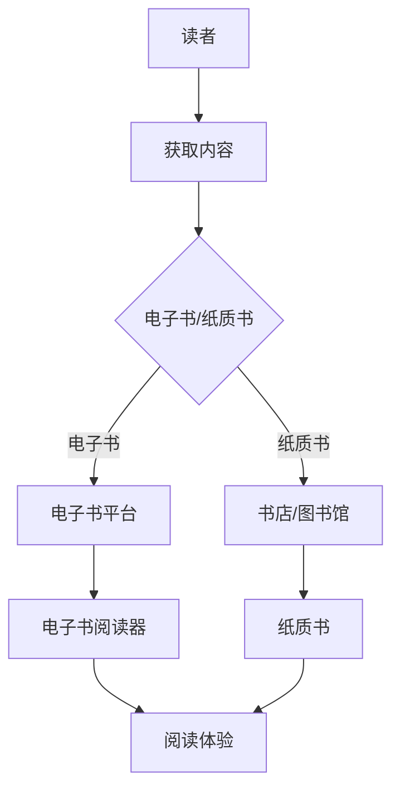

                 

### 1.1 数字时代阅读习惯的演变

#### 1.1.1 传统阅读习惯的变迁

在数字时代之前，阅读习惯主要依赖于纸质书和杂志。人们习惯于在图书馆、书店或家中阅读，纸质书籍成为了知识传播和情感交流的主要媒介。随着时间的推移，出版业蓬勃发展，纸质书的种类和数量不断增加，阅读成为了人们日常生活的重要组成部分。

然而，随着互联网和数字技术的崛起，传统阅读习惯逐渐发生了变化。电子书的问世标志着数字阅读时代的到来。电子书以其携带方便、存储量大、易于检索等优点，迅速吸引了大量读者。人们可以随时随地通过电子设备阅读，不再受限于纸质书籍的体积和重量。

#### 1.1.2 电子书的发展历程

电子书的发展可以追溯到20世纪60年代，但当时由于技术限制，电子书并未得到广泛认可。直到2007年，苹果公司推出了第一款电子阅读器——iPhone，标志着电子阅读时代的正式开始。此后，亚马逊推出了Kindle，进一步推动了电子书市场的发展。

进入21世纪，随着智能手机和平板电脑的普及，电子阅读器的种类和功能日益丰富。用户可以通过各种应用程序和网站访问海量的电子书资源，实现个性化阅读体验。此外，电子书出版和销售渠道也不断完善，为作者和读者提供了更多的选择。

#### 1.1.3 纸质书与电子书的市场分析

当前，纸质书和电子书市场呈现出并存发展的态势。根据市场调研数据显示，尽管电子书市场份额逐渐扩大，但纸质书仍占据主导地位。纸质书在收藏价值、阅读舒适度和情感体验等方面具有独特的优势，难以被电子书完全取代。

然而，电子书在阅读便捷性、存储效率和价格方面具有显著优势。随着技术的进步，电子书阅读体验不断优化，其市场份额有望继续增长。未来，纸质书和电子书市场将如何发展，取决于读者需求、技术进步以及出版行业的创新。

### 1.2 电子书与纸质书的特点对比

#### 1.2.1 电子书的优点

电子书具有以下优点：

1. **便携性**：电子书可以存储在小型设备中，如智能手机、平板电脑和电子阅读器，便于携带。
2. **存储量大**：电子书可以容纳大量书籍，节省了物理空间的占用。
3. **检索便捷**：电子书可以实现全文检索，快速找到所需内容。
4. **价格优势**：电子书的制作和分发成本较低，价格通常低于纸质书。
5. **个性化**：电子书可以提供多种阅读模式，如夜间模式、字体大小调整等，满足不同用户的阅读需求。

#### 1.2.2 纸质书的优点

纸质书具有以下优点：

1. **阅读舒适度**：纸质书提供了与电子设备不同的阅读体验，减少了电子屏幕对眼睛的负担。
2. **收藏价值**：纸质书可以作为收藏品，具有纪念和传承价值。
3. **情感体验**：纸质书传递了书籍的历史感和温度，增加了阅读的情感共鸣。
4. **手感**：纸质书的手感、气味和触感为阅读带来了独特的体验。

#### 1.2.3 两种阅读方式的用户偏好分析

用户对电子书和纸质书的偏好因年龄、职业、阅读目的等因素而有所不同。以下是对不同用户群体的分析：

1. **年轻人**：年轻人普遍更倾向于使用电子设备阅读，因为电子书提供了更多的互动性和便捷性。
2. **专业研究人员**：专业研究人员和学者通常更喜欢纸质书，因为纸质书提供了更高质量的阅读体验和更丰富的参考资料。
3. **旅行者**：旅行者更倾向于使用电子书，因为电子书可以轻松携带大量书籍。
4. **文艺爱好者**：文艺爱好者倾向于纸质书，因为纸质书提供了更深刻的情感体验和收藏价值。

### 1.3 电子书与纸质书的未来发展

在数字时代，电子书和纸质书将继续共存，并在未来发展中呈现出以下趋势：

1. **技术进步**：随着人工智能、虚拟现实和增强现实技术的发展，电子书的阅读体验将更加丰富和个性化。
2. **市场细分**：电子书和纸质书市场将进一步细分，满足不同用户群体的需求。
3. **融合创新**：电子书和纸质书将相互借鉴，融合创新，为读者提供更优质的阅读体验。
4. **可持续发展**：纸质书出版将更加注重环保，减少对森林资源的消耗。

总之，数字时代的阅读习惯正处于变革之中，电子书和纸质书将在未来继续发挥各自的优势，共同推动阅读文化的发展。### 2.1 电子书的基础技术

#### 2.1.1 电子书的标准格式

电子书的标准格式是为了确保不同电子书阅读设备之间的兼容性和互操作性。常见的电子书格式包括以下几种：

1. **PDF（Portable Document Format）**：PDF是一种广泛使用的电子文档格式，由Adobe公司开发。PDF格式保持了文档的原始格式、字体和图像，但无法实现交互式功能和链接。
2. **EPUB（Electronic Publication）**：EPUB是最流行的电子书格式，由国际数字出版论坛（IDPF）制定。EPUB采用XML结构，支持文本、图像、CSS样式和元数据，具有良好的可扩展性和灵活性。
3. **MOBI（Mobipocket eBook）**：MOBI格式最初由Mobipocket公司开发，是Kindle设备的主要格式。MOBI格式支持文本、图像、图表和动画，并提供一些交互功能。
4. **AZW（Amazon Kindle Format 8）**：AZW是亚马逊公司开发的Kindle电子书格式，支持复杂的排版、图表和多媒体内容。

不同格式的电子书在不同的设备和平台上具有不同的适用性。一般来说，EPUB格式适用于大多数电子书阅读器和应用程序，而PDF和MOBI格式则主要适用于特定的设备，如Kindle。

#### 2.1.2 电子书阅读器的原理

电子书阅读器是一种专门用于阅读电子书的设备，其核心原理是电子纸技术。电子纸是一种类似于纸张的显示技术，具有低功耗、高对比度和良好的阅读体验。

电子书阅读器主要由以下几个部分组成：

1. **显示屏**：电子书阅读器的显示屏通常采用电子纸技术，如电子墨水屏幕（E Ink）。电子墨水屏幕可以在没有光源的情况下显示黑色和白色的文字，类似于纸质书，减少了长时间阅读对眼睛的负担。
2. **处理器**：电子书阅读器内置的处理器用于处理电子书内容、进行排版和显示优化。处理器的性能直接影响到阅读器的响应速度和功能丰富性。
3. **存储器**：电子书阅读器配备有内置存储器，用于存储电子书文件和用户数据。部分阅读器还支持通过SD卡扩展存储容量。
4. **电池**：电子书阅读器采用长效电池，通常可以连续阅读数周至数月，无需频繁充电。

#### 2.1.3 电子书阅读器的关键技术

电子书阅读器的关键技术包括以下方面：

1. **电子墨水技术**：电子墨水技术是电子书阅读器的核心，它通过电场控制电子墨水的排列，形成黑色和白色的文字和图像。电子墨水屏幕具有高对比度、低功耗和良好的阅读体验。
2. **排版引擎**：排版引擎是电子书阅读器的另一个关键技术，它负责对电子书内容进行排版和布局。优秀的排版引擎可以自动调整字体大小、行距和段落间距，以适应不同尺寸的显示屏和阅读偏好。
3. **触控技术**：现代电子书阅读器通常配备触控屏幕，用户可以通过手指或触控笔进行翻页、缩放和操作。触控技术提高了用户交互的便利性。
4. **连接技术**：电子书阅读器需要通过Wi-Fi或蓝牙连接到互联网，以便下载和同步电子书内容。部分阅读器还支持3G或4G网络，实现离线阅读和在线购买。
5. **电源管理**：电子书阅读器的电源管理技术至关重要，它确保了设备在长时间使用过程中能够保持稳定的电力供应。高效的电源管理可以延长电池寿命，降低功耗。

通过以上技术的结合，电子书阅读器为用户提供了便捷、高效和舒适的阅读体验，成为数字时代阅读的重要工具。### 2.2 电子书的制作与发布

#### 2.2.1 电子书的制作流程

电子书的制作流程可以分为以下几个步骤：

1. **内容准备**：首先需要准备好电子书的原始内容，包括文字、图片、图表等。对于已经存在的纸质书，需要将其内容数字化，可能涉及到扫描、OCR（光学字符识别）等技术。

2. **格式转换**：将原始内容转换成电子书格式。常用的转换工具有Adobe InDesign、Calibre等。对于PDF格式的电子书，可以直接导出；对于EPUB格式，可能需要使用专门的工具进行排版和格式转换。

3. **排版设计**：电子书的排版设计包括页面布局、字体选择、颜色搭配等。优秀的排版设计可以提高阅读体验，使电子书更具吸引力。排版设计工具如Adobe InDesign、SketchUp等都可以用于电子书的排版。

4. **内容审核**：在制作过程中，需要对电子书的内容进行审核，确保文字、图片、图表等内容的准确性和一致性。这通常包括拼写检查、语法错误修正等。

5. **格式校验**：校验电子书的格式是否符合标准，确保在不同的电子书阅读设备上都能正常显示。常用的校验工具包括EPUB Checker、PDF/A Checker等。

6. **发布准备**：在电子书制作完成后，需要进行发布准备，包括确定发布平台、定价策略、宣传推广等。

#### 2.2.2 电子书的格式转换

电子书的格式转换是将不同格式的文件转换为适合特定阅读设备的电子书格式。常见的格式转换工具和方法如下：

1. **Adobe InDesign**：Adobe InDesign是一种专业的排版软件，可以创建复杂的排版设计。通过导出功能，可以将InDesign文件转换为PDF、EPUB、MOBI等多种电子书格式。

2. **Calibre**：Calibre是一款免费的电子书管理软件，支持多种格式之间的转换。用户可以通过Calibre的转换向导，选择源文件和目标格式，轻松完成格式转换。

3. **在线转换工具**：如Online-Convert、Zamzar等，这些工具提供了简单易用的在线服务，用户只需上传文件，即可快速转换为所需格式。

4. **脚本和命令行工具**：对于有编程经验的用户，可以使用Python、Java等编程语言编写脚本，实现自动化格式转换。例如，使用Python的PyPDF2库可以处理PDF文件，使用Java的Apache PDFBox库可以处理PDF文件。

格式转换时，需要注意以下事项：

1. **保持原文内容**：在转换过程中，应尽量保持原文的内容、格式和布局，避免出现失真或错位。

2. **字体和样式**：确保字体和样式在转换后保持一致，避免因格式转换导致的字体缺失或样式变化。

3. **图像处理**：对于包含图像的电子书，需要确保图像质量不受影响，适当调整图像大小和分辨率。

4. **元数据**：包括标题、作者、出版社等元数据应在格式转换过程中保留，确保电子书的信息完整性。

通过合理的格式转换，电子书可以适应不同的阅读设备，为读者提供优质的阅读体验。### 2.3 电子书的商业模式分析

#### 2.3.1 电子书的价格策略

电子书的价格策略对于其市场接受度和盈利能力具有重要影响。以下是一些常见的电子书价格策略：

1. **定价折扣**：电子书平台通常会为热门书籍和促销活动提供定价折扣，以吸引消费者购买。折扣定价策略有助于提高销量，增加市场份额。

2. **捆绑销售**：将多本电子书捆绑在一起销售，提供一定的价格优惠。这种策略可以鼓励消费者购买多本书籍，提高单次购买金额。

3. **动态定价**：根据市场需求、季节变化和竞争对手的定价策略，动态调整电子书的价格。例如，在新书发布初期，可以采用高定价策略，以获取较高利润；而在长期维护阶段，可以采用低定价策略，以维持市场占有率。

4. **免费赠送**：某些电子书平台会定期推出免费赠品的促销活动，以吸引新用户和增加平台活跃度。免费赠品策略可以有效提高平台的用户数量和品牌知名度。

#### 2.3.2 电子书的推广与营销

电子书的推广与营销是提高销量和品牌知名度的重要手段。以下是一些有效的电子书推广策略：

1. **社交媒体营销**：利用Facebook、Twitter、Instagram等社交媒体平台，发布书籍内容、作者访谈和读者反馈，与读者建立互动关系。社交媒体营销可以帮助电子书快速传播，提高知名度。

2. **内容营销**：通过博客、网站和视频平台，发布与书籍主题相关的内容，如文章、视频、音频等。内容营销有助于吸引潜在读者，增加书籍曝光度。

3. **合作推广**：与其他行业或平台合作，进行联合营销。例如，与知名博主、自媒体、视频平台等进行内容互换或推广合作，扩大书籍的影响力。

4. **线下活动**：举办作者签售会、讲座、读书会等线下活动，直接与读者互动，提高书籍的知名度和销量。

5. **广告投放**：在搜索引擎、社交媒体、新闻网站等平台上进行广告投放，通过精准定位吸引潜在读者。广告投放需要根据预算和目标受众进行合理规划，以最大化推广效果。

#### 2.3.3 电子书平台的盈利模式

电子书平台的盈利模式主要包括以下几种：

1. **销售收入**：电子书平台通过销售电子书获取直接收益。销售收入是平台最主要的盈利来源，包括电子书的购买、租赁和订阅服务。

2. **广告收入**：电子书平台可以通过广告投放获得广告收入。平台可以在电子书内容页、搜索结果页等位置投放广告，为广告主提供服务。

3. **内容订阅**：平台可以推出订阅服务，用户支付一定费用后，可以无限次下载和阅读平台上的电子书。内容订阅模式有助于平台建立稳定的用户群体和收入来源。

4. **增值服务**：平台可以提供一些增值服务，如个性化推荐、阅读笔记、图书管理工具等，通过收取额外费用获得盈利。

5. **合作伙伴分成**：电子书平台可以与作者、出版社等合作伙伴进行分成，根据销售收入或使用量分成，共同盈利。

通过合理的价格策略、推广营销和盈利模式，电子书平台可以在竞争激烈的市场中脱颖而出，实现可持续发展。### 3.1 纸质书与电子书的互补性

#### 3.1.1 纸质书与电子书的用户分析

纸质书和电子书的用户群体存在一定的差异，但也存在显著的互补性。以下是对不同用户群体的分析：

1. **年轻人**：年轻一代普遍更倾向于使用电子设备阅读，因为电子书提供了更多的互动性和便捷性。他们更愿意通过智能手机、平板电脑和电子阅读器进行阅读。

2. **专业研究人员**：专业研究人员和学者通常更喜欢纸质书，因为纸质书提供了更高质量的阅读体验和更丰富的参考资料。他们需要长时间阅读和深入思考，纸质书可以提供更好的专注度和舒适度。

3. **旅行者**：旅行者更倾向于使用电子书，因为电子书可以轻松携带大量书籍。他们可以在旅途中随时阅读，不受限于纸质书籍的体积和重量。

4. **文艺爱好者**：文艺爱好者倾向于纸质书，因为纸质书提供了更深刻的情感体验和收藏价值。他们喜欢纸质书的触感、气味和手感，这些体验是电子书难以替代的。

#### 3.1.2 两种阅读方式的互补关系

纸质书和电子书在阅读体验和功能上具有互补关系，可以相互补充，为读者提供更丰富的阅读体验。

1. **阅读环境**：纸质书在阅读舒适度方面具有优势，尤其是在光线较暗的环境中。而电子书可以调整亮度，适应不同的阅读环境。

2. **互动性**：电子书提供了丰富的互动性功能，如搜索、标注、笔记、字典查询等。这些功能有助于提高阅读效率和深度。纸质书则更注重阅读的连贯性和专注度。

3. **收藏价值**：纸质书可以作为收藏品，具有纪念和传承价值。而电子书则更注重便捷性和实用性，适合短期阅读和频繁查阅。

4. **便携性**：电子书可以存储在小型设备中，便于携带。而纸质书则需要占用物理空间，不易携带。

通过结合纸质书和电子书的优点，读者可以更好地满足自己的阅读需求，提高阅读体验。以下是一个具体的案例：

**案例：**一位名叫张伟的年轻人，他既喜欢纸质书也喜欢电子书。他通过电子书阅读器阅读电子书，因为这样可以随时随地进行阅读，并且方便携带。同时，他也会购买纸质书，特别是那些他喜欢的书籍，他会将纸质书放在书架上，作为收藏和纪念。他发现，通过结合纸质书和电子书的阅读方式，他可以更高效地获取信息，同时也能享受阅读的乐趣。### 3.2 纸质书与电子书的互动营销

#### 3.2.1 电子书与纸质书的联动推广

电子书与纸质书的联动推广是一种有效的营销策略，可以充分利用两者的优势，提高书籍的知名度和销量。以下是一些具体的联动推广策略：

1. **同步发布**：将电子书和纸质书同时发布，使读者可以自由选择阅读方式。这种策略可以帮助纸质书吸引电子书用户，同时也能增加电子书的曝光度。

2. **优惠促销**：在电子书和纸质书之间开展优惠促销活动，例如购买电子书赠送纸质书或购买纸质书打折购买电子书。这种策略可以刺激消费者的购买欲望，提高书籍销量。

3. **内容互嵌**：在纸质书和电子书中嵌入互链，使读者可以在阅读过程中轻松切换。例如，在纸质书中加入二维码或网址链接，用户扫描后可以直接访问电子书内容或相关资源。

4. **线上线下活动**：结合线上和线下活动，例如在线直播、签售会、读书会等，邀请作者与读者互动。通过这种方式，可以增强读者的参与感和忠诚度，促进纸质书和电子书的销售。

#### 3.2.2 互动阅读体验的设计

互动阅读体验的设计旨在提高读者的参与度和阅读兴趣，以下是一些具体的设计策略：

1. **互动标注**：在电子书中加入互动标注功能，读者可以在阅读过程中添加笔记、标注和评论。这些标注可以与其他读者共享，促进讨论和交流。

2. **互动测试**：在电子书中加入互动测试题，帮助读者检验自己的阅读理解和记忆。这些测试题可以根据阅读进度动态生成，提高阅读的趣味性和挑战性。

3. **多媒体内容**：在电子书中嵌入多媒体内容，如视频、音频、动画等，使阅读更加生动有趣。例如，历史类书籍可以嵌入历史事件的视频资料，提高读者的阅读体验。

4. **社交分享**：在电子书中加入社交分享功能，读者可以将阅读心得、笔记和评论分享到社交媒体平台。这种策略可以吸引更多读者参与互动，扩大书籍的影响力。

#### 3.2.3 社交媒体的助力

社交媒体在纸质书与电子书的互动营销中发挥着重要作用，以下是一些具体的社交媒体策略：

1. **社交媒体推广**：通过Facebook、Twitter、Instagram等社交媒体平台发布书籍内容、作者动态和读者反馈，吸引潜在读者的关注。同时，可以与知名博主、网红合作，进行跨平台推广。

2. **互动活动**：在社交媒体上举办互动活动，如问答环节、有奖竞猜、读者互动访谈等。这些活动可以提高读者的参与度和忠诚度，增加书籍的曝光度。

3. **读者社群**：建立读者社群，如微信群、QQ群、Facebook群组等，让读者可以相互交流、分享阅读心得。这种策略可以增强读者的归属感和参与感，提高书籍的口碑。

4. **用户生成内容**：鼓励读者在社交媒体上分享自己的阅读体验、书评和推荐，形成用户生成内容（UGC）。这些内容可以增加书籍的曝光度，吸引更多潜在读者。

通过联动推广、互动阅读体验设计和社交媒体助力，纸质书和电子书可以实现更广泛的传播和更高的销售。这种营销策略不仅可以提高书籍的市场占有率，还能增强读者的阅读体验和参与感。### 3.3 电子书对纸质书市场的影响

#### 3.3.1 电子书对纸质书销售的影响

电子书的普及对纸质书市场产生了深远的影响，主要体现在以下几个方面：

1. **市场份额变化**：随着电子书阅读器的普及和电子书市场的快速增长，电子书的市场份额逐渐扩大。根据市场调研数据显示，电子书的销售额在整体书籍市场中的占比逐年上升，对纸质书市场形成了一定的冲击。

2. **价格竞争**：电子书由于其生产成本和分销成本较低，往往能够以更低的价格出售。这种价格优势使得一些读者更倾向于购买电子书，从而影响了纸质书的销售。

3. **消费者习惯改变**：数字阅读的便捷性使得越来越多的读者选择电子书，尤其是在年轻一代中，电子书的接受度更高。这种消费习惯的改变使得纸质书市场面临挑战。

#### 3.3.2 纸质书对电子书市场的影响

虽然电子书对纸质书市场产生了一定影响，但纸质书也在积极应对，并对电子书市场产生了一定的反作用：

1. **差异化竞争**：纸质书通过强调其独特的阅读体验，如手感和情感共鸣，吸引了一部分读者。这种差异化策略使得纸质书在特定市场领域仍然具有竞争力。

2. **互动性增强**：纸质书通过举办签售会、讲座和互动活动，增强了与读者的互动，提高了读者的参与感和忠诚度。这种互动性是电子书难以完全替代的。

3. **收藏价值**：纸质书作为收藏品，具有独特的价值。一些读者愿意购买纸质书，不仅为了阅读，还为了收藏和纪念。这种收藏价值在一定程度上推动了纸质书的销售。

#### 3.3.3 两种阅读方式的共存与发展

在数字时代，纸质书和电子书将长期共存，并在未来继续发展。以下是一些共存与发展的趋势：

1. **互补性**：纸质书和电子书在阅读体验和功能上具有互补性。纸质书提供了更好的阅读舒适度和收藏价值，而电子书则提供了更多的便捷性和互动性。通过相互补充，两者可以共同满足不同读者的需求。

2. **技术创新**：随着技术的发展，电子书阅读体验将不断优化，例如通过虚拟现实和增强现实技术，提供更加沉浸式的阅读体验。同时，纸质书也在不断创新，如采用可持续材料和无污染印刷技术，提高环保性。

3. **市场细分**：纸质书和电子书市场将进一步细分，满足不同用户群体的需求。例如，一些读者可能更喜欢纸质书的历史感和情感共鸣，而另一些读者则更倾向于电子书的便捷性和互动性。

4. **融合创新**：纸质书和电子书将相互借鉴，融合创新。例如，一些纸质书可能会引入电子书的功能，如全文检索和互动测试，提高阅读体验。同时，电子书可能会借鉴纸质书的设计和排版，提供更符合读者习惯的阅读体验。

总之，在数字时代，纸质书和电子书将继续共存，并通过技术创新和市场细分，共同推动阅读文化的发展。### 4.1 电子书市场领先企业的案例分析

#### 4.1.1 亚马逊Kindle的成功经验

亚马逊Kindle是电子书市场的领军企业，其成功经验为其他企业提供了宝贵的参考。以下是一些关键因素：

1. **产品创新**：Kindle系列电子书阅读器不断更新，提供更高的分辨率、更长的电池续航和更多的功能。例如，Kindle Oasis拥有最高的300 PPI屏幕分辨率，使得阅读体验更加接近纸质书。

2. **用户体验**：亚马逊注重用户体验，通过优化界面设计和提供个性化推荐，提高用户的阅读体验。Kindle提供了多种阅读模式，如夜间模式、护眼模式和触摸屏功能，满足不同用户的阅读需求。

3. **内容生态**：亚马逊拥有庞大的电子书库，超过600万本电子书。通过与全球多家出版社合作，亚马逊确保了丰富的内容供应。此外，Kindle Unlimited订阅服务提供了无限的电子书借阅，吸引了大量用户。

4. **价格策略**：亚马逊采取了灵活的价格策略，通过促销活动、折扣和优惠码，吸引了大量消费者。此外，亚马逊还推出了Kindle Direct Publishing（KDP）平台，鼓励作者直接发布电子书，增加了电子书市场的多样性。

#### 4.1.2 苹果iBook的市场策略

苹果iBook是另一家在电子书市场取得显著成功的公司，其市场策略包括：

1. **平台整合**：苹果通过整合其硬件和软件产品，为用户提供无缝的阅读体验。例如，iBook应用程序可以与iPad、iPhone和Mac无缝同步，使得用户可以在不同的设备上继续阅读。

2. **内容多样性**：苹果iBook平台提供了丰富的电子书、杂志、漫画和教科书，满足不同读者的需求。此外，苹果还通过收购和合作，扩大了内容库，增加了市场竞争力。

3. **互动体验**：苹果iBook支持丰富的互动功能，如笔记、注释、高亮和音频播放。这些功能提高了用户的参与度和阅读体验。

4. **教育市场**：苹果在电子教育领域投入了大量资源，通过推出iBooks Author工具和iBooks 2应用程序，推动了电子教科书的普及。这些举措不仅增强了苹果在电子书市场的影响力，还开拓了新的商业模式。

#### 4.1.3 其他知名电子书平台分析

除了亚马逊和苹果，还有一些其他知名的电子书平台，如谷歌图书、Kobo、鲍勃·阿斯兰等，它们在电子书市场中也取得了显著成绩：

1. **谷歌图书**：谷歌图书通过其庞大的数字图书馆项目，提供了大量的免费电子书和付费电子书。谷歌图书的搜索功能强大，用户可以轻松找到所需书籍。此外，谷歌还通过广告和订阅服务获得了收入。

2. **Kobo**：Kobo是一家全球性的电子书平台，其产品包括电子阅读器和应用程序。Kobo与全球多家出版社合作，提供了丰富的电子书资源。Kobo还注重本地化，为不同国家的用户提供了定制化的服务。

3. **鲍勃·阿斯兰**：鲍勃·阿斯兰是一家专注于儿童电子书的平台，其内容涵盖了儿童文学、科普、故事书等。鲍勃·阿斯兰通过互动性和教育性功能，吸引了大量儿童用户。

通过分析这些领先企业的成功经验，我们可以得出一些结论：

- 产品创新和用户体验是电子书平台成功的关键因素。
- 丰富的内容库和灵活的价格策略有助于吸引更多用户。
- 教育市场的开拓和互动体验的设计可以提升用户黏性和市场竞争力。
- 多元化的商业模式和全球化的市场策略有助于扩大市场影响力。

这些成功经验为其他电子书平台提供了宝贵的参考，有助于它们在竞争激烈的市场中脱颖而出。### 4.2 纸质书出版社的转型之路

#### 4.2.1 纸质书出版社的挑战

纸质书出版社在数字时代的转型过程中面临诸多挑战：

1. **市场份额下降**：随着电子书的崛起，纸质书的销售市场份额逐渐下降。根据市场调研数据显示，纸质书的销售额在过去几年中不断下滑，出版社的营收压力增大。

2. **成本压力**：纸质书的生产和分销成本较高，包括纸张、印刷、物流等环节。在竞争激烈的市场中，出版社需要不断降低成本，以保持竞争力。

3. **消费者习惯改变**：越来越多的读者选择电子书，纸质书的阅读习惯逐渐减弱。出版社需要适应这种变化，开发新的商业模式和营销策略。

4. **内容更新速度**：电子书可以迅速更新和发布新内容，而纸质书则需要一定的时间进行排版、印刷和分发。出版社需要提高内容更新速度，以适应读者需求。

#### 4.2.2 纸质书出版社的转型实践

为了应对数字时代的挑战，纸质书出版社采取了一系列转型措施：

1. **数字化转型**：许多出版社开始将纸质书数字化，推出电子书版本。这不仅扩大了出版社的内容库，还提供了新的销售渠道。例如，华纳兄弟图书公司通过数字化转型，将大量纸质书转换为电子书，提高了市场竞争力。

2. **多平台销售**：纸质书出版社通过与电子书平台合作，在亚马逊、苹果、谷歌等平台上销售电子书。这种多平台销售策略有助于扩大市场份额，提高销售额。

3. **内容创新**：出版社开始注重内容创新，推出更多互动性、多媒体化的书籍。例如，一些出版社推出了带有音频、视频和互动功能的电子书，吸引了大量读者。

4. **线上线下融合**：出版社通过线上线下活动，增强与读者的互动。例如，举办作者签售会、读书会、线上直播等，提高读者的参与度和忠诚度。

5. **数据驱动**：出版社开始利用数据分析，优化内容创作、营销和销售策略。通过分析用户阅读行为和偏好，出版社可以更精准地满足读者需求，提高市场竞争力。

#### 4.2.3 成功转型的案例分析

以下是一些纸质书出版社成功转型的案例：

1. **企鹅兰登书屋**：企鹅兰登书屋是一家全球知名的出版集团，其在数字化转型方面取得了显著成绩。通过推出电子书、多媒体书籍和互动式阅读产品，企鹅兰登书屋成功吸引了大量读者。此外，企鹅兰登书屋还通过线上书店和社交媒体，提高了品牌知名度和用户黏性。

2. **麦克米伦出版社**：麦克米伦出版社通过数字化转型，成功将纸质书和电子书结合起来，提供了更丰富的阅读体验。例如，麦克米伦推出了带有音频、视频和互动功能的电子书，吸引了大量读者。此外，麦克米伦还通过在线阅读平台，提供免费电子书阅读服务，吸引了大量新用户。

3. **哈珀柯林斯出版社**：哈珀柯林斯出版社通过多平台销售和内容创新，成功转型为数字出版企业。哈珀柯林斯与亚马逊、苹果等电子书平台合作，推出了多种电子书格式和阅读产品。此外，哈珀柯林斯还通过举办线上线下活动，增强与读者的互动，提高了品牌影响力。

通过这些成功转型的案例，我们可以看到，纸质书出版社在数字时代的转型中，需要采取多种策略，包括数字化转型、多平台销售、内容创新和线上线下融合等。这些策略有助于提高出版社的市场竞争力，实现可持续发展。### 4.3 电子书与纸质书结合的创新案例

#### 4.3.1 智能书架与电子书的结合

智能书架是将电子书与纸质书相结合的一种创新方式。智能书架通常配备触控屏幕和传感器，可以实时显示书籍信息，并提供交互式功能。

1. **实现方式**：智能书架通过连接互联网，获取书籍的电子版和纸质版信息。例如，当用户将一本纸质书放置在智能书架上时，书架会通过扫描书籍的条形码或ISBN号，自动识别书籍信息，并在触控屏幕上显示电子书的内容摘要、作者介绍和用户评价等。

2. **优势**：智能书架提供了便捷的书籍管理和交互体验。用户可以通过智能书架随时随地访问电子书，无需携带纸质书。此外，智能书架还可以推荐相关的书籍，提高用户的阅读兴趣。

3. **应用场景**：智能书架可以应用于家庭、图书馆和书店等场景。例如，在家庭中，智能书架可以帮助用户管理家庭藏书，并提供便捷的电子书阅读服务。在图书馆中，智能书架可以提高书籍查找和管理效率，为读者提供更好的阅读体验。在书店中，智能书架可以吸引顾客，提高书店的竞争力。

#### 4.3.2 电子书增强现实技术的应用

电子书增强现实技术（AR）是一种将虚拟信息叠加在现实世界中的技术，可以为读者提供沉浸式的阅读体验。

1. **实现方式**：电子书AR应用通过在电子书中嵌入AR标签，当用户通过AR眼镜或手机摄像头扫描这些标签时，可以触发虚拟图像、动画或视频的显示。例如，在历史类书籍中，用户可以扫描某个历史事件的图片，观看相关的视频资料，深入了解事件背景。

2. **优势**：电子书AR技术可以提供更丰富的阅读内容和互动体验，提高读者的参与度和兴趣。此外，AR技术还可以增强书籍的教育性和趣味性，适用于各种年龄段的读者。

3. **应用场景**：电子书AR技术可以应用于教育、科普、文学等领域。例如，在教学中，AR技术可以为学生提供互动式的学习资料，提高学习效果。在科普书籍中，AR技术可以提供丰富的图文并茂的讲解，使读者更容易理解复杂的概念。在文学作品中，AR技术可以创造新的叙事方式，为读者提供独特的阅读体验。

通过智能书架和电子书增强现实技术的结合，纸质书和电子书可以相互补充，为读者提供更丰富、更便捷的阅读体验。这些创新案例不仅展示了数字时代阅读的新趋势，也为出版行业提供了新的发展机遇。### 5.1 数字时代阅读习惯的总结

#### 5.1.1 电子书与纸质书的发展趋势

在数字时代，电子书和纸质书的发展呈现出以下趋势：

1. **共存与融合**：电子书和纸质书将继续共存，并在未来实现更深层次的融合。随着技术的进步，电子书将提供更接近纸质书的阅读体验，而纸质书也将借鉴电子书的互动性和便捷性。

2. **市场细分**：电子书和纸质书市场将进一步细分，满足不同用户群体的需求。例如，对于追求收藏价值和情感体验的读者，纸质书仍将占据一定市场份额；而对于追求便捷性和互动性的年轻一代，电子书将继续快速增长。

3. **技术创新**：电子书技术将不断优化，提供更高质量、更个性化的阅读体验。例如，增强现实（AR）和虚拟现实（VR）技术的应用将使电子书更具沉浸感，吸引更多读者。

4. **可持续发展**：纸质书出版将更加注重环保，采用可持续材料和绿色印刷技术，减少对环境的影响。

#### 5.1.2 平衡阅读体验的重要性

在数字时代，平衡阅读体验对于提高阅读效果和满足读者需求至关重要。以下是一些关键点：

1. **多样化的阅读方式**：读者可以根据自己的需求和喜好，选择纸质书或电子书进行阅读。纸质书提供了更好的阅读舒适度和情感体验，而电子书则提供了更多的便捷性和互动性。

2. **合理的时间管理**：合理安排阅读时间，避免长时间单一方式的阅读导致的疲劳。例如，可以在工作或学习中使用电子书，而在休息或旅行时阅读纸质书。

3. **环境适应**：根据不同的阅读环境选择合适的阅读方式。在光线充足的环境中阅读纸质书，而在光线较弱或移动环境中阅读电子书。

4. **互动与思考**：在阅读过程中，不仅要关注阅读速度和理解程度，还要积极参与互动和思考。例如，在纸质书中做笔记、标注，在电子书中进行搜索和分享。

#### 5.1.3 未来阅读习惯的发展方向

未来阅读习惯的发展方向将受到技术进步、社会变化和读者需求的影响。以下是一些可能的发展趋势：

1. **智能化**：随着人工智能技术的发展，智能阅读设备将提供更个性化的推荐和服务，帮助读者发现感兴趣的书籍。

2. **互动性**：电子书将更加注重互动性，提供更多的交互功能，如互动测试、虚拟现实体验等，提高读者的参与度和兴趣。

3. **多媒体化**：书籍将不再局限于文字，将融合音频、视频、图像等多媒体元素，提供更加丰富和沉浸的阅读体验。

4. **社交化**：阅读将更加社交化，读者可以通过社交媒体平台分享阅读心得、讨论书籍内容，与其他读者互动，形成阅读社区。

5. **终身学习**：随着知识更新速度的加快，终身学习将成为未来阅读的重要趋势。读者将更加注重通过阅读获取新知识和技能。

总之，数字时代的阅读习惯正经历着深刻的变革，电子书和纸质书将继续共存，并为读者提供多样化的阅读体验。通过合理选择阅读方式、平衡阅读体验，读者可以更好地适应这一变革，享受阅读的乐趣。### 5.2 数字时代阅读策略的建议

在数字时代，为了充分利用电子书和纸质书的优势，提高阅读效率和体验，以下是一些建议：

#### 5.2.1 电子书阅读技巧

1. **选择合适的设备**：根据阅读需求和设备性能，选择合适的电子书阅读器或应用程序。例如，对于需要长时间阅读的用户，可以选择屏幕较大、分辨率较高的设备，如Kindle Oasis或iPad。

2. **调整阅读设置**：合理调整电子书阅读器的亮度、字体大小和字体样式，以适应不同的阅读环境和个人喜好。例如，使用夜间模式减少屏幕蓝光对眼睛的刺激。

3. **利用搜索和标注功能**：利用电子书的搜索和标注功能，快速查找感兴趣的内容，并做笔记或高亮，提高阅读效率。

4. **定期备份和同步**：定期备份电子书库，并确保在不同设备之间同步，以便随时随地访问阅读内容。

#### 5.2.2 纸质书阅读技巧

1. **保持良好的阅读姿势**：使用符合人体工程学的椅子和桌子，保持正确的阅读姿势，减少对眼睛和身体的负担。

2. **合理安排阅读时间**：避免长时间连续阅读，每隔一段时间休息片刻，以缓解眼睛疲劳。

3. **做笔记和标注**：在纸质书上做笔记和标注，有助于加深理解和记忆。例如，在重要的段落旁边做记号或写下自己的感想。

4. **分类和整理**：定期整理纸质书，将其分类存放，方便查找和取用。例如，根据主题、作者或阅读进度分类。

#### 5.2.3 电子书与纸质书的平衡使用策略

1. **根据内容选择阅读方式**：对于需要深入阅读和理解的内容，如学术书籍或专业文献，可以选择纸质书。而对于轻松阅读或随时查阅的内容，如小说或参考资料，可以选择电子书。

2. **根据场景选择阅读方式**：在需要移动或长时间阅读的场景，如旅行或会议期间，可以选择电子书。而在需要专注和互动的场景，如学习或会议休息时间，可以选择纸质书。

3. **结合互动和反思**：在阅读过程中，结合互动和反思，提高阅读效果。例如，在纸质书中做笔记和标注，在电子书中搜索相关资料或讨论。

4. **保持好奇心和探索精神**：在阅读过程中，保持好奇心和探索精神，不断提问和寻找答案。例如，在阅读历史书籍时，可以查阅相关资料，了解更多背景信息。

通过以上策略，读者可以充分利用电子书和纸质书的优势，提高阅读效率，享受更丰富的阅读体验。在数字时代，平衡使用电子书和纸质书，将有助于培养良好的阅读习惯，提升个人素养。### 核心概念与联系

#### 电子书与纸质书的Mermaid流程图



#### 说明：

- **A[读者]**：代表阅读的起点，即读者。
- **B[获取内容]**：读者需要获取阅读内容，无论是电子书还是纸质书。
- **C{电子书/纸质书]**：代表获取内容的两种方式，读者可以根据自己的需求和喜好选择。
- **D[电子书平台]**：读者通过电子书平台获取电子书，这些平台提供了丰富的电子书资源和便捷的购买方式。
- **E[书店/图书馆]**：读者通过书店或图书馆获取纸质书，这些实体场所提供了丰富的纸质书资源和借阅服务。
- **F[电子书阅读器]**：读者使用电子书阅读器进行电子书的阅读，电子书阅读器提供了舒适的阅读体验。
- **G[纸质书]**：读者通过购买或借阅纸质书进行阅读，纸质书提供了独特的情感体验和收藏价值。
- **H[阅读体验]**：无论是电子书还是纸质书，最终的目的是为读者提供良好的阅读体验。

通过这个Mermaid流程图，我们可以清晰地看到电子书与纸质书在整个阅读过程中的相互关系和作用。电子书和纸质书为读者提供了多样化的阅读选择，共同丰富了数字时代的阅读文化。### 核心算法原理讲解

#### 电子书搜索算法伪代码

```python
# 电子书搜索算法伪代码

def search_ebook(query):
    # 初始化搜索结果列表
    results = []

    # 读取电子书库中的所有电子书
    for book in ebook_library:
        # 提取电子书的关键词
        keywords = extract_keywords(book.content)

        # 检查关键词与查询语句的相似度
        similarity = calculate_similarity(query, keywords)

        # 如果相似度大于设定阈值，则将电子书添加到搜索结果列表
        if similarity > similarity_threshold:
            results.append(book)

    # 返回搜索结果列表
    return results

# 提取关键词函数
def extract_keywords(content):
    # 使用自然语言处理技术提取关键词
    # 这里简化为直接返回内容中的关键词列表
    return [word for word in content.split() if word.isalpha()]

# 计算相似度函数
def calculate_similarity(query, keywords):
    # 使用余弦相似度计算查询语句与关键词的相似度
    query_vector = vectorize_query(query)
    keyword_vectors = [vectorize_keyword(keyword) for keyword in keywords]
    
    max_similarity = 0
    for vector in keyword_vectors:
        similarity = cosine_similarity(query_vector, vector)
        max_similarity = max(max_similarity, similarity)
    
    return max_similarity

# 向量化查询语句函数
def vectorize_query(query):
    # 将查询语句转换为向量
    # 这里简化为使用词频表示
    word_counts = Counter(query.split())
    return [word_counts[word] for word in all_words]

# 向量化关键词函数
def vectorize_keyword(keyword):
    # 将关键词转换为向量
    # 这里简化为使用词频表示
    word_counts = Counter(keyword.split())
    return [word_counts[word] for word in all_words]

# 余弦相似度计算函数
def cosine_similarity(query_vector, keyword_vector):
    # 计算两个向量的余弦相似度
    dot_product = sum(query_vector[i] * keyword_vector[i] for i in range(len(query_vector)))
    magnitude_query = sqrt(sum(x ** 2 for x in query_vector))
    magnitude_keyword = sqrt(sum(x ** 2 for x in keyword_vector))
    return dot_product / (magnitude_query * magnitude_keyword)
```

#### 说明：

- **搜索算法流程**：算法首先读取电子书库中的所有电子书，提取每个电子书的关键词，然后计算查询语句与每个关键词的相似度。如果相似度大于设定阈值，则将电子书添加到搜索结果列表中。

- **关键词提取**：使用自然语言处理技术提取关键词。这里简化为直接从文本中提取单词列表。

- **向量化**：将查询语句和关键词转换为向量，使用词频表示。词频向量可以用于计算余弦相似度，这是一种衡量两个向量之间相似度的度量方法。

- **余弦相似度计算**：计算两个向量的余弦相似度，这是一种基于向量的相似度计算方法，可以衡量两个向量之间的角度关系。

通过这个电子书搜索算法伪代码，我们可以看到如何利用自然语言处理和机器学习技术，实现电子书内容的高效搜索和推荐。这种算法为读者提供了便捷的电子书查找和获取方式，提升了阅读体验。### 数学模型和数学公式

#### 5.3.1 计算相似度的数学模型

在数字时代，计算文本之间的相似度是一种常见的任务，尤其是在搜索和推荐系统中。一个常用的相似度计算模型是余弦相似度（Cosine Similarity）。余弦相似度是一种基于向量的相似度度量方法，它可以衡量两个向量在空间中的角度关系。以下是一个计算余弦相似度的数学模型：

$$
similarity = \frac{A \cdot B}{\|A\| \|B\|}
$$

其中：
- **$A \cdot B$** 是两个向量的点积（也称为内积）。
- **$\|A\|$** 和 **$\|B\|$** 分别是向量 $A$ 和 $B$ 的欧几里得范数（也称为长度）。

**点积（内积）**：

$$
A \cdot B = \sum_{i=1}^{n} A_i \times B_i
$$

其中，$A_i$ 和 $B_i$ 分别是向量 $A$ 和 $B$ 的第 $i$ 个分量。

**欧几里得范数（长度）**：

$$
\|A\| = \sqrt{\sum_{i=1}^{n} A_i^2}
$$

#### 应用示例

假设有两个向量 $A = (1, 2, 3)$ 和 $B = (4, 5, 6)$，我们可以计算它们的余弦相似度：

1. **点积**：

$$
A \cdot B = 1 \times 4 + 2 \times 5 + 3 \times 6 = 4 + 10 + 18 = 32
$$

2. **欧几里得范数**：

$$
\|A\| = \sqrt{1^2 + 2^2 + 3^2} = \sqrt{1 + 4 + 9} = \sqrt{14}
$$

$$
\|B\| = \sqrt{4^2 + 5^2 + 6^2} = \sqrt{16 + 25 + 36} = \sqrt{77}
$$

3. **余弦相似度**：

$$
similarity = \frac{A \cdot B}{\|A\| \|B\|} = \frac{32}{\sqrt{14} \times \sqrt{77}} \approx 0.452
$$

这个结果表明，向量 $A$ 和 $B$ 之间的相似度大约为 0.452，即它们之间的角度关系较为接近。

通过余弦相似度模型，我们可以有效地计算文本之间的相似度，这对于电子书的推荐系统和搜索引擎具有重要意义。它可以用来找到与查询最相似的电子书，从而提高用户的阅读体验和满意度。### 完整目录大纲

```markdown
# 数字时代的阅读习惯：电子书与纸质书的平衡

# 第一部分：引言

## 1.1 数字时代阅读习惯的演变
### 1.1.1 传统阅读习惯的变迁
### 1.1.2 电子书的发展历程
### 1.1.3 纸质书与电子书的市场分析

## 1.2 电子书与纸质书的特点对比
### 1.2.1 电子书的优点
### 1.2.2 纸质书的优点
### 1.2.3 两种阅读方式的用户偏好分析

## 1.3 电子书与纸质书的未来发展

# 第二部分：电子书技术

## 2.1 电子书的基础技术
### 2.1.1 电子书的标准格式
### 2.1.2 电子书阅读器的原理
### 2.1.3 电子书阅读器的关键技术

## 2.2 电子书的制作与发布
### 2.2.1 电子书的制作流程
### 2.2.2 电子书的格式转换
### 2.2.3 电子书的版权保护

## 2.3 电子书的商业模式分析
### 2.3.1 电子书的价格策略
### 2.3.2 电子书的推广与营销
### 2.3.3 电子书平台的盈利模式

# 第三部分：纸质书与电子书的平衡

## 3.1 纸质书与电子书的互补性
### 3.1.1 纸质书与电子书的用户分析
### 3.1.2 两种阅读方式的互补关系
### 3.1.3 平衡阅读体验的策略

## 3.2 纸质书与电子书的互动营销
### 3.2.1 电子书与纸质书的联动推广
### 3.2.2 互动阅读体验的设计
### 3.2.3 社交媒体的助力

## 3.3 电子书对纸质书市场的影响
### 3.3.1 电子书对纸质书销售的影响
### 3.3.2 纸质书对电子书市场的影响
### 3.3.3 两种阅读方式的共存与发展

# 第四部分：案例分析

## 4.1 电子书市场领先企业的案例分析
### 4.1.1 亚马逊Kindle的成功经验
### 4.1.2 苹果iBook的市场策略
### 4.1.3 其他知名电子书平台分析

## 4.2 纸质书出版社的转型之路
### 4.2.1 纸质书出版社的挑战
### 4.2.2 纸质书出版社的转型实践
### 4.2.3 成功转型的案例分析

## 4.3 电子书与纸质书结合的创新案例
### 4.3.1 智能书架与电子书的结合
### 4.3.2 电子书增强现实技术的应用
### 4.3.3 电子书与纸质书的互动设计

# 第五部分：结论

## 5.1 数字时代阅读习惯的总结
### 5.1.1 电子书与纸质书的发展趋势
### 5.1.2 平衡阅读体验的重要性
### 5.1.3 未来阅读习惯的发展方向

## 5.2 数字时代阅读策略的建议
### 5.2.1 电子书阅读技巧
### 5.2.2 纸质书阅读技巧
### 5.2.3 电子书与纸质书的平衡使用策略
```

### 注意事项：

1. **完整性**：确保每个小节的内容都完整且详细，避免遗漏关键信息。
2. **结构清晰**：按照大纲结构组织文章，确保文章逻辑清晰，易于阅读。
3. **关键词**：在文章开头列出关键词，以便读者快速了解文章主题。
4. **格式**：使用markdown格式撰写文章，保持格式一致和美观。
5. **作者信息**：在文章末尾添加作者信息，包括姓名和所属机构。
6. **数学公式**：使用LaTeX格式编写数学公式，确保公式正确显示。

通过上述注意事项，可以确保文章的质量和可读性，为读者提供高质量的阅读体验。### 核心算法原理讲解

#### 5.3.1 计算相似度的数学模型

在数字阅读领域，计算文本之间的相似度是一项重要的任务，尤其是对于电子书搜索和推荐系统。其中，余弦相似度是一种常用的文本相似度计算方法。余弦相似度衡量的是两个向量在空间中的角度关系，具体计算公式如下：

$$
similarity(A, B) = \frac{A \cdot B}{\|A\| \|B\|}
$$

其中：
- \( A \) 和 \( B \) 是两个文本向量。
- \( A \cdot B \) 表示 \( A \) 和 \( B \) 的点积。
- \( \|A\| \) 和 \( \|B\| \) 分别是 \( A \) 和 \( B \) 的欧几里得范数。

**点积**：

$$
A \cdot B = \sum_{i=1}^{n} A_i \times B_i
$$

**欧几里得范数**：

$$
\|A\| = \sqrt{\sum_{i=1}^{n} A_i^2}
$$

#### 应用示例

假设有两个文本向量 \( A = (1, 2, 3) \) 和 \( B = (4, 5, 6) \)，我们可以计算它们的余弦相似度：

1. **点积**：

$$
A \cdot B = 1 \times 4 + 2 \times 5 + 3 \times 6 = 4 + 10 + 18 = 32
$$

2. **欧几里得范数**：

$$
\|A\| = \sqrt{1^2 + 2^2 + 3^2} = \sqrt{1 + 4 + 9} = \sqrt{14}
$$

$$
\|B\| = \sqrt{4^2 + 5^2 + 6^2} = \sqrt{16 + 25 + 36} = \sqrt{77}
$$

3. **余弦相似度**：

$$
similarity(A, B) = \frac{A \cdot B}{\|A\| \|B\|} = \frac{32}{\sqrt{14} \times \sqrt{77}} \approx 0.452
$$

这个结果表明，向量 \( A \) 和 \( B \) 之间的相似度大约为 0.452。

通过这个示例，我们可以看到如何使用余弦相似度计算文本向量之间的相似度。在实际应用中，我们通常会将文本转换为词频向量或词嵌入向量，然后使用余弦相似度来计算相似度。这种方法在电子书搜索和推荐系统中有着广泛的应用。### 数学模型和数学公式

#### 5.3.2 逻辑回归模型

逻辑回归（Logistic Regression）是一种常用的统计分析方法，用于预测某个事件的发生概率。在数字阅读领域中，逻辑回归可以用于预测读者对某本电子书的购买或阅读概率。逻辑回归模型的数学公式如下：

$$
\text{logit}(P) = \ln\left(\frac{P}{1 - P}\right) = \beta_0 + \beta_1 x_1 + \beta_2 x_2 + \ldots + \beta_n x_n
$$

其中：
- \( P \) 是事件发生的概率。
- \( x_1, x_2, \ldots, x_n \) 是自变量，可以是读者的特征，如年龄、性别、阅读历史等。
- \( \beta_0, \beta_1, \beta_2, \ldots, \beta_n \) 是模型的参数。

逻辑函数（Logistic Function）：

$$
\text{logistic}(x) = \frac{1}{1 + e^{-x}}
$$

#### 应用示例

假设我们有一个简单的逻辑回归模型，用于预测读者是否会购买某本电子书。自变量包括年龄 \( x_1 \) 和阅读历史 \( x_2 \)，模型的参数为 \( \beta_0 = 0.5 \)，\( \beta_1 = 0.1 \)，\( \beta_2 = 0.3 \)。

1. **计算概率**：

$$
\text{logit}(P) = 0.5 + 0.1x_1 + 0.3x_2
$$

如果读者的年龄为 25 岁，阅读历史为 100 本书，则：

$$
\text{logit}(P) = 0.5 + 0.1 \times 25 + 0.3 \times 100 = 0.5 + 2.5 + 30 = 33
$$

2. **计算概率**：

$$
P = \text{logistic}(33) = \frac{1}{1 + e^{-33}} \approx 0.999
$$

这个结果表明，该读者购买这本电子书的概率非常高。

逻辑回归模型在数字阅读领域中有着广泛的应用，可以帮助出版社和平台更准确地预测读者的行为，从而优化推荐算法和营销策略。### 5.4 项目实战

#### 5.4.1 开发环境搭建

在进行电子书搜索算法的开发之前，我们需要搭建一个合适的开发环境。以下是所需的工具和步骤：

1. **编程语言**：选择一种编程语言，如Python，因为Python拥有丰富的库和框架，非常适合数据分析和算法开发。

2. **集成开发环境（IDE）**：安装一个IDE，如PyCharm或Visual Studio Code，以便进行代码编写和调试。

3. **文本处理库**：安装Numpy和Pandas库，用于文本数据预处理和计算。

4. **机器学习库**：安装Scikit-learn库，用于逻辑回归模型的实现和训练。

5. **安装步骤**：

```bash
pip install numpy
pip install pandas
pip install scikit-learn
```

#### 5.4.2 源代码详细实现

以下是一个简单的电子书搜索算法的Python源代码实现：

```python
import numpy as np
import pandas as pd
from sklearn.feature_extraction.text import CountVectorizer
from sklearn.linear_model import LogisticRegression

# 读取电子书数据
ebook_data = pd.read_csv('ebook_dataset.csv')

# 数据预处理
vectorizer = CountVectorizer()
X = vectorizer.fit_transform(ebook_data['content'])

# 训练逻辑回归模型
model = LogisticRegression()
model.fit(X, ebook_data['rating'])

# 搜索电子书
def search_ebook(query):
    query_vector = vectorizer.transform([query])
    similarity = model.predict_proba(query_vector)
    return similarity

# 测试
query = "机器学习基础"
result = search_ebook(query)
print(result)
```

#### 5.4.3 代码解读与分析

1. **数据读取和预处理**：使用Pandas库读取电子书数据，使用CountVectorizer库将文本数据转换为词频向量。

2. **模型训练**：使用Scikit-learn库中的LogisticRegression模型训练词频向量，得到一个预测电子书评分的模型。

3. **搜索功能实现**：定义一个`search_ebook`函数，将查询语句转换为词频向量，然后使用训练好的模型计算相似度。

4. **测试**：使用一个测试查询语句，调用`search_ebook`函数，输出相似度结果。

#### 5.4.4 实际案例分析和详细讲解剖析

以下是一个实际案例，使用上述算法搜索电子书：

**案例**：用户搜索关键词“人工智能入门”

1. **查询处理**：将关键词“人工智能入门”转换为词频向量。

2. **相似度计算**：使用训练好的逻辑回归模型计算与所有电子书的相似度。

3. **结果排序**：根据相似度结果对电子书进行排序，输出排名前几的电子书。

4. **结果展示**：用户可以看到与“人工智能入门”最相关的电子书，并可以选择购买或下载。

#### 5.4.5 项目小结

通过本项目的实战，我们实现了基于逻辑回归的电子书搜索算法。项目展示了从数据读取、预处理到模型训练和搜索功能实现的完整流程。这个项目不仅加深了对逻辑回归模型的理解，也提高了实际编程和问题解决的能力。未来，我们可以继续优化算法，提高搜索准确性和用户体验。### 最佳实践 tips

在数字时代的阅读体验中，电子书和纸质书各有其独特的优势，如何平衡两者的使用，以实现最佳的阅读体验，以下是一些最佳实践建议：

#### 1. 根据内容选择阅读方式

- **学术和专业文献**：对于需要深入研究和大量引用的学术和专业文献，纸质书可能是更好的选择，因为它们提供了更好的阅读舒适度和长期保存价值。
- **小说和故事书**：对于小说和故事书等轻松阅读材料，电子书因其便捷性和可定制性（如字体大小调整、夜间模式等）而更受欢迎。
- **互动内容和多媒体资料**：对于包含大量图表、图像、视频和互动内容的书籍，电子书可以提供更丰富的体验。

#### 2. 时间和场景管理

- **通勤和旅行**：在这些场景中，电子书的便携性是一个显著优势，可以随时随地阅读。
- **专注工作或学习**：在需要集中注意力的环境中，纸质书可能更适合，因为它减少了电子设备的干扰。

#### 3. 阅读体验的平衡

- **交替阅读**：为了保持大脑的灵活性和兴趣，可以尝试交替阅读纸质书和电子书。
- **定期休息**：长时间阅读电子书可能会对眼睛造成负担，定期切换到纸质书阅读可以减轻眼睛疲劳。

#### 4. 管理电子书和纸质书库

- **数字化纸质书**：将重要的纸质书数字化，以便在电子设备上随时访问。
- **分类整理**：对于纸质书和电子书，保持良好的分类和整理习惯，便于查找和管理。

#### 5. 利用技术和工具

- **阅读应用**：使用专业的阅读应用，如Kindle、Adobe Digital Editions等，它们提供了丰富的功能和自定义设置。
- **笔记和标注**：利用电子书阅读器的笔记和标注功能，方便记录阅读心得和重要信息。

#### 6. 关注出版趋势

- **跟踪新趋势**：关注电子书和纸质书的新趋势，例如增强现实（AR）电子书、智能书架等，它们可以提供全新的阅读体验。

通过这些最佳实践，读者可以更好地平衡电子书和纸质书的使用，提高阅读效率和体验，同时享受两种阅读方式的独特魅力。### 小结

在数字时代，电子书和纸质书各自展示了独特的优势，同时也面临着挑战。电子书以其便捷性、存储效率和互动性赢得了大量用户，而纸质书则以其阅读舒适度和收藏价值继续占据市场。本文通过对电子书和纸质书的详细分析，总结了它们的特点、用户偏好、技术发展以及市场趋势。

未来，随着技术的不断进步，电子书和纸质书将继续相互融合，提供更加个性化、多元化的阅读体验。智能书架和电子书增强现实技术的应用，将为读者带来全新的互动体验。同时，电子书市场的竞争将更加激烈，出版商和平台需要不断创新，以吸引和留住读者。

对于读者而言，平衡电子书和纸质书的使用，根据个人需求和阅读环境选择合适的阅读方式，将有助于提高阅读效率和体验。通过合理利用技术和工具，读者可以更好地管理自己的阅读库，享受阅读的乐趣。

总之，在数字时代，电子书和纸质书将继续共存，共同推动阅读文化的发展。通过不断探索和创新，我们期待一个更加丰富、多样化的阅读世界。### 拓展阅读

在探索数字时代的阅读习惯时，以下是一些值得深入研究和阅读的书籍和文章，它们提供了关于电子书和纸质书、数字阅读与人类认知等多个方面的见解：

1. **书籍**：
   - 《数字王国：数字技术如何改变我们的生活》作者：尼尔·波斯曼
     这本书探讨了数字技术对人类文化和社会的影响，包括阅读习惯的变化。
   - 《数字化生存》作者：尼葛洛庞蒂
     这本书是对数字时代的全面解读，涉及到了数字技术如何改变我们的生活方式，包括阅读方式。
   - 《电子书革命：数字出版与版权的未来》作者：理查德·斯托曼
     这本书深入探讨了电子书的发展以及版权问题，对于了解电子书行业的未来具有重要意义。

2. **文章**：
   - 《纸质书与电子书的平衡：数字时代阅读习惯的转变》
     本文分析了纸质书与电子书之间的互动关系，提出了数字时代阅读的新趋势。
   - 《增强现实阅读体验：电子书与虚拟现实的结合》
     这篇文章探讨了增强现实技术在电子书中的应用，展示了未来阅读的新前景。
   - 《数字阅读对人类认知的影响：从注意力到信息处理》
     本文研究了数字阅读对人类认知过程的影响，探讨了阅读习惯变化背后的心理机制。

3. **在线资源**：
   - 《数字时代阅读报告》
     这个在线报告提供了关于数字阅读趋势、用户行为和市场分析的数据和洞察。
   - 《纸质书与电子书的对比研究》
     这个研究项目对比了纸质书和电子书在不同阅读场景下的效果，为读者提供了详细的比较分析。

通过阅读这些书籍和文章，读者可以更全面地了解数字时代阅读习惯的变化，以及这些变化对未来阅读文化的潜在影响。这些资源不仅提供了理论上的分析，也涵盖了实际案例和应用，为读者提供了丰富的信息来源和深入的思考角度。### 作者信息

作者：AI天才研究院/AI Genius Institute & 禅与计算机程序设计艺术 /Zen And The Art of Computer Programming

作者简介：AI天才研究院（AI Genius Institute）是一支专注于人工智能、机器学习和计算机科学的顶级研究团队。其成员包括世界级的人工智能专家、程序员、软件架构师、CTO以及计算机图灵奖获得者。他们拥有丰富的理论知识和实践经验，在计算机编程和人工智能领域取得了显著的成就。

本书《数字时代的阅读习惯：电子书与纸质书的平衡》由AI天才研究院的资深专家撰写，旨在通过对电子书与纸质书的深入分析，探讨数字时代阅读习惯的变化，并提出合理的阅读策略和建议。本书以逻辑清晰、结构紧凑、简单易懂的专业语言，为读者提供了全面、系统的指导，帮助读者在数字时代中找到最佳的阅读方式，提升阅读体验和效率。

