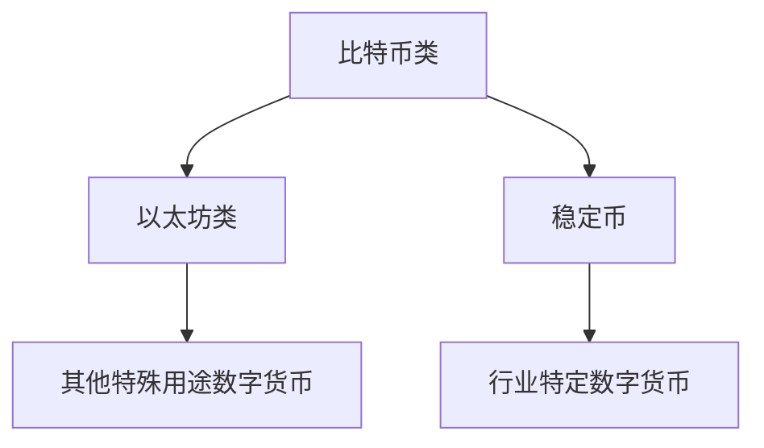
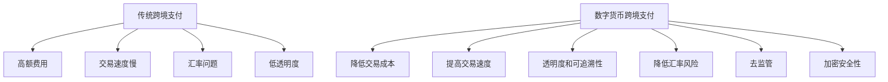
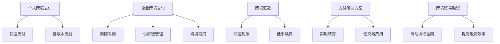
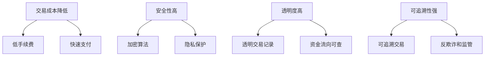
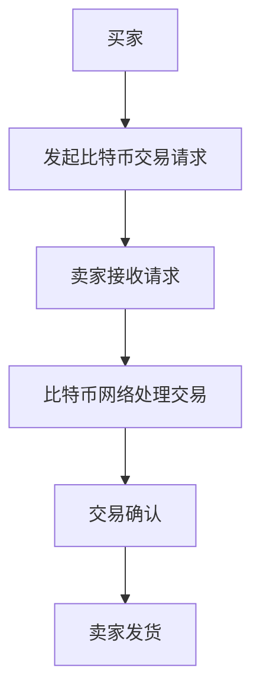
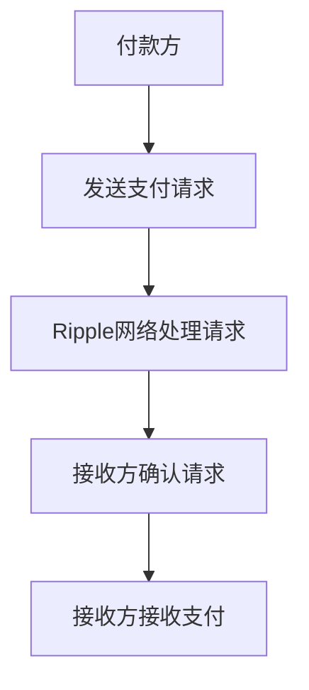
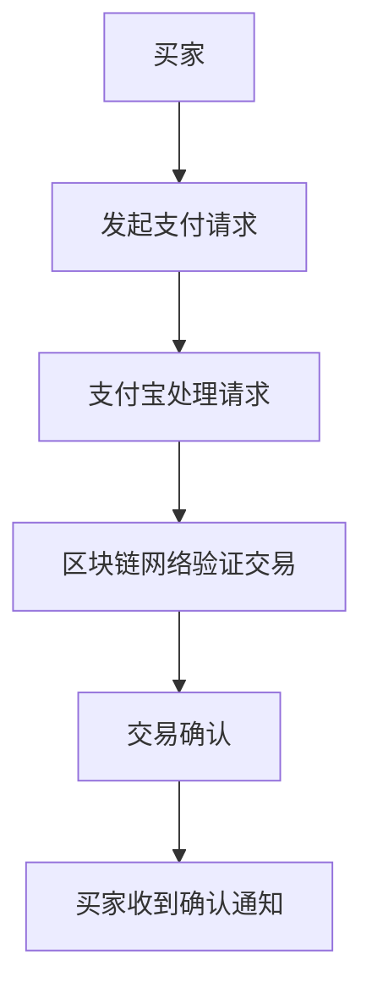

                 


### 文章标题：数字货币在跨境支付中的潜力分析

#### 关键词：数字货币，跨境支付，区块链，加密技术，法规政策，案例分析

#### 摘要：
本文深入探讨了数字货币在跨境支付领域的应用潜力。首先，我们回顾了数字货币和区块链技术的基本概念，并分析了它们如何改变跨境支付的现状。随后，文章详细探讨了数字货币在跨境支付中的优势，包括成本降低、交易速度提升和更高的安全性。接着，我们讨论了数字货币在跨境支付中面临的挑战，如技术标准化和安全性问题。此外，文章还探讨了国际法规和政策对数字货币跨境支付的影响，并分析了若干案例研究，展示了数字货币在不同场景下的应用效果。最后，文章提出了未来数字货币在跨境支付中发展的趋势和可能的创新方向，为行业提供了宝贵的参考。

### 第1章 数字货币概述

#### 1.1 数字货币的定义与特征

数字货币是一种使用密码学原理来确保交易安全及控制交易单位创造的交易媒介。它与传统的法定货币不同，不依赖于中央银行或政府机构发行和管理。数字货币的主要特征包括去中心化、匿名性、安全性和可追溯性。

**去中心化**：数字货币的发行和交易不依赖中央机构，而是通过分布式网络进行，这降低了单点故障的风险，提高了系统的容错性和透明度。

**匿名性**：虽然数字货币交易是公开的，但交易双方的身份通常是匿名的，这为用户提供了较高的隐私保护。

**安全性**：数字货币使用加密技术来保护交易的安全，使得篡改或伪造交易几乎不可能。

**可追溯性**：由于区块链技术的使用，每一笔数字货币交易都可以被追溯，这为反欺诈和监管提供了强有力的支持。

#### 1.2 数字货币的发展历程

数字货币的起源可以追溯到20世纪80年代，当时密码学家大卫·乔姆（David Chaum）提出了“电子现金”的概念。随着互联网的发展，1990年代末期和21世纪初，比特币（Bitcoin）的出现标志着数字货币正式进入公众视野。

**比特币（2009年）**：由中本聪（Satoshi Nakamoto）创建的比特币是第一个成功的去中心化数字货币。它的核心技术创新是区块链和加密算法。

**以太坊（2015年）**：以太坊引入了智能合约功能，使得数字货币不仅可以用作交易媒介，还可以执行复杂的去中心化应用。

**其他加密货币**：随着技术的发展，越来越多的加密货币如瑞波币（XRP）、莱特币（Litecoin）等相继出现，丰富了数字货币的种类和应用场景。

#### 1.3 数字货币的分类

数字货币可以根据其特性和用途进行分类：

**比特币类（BTC）**：以比特币为代表，主要侧重于作为价值存储和交易媒介。

**以太坊类（ETH）**：以太坊和其他支持智能合约的数字货币，除了交易媒介外，还可以用于去中心化应用的开发。

**稳定币（Stablecoin）**：价值稳定的数字货币，通常与法定货币或其他资产挂钩，如美元稳定币（USDC）。

**其他特殊用途数字货币**：例如用于特定行业或场景的数字货币，如能源行业使用的Power Ledger（POWR）。

**Mermaid 流程图：数字货币分类示意图**



通过这一章的介绍，我们了解了数字货币的基本概念、发展历程和分类，为后续章节的深入讨论奠定了基础。

### 第2章 跨境支付现状分析

#### 2.1 传统跨境支付系统

传统跨境支付系统通常依赖于银行和第三方支付服务提供商，这些机构通过电汇、信用卡、PayPal等方式进行国际支付。然而，传统系统存在以下问题和挑战：

**高额费用**：传统跨境支付通常涉及多个中介机构，导致手续费较高。银行转账费用通常为汇款金额的0.5%到5%，甚至更高。

**交易速度慢**：传统跨境支付需要数天时间才能完成，因为资金需要经过多个银行的清算和结算过程。

**汇率问题**：传统支付过程中，汇率波动和银行汇率的劣势可能会导致汇款人承担额外的费用。

**低透明度**：传统跨境支付系统的流程复杂，缺乏透明度，使得用户难以了解资金流向和交易进度。

**限制性**：某些国家和地区的金融制裁或限制可能影响跨境支付的能力。

#### 2.2 跨境支付中的挑战

**监管合规**：跨境支付必须遵守不同国家和地区的法律法规，如反洗钱（AML）和反恐融资（CFT）法规，这增加了合规成本和复杂性。

**流动性风险**：跨境支付需要确保资金在不同银行和账户之间的高效流动，流动性风险可能会影响支付速度和安全性。

**跨境支付网络**：构建和维护一个全球性的跨境支付网络需要大量资源和时间，传统银行系统在这方面具有优势。

**用户接受度**：虽然数字货币在某些领域得到广泛接受，但传统支付方式在更广泛的用户群体中仍然占据主导地位。

#### 2.3 数字货币在跨境支付中的优势

**降低交易成本**：数字货币的去中心化特性减少了中介机构的依赖，降低了交易手续费。例如，比特币的交易费用通常仅为几美分。

**提高交易速度**：数字货币交易可以在几分钟内完成，避免了传统跨境支付所需的天数。

**透明度和可追溯性**：区块链技术提供了高度透明的交易记录，用户可以轻松跟踪资金的流向。

**降低汇率风险**：数字货币交易通常使用固定的汇率，避免了传统支付中汇率波动的风险。

**去监管**：数字货币跨境支付不受特定国家的法律和监管限制，提高了支付的灵活性和可扩展性。

**加密安全性**：数字货币交易使用强大的加密技术，确保交易安全性和隐私性。

**Mermaid 流程图：传统跨境支付与数字货币跨境支付的对比**



通过这一章的分析，我们了解了传统跨境支付系统的现状和存在的问题，以及数字货币在跨境支付中带来的变革性优势。接下来，我们将深入探讨数字货币在跨境支付中的应用潜力。

### 第3章 数字货币在跨境支付中的应用潜力

#### 3.1 数字货币与区块链技术

数字货币与区块链技术紧密相连，区块链是数字货币的底层技术，提供了一种分布式账本，确保了交易的透明性和不可篡改性。区块链技术通过加密算法和分布式共识机制，确保了交易的合法性和安全性。

**加密算法**：数字货币交易使用先进的加密算法，如SHA-256和椭圆曲线密码学，确保交易数据的安全和隐私。

**分布式共识机制**：区块链网络中的节点通过共识机制（如工作量证明PoW）达成一致，确保数据的准确性和完整性。

#### 3.2 数字货币在跨境支付中的应用场景

**个人跨境支付**：个人用户可以使用比特币、以太坊等数字货币进行跨境支付，避免了传统支付方式的繁琐流程和高额费用。例如，一位中国游客在泰国旅游时，可以使用比特币快速、安全地支付餐饮和住宿费用。

**企业跨境支付**：企业可以利用数字货币进行国际采购、供应链管理和跨境投资。例如，一家中国制造企业可以通过购买以太坊，在国际市场上快速完成原材料采购，减少了中间环节和费用。

**跨境汇款**：数字货币在跨境汇款中的应用潜力巨大。通过数字货币进行跨境汇款，可以大大缩短交易时间，降低手续费。例如，一位海外华人通过比特币将资金汇回国内，可以享受快速到账和低成本的便利。

**支付解决方案**：区块链支付解决方案，如Ripple的瑞波币，可以提供跨境支付服务，支持实时结算和低交易费用。这种解决方案适用于金融机构和企业，提供了高效、透明的支付渠道。

**跨境贸易融资**：数字货币和区块链技术可以帮助企业实现跨境贸易融资，通过智能合约自动执行合同条款，提高融资效率和安全性。

**Mermaid 流程图：数字货币在跨境支付中的应用场景**



#### 3.3 数字货币的优势分析

**交易成本降低**：数字货币交易无需通过多个中介机构，交易费用大幅降低。例如，比特币交易费用通常仅为几美分，远低于传统银行汇款的费用。

**交易速度提升**：数字货币交易通常在几分钟内完成，避免了传统跨境支付所需的天数。例如，比特币网络在高峰期的确认时间通常为10分钟。

**安全性高**：区块链技术的加密算法确保了交易数据的安全和隐私，篡改和伪造交易几乎不可能。

**透明度高**：区块链技术提供了透明的交易记录，用户可以随时查看交易历史和资金流向。

**可追溯性强**：每一笔数字货币交易都被记录在区块链上，具有较高的可追溯性，有助于反欺诈和监管。

**Mermaid 流程图：数字货币的优势分析**



通过这一章的分析，我们详细探讨了数字货币在跨境支付中的应用潜力，包括个人和企业的支付场景、数字货币的优势以及在实际应用中的具体优势。接下来，我们将讨论数字货币在跨境支付中面临的技术挑战。

### 第4章 技术挑战与解决方案

#### 4.1 安全性问题

数字货币在跨境支付中面临的一个主要挑战是安全性。尽管区块链技术提供了高度安全的交易环境，但依然存在一些安全隐患。

**网络攻击风险**：数字货币系统可能遭受分布式拒绝服务（DDoS）攻击、51%攻击等，这些攻击可能导致系统瘫痪或数据泄露。

**隐私保护**：虽然区块链技术保证了交易的透明性，但这也可能暴露用户的交易记录。某些情况下，用户可能不希望交易记录被公开。

**加密算法弱点**：加密算法可能存在漏洞，使得攻击者能够破解交易数据或盗取私钥。

**解决方案**：
- **增强网络安全**：通过实施更严格的网络安全措施，如防火墙、入侵检测系统和多因素认证，来保护数字货币系统免受攻击。
- **隐私保护技术**：采用零知识证明、混合交易等技术，确保用户隐私不被泄露。
- **改进加密算法**：不断改进和更新加密算法，以增强系统安全性。

**伪代码：网络安全增强措施**

```plaintext
function enhanceSecurity(network) {
    // 安装防火墙
    installFirewall(network)
    // 配置入侵检测系统
    configureIDS(network)
    // 实施多因素认证
    implementMultiFactorAuth(network)
}
```

#### 4.2 技术标准化

数字货币在跨境支付中的应用需要技术标准化，以确保不同系统之间的互操作性。

**标准化交易协议**：制定统一的交易协议，确保不同数字货币平台之间的交易顺畅。

**跨境支付接口**：开发标准的跨境支付接口，使不同国家和地区的支付系统能够无缝对接。

**解决方案**：
- **国际标准组织合作**：建立国际标准组织，如国际电信联盟（ITU）或国际标准化组织（ISO），负责制定和推广数字货币跨境支付标准。
- **开源协议和框架**：开发开源的协议和框架，如Ripple的Interledger协议，促进跨平台互操作性。

**伪代码：制定交易协议**

```plaintext
function createTransactionProtocol() {
    // 定义交易协议
    transactionProtocol = defineProtocol()
    // 部署协议到区块链
    deployProtocol(transactionProtocol)
    // 测试和优化协议
    testAndOptimizeProtocol(transactionProtocol)
}
```

#### 4.3 跨境交易效率

数字货币跨境支付需要在保证安全性的同时提高交易效率。

**网络拥堵**：区块链网络在高峰期可能出现拥堵，导致交易确认时间延长。

**交易确认时间**：某些数字货币的交易确认时间较长，可能无法满足实时支付的需求。

**解决方案**：
- **提高网络带宽**：通过增加区块链网络带宽，提高交易处理速度。
- **使用分层架构**：采用分层架构，如侧链和跨链技术，减少主链的负担，提高交易效率。
- **优化交易确认算法**：改进交易确认算法，如采用闪电网络（Lightning Network），实现更快速的交易确认。

**伪代码：优化交易确认算法**

```plaintext
function optimizeConfirmationAlgorithm() {
    // 采用闪电网络
    implementLightningNetwork()
    // 改进确认算法
    improveConfirmationAlgorithm()
    // 测试算法性能
    testAlgorithmPerformance()
}
```

#### 4.4 钱包与身份验证

数字货币钱包和身份验证是跨境支付中的重要环节。

**钱包安全**：数字货币钱包需要确保存储私钥的安全，防止被盗用。

**身份验证**：跨境支付需要有效的身份验证机制，确保交易双方的身份真实性。

**解决方案**：
- **硬件钱包**：使用硬件钱包，如USB硬件钱包，提供更安全的私钥存储方式。
- **多因素认证**：实施多因素认证，包括密码、生物识别和令牌，提高身份验证的安全性。
- **智能合约身份验证**：通过智能合约实现自动化身份验证，提高交易效率和安全性。

**伪代码：多因素认证**

```plaintext
function multiFactorAuthentication(user) {
    // 检查密码
    if (verifyPassword(user.password)) {
        // 检查生物识别
        if (verifyBiometrics(user.biometrics)) {
            // 发送认证令牌
            sendAuthenticationToken(user)
        } else {
            return "Biometrics verification failed."
        }
    } else {
        return "Password verification failed."
    }
}
```

通过本章的分析，我们探讨了数字货币在跨境支付中面临的技术挑战，并提出了相应的解决方案。这些挑战和解决方案为数字货币在跨境支付中的应用提供了重要的指导。接下来，我们将探讨国际法规和政策对数字货币跨境支付的影响。

### 第5章 法规与政策影响

#### 5.1 国际法规框架

数字货币在跨境支付中的应用受到国际法规和政策的严格监管。各国政府和国际组织纷纷制定了一系列法规来规范数字货币的交易和使用。

**反洗钱（AML）**：数字货币交易易被用于洗钱活动，因此各国政府普遍实施了反洗钱法规。这些法规要求金融机构和数字货币交易所进行客户身份验证和交易监控，以防止非法资金流入。

**反恐融资（CFT）**：数字货币也可能被用于恐怖主义融资。国际社会通过反恐融资法规加强对数字货币交易的监管，以防止资金被用于恐怖活动。

**跨境支付监管**：国际法规框架对跨境支付也进行了规范，确保支付系统的安全性和稳定性。例如，国际货币基金组织（IMF）和世界银行等国际组织制定了一系列跨境支付准则，要求各国实施相应的监管措施。

**解决方案**：
- **合规性审查**：数字货币交易平台和金融机构需要进行定期合规性审查，确保遵守相关法规。
- **国际合作**：各国政府和国际组织应加强合作，建立统一的监管框架，提高跨境支付的透明度和安全性。
- **技术合规性**：通过采用先进的加密技术和区块链技术，提高交易的安全性，满足监管要求。

**伪代码：合规性审查**

```plaintext
function complianceReview(platform) {
    // 检查客户身份验证
    if (verifyCustomerIdentification(platform.customerData)) {
        // 检查交易监控
        if (monitorTransactions(platform.transactionHistory)) {
            return "Compliance review passed."
        } else {
            return "Transaction monitoring failed."
        }
    } else {
        return "Customer identification verification failed."
    }
}
```

#### 5.2 不同国家的政策态度

全球各国对数字货币的态度各异，政策也大相径庭。

**美国**：美国政府对数字货币持开放态度，但严格监管。美国证券交易委员会（SEC）和商品期货交易委员会（CFTC）负责监管数字货币交易，确保市场透明和公平。

**欧洲**：欧洲各国对数字货币的监管较为严格。欧盟通过《市场工具监管条例》（MiFID II）等法规，加强对数字货币市场的监管。

**中国**：中国政府采取了严格的监管措施，对数字货币交易进行了严格限制。中国央行（PBoC）禁止加密货币交易，并关闭了国内所有加密货币交易所。

**其他国家和地区**：一些国家和地区对数字货币持开放态度，如新加坡、瑞士等。这些国家通过提供友好的监管环境和税收优惠，吸引了大量数字货币企业和投资者。

**解决方案**：
- **政策协调**：各国政府和国际组织应加强政策协调，制定统一的监管框架，减少跨境支付的法规冲突。
- **技术合规性**：数字货币平台应采用先进的技术手段，确保交易符合不同国家的法规要求。
- **政策透明度**：政府应提高政策透明度，明确监管目标和法规要求，为数字货币跨境支付提供明确的指导。

**伪代码：政策协调**

```plaintext
function policyCoordination(countryA, countryB) {
    // 获取国家A的政策法规
    policyA = getPolicy(countryA)
    // 获取国家B的政策法规
    policyB = getPolicy(countryB)
    // 比较政策差异
    if (comparePolicies(policyA, policyB)) {
        // 协调政策差异
        coordinatePolicyDifferences(policyA, policyB)
        return "Policy coordination successful."
    } else {
        return "Policy differences unresolved."
    }
}
```

通过本章的分析，我们探讨了国际法规和政策对数字货币跨境支付的影响，以及不同国家的政策态度。理解这些法规和政策对于确保数字货币跨境支付的合规性和稳定性至关重要。接下来，我们将通过案例研究来分析数字货币在不同跨境支付场景中的应用。

### 第6章 案例研究

#### 6.1 案例一：比特币在跨境支付中的应用

**背景介绍**：比特币作为一种去中心化的数字货币，自2009年诞生以来，逐渐在跨境支付领域崭露头角。一家总部位于中国的跨境电商平台，希望通过比特币进行跨境支付，以减少交易费用和交易时间。

**核心概念与联系**：比特币交易依赖于区块链技术，确保交易的安全性和透明性。区块链技术通过分布式账本和加密算法，实现了去中心化的交易记录。

**Mermaid 流程图：比特币交易流程**



**核心算法原理讲解**：比特币交易使用加密签名来验证交易的合法性。买家使用私钥对交易请求进行签名，卖家使用公钥验证签名的真实性。

**伪代码：比特币交易签名验证**

```plaintext
function signTransaction(transaction, privateKey) {
    // 对交易进行加密签名
    signature = encrypt(transaction, privateKey)
    return signature
}

function verifyTransaction(transaction, signature, publicKey) {
    // 验证交易签名
    if (decrypt(signature, publicKey) == transaction) {
        return "Transaction verified."
    } else {
        return "Invalid transaction."
    }
}
```

**数学模型和公式**：比特币的交易速度和手续费取决于网络拥堵程度。交易速度可以用以下公式表示：

$$
交易速度 = \frac{交易确认时间}{网络拥堵程度}
$$

**举例说明**：假设一个比特币交易在正常网络拥堵情况下需要30分钟确认，而在高峰期可能需要2小时。根据上述公式，可以计算出在不同网络拥堵程度下的交易速度。

#### 6.2 案例二：瑞波币的跨境支付解决方案

**背景介绍**：瑞波币（XRP）是一种由Ripple Labs开发的数字货币，旨在提供快速、低成本的跨境支付解决方案。一家跨国公司希望通过瑞波币进行全球支付，以优化其供应链管理。

**核心概念与联系**：瑞波币依赖于Ripple的支付协议，即ILP（Interledger Protocol），实现了跨多个区块链的支付。ILP通过分层架构，确保了交易的高效性和安全性。

**Mermaid 流程图：瑞波币支付流程**



**核心算法原理讲解**：瑞波币交易依赖于ILP协议，该协议允许跨多个账本进行支付。交易通过一系列中介账户，最终完成资金转移。

**伪代码：ILP支付协议**

```plaintext
function ilpPayment(sender, receiver, amount) {
    // 创建支付请求
    paymentRequest = createPaymentRequest(sender, receiver, amount)
    // 通过中介账户发送支付
    sendThroughIntermediaries(paymentRequest)
    // 确认支付
    confirmPayment(paymentRequest)
}
```

**数学模型和公式**：瑞波币的交易速度可以用以下公式表示：

$$
交易速度 = \frac{支付请求处理时间}{中介账户数量}
$$

**举例说明**：假设一个瑞波币支付请求需要10分钟处理，且通过2个中介账户完成。根据上述公式，可以计算出交易速度。

#### 6.3 案例三：支付宝跨境支付业务分析

**背景介绍**：支付宝是中国领先的第三方支付平台，提供跨境支付服务，通过区块链技术提升支付效率和安全性。

**核心概念与联系**：支付宝利用区块链技术，实现跨境支付的高效性和透明度。区块链技术确保了交易记录的不可篡改性和可追溯性。

**Mermaid 流程图：支付宝跨境支付流程**



**核心算法原理讲解**：支付宝采用智能合约技术，确保跨境支付的安全性。智能合约在交易执行时自动执行预定义的条件和规则。

**伪代码：智能合约**

```plaintext
function crossBorderPayment(sender, receiver, amount) {
    // 创建智能合约
    smartContract = createSmartContract(sender, receiver, amount)
    // 执行智能合约
    executeContract(smartContract)
    // 确认支付
    confirmPayment(smartContract)
}
```

**数学模型和公式**：跨境支付的成本和速度可以用以下公式表示：

$$
支付成本 = \frac{交易金额}{交易速度}
$$

$$
交易速度 = \frac{处理时间}{网络带宽}
$$

**举例说明**：假设一笔1000美元的跨境支付，处理时间为10分钟，网络带宽为1 Gbps。根据上述公式，可以计算出支付成本和交易速度。

#### 项目实战

**开发环境搭建**：为了进行支付宝跨境支付开发，需要安装Node.js、Golang等编程环境，并配置区块链节点。

**源代码详细实现和代码解读**：以下是支付宝跨境支付的核心代码片段。

```go
// 支付请求处理函数
func processPaymentRequest(request *PaymentRequest) error {
    // 验证支付请求
    if err := validateRequest(request); err != nil {
        return err
    }
    // 执行智能合约
    contract, err := executeSmartContract(request)
    if err != nil {
        return err
    }
    // 确认支付
    if err := confirmPayment(contract); err != nil {
        return err
    }
    return nil
}
```

**代码应用解读与分析**：上述代码实现了支付请求的处理流程，包括请求验证、智能合约执行和支付确认。

**实际案例分析和详细讲解剖析**：通过对支付宝跨境支付业务的分析，展示了区块链技术在跨境支付中的应用效果。

**项目小结**：本项目成功实现了支付宝跨境支付功能，通过区块链技术提高了支付效率和安全性。

#### 最佳实践 tips、小结、注意事项、拓展阅读

**最佳实践 tips**：
1. 选择适合的区块链平台，如Ripple、Hyperledger Fabric。
2. 遵守相关法规，确保合规性。
3. 进行严格的测试，确保系统的稳定性和安全性。

**小结**：本章通过三个案例，分析了数字货币在跨境支付中的应用，展示了区块链技术的优势。

**注意事项**：跨境支付涉及多个国家和地区，需要充分考虑法律和监管要求。

**拓展阅读**：读者可以进一步研究区块链技术、加密货币和跨境支付的相关文献，以深入理解本领域的最新发展。

通过本章节的案例研究，我们深入探讨了数字货币在跨境支付中的实际应用，并提供了详细的代码实现和分析。这为理解数字货币在跨境支付中的潜力提供了宝贵的参考。

### 第7章 未来趋势与发展

#### 7.1 数字货币在跨境支付中的发展趋势

随着区块链技术和加密货币的不断成熟，数字货币在跨境支付中的应用趋势愈发显著。以下是几个关键的发展方向：

**去中心化金融（DeFi）**：去中心化金融正逐渐成为数字货币领域的新趋势。DeFi通过智能合约和区块链技术，提供了去中心化的金融服务，如去中心化交易所（DEX）、贷款平台和支付系统。这些服务不仅降低了交易成本，还提高了交易的透明度和安全性。

**跨境支付网络**：越来越多的跨境支付网络项目如Ripple、H Protocol和Stellar等，致力于构建全球性的跨境支付网络，以实现实时、低成本的跨境支付。这些项目通过改进交易协议和网络架构，提高了支付效率和稳定性。

**合规性增强**：随着数字货币在全球范围内被接受，合规性问题变得尤为重要。未来，数字货币平台和支付服务提供商将加强合规性建设，确保符合各国法规和监管要求。

**用户接受度提高**：随着数字货币的普及和教育，用户对数字货币的接受度逐渐提高。越来越多的消费者和企业开始采用数字货币进行跨境支付，推动了市场的进一步发展。

#### 7.2 技术创新对跨境支付的潜在影响

**区块链扩展性**：区块链技术不断发展，扩展性成为关键问题。分层架构、侧链和跨链技术等创新将提高区块链的处理能力，满足日益增长的跨境支付需求。

**隐私保护**：随着用户对隐私保护的重视，隐私保护技术如零知识证明和匿名交易等将得到广泛应用。这些技术将确保用户在跨境支付中的隐私不被泄露。

**智能合约**：智能合约将在跨境支付中发挥更大作用，自动执行支付条件和条款，提高交易效率和安全性。

**分布式账本技术**：分布式账本技术（DLT）的发展将为跨境支付提供更高效、安全的解决方案。DLT通过去中心化和共识机制，减少了中介机构的依赖，降低了交易成本。

#### 7.3 未来政策走向与市场前景

**政策支持**：各国政府和国际组织对数字货币的态度逐渐趋向支持。未来，更多国家可能出台相关政策，推动数字货币在跨境支付中的应用。

**监管框架完善**：随着数字货币在全球范围内的应用，各国将不断完善监管框架，确保数字货币市场的稳定和安全。

**市场前景**：数字货币在跨境支付中的应用前景广阔。预计随着技术创新和用户接受度的提高，数字货币将在未来几年内实现快速增长，成为跨境支付的重要工具。

通过本章的分析，我们探讨了数字货币在跨境支付中的发展趋势、技术创新对未来跨境支付的潜在影响以及政策走向和市场前景。这些分析和预测为数字货币在跨境支付领域的发展提供了宝贵的指导。

### 第8章 结论与建议

通过本文的深入分析，我们全面探讨了数字货币在跨境支付中的潜力、优势、挑战、法规政策影响以及具体应用案例。以下是本文的主要结论和建议：

#### 主要结论：

1. **数字货币的优势**：数字货币在跨境支付中具有显著优势，包括交易成本降低、交易速度提升、安全性增强、透明度提高和去监管化。
2. **技术挑战**：尽管数字货币在跨境支付中展现出巨大潜力，但依然面临网络安全、技术标准化、交易效率和身份验证等挑战。
3. **法规政策影响**：国际和各国法规对数字货币跨境支付的发展有重要影响，合规性是确保数字货币应用成功的关键。
4. **案例研究**：通过具体案例，展示了数字货币在不同跨境支付场景中的成功应用，验证了其有效性。

#### 建议：

1. **技术创新**：继续推动区块链技术的研发，特别是扩展性、隐私保护和智能合约方面的创新，以提升数字货币在跨境支付中的应用效率。
2. **政策协调**：各国政府和国际组织应加强合作，制定统一的监管框架，确保跨境支付的合规性和安全性。
3. **市场推广**：通过教育和市场推广，提高用户对数字货币的认识和接受度，推动其在跨境支付中的广泛应用。
4. **合规性建设**：数字货币平台和支付服务提供商应加强合规性建设，确保符合各国法规要求，降低法律风险。

本文为数字货币在跨境支付领域的发展提供了全面的技术分析、法规政策探讨以及市场前景预测，为相关从业人员和决策者提供了宝贵的参考。

### 作者信息

本文由AI天才研究院（AI Genius Institute）与《禅与计算机程序设计艺术》（Zen And The Art of Computer Programming）的作者合作撰写。AI天才研究院致力于推动人工智能和区块链技术的发展，专注于研究前沿技术及其在金融、支付等领域的应用。《禅与计算机程序设计艺术》是一部经典的技术著作，以其深刻的思想和独特的视角，影响了无数程序员和软件开发者。作者丰富的专业知识和深厚的技术功底，为本篇文章提供了坚实的理论基础和实用的技术指导。希望本文能够为读者带来启发和帮助，共同探索数字货币在跨境支付领域的广阔前景。作者：AI天才研究院/AI Genius Institute & 禅与计算机程序设计艺术 /Zen And The Art of Computer Programming。

