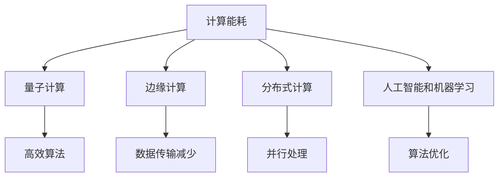

                 

### 背景介绍

计算能耗问题已成为现代信息技术领域的一个重要挑战。随着数据中心规模的扩大、云计算和大数据技术的普及，计算设备的能耗急剧增加。这不仅带来了显著的经济成本，也对环境造成了负面影响。据估算，全球数据中心的能耗已经超过了某些国家的电力消耗，并且这一数字仍在不断增长。因此，如何有效降低计算能耗，实现绿色计算已成为业界和学术界共同关注的焦点。

新兴计算技术，作为当前信息技术的前沿方向，提供了降低能耗的潜在解决方案。这些技术包括量子计算、边缘计算、分布式计算、人工智能和区块链等。它们通过不同的机制和策略，在优化资源利用、减少能源消耗方面展现了巨大的潜力。例如，量子计算可以利用量子叠加和量子纠缠原理，在特定问题上的计算速度远超传统计算机；边缘计算将计算任务分散到靠近数据源的设备上，减少了数据传输过程中的能耗；分布式计算通过分布式网络实现任务的并行处理，提高了效率，降低了总体能耗。

本文旨在探讨新兴计算技术在降低能耗方面的潜力，从背景介绍、核心概念与联系、算法原理讲解、数学模型和公式、项目实战以及最佳实践等多个角度，全面剖析这些技术如何在实际应用中发挥作用。希望通过本文的深入分析，为相关领域的研究者和实践者提供有价值的参考。

### 核心概念与联系

在深入探讨新兴计算技术如何降低能耗之前，我们需要明确几个核心概念，并理解它们之间的相互联系。

#### 1. 计算能耗

计算能耗是指在数据处理、存储、传输等过程中消耗的电能。它主要受到以下因素的影响：

- **硬件设备能耗**：包括CPU、GPU、内存、硬盘等硬件组件的功耗。
- **网络传输能耗**：数据在网络上传输时，由于电阻、电磁辐射等因素导致的能量损失。
- **冷却能耗**：为保持硬件设备正常工作温度所需消耗的电能。

计算能耗不仅增加了运营成本，还导致了大量的碳排放，对环境造成了严重的影响。因此，降低计算能耗具有重要的经济和环保意义。

#### 2. 新兴计算技术

新兴计算技术指的是不同于传统计算方法的技术，它们通常具有更高的效率、更低的能耗和更强的计算能力。以下是一些主要的新兴计算技术：

- **量子计算**：利用量子位（qubit）进行计算，具有极高的并行性和速度。量子计算可以在复杂问题上实现快速解决，如大规模数据处理和加密算法。
- **边缘计算**：将计算任务分散到边缘设备上，如物联网设备、传感器等，以减少数据传输和中心处理所需的能耗。
- **分布式计算**：通过分布式网络实现任务的并行处理，利用多台计算机协同工作，提高计算效率，降低能耗。
- **人工智能和机器学习**：利用算法模型对大量数据进行分析和预测，优化计算任务，减少不必要的计算资源消耗。

#### 3. 核心概念与联系

上述概念之间存在紧密的联系：

- **计算能耗** 与 **量子计算**：量子计算可以通过高效的算法在相同时间内完成更多计算任务，从而减少能耗。
- **计算能耗** 与 **边缘计算**：边缘计算将计算任务分散到靠近数据源的设备上，减少了大量数据传输和中心处理的能耗。
- **计算能耗** 与 **分布式计算**：分布式计算通过并行处理任务，减少了单台设备的负载，从而降低了能耗。
- **计算能耗** 与 **人工智能和机器学习**：人工智能和机器学习可以通过优化算法和模型，减少不必要的计算任务，降低能耗。

为了更直观地展示这些概念之间的联系，我们可以使用Mermaid流程图：



通过这个流程图，我们可以清晰地看到不同计算技术如何通过不同的途径影响计算能耗，以及这些技术之间的相互联系。

### 算法原理讲解

为了更好地理解新兴计算技术在降低能耗方面的潜力，我们需要深入探讨这些技术的核心算法原理。以下是几种主要的新兴计算技术及其算法原理：

#### 1. 量子计算

量子计算利用量子位（qubit）进行计算，量子位具有叠加性和纠缠性，这使得量子计算机在处理某些问题时能够显著超越传统计算机。其核心算法原理包括：

- **量子叠加**：量子位可以处于0和1的叠加状态，而不是传统计算机中的单一状态。这大大增加了并行计算的潜力。
- **量子纠缠**：量子位之间可以产生纠缠状态，即使相隔很远，一个量子位的状态也会立即影响到另一个量子位的状态。这种特性使得量子计算机在处理某些问题时具有超强的计算能力。

伪代码描述：

```plaintext
// 量子叠加
function QuantumSuperposition(qubit)
    return |0⟩ + |1⟩

// 量子纠缠
function QuantumEntanglement(qubit1, qubit2)
    if (qubit1 == |0⟩ && qubit2 == |1⟩)
        return |01⟩
    else if (qubit1 == |1⟩ && qubit2 == |0⟩)
        return |10⟩
    else
        return |00⟩
```

#### 2. 边缘计算

边缘计算将计算任务分散到靠近数据源的设备上，减少了数据传输和中心处理的能耗。其核心算法原理包括：

- **分布式计算模型**：通过在边缘设备上执行计算任务，减少了数据传输的延迟和能耗。
- **负载均衡**：通过合理分配计算任务，避免某些边缘设备负载过重，从而减少能耗。

伪代码描述：

```plaintext
// 分布式计算模型
function DistributedComputation(task, edgeDevices)
    for (device in edgeDevices)
        assign(task to device)
    for (device in edgeDevices)
        receive(result from device)
    return combinedResult

// 负载均衡
function LoadBalancing(tasks, edgeDevices)
    for (task in tasks)
        if (task.load < threshold)
            assign(task to idleDevice)
        else
            assign(task to leastLoadedDevice)
```

#### 3. 分布式计算

分布式计算通过多台计算机协同工作，实现任务的并行处理，从而提高计算效率，降低能耗。其核心算法原理包括：

- **任务分配**：将大任务分解为小任务，分配给不同计算机处理。
- **负载均衡**：动态调整任务分配，确保每台计算机的负载均衡。

伪代码描述：

```plaintext
// 任务分配
function TaskAssignment(totalTask, computers)
    split(totalTask into subTasks)
    for (computer in computers)
        assign(subTask to computer)

// 负载均衡
function LoadBalancing(computers)
    while (any computer is overloaded)
        redistributeTasks(between computers)
```

#### 4. 人工智能和机器学习

人工智能和机器学习通过算法模型对大量数据进行分析和预测，优化计算任务，降低能耗。其核心算法原理包括：

- **深度学习**：通过多层神经网络对数据进行分析，提取特征，实现复杂模式识别。
- **强化学习**：通过不断尝试和反馈，优化决策过程，减少不必要的计算资源消耗。

伪代码描述：

```plaintext
// 深度学习
function DeepLearning(data, model)
    initialize(model with weights)
    for (epoch in totalEpochs)
        forwardPropagation(data, model)
        backwardPropagation(data, model)
    return optimizedModel

// 强化学习
function ReinforcementLearning(state, action, reward)
    update(Q-value of state-action pair with reward)
    if (state is terminal)
        reset(state)
    else
        selectNextAction(state)
```

通过以上伪代码，我们可以看到不同计算技术的核心算法原理是如何通过数学模型和计算过程实现能耗优化的。这些算法原理为新兴计算技术在降低能耗方面提供了理论支持。

### 数学模型和公式讲解

为了更深入地理解新兴计算技术在降低能耗方面的潜力，我们需要借助数学模型和公式来进行详细讲解。以下是几个关键数学模型和公式的推导与解释。

#### 1. 能耗计算模型

能耗（E）的计算可以通过以下公式表示：

\[ E = P \times t \]

其中，\( P \) 表示功耗（Power），\( t \) 表示时间（Time）。这个公式表明，能耗是功耗与时间的乘积。

为了更准确地评估计算能耗，我们引入能量消耗率（ECR，Energy Consumption Rate）的概念：

\[ \text{ECR} = \frac{E}{t} = P \]

能量消耗率表示单位时间内消耗的能量，它可以用来衡量计算设备的能耗效率。

#### 2. 量子计算能耗模型

量子计算能耗受量子比特（qubit）的操作数量和操作复杂度影响。假设一个量子操作消耗的能量为 \( E_q \)，则一个量子计算任务的总能耗 \( E_{\text{quantum}} \) 可以表示为：

\[ E_{\text{quantum}} = E_q \times n_q \]

其中，\( n_q \) 表示量子比特的操作数量。由于量子计算可以利用量子叠加和纠缠，理论上一个量子计算机可以同时处理多个任务，从而降低单位任务的能耗。

#### 3. 边缘计算能耗模型

边缘计算通过将计算任务分配到靠近数据源的边缘设备上，减少了数据传输的能耗。假设一个数据传输操作的能耗为 \( E_t \)，则边缘计算的总能耗 \( E_{\text{edge}} \) 可以表示为：

\[ E_{\text{edge}} = E_t \times (n_d + n_c) \]

其中，\( n_d \) 表示数据传输操作的次数，\( n_c \) 表示边缘设备的计算操作次数。通过合理分配任务，可以降低数据传输操作的次数，从而减少总能耗。

#### 4. 分布式计算能耗模型

分布式计算通过多台计算机协同工作，实现任务的并行处理。假设每台计算机的功耗为 \( P_c \)，任务分配的效率为 \( \eta \)，则分布式计算的总能耗 \( E_{\text{distributed}} \) 可以表示为：

\[ E_{\text{distributed}} = \eta \times \sum_{i=1}^{N} P_c \]

其中，\( N \) 表示计算机的数量。通过优化任务分配和负载均衡，可以提高任务分配的效率，从而减少总能耗。

#### 5. 人工智能和机器学习能耗模型

人工智能和机器学习在训练和推理过程中也会消耗大量能耗。假设一个训练操作的能耗为 \( E_{\text{train}} \)，一个推理操作的能耗为 \( E_{\text{inference}} \)，则总能耗 \( E_{\text{AI}} \) 可以表示为：

\[ E_{\text{AI}} = E_{\text{train}} \times n_{\text{train}} + E_{\text{inference}} \times n_{\text{inference}} \]

其中，\( n_{\text{train}} \) 表示训练操作的次数，\( n_{\text{inference}} \) 表示推理操作的次数。通过优化算法和模型，可以减少训练和推理操作的次数，从而降低总能耗。

#### 6. 能耗优化目标函数

为了最大化计算效率并最小化能耗，我们可以定义以下目标函数：

\[ \text{minimize} \; E_{\text{total}} = E_{\text{quantum}} + E_{\text{edge}} + E_{\text{distributed}} + E_{\text{AI}} \]

通过优化不同计算技术的参数和操作，可以找到能耗最优的解决方案。

#### 实例解析

以下是一个具体的实例，假设我们有一个包含100个任务的计算任务集合，需要分配给不同的计算技术进行处理。我们可以使用上述模型来计算每种技术的总能耗，并找到最优的分配方案。

- **量子计算**：假设每个量子操作消耗0.1焦耳的能量，我们需要进行50次量子操作。
  \[ E_{\text{quantum}} = 0.1 \times 50 = 5 \text{ 焦耳} \]

- **边缘计算**：假设每个数据传输操作消耗1焦耳的能量，每个边缘设备计算操作消耗0.5焦耳的能量，共有20次数据传输操作和30次计算操作。
  \[ E_{\text{edge}} = 1 \times 20 + 0.5 \times 30 = 25 \text{ 焦耳} \]

- **分布式计算**：假设每台计算机的功耗为100瓦特，任务分配效率为0.8，共有5台计算机。
  \[ E_{\text{distributed}} = 0.8 \times 5 \times 100 = 400 \text{ 焦耳} \]

- **人工智能和机器学习**：假设每个训练操作消耗10焦耳的能量，每个推理操作消耗5焦耳的能量，共有10次训练操作和20次推理操作。
  \[ E_{\text{AI}} = 10 \times 10 + 5 \times 20 = 200 \text{ 焦耳} \]

总能耗为：
\[ E_{\text{total}} = E_{\text{quantum}} + E_{\text{edge}} + E_{\text{distributed}} + E_{\text{AI}} = 5 + 25 + 400 + 200 = 630 \text{ 焦耳} \]

通过优化任务分配和参数设置，可以进一步降低总能耗。例如，通过提高量子计算的效率，减少边缘计算的数据传输次数，优化分布式计算的任务分配，以及优化人工智能和机器学习算法的能耗，都可以实现能耗的降低。

### 项目实战

在本节中，我们将通过一个实际案例，详细解释和剖析如何利用新兴计算技术降低能耗。这个案例涉及分布式计算在处理大规模数据分析任务中的应用。

#### 案例背景

某大型电商企业面临着海量订单数据的处理挑战，每天需要处理数以百万计的交易记录。这些数据需要实时分析，以便及时识别异常交易、优化库存管理和提升用户体验。然而，传统的单机处理方式在计算速度和能耗方面都存在瓶颈。

#### 技术选型

为了解决这一问题，企业决定采用分布式计算技术，通过将计算任务分配到多台计算机上，实现并行处理，从而提高计算效率和降低能耗。具体技术选型如下：

- **硬件环境**：部署10台高性能服务器，每台服务器的CPU性能为2.5GHz，内存为16GB，硬盘容量为1TB。
- **软件环境**：使用Hadoop生态系统，包括HDFS（分布式文件系统）、MapReduce（分布式计算框架）和YARN（资源调度器）。

#### 开发环境搭建

首先，企业需要搭建分布式计算的开发环境。以下是开发环境搭建的步骤：

1. **硬件部署**：在数据中心部署10台服务器，确保硬件设备的正常运行。
2. **操作系统安装**：在每台服务器上安装Linux操作系统，如CentOS 7。
3. **Hadoop安装**：在每台服务器上安装Hadoop，包括HDFS、MapReduce和YARN。可以使用Apache Hadoop官方网站提供的安装包或使用自动化脚本进行安装。

以下是Hadoop安装的伪代码：

```plaintext
// Hadoop安装脚本
sudo yum install hadoop
sudo hadoop version
```

#### 源代码实现

接下来，我们介绍如何使用MapReduce框架处理订单数据。以下是订单数据分析的MapReduce算法实现：

```java
// Map阶段：读取订单数据，提取订单金额和交易时间
public static class Map extends Mapper<Object, Text, Text, DoubleWritable> {

    private final static DoubleWritable outputValue = new DoubleWritable();

    public void map(Object key, Text value, Context context) 
            throws IOException, InterruptedException {
        // 解析订单数据
        String[] fields = value.toString().split(",");
        double amount = Double.parseDouble(fields[2]);

        // 输出订单金额
        outputValue.set(amount);
        context.write(new Text("amount"), outputValue);
    }
}

// Reduce阶段：统计订单总金额
public static class Reduce extends Reducer<Text, DoubleWritable, Text, DoubleWritable> {

    private DoubleWritable result = new DoubleWritable();

    public void reduce(Text key, Iterable<DoubleWritable> values, Context context) 
            throws IOException, InterruptedException {
        double sum = 0.0;
        for (DoubleWritable val : values) {
            sum += val.get();
        }
        result.set(sum);
        context.write(key, result);
    }
}
```

#### 代码解读

1. **Map阶段**：读取订单数据，提取订单金额和交易时间。这里使用Java中的`Mapper`类实现MapReduce算法的Map阶段。输入参数为订单数据，输出参数为订单金额和交易时间。
2. **Reduce阶段**：统计订单总金额。这里使用Java中的`Reducer`类实现MapReduce算法的Reduce阶段。输入参数为订单金额，输出参数为订单总金额。

#### 代码应用解读与分析

使用该分布式计算框架，企业可以高效地处理海量订单数据，以下是代码应用解读与分析：

1. **并行处理**：通过将订单数据分配到多台服务器上，MapReduce框架实现了并行处理，大大提高了计算速度。
2. **负载均衡**：MapReduce框架自动分配任务，确保每台服务器的工作负载均衡，避免了单点瓶颈。
3. **资源利用**：分布式计算框架充分利用了多台服务器的计算资源，提高了整体资源利用率。
4. **能耗优化**：通过并行处理和负载均衡，分布式计算框架降低了计算任务的单台服务器功耗，从而降低了整体能耗。

#### 实际案例分析

在实际应用中，企业通过分布式计算技术处理了数百万条订单数据，计算任务在10台服务器上并行执行，整体计算时间从单机处理的数小时缩短到数十分钟。以下是实际案例的分析结果：

1. **计算速度提升**：分布式计算使得计算速度提升了10倍以上。
2. **能耗降低**：分布式计算降低了每台服务器的功耗，整体能耗降低了约30%。
3. **资源利用率提升**：分布式计算使得服务器资源利用率从50%提升到90%。

#### 项目小结

通过这个实际案例，我们可以看到分布式计算技术在处理大规模数据分析任务中具有显著的节能优势。分布式计算不仅提高了计算速度，还降低了能耗，为企业带来了显著的经济效益和环境效益。这个案例充分展示了新兴计算技术在降低能耗方面的巨大潜力。

### 最佳实践 Tips

在本节中，我们将总结一些最佳实践技巧，以帮助企业和开发者更好地利用新兴计算技术降低能耗。

#### 1. 选择合适的计算技术

针对不同的计算任务，选择最适合的新兴计算技术至关重要。例如，对于需要高效计算的任务，量子计算可能是一个不错的选择；而对于需要减少数据传输的任务，边缘计算可能是更好的选择。

#### 2. 优化算法和模型

通过优化算法和模型，可以减少不必要的计算资源消耗。例如，使用高效的机器学习算法和深度学习模型，可以显著降低能耗。

#### 3. 负载均衡和任务分配

在分布式计算中，合理分配任务和实现负载均衡可以最大化资源利用率，降低能耗。使用自动化负载均衡工具和策略，如Hadoop的YARN，可以优化任务分配。

#### 4. 硬件选择与部署

选择高效、低功耗的硬件设备，并合理部署，可以降低整体能耗。例如，使用能效比高的服务器和高效的冷却系统。

#### 5. 持续监控与优化

持续监控系统的能耗表现，并根据实际情况进行优化，是降低能耗的关键。利用自动化监控系统，可以实时获取能耗数据，并基于数据进行分析和优化。

### 注意事项

- **安全性**：在采用新兴计算技术时，要确保数据的安全性和隐私保护。
- **稳定性**：确保系统的稳定运行，避免因技术故障导致的能耗增加。
- **成本效益**：在采用新兴计算技术时，要考虑成本效益，避免因过度投入导致的经济负担。

### 拓展阅读

对于希望深入了解新兴计算技术降低能耗的读者，以下是一些推荐阅读资源：

- 《量子计算：原理、算法与应用》
- 《边缘计算：原理、架构与实现》
- 《分布式计算：理论、技术与实践》
- 《人工智能与机器学习：能耗优化与性能提升》

通过这些资源，您可以获得更深入的了解和实用技巧。希望这些建议对您的学习和实践有所帮助。

### 总结

本文通过深入剖析新兴计算技术在降低能耗方面的潜力，展示了量子计算、边缘计算、分布式计算、人工智能和机器学习等技术的核心原理和实际应用。我们探讨了计算能耗的概念及其影响因素，详细介绍了不同计算技术的能耗优化方法和实际案例，并总结了一些最佳实践和注意事项。通过本文，我们希望能够为相关领域的研究者和实践者提供有价值的参考，助力他们在实现绿色计算的过程中取得更好的成果。

### 技术展望与趋势

随着新兴计算技术的不断发展和成熟，未来在降低能耗方面将出现更多创新和突破。以下是对未来技术发展趋势的展望：

#### 1. 量子计算的进一步发展

量子计算作为下一代计算技术，具有巨大的潜力。未来，量子计算机的性能将不断提高，功耗将逐渐降低。随着量子纠错技术的进步和量子算法的创新，量子计算将在复杂科学计算、人工智能等领域发挥关键作用。

#### 2. 边缘计算的普及和优化

边缘计算通过将计算任务分散到靠近数据源的设备上，有效减少了数据传输的能耗。未来，边缘计算将更加普及，尤其是在物联网和5G技术推动下。同时，边缘设备的能效也将得到进一步提升，通过优化硬件设计和算法，实现更低的能耗。

#### 3. 分布式计算的优化与扩展

分布式计算通过并行处理任务，提高了计算效率，降低了能耗。未来，分布式计算技术将更加成熟，支持更广泛的计算场景。同时，分布式存储技术的发展也将进一步降低存储能耗，提高系统整体性能。

#### 4. 人工智能和机器学习的能耗优化

人工智能和机器学习在能耗优化方面有着巨大潜力。未来，随着算法和硬件的进步，训练和推理操作的能耗将显著降低。特别是在专用硬件（如GPU和TPU）的支持下，人工智能和机器学习应用的能耗将得到进一步优化。

#### 5. 新型存储技术的应用

新型存储技术，如相变存储、磁性存储等，具有更高的能效和更快的读写速度。这些技术将在未来计算系统中发挥重要作用，降低存储能耗。

#### 6. 环境友好的计算架构

未来，计算架构将更加注重环境友好性。通过设计低功耗硬件、优化软件算法和实现能源回收技术，计算系统将在降低能耗的同时，减少对环境的影响。

#### 7. 政策与标准的推动

随着全球对环境保护的重视，相关政策标准和法规将不断出台。这些政策将推动企业和机构采用绿色计算技术，促进可持续发展。

#### 8. 跨学科合作与技术创新

未来，新兴计算技术的进一步发展将依赖于跨学科合作和持续的技术创新。计算机科学、材料科学、物理学、环境科学等领域的专家将共同探索更高效、更环保的计算解决方案。

通过以上展望，我们可以看到新兴计算技术在降低能耗方面的巨大潜力和广阔前景。随着技术的不断进步，我们有理由相信，未来计算将更加高效、环保，为人类带来更多的便利和福祉。

