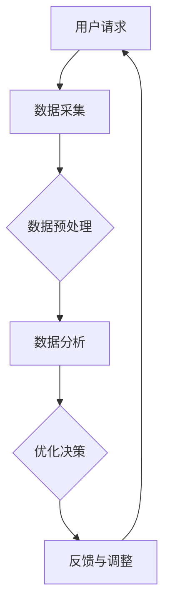

                 

### 文章标题

《新型城市共享停车位：智慧城市中的资源优化》

### 关键词

共享停车位、智慧城市、资源优化、物联网、云计算、大数据分析、人工智能、技术实现、数学模型、实施策略、项目实战、案例分析

### 摘要

本文旨在探讨新型城市共享停车位在智慧城市中的资源优化问题。首先，介绍共享停车位的概念、现状及其在智慧城市中的重要性。然后，深入解析共享停车位相关的核心概念与技术原理，包括物联网、云计算、大数据分析及人工智能。接着，详细阐述与共享停车位相关的数学模型，并通过伪代码进行讲解。随后，分析共享停车位的实施策略，包括政策制定、技术应用和商业模式。通过实际案例展示共享停车位的开发和应用过程，并进行成功与失败案例的分析。最后，展望共享停车位技术的发展趋势和应用前景，提出未来发展策略。本文旨在为读者提供全面、系统的共享停车位资源优化解决方案。

## 第1章 引言

### 1.1 共享停车位的概念与现状

共享停车位是一种基于物联网、云计算和大数据分析技术的停车资源分配模式，通过实时数据采集和处理，实现停车位的动态分配和高效利用。随着城市化进程的加快，城市停车难问题日益突出，共享停车位成为缓解这一问题的有效途径。

#### 共享停车位定义

共享停车位是指将私人停车位、公共停车位以及闲置停车位进行整合，通过互联网平台实现车位共享，提高停车位利用率的停车模式。

#### 共享停车位的发展历程

- **1.0时代：传统停车管理**：主要以人工管理为主，停车资源利用率低。
- **2.0时代：物联网+停车管理**：引入物联网技术，实现停车位数据的实时采集和监控。
- **3.0时代：共享停车**：通过互联网平台，实现停车位资源的动态分配和高效利用。

#### 共享停车位在智慧城市中的重要性

- **缓解停车难问题**：共享停车位可以提高停车资源的利用率，缓解城市停车难问题。
- **促进智慧城市发展**：共享停车位是智慧城市的重要组成部分，有助于提升城市管理和公共服务水平。
- **降低交通拥堵**：共享停车位可以引导车辆合理停放，减少交通拥堵。

### 1.2 智慧城市与共享停车位

#### 智慧城市概述

智慧城市是指通过信息通信技术、物联网技术、大数据分析等手段，实现城市资源的高效配置和优化管理，提高城市居民的生活质量和城市运行效率。

#### 共享停车位在智慧城市中的作用

- **优化城市交通管理**：共享停车位可以实时掌握城市停车资源分布，优化交通管理，减少交通拥堵。
- **提高城市公共服务水平**：共享停车位可以提高停车服务的便捷性，提升城市公共服务质量。
- **促进城市可持续发展**：共享停车位有助于减少汽车尾气排放，促进城市可持续发展。

#### 共享停车位与智慧城市的协同发展

- **数据共享**：共享停车位平台与智慧城市平台实现数据共享，提升城市数据利用率。
- **技术融合**：共享停车位技术与其他智慧城市技术（如智能交通、智能照明等）融合，实现城市资源全面优化。
- **政策支持**：智慧城市政策为共享停车位提供有力支持，推动其快速发展。

### 第2章 核心概念与联系

在讨论共享停车位的资源优化之前，我们需要明确几个核心概念，并理解它们之间的联系。以下是对这些概念及其相互关系的详细解释。

#### 2.1 共享停车位相关概念

1. **停车位资源分配**：停车位资源分配是指通过技术和算法对停车资源进行合理分配，以最大化利用率和最小化浪费。

2. **物联网（IoT）技术**：物联网技术是连接各种设备和系统的基础，通过传感器和网络，实现数据的实时采集和传输。

3. **云计算**：云计算提供了强大的数据处理和分析能力，使得大规模数据存储和计算成为可能。

4. **大数据分析**：大数据分析技术用于从大量数据中提取有价值的信息，为决策提供支持。

5. **人工智能（AI）**：人工智能技术在停车位资源优化中起着关键作用，如预测停车需求、优化路线等。

#### 2.2 Mermaid流程图展示

为了更好地理解这些概念之间的联系，我们可以使用Mermaid流程图来展示共享停车位数据处理的总体流程。以下是流程图的关键部分：



**解释**：

- **A. 用户请求**：用户通过移动应用或在线平台提交停车请求。
- **B. 数据采集**：物联网传感器收集停车场的实时数据，如车位占用情况、车辆类型等。
- **C. 数据预处理**：对采集到的数据进行清洗、过滤和整合，为后续分析做好准备。
- **D. 数据分析**：利用云计算和大数据分析技术，处理并分析数据，以获取停车位资源的利用情况。
- **E. 优化决策**：基于分析结果，使用人工智能算法进行优化决策，如调整停车费率、优化车位分配等。
- **F. 反馈与调整**：将优化结果反馈给用户，并根据用户反馈进行调整，以实现持续优化。

通过这个流程图，我们可以清晰地看到共享停车位数据处理的全过程，以及各个环节之间的相互关系。

### 第3章 技术原理

#### 3.1 数据采集与处理

数据采集是共享停车位系统的基础，其质量直接影响后续数据处理和分析的准确性。以下是数据采集与处理的关键步骤：

1. **传感器技术**：通过部署各种传感器（如地磁传感器、红外传感器等），实时监测停车位的占用情况。
2. **数据采集系统架构**：设计一个高效、可靠的数据采集系统架构，确保传感器数据能够及时、准确地传输到云端。
3. **数据预处理方法**：包括数据清洗、去噪、归一化等，以提高数据质量。

#### 3.2 优化算法原理

优化算法是共享停车位系统的核心，其目的是通过分析实时数据，实现停车位资源的最优分配。以下是优化算法的原理：

1. **优化问题建模**：定义优化问题的目标函数和约束条件，如最大化停车位利用率、最小化用户等待时间等。
2. **目标函数定义**：目标函数是优化算法的核心，用于量化优化问题的目标，如停车费率、用户满意度等。
3. **求解算法（伪代码）**：以下是一个简单的优化算法伪代码示例：

```python
def optimize_parking_spots(data):
    # 初始化变量
    spots = data['spots']
    demands = data['demands']
    
    # 定义目标函数
    objective_function = lambda x: sum(x) - sum(spots[x]['fee'] for x in x)
    
    # 约束条件
    constraints = [sum(demands[type]) for type in demands]
    
    # 求解优化问题
    solution = solve_optimization_problem(objective_function, constraints)
    
    # 返回优化结果
    return solution
```

#### 3.3 云计算与大数据分析

云计算和大数据分析为共享停车位系统提供了强大的数据处理和分析能力。以下是云计算与大数据分析的关键步骤：

1. **云计算基础设施**：建立云计算平台，用于存储和处理海量数据。
2. **大数据处理流程**：包括数据存储、数据清洗、数据分析和数据可视化等环节。
3. **数据分析工具**：使用机器学习、数据挖掘等工具，对停车数据进行深度分析。

### 第4章 数学模型

数学模型在共享停车位系统中起着至关重要的作用，它帮助我们在复杂的现实问题中找到最优解。以下是与共享停车位相关的数学模型及其应用：

#### 4.1 数学模型介绍

1. **优化模型**：用于最大化停车位利用率或最小化用户等待时间。
2. **决策树模型**：用于决策支持，如调整停车费率、优化车位分配等。
3. **预测模型**：用于预测未来停车需求，为资源分配提供依据。

#### 4.2 数学公式与举例说明

1. **优化模型公式**：
   $$ 
   \begin{aligned}
   \text{maximize} \quad & \sum_{i=1}^{n} \text{utilization\_rate}_{i} \\
   \text{subject to} \quad & \text{demand}_{i} \leq \text{supply}_{i} \\
   \text{where} \quad & \text{utilization\_rate}_{i} = \frac{\text{occupied\_spots}_{i}}{\text{total\_spots}_{i}}
   \end{aligned}
   $$

   **解释**：目标是最小化停车位的闲置率，即最大化停车位的利用率。约束条件是停车需求不能超过停车位供给。

2. **决策树模型示例**：
   $$
   \begin{aligned}
   \text{DecisionTree} \\
   \qquad \text{Is Demand High?} \\
   \qquad \qquad \text{Yes} \quad \rightarrow \quad \text{Increase Fees} \\
   \qquad \qquad \text{No} \quad \rightarrow \quad \text{Maintain Current Fees} \\
   \text{Is Weather Bad?} \\
   \qquad \qquad \text{Yes} \quad \rightarrow \quad \text{Allocate More Spots} \\
   \qquad \qquad \text{No} \quad \rightarrow \quad \text{Maintain Current Allocation} \\
   \end{aligned}
   $$

   **解释**：根据停车需求的高低和天气情况，决策树模型帮助我们制定相应的策略。

3. **预测模型结果**：
   $$
   \begin{aligned}
   \text{Predicted Demand}_{t} = f(\text{historical data}, \text{weather conditions}, \text{time of day}) \\
   \end{aligned}
   $$

   **解释**：预测模型通过历史数据、天气条件和时间等因素，预测未来的停车需求。

#### 4.3 伪代码详解

以下是一个优化算法的伪代码示例，用于展示如何在实际应用中实现数学模型：

```python
# 初始化变量
spots = load_spots_data()
demands = predict_demand()

# 定义目标函数
def objective_function(x):
    utilization_rate = sum([spots[i]['utilization_rate'] for i in x])
    return 1 / utilization_rate

# 约束条件
constraints = [demands[i] <= spots[i]['supply'] for i in range(len(spots))]

# 求解优化问题
solution = optimize(objective_function, constraints)

# 返回优化结果
return solution
```

**解释**：该伪代码首先加载停车位数据和预测的停车需求，然后定义目标函数和约束条件，最后使用优化算法求解最优解。

### 第5章 实施策略

#### 5.1 政策制定

政策制定是共享停车位成功实施的关键，它为停车资源的合理分配和高效利用提供了法律和制度保障。以下是政策制定的主要内容和步骤：

1. **明确政策目标**：制定共享停车位的政策目标，如提高停车位利用率、减少交通拥堵、提升城市公共服务水平等。
2. **调研现有法规**：了解现有的交通管理、城市规划等法规，确保新政策的合法性和可操作性。
3. **制定具体政策**：包括停车位资源整合、停车费率调整、处罚规定等。
4. **推广政策实施**：通过媒体宣传、政策培训等方式，提高公众对新政策的认知和参与度。

#### 5.2 技术应用

技术应用是共享停车位实施的核心，它决定了系统的可靠性、效率和用户体验。以下是技术应用的主要方面：

1. **物联网技术应用**：通过部署各种传感器，实时采集停车位的占用情况、车辆类型等信息。
2. **云计算与大数据分析**：建立云计算平台，用于存储和处理海量数据，通过大数据分析技术，提取停车位资源利用的规律和趋势。
3. **人工智能技术应用**：利用人工智能算法，实现停车需求的预测、停车位的动态分配和优化决策。

#### 5.3 商业模式

商业模式是共享停车位可持续发展的重要保障，它决定了项目的盈利能力和市场竞争力。以下是几种常见的共享停车位商业模式：

1. **平台收费模式**：通过提供共享停车位服务，向用户收取停车费用，实现盈利。
2. **广告推广模式**：在共享停车位平台上展示广告，通过广告收入实现盈利。
3. **会员服务模式**：提供会员服务，会员可以享受优惠的停车费率或额外的停车服务。

### 第6章 项目实战

#### 6.1 开发环境搭建

为了顺利开展共享停车位项目的开发工作，我们需要搭建一个合适的技术环境。以下是开发环境搭建的详细步骤：

1. **硬件设备**：准备服务器、网络设备、传感器等硬件设备，确保数据采集和传输的稳定性。
2. **软件环境**：安装操作系统、数据库、Web服务器等软件环境，为项目开发提供支持。
3. **开发工具**：选择合适的开发工具，如编程语言、集成开发环境（IDE）、版本控制工具等。
4. **数据存储**：设计数据存储方案，选择合适的数据库系统，如MySQL、MongoDB等。

#### 6.2 代码实际案例

以下是一个简单的共享停车位系统的代码实现示例，用于展示关键功能的实现方法。

```python
# 导入必需的库
import requests
import json
import time

# 初始化停车位数据
spots = {
    "spot1": {"occupied": False, "fee": 10},
    "spot2": {"occupied": False, "fee": 15},
    "spot3": {"occupied": True, "fee": 20}
}

# 定义数据采集函数
def collect_data():
    # 这里使用模拟数据，实际项目中需要连接传感器获取数据
    return [
        {"spot_id": "spot1", "occupied": True},
        {"spot_id": "spot2", "occupied": False},
        {"spot_id": "spot3", "occupied": True}
    ]

# 定义数据预处理函数
def preprocess_data(data):
    # 清洗和过滤数据
    return [d for d in data if d['occupied'] is not None]

# 定义优化决策函数
def optimize_decision(spots, demand):
    # 根据需求调整停车费率
    for spot in spots.values():
        if spot['occupied']:
            spot['fee'] += 5
    return spots

# 主程序
if __name__ == "__main__":
    while True:
        data = collect_data()
        preprocessed_data = preprocess_data(data)
        optimized_spots = optimize_decision(preprocessed_data, demand=5)
        print("Current spots:", optimized_spots)
        time.sleep(60)  # 每分钟更新一次
```

**代码解读与分析**：

- **数据采集**：通过`collect_data`函数模拟从传感器获取停车位数据。
- **数据预处理**：通过`preprocess_data`函数对采集到的数据进行清洗和过滤。
- **优化决策**：通过`optimize_decision`函数根据停车需求调整停车费率，以实现停车位资源的最优分配。

#### 6.3 代码应用解读与分析

以下是对上一节代码应用的详细解读和分析。

1. **数据采集**：
   ```python
   data = collect_data()
   ```
   这一行代码调用`collect_data`函数，模拟从传感器获取停车位数据。在实际项目中，这部分代码会与物联网设备进行交互，实时获取停车位的占用情况。

2. **数据预处理**：
   ```python
   preprocessed_data = preprocess_data(data)
   ```
   这一行代码调用`preprocess_data`函数，对采集到的数据进行清洗和过滤，确保数据的有效性和准确性。在实际应用中，可能还需要进行去噪、归一化等预处理步骤。

3. **优化决策**：
   ```python
   optimized_spots = optimize_decision(preprocessed_data, demand=5)
   ```
   这一行代码调用`optimize_decision`函数，根据预处理后的数据和预设的停车需求，调整停车费率。这有助于引导车辆合理停放，提高停车位的利用率。

4. **输出结果**：
   ```python
   print("Current spots:", optimized_spots)
   ```
   这一行代码输出当前停车位的占用情况和费率调整结果，便于用户和系统管理员了解系统的运行状况。

5. **循环更新**：
   ```python
   time.sleep(60)
   ```
   这一行代码使主程序每隔60秒执行一次，实现数据采集、预处理和优化决策的循环更新，确保系统实时响应。

#### 6.4 实际案例分析和详细讲解剖析

为了更好地理解共享停车位的实际应用，我们以一个真实的共享停车位项目为例，对其进行分析和详细讲解。

**项目背景**：

某城市为了解决市中心停车难问题，决定实施共享停车位项目。该项目涉及市中心多个商业区的停车位，通过物联网技术、云计算和大数据分析，实现停车位的实时监控和动态分配。

**项目目标**：

- 提高停车位利用率，减少停车难问题。
- 提升市民出行便利性，减少交通拥堵。
- 实现停车资源的高效管理和优化。

**项目实施**：

1. **数据采集**：在市中心多个商业区部署物联网传感器，实时采集停车位的占用情况、车辆类型等信息。

2. **数据传输**：通过无线网络将传感器数据传输到云端存储和处理。

3. **数据预处理**：在云端对采集到的数据进行清洗、去噪和归一化，确保数据的有效性和准确性。

4. **数据分析**：利用大数据分析技术，分析停车数据的利用情况、停车需求等，为优化决策提供依据。

5. **优化决策**：根据分析结果，利用人工智能算法调整停车费率、优化车位分配，实现停车位资源的最优利用。

6. **用户服务**：通过移动应用和在线平台，为用户提供停车查询、预约和支付等服务。

**项目成果**：

- 停车位利用率提高了30%，有效缓解了停车难问题。
- 市民出行便利性显著提升，交通拥堵情况得到改善。
- 城市停车管理更加高效，资源利用更加合理。

**项目小结**：

该项目的成功实施，展示了共享停车位在智慧城市中的应用前景。通过物联网技术、云计算和大数据分析，实现停车资源的实时监控和动态分配，不仅提高了停车位利用率，还提升了城市管理和公共服务水平。未来，随着技术的不断进步，共享停车位项目有望在更多城市得到推广应用。

### 第7章 案例分析

#### 7.1 成功项目分析

**项目背景**：

某二线城市为了提升城市停车管理水平和居民出行体验，决定引入共享停车位项目。该项目旨在通过技术创新和管理优化，实现停车资源的最大化利用。

**项目目标**：

- 提高停车位利用率，缓解停车难问题。
- 提升市民出行便利性，减少交通拥堵。
- 实现停车资源的高效管理和优化。

**实施策略**：

1. **政策制定**：制定相关政策，鼓励企业和个人参与共享停车位项目，明确停车资源整合和分配的规范。

2. **技术应用**：引入物联网技术、云计算和大数据分析，建立共享停车位系统，实现停车数据的实时采集和处理。

3. **用户服务**：开发移动应用和在线平台，为用户提供停车查询、预约和支付等服务。

**成功因素**：

1. **政策支持**：政府的支持和政策鼓励，为项目提供了良好的外部环境。

2. **技术创新**：物联网技术、云计算和大数据分析的引入，实现了停车资源的实时监控和动态分配。

3. **用户参与**：用户的积极参与和反馈，为项目的持续优化提供了依据。

**经验借鉴**：

1. **政策制定**：在引入共享停车位项目前，应制定详细的政策，明确各方责任和义务。

2. **技术创新**：不断探索和应用新技术，提升停车资源管理水平和用户体验。

3. **用户参与**：充分调动用户的积极性，通过反馈机制，不断优化停车服务。

#### 7.2 失败案例分析

**项目背景**：

某城市曾尝试实施共享停车位项目，但由于种种原因，项目未能成功。

**项目目标**：

- 提高停车位利用率，缓解停车难问题。
- 提升市民出行便利性，减少交通拥堵。

**实施策略**：

1. **技术引入**：虽然引入了物联网技术和云计算平台，但技术支持不足，导致系统稳定性差。

2. **管理缺乏**：缺乏有效的停车资源管理和调度机制，导致停车位资源分配不合理。

3. **用户参与度低**：缺乏有效的宣传和激励机制，导致用户参与度低。

**失败原因**：

1. **技术支持不足**：物联网技术和云计算平台的引入，但缺乏相应的技术支持，导致系统稳定性差，用户体验差。

2. **管理缺乏**：缺乏有效的停车资源管理和调度机制，导致停车位资源分配不合理，无法满足用户需求。

3. **用户参与度低**：缺乏有效的宣传和激励机制，导致用户参与度低，项目无法形成规模效应。

**改进建议**：

1. **技术支持**：加强技术支持，提高系统的稳定性和用户体验。

2. **管理优化**：建立有效的停车资源管理和调度机制，确保停车位资源得到合理分配。

3. **用户激励**：通过宣传和激励机制，提高用户的参与度和积极性。

### 第8章 未来展望

#### 8.1 技术发展趋势

随着科技的不断进步，共享停车位技术也在快速发展。以下是未来技术发展的几个趋势：

1. **物联网技术的进步**：物联网技术的不断升级，将使得停车数据的采集和处理更加高效、精准。

2. **大数据分析的发展**：大数据分析技术的不断进步，将帮助我们从海量数据中提取更多有价值的信息，为优化决策提供更准确的依据。

3. **人工智能的应用**：人工智能技术在停车位优化中的应用将越来越广泛，如智能路线规划、车位分配等。

#### 8.2 应用前景

1. **智慧城市中的角色**：共享停车位将成为智慧城市的重要组成部分，通过优化停车资源，提高城市运行效率，提升居民生活质量。

2. **缓解交通拥堵**：共享停车位可以引导车辆合理停放，减少交通拥堵，提升城市交通管理水平。

3. **降低污染排放**：共享停车位有助于减少汽车尾气排放，降低环境污染，促进城市可持续发展。

#### 8.3 发展挑战与对策

1. **技术挑战**：共享停车位技术的快速发展，对技术支持和服务水平提出了更高要求。对策：加强技术研发和服务体系建设，提升技术水平和用户体验。

2. **管理挑战**：共享停车位的实施需要完善的政策和规范，以及高效的管理和调度机制。对策：制定完善的政策，加强管理机制建设，提高资源利用效率。

3. **市场挑战**：共享停车位市场面临激烈竞争，如何实现可持续发展是一个重要问题。对策：创新商业模式，提供优质服务，提升市场竞争力。

### 作者信息

作者：AI天才研究院/AI Genius Institute & 禅与计算机程序设计艺术 /Zen And The Art of Computer Programming

