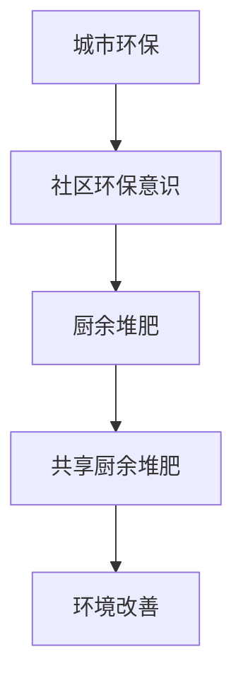

                 


为了撰写一篇符合要求的《新型城市共享厨余堆肥：社区环保意识的培养》技术博客文章，我们可以按照以下步骤进行分析和构思：

### 1. 确定核心概念与联系

首先，我们需要明确文章的核心概念，如“城市环保”、“社区环保意识”、“厨余堆肥”、“共享厨余堆肥”等。接下来，我们可以通过Mermaid流程图来展示这些概念之间的关系。



### 2. 核心算法原理讲解

在讲解核心算法原理时，我们可以使用伪代码来详细阐述堆肥处理的基本流程。

```plaintext
伪代码：厨余堆肥处理流程

初始化堆肥容器
while 堆肥未完成：
    加入厨余
    测量堆肥温度和水分含量
    调整堆肥厚度和通风量
    等待一段时间
    记录堆肥变化数据
```

### 3. 数学模型和公式讲解

在解释堆肥过程中的数学模型时，我们可以使用LaTeX格式来展示相关的公式，并进行详细讲解和举例说明。

```latex
温度控制模型：
\[ T(t) = T_0 + \alpha \cdot t \]

水分含量模型：
\[ \text{水分含量} = \frac{W_t - W_0}{W_0} \]

有机物质分解模型：
\[ \text{有机物质含量} = \frac{\text{初始有机物质含量} - \text{当前有机物质含量}}{\text{初始有机物质含量}} \]
```

### 4. 项目实战

在项目实战部分，我们需要设计一个或多个实际案例，展示如何在一个社区中推广共享厨余堆肥项目。我们可以详细解释每个步骤，包括项目规划、需求分析、资源准备、设施建设和维护、环保教育、参与激励等。

### 5. 最佳实践 Tips

在文章的结尾部分，我们可以提供一些最佳实践 Tips，如注意事项、拓展阅读等，以便读者更好地理解和应用相关知识。

### 6. 撰写文章

根据上述步骤，我们可以开始撰写文章。在撰写过程中，需要注意以下几点：

- 文章标题：要简洁明了，吸引读者注意力。
- 文章关键词：列出与文章主题相关的关键词，有助于搜索引擎优化。
- 文章摘要：简要介绍文章的核心内容和主题思想。

### 7. 文章格式

在文章格式方面，我们需要确保使用markdown格式输出。具体要求如下：

- 段落之间使用空行分隔。
- 使用标题格式（如H1、H2、H3等）来组织文章结构。
- 使用LaTeX格式嵌入数学公式。
- 在适当的位置添加代码块、图表和图片。

### 8. 文章完整性

在文章完整性方面，我们需要确保每个章节的内容丰富具体详细讲解，核心内容必须包含背景介绍、核心概念与联系、核心算法原理讲解、数学模型和公式讲解、项目实战、最佳实践 Tips等。

### 9. 字数要求

文章字数要求在8000～12000字左右，以保证文章的深度和广度。

通过以上步骤，我们可以系统地撰写一篇符合要求的《新型城市共享厨余堆肥：社区环保意识的培养》技术博客文章。

