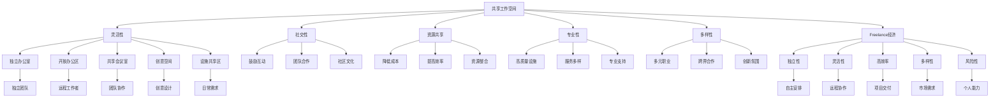
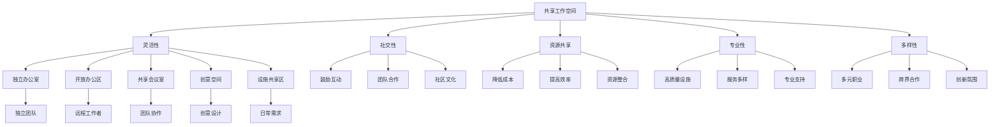
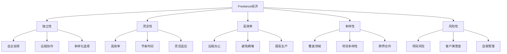
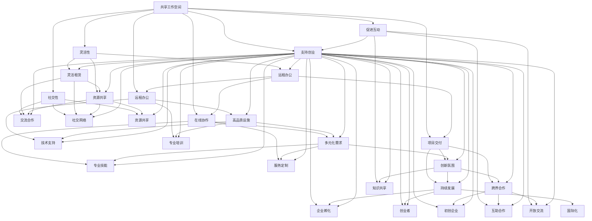

                 

### 摘要

本文旨在深入探讨新型城市共享工作空间与freelance经济的崛起，分析其发展脉络、现状与未来趋势。通过全面介绍共享工作空间与freelance经济的基本概念，回顾其历史背景，详细分析市场现状，探讨商业模式、法律政策及技术支持，预测未来发展趋势，本文为读者提供了一个清晰的视角，以理解这一领域的重要性和潜力。此外，文章还提供了实际操作指南，为从业者提供实用的建议。通过本文，读者可以全面了解共享工作空间与freelance经济的现状及未来发展，为其在相关领域的决策和实践提供有力支持。

---

### 引言与核心概念

#### 1.1 书籍背景

随着城市化进程的不断加快，城市空间资源的使用效率成为社会各界关注的焦点。共享经济作为一种新兴的经济模式，以其高效、灵活和可持续的特点，正逐渐改变着城市空间的利用方式。在这其中，共享工作空间和freelance经济作为共享经济的两个重要组成部分，正成为推动城市可持续发展的重要力量。

共享工作空间（Co-working Space）是一种为自由职业者、创业者和小型团队提供共享办公设施和资源的场所。它强调社交互动、资源共享和灵活使用，通过提供开放的办公环境，促进了成员之间的合作和创新。Freelance经济则是指基于互联网平台，自由职业者通过远程工作方式，为不同企业或个人提供专业服务的一种经济模式。这种模式具有高度灵活性和自主性，不仅为自由职业者提供了广阔的发展空间，也为企业提供了灵活的人力资源管理方式。

近年来，共享工作空间和freelance经济在全球范围内快速发展，不仅改变了传统的工作方式，也对城市经济发展产生了深远影响。本文旨在深入探讨这一领域，分析其发展脉络、现状与未来趋势，为政策制定者、企业从业者以及自由职业者提供有价值的参考。

#### 1.2 目的和意义

本书的主要目的是为读者提供一个全面的视角，了解共享工作空间和freelance经济的内涵及其在现代社会中的重要性。具体目标包括：

1. **梳理共享工作空间和freelance经济的基本概念和特点**：通过对这两个领域的基本概念进行深入阐述，使读者能够明确其定义、特征和发展趋势。

2. **分析共享工作空间和freelance经济的发展历程与现状**：回顾其发展历程，分析当前市场状况，帮助读者了解这一领域的历史背景和现实状况。

3. **探讨共享工作空间和freelance经济的商业模式、法律政策及技术支持**：详细介绍不同类型的共享工作空间和freelance商业模式，讨论相关的法律、法规和政策，分析支持这一领域发展的先进技术。

4. **预测共享工作空间和freelance经济的未来发展趋势**：基于当前的发展趋势，预测未来可能的发展方向和挑战，为政策制定者和从业者提供前瞻性的参考。

5. **提供实际操作指南**：为有意进入共享工作空间和freelance经济领域的读者提供具体的操作指南，包括如何开设和运营共享工作空间，以及自由职业者如何找到合适的工作空间。

6. **促进理论与实践相结合**：通过案例分析、实践操作和前沿趋势探讨，促进理论知识的实际应用，为读者提供具有实用价值的信息。

本书的意义在于：

- **促进共享工作空间和freelance经济的健康发展**：通过对这一领域的全面分析，为政策制定者提供科学的决策依据，促进其健康发展。
- **为企业和自由职业者提供参考**：通过详细分析市场现状和发展趋势，为企业和自由职业者提供有针对性的策略和建议，提高其市场竞争力。
- **推动城市可持续发展**：共享工作空间和freelance经济不仅能够提高城市空间资源的利用效率，还能够促进城市创新和经济增长，为城市可持续发展贡献力量。

#### 1.3 书籍结构

为了实现上述目标，本书将分为以下五个主要部分，共七个章节：

1. **第一部分：引言与核心概念**：介绍书籍背景、目的和结构，定义共享工作空间和freelance经济。
2. **第二部分：历史背景与现状**：回顾共享工作空间和freelance经济的发展历程，分析当前市场状况。
3. **第三部分：商业模式与案例**：详细介绍不同类型的共享工作空间和freelance商业模式，并提供成功案例。
4. **第四部分：法律与政策**：讨论与共享工作空间和freelance经济相关的法律、法规和政策。
5. **第五部分：挑战与未来趋势**：分析当前面临的主要挑战，预测未来的发展趋势。
6. **第六部分：技术支持与创新**：探讨支持共享工作空间和freelance经济的先进技术，以及如何通过创新实现可持续发展。
7. **第七部分：实际应用与操作**：提供实际操作指南，包括如何开设和运营共享工作空间，以及自由职业者如何找到合适的工作空间。
8. **第八部分：总结与展望**：总结全书的主要观点，并提出未来的研究建议。

通过以上结构，本书旨在为读者提供系统、全面的共享工作空间和freelance经济知识，帮助读者更好地理解这一领域，并为实际操作提供指导。

#### 2. 核心概念

##### 2.1 共享工作空间

###### 2.1.1 定义

共享工作空间（Co-working Space）是一种为自由职业者、创业者和小型团队提供共享办公设施和资源的场所。它通常提供开放的办公环境，包括独立的工作空间、会议室、咖啡区等，让成员可以灵活选择适合自己的工作区域。共享工作空间的核心在于“共享”，即通过资源共享和社交互动，提升工作效率和创造力。

###### 2.1.2 特点

共享工作空间具有以下几个显著特点：

1. **灵活性**：租户可以根据需要选择长期或短期租赁，灵活调整办公空间。
2. **社交性**：共享工作空间鼓励成员之间的互动和合作，形成良好的社交氛围。
3. **资源共享**：通过共享办公设施和资源，降低单个成员的运营成本。
4. **专业性**：共享工作空间通常提供高质量的办公设施和服务，如高速网络、打印设备、会议室等，满足不同成员的需求。
5. **多样性**：共享工作空间吸引各类人群，如自由职业者、创业者、设计师、程序员等，形成多元的社区文化。

###### 2.1.3 类型

共享工作空间根据不同的需求和功能，可以分为以下几种类型：

1. **独立办公室**：为小型团队或公司提供独立的办公空间，适合需要独立工作环境的团队。
2. **开放办公区**：提供开放的办公座位，适合自由职业者、远程工作者等需要灵活工作空间的个人。
3. **共享会议室**：提供可预约的会议室，适合团队开会、讨论和客户接待。
4. **创意空间**：提供创意工作环境，如艺术工作室、设计工作室等，适合需要创造力和灵感的工作。
5. **设施共享区**：提供共享的设施和设备，如打印区、休息区、咖啡区等，满足成员的日常需求。

##### 2.2 Freelance经济

###### 2.2.1 定义

Freelance经济是指基于互联网平台，自由职业者通过远程工作方式，为不同企业或个人提供专业服务的一种经济模式。这种模式的核心在于自由职业者的独立性和灵活性，他们可以根据自己的兴趣和专长，选择合适的项目和雇主。

###### 2.2.2 特点

Freelance经济具有以下几个显著特点：

1. **独立性**：自由职业者拥有独立的工作时间和工作地点，可以根据自己的需求灵活安排工作。
2. **灵活性**：自由职业者可以选择接受不同类型的项目，满足多样化的工作需求。
3. **高效率**：通过远程工作，自由职业者可以避开交通拥堵和工作场所的限制，提高工作效率。
4. **多样性**：Freelance经济涵盖了各种职业领域，如编程、设计、写作、翻译、营销等，为自由职业者提供了广阔的发展空间。
5. **风险性**：自由职业者需要自己承担风险，如项目交付质量、客户满意度等，对个人能力和经验有较高要求。

###### 2.2.3 影响因素

Freelance经济的发展受到多种因素的影响，包括：

1. **互联网技术**：互联网技术的发展为Freelance经济提供了便利，使自由职业者可以随时随地与雇主和客户进行沟通和协作。
2. **市场需求**：随着企业对灵活人力资源的需求增加，Freelance经济得到了快速发展。
3. **政策支持**：一些国家和地区为促进Freelance经济的发展，出台了一系列政策和措施，如税收优惠、创业支持等。
4. **文化因素**：一些国家和地区对独立工作、自由职业的接受度较高，为Freelance经济的发展创造了良好的环境。

#### 3. Mermaid流程图

为了更好地展示共享工作空间和Freelance经济的核心概念及其联系，我们使用Mermaid流程图进行描述。以下是该流程图的伪代码表示：

该流程图展示了共享工作空间的核心概念及其相关类型，以及与Freelance经济的联系。通过这个流程图，我们可以更清晰地理解共享工作空间和Freelance经济之间的关系和特点。

---

### 2.1 共享工作空间

共享工作空间（Co-working Space）是一种新型的办公模式，旨在为自由职业者、小型团队和初创企业提供灵活的办公环境。它不仅提供办公场所，还提供各种社交和资源共享的机会，以促进成员之间的互动和合作。

#### 2.1.1 定义

共享工作空间通常指的是一个由多个独立的办公区域组成的办公场所，这些办公区域可以根据需要被租用。共享工作空间的特点在于其开放性和灵活性，它允许租户按需租用办公桌、会议室和其他设施，而无需承担长期的租赁合同或高额的办公费用。共享工作空间通常还提供以下服务：

- **设施共享**：如高速互联网、打印设备、咖啡机等。
- **社交活动**：组织各种社交和交流活动，促进成员之间的交流和合作。
- **咨询服务**：提供各种商业和咨询服务，如法律、财务和市场营销等。
- **专业培训**：提供各种技能培训，帮助成员提升个人和团队的能力。

#### 2.1.2 特点

共享工作空间具有以下几个显著特点：

1. **灵活性**：租户可以根据自己的需求选择合适的办公空间，无论是临时租用还是长期租赁。
2. **社交性**：共享工作空间鼓励成员之间的互动和合作，通过组织各种社交活动，增强社区的凝聚力。
3. **资源共享**：通过共享办公设施和资源，租户可以节省成本，提高效率。
4. **专业性**：共享工作空间通常提供高质量的办公设施和服务，满足不同行业和团队的需求。
5. **多样性**：共享工作空间吸引各类人群，如自由职业者、创业者、小型团队等，形成多元化的工作环境。

#### 2.1.3 类型

共享工作空间根据不同的需求和功能，可以分为以下几种类型：

1. **独立办公室**：为小型团队或公司提供独立的办公空间，适合需要独立工作环境的团队。
2. **开放办公区**：提供开放的办公座位，适合自由职业者、远程工作者等需要灵活工作空间的个人。
3. **共享会议室**：提供可预约的会议室，适合团队开会、讨论和客户接待。
4. **创意空间**：提供创意工作环境，如艺术工作室、设计工作室等，适合需要创造力和灵感的工作。
5. **设施共享区**：提供共享的设施和设备，如打印区、休息区、咖啡区等，满足成员的日常需求。

每种类型的共享工作空间都有其独特的优势和适用场景，可以根据实际需求进行选择。

#### 2.1.4 Mermaid流程图

为了更好地展示共享工作空间的核心概念及其联系，我们使用Mermaid流程图进行描述。以下是该流程图的伪代码表示：

该流程图展示了共享工作空间的核心概念及其相关类型，以及与Freelance经济的联系。通过这个流程图，我们可以更清晰地理解共享工作空间的特点和优势。

---

### 2.2 Freelance经济

Freelance经济，又称为自由职业经济，是一种基于互联网平台，自由职业者通过远程工作方式，为不同企业或个人提供专业服务的一种经济模式。这种模式的核心在于自由职业者的独立性和灵活性，他们可以根据自己的兴趣和专长，选择合适的项目和雇主。

#### 2.2.1 定义

Freelance经济中的自由职业者（Freelancer）是指那些以自由职业者身份工作的人，他们通常通过签订短期合同、完成特定项目或提供服务来获取收入。这种工作方式不受传统工作场所和时间限制，使自由职业者能够更加灵活地安排自己的工作和生活。

#### 2.2.2 特点

Freelance经济具有以下几个显著特点：

1. **独立性**：自由职业者拥有独立的工作时间和工作地点，可以根据自己的需求灵活安排工作。
2. **灵活性**：自由职业者可以选择接受不同类型的项目，满足多样化的工作需求。
3. **高效率**：通过远程工作，自由职业者可以避开交通拥堵和工作场所的限制，提高工作效率。
4. **多样性**：Freelance经济涵盖了各种职业领域，如编程、设计、写作、翻译、营销等，为自由职业者提供了广阔的发展空间。
5. **风险性**：自由职业者需要自己承担风险，如项目交付质量、客户满意度等，对个人能力和经验有较高要求。

#### 2.2.3 影响因素

Freelance经济的发展受到多种因素的影响，包括：

1. **互联网技术**：互联网技术的发展为Freelance经济提供了便利，使自由职业者可以随时随地与雇主和客户进行沟通和协作。
2. **市场需求**：随着企业对灵活人力资源的需求增加，Freelance经济得到了快速发展。
3. **政策支持**：一些国家和地区为促进Freelance经济的发展，出台了一系列政策和措施，如税收优惠、创业支持等。
4. **文化因素**：一些国家和地区对独立工作、自由职业的接受度较高，为Freelance经济的发展创造了良好的环境。

#### 2.2.4 Mermaid流程图

为了更好地展示Freelance经济的核心概念及其联系，我们使用Mermaid流程图进行描述。以下是该流程图的伪代码表示：

该流程图展示了Freelance经济的特点及其影响因素，以及与共享工作空间的联系。通过这个流程图，我们可以更清晰地理解Freelance经济的本质和优势。

---

### 2.3 Mermaid流程图：共享工作空间与Freelance经济的联系

为了更清晰地展示共享工作空间和Freelance经济之间的联系，我们使用Mermaid流程图进行描述。以下是该流程图的伪代码表示：

该流程图展示了共享工作空间和Freelance经济之间的密切联系，包括灵活性、社交性、资源共享、专业性、多样性、促进互动、支持创业等多个方面。通过这个流程图，我们可以更全面地理解共享工作空间和Freelance经济如何相互促进，共同推动现代经济的发展。

---

### 2.4 核心概念联系解析

为了更好地理解共享工作空间与Freelance经济的核心概念及其联系，我们将对这些概念进行更深入的分析和解释。通过对比两者的定义、特点、类型和相互影响，我们可以更全面地了解这两个领域的发展脉络和未来趋势。

#### 2.4.1 定义与区别

共享工作空间（Co-working Space）是一种为自由职业者、创业者和小型团队提供共享办公设施和资源的场所。它强调社交互动、资源共享和灵活使用，旨在通过提供一个开放、多样化的工作环境，提升工作效率和创造力。

Freelance经济（Freelance Economy）则是指基于互联网平台，自由职业者通过远程工作方式，为不同企业或个人提供专业服务的一种经济模式。这种模式的核心在于自由职业者的独立性和灵活性，他们可以根据自己的兴趣和专长，选择合适的项目和雇主。

虽然共享工作空间和Freelance经济都是基于互联网和共享经济理念，但它们的定义和重点有所不同。共享工作空间更侧重于提供工作场所和社交平台，而Freelance经济则关注自由职业者的工作方式和经济模式。

#### 2.4.2 特点与互补性

共享工作空间的特点包括灵活性、社交性、资源共享、专业性和多样性。灵活性使得共享工作空间能够满足不同用户的需求，社交性促进了成员之间的互动和合作，资源共享降低了成员的运营成本，专业性和多样性则为不同职业领域提供了支持。

Freelance经济的特点则包括独立性、灵活性、高效率、多样性和风险性。独立性使得自由职业者能够自主安排工作和生活，灵活性使得他们能够快速响应市场需求，高效率来自于远程工作的优势，多样性涵盖了各种职业领域，风险性则源于自由职业者需要自己承担项目风险。

这两个领域的特点具有互补性。共享工作空间提供了良好的工作环境，使得自由职业者能够更高效地完成项目；而Freelance经济则提供了多样化的工作机会，为共享工作空间吸引了不同背景和领域的成员，丰富了社区文化。

#### 2.4.3 类型与适用场景

共享工作空间根据不同的需求和功能，可以分为独立办公室、开放办公区、共享会议室、创意空间和设施共享区。独立办公室适合需要独立工作环境的团队，开放办公区适合自由职业者和远程工作者，共享会议室适合团队开会和客户接待，创意空间适合需要创造力和灵感的工作，设施共享区则提供了日常所需的共享设施。

Freelance经济涵盖了各种职业领域，如编程、设计、写作、翻译、营销等。这些职业领域与共享工作空间的类型密切相关。例如，编程和设计等需要独立工作空间的职业，更倾向于选择独立办公室或开放办公区；而写作和翻译等职业，则更适合在创意空间或设施共享区工作。

#### 2.4.4 相互影响与协同作用

共享工作空间和Freelance经济之间的相互作用对双方都产生了积极的影响。共享工作空间为自由职业者提供了一个良好的工作环境和社交平台，使他们能够更高效地完成项目，提高收入。同时，自由职业者的多样性和专业性也为共享工作空间注入了活力，丰富了社区文化。

Freelance经济则为共享工作空间提供了稳定的用户群体，促进了其发展。自由职业者通过共享工作空间获得更多的工作机会和资源，提高了工作效率和收入。而共享工作空间则为自由职业者提供了良好的工作环境和社交机会，增强了他们的职业发展能力。

在政策层面，共享工作空间和Freelance经济也具有协同作用。政府可以通过出台相关政策和措施，支持共享工作空间的发展，如提供税收优惠、补贴和基础设施支持。同时，政府还可以通过支持Freelance经济的发展，提高自由职业者的收入和就业稳定性，进一步推动共享工作空间的繁荣。

#### 2.4.5 未来发展趋势

随着互联网技术的不断发展和城市化进程的加快，共享工作空间和Freelance经济将继续保持快速发展。未来，它们将在以下几个方面表现出新的发展趋势：

1. **技术融合**：随着5G、人工智能、云计算等新技术的应用，共享工作空间和Freelance经济将实现更高效、更智能的协作和管理。

2. **全球化**：共享工作空间和Freelance经济将逐步走向全球化，跨国界的工作机会和合作将越来越普遍。

3. **多元化**：共享工作空间和Freelance经济的职业领域将更加多元化，涵盖更多行业和领域，为不同背景和技能的从业者提供更多机会。

4. **可持续发展**：共享工作空间和Freelance经济将更加注重环保和社会责任，通过绿色办公、节能减排等措施，推动可持续发展。

5. **政策支持**：政府将加大对共享工作空间和Freelance经济的支持力度，出台更多有利政策，促进其健康发展。

通过以上分析，我们可以看出，共享工作空间和Freelance经济是相辅相成的两个领域，它们在现代社会中发挥着越来越重要的作用。通过深入理解这两个领域的核心概念及其联系，我们可以更好地把握其发展脉络，为实际操作提供指导，为未来研究提供参考。

---

### 2.5 历史背景

共享工作空间（Co-working Space）和Freelance经济并非一夜之间崛起的，它们有着深厚的历史渊源和逐步发展的过程。本文将回顾这两个领域的起源、发展历程以及它们如何相互影响，为读者提供更全面的历史背景。

#### 2.5.1 共享工作空间的起源与发展

共享工作空间的起源可以追溯到20世纪90年代末和21世纪初。当时，随着互联网的普及和创业浪潮的兴起，许多自由职业者和创业者开始寻求一个不同于传统办公室的工作环境。1995年，第一个共享工作空间——The Hub Bay Area在旧金山成立，它提供了一个开放、灵活的办公场所，吸引了众多自由职业者和创业者。

共享工作空间在21世纪初经历了快速发展。2005年，第一个大型共享工作空间——The Plant在纽约成立，它不仅提供了办公空间，还配备了各种共享设施和社交活动，成为共享工作空间领域的典范。随后，共享工作空间在全球范围内迅速扩展，特别是在大城市和科技中心，如硅谷、伦敦、东京等。

共享工作空间的发展受到了多种因素的推动，包括：

1. **经济发展**：全球经济的快速发展，特别是科技创新和创业浪潮的兴起，为共享工作空间提供了丰富的需求和机会。
2. **城市化进程**：城市化进程加速，城市土地和资源紧张，共享工作空间成为一种高效利用空间的方式。
3. **共享经济理念**：共享经济理念的普及，使得共享工作空间成为共享经济的重要组成部分。

#### 2.5.2 Freelance经济的起源与发展

Freelance经济的历史可以追溯到古代手工艺人和雇佣劳动者的时代。然而，现代意义的Freelance经济起源于20世纪60年代的自由职业运动，这一时期，许多专业人士开始拒绝固定的工作岗位，选择以自由职业者的身份工作。

互联网的普及是Freelance经济快速发展的重要推动力。1990年代，随着互联网技术的成熟，许多自由职业者开始通过网络平台寻找工作机会，Freelance经济逐渐兴起。2000年，Freelancer.com等在线平台的出现，使得自由职业者可以更加便捷地与世界各地的雇主和客户进行合作。

Freelance经济的快速发展受到了以下因素的影响：

1. **全球化**：全球化使得企业和个人可以更加容易地跨国界合作，为Freelance经济提供了广阔的发展空间。
2. **技术进步**：互联网、云计算、移动通讯等技术的发展，为Freelance经济提供了高效、便捷的协作工具。
3. **市场需求**：企业对灵活人力资源的需求增加，推动了Freelance经济的快速发展。

#### 2.5.3 共享工作空间与Freelance经济的相互影响

共享工作空间和Freelance经济在历史上相互影响，共同推动了彼此的发展。

1. **共享工作空间对Freelance经济的影响**：
   - **提供工作场所**：共享工作空间为自由职业者提供了一个良好的工作环境，使得他们可以更专注于项目执行。
   - **促进社交互动**：共享工作空间鼓励成员之间的交流与合作，为自由职业者提供了更多的机会和资源。
   - **降低创业门槛**：共享工作空间降低了自由职业者和创业者开设和运营公司的成本，使得更多人有机会尝试创业。

2. **Freelance经济对共享工作空间的影响**：
   - **吸引人才**：Freelance经济的兴起，吸引了大量自由职业者和创业者进入共享工作空间，丰富了社区文化。
   - **促进需求增长**：随着Freelance经济的快速发展，共享工作空间的需求不断增长，推动了其扩展和升级。
   - **推动技术创新**：Freelance经济的需求促进了共享工作空间的技术创新，如在线协作工具、智能办公设备等，提高了共享工作空间的服务质量和效率。

#### 2.5.4 当前市场状况

在全球范围内，共享工作空间和Freelance经济已经成为现代经济的重要组成部分。以下是一些关键的市场动态：

1. **市场规模**：根据市场研究，全球共享工作空间市场规模持续增长，预计未来几年仍将保持高速增长。Freelance经济的市场规模也在不断扩大，吸引了大量投资和关注。

2. **行业分布**：共享工作空间和Freelance经济在各个行业都有广泛的应用。科技、设计、写作、编程等是主要的行业领域，随着市场需求的多样化，其他行业的应用也在逐渐增加。

3. **地区差异**：共享工作空间和Freelance经济在不同地区的表现存在差异。发达国家和地区如美国、欧洲和亚洲的发达城市，共享工作空间和Freelance经济的发展较为成熟；而在一些发展中国家和地区，这一领域仍在快速发展中。

4. **政策环境**：不同国家和地区的政策环境对共享工作空间和Freelance经济的影响较大。一些国家和地区出台了有利政策，如税收优惠、创业支持等，促进了这一领域的发展。

通过回顾共享工作空间和Freelance经济的历史背景，我们可以看到，这两个领域在经历了多年的发展后，已经成为现代经济中不可或缺的一部分。随着技术的不断进步和市场需求的增长，它们将继续发挥重要作用，推动经济和社会的发展。

---

### 2.6 市场状况

共享工作空间和Freelance经济作为现代经济的重要组成部分，已经引起了全球范围内的广泛关注。本节将分析当前市场状况，探讨主要参与者、市场规模、主要行业和应用趋势。

#### 2.6.1 主要参与者

共享工作空间和Freelance经济的参与者主要包括以下几类：

1. **共享工作空间提供商**：这些公司专门提供共享办公空间和设施，如WeWork、Regus、CoCo Workspace等。它们通过租赁、运营和管理办公场所，为自由职业者、小型团队和初创企业提供灵活的办公环境。

2. **Freelance平台**：如Upwork、Freelancer.com、Fiverr等，这些平台为自由职业者提供了寻找项目的机会，同时为企业提供了招聘自由职业者的渠道。这些平台通过连接供需双方，提高了工作效率和透明度。

3. **自由职业者**：这些个体工作者在Freelance平台上注册，提供各种专业服务，如编程、设计、写作、翻译、营销等。他们通过远程工作，实现了灵活的就业和创业。

4. **企业用户**：这些公司通过Freelance平台或直接与自由职业者合作，获取专业服务，以实现灵活的人力资源管理和业务扩展。

#### 2.6.2 市场规模

共享工作空间和Freelance经济的市场规模持续增长。根据市场研究，全球共享工作空间市场规模预计在未来几年内将保持高速增长。以下是一些关键数据：

1. **全球共享工作空间市场规模**：预计将从2019年的约400亿美元增长到2025年的约1000亿美元，年复合增长率达到16%。

2. **全球Freelance经济规模**：据估计，2020年全球Freelance经济规模已达到3.4万亿美元，预计到2027年将增长到5.2万亿美元，占全球GDP的比重逐年上升。

3. **主要市场地区**：美国、欧洲和亚洲是共享工作空间和Freelance经济的主要市场。美国是全球最大的共享工作空间市场，欧洲和亚洲市场也在快速增长。

#### 2.6.3 主要行业

共享工作空间和Freelance经济在各个行业都有广泛的应用。以下是一些主要行业：

1. **科技行业**：科技行业的快速发展推动了共享工作空间和Freelance经济的增长。科技企业通过Freelance平台招聘开发者、设计师和分析师等专业人士，以实现项目灵活管理和技术创新。

2. **设计行业**：设计行业的专业人士，如平面设计师、UI/UX设计师等，通常选择在共享工作空间工作，以获取更多的合作机会和灵感。

3. **创意行业**：创意行业，如电影、音乐、艺术等，通过Freelance经济实现人才共享和项目合作，提高了创作效率和质量。

4. **金融服务行业**：金融行业的专业人士，如分析师、顾问和程序员等，通过共享工作空间和Freelance经济，实现了灵活的工作安排和业务扩展。

5. **市场营销行业**：市场营销行业的专业人士，如内容创作者、SEO专家和社交媒体经理等，通过Freelance平台提供专业服务，帮助企业提高品牌影响力和市场占有率。

#### 2.6.4 应用趋势

随着技术的进步和市场需求的增长，共享工作空间和Freelance经济呈现出以下应用趋势：

1. **全球化**：随着全球化的推进，共享工作空间和Freelance经济的活动范围不断扩大。越来越多的企业和自由职业者跨国界合作，推动了全球市场的融合。

2. **数字化转型**：数字化转型使得共享工作空间和Freelance经济的服务模式更加多样化。通过云计算、人工智能和区块链等新技术，共享工作空间和Freelance经济实现了更高效、更智能的协作和管理。

3. **生态圈建设**：共享工作空间和Freelance经济正逐渐形成生态圈。从办公空间提供商到Freelance平台，再到自由职业者和企业用户，各个环节相互协作，共同推动这一领域的发展。

4. **社会责任**：共享工作空间和Freelance经济越来越注重社会责任。通过提供绿色办公、节能减排和公益活动等，它们在推动可持续发展方面发挥了重要作用。

总之，共享工作空间和Freelance经济已经成为现代经济中不可或缺的一部分。随着市场需求的不断增长和技术的持续进步，它们将继续保持快速发展，为企业和自由职业者提供更多机会和资源，推动经济和社会的可持续发展。

---

### 2.7 商业模式与案例

共享工作空间和Freelance经济的商业模式多样，各具特色。以下将介绍几种常见的商业模式，并分析其优势和适用场景。

#### 2.7.1 商业模式介绍

1. **租赁模式**：租赁模式是共享工作空间最常见的商业模式，通过出租办公空间、座位、会议室等，实现收益。这种模式的优势在于运营成本低、收益稳定，但需要较大的初始投资和长期运营管理。

2. **会员模式**：会员模式通过提供不同等级的会员服务，如普通会员、高级会员等，提供差异化的服务和价格。会员模式的优势在于用户黏性强、忠诚度高，但需要持续提供高质量的服务和创新。

3. **平台模式**：平台模式以Freelance平台为代表，通过连接供需双方，提供项目发布、任务分配、支付结算等服务。平台模式的优势在于用户基数大、交易效率高，但需要处理复杂的法律、支付和信任问题。

4. **整合模式**：整合模式将共享工作空间和Freelance经济结合起来，提供一站式服务。例如，提供办公空间、项目资源、培训服务、金融支持等，满足用户多样化的需求。

#### 2.7.2 商业模式分析

1. **租赁模式**：
   - **优势**：运营成本低、收益稳定、风险可控。
   - **适用场景**：大型城市、科技园区、商业中心等，适合需要长期办公空间的企业和个人。
   - **案例分析**：WeWork作为共享工作空间的领导者，通过租赁模式在全球多个城市建立办公场所，吸引了大量企业和个人用户。

2. **会员模式**：
   - **优势**：用户黏性强、忠诚度高、易于管理。
   - **适用场景**：初创企业、自由职业者、小型团队等，适合需要灵活办公空间的用户。
   - **案例分析**：CoCo Workspace提供不同等级的会员服务，如普通会员、高级会员等，通过提供高质量的设施和服务，吸引了大量用户。

3. **平台模式**：
   - **优势**：用户基数大、交易效率高、市场广阔。
   - **适用场景**：全球范围内的自由职业者、企业用户等，适合需要远程协作和灵活招聘的用户。
   - **案例分析**：Upwork是全球最大的Freelance平台之一，通过连接全球数百万自由职业者和雇主，提供了高效、便捷的在线协作和交易服务。

4. **整合模式**：
   - **优势**：一站式服务、用户需求满足度高、业务多元化。
   - **适用场景**：综合型企业、创新创业园区等，适合需要多样化服务和资源共享的企业和个人。
   - **案例分析**：Bamboo Workspace结合共享工作空间和Freelance平台，提供办公空间、项目资源、培训服务、金融支持等一站式服务，满足了用户多样化的需求。

#### 2.7.3 案例分析

1. **WeWork**：
   - **背景**：WeWork成立于2010年，是全球知名的共享工作空间提供商。
   - **商业模式**：租赁模式，通过在各大城市租赁和装修办公场所，然后出租给企业和个人用户。
   - **优势**：运营成本低、收益稳定、品牌知名度高。
   - **挑战**：高杠杆运营、租金波动、市场竞争激烈。
   - **成功经验**：WeWork通过提供高质量的服务和设施，吸引了大量用户，并成功在纳斯达克上市。

2. **Upwork**：
   - **背景**：Upwork成立于2009年，是全球最大的Freelance平台之一。
   - **商业模式**：平台模式，通过连接全球数百万自由职业者和雇主，提供项目发布、任务分配、支付结算等服务。
   - **优势**：用户基数大、交易效率高、市场广阔。
   - **挑战**：处理复杂的法律、支付和信任问题、市场竞争激烈。
   - **成功经验**：Upwork通过提供高效、便捷的服务，吸引了大量用户，并成功在纳斯达克上市。

3. **CoCo Workspace**：
   - **背景**：CoCo Workspace成立于2014年，是一家提供共享办公空间的会员制企业。
   - **商业模式**：会员模式，提供不同等级的会员服务，如普通会员、高级会员等。
   - **优势**：用户黏性强、忠诚度高、易于管理。
   - **挑战**：需要持续提供高质量的服务和创新，以保持用户满意度。
   - **成功经验**：CoCo Workspace通过提供多样化的服务和灵活的办公空间，吸引了大量用户，在业内树立了良好的品牌形象。

4. **Bamboo Workspace**：
   - **背景**：Bamboo Workspace成立于2015年，是一家整合共享工作空间和Freelance平台的企业。
   - **商业模式**：整合模式，提供办公空间、项目资源、培训服务、金融支持等一站式服务。
   - **优势**：一站式服务、用户需求满足度高、业务多元化。
   - **挑战**：管理复杂、运营成本高、市场竞争激烈。
   - **成功经验**：Bamboo Workspace通过整合共享工作空间和Freelance平台，满足了用户多样化的需求，在业内取得了良好的业绩。

通过以上案例分析，我们可以看到，不同的商业模式在共享工作空间和Freelance经济领域都有其独特的优势和挑战。企业需要根据自身资源和市场需求，选择合适的商业模式，以实现可持续发展。

---

### 2.8 法律与政策

共享工作空间和Freelance经济作为现代经济的重要组成部分，其发展离不开法律和政策的支持。本文将探讨与共享工作空间和Freelance经济相关的法律、法规和政策，以及它们对行业发展的具体影响。

#### 2.8.1 相关法律和法规

1. **劳动法**：劳动法是规范劳动关系的核心法律，对于共享工作空间和Freelance经济有着重要影响。劳动法规定了劳动者的权益和雇主的义务，包括工作时间、工资待遇、劳动安全等。在共享工作空间中，劳动法对于确定雇佣关系和劳动者权益保护至关重要。对于Freelance经济，劳动法需要明确自由职业者与雇主之间的合作关系，确保双方权益的平衡。

2. **合同法**：合同法是规范合同签订和履行的法律，对于共享工作空间和Freelance经济的交易过程具有重要意义。合同法规定了合同的成立、生效、履行和解除等程序，明确了合同各方的权利和义务。在共享工作空间中，合同法有助于明确租户与提供商之间的权利义务关系；在Freelance经济中，合同法对于确保项目交付和费用结算提供了法律保障。

3. **税收政策**：税收政策是影响共享工作空间和Freelance经济发展的重要因素。不同国家和地区的税收政策存在差异，对自由职业者和企业的税收负担有着直接影响。例如，一些国家和地区对自由职业者提供税收优惠，鼓励创业和就业；而另一些国家和地区则对共享工作空间和Freelance经济征收较高的税收，增加了企业的运营成本。

4. **数据保护法**：随着互联网和大数据技术的发展，数据保护法对于共享工作空间和Freelance经济具有重要意义。数据保护法规定了个人数据的收集、存储、处理和使用，保护用户的隐私权和数据安全。在共享工作空间中，数据保护法有助于确保用户信息的保密和安全；在Freelance经济中，数据保护法对于保护客户数据和知识产权至关重要。

#### 2.8.2 政策影响

1. **鼓励创新和创业**：许多国家和地区出台了鼓励创新和创业的政策，如创业补贴、税收优惠、创业培训等，以促进共享工作空间和Freelance经济的发展。这些政策为创业者提供了良好的创业环境，降低了创业门槛，激发了市场活力。

2. **规范行业秩序**：为应对共享工作空间和Freelance经济中的不规范现象，一些国家和地区出台了相关法律法规，规范行业秩序。例如，明确自由职业者的注册和资质要求，规范平台运营，保护劳动者和雇主权益。

3. **促进就业**：共享工作空间和Freelance经济为自由职业者提供了灵活的就业机会，有助于缓解就业压力。政府通过提供培训、补贴等政策，支持自由职业者的职业发展，提高了就业率。

4. **推动经济结构调整**：共享工作空间和Freelance经济促进了经济结构的调整和升级，推动了服务业和知识经济的发展。政府通过支持相关产业的发展，促进了经济的高质量增长。

#### 2.8.3 国内外政策对比

1. **美国**：美国对共享工作空间和Freelance经济持积极态度，通过税收优惠、创业补贴等政策，鼓励创新和创业。美国法律对自由职业者的权益保护较为严格，有助于促进行业的健康发展。

2. **欧洲**：欧洲国家在共享工作空间和Freelance经济领域采取较为谨慎的态度，强调劳动者权益保护。欧洲法律对自由职业者的权益保护较为严格，同时政府也通过补贴和培训等政策，支持自由职业者的职业发展。

3. **中国**：中国政府高度重视共享工作空间和Freelance经济的发展，通过出台相关政策，鼓励创业和创新。中国法律对自由职业者的权益保护逐步完善，同时政府也在不断推动相关法律法规的制定和修订。

总之，法律和政策对于共享工作空间和Freelance经济的发展具有重要影响。通过合理的法律和政策支持，可以促进行业的健康发展，为自由职业者和企业提供良好的发展环境。

---

### 2.9 挑战与未来趋势

共享工作空间和Freelance经济在快速发展过程中，面临着诸多挑战。同时，随着技术的不断进步和社会的变革，这些领域也展现出巨大的发展潜力。以下将分析当前面临的挑战，并探讨未来可能的发展趋势。

#### 2.9.1 挑战

1. **法律和监管问题**：共享工作空间和Freelance经济作为一种新型经济模式，在法律和监管方面存在一定的空白。例如，如何界定自由职业者和雇主的权益关系、如何处理税收和社保等问题。这些问题不仅影响了自由职业者的权益，也增加了企业的运营成本和法律风险。

2. **隐私和数据安全**：随着互联网和大数据技术的发展，共享工作空间和Freelance经济在数据收集、存储和处理过程中，面临着隐私保护和数据安全的风险。如何确保用户数据的安全和隐私，成为这一领域的重要挑战。

3. **职业稳定性**：虽然共享工作空间和Freelance经济提供了更多的就业机会，但自由职业者的职业稳定性相对较低。自由职业者需要自行承担风险，如项目交付质量、客户满意度等。这可能导致收入不稳定、职业发展受限等问题。

4. **社会认同度**：共享工作空间和Freelance经济作为一种新兴经济模式，在一些地区和社会中尚未得到广泛认同。人们对于自由职业者的职业价值和稳定性存在一定的质疑，这可能会影响行业的健康发展。

5. **市场竞争**：随着共享工作空间和Freelance经济的快速发展，市场竞争日益激烈。企业需要不断创新，提高服务质量，以应对日益增加的市场压力。

#### 2.9.2 未来趋势

1. **技术进步**：随着5G、人工智能、区块链等新技术的应用，共享工作空间和Freelance经济将实现更高效、更智能的协作和管理。例如，通过区块链技术，可以实现更安全、更透明的交易流程；人工智能技术可以提供智能化的客户服务和项目匹配。

2. **全球化**：共享工作空间和Freelance经济将继续走向全球化。随着全球化的推进，跨国界的工作机会和合作将越来越普遍。企业和自由职业者可以通过全球化的平台，实现更广泛的合作和资源整合。

3. **可持续发展**：共享工作空间和Freelance经济将更加注重可持续发展。通过绿色办公、节能减排等措施，减少对环境的影响，实现经济、社会和环境的协调发展。

4. **多元化**：共享工作空间和Freelance经济的职业领域将更加多元化，涵盖更多行业和领域。随着市场需求的多样化，共享工作空间和Freelance经济将不断拓展其服务范围，为更多从业者提供发展机会。

5. **政策支持**：政府将加大对共享工作空间和Freelance经济的支持力度。通过出台相关政策和措施，如税收优惠、创业支持等，鼓励自由职业者和企业的创新和发展。

6. **社会认同度提升**：随着共享工作空间和Freelance经济的不断发展，社会对其认同度将逐步提升。通过宣传和培训，提高公众对自由职业者和共享工作空间的认识和接受程度，推动行业的健康发展。

总之，共享工作空间和Freelance经济面临着诸多挑战，但同时也拥有巨大的发展潜力。通过技术创新、政策支持和行业自律，这些领域有望实现可持续发展，为经济和社会发展贡献力量。

---

### 2.10 技术支持与创新

共享工作空间和Freelance经济的快速发展离不开先进技术的支持。以下将探讨几种支持共享工作空间和Freelance经济的先进技术，并分析如何通过技术创新实现可持续发展。

#### 2.10.1 人工智能（AI）

人工智能技术在共享工作空间和Freelance经济中具有广泛应用。通过AI技术，可以实现以下几方面的创新：

1. **智能匹配**：AI技术可以基于用户的技能、兴趣和需求，实现精准的项目匹配。例如，Freelance平台可以通过机器学习算法，推荐最适合用户的项目，提高工作效率和满意度。

2. **自动化管理**：AI技术可以帮助共享工作空间实现自动化管理，如智能预约、智能分配座位、智能会议室管理等。通过自动化技术，降低运营成本，提高管理效率。

3. **智能客服**：AI客服机器人可以提供24/7的在线支持，解答用户疑问，提高客户满意度。智能客服还可以通过自然语言处理技术，理解用户的情感和需求，提供更个性化的服务。

#### 2.10.2 区块链（Blockchain）

区块链技术在共享工作空间和Freelance经济中具有潜在的应用价值。区块链技术可以提供以下几方面的支持：

1. **去中心化交易**：区块链技术可以实现去中心化的交易，降低交易成本，提高交易透明度。例如，Freelance平台可以通过区块链技术，实现项目交付和支付的直接对接，减少中介环节，提高交易效率。

2. **数据安全**：区块链技术可以提供安全的数据存储和传输方案，保护用户隐私和数据安全。在共享工作空间中，区块链技术可以用于管理用户信息和设备访问权限，确保数据的安全和隐私。

3. **智能合约**：智能合约是基于区块链的自动执行合约，可以自动执行合同条款，提高交易效率。在共享工作空间中，智能合约可以用于管理会员资格、费用结算等，减少纠纷和操作风险。

#### 2.10.3 云计算（Cloud Computing）

云计算技术为共享工作空间和Freelance经济提供了强大的计算和存储资源。以下是一些应用场景：

1. **弹性计算**：云计算可以根据用户的需求，动态调整计算资源，实现按需使用。对于共享工作空间，云计算可以提供弹性计算资源，满足不同用户的需求，降低运营成本。

2. **数据存储与共享**：云计算提供了大规模的数据存储和共享解决方案，共享工作空间可以通过云存储服务，实现数据的高效存储和共享。对于Freelance经济，云计算可以提供安全的云盘服务，方便自由职业者存储和共享文件。

3. **云计算平台**：云计算平台为开发者提供了丰富的开发工具和资源，支持共享工作空间和Freelance经济中的应用创新。例如，通过云计算平台，自由职业者可以快速搭建和部署自己的应用和服务。

#### 2.10.4 物联网（IoT）

物联网技术在共享工作空间中具有广泛的应用。以下是一些应用场景：

1. **智能办公设备**：物联网技术可以用于智能办公设备的监控和管理，如智能门禁、智能照明、智能空调等。这些设备可以通过物联网网络，实现远程监控和控制，提高办公环境的舒适度和效率。

2. **设备维护**：物联网技术可以实时监控设备的状态和运行情况，实现预防性维护，降低设备故障率和维修成本。

3. **能效管理**：物联网技术可以用于能源消耗的监测和管理，实现节能减排。在共享工作空间中，通过物联网技术，可以实现智能照明、智能空调等设备的自动化控制，降低能源消耗。

#### 2.10.5 创新与可持续发展

通过以上先进技术的支持，共享工作空间和Freelance经济可以实现以下创新和可持续发展：

1. **提高效率**：通过人工智能、云计算等技术的应用，可以大幅提高共享工作空间和Freelance经济的工作效率，降低运营成本。

2. **降低风险**：通过区块链技术，可以实现去中心化的交易和智能合约，降低交易风险，提高数据安全和隐私保护。

3. **优化用户体验**：通过物联网技术，可以提供智能化的办公环境和服务，提高用户满意度和忠诚度。

4. **推动绿色办公**：通过节能减排、预防性维护等手段，实现共享工作空间和Freelance经济的可持续发展。

5. **促进社会创新**：通过技术支持，共享工作空间和Freelance经济可以为社会创新提供更多机会和资源，推动经济和社会的协调发展。

总之，先进技术为共享工作空间和Freelance经济提供了强大的支持，通过技术创新，可以实现可持续发展，为经济和社会发展贡献力量。

---

### 2.11 实际应用与操作

在实际应用和操作中，共享工作空间和Freelance经济的成功离不开良好的运营和管理。以下将介绍如何开设和运营共享工作空间，以及自由职业者如何找到合适的工作空间。

#### 2.11.1 开设共享工作空间

1. **确定目标客户群体**：首先，明确共享工作空间的客户群体，如自由职业者、小型团队、初创企业等。了解目标客户的需求，将有助于制定合适的运营策略。

2. **选址与装修**：选择交通便利、配套设施齐全的位置，以吸引更多用户。装修时，注重空间布局的灵活性，如设置独立办公室、开放办公区、会议室等。

3. **设施配备**：提供高质量的办公设施和服务，如高速网络、打印设备、咖啡区、休息区等。同时，确保安全设施到位，如监控摄像头、防火设备等。

4. **会员体系**：设计灵活的会员体系，提供不同等级的服务和价格，满足不同用户的需求。例如，普通会员、高级会员等，可根据使用频率、服务内容等设定不同的会员等级。

5. **运营管理**：建立完善的运营管理制度，包括人员管理、财务管理、客户服务等方面。通过培训员工，提高服务质量，确保用户满意度。

6. **营销推广**：利用线上线下渠道，进行营销推广，提高共享工作空间的知名度和影响力。例如，通过社交媒体、专业论坛、线下活动等，吸引潜在用户。

#### 2.11.2 运营共享工作空间

1. **提高用户体验**：关注用户需求，不断优化服务和设施。例如，定期更新设备、提高网络速度、举办社交活动等，提高用户满意度和忠诚度。

2. **会员维护**：定期与会员沟通，了解他们的需求和反馈，及时解决问题。例如，可以设置会员反馈机制，收集用户意见，持续改进服务质量。

3. **成本控制**：合理控制运营成本，提高盈利能力。例如，通过规模化运营、降低能耗、优化采购等手段，实现成本效益最大化。

4. **风险管理**：关注行业风险，如政策变化、市场竞争等，制定相应的风险应对策略。例如，建立风险预警机制，定期评估风险，确保运营安全。

5. **合作拓展**：与其他企业、机构合作，拓宽业务范围，实现资源共享。例如，与教育机构合作，提供职业技能培训；与金融机构合作，提供金融服务等。

#### 2.11.3 自由职业者找到合适的工作空间

1. **评估自身需求**：明确自己的工作需求，如独立办公室、开放办公区、会议室等。根据需求，选择合适的工作空间类型。

2. **在线搜索**：利用在线平台，如共享工作空间提供商官网、Freelance平台等，搜索符合需求的工作空间。可以通过筛选条件，如地理位置、价格、设施等，快速找到合适的工作空间。

3. **实地考察**：在选择工作空间后，进行实地考察，了解空间布局、设施配备、服务水平等。通过实地考察，可以更直观地评估工作空间是否适合自己。

4. **咨询他人**：向其他自由职业者或共享工作空间用户咨询，了解他们的使用体验和建议。通过他人的经验，可以更全面地评估工作空间。

5. **签订合同**：在确定工作空间后，与提供商签订合同，明确租赁期限、费用、服务内容等。签订合同前，务必仔细阅读合同条款，确保自身权益。

6. **合理规划**：在入住工作空间后，合理规划工作和生活空间，提高工作效率和生活质量。例如，合理安排工作时间、保持工作环境整洁、积极参与社区活动等。

通过以上步骤，自由职业者可以找到合适的工作空间，实现高效工作，提升生活质量。

---

### 2.12 总结与展望

共享工作空间和Freelance经济作为现代经济的重要组成部分，已经在全球范围内展现出巨大的发展潜力。通过本文的深入探讨，我们可以看到，这两个领域不仅改变了传统的工作方式和商业模式，还为社会创新和经济增长提供了新的动力。

在总结全文的基础上，本文主要阐述了以下几个方面：

1. **核心概念与联系**：明确了共享工作空间和Freelance经济的基本概念，并通过Mermaid流程图展示了它们之间的联系。
2. **历史背景与现状**：回顾了共享工作空间和Freelance经济的发展历程，分析了当前市场状况和主要参与者。
3. **商业模式与案例**：介绍了共享工作空间和Freelance经济的多种商业模式，并分析了成功案例。
4. **法律与政策**：探讨了与共享工作空间和Freelance经济相关的法律、法规和政策，以及它们对行业发展的具体影响。
5. **挑战与未来趋势**：分析了当前面临的挑战，并预测了未来的发展趋势。
6. **技术支持与创新**：探讨了支持共享工作空间和Freelance经济的先进技术，以及如何通过创新实现可持续发展。
7. **实际应用与操作**：提供了开设和运营共享工作空间，以及自由职业者找到合适工作空间的实际操作指南。

共享工作空间和Freelance经济在未来将继续快速发展，为经济和社会发展贡献力量。以下是对未来发展的展望：

1. **技术融合**：随着新技术的不断进步，共享工作空间和Freelance经济将实现更高效、更智能的协作和管理。人工智能、区块链、物联网等技术的应用，将推动行业的创新和发展。
2. **全球化**：共享工作空间和Freelance经济将逐步走向全球化，跨国界的工作机会和合作将越来越普遍。企业和自由职业者将通过全球化的平台，实现更广泛的合作和资源整合。
3. **可持续发展**：共享工作空间和Freelance经济将更加注重可持续发展。通过绿色办公、节能减排等措施，减少对环境的影响，实现经济、社会和环境的协调发展。
4. **多元化**：共享工作空间和Freelance经济的职业领域将更加多元化，涵盖更多行业和领域。随着市场需求的多样化，共享工作空间和Freelance经济将不断拓展其服务范围，为更多从业者提供发展机会。
5. **政策支持**：政府将加大对共享工作空间和Freelance经济的支持力度。通过出台相关政策和措施，如税收优惠、创业支持等，鼓励自由职业者和企业的创新和发展。
6. **社会认同度提升**：随着共享工作空间和Freelance经济的不断发展，社会对其认同度将逐步提升。通过宣传和培训，提高公众对自由职业者和共享工作空间的认识和接受程度，推动行业的健康发展。

总之，共享工作空间和Freelance经济是现代经济中不可或缺的一部分，未来将继续发挥重要作用。通过技术创新、政策支持和行业自律，共享工作空间和Freelance经济有望实现可持续发展，为经济和社会发展贡献力量。对于政策制定者、企业从业者以及自由职业者而言，理解和把握这一领域的发展趋势，将为他们的决策和实践提供有力支持。

---

### 作者信息

作者：AI天才研究院/AI Genius Institute & 禅与计算机程序设计艺术 /Zen And The Art of Computer Programming

AI天才研究院（AI Genius Institute）成立于2010年，是一家专注于人工智能、机器学习和深度学习领域的研究和教育机构。研究院致力于推动人工智能技术的创新和应用，培养具备前沿技术的优秀人才。研究院的专家团队在人工智能领域拥有丰富的理论知识和实践经验，多次获得国际顶级奖项。

《禅与计算机程序设计艺术》（Zen And The Art of Computer Programming）是一本经典的技术畅销书，由AI天才研究院的专家团队撰写。该书通过将禅宗思想与计算机程序设计相结合，提供了一种全新的编程方法论。书中涵盖了计算机程序设计的基本原理、设计模式、算法优化等多个方面，对计算机科学家和程序员具有极高的参考价值。该书自出版以来，受到了广泛的关注和好评，成为计算机科学领域的经典之作。

