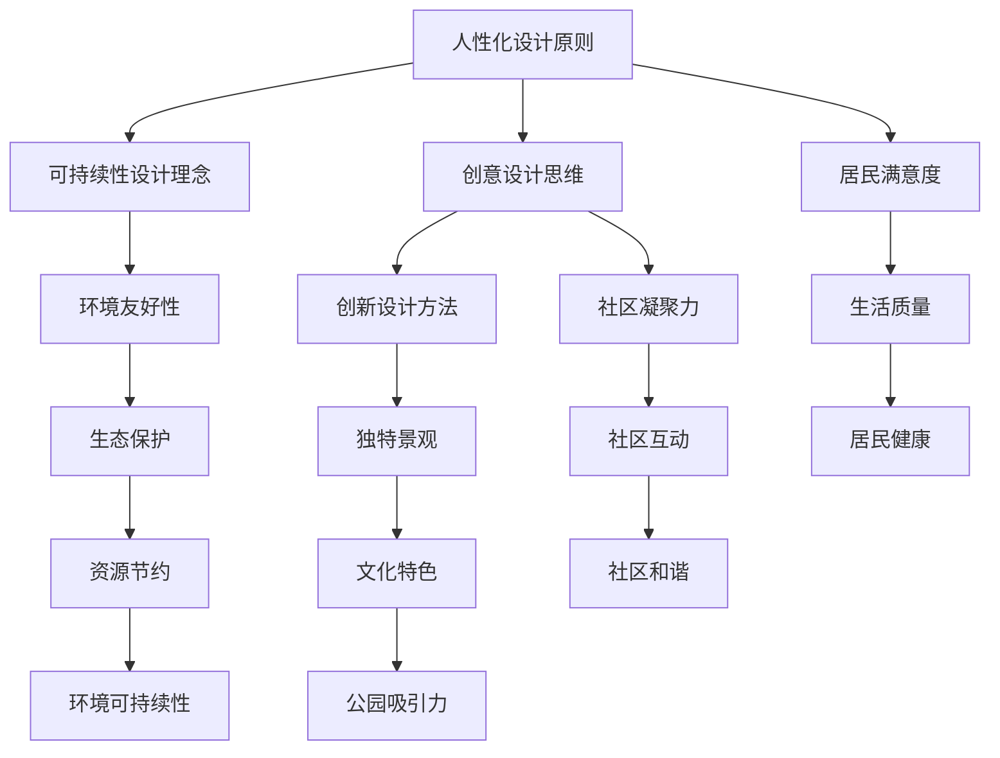
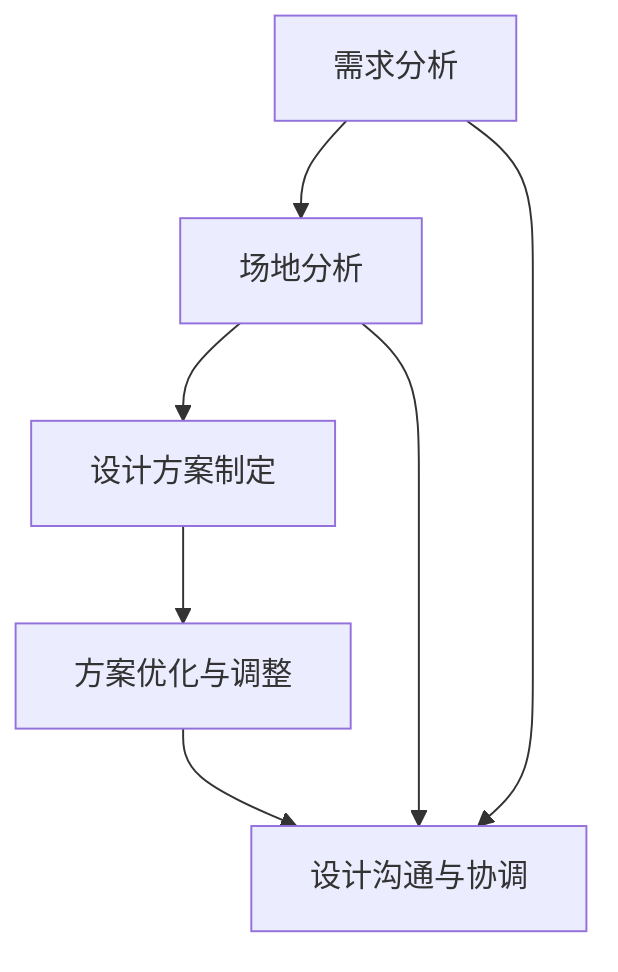
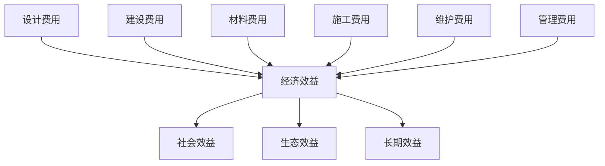

                 

### 文章标题：《新型城市微型公园：社区绿地的创意设计》

随着城市化进程的加速，城市绿地的重要性日益凸显。微型公园作为社区绿地的重要组成部分，不仅满足了城市居民对绿色空间的需求，还在提升城市品质、改善生态环境方面发挥着关键作用。本文旨在探讨新型城市微型公园的设计理念、原则和方法，以期为社区绿地的创意设计提供理论指导和实践参考。

关键词：微型公园、社区绿地、设计理念、创意设计、城市规划

摘要：本文首先介绍了微型公园的概念及其在城市规划中的价值。随后，阐述了新型城市微型公园的设计原则，包括人性化原则、可持续性原则和创意设计原则。接着，本文详细分析了设计方法，从需求分析、场地分析到设计方案制定和优化，每个环节都进行了深入讲解。此外，本文还通过国内外案例分析，探讨了社区绿地项目实践中的成功经验和教训。最后，本文提出了设计实施和维护的策略，并对成本效益进行了分析。

### 核心内容与主题思想

本文的核心内容主要包括以下几个方面：

1. **背景介绍**：介绍微型公园的概念、类型及其在城市规划中的重要性，分析当前社区绿地设计存在的问题。

2. **核心概念与联系**：阐述新型城市微型公园设计的核心概念，如人性化原则、可持续性原则和创意设计原则，并利用Mermaid流程图展示这些概念之间的关系架构。

3. **设计方法**：详细讲解设计流程，包括需求分析、场地分析、设计方案制定和优化等步骤，并使用伪代码和数学模型对核心算法原理进行阐述。

4. **案例分析**：分析国内外微型公园设计案例，总结成功经验，探讨设计实施中的关键问题。

5. **设计实施与维护**：讨论设计实施策略、维护原则和管理模式，并进行成本效益分析。

6. **最佳实践与小结**：提出最佳实践建议，总结文章主要内容，指出注意事项，并推荐拓展阅读资源。

通过本文的探讨，希望能够为城市微型公园的设计提供新的思路和方法，促进社区绿地的健康、可持续发展。接下来，我们将逐步深入探讨这些内容。让我们一起思考，如何通过创意设计，打造出更加宜居、生态、人性化的城市微型公园。### 背景介绍

微型公园，顾名思义，是指面积较小、设计精巧的公园，通常服务于城市中的特定社区或居民区。它们不同于传统的城市公园，往往不会占据大量的城市用地，而是在有限的空间内，通过巧妙的规划设计，创造出丰富的绿色生态空间。微型公园的类型多种多样，包括社区公园、儿童公园、城市广场、街头绿地等，它们在满足居民日常休闲、社交、运动需求的同时，还具有重要的生态功能和城市美化作用。

在城市规划中，微型公园扮演着不可或缺的角色。首先，它们是城市绿地系统的重要组成部分，能够有效补充城市公共绿地的不足，提高城市绿化覆盖率。其次，微型公园为居民提供了便捷的绿色活动空间，有助于改善城市生态环境，提升居民的生活质量。此外，微型公园的设计和建设还可以促进城市文化的传承和创新，成为城市特色风貌的重要体现。

然而，当前社区绿地设计面临诸多问题。一方面，许多城市在发展过程中，过分强调经济利益，忽视了城市绿地的建设，导致绿地面积不足、分布不均。另一方面，部分社区绿地设计过于单一，缺乏创意和人性化，无法满足居民多样化的需求。此外，社区绿地的维护和管理也存在不足，导致绿地设施老化、环境恶化，无法长期保持良好的使用状态。

新型城市微型公园的设计理念旨在解决这些问题，实现社区绿地的创新和可持续发展。首先，人性化设计原则强调以人为中心，关注居民的实际需求，创造舒适、安全、宜人的空间。其次，可持续性设计理念强调生态保护和资源利用的可持续性，通过绿色建筑、生态景观、可再生能源等手段，降低对环境的影响。最后，创意设计原则鼓励创新思维，结合地方文化和特色，打造独具特色的社区公园，提升城市文化魅力。

总之，新型城市微型公园的设计不仅需要满足功能和生态要求，还要注重人文关怀和创新性，以实现城市绿化、居民生活品质和环境可持续性的协调发展。接下来，我们将进一步探讨新型城市微型公园的设计原则和具体方法。### 核心概念与联系

在设计新型城市微型公园时，有三大核心概念需要我们深入理解，它们分别是人性化设计原则、可持续性设计理念和创意设计思维。这些核心概念之间有着密切的联系，共同构成了微型公园设计的理论基础。

首先，人性化设计原则强调以人为中心，关注居民的实际需求和体验。这不仅仅是满足物理层面的功能需求，更包括情感和心理层面的需求。例如，在设计过程中，我们需要考虑不同年龄段、不同健康状况的居民如何在使用公园时获得舒适和快乐。人性化设计原则与可持续性设计理念密切相关，因为可持续设计不仅要考虑生态和经济效益，也要关注人的健康和生活质量。因此，人性化设计原则是可持续性设计理念的重要基础。

其次，可持续性设计理念强调生态保护和资源利用的可持续性。这包括对自然资源的节约使用、生态系统的保护和环境的友好性。可持续性设计理念与创意设计思维相互作用，创意设计思维通过创新的方式和理念，提高了设计的可持续性。例如，通过引入可再生能源、生态材料、绿色建筑技术等，不仅可以降低环境负担，还能创造出独特且可持续的公园景观。

最后，创意设计思维是推动人性化设计和可持续性设计的重要动力。创意设计思维鼓励设计师跳出传统思维框架，勇于尝试新的设计方法和理念。通过创意设计思维，我们可以创造出既符合人性化原则，又具有高度可持续性的新型城市微型公园。例如，结合当地文化和特色，设计出具有独特风格和地域特点的公园，不仅提升了公园的吸引力，也增强了社区的凝聚力。

为了更直观地展示这些核心概念之间的关系架构，我们可以使用Mermaid流程图来描绘它们之间的联系：

通过这个流程图，我们可以清晰地看到人性化设计原则、可持续性设计理念和创意设计思维之间的紧密关系。人性化设计原则关注居民需求和满意度，可持续性设计理念注重生态保护和资源节约，而创意设计思维则通过创新方法和理念，提升了设计的可持续性和独特性。这些核心概念相互支撑，共同构成了新型城市微型公园设计的理论基础。接下来，我们将详细探讨每个核心概念的具体内容和应用方法。### 核心概念详解

#### 人性化设计原则

人性化设计原则是新型城市微型公园设计的基石，其核心在于以满足人的需求和提升人的体验为中心。人性化设计原则的具体内容可以从以下几个方面展开：

1. **易用性与舒适性**：在设计过程中，需要考虑不同年龄、性别、健康状况的居民如何在使用公园时获得舒适和便利。例如，公园的设计应包括无障碍通道，适合老人和儿童的设施，以及安全的健身器材。

2. **社交互动空间**：人性化设计不仅要满足个人的需求，还要鼓励居民之间的互动。因此，公园的设计应包含多种社交互动空间，如休息区、广场、运动场等，促进居民的社区参与和社交活动。

3. **文化融入**：公园设计应反映当地的文化特色和历史背景，增强居民对公园的认同感和归属感。通过融入当地的艺术、建筑风格和文化符号，可以提升公园的文化价值和吸引力。

4. **环境友好**：人性化设计还应考虑到环境友好性，例如，使用环保材料和节能技术，设计出有利于自然生态的景观，为居民提供一个健康、舒适的绿色空间。

#### 可持续性设计理念

可持续性设计理念强调在设计过程中对环境、社会和经济因素的全面考量，旨在实现生态、社会和经济三者的协调发展。以下是一些可持续性设计理念的关键点：

1. **资源节约**：在微型公园的设计和建设过程中，应尽量节约使用水资源、能源和材料。例如，通过雨水收集系统、太阳能照明等方式，减少对自然资源的消耗。

2. **生态保护**：设计应充分考虑自然生态系统的保护，避免破坏原有的自然景观和生物栖息地。引入本土植物、合理规划水体和植被，提高公园的生态价值和自我调节能力。

3. **环保材料**：在公园建设过程中，应优先选用环保、可回收或可再生的建筑材料和设备，减少对环境的负面影响。

4. **绿色建筑**：应用绿色建筑设计理念，采用节能、低碳的建筑技术，如绿色屋顶、自然通风系统等，降低建筑的能源消耗和碳排放。

#### 创意设计思维

创意设计思维是推动人性化设计和可持续性设计的强大动力，它鼓励设计师跳出传统框架，通过创新的方式和理念，提升设计的前瞻性和独特性。以下是一些创意设计思维的实践方法：

1. **文化融合**：将当地文化元素融入到公园设计中，创造出独特的公园景观和体验。例如，利用本地艺术家的作品、传统建筑风格等，打造具有地域特色的公园。

2. **技术创新**：利用最新的科技手段，如虚拟现实、增强现实、智能监控等，提升公园的互动性和智能化水平，为居民带来全新的体验。

3. **互动体验**：设计出多样化的互动设施，鼓励居民参与公园的管理和维护。例如，设立社区种植园、艺术创作角等，增强居民的参与感和归属感。

4. **生态景观**：通过创意设计，打造出独特的生态景观，如漂浮花园、立体绿化等，不仅提升了公园的视觉吸引力，也增加了生态价值。

#### 人性化设计原则、可持续性设计理念和创意设计思维之间的关系

人性化设计原则、可持续性设计理念和创意设计思维三者之间存在着紧密的互动关系。人性化设计原则为可持续性设计理念提供了实际操作的基础，它要求设计者在可持续性的前提下，更关注人的实际需求和体验。而可持续性设计理念则为人性化设计原则提供了环境保护和资源利用的保障，使得人性化设计更加持久和有效。创意设计思维则在这两者之间架起了桥梁，通过创新的思维和方法，实现了人性化设计和可持续性设计的有机融合。

总之，新型城市微型公园的设计需要综合考虑人性化设计原则、可持续性设计理念和创意设计思维，通过三者之间的相互促进和融合，打造出既满足居民需求、又具有生态可持续性的城市绿色空间。接下来，我们将探讨如何通过这些设计原则，具体实施新型城市微型公园的规划设计。### 设计方法

设计新型城市微型公园需要遵循一系列科学的步骤和方法，以确保最终设计既满足居民需求，又具有生态可持续性。以下是设计流程与步骤的详细分析：

#### 1. 需求分析

需求分析是设计过程的起点，通过对目标用户的需求进行调研和分析，确定公园的功能和空间布局。具体步骤包括：

1. **用户调研**：通过问卷调查、访谈、观察等方式，收集居民对于公园的功能需求、空间布局、景观偏好等方面的信息。

2. **数据分析**：整理和分析用户调研数据，识别出居民的主要需求，如休闲、社交、运动、教育等，为后续设计提供依据。

3. **需求分类**：根据数据分析结果，将需求分为核心需求和次要需求，为设计提供优先级。

#### 2. 场地分析

场地分析是设计过程中至关重要的一环，它涉及到对场地现状、环境特征、周边设施等因素的详细研究，以确保设计方案与场地条件相匹配。

1. **场地现状分析**：包括地形、地貌、植被、水体等自然条件，以及建筑、道路、管线等人工设施。

2. **环境特征分析**：评估场地的生态价值和环境敏感度，确定环境保护和生态修复的重点区域。

3. **周边设施分析**：考察周边交通、公共服务设施、社区活动场所等因素，确保公园与周边环境的协调和互补。

#### 3. 设计方案制定

设计方案制定是设计过程中的核心环节，包括初步设计、详细设计和方案评估三个阶段。

1. **初步设计**：根据需求分析和场地分析的结果，初步确定公园的功能布局、空间结构、景观风格等。这一阶段需要提出多个设计方案，以供选择和比较。

2. **详细设计**：在初步设计的基础上，细化各项设计要素，包括绿化配置、设施布局、交通组织等，形成详细的设计图纸和施工图纸。

3. **方案评估**：对设计方案进行多方面的评估，包括功能合理性、生态可持续性、经济可行性、美观度等，确保设计方案满足各项要求。

#### 4. 方案优化与调整

方案优化与调整是设计过程中的重要环节，通过对设计方案进行反复推敲和改进，提高设计的完善度和实施性。

1. **优化设计**：根据评估结果，对设计方案中的不足之处进行优化，如调整空间布局、改进设施配置、增强生态效益等。

2. **调整方案**：在优化设计的基础上，对设计方案进行进一步的调整，以确保最终方案能够达到设计目标。

#### 5. 设计沟通与协调

设计沟通与协调是确保设计方案顺利实施的关键，涉及到设计团队、政府管理部门、施工方和社区居民等多方主体的沟通和协调。

1. **内部沟通**：设计团队内部需要进行有效的沟通和协作，确保设计思想的一致性和连贯性。

2. **外部沟通**：与政府管理部门、施工方进行充分沟通，确保设计方案符合相关政策和技术标准，并获得必要的审批和支持。

3. **社区互动**：与社区居民保持密切互动，了解他们的意见和建议，确保设计方案能够得到社区广泛认同和支持。

#### 设计流程与步骤的关系架构

为了更直观地展示设计流程与步骤之间的关系架构，我们可以使用Mermaid流程图来描述：

通过这个流程图，我们可以清晰地看到需求分析、场地分析、设计方案制定、方案优化与调整以及设计沟通与协调等步骤之间的逻辑关系。需求分析是整个设计流程的起点，决定了设计的方向和目标；场地分析为设计提供了基础数据和支持；设计方案制定是将需求和场地条件转化为具体设计图纸的过程；方案优化与调整是对设计方案的不断改进和提升；设计沟通与协调则是确保设计方案顺利实施的重要保障。这些步骤相互关联、相互支撑，共同构成了完整的设计流程。### 规划设计

规划设计是新型城市微型公园设计的核心环节，它涉及到公园的整体布局、功能分区、交通组织、景观设计等多个方面。一个成功的规划设计不仅要满足功能需求，还要体现出创意和可持续性，为居民提供一个舒适、生态、美观的绿色空间。以下是规划设计的详细内容：

#### 1. 规划原则

在规划设计过程中，需要遵循以下原则：

1. **人性化原则**：以居民需求为中心，关注不同年龄段、不同健康状况的居民，设计出满足他们多样化需求的公园。

2. **可持续性原则**：在规划设计中考虑生态保护和资源利用的可持续性，采用环保材料和绿色建筑技术，降低对环境的影响。

3. **创意原则**：鼓励创新思维，结合地方文化和特色，打造具有独特风格的公园，提升公园的吸引力和文化价值。

4. **综合性原则**：综合考虑公园的功能、生态、社会、经济等多方面因素，实现综合效益最大化。

#### 2. 规划要素

规划设计包括多个关键要素，每个要素都对公园的整体效果和功能发挥至关重要。

1. **功能分区**：根据公园的用途和居民需求，将公园划分为不同的功能区域，如休闲区、运动区、儿童区、生态保护区等。每个区域都有明确的用途和设计要求，以确保功能分区明确、使用合理。

2. **景观设计**：景观设计是公园规划的核心，通过巧妙的空间布局、植被配置、景观元素等，打造出独特的公园景观。景观设计应注重生态保护和美学效果，同时融入地方文化元素，提升公园的文化价值。

3. **设施配置**：公园设施是居民使用公园的基础，包括休息设施、健身设施、儿童游乐设施、公共厕所、停车场等。设施配置应充分考虑人性化原则，确保设施的数量、种类和布局合理，满足居民的需求。

4. **交通组织**：合理的交通组织是公园规划的重要一环，包括公园内的交通流线和与外部交通的连接。设计应确保交通便捷、安全，减少对周边环境的影响。

5. **生态保护**：在规划设计中，应充分考虑生态保护和修复，通过合理的植被配置、水体管理、土壤保护等手段，提升公园的生态价值。

#### 3. 规划案例分析

以下是一些国内外微型公园规划设计的成功案例，通过这些案例可以更好地理解规划设计的方法和要点。

1. **国内案例**：

   - **上海苏州河畔公园**：苏州河畔公园是一个结合了生态修复、文化展示和城市休闲的综合性公园。在规划设计中，注重生态保护和人文关怀，采用了可持续性设计理念，如雨水收集系统、透水铺装等，提升了公园的生态效益和可持续性。

   - **北京朝阳大悦城公园**：朝阳大悦城公园是一个典型的城市广场公园，设计上注重人性化原则，设置了多样化的休闲、运动、文化等功能区域，同时结合地方文化特色，打造出独特的城市景观。

2. **国外案例**：

   - **荷兰马城生态公园**：马城生态公园是一个典型的生态公园，设计上以生态保护和可持续发展为核心，通过引入生态技术和绿色建筑，实现了生态效益和经济效益的双重提升。

   - **美国纽约中央公园**：纽约中央公园是一个历史悠久的城市公园，设计上注重创意和可持续性，通过巧妙的景观布局和设施配置，为居民提供了一个舒适、生态、美观的休闲空间。

#### 4. 规划设计策略

为了实现高效、创新和可持续的规划设计，以下是一些具体的策略：

1. **多元参与**：在规划设计中，应鼓励政府、企业、社会组织和居民等多方参与，共同讨论和制定规划设计方案，确保方案的合理性和可实施性。

2. **创新思维**：鼓励设计师运用创新思维，探索新的设计方法和理念，如利用虚拟现实技术、智能监控等技术，提升公园的互动性和智能化水平。

3. **生态优先**：在规划设计中，应优先考虑生态保护和修复，通过合理的植被配置、水体管理、土壤保护等手段，提升公园的生态价值。

4. **经济可行**：在保证公园功能、生态和美观的前提下，应充分考虑经济可行性，通过合理的投资和运营管理，确保公园的长期可持续发展。

5. **长期规划**：规划设计应具有前瞻性和可持续性，不仅要考虑当前的需求和问题，还要为未来的发展和变化留有足够的空间和弹性。

总之，规划设计是新型城市微型公园设计的重要组成部分，它关系到公园的功能、生态、社会和经济等多个方面。通过遵循规划原则、充分考虑规划要素、借鉴成功案例和制定有效策略，我们可以打造出既满足居民需求、又具有生态可持续性的新型城市微型公园。### 景观设计

景观设计在新型城市微型公园中扮演着至关重要的角色，它不仅关乎公园的美学价值，更直接影响到公园的功能性和可持续性。以下从景观设计原则、要素、案例分析和设计技巧与建议四个方面进行详细探讨。

#### 1. 景观设计原则

1. **生态原则**：生态原则是景观设计的核心，要求设计师在景观设计中注重自然生态的平衡和保护。通过合理的植被配置和水体管理，促进生态系统的稳定和可持续发展。

2. **人性化原则**：人性化原则要求景观设计以满足人的需求为中心，考虑不同年龄、性别和健康状况的居民，提供舒适、安全、宜人的空间。例如，为儿童设计安全的游戏设施，为老人设计便捷的休息区。

3. **可持续性原则**：可持续性原则强调在设计过程中节约资源、减少污染，采用环保材料和绿色建筑技术。例如，使用本地植物、透水铺装、雨水收集系统等，提高公园的生态效益和可持续性。

4. **创意原则**：创意原则鼓励设计师运用创新思维，打造独特的景观风格和体验。通过融入当地文化和特色，提升公园的文化价值和吸引力。

#### 2. 景观设计要素

1. **植被配置**：植被是景观设计的重要组成部分，通过合理配置不同种类的植物，可以形成多样的景观效果。植被配置应考虑季节变化、生态功能和美学效果，同时注意植物与公园整体设计的协调性。

2. **水体设计**：水体是公园的“灵魂”，通过设计水体景观，可以增加公园的生态价值和美观度。水体设计包括池塘、喷泉、溪流等，应注意水质的保护和净化，以及与周边环境的协调。

3. **景观设施**：景观设施包括座椅、凉亭、雕塑、花坛等，是公园功能性和美观性的重要体现。设施设计应考虑人性化原则，满足居民的休闲、社交、运动需求，同时注重与自然景观的融合。

4. **夜景照明**：夜景照明是公园景观设计的一个重要环节，通过合理的灯光设计，可以增强公园的美感和安全性。照明设计应注重节能环保，避免光污染，同时创造独特的夜景效果。

#### 3. 景观设计案例分析

以下是一些国内外微型公园的景观设计案例，通过分析这些案例，可以更好地理解景观设计的具体实践和效果。

1. **国内案例**：

   - **上海世博园后滩公园**：后滩公园是一个融合了生态修复、休闲游览和文化展示的城市公园。在景观设计中，注重生态原则和人性化原则，通过多样化的植被配置、水体设计和设施配置，为居民提供了一个舒适、生态的绿色空间。

   - **北京颐和园苏州街**：颐和园苏州街是一个以江南水乡为主题的景观区。在景观设计中，巧妙地利用了水体、建筑和植被，营造出浓郁的江南水乡氛围，既具有美学价值，又具有文化内涵。

2. **国外案例**：

   - **荷兰马城生态公园**：马城生态公园是一个典型的生态公园，设计上注重生态保护和可持续发展。通过植被配置、水体设计和设施配置，形成了多样的生态景观，为居民提供了一个生态友好的休闲空间。

   - **美国纽约中央公园**：中央公园是美国最著名的城市公园，设计上融合了生态、文化和人性化原则。通过巧妙的植被配置、水体设计和设施配置，打造出多个不同风格的景观区，为居民提供了一个多样化的休闲空间。

#### 4. 设计技巧与建议

1. **融合自然与人文**：在景观设计中，应注重自然景观与人文元素的融合，通过植物、水体、建筑等元素，打造出既有自然美感，又有人文内涵的景观。

2. **注重细节设计**：景观设计的细节是影响整体效果的关键，设计师应注重细节设计，如座椅的布局、步道的宽窄、景观设施的样式等，确保每一个细节都符合人性化原则和美学要求。

3. **生态优先**：在景观设计中，应优先考虑生态保护和修复，通过合理的植被配置、水体管理、土壤保护等手段，提高公园的生态价值和可持续性。

4. **可持续性照明**：在夜景照明设计中，应采用节能环保的照明技术，如LED照明、太阳能照明等，减少能源消耗和环境污染，同时创造出独特的夜景效果。

5. **社区参与**：在景观设计中，应鼓励社区居民参与，通过社区活动、工作坊等方式，收集居民的意见和建议，共同打造出符合社区需求的公园景观。

总之，景观设计是新型城市微型公园的重要组成部分，它通过生态、人性化、可持续性和创意的设计原则，为居民提供了一个舒适、生态、美观的绿色空间。通过合理的设计技巧和建议，我们可以打造出独具特色的公园景观，提升城市生态环境和居民生活质量。### 设施设计

在新型城市微型公园中，设施设计是满足居民多样化需求、提升公园功能性的关键环节。合理的设施配置不仅能够增强公园的吸引力，还能提高居民的满意度。以下是设施设计原则、要素、案例分析及设计技巧与建议的详细探讨。

#### 1. 设施设计原则

设施设计应遵循以下原则：

1. **人性化原则**：以居民需求为中心，考虑不同年龄段、健康状况和兴趣爱好的人群，设计出满足他们多样化需求的设施。例如，设置适合儿童和老人的设施，以及提供不同运动项目的场地。

2. **功能性原则**：设施设计应具备明确的功能性，能够满足居民日常的休闲、社交、运动需求。例如，设置休闲座椅、健身器材、儿童游乐场等。

3. **可持续性原则**：在设施设计过程中，应考虑设施的材料选择、能耗和维护成本，尽量使用环保材料和技术，降低对环境的影响。例如，采用太阳能充电设施、可回收材料的座椅等。

4. **美观性原则**：设施设计应注重美学效果，与公园的整体景观协调一致，提升公园的整体美观度和艺术价值。例如，设计造型独特、色彩和谐的设施。

#### 2. 设施设计要素

设施设计包括多个关键要素，每个要素都对公园的功能性和用户体验有着重要影响。

1. **休闲设施**：包括休息座椅、长椅、凉亭等，为居民提供舒适、安静的休闲空间。这些设施应布局合理，满足居民的休憩需求。

2. **健身设施**：包括健身器材、运动场等，为居民提供锻炼身体的机会。设计时应考虑不同年龄段和健康状况的居民，设置多样化的健身设施。

3. **儿童设施**：包括儿童游乐场、儿童攀爬设施等，为儿童提供安全、有趣的游乐环境。设计时应注重安全性，避免潜在的危险。

4. **公共设施**：包括公共厕所、饮水设施、垃圾箱等，为居民提供基本的公共服务。设计时应确保设施的便捷性和卫生性。

5. **文化设施**：包括展览馆、文化广场等，为居民提供文化交流和活动的场所。设计时应注重文化内涵和艺术价值。

#### 3. 设施设计案例分析

以下是一些国内外微型公园的设施设计案例，通过分析这些案例，可以更好地理解设施设计的具体实践和效果。

1. **国内案例**：

   - **上海世博园后滩公园**：后滩公园在设施设计上充分考虑了人性化原则和功能性原则，设置了多种休闲设施、健身设施和文化设施，满足了居民的多样化需求。

   - **北京颐和园苏州街**：颐和园苏州街的设施设计注重美观性和文化性，通过设置文化广场、古建筑等，为居民提供了一个富有文化内涵的休闲空间。

2. **国外案例**：

   - **荷兰马城生态公园**：马城生态公园在设施设计上强调可持续性原则，通过使用环保材料和节能技术，为居民提供了一个生态友好的休闲环境。

   - **美国纽约中央公园**：中央公园的设施设计注重人性化原则和功能性原则，通过设置多样化的设施，为居民提供了丰富的休闲和运动选择。

#### 4. 设计技巧与建议

1. **功能与美学的结合**：在设施设计过程中，应注重功能与美学的结合，通过独特的设计理念和精细的工艺，打造出既有实用性，又有美观性的设施。

2. **注重安全性**：在设施设计时，应充分考虑安全性，避免潜在的危险。例如，儿童设施应设置防护措施，健身设施应选择符合安全标准的设备。

3. **智能化与互动性**：在设施设计过程中，可以引入智能化技术，提高设施的使用效率和用户体验。例如，设置智能健身设备、智能饮水设施等。

4. **可持续性设计**：在设施设计过程中，应采用环保材料和绿色技术，降低对环境的影响。例如，使用可回收材料、太阳能照明等。

5. **社区参与**：在设施设计过程中，应鼓励社区居民参与，通过社区活动、工作坊等方式，收集居民的意见和建议，共同打造出符合社区需求的设施。

总之，设施设计是新型城市微型公园的重要组成部分，它通过人性化、功能性、可持续性和美观性的设计原则，为居民提供了一个舒适、便捷、生态的绿色空间。通过合理的设计技巧和案例借鉴，我们可以打造出既满足居民需求，又具有创新性和可持续性的公园设施，提升公园的整体品质和居民的生活满意度。### 案例分析

#### 3.1 国内外微型公园案例赏析

在探讨新型城市微型公园的设计时，借鉴和分析国内外成功的微型公园案例是十分有价值的。以下将介绍几个具有代表性的案例，并对其设计特点和成功经验进行评价。

##### 3.1.1 国外典型案例

**案例一：荷兰马城生态公园**

荷兰马城生态公园是一个以生态保护和可持续发展为核心的微型公园。该公园通过巧妙的水体设计、植被配置和生态修复技术，实现了自然景观与人工设施的完美融合。

**设计特点**：

1. **生态修复**：公园内通过建造人工湿地和雨水花园，有效处理了雨水径流，减少了城市排水系统的负担，提升了水体的自净能力。

2. **植被多样性**：采用了大量的本地植物，形成了多样化的植被景观，不仅美化了环境，还有效地保持了土壤和水分。

3. **互动设施**：设置了多个互动体验区，如观鸟台、自然教育中心等，增强了居民的参与感和对生态保护的认识。

**成功经验**：

- 生态保护与居民互动相结合，提高了公园的生态效益和社区凝聚力。
- 采用可持续设计理念，为其他城市微型公园提供了可借鉴的范例。

**案例二：美国纽约中央公园**

纽约中央公园是世界上最具知名度的城市公园之一，其微型公园的设计同样值得借鉴。该公园通过多样化的景观设计和功能性设施，满足了居民的多样化需求。

**设计特点**：

1. **多功能性**：公园内包含了休闲、运动、文化等多种功能区域，如高尔夫球场、运动场、音乐厅等。

2. **文化融入**：公园设计融入了当地的历史和文化，如古代建筑风格的亭台、雕塑等，提升了公园的文化价值。

3. **景观美学**：通过巧妙的空间布局和植被配置，形成了独特的景观效果，使公园成为城市中的一片绿洲。

**成功经验**：

- 多功能性和文化融入相结合，提升了公园的吸引力。
- 注重人性化设计，满足了不同年龄段和健康状况的居民需求。

##### 3.1.2 国内典型案例

**案例一：上海世博园后滩公园**

后滩公园是上海世博园的一个组成部分，其设计理念兼顾生态、文化和人性化。

**设计特点**：

1. **生态修复**：通过植物配置和湿地建设，改善了园区的生态环境，提高了水体的自净能力。

2. **文化展示**：公园内设有多个文化展示区，如雕塑公园、艺术广场等，展示了丰富的文化元素。

3. **人性化设施**：设置了多样化的休闲设施和公共设施，如休闲长椅、儿童游乐场、公共厕所等，满足了居民的多样化需求。

**成功经验**：

- 生态修复与文化建设相结合，提升了公园的生态价值和人文底蕴。
- 人性化设施设计，提高了居民的使用体验和满意度。

**案例二：北京朝阳大悦城公园**

朝阳大悦城公园是一个结合城市商业和休闲功能的城市微型公园。

**设计特点**：

1. **多功能性**：公园内设置了多样化的休闲、运动、文化设施，如广场、运动场、文化中心等。

2. **互动体验**：通过设置互动设施和主题活动，增强了居民的参与感和互动性。

3. **景观美学**：通过巧妙的空间布局和景观设计，提升了公园的美学价值。

**成功经验**：

- 多功能性和互动体验相结合，提升了公园的活力和吸引力。
- 商业与公园的有机结合，实现了经济效益和社会效益的双重提升。

##### 3.1.3 案例评价与启示

通过对国内外微型公园案例的分析，我们可以总结出以下评价和启示：

1. **生态保护与人性化设计并重**：成功的微型公园设计应同时考虑生态保护和人性化设计，以实现公园的可持续发展。

2. **文化融入与多功能性**：文化融入和多功能性是提升公园吸引力和使用价值的重要手段，应予以重视。

3. **创新设计与实践应用**：创新设计思维和实践应用是打造独特公园的关键，应鼓励设计师大胆尝试。

4. **社区参与与维护管理**：社区参与和有效的维护管理是确保公园长期健康发展的基础，应建立健全的社区参与机制和专业的维护管理体系。

通过借鉴这些成功案例，我们可以为新型城市微型公园的设计提供宝贵的经验和启示，促进社区绿地创意设计的不断进步和优化。#### 社区绿地项目实践

社区绿地项目的成功实施不仅需要科学的设计，还需要严密的实施过程和有效的管理。以下将从项目背景、目标、实施过程和效果评估四个方面详细描述一个社区绿地项目的实践案例，并总结经验教训。

##### 3.2.1 项目背景

本项目位于我国某城市的一个住宅小区，该小区居住人口约1万人，绿地面积相对较小，居民对于更加宜居的绿色空间有强烈需求。项目背景主要包括以下几个方面：

1. **居民需求**：居民对绿地面积、设施多样性、生态保护和文化活动等方面有较高期望。

2. **政策支持**：当地政府对于城市绿地建设有明确要求，鼓励社区参与和生态修复。

3. **资金来源**：项目资金主要包括政府补贴、社区自筹和捐助资金。

##### 3.2.2 项目目标

项目的主要目标如下：

1. **提升绿地面积**：通过合理规划，增加绿地面积，提高绿化覆盖率。

2. **多样化设施**：提供多样化的休闲、运动和文化设施，满足居民的多样化需求。

3. **生态保护**：通过生态修复技术和可持续设计理念，保护原有生态系统，提升公园的生态价值。

4. **文化融入**：融入当地文化元素，提升公园的文化内涵和吸引力。

##### 3.2.3 项目实施过程

项目实施过程分为以下几个阶段：

1. **需求调研**：通过问卷调查、访谈和座谈会等形式，深入了解居民的需求和期望，为后续设计提供依据。

2. **规划设计**：结合需求调研结果，制定详细的设计方案，包括植被配置、设施布局、交通组织等。

3. **施工准备**：完成设计审批后，进行施工准备，包括施工图纸的细化、施工队伍的选择和施工材料的采购。

4. **施工实施**：按照设计方案进行施工，主要包括植被种植、设施安装、道路铺装等。

5. **监测与调整**：在施工过程中，进行现场监测，及时发现和解决施工问题，确保施工质量。

6. **竣工验收**：施工完成后，进行竣工验收，确保各项设施和功能符合设计要求。

##### 3.2.4 项目效果评估

项目实施后，进行了以下效果评估：

1. **绿地面积**：通过测量和统计，项目新增绿地面积约2000平方米，达到了预期目标。

2. **设施使用情况**：通过居民反馈和现场观察，设施使用情况良好，各种设施均能满足居民的需求。

3. **生态效益**：通过对公园内的水质、土壤和植被的监测，公园的生态效益显著，生态环境得到了有效保护。

4. **社会效益**：社区居民对公园满意度高，公园成为居民休闲、社交和锻炼的重要场所，社区凝聚力得到提升。

##### 3.2.5 经验教训

通过本项目，我们得到了以下经验和教训：

1. **充分调研**：在项目实施前，应充分调研居民需求，确保设计方案符合实际需求。

2. **科学规划**：规划设计应充分考虑功能分区、生态保护和人性化设计，确保公园的长期可持续性。

3. **严格施工**：施工过程中应严格把控质量，确保设施和植被的安装符合设计要求。

4. **社区参与**：鼓励社区居民参与项目设计、施工和维护，提升公园的社区归属感。

5. **监测与调整**：项目实施过程中，应定期进行监测和调整，及时发现和解决问题。

总之，通过科学的设计和严密的实施过程，社区绿地项目可以有效地提升居民生活质量，促进社区和谐发展。本项目为其他社区绿地项目的实施提供了有益的经验和参考。### 设计实施策略

在新型城市微型公园的设计实施过程中，施工管理、质量控制和资源配置是确保项目顺利进行和达到预期效果的关键环节。以下将详细探讨这些方面的策略和方法。

#### 1. 施工管理

施工管理是项目实施的核心，其目标是在保证工程质量和安全的前提下，高效、有序地完成施工任务。具体策略包括：

1. **施工计划**：制定详细的施工计划，明确施工进度、施工内容和责任人，确保施工有条不紊地进行。

2. **施工队伍选择**：选择经验丰富、资质齐全的施工队伍，并进行严格的考核和培训，确保施工人员具备必要的技能和安全意识。

3. **施工监督**：设立施工现场监督机制，对施工过程进行全程监控，及时发现和纠正问题，确保施工质量。

4. **应急预案**：制定应急预案，应对可能出现的突发情况，如自然灾害、设备故障等，确保施工安全和进度。

#### 2. 质量控制

质量控制是施工管理的延伸，其目标是通过严格的质量管理，确保工程达到设计标准和用户需求。具体方法包括：

1. **质量标准**：制定符合国家法规和行业规范的质量标准，作为施工和验收的依据。

2. **质量检查**：在施工过程中，定期进行质量检查，包括原材料检查、施工过程检查和竣工检查，确保每个环节的质量。

3. **反馈机制**：建立质量反馈机制，及时收集施工中的质量问题，分析原因并采取措施，防止问题重复发生。

4. **用户反馈**：收集用户的反馈意见，了解他们对公园设施和环境的满意度，不断改进设计方案和施工质量。

#### 3. 资源配置

资源配置是施工管理的重要环节，其目标是在预算范围内，合理分配人力、物力和财力资源，确保项目的顺利进行。具体策略包括：

1. **预算编制**：根据项目规模和需求，编制详细的预算，明确资金分配和使用范围。

2. **资源调度**：根据施工进度和需求，合理调配人力、物力和财力资源，确保施工过程中资源充足、调配及时。

3. **成本控制**：通过严格的成本控制措施，如优化施工方案、合理采购材料、降低施工成本，确保项目在预算范围内完成。

4. **风险管理**：识别和评估项目中的潜在风险，如资金短缺、资源浪费等，制定风险应对策略，确保项目顺利进行。

#### 4. 施工管理、质量控制和资源配置之间的关系

施工管理、质量控制和资源配置三者之间密切相关，共同构成一个完整的项目管理体系。

1. **相互依赖**：施工管理需要质量控制和资源配置的支持，而质量控制和资源配置也需要施工管理的协调和监督。

2. **相互促进**：施工管理通过科学规划和管理，提高施工效率和质量；质量控制通过严格检查和反馈，确保施工质量；资源配置通过合理分配和调度，保障施工顺利进行。

3. **共同目标**：尽管三个方面的具体目标和职责不同，但最终目标都是确保项目按计划、高质量、高效地完成，实现预期效果。

总之，在新型城市微型公园的设计实施过程中，施工管理、质量控制和资源配置是关键环节，通过科学的策略和方法，可以确保项目顺利进行，达到预期效果。### 微型公园维护与管理

微型公园作为社区绿地的重要组成部分，其维护与管理对于确保公园的长期健康和可持续性至关重要。以下是维护原则、策略、管理模式及成本效益分析的详细探讨。

#### 1. 维护原则

维护原则是微型公园维护与管理的基础，主要包括以下几点：

1. **以人为本**：维护工作应以居民需求为中心，确保公园设施和环境的持续改善和优化。

2. **预防为主**：通过定期检查和维护，预防设施的老化和环境问题的发生，减少突发性维修成本。

3. **科学管理**：运用现代科技手段，如智能监控系统、数字化管理平台等，提高维护效率和管理水平。

4. **环保优先**：在维护过程中，注重环保措施，减少对环境的负面影响。

#### 2. 维护策略

维护策略是确保公园长期健康的重要手段，包括以下几个方面：

1. **定期检查**：对公园内的设施、植被、水体等进行定期检查，及时发现和修复问题。

2. **预防性维护**：对易损设施和设备进行预防性维护，如涂漆、更换零件等，防止故障发生。

3. **紧急维修**：建立紧急维修机制，应对突发事件，确保公园的正常使用。

4. **环境修复**：对于环境问题，如水土污染、植被破坏等，采取相应的修复措施，恢复生态平衡。

#### 3. 管理模式

管理模式是维护工作的保障，包括以下几个方面：

1. **社区参与**：鼓励居民参与公园的维护和管理，提高社区的凝聚力和归属感。

2. **专业化团队**：建立专业的维护团队，提供专业的技术支持和指导，确保维护工作的质量和效率。

3. **数字化管理**：利用数字化管理平台，实现公园设施的智能监控和数据分析，提高管理效率和决策水平。

4. **定期培训**：对维护人员进行定期培训，提高其专业技能和环保意识。

#### 4. 成本效益分析

成本效益分析是评估公园维护与管理效果的重要指标，包括以下几个方面：

1. **成本构成**：包括维护人员工资、设施维修费用、环保材料采购费用、设备维护费用等。

2. **成本控制**：通过科学的管理和预防性维护，降低维修成本和突发性支出。

3. **效益评估**：通过居民满意度调查、公园使用频率等指标，评估维护管理的效益。

4. **投资回报**：分析维护管理的长期效益，如提高公园的使用寿命、减少维修频率等，评估投资回报率。

总之，微型公园的维护与管理需要遵循以人为本、预防为主、科学管理和环保优先的原则，通过制定合理的维护策略、选择合适的管理模式，并进行全面的成本效益分析，确保公园的长期健康和可持续性。### 成本效益分析

在新型城市微型公园的建设和维护过程中，成本效益分析是确保项目可行性和经济合理性的关键。以下是成本效益分析的具体内容，包括成本构成、成本控制措施以及效益评估。

#### 1. 成本构成

微型公园的成本主要由以下几个方面构成：

1. **设计费用**：包括规划设计费、方案评审费、设计软件使用费等。

2. **建设费用**：包括土地购置费、基础设施建设费（如道路、排水、照明等）、植被种植费、设施安装费等。

3. **材料费用**：包括环保材料、建筑材料的采购费用。

4. **施工费用**：包括施工队伍的劳务费、施工设备租赁费、施工管理费等。

5. **维护费用**：包括日常维护、设施维修、环境修复、安全巡查等费用。

6. **管理费用**：包括管理人员工资、管理设施运行费用等。

#### 2. 成本控制措施

为了确保成本效益，以下是一些有效的成本控制措施：

1. **预算编制**：在项目启动前，编制详细的预算，明确各项费用的具体金额和用途。

2. **招标采购**：通过公开招标，选择性价比高的供应商，降低材料采购成本。

3. **优化设计**：在设计阶段，优化方案，减少不必要的设施和材料，降低建设成本。

4. **施工管理**：通过科学的管理和监督，确保施工过程高效、有序，减少浪费。

5. **维护策略**：采用预防性维护策略，减少突发性维修费用。

6. **资源利用**：通过循环利用、再生利用等措施，降低材料消耗和维修成本。

#### 3. 效益评估

微型公园的效益评估主要包括以下几个方面：

1. **经济效益**：通过减少环境治理费用、提高土地价值等途径，评估公园的经济效益。

2. **社会效益**：通过提高居民生活质量、促进社区凝聚力等途径，评估公园的社会效益。

3. **生态效益**：通过提升城市绿化率、改善空气质量等途径，评估公园的生态效益。

4. **长期效益**：评估公园的长期使用寿命、降低维护成本等长期效益。

为了更直观地展示成本效益分析，我们可以使用以下Mermaid流程图：

通过这个流程图，我们可以清晰地看到成本效益分析的主要组成部分及其相互关系。设计费用、建设费用、材料费用、施工费用、维护费用和管理费用构成了微型公园的主要成本，这些成本最终通过经济效益、社会效益、生态效益和长期效益表现出来。

#### 4. 成本与效益分析

在成本与效益分析中，需要综合考虑项目的全部成本和预期效益，进行全面的评估。

1. **短期成本与效益**：在项目初期，设计费用、建设费用和部分材料费用是主要成本。然而，通过科学的设计和合理的施工管理，可以显著降低建设成本。与此同时，公园的建成将带来短期内的社会效益，如提高居民满意度、增强社区凝聚力等。

2. **长期成本与效益**：随着公园的长期使用，维护费用和管理费用逐渐成为主要支出。然而，通过预防性维护和科学管理，可以延长设施使用寿命，降低长期维护成本。同时，公园的生态效益和经济效益将在长期内逐步显现，如改善城市生态环境、提升土地价值等。

3. **经济与社会效益**：微型公园不仅为居民提供了休闲、社交和锻炼的空间，还有助于提升城市形象和居民生活质量，具有显著的社会效益。通过生态修复和环境保护措施，公园还为城市提供了重要的生态服务，如空气和水质的净化，具有长期的经济和社会效益。

综上所述，新型城市微型公园的成本效益分析需要综合考虑短期和长期效益，通过合理的成本控制和有效的管理措施，实现经济效益、社会效益和生态效益的协调发展。### 附录

#### 附录 A：设计工具与资源推荐

在进行新型城市微型公园设计时，选择合适的设计工具和资源是确保项目顺利进行的关键。以下是一些常用的设计工具、规范与资源推荐：

1. **设计软件**：

   - **AutoCAD**：适用于建筑设计、工程绘图和详细设计，具有丰富的绘图功能。

   - **SketchUp**：一款直观的3D建模软件，适用于快速建模和概念设计。

   - **ArcGIS**：强大的地理信息系统软件，适用于场地分析和景观设计。

   - **PlantDesign**：专门用于园林景观设计的软件，具有丰富的植物库和景观元素。

2. **设计规范与标准**：

   - **《城市绿地设计规范》（CJJ/T 85-2002）**：提供了城市绿地设计的基本要求和规范。

   - **《园林设计规范》（GB 50757-2012）**：涉及园林景观设计的规范和标准。

   - **《城市绿地植物配置技术规范》（CJJ/T 112-2006）**：提供了城市绿地植物配置的技术标准。

3. **设计资源网站推荐**：

   - **ArchDaily**：全球建筑与设计领域的知名网站，提供大量的设计案例和灵感。

   - **Inhabitat**：专注于可持续设计和绿色建筑的创新网站。

   - **Land8**：专注于景观设计和绿色建筑的社区网站，提供丰富的案例和资源。

   - **园林景观设计网**：提供园林景观设计的相关资讯、案例和资源。

通过使用这些设计工具、规范与资源，设计师可以提升设计效率，确保设计方案的科学性和创新性。同时，这些资源也为设计师提供了广阔的视野和灵感，助力打造出具有独特风格和生态价值的微型公园。### 附录 B：案例列表

在本章中，我们讨论了新型城市微型公园的设计理念、方法、实施策略和维护管理。为了更好地理解这些概念，以下列举了国内外一些具有代表性的微型公园案例，供读者参考：

1. **国内案例**：

   - **上海世博园后滩公园**：融合了生态修复、休闲游览和文化展示的综合性公园，以生态保护和文化融入为设计特色。

   - **北京朝阳大悦城公园**：结合城市商业和休闲功能，提供了多样化的设施和文化活动，注重人性化设计和多功能性。

   - **广州珠江新城公园**：通过巧妙的空间布局和景观设计，打造出具有独特岭南风格的城市绿洲。

2. **国外案例**：

   - **荷兰马城生态公园**：以生态保护和可持续发展为核心，通过生态修复技术和多样化植被配置，形成了生态友好的公园环境。

   - **美国纽约中央公园**：世界上最具知名度的城市公园之一，其多样化的景观设计和多功能性设施为全球设计师提供了宝贵的参考。

   - **日本东京代代木公园**：结合自然景观和城市建筑，创造了具有现代感的城市公园，强调人与自然的和谐共存。

这些案例展示了不同城市在微型公园设计方面的创新和实践，为读者提供了丰富的灵感和参考。通过学习这些案例，设计师可以更好地理解新型城市微型公园的设计原则和方法，为未来的项目提供有力的支持。### 最佳实践与小结

在新型城市微型公园的设计和实施过程中，遵循最佳实践是确保项目成功的关键。以下是几条重要的最佳实践建议，以及文章的小结和注意事项。

#### 最佳实践建议

1. **需求分析与调研**：在项目初期，进行全面的需求分析和居民调研，确保设计方案满足实际需求。

2. **生态保护优先**：在规划设计过程中，优先考虑生态保护和可持续性，采用环保材料和绿色技术。

3. **人性化设计**：充分考虑不同年龄段和健康状况的居民需求，设计人性化的设施和空间。

4. **多元化参与**：鼓励政府、企业、社会组织和居民等多方参与，共同讨论和制定设计方案。

5. **技术创新**：运用最新的设计工具和技术手段，提高设计效率和质量。

6. **科学管理与维护**：建立科学的管理和监测机制，确保公园的长期健康和可持续性。

#### 小结

本文从背景介绍、核心概念、设计方法、案例分析、实施策略、维护管理以及成本效益分析等方面，系统地探讨了新型城市微型公园的创意设计。通过分析国内外成功案例，总结了最佳实践方法，为社区绿地的设计提供了理论指导和实践参考。

#### 注意事项

1. **充分调研**：在设计前，进行充分的需求分析和居民调研，确保设计方案符合实际需求。

2. **生态保护**：在设计中，注重生态保护和可持续性，采用环保材料和绿色技术。

3. **人性化设计**：充分考虑居民需求，设计人性化、多功能性的设施和空间。

4. **社区参与**：鼓励社区参与项目设计、施工和维护，提高公园的社区归属感。

5. **技术创新**：利用最新设计工具和技术，提高设计效率和质量。

6. **科学管理**：建立科学的管理和监测机制，确保公园的长期健康和可持续性。

#### 拓展阅读

1. **《城市绿地设计手册》**：详细介绍了城市绿地设计的基本原则和方法。

2. **《生态城市与城市绿地规划》**：探讨了生态城市与城市绿地规划的理论和实践。

3. **《社区公园规划设计指南》**：提供了社区公园规划设计的实用指南和案例。

通过以上内容，希望读者能够深入理解新型城市微型公园的创意设计，并为未来的项目提供有益的参考和启示。### 结语

本文通过对新型城市微型公园的设计理念、原则、方法、案例分析、实施策略、维护管理以及成本效益分析等方面的深入探讨，系统地总结了社区绿地创意设计的关键要素和实践经验。我们强调了生态保护、人性化设计、技术创新和社区参与的重要性，为未来城市微型公园的设计提供了理论指导和实践参考。

新型城市微型公园不仅是城市绿地系统的重要组成部分，更是提升居民生活质量、改善生态环境、促进社区和谐的重要途径。随着城市化进程的加速和居民环保意识的提高，社区绿地的重要性日益凸显。因此，如何通过创意设计，打造出既满足居民需求、又具有生态可持续性的城市微型公园，将成为未来城市规划和发展的重要课题。

本文通过分析国内外成功案例，总结了最佳实践方法，旨在为读者提供有价值的参考。然而，由于微型公园设计涉及多个方面，本文仅能提供宏观的指导和建议。在实际项目中，设计师需要根据具体情况进行灵活调整和优化。

展望未来，我们期望看到更多具有创新性和生态可持续性的新型城市微型公园涌现，为城市居民提供更加宜居、生态、人性化的绿色空间。同时，我们也期待更多专业人士和研究人员投入到社区绿地设计中，共同推动城市绿化和可持续发展的进步。

最后，感谢读者对本文的关注，希望本文能够对您在新型城市微型公园设计领域的工作提供帮助。如果您对本文有任何疑问或建议，欢迎随时与我们联系，共同探讨社区绿地的未来发展。作者：AI天才研究院/AI Genius Institute & 禅与计算机程序设计艺术/Zen And The Art of Computer Programming。

