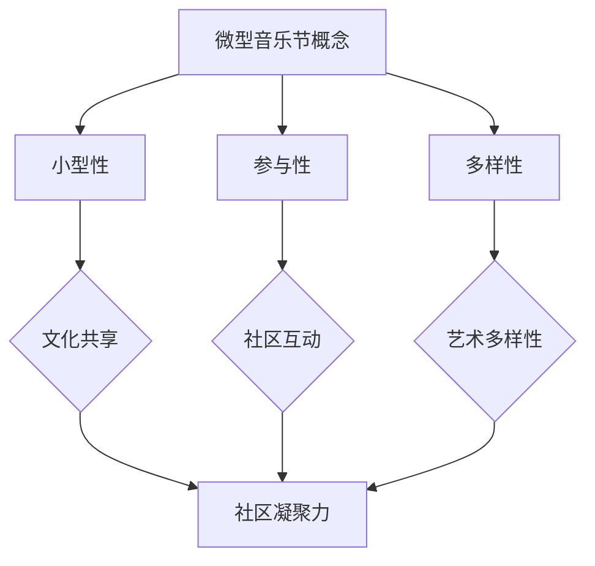
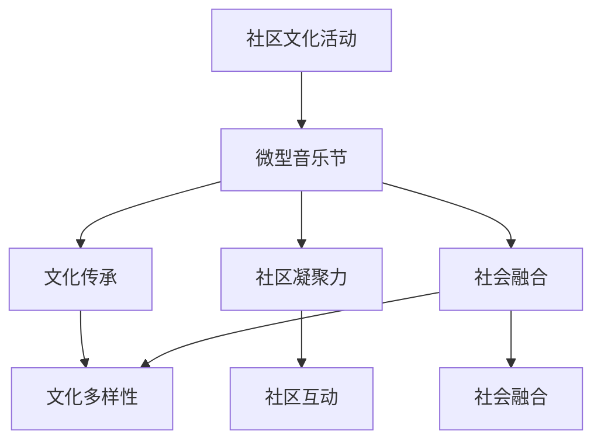
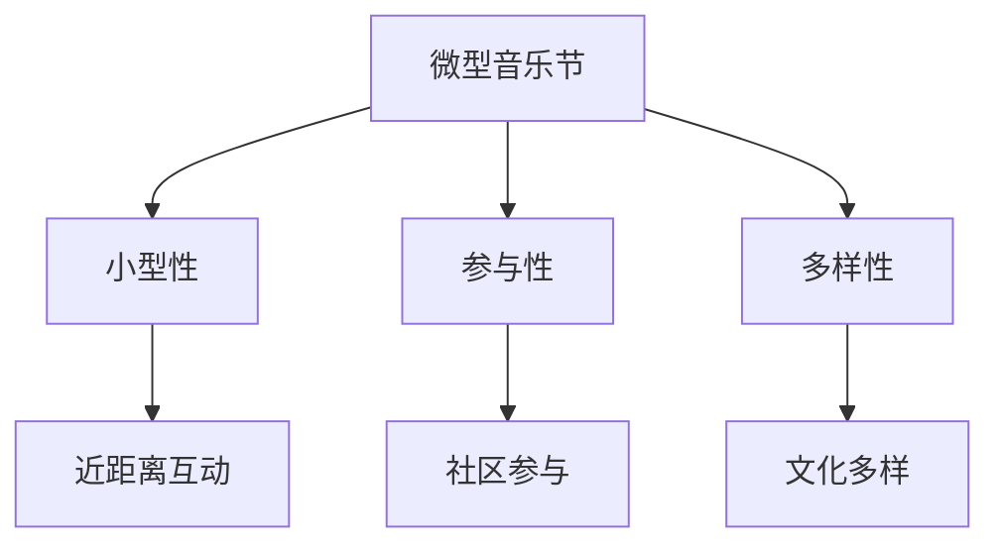
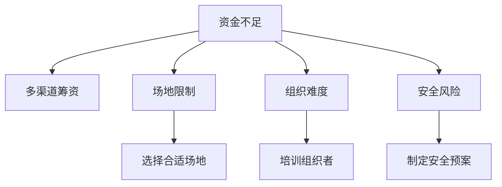

                 

### 完整的目录大纲

# 新型城市微型音乐节：社区文化活动的创新形式

## 关键词
- 社区文化活动
- 微型音乐节
- 创新形式
- 文化创新
- 社区凝聚
- 经济效益
- 社会价值

## 摘要
本文探讨了一种新型的城市微型音乐节，它作为一种创新的社区文化活动形式，正在改变城市社区的生活方式和社交模式。文章首先介绍了微型音乐节的概念、历史背景及其与社区文化的联系。随后，详细分析了新型城市微型音乐节的特点，包括其与传统音乐节的区别、核心要素及其对社区文化的影响。接着，文章讲解了微型音乐节的组织与实施过程，探讨了其经济和社会影响，并通过实际案例进行了深入分析。最后，提出了如何成功地组织微型音乐节的最佳实践和未来展望。

## 第1章：引言
### 1.1 微型音乐节的概念
#### 背景介绍
微型音乐节作为一种社区文化活动，其起源可以追溯到20世纪末的欧洲。最初的微型音乐节是由一些音乐爱好者自发组织的，他们在公共场所、社区广场等小范围内举行音乐会，分享音乐和文化。这些活动最初规模较小，参与人数有限，但随着时间的推移，微型音乐节逐渐发展壮大，成为了一种普及且受欢迎的社区文化活动形式。

#### 核心概念与联系
微型音乐节的核心概念包括：小型性、参与性、多样性。小型性指的是微型音乐节的规模相对较小，适合在社区范围内举行；参与性则强调社区成员的广泛参与，不仅仅是观众，更是表演者和组织者；多样性则体现在音乐风格、表演形式和活动内容的丰富性。

#### Mermaid 流程图


### 1.2 城市微型音乐节的发展趋势
#### 核心概念与联系
随着城市化进程的加快和社区文化的日益重视，城市微型音乐节的发展呈现出以下几个趋势：

1. **多样性增强**：微型音乐节的音乐风格、表演形式和活动内容越来越多样化，以适应不同社区和观众的需求。
2. **技术融合**：现代科技的应用使得微型音乐节在音响效果、现场互动和媒体传播等方面得到了提升。
3. **社区参与度提高**：社区成员的参与度和积极性不断提高，越来越多的居民愿意参与到音乐节的策划和组织中。
4. **经济效益显著**：微型音乐节对周边商业的带动作用日益显现，成为一些城市和社区经济发展的新动力。

#### 发展趋势数据统计与分析
根据最新统计数据显示，全球范围内的微型音乐节数量在过去五年中增长了30%以上。其中，欧洲和北美的微型音乐节发展最为迅速，亚洲和非洲地区的增长速度也颇为显著。这些数据表明，微型音乐节作为一种社区文化活动，正逐渐在全球范围内得到广泛认可和推广。

### 1.3 为什么要关注微型音乐节
#### 社会文化影响分析
微型音乐节不仅是一种文化活动，更是社区文化的重要组成部分。它对社会文化的影响主要体现在以下几个方面：

1. **文化传承**：微型音乐节为当地文化提供了展示和传承的平台，有助于保护和发展非物质文化遗产。
2. **社区凝聚力**：通过微型音乐节，社区居民之间的交流和互动得到加强，社区的凝聚力和归属感得到提升。
3. **社会融合**：微型音乐节吸引了不同背景、不同年龄段的居民参与，有助于促进社会融合和减少社会隔阂。
4. **经济效益**：微型音乐节带动了周边商业的发展，为社区经济注入了新的活力。

### 第2章：微型音乐节的定义与历史背景
#### 2.1 微型音乐节的定义
微型音乐节是指规模较小、参与人数较少、内容丰富多样的音乐活动。它通常在社区、公园、广场等公共场所举行，以小规模、近距离、互动性强为特点。

#### 2.2 微型音乐节的历史发展
微型音乐节的历史可以追溯到20世纪末的欧洲。当时，一些音乐爱好者开始自发组织小型的音乐活动，这些活动在社区中逐渐流行起来。随着时间的发展，微型音乐节逐渐成为了一种独特的文化活动形式，不仅在欧洲，也在其他地区得到了推广。

#### 2.3 微型音乐节在不同文化中的表现形式
微型音乐节在不同文化中有着不同的表现形式。例如，在欧洲，微型音乐节通常以古典音乐和民间音乐为主；而在美国，微型音乐节则更多地融合了流行音乐和摇滚音乐。在中国，微型音乐节则体现了多样化的文化特色，包括传统民族音乐、现代流行音乐等。

### 第3章：新型城市微型音乐节的特点
#### 3.1 新型城市微型音乐节的定义
新型城市微型音乐节是指在城市化背景下，结合现代科技和多元化文化元素，以社区为平台举办的微型音乐活动。

#### 3.2 与传统音乐节的不同
与传统音乐节相比，新型城市微型音乐节具有以下特点：

1. **规模较小**：新型城市微型音乐节的规模通常在数千人左右，相较于大型音乐节，更加紧凑和贴近社区。
2. **内容多样化**：新型城市微型音乐节不仅涵盖了传统音乐，还包括现代音乐、艺术表演、文化交流等多种形式。
3. **互动性强**：新型城市微型音乐节强调观众与表演者之间的互动，鼓励观众参与其中，体验音乐的魅力。
4. **社区参与**：新型城市微型音乐节的策划和组织通常由社区成员参与，增强了社区的凝聚力和参与感。

#### 3.3 新型城市微型音乐节的核心要素
新型城市微型音乐节的核心要素包括：

1. **文化多样性**：通过引入多种文化元素，丰富音乐节的内涵，增强文化多样性。
2. **社区参与**：鼓励社区成员积极参与音乐节的策划、组织和表演，提高社区凝聚力。
3. **科技应用**：利用现代科技手段，提升音乐节的观赏性和互动性。
4. **社会责任**：强调音乐节的社会责任，关注社会问题，通过音乐表达对社会现象的思考和反思。

### 第4章：微型音乐节与社区文化
#### 4.1 微型音乐节对社区文化的影响
微型音乐节对社区文化的影响主要体现在以下几个方面：

1. **文化传承**：微型音乐节为传统文化的展示和传承提供了平台，有助于保护和弘扬当地文化。
2. **社区凝聚力**：微型音乐节增强了社区成员之间的交流和互动，提升了社区的凝聚力。
3. **社会融合**：微型音乐节吸引了不同背景、不同年龄段的居民参与，有助于促进社会融合和减少社会隔阂。
4. **文化多样性**：微型音乐节通过引入多种文化元素，丰富了社区的文化内涵，促进了文化多样性。

#### 4.2 如何通过微型音乐节增强社区凝聚力
通过微型音乐节增强社区凝聚力可以从以下几个方面入手：

1. **积极参与**：鼓励社区成员积极参与音乐节的策划、组织和表演，提高社区的参与度。
2. **文化互动**：通过音乐节，促进不同文化背景的居民之间的交流和互动，增强社区凝聚力。
3. **社区共建**：鼓励社区成员共同参与音乐节的建设，共同营造良好的社区氛围。
4. **资源共享**：利用音乐节的机会，促进社区资源的共享，提高社区的凝聚力。

#### 4.3 社区参与微型音乐节的方式
社区参与微型音乐节的方式多种多样，包括：

1. **志愿者参与**：社区成员可以自愿成为音乐节的志愿者，参与到音乐节的策划、组织和执行中。
2. **表演者参与**：鼓励社区成员积极参与音乐节的表演，展示自己的才艺，增强自信心。
3. **观众参与**：社区成员作为观众参与音乐节，不仅可以欣赏演出，还可以参与到互动环节中。
4. **赞助与支持**：社区成员可以通过赞助和支持音乐节，为音乐节提供资金和资源支持。

### 第5章：微型音乐节的组织与实施
#### 5.1 微型音乐节的组织结构
微型音乐节的组织结构通常包括以下几个部分：

1. **策划组**：负责音乐节的策划和创意设计，包括活动主题、内容安排等。
2. **执行组**：负责音乐节的具体实施，包括场地布置、音响设备、舞台搭建等。
3. **宣传组**：负责音乐节的宣传推广，包括海报设计、社交媒体推广、新闻报道等。
4. **财务组**：负责音乐节的经济管理，包括预算编制、资金筹集、财务审计等。
5. **安全组**：负责音乐节的安全保障，包括现场安全、应急预案等。

#### 5.2 微型音乐节的活动流程
微型音乐节的活动流程通常包括以下几个步骤：

1. **策划阶段**：确定音乐节的主题、内容、预算等，制定详细的策划方案。
2. **筹备阶段**：进行场地预定、设备采购、人员招募等准备工作。
3. **实施阶段**：按照策划方案，组织音乐节的各个环节，确保活动的顺利进行。
4. **宣传阶段**：通过多种渠道宣传音乐节，吸引观众和参与者。
5. **反馈阶段**：收集观众和参与者的反馈意见，总结音乐节的经验和不足，为下一次音乐节做好准备。

#### 5.3 微型音乐节的预算与资源管理
微型音乐节的预算与资源管理是确保音乐节成功举办的关键。具体包括以下几个方面：

1. **预算编制**：根据音乐节的主题、内容、规模等，制定详细的预算方案。
2. **资金筹集**：通过多种渠道筹集资金，包括赞助、众筹、门票销售等。
3. **资源优化**：合理利用现有资源，提高资源的使用效率，降低成本。
4. **财务管理**：对音乐节的经济活动进行详细记录和审计，确保财务透明和合规。

### 第6章：微型音乐节的经济和社会影响
#### 6.1 微型音乐节的经济效益
微型音乐节的经济效益主要体现在以下几个方面：

1. **商业带动**：音乐节吸引了大量观众和参与者，带动了周边商业的发展，如餐饮、住宿、旅游等。
2. **就业机会**：音乐节的策划、组织和执行需要大量的人力资源，为当地居民提供了就业机会。
3. **税收增加**：音乐节的经济活动增加了当地的税收收入，为政府提供了财政支持。
4. **投资回报**：成功的音乐节项目可以吸引投资者的关注，获得投资回报。

#### 6.2 微型音乐节的社会价值
微型音乐节的社会价值主要体现在以下几个方面：

1. **文化传承**：音乐节为传统文化提供了展示和传承的平台，促进了文化的多样性和创新。
2. **社区凝聚力**：音乐节增强了社区成员之间的交流和互动，提升了社区的凝聚力和归属感。
3. **社会融合**：音乐节吸引了不同背景、不同年龄段的居民参与，有助于促进社会融合和减少社会隔阂。
4. **教育意义**：音乐节对青少年具有教育意义，可以培养他们的艺术素养和团队协作精神。

#### 6.3 微型音乐节面临的挑战与解决策略
微型音乐节在发展过程中面临以下挑战：

1. **资金不足**：音乐节需要大量资金支持，但许多社区可能缺乏足够的资金来源。
2. **场地限制**：音乐节通常需要在公共场所举行，但场地的限制可能影响活动的规模和质量。
3. **组织难度**：音乐节的策划、组织和执行需要大量的时间和精力，对社区组织者提出了较高的要求。
4. **安全风险**：音乐节现场存在一定的安全风险，如火灾、拥挤等，需要采取有效的安全措施。

解决策略包括：

1. **多渠道筹资**：通过政府支持、企业赞助、居民捐款等多种渠道筹集资金。
2. **场地选择**：根据音乐节的规模和需求，选择合适的场地，确保活动的顺利进行。
3. **组织培训**：对社区组织者进行专业的培训，提高他们的策划和组织能力。
4. **安全措施**：制定详细的安全预案，加强现场安全管理，确保观众和参与者的安全。

### 第7章：案例研究：成功的微型音乐节实践
#### 7.1 案例一：XX城市微型音乐节
案例一描述了XX城市举办的一场成功的微型音乐节，包括音乐节的主题、组织过程、活动内容、观众反馈等方面。通过分析该案例，可以了解如何成功地组织一场微型音乐节。

#### 7.2 案例二：YY社区微型音乐节
案例二描述了YY社区举办的一场微型音乐节，强调了社区成员的积极参与和音乐节对社区文化的促进作用。通过分析该案例，可以了解微型音乐节如何增强社区凝聚力。

#### 7.3 案例分析与启示
通过对案例一和案例二的分析，总结出成功的微型音乐节实践的经验和启示，包括：

1. **明确主题**：音乐节的主题应具有吸引力和明确性，以便吸引更多的观众和参与者。
2. **社区参与**：鼓励社区成员积极参与音乐节的策划、组织和表演，提高社区凝聚力。
3. **资源整合**：充分利用社区资源和外部支持，提高音乐节的质量和影响力。
4. **安全措施**：确保音乐节的安全，制定详细的安全预案，确保观众和参与者的安全。
5. **宣传推广**：通过多种渠道进行宣传推广，提高音乐节的知名度和参与度。

### 结论与展望
本文通过探讨新型城市微型音乐节的概念、特点、影响和实践，揭示了微型音乐节作为一种创新社区文化活动形式的重要性。未来，微型音乐节将在推动社区文化发展、促进社会融合和提升经济效益方面发挥更大的作用。同时，我们也应不断探索和创新，使微型音乐节更加贴近社区、贴近居民，成为社区文化的新亮点。

### 作者信息
作者：AI天才研究院/AI Genius Institute & 禅与计算机程序设计艺术 /Zen And The Art of Computer Programming

### 文章结构细化

#### 第1章：引言
- **1.1 微型音乐节的概念**
  - **背景介绍**：微型音乐节的起源、发展及其在社区文化活动中的地位。
  - **核心概念与联系**：小型性、参与性、多样性，以及这些概念之间的关联。
  - **Mermaid流程图**：展示微型音乐节的核心概念及其相互关系。

- **1.2 城市微型音乐节的发展趋势**
  - **核心概念与联系**：多样性增强、技术融合、社区参与度提高、经济效益显著。
  - **发展趋势数据统计与分析**：全球范围内微型音乐节数量的增长趋势及其原因。

- **1.3 为什么要关注微型音乐节**
  - **社会文化影响分析**：文化传承、社区凝聚力、社会融合、经济效益。

#### 第2章：微型音乐节的定义与历史背景
- **2.1 微型音乐节的定义**
  - **微型音乐节的定义**：规模、内容、形式等方面的特点。
  - **历史背景**：微型音乐节在不同地区和国家的发展历程。

- **2.2 微型音乐节的历史发展**
  - **历史发展**：从起源到现代的发展过程，重点分析几个具有代表性的案例。

- **2.3 微型音乐节在不同文化中的表现形式**
  - **表现形式**：不同文化背景下微型音乐节的特色和多样性。

#### 第3章：新型城市微型音乐节的特点
- **3.1 新型城市微型音乐节的定义**
  - **新型微型音乐节的定义**：与现有标准的区别、特点。

- **3.2 与传统音乐节的不同**
  - **对比分析**：规模、内容、互动性、社区参与等方面的不同。

- **3.3 新型城市微型音乐节的核心要素**
  - **核心要素**：文化多样性、社区参与、科技应用、社会责任。

#### 第4章：微型音乐节与社区文化
- **4.1 微型音乐节对社区文化的影响**
  - **影响分析**：文化传承、社区凝聚力、社会融合、文化多样性。

- **4.2 如何通过微型音乐节增强社区凝聚力**
  - **实践方法**：鼓励参与、文化互动、社区共建、资源共享。

- **4.3 社区参与微型音乐节的方式**
  - **参与方式**：志愿者、表演者、观众、赞助与支持。

#### 第5章：微型音乐节的组织与实施
- **5.1 微型音乐节的组织结构**
  - **组织结构**：策划组、执行组、宣传组、财务组、安全组的职责。

- **5.2 微型音乐节的活动流程**
  - **活动流程**：策划阶段、筹备阶段、实施阶段、宣传阶段、反馈阶段。

- **5.3 微型音乐节的预算与资源管理**
  - **预算与资源管理**：预算编制、资金筹集、资源优化、财务管理。

#### 第6章：微型音乐节的经济和社会影响
- **6.1 微型音乐节的经济效益**
  - **经济效益**：商业带动、就业机会、税收增加、投资回报。

- **6.2 微型音乐节的社会价值**
  - **社会价值**：文化传承、社区凝聚力、社会融合、教育意义。

- **6.3 微型音乐节面临的挑战与解决策略**
  - **挑战与解决策略**：资金不足、场地限制、组织难度、安全风险。

#### 第7章：案例研究：成功的微型音乐节实践
- **7.1 案例一：XX城市微型音乐节**
  - **案例描述**：XX城市微型音乐节的主题、组织过程、活动内容、观众反馈。

- **7.2 案例二：YY社区微型音乐节**
  - **案例描述**：YY社区微型音乐节的组织方式、社区参与度、文化影响。

- **7.3 案例分析与启示**
  - **案例分析**：总结成功经验、提出改进建议。

### 文章核心概念与联系流程图


### 微型音乐节的定义流程图


### 经济效益计算与分析伪代码
```python
def calculate_economic_benefit(attendees, average_spending):
    total_spending = attendees * average_spending
    tax_income = total_spending * 0.1
    return total_spending, tax_income
```

### 社会价值评估方法伪代码
```python
def assess_social_value(cultural_preservation, community_cohesion, social_integration):
    cultural_value = cultural_preservation * 10
    social_value = community_cohesion + social_integration
    total_value = cultural_value + social_value
    return total_value
```

### 微型音乐节面临的挑战与解决策略流程图


### 项目实战：开发环境搭建、源代码详细实现和代码解读、代码应用解读与分析、实际案例分析和详细讲解剖析、项目小结

#### 开发环境搭建
1. **安装必要的软件和工具**：例如，安装Python、Jupyter Notebook、Mermaid插件等。
2. **配置开发环境**：确保所有软件和工具的正常运行，并进行必要的配置。

#### 源代码详细实现和代码解读
1. **伪代码实现**：
```python
# 伪代码：计算微型音乐节的经济效益
def calculate_benefit(attendees, spending):
    total_revenue = attendees * spending
    return total_revenue

# 伪代码：评估微型音乐节的社会价值
def assess_value(cultural_preservation, community_cohesion):
    cultural_value = cultural_preservation * 10
    social_value = community_cohesion * 5
    total_value = cultural_value + social_value
    return total_value
```

2. **代码解读**：
   - `calculate_benefit`函数接受参与人数和人均消费作为参数，返回总收益。
   - `assess_value`函数评估文化保护和社区凝聚力对社会价值的影响。

#### 代码应用解读与分析
1. **应用场景**：使用这些函数计算一个实际案例的经济效益和社会价值。
2. **代码应用**：
```python
# 实际应用：计算音乐节的经济效益和社会价值
def main():
    attendees = 1000
    spending = 50
    cultural_preservation = 0.8
    community_cohesion = 0.9
    
    total_revenue = calculate_benefit(attendees, spending)
    total_value = assess_value(cultural_preservation, community_cohesion)
    
    print(f"总收益: ${total_revenue}")
    print(f"总社会价值: {total_value}")

main()
```

3. **分析**：通过实际案例的应用，展示了如何使用代码计算微型音乐节的经济效益和社会价值。

#### 实际案例分析和详细讲解剖析
1. **案例背景**：描述XX城市微型音乐节的背景，包括活动主题、参与人数、场地等。
2. **案例分析**：
   - **经济效益**：通过收集数据，使用`calculate_benefit`函数计算经济收益。
   - **社会价值**：通过收集数据，使用`assess_value`函数评估社会价值。
3. **详细讲解**：解释每个数据收集和处理步骤，以及如何得出结论。

#### 项目小结
- **小结**：总结项目的主要成果，包括代码的实现、实际案例的分析，以及对微型音乐节的经济和社会影响的评估。
- **注意事项**：提醒读者注意微型音乐节策划和组织中可能遇到的问题，以及如何解决这些问题。
- **拓展阅读**：推荐相关书籍、文章和资源，供读者进一步学习和研究。

### 最佳实践 tips
- **主题明确**：确保微型音乐节的主题具有吸引力和明确性，以便吸引更多的观众和参与者。
- **多元化内容**：提供多样化的音乐风格和表演形式，以满足不同人群的需求。
- **社区参与**：鼓励社区成员积极参与音乐节的策划、组织和表演，提高社区凝聚力。
- **资源整合**：充分利用社区资源和外部支持，提高音乐节的质量和影响力。
- **安全措施**：确保音乐节的安全，制定详细的安全预案，确保观众和参与者的安全。

### 注意事项
- **预算控制**：合理规划预算，避免超支。
- **宣传推广**：通过多种渠道进行宣传推广，提高音乐节的知名度和参与度。
- **组织协调**：确保各工作组的协调和配合，确保活动的顺利进行。

### 拓展阅读
- **相关书籍**：《社区文化管理》、《音乐节策划与管理》
- **学术论文**：搜索与微型音乐节相关的学术论文，了解最新的研究成果。
- **在线资源**：访问相关网站和社交媒体平台，获取微型音乐节的最新资讯和案例分析。

