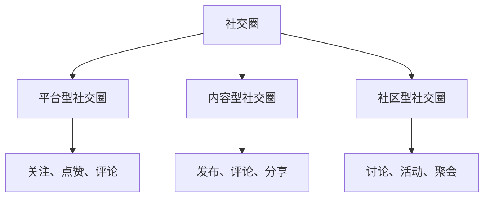

                 

### 新型都市部落：基于共同兴趣的现代社交圈

#### 关键词：新型都市部落、共同兴趣、社交圈、技术趋势、案例分析

> 摘要：本文深入探讨了新型都市部落的概念及其在现代社交圈中的重要性。通过分析共同兴趣在社交圈形成和发展中的作用，本文提出了现代社交圈的模式与变化趋势。同时，通过实践案例分析，本文展示了新型都市部落的具体实现和应用，并展望了其未来的发展方向和挑战。

# 新型都市部落：基于共同兴趣的现代社交圈

## 1. 引言

在当今数字化时代，社交圈的形式和功能发生了巨大变化。传统的社区模式逐渐被基于共同兴趣的新型都市部落所取代。本文将探讨这种新型社交圈的形成背景、特点以及其在现代都市生活中的重要性。

### 1.1 新型都市部落定义

新型都市部落是指一群生活在都市中，基于共同兴趣或价值观而自发形成的社交群体。这些群体通过网络平台或其他社交媒体工具进行交流和互动，共同参与各种活动，分享信息和资源。

### 1.2 基本特点

新型都市部落具有以下几个基本特点：

1. **群体性**：部落成员之间具有较强的群体归属感，他们通过共同的活动和兴趣形成紧密的联系。
2. **共同兴趣**：部落形成的基础是共同兴趣或价值观，这有助于成员之间的互动和交流。
3. **社群互动**：部落成员之间通过线上和线下的活动进行互动，增强群体凝聚力和社交关系。

### 1.3 发展历程

新型都市部落的发展可以追溯到互联网的普及和社交媒体的兴起。随着技术的进步和用户需求的变化，基于共同兴趣的社交圈逐渐从线下转移到线上，形成了多样化的新型都市部落。

## 2. 共同兴趣在现代社交圈中的作用

共同兴趣是新型都市部落形成和发展的核心驱动力。通过共同兴趣，部落成员能够找到共鸣，建立深厚的人际关系。

### 2.1 共同兴趣的重要性

1. **促进社交圈形成**：共同兴趣为社交圈提供了形成的基础，使成员之间更容易产生互动和交流。
2. **增强社交关系**：共同兴趣可以增强部落成员之间的情感联系，提高群体凝聚力。
3. **丰富社交体验**：共同兴趣可以带来多样化的社交体验，使社交生活更加丰富多彩。

### 2.2 社交圈的构建

社交圈的构建过程可以分为以下几个步骤：

1. **寻找共同兴趣**：部落成员通过自我介绍或兴趣标签找到与自己兴趣相符的社交圈。
2. **建立连接**：成员之间通过互动和交流建立联系，形成社交网络。
3. **组织活动**：部落成员共同参与活动，如线上讨论、线下聚会等，增强群体凝聚力。
4. **分享资源和信息**：部落成员分享信息和资源，实现资源共享和知识传播。

### 2.3 社交圈中的互动

社交圈中的互动模式可以分为以下几种：

1. **群体互动**：部落成员共同参与活动，如讨论、游戏、聚会等。
2. **个体互动**：部落成员之间的一对一交流，如私信、评论等。
3. **集体行动**：部落成员共同参与有组织的活动，如公益活动、旅行等。

## 3. 现代社交圈的模式与变化

现代社交圈的模式和变化受到技术发展、用户需求和社会文化等多方面因素的影响。

### 3.1 现代社交圈的模式

现代社交圈主要可以分为以下几种模式：

1. **平台型社交圈**：以社交媒体平台为基础，成员通过关注、点赞、评论等方式进行互动。
2. **内容型社交圈**：以内容分享和讨论为核心，成员通过发布、评论、分享等方式进行互动。
3. **社区型社交圈**：以社区论坛或兴趣小组为基础，成员通过讨论、活动等方式进行互动。

### 3.2 社交圈的变化趋势

1. **社交媒体的兴起**：社交媒体的普及使得社交圈的形式更加多样化，用户可以方便地建立和维护社交关系。
2. **社交互动的个性化**：随着用户需求的多样化，社交圈逐渐向个性化方向发展，满足用户不同的社交需求。
3. **线上线下互动融合**：现代社交圈不再局限于线上或线下，而是实现了线上线下互动的融合，为用户提供了更丰富的社交体验。

### 3.3 社交媒体对社交圈的影响

1. **信息传播速度加快**：社交媒体的即时性使得信息传播速度加快，部落成员可以实时了解和参与各种活动。
2. **社交距离缩短**：社交媒体打破了地域和时间的限制，使得部落成员之间的距离更加接近。
3. **社交成本降低**：社交媒体降低了建立和维护社交关系的成本，使得更多人可以参与到社交圈中。

### 3.4 社交互动个性化的发展趋势

1. **精准推荐**：社交媒体平台通过大数据分析和算法推荐，为用户推荐感兴趣的内容和社交圈。
2. **个性化定制**：用户可以根据自己的兴趣和需求，自定义社交圈的内容和形式。
3. **社交隐私保护**：随着用户对隐私的关注，社交平台逐渐加强对用户隐私的保护。

## 4. 实践案例分析

通过具体案例的分析，我们可以更深入地了解新型都市部落的具体实现和应用。

### 4.1 案例一：都市运动爱好者群组

#### 4.1.1 案例详情

都市运动爱好者群组是一个以运动爱好为主题的社交圈，成员通过线上讨论、线下活动等形式进行互动。群组成员包括跑步爱好者、健身达人、瑜伽练习者等，他们共同分享运动经验、交流训练心得，并组织线下活动，如跑步比赛、健身挑战等。

#### 4.1.2 案例分析

该案例展示了基于共同兴趣的新型都市部落的典型特点：

1. **群体性**：群组成员之间具有较强的群体归属感，共同参与各种运动活动。
2. **共同兴趣**：群组形成的基础是共同的运动爱好，这有助于成员之间的互动和交流。
3. **社群互动**：群组成员通过线上讨论和线下活动进行互动，增强了群体凝聚力。

#### 4.1.3 案例启示

该案例为其他新型都市部落的建立和运营提供了以下启示：

1. **明确共同兴趣**：在建立新型都市部落时，应明确共同兴趣或价值观，以便成员之间产生共鸣。
2. **多样化的互动形式**：通过线上和线下的活动，增强部落成员之间的互动和交流。
3. **组织有吸引力的活动**：组织有吸引力的活动可以吸引更多成员参与，增强部落凝聚力。

### 4.2 案例二：美食爱好者的社交圈

#### 4.2.1 案例详情

美食爱好者的社交圈是一个以美食分享和交流为主题的社交圈。成员通过线上分享美食照片、点评餐厅、推荐菜品等方式进行互动。此外，他们还组织线下活动，如聚餐、烹饪课堂等。

#### 4.2.2 案例分析

该案例展示了基于共同兴趣的新型都市部落的另一种形式：

1. **内容型社交圈**：美食爱好者的社交圈以内容分享和讨论为核心，成员通过发布和评论美食照片、餐厅评价等内容进行互动。
2. **社交互动多样化**：社交圈中的互动形式丰富多样，包括线上分享、线下聚餐等，满足了成员不同的社交需求。

#### 4.2.3 案例启示

该案例为其他新型都市部落的建立和运营提供了以下启示：

1. **内容建设**：在建立新型都市部落时，应注重内容建设，提供有价值的内容，吸引和留住成员。
2. **线下活动**：线下活动可以增强成员之间的互动和信任，提高部落凝聚力。
3. **多元化**：社交圈的形式可以多样化，满足不同成员的社交需求。

## 5. 未来展望与趋势

随着技术的进步和社会的发展，新型都市部落将继续演变和进步。以下是未来新型都市部落的发展趋势和挑战：

### 5.1 技术发展趋势

1. **人工智能的应用**：人工智能技术将进一步提升社交圈的服务水平和用户体验。
2. **区块链技术**：区块链技术可以提供更安全、透明的社交圈运营方式。
3. **虚拟现实与增强现实**：虚拟现实和增强现实技术将为社交圈带来更丰富的互动体验。

### 5.2 社会文化影响

1. **社交生活方式的变化**：新型都市部落将影响人们的社交生活方式，改变人们的社交行为和习惯。
2. **社交圈与社区融合**：社交圈与社区将实现更紧密的融合，为居民提供更全面的社交服务。

### 5.3 发展方向与挑战

1. **多元化**：新型都市部落将朝着多元化方向发展，满足不同群体的社交需求。
2. **社交隐私保护**：随着社交圈的发展，社交隐私保护将成为一个重要议题。
3. **可持续发展**：新型都市部落需要实现可持续发展，以应对日益增长的社交需求。

## 6. 总结与展望

新型都市部落作为基于共同兴趣的现代社交圈，具有巨大的发展潜力和广泛的社会影响。通过分析新型都市部落的定义、特点、模式和变化，以及实践案例分析，本文展示了新型都市部落的现实应用和价值。未来，新型都市部落将继续发展，为社会带来更多创新和变革。

### 附录

#### 6.1. Mermaid 流程图示例



#### 6.2. 伪代码示例

```python
# 社交圈构建伪代码

def build_social_circle():
    # 步骤1：寻找共同兴趣
    interests = find_interests()
    
    # 步骤2：建立连接
    connections = establish_connections(interests)
    
    # 步骤3：组织活动
    activities = organize_activities(connections)
    
    # 步骤4：分享资源和信息
    resources = share_resources(activities)
    
    return social_circle

# 辅助函数
def find_interests():
    # 实现寻找共同兴趣的逻辑
    pass

def establish_connections(interests):
    # 实现建立连接的逻辑
    pass

def organize_activities(connections):
    # 实现组织活动的逻辑
    pass

def share_resources(activities):
    # 实现分享资源和信息的逻辑
    pass
```

### 作者信息

作者：AI天才研究院/AI Genius Institute & 禅与计算机程序设计艺术 /Zen And The Art of Computer Programming

### 注意事项

- 本文仅为示例，内容仅供参考。
- 实际应用中，需根据具体情况进行调整和优化。
- 未来发展趋势和挑战需持续关注和研究。

