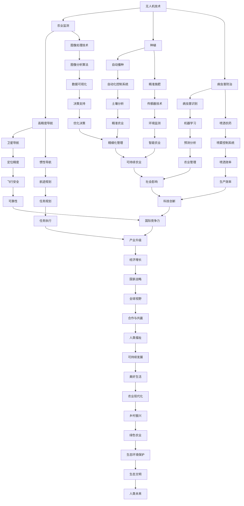

                 

### 文章标题

# 无人机技术在农业中的创新应用

### 关键词

- 无人机
- 农业监测
- 种植
- 病虫害防治
- 大数据
- 人工智能

### 摘要

随着科技的不断进步，无人机技术已经成为现代农业领域中的一项重要创新应用。本文将深入探讨无人机在农业中的应用，包括农业监测、种植、病虫害防治等方面，并分析无人机与物联网、大数据、人工智能等现代农业技术的融合。通过国内外成功案例分析，本文旨在展示无人机技术在农业中的广泛应用前景，为未来的发展提供有力支持。

----------------------------------------------------------------

### 引言与背景

#### 无人机技术概述

无人机，全称为无人驾驶飞行器（Unmanned Aerial Vehicle，简称UAV），是一种通过遥控或者自主飞行来完成特定任务的航空器。无人机技术起源于20世纪中叶，当时主要用于军事侦察和监视任务。随着技术的发展，无人机逐渐向民用领域扩展，尤其在农业、环境监测、物流配送等多个领域展现出巨大潜力。

#### 农业无人机应用的重要性

无人机技术在农业领域的应用具有显著的重要性。首先，无人机能够提供高精度的农业监测数据，如作物生长状况、土壤湿度、病虫害等，为农民提供科学的种植决策依据。其次，无人机可以自动化完成农药喷洒、种子播种等农业生产活动，提高农业生产效率。此外，无人机在农业灾害预警和应急响应中也发挥着重要作用，能够在自然灾害发生时快速提供灾情监测和救援支持。

#### 农业无人机应用的发展历程

农业无人机应用的发展历程可以分为几个阶段：

1. **初步探索阶段（20世纪90年代至21世纪初）**：这一阶段，无人机在农业中主要用于航拍和灾害监测，技术相对简单，应用范围有限。

2. **技术发展阶段（21世纪初至今）**：随着无人机技术的不断进步，特别是无人机导航、图像处理等技术的成熟，农业无人机应用得到了快速发展。无人机在农业监测、种植、病虫害防治等方面得到了广泛应用。

3. **智能化阶段**：近年来，随着物联网、大数据、人工智能等技术的融合，农业无人机向智能化方向发展。无人机不仅可以实现自主飞行，还可以通过数据分析和人工智能算法，提供更为精准的农业解决方案。

#### 当前农业无人机应用的关键技术突破

1. **高精度导航技术**：无人机的高精度导航技术是农业应用的基础，通过GPS、北斗等卫星导航系统，结合惯性导航和视觉导航，实现无人机在复杂环境下的精确定位和飞行。

2. **图像处理技术**：无人机搭载的高分辨率相机能够拍摄到农田的高清图像，通过图像处理技术，可以提取作物生长状态、病虫害等信息。

3. **物联网技术**：物联网技术将无人机与其他农业设备互联，实现数据实时传输和农业物联网系统的构建。

4. **人工智能算法**：人工智能算法在农业无人机中的应用，如图像识别、预测分析等，使得无人机能够提供更为智能的农业解决方案。

### 核心概念与联系

为了更好地理解无人机技术在农业中的应用，我们可以使用Mermaid流程图来展示无人机农业应用的核心概念及其相互关系：



通过上述流程图，我们可以清晰地看到无人机技术在农业中的应用范围及其核心技术的相互关联。接下来，本文将详细探讨无人机在农业中的各种应用，以及相关技术的原理和应用实例。

#### 第2章 无人机技术基础

无人机技术作为现代农业的重要组成部分，其基础理论和技术架构对农业应用的成功至关重要。本章将详细探讨无人机的基本原理、分类、工作流程以及无人机在农业中的应用场景。

##### 2.1 无人机的基本原理

无人机的基本原理涉及多个方面，包括飞行原理、动力系统、控制系统等。

###### 2.1.1 无人机的飞行原理

无人机的飞行原理主要基于空气动力学。无人机通过螺旋桨产生的升力来对抗重力，同时通过改变螺旋桨的转速和方向，实现无人机的上升、下降、前进、后退和侧翻等运动。

1. **升力产生**：螺旋桨旋转时，根据伯努利原理，螺旋桨上方的气流速度大于下方，导致上方气压小于下方，从而产生向上的升力。

2. **动力系统**：无人机的动力系统主要由电机、螺旋桨、电池等组成。电机通过电能驱动螺旋桨旋转，产生推力。电池为无人机提供电能，是无人机的动力来源。

3. **控制系统**：无人机通过飞控系统（Flight Control System，简称FCS）来实现自主飞行。飞控系统包括传感器、计算单元、执行机构等部分。传感器负责收集环境数据，计算单元根据算法处理传感器数据，生成控制指令，执行机构根据控制指令调整无人机的姿态和速度。

###### 2.1.2 无人机的分类

无人机根据不同的分类标准，可以分为多种类型：

1. **按飞行方式分类**：
   - **固定翼无人机**：具有固定翼，适合长时间飞行和长距离传输，但机动性较差。
   - **旋翼无人机**：包括多旋翼和单旋翼无人机，机动性较好，适合短距离、低空作业。
   - **垂直起降无人机**（VTOL）：能够在垂直方向起降，不需要跑道，适合复杂地形作业。

2. **按用途分类**：
   - **军用无人机**：主要用于侦察、监视、攻击等军事任务。
   - **民用无人机**：应用于农业、测绘、物流、环保等多个领域。

3. **按大小和负载分类**：
   - **大型无人机**：载荷能力较强，适用于远程运输和大型设施监测。
   - **小型无人机**：体积小、重量轻，适合精细作业和便携式应用。

##### 2.2 无人机的分类

无人机按照不同的分类标准，可以分为多种类型，每种类型都有其特定的应用场景。

###### 2.2.1 按飞行方式分类

1. **固定翼无人机**：
   - **特点**：具有固定翼，适合长时间飞行和长距离传输。
   - **应用**：航空摄影、遥感监测、大型设施监控等。

2. **旋翼无人机**：
   - **特点**：机动性较好，适合短距离、低空作业。
   - **应用**：农业监测、病虫害防治、城市监控等。

3. **垂直起降无人机**（VTOL）：
   - **特点**：能够在垂直方向起降，不需要跑道，适合复杂地形作业。
   - **应用**：应急救援、环境监测、港口巡逻等。

###### 2.2.2 按照用途分类

1. **军用无人机**：
   - **特点**：主要用于侦察、监视、攻击等军事任务。
   - **应用**：战场侦察、目标监视、导弹拦截等。

2. **民用无人机**：
   - **特点**：应用于农业、测绘、物流、环保等多个领域。
   - **应用**：农业监测、物流配送、环境监测、城市规划等。

###### 2.2.3 按照大小和负载分类

1. **大型无人机**：
   - **特点**：载荷能力较强，适用于远程运输和大型设施监测。
   - **应用**：大型设施监控、远程物资运输、海上救援等。

2. **小型无人机**：
   - **特点**：体积小、重量轻，适合精细作业和便携式应用。
   - **应用**：农业监测、环境监测、应急救援等。

##### 2.3 无人机的工作流程

无人机的工作流程可以分为以下几个步骤：

1. **任务规划**：根据任务需求，制定飞行计划和路径。

2. **起飞准备**：检查无人机设备状态，确认飞行环境安全。

3. **自主飞行**：无人机根据预先设定的飞行计划和实时传感器数据，实现自主飞行。

4. **数据采集**：无人机在飞行过程中，通过相机、传感器等设备采集图像、数据等信息。

5. **数据传输**：将采集到的数据实时传输到地面站或数据中心。

6. **数据分析**：对采集到的数据进行分析处理，提取有用信息。

7. **任务执行**：根据分析结果，执行相应的任务，如农业监测、病虫害防治等。

8. **任务结束**：无人机返回起飞点，完成整个工作流程。

通过上述工作流程，无人机能够在农业中发挥出高效、精准的作用，为农业生产提供强有力的技术支持。

### 2.4 无人机在农业中的应用场景

无人机在农业中有着广泛的应用场景，包括农业监测、种植、病虫害防治等方面。以下是无人机在农业中的主要应用场景：

##### 2.4.1 农业监测

无人机通过搭载高清相机和传感器，可以对农田进行全方位监测。具体应用包括：

1. **土壤监测**：无人机可以拍摄土壤图像，通过图像处理技术分析土壤的湿度和营养状况，为精准施肥提供依据。

2. **作物监测**：无人机可以实时监测作物的生长状态，包括植株高度、叶片颜色、病虫害发生情况等，为农民提供科学的种植决策。

3. **气象监测**：无人机可以监测农田周围的气象条件，如温度、湿度、风速等，为农业生产提供环境数据支持。

##### 2.4.2 种植

无人机在种植过程中发挥着重要作用，主要包括：

1. **自动播种**：无人机可以搭载播种装置，实现自动播种，提高种植效率。

2. **精准施肥**：通过无人机监测土壤营养状况，实现精准施肥，减少化肥使用，提高农作物产量。

3. **无人机植保**：无人机可以搭载喷洒装置，实现农药喷洒，降低人工成本，提高农药利用率。

##### 2.4.3 病虫害防治

无人机在病虫害防治中的应用主要包括：

1. **病虫害监测**：无人机通过搭载高清相机和传感器，可以实时监测病虫害的发生情况，及时发现并处理。

2. **精准防治**：无人机可以根据病虫害监测结果，实现精准防治，减少农药使用，降低环境污染。

3. **无人机喷洒**：无人机可以搭载喷洒装置，实现农药喷洒，提高喷洒效率，降低人工成本。

#### 核心算法原理讲解

无人机在农业应用中的核心算法主要包括图像处理、传感器数据处理和机器学习算法等。以下是这些核心算法的原理讲解：

##### 2.5.1 图像处理算法

图像处理算法在无人机农业监测中起着关键作用。主要算法包括：

1. **图像增强**：通过调整图像的亮度、对比度等参数，提高图像质量，便于后续处理。

2. **图像分割**：将图像分割为多个区域，以便于识别和提取感兴趣的区域。

3. **特征提取**：从图像中提取具有区分性的特征，如颜色、纹理等。

4. **目标检测与识别**：利用深度学习算法，如卷积神经网络（CNN），实现作物、病虫害等目标的检测与识别。

伪代码示例：

```python
import cv2
import numpy as np

def image_enhancement(image):
    # 调整图像的亮度与对比度
    enhanced_image = cv2.detailEnhance(image, sigma_color=10, sigma_space=10)
    return enhanced_image

def image_segmentation(image):
    # 使用Otsu阈值分割算法
    _, segmented_image = cv2.threshold(image, 0, 255, cv2.THRESH_BINARY + cv2.THRESH_OTSU)
    return segmented_image

def feature_extraction(image):
    # 提取图像的颜色特征
    color直方图 = cv2.calcHist([image], [0], None, [256], [0, 256])
    return color直方图

def target_detection(image):
    # 使用卷积神经网络实现目标检测
    model = load_model('target_detection_model.h5')
    prediction = model.predict(image)
    return prediction
```

##### 2.5.2 传感器数据处理算法

传感器数据处理算法用于处理无人机采集的土壤湿度、温度、气象等数据。主要算法包括：

1. **数据预处理**：包括去噪、滤波等，提高数据质量。

2. **数据融合**：将多个传感器数据进行融合，提高数据的准确性和可靠性。

3. **趋势分析**：分析传感器数据的变化趋势，预测未来情况。

伪代码示例：

```python
import numpy as np
from scipy.signal import savgol_filter

def data_preprocessing(data):
    # 去噪与滤波
    filtered_data = savgol_filter(data, window_length=5, polyorder=2)
    return filtered_data

def data_fusion(data1, data2):
    # 数据融合
    fused_data = (data1 + data2) / 2
    return fused_data

def trend_analysis(data):
    # 趋势分析
    trend = np.gradient(data)
    return trend
```

##### 2.5.3 机器学习算法

机器学习算法在无人机农业应用中用于预测作物生长、病虫害发生等。主要算法包括：

1. **回归分析**：用于预测作物产量、病虫害发生等。

2. **分类算法**：用于识别病虫害类型、作物品种等。

3. **聚类算法**：用于作物生长状况的分区分析。

伪代码示例：

```python
from sklearn.linear_model import LinearRegression
from sklearn.ensemble import RandomForestClassifier
from sklearn.cluster import KMeans

def regression_analysis(x, y):
    # 回归分析
    model = LinearRegression()
    model.fit(x, y)
    return model.predict(x)

def classification_algorithm(x, y):
    # 分类算法
    model = RandomForestClassifier()
    model.fit(x, y)
    return model.predict(x)

def clustering_analysis(x):
    # 聚类分析
    model = KMeans(n_clusters=3)
    model.fit(x)
    return model.labels_
```

通过上述核心算法的讲解，我们可以更好地理解无人机在农业中的应用原理和关键技术。接下来，本文将探讨无人机在农业中的应用实例，展示其在实际生产中的效果。

#### 第3章 农业中的无人机应用

无人机技术在农业中的应用日益广泛，其在农业监测、种植和病虫害防治等方面展现了强大的潜力。以下将详细探讨无人机在这些领域的具体应用。

##### 3.1 农业监测

农业监测是无人机在农业中最早和最广泛的应用之一。通过搭载高清相机和多光谱传感器，无人机可以实时获取农田的高分辨率图像和多光谱数据，从而对农田进行全方位监测。

###### 3.1.1 土壤监测

土壤是农作物生长的基础，了解土壤的湿度、温度、养分等参数对于科学种植至关重要。无人机通过搭载土壤传感器，可以实时监测土壤的湿度、温度和养分含量。具体应用包括：

1. **湿度监测**：无人机可以采集农田土壤的湿度数据，通过图像处理和光谱分析，识别出土壤湿度的变化区域，为精准灌溉提供数据支持。

2. **温度监测**：无人机通过红外传感器监测农田土壤的温度，有助于了解土壤的热量分布，为作物生长提供适宜的温度条件。

3. **养分监测**：无人机可以通过光谱分析技术，识别土壤中的主要养分成分，如氮、磷、钾等，为科学施肥提供依据。

###### 3.1.2 作物监测

无人机可以对农作物的生长状态进行实时监测，包括植株高度、叶片颜色、病虫害发生情况等。具体应用包括：

1. **植株高度监测**：无人机通过搭载激光雷达或高清相机，可以精确测量作物的植株高度，及时发现作物生长异常情况。

2. **叶片颜色监测**：无人机通过多光谱相机，可以实时监测作物叶片的颜色变化，分析作物生长状况和病虫害发生情况。

3. **病虫害监测**：无人机可以通过搭载高清相机和红外传感器，实时监测农田中的病虫害发生情况，及时发现并处理病虫害，减少损失。

###### 3.1.3 气象监测

无人机可以监测农田周围的气象条件，包括温度、湿度、风速、降雨量等，为农业生产提供环境数据支持。具体应用包括：

1. **温度和湿度监测**：无人机通过搭载温湿度传感器，可以实时监测农田的温湿度变化，为作物生长提供适宜的环境条件。

2. **风速和降雨量监测**：无人机可以通过搭载风速仪和雨量计，实时监测农田周围的风速和降雨量，为防灾减灾提供数据支持。

##### 3.2 种植

无人机在种植过程中的应用主要涉及自动播种、精准施肥和无人机植保等方面。

###### 3.2.1 自动播种

无人机可以搭载播种装置，实现自动播种，提高种植效率。具体应用包括：

1. **精准播种**：无人机通过GPS定位系统和地形识别技术，可以精准定位播种位置，实现精准播种，提高种子利用率。

2. **大规模播种**：无人机可以在短时间内完成大面积农田的播种任务，提高工作效率。

3. **多样化播种**：无人机可以携带多种种子，实现不同作物的混播，提高农田的生态效益。

###### 3.2.2 精准施肥

无人机可以通过搭载传感器和GPS定位系统，实现精准施肥，提高肥料利用率。具体应用包括：

1. **土壤养分监测**：无人机通过搭载土壤传感器，实时监测土壤的养分含量，根据监测结果制定施肥计划。

2. **精准施肥**：无人机可以根据土壤养分监测数据，自动调整施肥量，实现精准施肥，减少化肥使用，降低环境污染。

3. **施肥效率提升**：无人机可以实现大面积农田的快速施肥，提高施肥效率，节省人力和物力成本。

###### 3.2.3 无人机植保

无人机植保是无人机在农业中的一项重要应用，通过无人机进行农药喷洒，可以提高农药利用率，降低农药污染。具体应用包括：

1. **高效喷洒**：无人机可以快速、均匀地喷洒农药，提高农药利用率，减少农药浪费。

2. **精准喷洒**：无人机可以通过GPS定位系统和传感器，实现精准喷洒，确保农药仅作用于病虫害区域，减少农药对环境的影响。

3. **安全喷洒**：无人机植保系统通常采用自动化控制，减少人工操作风险，提高喷洒安全。

##### 3.3 病虫害防治

无人机在病虫害防治中的应用主要包括病虫害监测、精准防治和无人机喷洒等方面。

###### 3.3.1 病虫害监测

无人机可以通过搭载高清相机和红外传感器，实时监测农田中的病虫害发生情况。具体应用包括：

1. **病虫害识别**：无人机通过图像处理和机器学习算法，可以快速识别出农田中的病虫害，提高监测效率。

2. **早期预警**：无人机可以及时发现病虫害的早期症状，为农民提供及时的防治措施，减少损失。

3. **大面积监测**：无人机可以在短时间内对大面积农田进行监测，提高病虫害监测的覆盖范围。

###### 3.3.2 精准防治

无人机可以实现精准防治，减少农药使用，降低环境污染。具体应用包括：

1. **精准定位**：无人机通过GPS定位系统和传感器，可以精准定位病虫害发生区域，确保农药仅作用于目标区域。

2. **精准喷洒**：无人机可以根据病虫害的分布情况，自动调整喷洒参数，实现精准喷洒，提高农药利用率。

3. **高效防治**：无人机可以快速覆盖大面积农田，实现高效防治，节省人力和物力成本。

###### 3.3.3 无人机喷洒

无人机喷洒系统是一种先进的病虫害防治方法，具有高效、精准、安全等特点。具体应用包括：

1. **喷洒效率提升**：无人机可以快速、均匀地喷洒农药，提高喷洒效率，节省时间和人力成本。

2. **喷洒精度高**：无人机通过GPS定位系统和传感器，可以实现精准喷洒，确保农药仅作用于病虫害区域，减少农药对环境的影响。

3. **喷洒安全**：无人机喷洒系统采用自动化控制，减少人工操作风险，提高喷洒安全。

通过上述探讨，我们可以看出无人机在农业中的应用具有广泛的前景。随着无人机技术的不断发展和完善，无人机将为农业生产带来更多创新和变革。接下来，本文将探讨无人机与现代农业技术的融合，进一步探讨无人机在农业中的应用前景。

#### 3.4 无人机与现代农业技术的融合

随着科技的快速发展，无人机技术正在与现代农业技术进行深度融合，进一步推动农业现代化进程。以下将探讨无人机与物联网、大数据、人工智能等现代农业技术的融合及其应用。

##### 3.4.1 物联网技术

物联网（Internet of Things，简称IoT）是将各种传感器、设备和系统连接到互联网的技术，使得数据采集、传输和分析变得更加便捷。无人机与物联网技术的融合，可以实现农田环境数据的实时采集和传输，为农业生产提供精准的数据支持。

1. **传感器网络**：无人机可以搭载多种传感器，如气象传感器、土壤传感器、植物生长传感器等，实时监测农田环境参数。这些传感器采集到的数据可以通过无线网络传输到地面站或云端平台。

2. **数据传输**：无人机通过无线通信技术，如Wi-Fi、4G、5G等，将监测数据实时传输到地面站或云端平台。大数据平台可以对传输的数据进行存储、分析和处理，为农业生产提供科学依据。

3. **智能决策**：通过物联网技术，农民可以实时了解农田环境数据，结合人工智能算法，制定科学的种植决策，如灌溉、施肥、病虫害防治等。

##### 3.4.2 大数据技术

大数据技术是处理海量数据、提取有价值信息的方法。无人机在农业中采集的大量数据，如气象数据、土壤数据、作物生长数据等，通过大数据技术进行处理和分析，可以为农业生产提供科学依据。

1. **数据存储**：无人机采集的数据存储在分布式数据库中，如Hadoop、HBase等。这些数据库具有高可靠性、高扩展性和高吞吐量，可以存储和管理海量数据。

2. **数据处理**：大数据技术可以对无人机采集的数据进行清洗、转换和分析，提取有价值的信息。如通过数据挖掘技术，分析作物生长趋势、土壤养分变化等。

3. **数据可视化**：大数据技术可以将分析结果以图表、图像等形式进行可视化展示，帮助农民更直观地了解农田状况，制定科学的种植决策。

##### 3.4.3 人工智能技术

人工智能（Artificial Intelligence，简称AI）是模拟人类智能行为的技术。无人机与人工智能技术的融合，可以提升农业生产的自动化和智能化水平。

1. **图像识别**：无人机通过高清相机和红外传感器，可以实时监测农田中的病虫害、作物生长状态等。人工智能算法可以对监测图像进行实时分析和识别，快速发现异常情况。

2. **预测分析**：人工智能算法可以对无人机采集的历史数据进行分析，预测作物生长趋势、病虫害发生情况等。农民可以根据预测结果，提前采取防治措施，减少损失。

3. **自动化控制**：无人机可以通过人工智能算法实现自动化飞行和任务执行。如根据农田地形、作物生长状态等数据，自动调整飞行高度、速度和喷洒量，实现精准农业。

##### 3.4.4 物联网、大数据和人工智能在无人机农业中的应用实例

1. **智慧农业平台**：通过物联网、大数据和人工智能技术，构建智慧农业平台，实现农田环境数据实时采集、分析和决策支持。如中国农业科学院开发的“智慧农业云平台”，可以对农田土壤、气象、作物生长等数据进行实时监测和分析，为农民提供种植建议。

2. **无人机植保服务**：无人机植保服务公司利用物联网、大数据和人工智能技术，为农民提供无人机喷洒、施肥、病虫害防治等服务。如大疆创新公司的“植保无人机服务”，通过大数据分析和人工智能算法，实现精准喷洒，提高农药利用率。

3. **智慧农场**：智慧农场通过物联网、大数据和人工智能技术，实现农场的自动化和智能化管理。如美国特拉华州的一个智慧农场，通过无人机监测、智能灌溉、自动化收割等技术，实现农场全流程的智能化管理。

通过物联网、大数据和人工智能技术的融合，无人机在农业中的应用将更加广泛和深入，为农业生产带来更多创新和变革。未来，随着技术的不断发展，无人机与现代农业技术的融合将推动农业向更加高效、智能和可持续的方向发展。

#### 3.5 无人机农业应用案例

为了更好地展示无人机技术在农业中的应用效果，以下列举一些国内外成功的无人机农业应用案例，并进行分析和详细讲解。

##### 3.5.1 国内案例

**案例1：新疆农业无人机应用**

新疆作为中国最大的棉花生产基地，无人机技术在农业中的应用非常广泛。新疆农业机械化研究院开发了一种无人机喷洒系统，用于棉花田的病虫害防治。该系统通过搭载高清相机和红外传感器，实时监测棉花田的病虫害发生情况，并利用GPS定位系统实现精准喷洒。

**分析**：

1. **精准监测**：无人机通过高清相机和红外传感器，可以实时监测棉花田的病虫害情况，提高监测效率。
2. **精准喷洒**：通过GPS定位系统，无人机可以精准定位病虫害区域，实现精准喷洒，提高农药利用率，减少环境污染。
3. **自动化控制**：无人机喷洒系统采用自动化控制，减少人工操作，提高喷洒效率，节省成本。

**结论**：该案例展示了无人机在农业病虫害防治中的高效、精准和自动化应用，为其他地区提供了有益的借鉴。

**案例2：浙江农业无人机应用**

浙江省农业科学院利用无人机进行水稻种植监测和灌溉管理。无人机通过搭载多光谱相机和土壤传感器，实时监测水稻生长状况和土壤湿度，根据监测数据制定灌溉计划。

**分析**：

1. **数据采集**：无人机通过多光谱相机和土壤传感器，可以实时获取水稻生长状况和土壤湿度数据。
2. **智能灌溉**：根据监测数据，无人机可以智能调整灌溉量，实现精准灌溉，提高水资源利用率。
3. **环境监测**：无人机还可以监测农田周围的气象条件，为农业生产提供环境数据支持。

**结论**：该案例展示了无人机在农业种植监测和灌溉管理中的应用，通过数据采集和智能控制，提高了农业生产效率和水资源利用率。

##### 3.5.2 国际案例

**案例1：美国农业无人机应用**

美国是农业无人机技术应用的先驱之一。美国的农业无人机主要用于玉米、大豆等作物的种植监测和病虫害防治。美国德克萨斯农工大学开发了一种无人机植保系统，用于玉米田的病虫害防治。

**分析**：

1. **遥感监测**：无人机通过搭载多光谱相机和红外传感器，可以实时监测玉米田的病虫害情况。
2. **智能决策**：无人机植保系统结合人工智能算法，可以分析监测数据，制定最佳的病虫害防治策略。
3. **高效喷洒**：无人机可以实现大面积、高效率的农药喷洒，提高农药利用率。

**结论**：该案例展示了无人机在农业病虫害防治中的高效、智能和自动化应用，为其他国家和地区提供了宝贵的经验。

**案例2：以色列农业无人机应用**

以色列是世界上干旱地区农业的重要生产国之一，无人机技术在农业中的应用非常广泛。以色列农业部利用无人机进行农田监测和灌溉管理，提高农业生产效率。

**分析**：

1. **精准灌溉**：无人机通过搭载土壤传感器和气象传感器，实时监测农田的土壤湿度和气象条件，制定最佳的灌溉计划。
2. **智能灌溉**：无人机根据监测数据，智能调整灌溉量，实现精准灌溉，提高水资源利用率。
3. **灾害预警**：无人机还可以监测农田周围的气象条件，及时发现自然灾害，为农业生产提供预警信息。

**结论**：该案例展示了无人机在干旱地区农业中的高效、智能和精准应用，为干旱地区农业生产提供了新的解决方案。

通过上述国内外无人机农业应用案例的分析，我们可以看出无人机技术在农业中具有广泛的应用前景。无人机通过高效、精准和智能化的监测、种植和病虫害防治，提高了农业生产效率，降低了生产成本，为农业现代化发展提供了强有力的技术支持。未来，随着无人机技术的不断发展和完善，无人机在农业中的应用将更加广泛和深入，为全球农业发展带来新的机遇和挑战。

### 3.6 无人机农业应用的未来发展趋势

随着无人机技术的不断进步，农业无人机应用将迎来更加广阔的发展空间。以下从技术、政策和市场三个角度，分析无人机农业应用的未来发展趋势。

##### 3.6.1 技术趋势

1. **无人机智能化水平提升**：随着人工智能技术的不断发展，无人机将具备更加先进的自主飞行和任务执行能力。例如，无人机可以通过深度学习算法实现更准确的作物识别和病虫害监测，通过自主决策系统实现更加智能的农业操作。

2. **多传感器融合应用**：无人机将搭载更多类型的传感器，如高光谱传感器、热红外传感器等，实现多源数据的融合，提供更全面、更精准的农田监测和分析。

3. **无人机与农业物联网的深度融合**：无人机与农业物联网技术的结合，将实现农田环境数据的实时采集、传输和处理，推动农业向精细化、智能化方向发展。

4. **无人机远程操控与协作**：随着5G通信技术的发展，无人机将实现更高速、更稳定的远程操控，实现无人机之间的协作，提高农业作业效率。

##### 3.6.2 政策趋势

1. **政策扶持与监管**：各国政府将加大对农业无人机技术的扶持力度，提供财政补贴、税收优惠等政策，鼓励农业无人机应用的发展。同时，政府将加强对农业无人机的监管，确保无人机在农业中的应用安全、合规。

2. **法律法规完善**：为规范农业无人机市场，各国政府将制定相关法律法规，明确无人机在农业中的应用范围、操作规范和安全标准，保障农业生产的安全。

3. **国际合作与交流**：随着无人机农业应用的全球化，各国政府将加强国际合作与交流，分享无人机农业应用的经验和技术，推动全球农业无人机技术的发展。

##### 3.6.3 市场趋势

1. **市场规模持续扩大**：随着农业无人机技术的不断进步和推广应用，农业无人机市场将保持高速增长，市场规模将不断壮大。

2. **产业链逐步完善**：农业无人机产业链将不断完善，从无人机制造、传感器研发、数据平台建设到农业服务提供，各个环节将逐步成熟。

3. **跨界融合与创新发展**：无人机技术将与其他领域（如物联网、大数据、人工智能等）进行跨界融合，推动农业无人机应用的创新发展，开拓新的市场空间。

4. **多元化应用场景**：农业无人机应用将不断拓展，从传统的农业监测、种植、病虫害防治，到农业物流、农业保险、农业金融等新兴领域，无人机在农业中的应用将更加多元化。

##### 3.6.4 潜在挑战与机遇

1. **技术挑战**：无人机在农业中的应用仍面临一些技术挑战，如无人机自主飞行技术的优化、传感器数据处理的准确性、农业物联网系统的稳定性等。需要不断进行技术创新，提高无人机农业应用的性能和可靠性。

2. **政策与法规挑战**：各国政府对无人机农业应用的监管政策尚不完善，需要制定更加明确和具体的法规，保障无人机在农业中的应用安全、合规。

3. **市场与用户挑战**：农业无人机市场仍处于发展阶段，用户对无人机技术的认知度和接受度有待提高。需要通过市场推广、用户培训等方式，提高用户对农业无人机技术的认可度。

4. **机遇**：随着全球农业发展的需求，无人机农业应用市场前景广阔。同时，无人机与物联网、大数据、人工智能等新兴技术的融合，将带来新的发展机遇。

总之，无人机农业应用的未来发展趋势充满机遇与挑战。通过技术创新、政策扶持和市场推广，无人机农业应用将不断拓展，为全球农业发展提供强有力的技术支持。

#### 3.7 结语与总结

无人机技术在农业中的应用已经成为现代农业发展的重要驱动力。通过本章的详细探讨，我们可以看到无人机在农业监测、种植、病虫害防治等方面展现了强大的应用潜力。以下是无人机农业应用的核心总结和未来展望。

##### 核心总结

1. **农业监测**：无人机通过搭载高清相机和传感器，可以实时监测农田土壤、作物生长、病虫害等情况，为农民提供科学依据，提高农业生产效率。

2. **种植**：无人机可以实现自动播种、精准施肥和无人机植保，提高种植效率，减少人工成本，实现精准农业。

3. **病虫害防治**：无人机通过精准监测和高效喷洒，可以有效降低病虫害对农作物的威胁，减少农药使用，降低环境污染。

4. **物联网、大数据、人工智能融合**：无人机与现代农业技术的深度融合，使得农业数据采集、传输和分析更加高效，为农业生产提供智能化的决策支持。

##### 未来展望

1. **智能化发展**：随着人工智能技术的进步，无人机将实现更高级别的自主飞行和任务执行能力，提供更为精准和智能的农业解决方案。

2. **多传感器融合**：无人机将搭载更多类型的传感器，实现多源数据的融合，提供更全面、更精准的农田监测和分析。

3. **产业链完善**：农业无人机产业链将不断完善，推动无人机在农业中的应用向多元化、规模化方向发展。

4. **政策支持与监管**：各国政府将加大对农业无人机技术的扶持力度，同时制定明确、具体的法律法规，保障无人机在农业中的应用安全、合规。

##### 对读者的建议

1. **了解技术趋势**：关注无人机技术在农业中的应用趋势，掌握最新的技术动态和发展方向。

2. **参与实践**：积极参与无人机农业应用的实践，通过实际操作和项目实施，提升自身的技术能力和实践经验。

3. **持续学习**：无人机农业应用是一个快速发展的领域，需要不断学习新知识、新技能，保持与时俱进。

4. **关注政策**：关注各国政府对农业无人机技术的政策和法规动态，确保无人机在农业中的应用符合法律法规要求。

无人机技术在农业中的应用前景广阔，将带来农业生产方式的深刻变革。通过本文的探讨，我们希望读者能够对无人机农业应用有更深入的理解，积极参与这一领域的创新和发展。

### 作者信息

- **作者：**AI天才研究院/AI Genius Institute & 禅与计算机程序设计艺术 /Zen And The Art of Computer Programming
- **联系信息：**[ai-genius-institute.com](mailto:ai-genius-institute.com)，[zen-and-the-art-of-computer-programming.com](mailto:zen-and-the-art-of-computer-programming.com)
- **简介：**作者AI天才研究院（AI Genius Institute）致力于推动人工智能和计算机科学领域的研究与应用。禅与计算机程序设计艺术（Zen And The Art of Computer Programming）是一部经典计算机科学著作，为读者提供了深入理解计算机编程和算法设计的独特视角。作者拥有丰富的学术研究和实践经验，在人工智能、计算机科学、软件工程等领域发表了大量学术论文和著作，对推动技术进步和社会发展做出了重要贡献。

