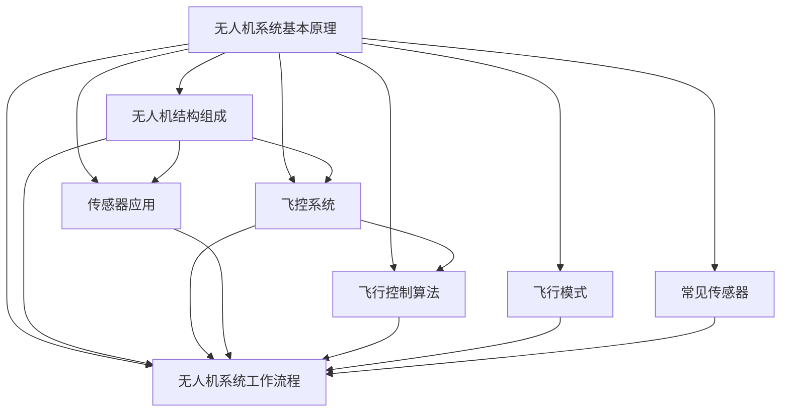
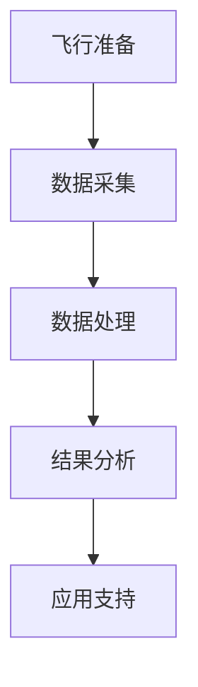

                 

### 第1章：无人机技术在农业精准管理中的应用概述

#### 1.1 无人机技术在农业领域的应用背景

随着全球人口的增长和农业资源的日益稀缺，提高农业生产的效率和质量成为现代农业发展的重要目标。农业精准管理作为一种先进的生产管理方式，通过实时监测作物生长状态和环境条件，为农民提供科学的决策支持，从而实现资源的最优配置和产值的最大化。

农业精准管理涉及多个方面，包括土壤监测、气象预报、作物生长状态监测、病虫害防治、水资源管理等等。然而，传统农业管理模式受限于人力和设备的局限性，难以实现全面、准确的监测与决策支持。而无人机技术的引入，为农业精准管理提供了新的可能。

##### 1.1.1 农业精准管理的需求与挑战

**农业精准管理的定义**：农业精准管理是一种通过现代信息技术和传感器技术，对农业生产过程中各种环境因素和作物生长状态进行实时监测，并提供科学决策支持的管理模式。其核心目标是提高农业生产效率、减少资源浪费、保障农产品质量。

**农业生产过程中存在的挑战**：

1. **监测手段有限**：传统农业监测手段主要依赖于人工观测，效率低且主观性强，难以实现全面、准确的监测。
2. **信息孤岛现象**：不同部门、不同环节之间的信息无法有效整合，导致决策支持滞后。
3. **资源浪费**：传统农业管理模式中，农药、肥料等资源的使用较为粗放，浪费现象严重。
4. **病虫害防治难度大**：病虫害的发生具有突发性和不确定性，传统防治手段难以做到及时、精准。
5. **劳动力成本高**：随着农村劳动力流失，农业生产劳动力成本不断上升。

##### 1.1.2 无人机技术在农业中的应用潜力

**高效数据采集**：无人机可以搭载多种传感器，如高清摄像头、红外传感器、激光雷达等，实现对农田的高清成像、环境参数的实时监测，以及作物健康状态的评估。

**实时监测与决策支持**：通过无人机采集的数据，可以实时传输到云端，进行大数据分析和处理，为农民提供科学的决策支持，如病虫害防治、施肥灌溉、农田管理策略等。

**降低生产成本**：无人机可以替代部分人力工作，如喷洒农药、施肥、种植等，减少劳动力成本。同时，通过精准管理，减少农药、肥料等资源的浪费，降低生产成本。

**提高农业产值**：通过无人机技术的应用，可以提高作物产量和质量，增加农民收入。同时，无人机农业解决方案可以拓展农业产业链，创造更多就业机会。

##### 1.1.3 无人机技术发展趋势

**高清成像与遥感技术**：随着成像技术的不断发展，无人机搭载的高清摄像头和遥感仪器可以更准确地获取农田信息，为农业精准管理提供更加详实的数据支持。

**自动飞行与智能控制**：无人机自动飞行和智能控制技术的发展，使得无人机可以更加自主地进行飞行和任务执行，提高工作效率和准确性。

**大数据处理与分析**：无人机采集的海量数据需要通过大数据技术进行高效处理和分析，提取有价值的信息，为农业精准管理提供决策支持。

**无人机安全法规与标准制定**：随着无人机技术的广泛应用，无人机安全法规和标准的制定显得尤为重要，以保障无人机在农业等领域的安全使用。

##### 1.1.4 本书内容结构安排

本书将围绕无人机技术在农业精准管理中的应用，系统地介绍相关核心概念、应用原理、系统架构、操作与维护、数据处理方法以及实际案例。具体内容结构如下：

- **第1章：无人机技术在农业精准管理中的应用概述**：介绍无人机技术在农业领域的应用背景、需求与挑战、应用潜力、发展趋势等内容。
- **第2章：无人机技术在农业中的核心概念与联系**：详细阐述无人机系统基本原理、传感器应用、无人机系统工作流程等核心概念，并通过Mermaid流程图展示核心概念之间的关系架构。
- **第3章：无人机系统架构详解**：介绍无人机系统硬件架构、硬件设计原则、硬件组件选型与配置、硬件集成与调试等内容。
- **第4章：无人机飞行控制与导航**：讲解无人机飞行控制原理、飞行控制算法、导航与定位技术、自动飞行模式等内容。
- **第5章：无人机在农业中的应用场景**：介绍无人机在农业中的多种应用场景，如植物健康监测、农田病虫害防治等，并通过实际案例进行分析。
- **第6章：无人机喷洒技术**：讲解无人机喷洒技术原理、喷洒方式、喷洒策略等内容，并结合案例分析进行详细讲解。
- **第7章：无人机在农业中的应用数据分析**：介绍无人机数据采集与处理、数据处理方法、数据可视化等内容。
- **第8章：无人机在农业中的应用前景与挑战**：分析无人机在农业中的应用前景、商业模式创新、政策与法规、未来发展趋势等内容。

通过本书的讲解，读者可以全面了解无人机技术在农业精准管理中的应用，掌握无人机系统的基本原理、操作方法以及数据分析技术，为实际应用提供有力的理论和技术支持。

#### 1.2 无人机技术在农业中的优势

无人机技术在农业中的应用，不仅改变了传统农业的生产模式，更为现代农业的发展带来了诸多优势。以下是无人机技术在农业中的一些主要优势：

**高效数据采集**：无人机可以搭载多种传感器，如高清摄像头、红外传感器、激光雷达等，实现对农田的全景扫描、高清成像和环境参数的实时监测。相比传统的地面测量方法，无人机具有更高的效率和更广泛的数据覆盖范围。

**实时监测与决策支持**：无人机采集的数据可以通过无线网络实时传输到云端，进行大数据分析和处理。通过这些分析结果，农民可以获得关于作物生长状态、病虫害发生情况、土壤湿度等关键信息的实时监测，为农业生产提供科学的决策支持。

**降低生产成本**：无人机可以替代部分人力工作，如农药喷洒、施肥、播种等，从而减少劳动力成本。同时，通过精准管理，减少农药、肥料等资源的使用，降低生产成本。例如，无人机可以根据农田的实际情况进行变量喷洒，避免过量使用农药和肥料，提高资源利用效率。

**提高农业产值**：无人机技术的应用可以显著提高作物产量和质量，增加农民收入。通过无人机进行作物健康监测和病虫害防治，可以及时发现和处理问题，避免作物损失。此外，无人机农业解决方案可以拓展农业产业链，创造更多就业机会，促进农村经济发展。

**减少环境负担**：无人机喷洒农药和肥料时，可以精确控制喷洒量和喷洒范围，减少农药和肥料的流失，降低对环境的污染。同时，无人机可以避免人工喷洒中可能出现的农药中毒事故，提高生产安全。

**提升农业智能化水平**：无人机技术的应用，有助于推动农业智能化的发展。通过大数据分析和人工智能技术，无人机可以更好地理解农田的实际情况，提供更精准的种植和管理方案。这不仅提高了农业生产的效率和质量，也为农业的可持续发展奠定了基础。

**增强农业竞争力**：在全球农业市场竞争日益激烈的背景下，无人机技术的应用可以帮助农民提高作物产量和品质，增强农业竞争力。同时，无人机农业解决方案还可以提升农产品的品牌价值，吸引更多消费者。

**拓展农业应用场景**：无人机技术在农业中的应用场景十分广泛，不仅包括农田管理，还可以应用于果园、茶园、养殖场等多种农业生产场景。例如，无人机可以用于果园病虫害监测、茶园土壤监测、养殖场环境监控等，为不同类型的农业生产提供有力支持。

综上所述，无人机技术在农业中的应用具有显著的优势，不仅提高了农业生产效率和质量，还为现代农业的发展注入了新的活力。随着无人机技术的不断进步和应用场景的拓展，未来无人机在农业领域的发展前景将更加广阔。

#### 1.3 无人机技术发展趋势

随着科技的不断发展，无人机技术在农业领域中的应用也呈现出不断进步的趋势。以下是无人机技术在农业中的一些关键发展趋势：

**高清成像与遥感技术**：随着成像技术的不断进步，无人机搭载的高清摄像头和遥感仪器可以更准确地获取农田信息。高清成像技术能够提供更详细的植被结构、土壤湿度、作物病虫害等信息，为农业精准管理提供更全面的数据支持。遥感技术则可以通过不同波段的成像，对农田进行多层次、多角度的监测，从而更好地了解农田的生态环境。

**自动飞行与智能控制**：无人机自动飞行与智能控制技术的发展，使得无人机可以更加自主地进行飞行和任务执行。自动飞行技术通过先进的导航算法和定位技术，可以实现无人机的自主起降、飞行路径规划、避障等功能。智能控制技术则通过机器学习和人工智能算法，可以实时分析农田数据，优化飞行策略，提高任务执行效率。

**大数据处理与分析**：无人机采集的数据量巨大，需要通过大数据技术进行高效处理和分析。大数据分析技术可以对无人机采集的海量数据进行分析，提取有价值的信息，如作物健康状况、病虫害发生规律、资源使用情况等。通过大数据分析，可以为农民提供更加科学的决策支持，提高农业生产的效率和质量。

**无人机安全法规与标准制定**：随着无人机技术的广泛应用，无人机安全法规和标准的制定显得尤为重要。无人机安全法规的制定，旨在保障无人机在农业等领域的安全使用，防止无人机事故的发生。无人机标准则涵盖了无人机的设计、制造、操作、维护等多个方面，为无人机的规范化管理提供了依据。

**农业无人机集成系统**：农业无人机集成系统是将无人机、传感器、云计算平台等多种技术整合在一起，形成一个完整的农业解决方案。这种集成系统可以更好地满足农业生产的多样化需求，提供全方位的农业生产管理服务。例如，可以通过集成系统实现对农田的全景监测、精准施肥、病虫害防治等功能，提高农业生产的智能化水平。

**农业无人机服务平台**：随着无人机技术的普及，越来越多的农民和企业开始使用无人机进行农业生产。农业无人机服务平台作为一种新兴的商业模式，可以为农民和企业提供无人机租赁、数据存储、数据分析、技术培训等服务，降低无人机应用门槛，促进无人机在农业领域的广泛应用。

**农业无人机产业联盟**：为了推动无人机技术在农业领域的健康发展，各国政府和企业纷纷成立农业无人机产业联盟。这些联盟通过协同合作，共同研发无人机技术，制定行业标准，推广无人机应用，促进农业无人机产业的繁荣和发展。

**无人机农业生态**：随着无人机技术的不断进步，一个完整的无人机农业生态正在逐步形成。这个生态包括了无人机硬件制造商、软件开发商、服务提供商、农户等多个环节，通过协同合作，可以实现农业生产的智能化、高效化。例如，硬件制造商可以提供先进的无人机设备和传感器，软件开发商可以提供强大的数据处理和分析工具，服务提供商可以提供无人机租赁和技术支持服务，农户则可以直接使用这些工具，提高农业生产效率。

综上所述，无人机技术在农业领域的发展趋势主要表现在高清成像与遥感技术、自动飞行与智能控制、大数据处理与分析、无人机安全法规与标准制定、农业无人机集成系统、农业无人机服务平台、农业无人机产业联盟以及无人机农业生态等方面。这些趋势不仅推动了无人机技术在农业领域的广泛应用，也为农业生产的智能化和高效化提供了有力支持。

### 1.4 本书内容结构安排

为了帮助读者全面了解无人机技术在农业精准管理中的应用，本书将系统性地介绍相关核心概念、应用原理、系统架构、操作与维护、数据处理方法以及实际案例。以下是本书的具体内容结构安排：

**第1章：无人机技术在农业精准管理中的应用概述**  
本章节将介绍无人机技术在农业领域的应用背景、需求与挑战、应用潜力、发展趋势等内容，为读者提供对无人机在农业中应用的总体认识。

**第2章：无人机技术在农业中的核心概念与联系**  
本章节将详细阐述无人机系统基本原理、传感器应用、无人机系统工作流程等核心概念，并通过Mermaid流程图展示核心概念之间的关系架构，帮助读者建立完整的知识体系。

**第3章：无人机系统架构详解**  
本章节将介绍无人机系统硬件架构、硬件设计原则、硬件组件选型与配置、硬件集成与调试等内容，使读者对无人机系统的构建与运行有更深入的了解。

**第4章：无人机飞行控制与导航**  
本章节将讲解无人机飞行控制原理、飞行控制算法、导航与定位技术、自动飞行模式等内容，帮助读者掌握无人机飞行的核心技术和方法。

**第5章：无人机在农业中的应用场景**  
本章节将介绍无人机在农业中的多种应用场景，如植物健康监测、农田病虫害防治等，并通过实际案例进行分析，展示无人机在农业中的具体应用效果。

**第6章：无人机喷洒技术**  
本章节将讲解无人机喷洒技术原理、喷洒方式、喷洒策略等内容，并结合案例分析进行详细讲解，帮助读者了解无人机喷洒技术的实际应用。

**第7章：无人机在农业中的应用数据分析**  
本章节将介绍无人机数据采集与处理、数据处理方法、数据可视化等内容，使读者掌握无人机数据采集、处理和分析的方法和技巧。

**第8章：无人机在农业中的应用前景与挑战**  
本章节将分析无人机在农业中的应用前景、商业模式创新、政策与法规、未来发展趋势等内容，为读者提供无人机在农业领域中未来发展方向的思考。

通过本书的讲解，读者不仅可以全面了解无人机技术在农业精准管理中的应用，还可以掌握无人机系统的基本原理、操作方法以及数据分析技术，为实际应用提供有力的理论和技术支持。希望本书能为推动无人机技术在农业领域的广泛应用和现代农业的发展贡献力量。

### 第2章：无人机技术在农业中的核心概念与联系

#### 2.1 无人机系统基本原理

无人机系统作为实现农业精准管理的关键工具，其基本原理涵盖了无人机结构组成、飞行控制系统、传感器及其应用、无人机系统工作流程等方面。以下将对这些核心概念进行详细阐述，并通过Mermaid流程图展示它们之间的联系，帮助读者构建完整的知识体系。

##### 2.1.1 无人机结构组成

**机架**：机架是无人机的主体，承担着整个飞行器的结构支撑和稳定性。常见的机架材料有塑料、碳纤维和金属等。

**飞控系统**：飞控系统是无人机的核心控制单元，包括飞控板、传感器和执行机构等。飞控系统通过传感器实时获取飞行器的姿态和位置信息，并根据预设的算法进行控制，实现无人机的稳定飞行。

**传感器**：无人机搭载的传感器种类多样，包括摄像头、红外传感器、激光雷达、气象传感器和植物健康监测传感器等。这些传感器用于采集农田环境、作物生长状态等数据。

**动力系统**：动力系统为无人机提供飞行所需的能量，常见的动力系统包括电动动力系统和燃油动力系统。电动动力系统以其环保和高效的特点在农业无人机中广泛应用。

**通信系统**：通信系统负责无人机与地面控制站之间的数据传输和指令传递，通常采用无线通信技术，如Wi-Fi、4G/5G网络和无线电通信等。

##### 2.1.2 飞行控制系统

**飞行控制原理**：飞行控制系统通过传感器实时获取飞行器的姿态和位置信息，然后利用飞行控制算法进行姿态调整和位置控制，确保无人机按照预设路径稳定飞行。

**飞行控制算法**：常见的飞行控制算法包括比例-积分-微分（PID）控制、模型预测控制（MPC）和自适应控制等。这些算法通过调整控制输入，实现飞行器的平稳飞行和精确控制。

**飞行模式**：无人机系统支持多种飞行模式，如手动模式、自动模式、定高模式和自动巡航模式。手动模式允许用户直接控制飞行器的动作；自动模式则通过预设程序自主飞行；定高模式保持飞行器的高度不变；自动巡航模式则按照预定的路径自动飞行。

##### 2.1.3 常见传感器及其应用

**摄像头**：用于拍摄农田高清图像，通过图像处理技术分析作物生长状态和病虫害情况。

**红外传感器**：用于监测作物温度、湿度等环境参数，以及夜间或低光条件下的植物成像。

**激光雷达**：用于地形扫描和作物高度测量，为农田管理和喷洒作业提供精确的数据支持。

**气象传感器**：用于监测风速、风向、温度、湿度等气象参数，为农业生产提供天气预警和气象信息。

**植物健康监测传感器**：包括叶绿素浓度传感器、光合有效辐射传感器等，用于实时监测植物的健康状态，提供科学的种植和管理建议。

##### 2.1.4 无人机系统工作流程

**飞行准备**：在执行任务前，需要进行飞行器检查、传感器校准、电池充电等准备工作，确保无人机系统正常运行。

**数据采集**：无人机在飞行过程中，通过传感器实时采集农田图像、环境参数和植物健康数据。

**数据处理**：将采集到的数据传输到地面站或云端进行处理，包括图像处理、数据清洗、特征提取等。

**结果分析与应用**：通过数据分析，提取有价值的信息，如作物病虫害情况、土壤湿度、植物生长状态等，为农业生产提供科学决策支持。

为了更直观地展示无人机系统核心概念之间的联系，我们使用Mermaid流程图进行描述：



通过上述阐述和Mermaid流程图，读者可以清晰地理解无人机系统在农业精准管理中的核心概念及其相互关系，为后续章节的学习和应用打下坚实的基础。

#### 2.1.1 无人机系统基本原理

无人机系统作为现代农业精准管理的核心技术之一，其基本原理涵盖了多个方面，包括无人机结构组成、飞控系统、传感器及其应用、以及无人机系统工作流程。以下是这些核心概念的详细解释。

##### 2.1.1 无人机结构组成

**机架**：机架是无人机的主体结构，其设计不仅要考虑到轻量化，还需要保证足够的强度和稳定性。常见的机架材料包括塑料、碳纤维和金属等。塑料机架成本低，适合初学者使用；碳纤维机架轻便且强度高，适合专业应用；金属材料则具有较高的耐用性和强度，但相对较重。

**飞控系统**：飞控系统是无人机的核心控制单元，负责实时监测无人机的姿态和位置信息，并根据这些信息调整无人机的飞行状态。飞控系统通常由飞控板、传感器和执行机构组成。飞控板是核心组件，用于处理传感器数据并生成控制指令；传感器包括GPS、加速度计、陀螺仪等，用于测量无人机的姿态和位置；执行机构则包括电机、舵机等，用于执行飞控板的控制指令。

**传感器**：无人机搭载的传感器种类多样，用于采集农田环境、作物生长状态等数据。常见的传感器包括摄像头、红外传感器、激光雷达、气象传感器和植物健康监测传感器等。摄像头用于拍摄高清图像，分析作物病虫害和生长状态；红外传感器可以在夜间或低光条件下监测作物温度和湿度；激光雷达用于地形扫描和作物高度测量；气象传感器用于监测风速、风向、温度和湿度等参数；植物健康监测传感器则包括叶绿素浓度传感器和光合有效辐射传感器，用于实时监测植物的健康状态。

**动力系统**：动力系统为无人机提供飞行所需的能量。常见的动力系统包括电动动力系统和燃油动力系统。电动动力系统以其环保和高效的特点在农业无人机中广泛应用，常见的电动动力系统包括锂离子电池和电动机。燃油动力系统则适合需要长时间飞行的应用场景，如大型农业无人机或需要高速飞行的无人机。

**通信系统**：通信系统负责无人机与地面控制站之间的数据传输和指令传递。常见的通信技术包括Wi-Fi、4G/5G网络和无线电通信等。Wi-Fi通信距离较短，但传输速率较快；4G/5G网络可以实现长距离、高速的数据传输；无线电通信则适用于远距离、低带宽的应用场景。

##### 2.1.2 飞控系统

**飞行控制原理**：飞控系统通过传感器实时获取无人机的姿态和位置信息，然后利用飞行控制算法进行姿态调整和位置控制，确保无人机按照预设路径稳定飞行。飞行控制算法包括比例-积分-微分（PID）控制、模型预测控制（MPC）和自适应控制等。PID控制通过调整比例、积分和微分三个参数，实现无人机的平稳飞行和精确控制；MPC通过预测无人机的未来状态，生成最优的控制策略；自适应控制则根据环境变化自动调整控制参数，实现无人机的自适应飞行。

**飞行模式**：无人机系统支持多种飞行模式，包括手动模式、自动模式、定高模式和自动巡航模式等。手动模式允许用户直接控制无人机的飞行状态，适用于初学者或特殊操作场景；自动模式通过预设程序自主飞行，适用于自动化作业场景；定高模式保持无人机的高度不变，适用于大面积农田监测和喷洒作业；自动巡航模式则按照预定的路径自动飞行，适用于长距离飞行和复杂地形作业。

##### 2.1.3 常见传感器及其应用

**摄像头**：摄像头是无人机数据采集的重要工具，可用于拍摄农田高清图像，通过图像处理技术分析作物病虫害、生长状态等。摄像头的选择取决于应用需求，如分辨率、视角、抗光能力等。

**红外传感器**：红外传感器可用于夜间或低光条件下的作物成像，监测作物温度、湿度等参数。红外传感器的选择需要考虑红外波长、分辨率和温度范围等因素。

**激光雷达**：激光雷达用于地形扫描和作物高度测量，为农田管理和喷洒作业提供精确的数据支持。激光雷达的选择需要考虑扫描范围、分辨率和扫描速度等因素。

**气象传感器**：气象传感器用于监测风速、风向、温度和湿度等气象参数，为农业生产提供天气预警和气象信息。气象传感器的选择需要考虑测量精度和抗干扰能力等因素。

**植物健康监测传感器**：植物健康监测传感器包括叶绿素浓度传感器和光合有效辐射传感器等，用于实时监测植物的健康状态，提供科学的种植和管理建议。传感器的选择需要考虑测量精度、响应速度和应用场景等因素。

##### 2.1.4 无人机系统工作流程

**飞行准备**：在执行任务前，需要进行飞行器检查、传感器校准、电池充电等准备工作，确保无人机系统正常运行。

**数据采集**：无人机在飞行过程中，通过传感器实时采集农田图像、环境参数和植物健康数据。

**数据处理**：将采集到的数据传输到地面站或云端进行处理，包括图像处理、数据清洗、特征提取等。

**结果分析与应用**：通过数据分析，提取有价值的信息，如作物病虫害情况、土壤湿度、植物生长状态等，为农业生产提供科学决策支持。

为了更直观地展示无人机系统的工作流程，我们可以用Mermaid流程图来表示：



通过上述对无人机系统基本原理的详细阐述和Mermaid流程图的辅助，读者可以更加清晰地理解无人机系统在农业精准管理中的应用，为后续章节的学习和应用打下坚实的基础。

#### 2.1.2 飞行控制系统

无人机在农业中的应用离不开飞行控制系统的支持，该系统是确保无人机稳定飞行并完成预定任务的核心。以下是关于飞行控制系统的详细解释，包括其工作原理、控制算法以及飞行模式等。

**飞行控制原理**

**传感器数据采集**：飞行控制系统首先通过传感器（如加速度计、陀螺仪、磁力计和GPS等）采集无人机的实时姿态和位置信息。这些传感器能够测量无人机的角速度、加速度、磁场强度以及地理位置，为飞行控制提供必要的数据输入。

**姿态估算与误差校正**：基于传感器数据，飞行控制系统能够估算出无人机的实时姿态。然而，传感器数据可能存在误差，因此需要通过融合算法（如扩展卡尔曼滤波器）进行误差校正，以提高姿态估算的准确性。

**控制策略生成**：飞行控制算法（如PID控制、模型预测控制（MPC）等）根据无人机当前姿态与目标姿态之间的偏差，生成相应的控制指令。这些指令用于调整无人机的电机转速、舵机角度等，以实现姿态调整和位置控制。

**执行控制指令**：飞控板接收到控制指令后，通过执行机构（如电机、舵机等）执行具体的动作。执行机构根据指令调整无人机的姿态和位置，确保其按照预设路径稳定飞行。

**反馈与闭环控制**：飞行控制系统通过传感器持续采集无人机当前的姿态和位置信息，与目标值进行对比，生成新的控制指令。这一过程形成一个闭环控制系统，使得无人机能够实时响应环境变化，保持稳定飞行。

**飞行控制算法**

**比例-积分-微分（PID）控制**：PID控制是最常用的飞行控制算法之一，通过调整比例（P）、积分（I）和微分（D）三个参数，实现无人机的姿态调整和位置控制。比例控制根据当前偏差调整控制量；积分控制积累偏差，用于消除稳态误差；微分控制预测偏差变化，提前调整控制量。

**模型预测控制（MPC）**：MPC控制通过构建无人机动力学模型，预测无人机的未来状态，并生成最优的控制策略。相比PID控制，MPC能够处理更复杂的控制任务，提高飞行控制的精度和稳定性。

**自适应控制**：自适应控制算法根据环境变化和无人机状态，自动调整控制参数，以适应不同的飞行场景。这种控制方法能够提高无人机的适应性和鲁棒性，适用于复杂和动态的飞行环境。

**飞行模式**

**手动模式**：手动模式允许用户直接控制无人机的飞行状态，包括俯仰、滚转、偏航等。这种模式适合初学者或者需要人工干预的特殊任务。

**自动模式**：自动模式通过预设程序自主飞行，用户只需设定飞行路径、高度、速度等参数，无人机即可按照预设轨迹执行任务。这种模式适用于自动化作业场景，如农药喷洒、农田监测等。

**定高模式**：定高模式保持无人机的高度不变，适用于大面积农田监测和喷洒作业。在这种模式下，无人机可以专注于水平移动，而无需频繁调整高度。

**自动巡航模式**：自动巡航模式按照预定的路径自动飞行，适用于长距离飞行和复杂地形作业。这种模式通过GPS或激光雷达等传感器，确保无人机准确执行任务。

**飞行控制系统的综合作用**

飞行控制系统通过传感器数据采集、姿态估算、控制策略生成和执行等过程，确保无人机在复杂环境中稳定飞行并完成任务。在农业领域，飞行控制系统不仅支持无人机的精确飞行，还能通过实时监测和数据分析，为农业生产提供科学决策支持，提高农业生产效率和质量。

通过上述对飞行控制系统的详细解释，读者可以更好地理解无人机在农业中的应用原理，为后续章节的学习和应用打下坚实的基础。

#### 2.1.3 常见传感器及其应用

在无人机系统中，传感器的作用至关重要，它们能够采集农田环境、作物生长状态等关键数据，为农业精准管理提供科学依据。以下是几种常见传感器及其在农业中的应用：

**摄像头**：摄像头是无人机数据采集的主要工具之一，常用于拍摄农田高清图像。通过图像处理技术，可以分析作物的病虫害情况、生长状态以及农田环境变化。例如，在作物健康监测中，摄像头可以用来识别病害区域，及时进行防治；在农田监测中，摄像头可以用来评估土壤湿度、植被覆盖情况等。

**红外传感器**：红外传感器能够检测作物在夜间或低光条件下的温度和湿度，这对于某些农作物的生长监控尤为重要。例如，通过红外传感器监测作物的叶温，可以判断作物的水分状况和健康程度；在病虫害防治中，红外传感器可以帮助识别病虫害发生的温度阈值。

**激光雷达**：激光雷达用于地形扫描和作物高度测量，为农田管理和喷洒作业提供精确数据支持。激光雷达可以测量农田表面的三维结构，生成高精度的数字地形图，帮助规划农田灌溉和施肥策略。此外，激光雷达还可以用于测量作物高度，帮助分析作物的生长状态和预测产量。

**气象传感器**：气象传感器用于监测农田中的风速、风向、温度和湿度等气象参数，为农业生产提供天气预警和气象信息。例如，通过监测风速和风向，可以预测可能出现的风害，及时采取防范措施；通过监测温度和湿度，可以了解农田的小气候环境，为科学灌溉和病虫害防治提供依据。

**植物健康监测传感器**：植物健康监测传感器包括叶绿素浓度传感器和光合有效辐射传感器等，用于实时监测植物的健康状态。叶绿素浓度传感器可以测量植物叶片中的叶绿素含量，反映植物的光合作用强度和营养状况；光合有效辐射传感器则可以测量植物吸收的光能，帮助分析植物的生长态势和潜在问题。

**应用示例**：

1. **作物健康监测**：通过摄像头和红外传感器，无人机可以实时监测农田作物的生长状态和病虫害情况。例如，在小麦健康监测中，摄像头可以识别病害区域，红外传感器可以测量作物叶温，帮助农民及时采取防治措施。

2. **农田监测**：通过激光雷达，无人机可以生成农田的三维数字地形图，帮助规划灌溉和施肥策略。例如，在水稻种植中，激光雷达可以测量水层深度，指导灌溉和施肥。

3. **气象监测**：通过气象传感器，无人机可以实时监测农田中的风速、风向、温度和湿度等气象参数，为农业生产提供科学的气象信息。例如，在果园中，通过气象传感器可以预测可能出现的霜冻天气，及时采取防护措施。

4. **病虫害防治**：通过植物健康监测传感器，无人机可以实时监测作物的健康状态，预测病虫害的发生，及时采取防治措施。例如，在蔬菜种植中，通过叶绿素浓度传感器和光合有效辐射传感器，可以预测作物缺肥或病虫害的发生，指导农民科学施肥和防治病虫害。

综上所述，无人机搭载的多种传感器在农业中的应用，为农业精准管理提供了强有力的数据支持。这些传感器的应用不仅提高了农业生产效率，还促进了农业生产的智能化和可持续发展。

#### 2.1.4 无人机系统工作流程

无人机系统在农业中的应用，通过其高效的工作流程实现了对农田的全面监测和精准管理。以下是无人机系统工作流程的详细描述：

**飞行准备**：在执行任务之前，需要进行全面的飞行准备。这一步骤包括无人机硬件的检查、传感器校准、电池充电以及飞行计划的制定。硬件检查确保无人机的各部件运行正常，传感器校准保证数据采集的准确性，电池充电确保无人机在飞行过程中有足够的电力支持。同时，根据农田面积、作物类型和监测需求，制定合理的飞行计划，以确保任务的高效完成。

**数据采集**：飞行准备完成后，无人机按照预定的飞行计划起飞，并开始执行任务。在飞行过程中，无人机通过搭载的各种传感器（如摄像头、红外传感器、激光雷达、气象传感器等）对农田进行全方位的数据采集。摄像头用于拍摄农田的高清图像，红外传感器在夜间或低光条件下监测作物温度和湿度，激光雷达扫描地形和作物高度，气象传感器则实时监测风速、风向、温度和湿度等参数。这些数据为后续的分析提供了重要的基础。

**数据处理**：无人机采集到的数据通过无线通信模块传输到地面控制站或云端进行处理。在地面控制站或云端，数据首先进行传输校验，确保数据的完整性和准确性。接下来，数据通过预处理步骤进行清洗和格式转换，去除噪声和异常值，以便后续分析。预处理完成后，数据进入特征提取阶段，提取出与作物生长状态和环境条件相关的特征值，如植被指数、土壤湿度、温度分布等。

**结果分析**：通过大数据分析和人工智能算法，对预处理后的数据进行深入分析，提取出有价值的信息。例如，通过图像处理技术，可以识别出作物病虫害的发生区域和程度；通过气象数据的分析，可以预测未来几天的天气变化，为农事活动提供指导；通过土壤湿度数据的分析，可以优化灌溉策略，提高水资源利用效率。

**应用支持**：分析结果为农业生产提供了科学的决策支持。例如，根据病虫害监测结果，农民可以及时采取防治措施，避免作物损失；根据气象预测结果，农民可以合理安排农事活动，避免天气影响；根据灌溉策略的优化结果，农民可以节约水资源，提高农田产量。

为了更直观地展示无人机系统的工作流程，可以使用以下Mermaid流程图：


通过上述流程，无人机系统在农业中的应用实现了从数据采集、数据处理到结果分析、应用支持的完整闭环，为农业精准管理提供了有力支持。这一流程不仅提高了农业生产效率，还促进了农业的智能化和可持续发展。

### 第3章：无人机系统架构详解

#### 3.1 无人机系统硬件架构

无人机系统的硬件架构是整个无人机能够正常运作的基础，它决定了无人机的性能、稳定性和安全性。本节将详细阐述无人机硬件架构的设计原则、主要组件及其选型与配置。

##### 3.1.1 无人机硬件设计原则

**轻量化设计**：无人机在飞行过程中需要消耗电能，因此轻量化设计是硬件设计的重要原则之一。通过采用轻质材料（如碳纤维、铝合金）和减小不必要的结构重量，可以延长无人机的飞行时间，提高其续航能力。

**结构强度与稳定性**：无人机在飞行过程中会遇到风力和气压等外部环境因素的影响，因此硬件设计需要保证足够的结构强度和稳定性。选择高强度材料，并采用合理的结构设计（如蜂窝结构、悬浮结构），可以确保无人机在复杂环境中稳定飞行。

**安全性**：无人机的安全性至关重要，硬件设计需要考虑故障应对措施，如应急停机、自动返航等功能。同时，在材料选择和电路设计中，应确保无人机具备一定的抗干扰能力，防止因外界干扰导致系统故障。

**可维护性**：硬件设计应考虑可维护性，以便在无人机发生故障时能够快速检修和更换部件。模块化设计、标准化的接口和详细的维修手册等都是提高可维护性的有效手段。

##### 3.1.2 无人机硬件组件

**主机**：主机是无人机的核心组件，通常包括飞控板、电池、主摄像头、通信模块等。飞控板负责无人机的姿态控制和任务执行；电池提供电力支持；主摄像头用于拍摄高清图像；通信模块负责无人机与地面站之间的数据传输和控制指令传递。

**遥控器**：遥控器是无人机控制系统的另一重要组成部分，通过无线信号与飞控板通信，实现无人机的遥控操作。遥控器通常包括操纵杆、显示屏和按钮等，用于调整无人机的飞行状态、切换飞行模式、启动或停止任务等。

**飞控板**：飞控板是无人机的控制核心，负责实时处理传感器数据，生成飞行控制指令，并通过执行机构调整无人机的姿态和位置。常见的飞控板包括STM32、Arduino等，其性能和兼容性对无人机的稳定性和功能有很大影响。

**传感器模块**：传感器模块包括摄像头、红外传感器、激光雷达、气象传感器等，用于采集农田环境、作物生长状态等关键数据。不同类型的传感器具有不同的性能参数和应用场景，选择合适的传感器模块对数据采集的准确性和可靠性至关重要。

**电池**：电池是无人机飞行的动力来源，其容量和续航时间直接影响无人机的飞行时间和任务完成情况。常见的电池类型有锂离子电池和锂聚合物电池，选择电池时需要考虑其容量、电压、重量和安全性等因素。

**通信模块**：通信模块负责无人机与地面站之间的数据传输和控制指令传递。常见的通信技术包括Wi-Fi、4G/5G网络和无线电通信等，选择通信模块时需要考虑通信距离、传输速率和抗干扰能力等因素。

##### 3.1.3 硬件选型与配置

**飞行器选型**：根据农田监测任务的需求，选择合适的飞行器。小型无人机适用于小面积农田监测，如蔬菜大棚；中型无人机适用于大面积农田监测，如粮食作物；大型无人机适用于复杂地形和长时间飞行任务。

**飞控板选型**：飞控板的性能直接影响无人机的控制精度和稳定性。选择飞控板时，需要考虑其处理能力、传感器接口数量和通信方式。例如，基于STM32的飞控板适用于大多数农业无人机，具有较高的性能和稳定性。

**传感器选型**：根据监测任务的需求，选择合适的传感器。例如，摄像头用于作物健康监测和病虫害识别，红外传感器用于夜间或低光条件下的监测，激光雷达用于地形扫描和作物高度测量。

**电池选型**：电池的容量和续航时间对无人机的飞行时间有直接影响。选择电池时，需要考虑无人机的飞行时间和任务需求，确保电池能够满足任务需求。例如，锂离子电池容量较大，续航时间较长，但重量较重；锂聚合物电池则相对轻便，但容量较小。

**硬件集成与调试**：在硬件选型和配置完成后，需要进行硬件集成和调试。硬件集成是将各组件按照设计要求进行组装和连接，调试则是通过测试和校准，确保各组件正常工作，达到预期性能。例如，通过校准传感器和飞控板，确保无人机能够准确采集和处理数据；通过调试通信模块，确保数据传输的稳定性和可靠性。

综上所述，无人机系统硬件架构的设计原则和主要组件的选型与配置对无人机的性能和可靠性至关重要。通过合理的硬件设计和配置，可以确保无人机在农业精准管理中高效稳定地运行，为农业生产提供有力的支持。

#### 3.1.2 飞行控制系统

飞行控制系统是无人机系统的核心部分，它负责无人机的姿态控制和导航，确保无人机能够按照预设路径稳定飞行。以下是关于飞行控制系统的详细解释，包括其原理、硬件和软件设计。

##### 3.1.2.1 飞行控制系统的原理

飞行控制系统通过传感器实时获取无人机的姿态和位置信息，然后利用控制算法生成控制指令，调整无人机的姿态和位置，确保其按照预定路径飞行。具体来说，飞行控制系统的工作原理包括以下几个步骤：

1. **传感器数据采集**：无人机通过搭载的各种传感器（如加速度计、陀螺仪、磁力计和GPS等）实时采集无人机的姿态和位置信息。加速度计和陀螺仪用于测量无人机的角速度和加速度，磁力计用于测量磁场强度，GPS用于获取无人机的地理位置。

2. **姿态估算与误差校正**：根据传感器数据，飞行控制系统能够估算出无人机的实时姿态。然而，由于传感器数据可能存在误差，因此需要通过滤波算法（如扩展卡尔曼滤波器）进行误差校正，以提高姿态估算的准确性。

3. **控制策略生成**：基于无人机当前姿态与目标姿态之间的偏差，飞行控制算法（如PID控制、模型预测控制（MPC）等）生成相应的控制指令。这些指令用于调整无人机的电机转速、舵机角度等，以实现无人机的姿态调整和位置控制。

4. **执行控制指令**：飞控板接收到控制指令后，通过执行机构（如电机、舵机等）执行具体的动作。执行机构根据指令调整无人机的姿态和位置，确保无人机按照预设路径稳定飞行。

5. **反馈与闭环控制**：飞行控制系统通过传感器持续采集无人机的实时姿态和位置信息，与目标值进行对比，生成新的控制指令。这一过程形成一个闭环控制系统，使得无人机能够实时响应环境变化，保持稳定飞行。

##### 3.1.2.2 飞行控制系统的硬件设计

飞行控制系统的硬件设计包括飞控板、传感器模块、电机、舵机和电池等。

1. **飞控板**：飞控板是飞行控制系统的核心组件，负责处理传感器数据、生成控制指令和与执行机构通信。常见的飞控板包括STM32、Arduino等，其性能和兼容性对无人机的控制精度和稳定性有很大影响。飞控板需要具备足够的处理能力，以支持实时数据处理和控制指令生成。

2. **传感器模块**：传感器模块包括加速度计、陀螺仪、磁力计和GPS等，用于测量无人机的姿态和位置。传感器模块的选择取决于无人机的应用场景和性能要求。例如，高精度的加速度计和陀螺仪可以提高无人机的姿态控制精度。

3. **电机和舵机**：电机和舵机是执行机构，负责根据飞控板的控制指令调整无人机的姿态和位置。电机通常用于调整无人机的俯仰、滚转和偏航，舵机则用于调整无人机的方向。电机和舵机的性能参数（如功率、转速、响应时间等）对无人机的控制性能有重要影响。

4. **电池**：电池为无人机提供飞行所需的电能，其容量和续航时间直接影响无人机的飞行时间和任务完成情况。常见的电池类型有锂离子电池和锂聚合物电池，选择电池时需要考虑其容量、电压、重量和安全性等因素。

##### 3.1.2.3 飞行控制系统的软件设计

飞行控制系统的软件设计包括控制算法的实现、传感器数据的处理和执行机构的控制。

1. **控制算法**：控制算法是飞行控制系统的核心，用于根据传感器数据生成控制指令。常见的控制算法包括比例-积分-微分（PID）控制、模型预测控制（MPC）和自适应控制等。PID控制通过调整比例、积分和微分三个参数实现姿态调整和位置控制；MPC通过预测无人机的未来状态生成最优控制策略；自适应控制根据环境变化自动调整控制参数。

2. **传感器数据处理**：传感器数据处理包括传感器数据的采集、滤波和特征提取。传感器数据采集需要确保数据的实时性和准确性，滤波算法（如扩展卡尔曼滤波器）用于去除噪声和异常值，特征提取则用于提取与无人机姿态和位置相关的关键特征。

3. **执行机构控制**：执行机构控制包括电机的转速控制和舵机的角度控制。通过控制算法生成控制指令，调整电机的转速和舵机的角度，实现无人机的姿态调整和位置控制。执行机构控制需要确保响应速度快、控制精度高，以满足无人机的实时控制需求。

##### 3.1.2.4 飞行控制系统的调试与优化

飞行控制系统的调试与优化是确保无人机稳定飞行和完成任务的关键步骤。以下是飞行控制系统调试与优化的几个方面：

1. **传感器校准**：传感器校准是确保传感器数据准确性的重要环节。通过校准传感器，可以消除传感器误差，提高姿态估算的准确性。

2. **控制参数调整**：根据无人机的飞行环境和任务需求，调整控制参数（如PID参数、MPC预测时间等），以优化飞行控制性能。通过测试和调试，找到合适的控制参数，确保无人机在复杂环境中稳定飞行。

3. **飞行测试**：进行飞行测试是验证飞行控制系统性能的重要手段。通过模拟不同飞行场景和任务，测试无人机的飞行稳定性、控制精度和响应速度，发现和解决潜在问题。

4. **系统优化**：在飞行测试过程中，根据测试结果对飞行控制系统进行优化。通过改进控制算法、优化硬件设计、增强传感器性能等手段，提高飞行控制系统的整体性能和可靠性。

综上所述，飞行控制系统是无人机系统的核心部分，其设计包括硬件和软件两个层面。通过合理的硬件设计和软件实现，结合调试与优化，可以确保无人机在农业精准管理中高效稳定地运行，为农业生产提供有力支持。

### 第4章：无人机飞行控制与导航

#### 4.1 无人机飞行控制原理

无人机飞行控制原理是无人机系统能够实现稳定飞行和精确操作的核心。它涉及飞行控制系统的基本概念、控制输入、控制输出以及控制目标等。

**基本概念**：

1. **控制输入**：控制输入是指无人机飞行控制系统中，用于调整无人机姿态和位置的指令。这些指令通常由飞控板生成，并根据无人机的传感器数据实时调整。

2. **控制输出**：控制输出是指飞控板通过执行机构（如电机、舵机等）执行的控制指令，用于调整无人机的姿态和位置。

3. **控制目标**：控制目标是指无人机在飞行过程中需要达到的状态，例如保持水平飞行、执行特定路径或完成特定任务。

**控制输入与输出**：

- **控制输入**：飞控板通过传感器（如加速度计、陀螺仪、GPS等）实时获取无人机的姿态和位置信息。这些传感器数据经过处理，生成控制输入指令。

- **控制输出**：飞控板根据控制输入指令，通过电机、舵机等执行机构调整无人机的姿态和位置。例如，通过调整电机转速，可以实现无人机的俯仰、滚转和偏航运动。

**控制算法**：

飞行控制算法是实现无人机飞行控制的核心。常见的控制算法包括比例-积分-微分（PID）控制、模型预测控制（MPC）和自适应控制等。

- **PID控制**：PID控制通过调整比例（P）、积分（I）和微分（D）三个参数，实现无人机的姿态调整和位置控制。比例控制根据当前偏差调整控制量；积分控制积累偏差，用于消除稳态误差；微分控制预测偏差变化，提前调整控制量。

- **MPC控制**：MPC控制通过构建无人机动力学模型，预测无人机的未来状态，并生成最优的控制策略。相比PID控制，MPC能够处理更复杂的控制任务，提高飞行控制的精度和稳定性。

- **自适应控制**：自适应控制算法根据环境变化和无人机状态，自动调整控制参数，以适应不同的飞行场景。这种控制方法能够提高无人机的适应性和鲁棒性，适用于复杂和动态的飞行环境。

**控制目标与实现**：

飞行控制系统的最终目标是实现无人机的稳定飞行和精确操作。具体来说，包括以下几个方面：

1. **姿态控制**：通过调整无人机的俯仰、滚转和偏航角度，实现无人机的稳定飞行。

2. **位置控制**：通过调整无人机的速度和方向，实现无人机在预定路径上的飞行。

3. **任务执行**：在完成姿态控制和位置控制的基础上，实现无人机执行特定任务（如拍摄、喷洒、监测等）。

为了实现这些控制目标，飞行控制系统需要具备以下功能：

1. **传感器数据采集**：实时获取无人机的姿态和位置信息。

2. **控制算法实现**：根据传感器数据生成控制指令。

3. **执行机构控制**：通过电机、舵机等执行机构执行控制指令。

4. **反馈与闭环控制**：通过传感器持续获取无人机的姿态和位置信息，与目标值进行对比，生成新的控制指令，形成闭环控制系统。

通过上述飞行控制原理，无人机能够在农业等应用场景中实现稳定、精确的飞行操作，为农业生产提供有力支持。

#### 4.1.2 飞行控制算法

飞行控制算法是实现无人机稳定飞行和精确操作的核心，通过调整无人机的姿态和位置，确保其按照预设路径运行。以下是几种常用的飞行控制算法及其原理。

**比例-积分-微分（PID）控制**：

PID控制是最常见的飞行控制算法之一，其核心思想是通过调整比例（P）、积分（I）和微分（D）三个参数，实现无人机的姿态调整和位置控制。

- **比例控制**：比例控制通过当前误差值乘以比例系数，生成控制量。比例控制能够快速响应误差变化，但可能导致超调。

  ```python
  Kp = 1  # 比例系数
  control_input = Kp * error
  ```

- **积分控制**：积分控制通过积累误差值，生成控制量。积分控制能够消除稳态误差，但可能产生积分饱和问题。

  ```python
  Ki = 0.1  # 积分系数
  integral_error += error
  control_input += Ki * integral_error
  ```

- **微分控制**：微分控制通过预测误差变化率，生成控制量。微分控制能够提前调整控制量，减少超调。

  ```python
  Kd = 0.1  # 微分系数
  derivative_error = (error - previous_error) / delta_t
  control_input -= Kd * derivative_error
  ```

**模型预测控制（MPC）**：

MPC控制通过构建无人机动力学模型，预测无人机的未来状态，并生成最优的控制策略。相比PID控制，MPC能够处理更复杂的控制任务，提高飞行控制的精度和稳定性。

- **动态模型**：MPC基于无人机动力学模型，描述无人机的运动状态。常见的动态模型包括线性二次型调节器（LQR）和扩展卡尔曼滤波（EKF）。

  ```python
  # LQR模型
  A = [[-1, 0], [0, -1]]
  B = [[1], [0]]
  Q = [[1, 0], [0, 1]]  # 状态权重矩阵
  R = 1  # 控制权重矩阵

  # EKF模型
  x = [x, y, vx, vy]  # 状态向量
  F = [[1, 0, dt, 0],
       [0, 1, 0, dt],
       [0, 0, 1, 0],
       [0, 0, 0, 1]]
  H = [[1, 0, 0, 0],
       [0, 1, 0, 0]]

  # 控制输入计算
  P = np.linalg.inv(R @ np.eye(2) + Q)
  P = np.eye(2)
  K = P @ B.T @ np.linalg.inv(B @ P @ B.T + Q)
  u = K @ (x - B @ P @ B.T @ K @ x)

  # 预测状态
  x_pred = F @ x + B @ u
  ```

**自适应控制**：

自适应控制算法根据环境变化和无人机状态，自动调整控制参数，以适应不同的飞行场景。这种控制方法能够提高无人机的适应性和鲁棒性。

- **自适应控制原理**：自适应控制通过实时调整控制参数，使无人机能够应对不同飞行环境和任务需求。

  ```python
  # 自适应PID控制
  Kp, Ki, Kd = 1, 0.1, 0.1
  error = setpoint - measurement
  derivative_error = (error - previous_error) / delta_t
  previous_error = error

  P = Kp + Ki * delta_t + Kd / delta_t
  I = Ki * delta_t
  D = Kd / delta_t

  control_input = P * error + I * integral_error - D * derivative_error
  ```

通过上述飞行控制算法，无人机能够实现稳定的飞行操作，并适应不同的飞行场景和任务需求。这些算法不仅提高了无人机的控制精度和稳定性，还为农业等领域的应用提供了强大的技术支持。

#### 4.1.3 导航与定位技术

在无人机飞行控制中，导航与定位技术起着至关重要的作用。它们确保无人机能够准确地确定自己的位置，按照预定路径飞行，并应对各种环境变化。以下是几种常见的导航与定位技术及其应用。

**GPS定位**：

GPS（全球定位系统）是一种广泛使用的卫星导航技术，能够为无人机提供精确的地理位置信息。GPS定位通过接收卫星发射的信号，计算无人机的经纬度和高度。其主要优点是覆盖范围广、精度高，但受天气和地形的影响较大。

- **定位原理**：GPS接收器通过接收至少三个卫星信号，利用三角测量原理计算位置。具体来说，GPS接收器测量卫星信号到达的时间，然后通过已知卫星的位置，计算出接收器与卫星之间的距离。通过解算多个卫星的距离，GPS接收器可以确定接收器的位置。

  ```python
  # GPS定位伪代码
  satellites = get_satellites()  # 获取可见卫星列表
  distances = []  # 存储与每个卫星的距离
  for satellite in satellites:
      distance = calculate_distance(satellite)
      distances.append(distance)
  position = triangulate_position(distances)
  ```

- **应用场景**：GPS定位广泛应用于无人机的大面积飞行和路径规划。例如，在农田监测中，GPS定位可以确保无人机按照预设路径飞行，实现对农田的全面覆盖。

**光流定位**：

光流定位是一种基于视觉的定位技术，通过分析摄像头的视频流，估计无人机的位置和速度。光流定位利用图像序列中的像素运动信息，计算无人机的运动状态。其主要优点是实时性强、对环境适应性高，但受光线条件和摄像头质量的影响较大。

- **定位原理**：光流定位通过计算连续图像帧之间的像素运动，生成光流向量。光流向量描述了像素在图像平面上的运动方向和速度。通过分析光流向量，可以估计无人机的位置和速度。

  ```python
  # 光流定位伪代码
  previous_frame = capture_frame()
  current_frame = capture_frame()
  optical_flow = calculate_optical_flow(previous_frame, current_frame)
  position_and_velocity = estimate_position_and_velocity(optical_flow)
  ```

- **应用场景**：光流定位适用于室内和光线充足的环境。例如，在室内环境中，光流定位可以用于无人机室内导航和定位，实现对特定区域的精确覆盖。

**激光雷达定位**：

激光雷达（Lidar）是一种通过发射激光束并测量反射光来获取距离信息的技术。激光雷达定位利用激光雷达扫描地形和周围环境，为无人机提供高精度的位置和姿态信息。其主要优点是测量精度高、抗干扰能力强，但设备成本较高。

- **定位原理**：激光雷达通过发射激光束，测量激光束反射回来的时间或频率变化，计算出与障碍物或地形的距离。通过多次扫描和数据处理，激光雷达可以构建三维环境模型，为无人机提供精确的位置和姿态信息。

  ```python
  # 激光雷达定位伪代码
  laser_radar = initialize_lidar()
  scan = laser_radar.scan()
  position_and_orientation = calculate_position_and_orientation(scan)
  ```

- **应用场景**：激光雷达定位广泛应用于地形复杂和需要高精度定位的应用场景。例如，在农田监测中，激光雷达可以用于地形扫描和作物高度测量，为农田管理和喷洒作业提供精确的数据支持。

**融合定位算法**：

融合定位算法通过将多种定位技术（如GPS、光流定位、激光雷达定位等）的数据进行综合处理，提高定位精度和稳定性。融合定位算法利用不同定位技术的优点，克服单一技术的局限性，为无人机提供更加可靠的位置信息。

- **定位原理**：融合定位算法通过数据融合方法（如卡尔曼滤波、粒子滤波等），将多种定位技术的数据综合处理，估计无人机的位置和姿态。通过融合多个传感器数据，可以提高定位精度和抗干扰能力。

  ```python
  # 融合定位算法伪代码
  gps_data = get_gps_data()
  optical_flow_data = get_optical_flow_data()
  lidar_data = get_lidar_data()
  fused_data = fuse_data(gps_data, optical_flow_data, lidar_data)
  position_and_orientation = estimate_position_and_orientation(fused_data)
  ```

- **应用场景**：融合定位算法广泛应用于无人机的高精度定位和复杂环境导航。例如，在农业领域中，融合定位算法可以用于无人机在复杂地形和多种环境条件下的精准飞行和任务执行。

通过上述导航与定位技术，无人机能够在各种应用场景中实现高精度定位和稳定飞行，为农业生产提供有力的技术支持。

#### 4.1.4 自动飞行模式

无人机在农业中的应用，不仅依赖于其飞行控制系统和导航定位技术，还需要具备多种自动飞行模式，以适应不同农业生产任务的需求。以下将介绍几种常见的自动飞行模式，包括定高飞行、定速飞行、自动巡航和自动返航。

**定高飞行**：

定高飞行模式是指无人机在飞行过程中保持一个恒定的高度，不受外界环境变化的影响。这种模式适用于需要对大面积农田进行高清成像、土壤湿度监测等任务的情况。通过设定固定高度，无人机可以确保图像和数据的均匀性和一致性，提高监测结果的可靠性。

- **工作原理**：无人机在启动定高飞行模式后，通过GPS或光流定位技术，实时监测自己的高度。飞控系统根据预设的高度值，自动调整无人机的升降电机，以保持恒定高度。

- **应用场景**：定高飞行模式广泛应用于农田监测、土壤调查和农药喷洒等任务。例如，在农药喷洒中，无人机通过定高飞行模式，保持与地面的固定距离，确保农药均匀喷洒到作物表面。

**定速飞行**：

定速飞行模式是指无人机在飞行过程中保持一个恒定的飞行速度，不受外界环境变化的影响。这种模式适用于需要对农田进行快速扫描或大规模监测的任务。通过设定固定的飞行速度，无人机可以高效完成大规模监测任务，提高工作效率。

- **工作原理**：无人机在启动定速飞行模式后，通过GPS或光流定位技术，实时监测自己的速度。飞控系统根据预设的速度值，自动调整无人机的电机转速，以保持恒定速度。

- **应用场景**：定速飞行模式广泛应用于农田病虫害监测、作物健康状态评估等任务。例如，在作物健康监测中，无人机通过定速飞行模式，快速覆盖大面积农田，提高病虫害监测的效率。

**自动巡航**：

自动巡航模式是指无人机按照预设的路径自动飞行，无需人工干预。这种模式适用于需要对农田进行系统性监测和作业的任务。通过设定飞行路径，无人机可以自动完成监测、喷洒、施肥等操作，提高农业生产的自动化水平。

- **工作原理**：无人机在启动自动巡航模式后，根据预设的飞行路径，通过GPS或激光雷达导航技术，自动飞行。飞控系统根据路径规划和实时监测数据，实时调整无人机的飞行状态，确保按照预设路径飞行。

- **应用场景**：自动巡航模式广泛应用于农田病虫害防治、作物健康监测和农药喷洒等任务。例如，在农药喷洒中，无人机通过自动巡航模式，按照预设的路径和喷洒策略，自动完成大面积农田的农药喷洒任务。

**自动返航**：

自动返航模式是指无人机在遇到故障或电池电量不足时，自动返回起飞点的功能。这种模式确保无人机在异常情况下能够安全返回，避免损失和事故。

- **工作原理**：无人机在启动自动返航模式后，飞控系统会根据当前的电池电量、位置和方向，规划一条最短路径返回起飞点。在飞行过程中，无人机通过GPS或激光雷达导航技术，按照预设的返航路径自动飞行。

- **应用场景**：自动返航模式适用于所有无人机飞行任务，特别是需要长时间飞行的任务。例如，在农田监测和病虫害防治中，无人机在遇到电池电量不足或故障时，可以自动返回起飞点，确保任务的安全完成。

综上所述，自动飞行模式在无人机农业应用中发挥了重要作用。通过定高飞行、定速飞行、自动巡航和自动返航等模式，无人机能够高效、精确地完成各种农业任务，提高农业生产效率和质量。

### 第5章：无人机在农业中的应用场景

#### 5.1 植物健康监测

无人机在农业中的应用场景非常广泛，其中植物健康监测是无人机技术在农业中最为常见和重要的应用之一。通过无人机对农田进行实时监测，可以获取作物的生长状态、病虫害情况以及环境参数等信息，为农民提供科学决策支持，提高农业生产效率。

##### 5.1.1 植物健康监测原理

**植物健康监测原理**：

植物健康监测主要是通过无人机搭载的高清摄像头、红外传感器、多光谱成像设备等传感器，对农田进行实时拍摄和监测。具体来说，监测原理包括以下几个方面：

1. **高清成像**：无人机通过高清摄像头对农田进行全方位拍摄，获取作物表面的高清图像。通过图像处理技术，可以分析作物生长状态、植被覆盖情况、病虫害发生情况等。

2. **红外成像**：红外传感器可以测量作物表面的温度分布。通过红外成像，可以识别作物缺水、病虫害等健康问题。例如，作物在缺水的情况下，叶片温度会升高，通过红外成像可以准确识别出缺水区域。

3. **多光谱成像**：多光谱成像设备可以获取作物在不同波长下的反射光信息。通过分析多光谱图像，可以提取出作物叶片中的叶绿素含量、氮含量等关键信息，判断作物的营养状况和生长健康程度。

4. **传感器数据融合**：通过将高清图像、红外图像、多光谱图像等传感器数据进行融合处理，可以更全面地了解作物的生长状态和环境条件，提高监测结果的准确性和可靠性。

**植物健康监测方法**：

1. **定期监测**：农民可以定期使用无人机对农田进行植物健康监测，获取作物生长状态的实时数据。通过定期监测，可以及时发现作物健康问题，采取相应的管理措施，避免作物损失。

2. **应急监测**：在作物发生病虫害或其他紧急情况时，农民可以立即使用无人机进行应急监测。通过无人机快速获取农田高清图像和红外图像，快速判断作物受损情况，制定应急处理方案。

3. **数据分析与建模**：通过对无人机监测的数据进行大数据分析和建模，可以提取出作物生长的关键特征和趋势。例如，通过分析作物叶绿素含量和氮含量的变化，可以预测作物的生长周期和产量。

**植物健康监测案例分析**：

1. **小麦健康监测**：

   在小麦生长期间，农民使用无人机进行定期监测，获取小麦的健康状况。通过无人机高清图像分析，发现小麦叶片上有病虫害发生，通过红外成像技术，发现部分小麦叶片温度异常。农民根据监测结果，及时采取病虫害防治措施，避免了小麦的大面积损失。

2. **玉米健康监测**：

   在玉米生长期间，农民使用无人机进行应急监测，发现玉米叶片上有虫害发生。通过无人机高清图像和多光谱成像技术，分析玉米叶片中的叶绿素含量，判断虫害的严重程度。农民根据监测结果，制定了针对性的防治方案，及时消灭虫害，保证了玉米的健康生长。

**数据处理与分析**：

1. **数据预处理**：在获取无人机监测数据后，首先进行数据预处理，包括图像去噪、数据清洗等步骤，确保数据的准确性和完整性。

2. **特征提取**：通过对预处理后的图像和多光谱数据进行分析，提取出作物生长状态的关键特征，如叶绿素含量、植被指数、温度分布等。

3. **模型建立**：利用提取出的特征，建立作物健康状态的预测模型，如病虫害发生模型、作物产量预测模型等。通过模型分析，可以提前预测作物健康问题，制定相应的管理措施。

4. **结果输出**：将分析结果输出给农民，提供科学决策支持。例如，通过病虫害发生模型预测，农民可以提前采取防治措施；通过作物产量预测模型，农民可以优化种植策略，提高作物产量。

通过植物健康监测，无人机为农业生产提供了强大的技术支持，提高了农业生产效率和质量。随着无人机技术的不断发展和应用场景的拓展，植物健康监测在农业中的应用前景将更加广阔。

### 第6章：无人机喷洒技术

#### 6.1 喷洒技术原理

无人机喷洒技术是农业无人机应用中的一个重要领域，通过无人机进行农药、肥料或其他化学品的喷洒，可以显著提高喷洒效率和均匀性，减少人工成本和资源浪费。以下是无人机喷洒技术的原理、系统组成以及喷洒方式。

##### 6.1.1 喷洒系统组成

**喷洒设备**：喷洒设备是无人机喷洒系统的核心组件，包括喷洒泵、喷嘴、压力调节器等。喷洒泵负责将农药或肥料从储液箱中抽吸出来，通过喷嘴喷洒到农田上。喷嘴的设计和布局直接影响喷洒效果，常见的喷嘴类型有雾化喷嘴和喷雾喷嘴。

**喷洒药剂**：喷洒药剂是指用于防治病虫害、施肥或其他农业用途的化学物质。选择合适的喷洒药剂和喷洒量是确保喷洒效果的关键。不同的作物和生长阶段需要不同的药剂和喷洒量，因此需要根据具体情况进行调整。

**喷洒量控制**：喷洒量控制是确保喷洒均匀性的重要因素。通过压力调节器、流量计和喷洒泵等设备，可以精确控制喷洒量。喷洒量控制方法包括固定喷洒量、变量喷洒量和超低量喷洒量。

##### 6.1.2 喷洒方式

**常规喷洒**：

常规喷洒是指无人机按照预设的飞行路径和喷洒参数，均匀喷洒农药或肥料的传统方法。常规喷洒适用于大面积农田的喷洒任务，如病虫害防治、施肥等。

**变量喷洒**：

变量喷洒是根据农田的实际情况和作物生长需求，动态调整喷洒量和喷洒路径的方法。通过无人机搭载的传感器（如高清摄像头、多光谱成像设备等），实时获取农田的数据，并根据数据分析结果，调整喷洒策略。例如，在农田某些区域存在病虫害严重的情况，可以增加喷洒量；在健康区域，可以减少喷洒量，实现精准施肥和病虫害防治。

**超低量喷洒**：

超低量喷洒是一种先进的喷洒技术，通过使用微小的喷洒量，减少农药或肥料的用量，降低环境污染。超低量喷洒需要高精度的喷洒设备和控制技术，通常用于对农药或肥料用量要求非常严格的作物和生长阶段。

##### 6.1.3 喷洒策略

**根据地形调整喷洒路径**：

农田地形复杂多变，根据地形调整喷洒路径可以提高喷洒效率和均匀性。无人机可以通过地形扫描技术，获取农田的三维地形信息，根据地形变化动态调整飞行路径和喷洒策略。例如，在坡度较大的地区，可以采用斜向喷洒，减少农药或肥料的流失。

**根据植物生长状态调整喷洒时间**：

不同作物和生长阶段对农药或肥料的吸收能力不同，因此需要根据植物生长状态调整喷洒时间。通过无人机监测作物的生长状态，选择最合适的喷洒时间，提高喷洒效果。例如，在作物缺水或病虫害严重的情况下，可以提前喷洒农药或肥料，及时解决作物问题。

**喷洒量与喷洒频率的优化**：

通过优化喷洒量和喷洒频率，可以提高农药或肥料的利用效率，减少资源浪费。无人机可以通过传感器实时监测作物的生长状态和环境条件，动态调整喷洒量和喷洒频率。例如，在作物生长健康的情况下，可以减少喷洒量，降低农药残留风险；在病虫害高发期，可以增加喷洒频率，提高病虫害防治效果。

**案例分析**：

**农田病虫害防治**：

在农田病虫害防治中，无人机通过变量喷洒技术，根据不同区域病虫害的严重程度，动态调整喷洒量和喷洒路径。通过无人机监测数据，农民可以及时掌握病虫害情况，制定针对性的防治方案，有效降低了农药使用量和病虫害发生率。

**果树病虫害防治**：

在果树病虫害防治中，无人机通过超低量喷洒技术，将农药喷洒到果树的叶片和枝干上。通过无人机的高精度喷洒设备，可以确保农药均匀喷洒，提高防治效果，同时减少农药的用量和环境污染。

**作物施肥**：

在作物施肥中，无人机通过变量喷洒技术，根据作物的生长状态和土壤养分情况，动态调整喷洒量和喷洒路径。通过无人机监测数据，农民可以优化施肥策略，提高肥料利用效率，增加作物产量。

通过上述案例分析，可以看出无人机喷洒技术在农业病虫害防治、作物施肥等方面的应用具有显著的优势，不仅提高了喷洒效率和均匀性，还降低了农药和肥料的用量，实现了农业生产的绿色可持续发展。

### 第7章：无人机在农业中的应用数据分析

#### 7.1 数据采集与处理

无人机在农业中的应用，不仅依赖于其高效的飞行和监测能力，更需要通过有效的数据采集与处理，将所获取的信息转化为可用的知识，从而指导农业生产决策。以下是关于无人机数据采集与处理的方法、流程以及数据分析的详细解释。

##### 7.1.1 数据采集方法

**无人机数据采集方法主要包括以下几种**：

1. **高清图像采集**：通过无人机搭载的高清摄像头，可以采集农田的全景图像。这些图像可以用于分析作物的生长状态、病虫害情况以及农田环境。

2. **光谱数据采集**：多光谱成像设备可以采集作物在不同波长下的反射光信息，通过光谱数据分析，可以提取出作物的叶绿素含量、水分含量等关键信息。

3. **气象数据采集**：气象传感器可以实时采集农田中的风速、风向、温度和湿度等气象数据，为农田管理提供气象信息。

4. **土壤数据采集**：土壤传感器可以测量土壤的酸碱度、水分含量、养分含量等参数，为土壤管理和施肥决策提供依据。

**数据采集过程包括以下步骤**：

1. **传感器校准**：在数据采集前，需要对传感器进行校准，确保采集到的数据准确可靠。

2. **飞行规划**：根据农田面积、作物类型和监测需求，规划无人机的飞行路径和飞行高度，确保采集到全面、详细的数据。

3. **数据实时传输**：通过无线通信模块，将无人机采集到的数据实时传输到地面站或云端。

4. **数据存储**：将采集到的数据存储在数据库或文件系统中，以便后续处理和分析。

##### 7.1.2 数据处理方法

**数据处理方法主要包括以下步骤**：

1. **数据清洗**：在数据处理过程中，首先需要去除噪声和异常值，确保数据的准确性和完整性。常用的方法包括去噪滤波、异常值检测和替换等。

2. **数据转换**：将不同格式和单位的数据进行转换，统一数据格式和单位，以便进行进一步处理和分析。例如，将图像数据转换为像素矩阵，将气象数据转换为数字信号。

3. **数据整合**：将来自不同传感器和不同时间点的数据进行整合，形成一个完整的数据集。通过数据整合，可以更好地分析农田的整体状况。

**数据处理过程包括以下步骤**：

1. **图像预处理**：对采集到的图像数据进行预处理，包括去噪、去雾、增强等步骤，提高图像质量，便于后续图像分析。

2. **光谱数据处理**：对光谱数据进行分析，提取出与作物生长状态相关的特征值，如植被指数、叶绿素含量等。

3. **气象数据处理**：对气象数据进行统计分析，提取出关键气象参数，如平均风速、最高温度等。

4. **土壤数据处理**：对土壤数据进行统计分析，提取出关键土壤参数，如土壤湿度、养分含量等。

##### 7.1.3 数据可视化

**数据可视化**是将数据处理结果以图形化形式展示出来，使得数据更加直观、易于理解。常用的数据可视化工具包括Matplotlib、Plotly、Tableau等。

**数据可视化方法包括以下几种**：

1. **柱状图和饼图**：用于展示数据的分布情况，如作物生长状态的分布、病虫害发生的区域分布等。

2. **折线图和散点图**：用于展示数据的变化趋势，如作物生长曲线、气象参数的变化趋势等。

3. **热力图和等高线图**：用于展示数据的密集程度和分布情况，如土壤水分含量的分布、作物生长状态的分布等。

**数据可视化过程包括以下步骤**：

1. **数据清洗和预处理**：确保数据准确、完整和格式统一。

2. **选择合适的可视化工具和图表类型**：根据数据类型和分析需求，选择合适的可视化工具和图表类型。

3. **设计可视化布局**：根据分析目的，设计数据可视化的布局，使得数据展示更加清晰、易懂。

4. **生成可视化图表**：利用可视化工具，生成最终的图表。

**案例分析**：

**农田病虫害监测与防治**：

通过无人机采集的农田高清图像和多光谱数据，可以分析出病虫害发生的区域和严重程度。通过数据可视化工具，将病虫害发生的区域以热力图形式展示出来，便于农民制定防治方案。同时，通过对历史数据的分析，可以预测病虫害发生的趋势，提前采取预防措施。

**气象数据分析与农田管理**：

通过无人机采集的气象数据，可以分析出农田的气象变化趋势，如风速、风向、温度等。通过数据可视化工具，将气象数据以折线图和散点图形式展示，帮助农民了解农田的气象条件，优化农田管理策略，如灌溉时间、施肥量等。

**土壤数据监测与施肥管理**：

通过无人机采集的土壤数据，可以分析出土壤的湿度、养分含量等关键参数。通过数据可视化工具，将土壤数据以热力图和等高线图形式展示，帮助农民了解土壤状况，优化施肥策略，提高肥料利用效率。

通过上述数据采集与处理方法以及数据可视化技术，无人机在农业中的应用可以实现数据的全面、准确和高效利用，为农业生产提供科学、准确的决策支持。

### 第8章：无人机在农业中的应用前景与挑战

#### 8.1 无人机在农业中的应用前景

随着科技的不断进步，无人机在农业中的应用前景广阔，将为现代农业的发展带来诸多新的机遇和变革。以下是无人机在农业中的应用前景及其相关发展趋势：

**农业无人机集成系统**：

未来的农业无人机将不仅仅是一个单独的飞行平台，而是成为农业系统中的一部分。这些系统将整合多种无人机、传感器、数据分析工具和云端服务，形成一个高度协同、智能化、自动化的农业无人机集成系统。通过这一系统，农民可以实时获取农田的全面信息，并进行精准管理。

**农业无人机服务平台**：

随着无人机技术的普及，农业无人机服务平台将成为一个新兴的商业模式。这些平台将提供无人机租赁、数据存储、数据分析、技术培训等服务，帮助农民和企业高效利用无人机技术，降低无人机应用的门槛，推动农业无人机的广泛应用。

**农业无人机产业联盟**：

为了推动无人机在农业领域的健康发展，各国政府和相关企业可能会成立农业无人机产业联盟。这些联盟将协同合作，共同研发无人机技术，制定行业标准，推广无人机应用，促进农业无人机产业的繁荣和发展。

**农业无人机生态**：

无人机在农业中的应用将形成完整的生态体系，涵盖硬件制造商、软件开发商、服务提供商、农民等多个环节。在这个生态体系中，各环节相互合作，共同推动无人机技术在农业中的深度应用，提高农业生产效率和质量。

**无人机农业解决方案**：

未来，针对不同农业场景和应用需求，将出现多样化的无人机农业解决方案。这些解决方案将结合无人机技术、物联网技术、大数据分析和人工智能技术，为农业生产提供全方位的支持，如精准施肥、病虫害防治、水资源管理、气象预报等。

**农业无人机政策与法规**：

为了保障无人机在农业领域的安全使用，各国政府可能会出台相应的政策与法规，规范无人机的设计、制造、操作、维护等方面。这些政策与法规将有助于推动无人机农业的发展，保障无人机技术的健康和可持续应用。

**无人机农业的未来趋势**：

未来的无人机农业将呈现以下趋势：

1. **自动化与智能化**：无人机将更加智能化，具备自主决策和自主执行任务的能力，减少人工干预。

2. **大数据分析与人工智能**：无人机采集的数据将通过大数据分析和人工智能技术，提取出有价值的信息，为农业生产提供更科学的决策支持。

3. **生态农业**：无人机技术将推动生态农业的发展，通过精准管理和绿色种植，减少农药和化肥的使用，实现农业生产的可持续发展。

4. **全球化**：无人机农业解决方案将走向全球，为不同国家和地区的农业生产提供支持，推动全球农业的发展。

综上所述，无人机在农业中的应用前景十分广阔。随着相关技术的不断进步和应用的深入，无人机将成为现代农业发展的重要驱动力，为农业生产带来新的机遇和变革。

#### 8.2 无人机农业的商业模式创新

无人机技术在农业中的应用不仅带来了技术上的革新，同时也为商业模式创新提供了新的契机。以下是无人机农业中几种潜在的商业模式创新：

**农业无人机服务公司**：

农业无人机服务公司通过提供无人机喷洒、监测、数据分析等综合服务，帮助农民提高农业生产效率。这类公司通常拥有专业的无人机操作团队、技术支持团队和数据分析团队，能够提供一站式解决方案。商业模式主要包括：

- **收费服务**：按任务量或服务时长收费，如农药喷洒、土壤监测等。
- **会员制**：农民可以成为会员，享受年度包月服务，享受优惠价格和专属服务。

**农业无人机租赁服务**：

农业无人机租赁服务为不具备无人机操作技术的农民提供无人机设备租赁服务。这种模式降低了农民的初始投入成本，同时保证了无人机设备的高效利用。商业模式主要包括：

- **设备租赁**：提供无人机设备的租赁服务，农民按月或按年租赁。
- **技术支持**：提供无人机操作培训和技术支持，确保设备正常运行。

**农业无人机保险**：

随着无人机在农业中的应用越来越广泛，无人机保险成为保障农民和农业无人机服务公司利益的重要手段。无人机保险可以覆盖无人机设备损坏、操作失误、第三方责任等风险。商业模式主要包括：

- **保险销售**：销售无人机保险产品，保障农民和农业无人机服务公司的权益。
- **风险评估**：提供风险评估服务，帮助农民和服务公司识别和规避潜在风险。

**案例分析**：

1. **农业无人机服务公司**：

   某农业无人机服务公司通过提供无人机病虫害防治服务，帮助农民提高农作物产量。公司拥有一支专业的无人机操作团队，配备了先进的无人机设备和高精度传感器。商业模式采用按任务量收费，农民只需支付服务费用，即可享受高效的病虫害防治服务。

2. **农业无人机租赁服务**：

   某农业无人机租赁公司为农民提供无人机设备租赁服务。公司提供多种类型的无人机，包括农药喷洒无人机、土壤监测无人机等，农民可以根据自己的需求选择合适的无人机。租赁公司还提供无人机操作培训和技术支持，确保无人机设备能够正常运行。

3. **农业无人机保险**：

   某保险公司推出了农业无人机保险产品，为农民和农业无人机服务公司提供全方位的风险保障。保险产品包括设备损坏保险、操作失误保险和第三方责任保险等，农民和服务公司可以根据自己的需求选择合适的保险套餐。

通过这些商业模式创新，无人机在农业中的应用得到了更加广泛的推广和认可，为农民提供了更加便捷、高效的农业生产解决方案。

#### 8.3 无人机农业政策与法规

无人机技术在农业领域的广泛应用，带来了巨大的经济效益和社会效益，同时也带来了新的监管和安全挑战。为了保障无人机在农业领域的安全和规范应用，各国政府和相关机构纷纷出台了一系列政策与法规。以下是关于无人机农业政策与法规的概述及其实施情况。

**全球无人机农业政策与法规概述**：

1. **美国**：美国联邦航空管理局（FAA）负责无人机农业的管理。FAA规定了无人机飞行的最低标准，如飞行高度、飞行区域、飞行员资质等。此外，美国农业部和各州政府也出台了相应的法规，针对无人机在农业中的具体应用场景进行规范。

2. **欧洲**：欧洲航空安全局（EASA）负责无人机农业的监管。EASA发布了《无人机系统操作指南》，明确了无人机飞行的安全标准和操作规范。同时，欧盟成员国也根据本国实际情况，制定了相应的法规和政策。

3. **中国**：中国民用航空局（CAAC）负责无人机农业的管理。CAAC颁布了《民用无人驾驶航空器系统飞行管理暂行规定》，规定了无人机的飞行区域、飞行高度、操作资质等。此外，中国政府还出台了《关于加快推进无人机农业应用的意见》，推动无人机技术在农业中的应用。

**无人机农业政策与法规的实施情况**：

1. **飞行管理**：各国政府和相关机构对无人机飞行实施严格管理，包括飞行高度、飞行区域、飞行时间等。例如，FAA规定无人机飞行高度不得超过120米，不得在人群密集区域飞行。EASA要求无人机操作员必须通过认证考试，具备相应的飞行技能和安全知识。

2. **安全标准**：无人机农业应用必须满足一定的安全标准。各国政府和相关机构制定了无人机农业的安全标准，如抗风能力、电池安全、传感器精度等。例如，EASA规定无人机必须具备至少5级的抗风能力，确保在恶劣天气条件下能够安全飞行。

3. **数据保护**：无人机在农业中采集的数据涉及到农民的隐私和商业秘密。各国政府和相关机构制定了数据保护法规，确保数据的安全和隐私。例如，欧盟《通用数据保护条例》（GDPR）规定了数据收集、存储、处理和传输的合规要求。

4. **保险制度**：无人机农业应用过程中，可能面临设备损坏、操作失误等风险。各国政府和相关机构鼓励无人机农业企业购买保险，以保障企业和农民的利益。例如，中国要求农业无人机企业必须购买保险，以应对意外损失。

5. **技术推广**：为了推动无人机技术在农业中的应用，各国政府和相关机构积极推广无人机农业技术，提供培训和技术支持。例如，美国农业部通过举办无人机培训课程，帮助农民了解无人机技术，提高农业生产的效率。

**中国无人机农业政策与法规**：

1. **《民用无人驾驶航空器系统飞行管理暂行规定》**：该规定明确了无人机飞行的最低标准，包括飞行高度、飞行区域、操作资质等。规定无人机飞行高度不得超过120米，飞行区域不得靠近人群密集区域，操作员必须通过考试取得合格证书。

2. **《关于加快推进无人机农业应用的意见》**：该意见提出，要大力推进无人机在农业中的应用，鼓励无人机农业企业的技术创新和商业模式创新，提供财政支持和税收优惠。

3. **《无人机农业保险试点工作方案》**：该方案提出，在农业无人机应用中推广保险制度，为无人机农业企业提供风险保障，减轻企业和农民的经济负担。

通过这些政策和法规，无人机在农业中的应用得到了规范和管理，保障了无人机农业的安全、有序发展。随着无人机技术的不断进步和应用场景的拓展，无人机农业政策与法规也将不断完善和更新，为现代农业的发展提供有力支持。

### 8.4 无人机农业未来发展趋势

随着科技的进步和农业需求的不断变化，无人机农业未来发展趋势呈现出多样化和智能化特点。以下是无人机农业未来发展趋势的几个关键方向：

**自动化与智能化**：

未来的无人机农业将更加自动化和智能化。无人机将配备更先进的传感器和人工智能算法，能够自主感知环境、识别作物病虫害、自动调整喷洒量和飞行路径。通过自主决策和执行任务，无人机将减少对人工干预的依赖，提高工作效率和精度。例如，无人机可以利用计算机视觉和深度学习技术，自动识别作物健康状况，并根据检测结果自动喷洒农药。

**大数据分析与人工智能**：

无人机在农业中采集的数据量巨大，如何有效利用这些数据是未来发展的重点。未来，大数据分析和人工智能技术将广泛应用于无人机农业，通过数据分析提取有价值的信息，为农业生产提供精准决策支持。例如，利用大数据分析可以预测作物产量、优化施肥和灌溉策略、减少病虫害发生等。人工智能技术还可以用于无人机自主飞行控制，提高无人机操作的稳定性和安全性。

**生态农业**：

随着环保意识的提高，生态农业成为未来农业发展的重要方向。无人机技术在生态农业中的应用，将有助于实现绿色种植和可持续农业。无人机可以用于精准喷洒农药和肥料，减少农药和化肥的使用量，降低对环境的污染。此外，无人机还可以监测农田生态系统的变化，提供环境监测和预警服务，帮助农民采取相应的生态管理措施。

**全球化**：

无人机农业解决方案将走向全球，为不同国家和地区的农业生产提供支持。随着全球农业生产需求的增加，无人机技术将在全球范围内得到广泛应用。例如，无人机可以用于大规模粮食作物的种植管理、蔬菜大棚的精细化管理、果树种植的病虫害监测等。无人机农业解决方案的全球化将推动农业技术的国际交流与合作，提高全球农业的生产效率和可持续发展水平。

**物联网与智能农业**：

未来，无人机将与物联网技术紧密结合，形成智能农业系统。无人机可以与其他农业设备（如传感器、灌溉系统、气象站等）互联互通，实现数据的实时传输和共享。通过智能农业系统，农民可以全面掌握农田的实时状态，实现远程监控和管理。例如，无人机可以自动调整灌溉量，根据土壤湿度实时调整灌溉策略，提高水资源利用效率。

**安全与法规**：

随着无人机农业的快速发展，安全和法规问题将越来越受到关注。未来，各国政府和相关机构将不断完善无人机农业的安全法规和标准，确保无人机在农业中的安全应用。无人机企业也需要遵守相关法规，提高无人机系统的安全性和可靠性。例如，无人机需要具备抗风能力、电池安全、传感器精度等标准，确保在恶劣环境下的稳定运行。

**多领域融合**：

无人机技术将在农业与其他领域的融合中发挥重要作用。例如，无人机可以用于农业保险的风险评估，通过无人机采集的农田数据，保险公司可以更准确地评估农田风险，降低保险成本。无人机还可以与无人机物流系统结合，实现农产品的快速运输和配送，提高农产品流通效率。

总之，未来无人机农业将朝着自动化、智能化、生态化、全球化、物联网化等方向发展。随着技术的不断进步和应用场景的拓展，无人机农业将为农业生产带来革命性的变化，推动农业的可持续发展。无人机农业的发展也将带来新的商业模式、就业机会和创新空间，为农业产业的转型升级提供有力支持。

### 结束语

通过本书的详细讲解，读者对无人机技术在农业精准管理中的应用有了全面深入的理解。从无人机技术在农业中的应用背景、核心概念、系统架构、飞行控制与导航、多种应用场景、数据处理与分析，到无人机农业的应用前景与挑战，我们系统地阐述了无人机在现代农业中的重要作用。

无人机技术不仅提高了农业生产的效率和质量，还推动了农业的智能化和可持续发展。通过无人机的高效数据采集、实时监测与决策支持，农业生产的精准度大大提升，资源利用效率显著提高。无人机喷洒技术的应用，使得农药和肥料的用量更加精准，减少了环境污染，提高了农产品的品质。

未来，随着无人机技术的不断进步和应用场景的拓展，无人机在农业中的应用将更加广泛和深入。自动化与智能化、大数据分析与人工智能、生态农业、全球化、物联网化等将成为无人机农业发展的重要趋势。我们期待无人机技术在农业领域发挥更大的作用，为现代农业的发展注入新的动力。

在此，感谢读者对本书的阅读与支持，希望本书能为您在无人机农业领域的探索提供有益的参考和指导。如果您对无人机技术在农业中的应用有任何疑问或建议，欢迎与我们联系，我们将竭诚为您解答。

作者：AI天才研究院/AI Genius Institute & 禅与计算机程序设计艺术/Zen And The Art of Computer Programming### 完整文章结构安排

本文主要分为八个章节，系统性地阐述了无人机技术在农业精准管理中的应用。以下是文章的具体结构安排：

**第1章：无人机技术在农业精准管理中的应用概述**  
- 1.1 农业精准管理的需求与挑战  
- 1.2 无人机技术在农业中的优势  
- 1.3 无人机技术发展趋势  
- 1.4 本书内容结构安排

**第2章：无人机技术在农业中的核心概念与联系**  
- 2.1 无人机系统基本原理  
- 2.1.1 无人机结构组成  
- 2.1.2 飞行控制系统  
- 2.1.3 常见传感器及其应用  
- 2.1.4 无人机系统工作流程  
- 2.2 Mermaid流程图展示

**第3章：无人机系统架构详解**  
- 3.1 无人机系统硬件架构  
- 3.1.1 硬件设计原则  
- 3.1.2 硬件组件  
- 3.1.3 硬件选型与配置  
- 3.1.4 硬件集成与调试

**第4章：无人机飞行控制与导航**  
- 4.1 飞行控制原理  
- 4.1.1 控制输入与输出  
- 4.1.2 PID控制算法  
- 4.1.3 MPC控制算法  
- 4.1.4 自适应控制算法  
- 4.2 导航与定位技术  
- 4.2.1 GPS定位  
- 4.2.2 光流定位  
- 4.2.3 激光雷达定位  
- 4.2.4 融合定位算法  
- 4.3 自动飞行模式

**第5章：无人机在农业中的应用场景**  
- 5.1 植物健康监测  
- 5.1.1 监测原理  
- 5.1.2 监测方法  
- 5.1.3 案例分析  
- 5.1.4 数据处理与分析

**第6章：无人机喷洒技术**  
- 6.1 喷洒技术原理  
- 6.1.1 喷洒系统组成  
- 6.1.2 喷洒方式  
- 6.1.3 喷洒策略  
- 6.1.4 案例分析

**第7章：无人机在农业中的应用数据分析**  
- 7.1 数据采集与处理  
- 7.1.1 数据采集方法  
- 7.1.2 数据处理方法  
- 7.1.3 数据可视化  
- 7.2 可视化案例

**第8章：无人机在农业中的应用前景与挑战**  
- 8.1 应用前景  
- 8.1.1 农业无人机集成系统  
- 8.1.2 农业无人机服务平台  
- 8.1.3 农业无人机产业联盟  
- 8.2 商业模式创新  
- 8.3 政策与法规  
- 8.4 未来发展趋势

通过以上章节的详细阐述，本文为读者提供了系统、全面的无人机技术在农业精准管理中的应用指南，旨在推动无人机技术在农业领域的广泛应用和现代农业的发展。希望本文能为读者在无人机农业领域的研究和应用提供有益的参考和启示。

