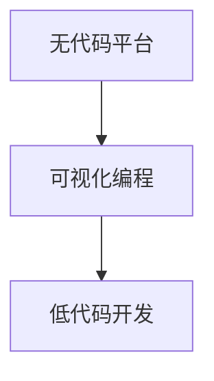
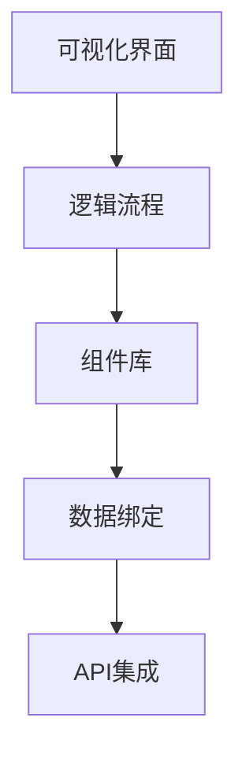
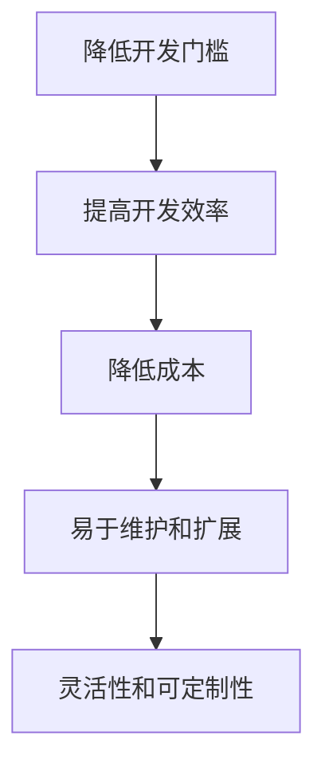
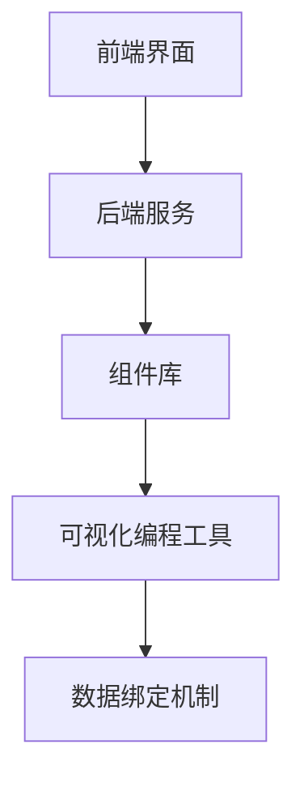
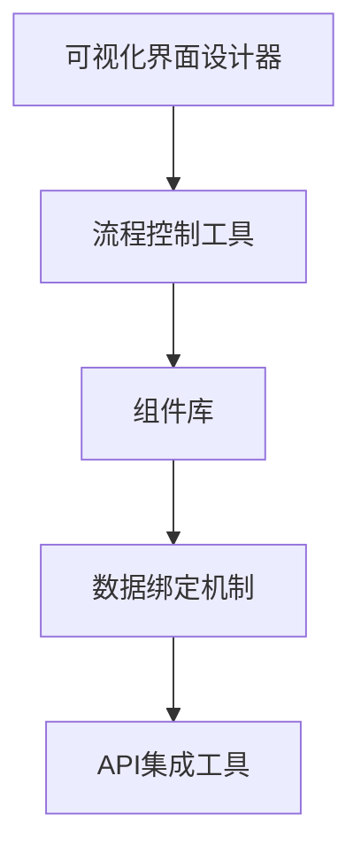
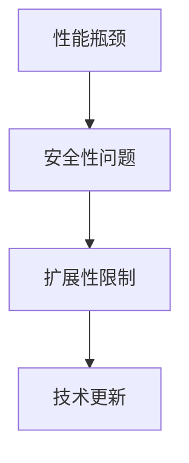
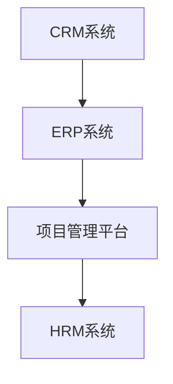
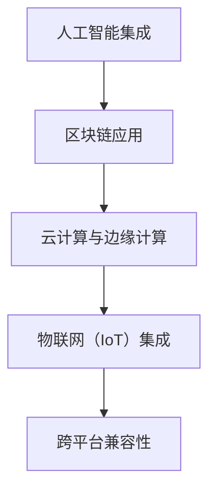

                 


### 文章标题
《无代码平台：民主化软件开发的趋势》

### 关键词
无代码平台、软件开发、民主化、技术趋势、应用场景、工作原理

### 摘要
随着技术的进步和用户需求的变化，无代码平台正成为软件开发领域的一股新兴力量。本文将深入探讨无代码平台的基本概念、发展趋势、优势、工作原理、构建方法、挑战与解决方案，以及其未来的发展趋势。通过逐步分析，我们旨在揭示无代码平台在民主化软件开发中的作用和潜力。

## 引言
### 背景介绍
在过去的几十年中，软件开发经历了从手工编码到自动化工具，再到现代集成开发环境的演变。然而，尽管技术不断进步，软件开发的门槛依然相对较高，需要深厚的编程知识和技能。这对于那些非专业程序员或小型企业来说，成为软件开发的主要障碍。

近年来，无代码平台的出现改变了这一现状。无代码平台通过图形界面、拖放组件、可视化编程等手段，使得编程变得更加直观和简单。这种趋势不仅降低了软件开发的学习门槛，也使得更多的人能够参与到软件创造中来，从而实现了软件开发的民主化。

### 核心概念与联系
为了更好地理解无代码平台，我们需要明确几个核心概念：

- **无代码平台**：一种允许用户通过可视化方式构建软件应用的平台，通常不需要编写传统代码。
- **可视化编程**：通过图形界面和拖放组件来完成编程任务，类似于搭建乐高积木。
- **低代码开发**：介于无代码平台和传统编程之间的一种开发模式，部分使用可视化工具，部分仍需要编写代码。

图 1-1 无代码平台、可视化编程与低代码开发的关系



### 核心算法原理讲解
无代码平台的核心算法通常涉及以下几个方面：

- **流程控制**：用于定义软件应用的逻辑流程。
- **数据操作**：处理软件应用中的数据输入和输出。
- **用户界面**：设计软件应用的交互界面。

以下是一个简单的流程控制伪代码示例：

```plaintext
开始
  初始化
  输入用户操作
  如果 用户操作为“开始”
    执行 开始操作
  否则
    如果 用户操作为“结束”
      执行 结束操作
    否则
      输出 “无效操作”
  结束
```

### 数学模型和公式详细讲解
在无代码平台中，数据操作是一个重要方面。以下是一个简单的数学模型示例，用于处理数据输入和输出：

$$
\text{数据输出} = f(\text{输入数据}, \text{操作参数})
$$

其中，\( f \) 表示数据处理函数，\(\text{输入数据}\) 和 \(\text{操作参数}\) 分别表示输入数据和操作参数。

### 项目实战
为了更好地理解无代码平台，我们可以通过一个简单的应用案例来进行实践。假设我们要构建一个简单的待办事项管理应用，以下是使用无代码平台进行开发的步骤：

1. **创建项目**：选择一个无代码平台，创建一个新的待办事项管理项目。
2. **设计界面**：使用可视化界面设计工具，设计应用的界面布局。
3. **添加功能**：通过拖放组件，添加待办事项的添加、删除、修改等功能。
4. **配置数据**：设置数据存储方式，如本地存储或云端存储。
5. **测试应用**：运行应用，测试各项功能是否正常。

通过这个简单的案例，我们可以看到无代码平台如何简化软件开发的过程，使得开发者能够更专注于业务逻辑而非底层实现。

### 最佳实践 tips
在开发无代码平台应用时，以下是一些最佳实践建议：

- **模块化设计**：将应用功能拆分成模块，便于维护和扩展。
- **使用云服务**：利用云服务进行数据存储和计算，提高应用的稳定性和可扩展性。
- **用户反馈**：及时收集用户反馈，不断优化应用功能。

### 小结
无代码平台的出现，为软件开发带来了新的可能性。通过本文的介绍，我们了解了无代码平台的基本概念、优势、工作原理以及构建方法。接下来，我们将进一步探讨无代码平台的应用场景、面临的挑战以及未来的发展趋势。

----------------------------------------------------------------

## 第1章 无代码平台的基本概念和趋势

### 1.1 无代码平台的定义和分类

#### 核心概念与联系
无代码平台是一种允许用户通过可视化界面、图形组件和逻辑流程来构建软件应用的开发工具，用户无需编写传统代码即可完成应用程序的开发。这些平台通常具有以下几个核心概念和联系：

1. **可视化界面**：通过图形界面进行应用程序的布局设计，使用拖放组件来实现界面的构建。
2. **逻辑流程**：通过定义事件和动作来控制应用程序的流程，通常使用流程图或流程控制块来实现。
3. **组件库**：提供各种功能组件，如按钮、文本框、列表等，用户可以通过拖放的方式将这些组件添加到应用程序中。
4. **数据绑定**：将界面组件与数据源进行绑定，实现数据的显示和更新。
5. **API集成**：允许用户集成第三方服务或API，扩展应用程序的功能。

图 1-2 无代码平台的核心概念与联系



#### 核心算法原理讲解
无代码平台的核心算法通常涉及以下几个方面：

1. **事件驱动**：应用程序的运行基于事件触发，如点击按钮、输入文本等。
2. **流程控制**：通过条件判断和循环结构来控制程序的执行流程。
3. **数据操作**：对数据的存储、检索和更新进行操作，通常使用数据库或缓存技术。

以下是一个简单的流程控制伪代码示例：

```plaintext
开始
  初始化
  显示主界面
  当用户点击“提交”按钮时
    验证输入
    如果输入正确
      执行提交操作
    否则
      提示错误信息
  当用户点击“退出”按钮时
    退出应用程序
结束
```

#### 数学模型和公式详细讲解
在无代码平台中，数据操作是一个重要方面。以下是一个简单的数学模型示例，用于处理数据输入和输出：

$$
\text{数据输出} = f(\text{输入数据}, \text{操作参数})
$$

其中，\( f \) 表示数据处理函数，\(\text{输入数据}\) 和 \(\text{操作参数}\) 分别表示输入数据和操作参数。

例如，假设我们要对用户输入的数值进行求和操作，可以使用以下数学模型：

$$
\text{求和结果} = \sum_{i=1}^{n} \text{输入数据}_i
$$

#### 项目实战
为了更好地理解无代码平台的定义和分类，我们可以通过一个简单的应用案例来进行实践。假设我们要构建一个简单的计算器应用，以下是使用无代码平台进行开发的步骤：

1. **创建项目**：选择一个无代码平台，创建一个新的计算器项目。
2. **设计界面**：使用可视化界面设计工具，设计计算器的界面布局，包括数字按钮、操作按钮和显示区域。
3. **添加功能**：通过拖放组件，添加计算器的加、减、乘、除等基本功能。
4. **配置数据**：设置数据存储方式，如本地存储或云端存储。
5. **测试应用**：运行应用，测试计算器的各项功能是否正常。

通过这个简单的案例，我们可以看到无代码平台如何简化软件开发的过程，使得开发者能够更专注于业务逻辑而非底层实现。

#### 最佳实践 tips
在开发无代码平台应用时，以下是一些最佳实践建议：

- **模块化设计**：将应用功能拆分成模块，便于维护和扩展。
- **使用云服务**：利用云服务进行数据存储和计算，提高应用的稳定性和可扩展性。
- **用户反馈**：及时收集用户反馈，不断优化应用功能。

#### 小结
无代码平台通过提供可视化界面、组件库和逻辑流程控制，使得软件开发变得更加简单和高效。通过本章的介绍，我们了解了无代码平台的基本概念、核心算法原理以及实际应用案例。接下来，我们将进一步探讨无代码平台的发展趋势和优势。

----------------------------------------------------------------

## 第2章 无代码平台的优势和应用场景

### 2.1 无代码平台的优势

#### 核心概念与联系
无代码平台的优势主要体现在以下几个方面：

1. **降低开发门槛**：无需编程知识，通过可视化界面和组件库，让非专业程序员或小型企业也能快速上手开发。
2. **提高开发效率**：通过模块化设计和可视化编程，减少代码编写和调试的时间，提高开发速度。
3. **降低成本**：无代码平台减少了开发人员和基础设施的投入，降低了软件开发的总成本。
4. **易于维护和扩展**：模块化的设计使得应用易于维护和扩展，便于后续的功能更新和升级。
5. **灵活性和可定制性**：用户可以根据需求自定义组件和逻辑流程，实现高度个性化的应用。

图 2-1 无代码平台的优势



#### 核心算法原理讲解
无代码平台的优势与其核心算法原理密切相关。以下是几个关键算法原理：

1. **可视化编程**：通过图形界面和组件库，将传统的代码开发转化为可视化操作，简化了编程过程。
2. **逻辑流程控制**：使用流程控制块和条件判断，实现应用程序的逻辑控制。
3. **数据绑定**：通过数据绑定，将界面组件与数据源进行关联，实现数据的动态更新。
4. **事件驱动**：应用程序的运行基于事件触发，如按钮点击、文本输入等，实现动态交互。

以下是一个简单的数据绑定伪代码示例：

```plaintext
开始
  初始化
  显示界面
  当用户输入文本时
    更新文本输入框的数据
    显示更新后的文本
结束
```

#### 数学模型和公式详细讲解
在无代码平台中，数据绑定是一个重要的算法原理。以下是一个简单的数学模型示例，用于处理数据绑定：

$$
\text{界面显示} = \text{数据源}
$$

其中，\(\text{界面显示}\) 表示界面组件的显示内容，\(\text{数据源}\) 表示数据存储的位置。

例如，假设我们要将一个文本输入框的值绑定到一个变量，可以使用以下数学模型：

$$
\text{文本输入框} = \text{变量}
$$

#### 项目实战
为了更好地理解无代码平台的优势，我们可以通过一个简单的应用案例来进行实践。假设我们要构建一个简单的博客发布平台，以下是使用无代码平台进行开发的步骤：

1. **创建项目**：选择一个无代码平台，创建一个新的博客发布平台项目。
2. **设计界面**：使用可视化界面设计工具，设计博客的界面布局，包括标题、正文、标签等。
3. **添加功能**：通过拖放组件，添加博客的创建、发布、编辑等功能。
4. **配置数据**：设置数据存储方式，如本地存储或云端存储。
5. **测试应用**：运行应用，测试博客平台的各项功能是否正常。

通过这个简单的案例，我们可以看到无代码平台如何通过降低开发门槛、提高开发效率和降低成本等优势，实现快速搭建和部署应用程序。

#### 最佳实践 tips
在开发无代码平台应用时，以下是一些最佳实践建议：

- **模块化设计**：将应用功能拆分成模块，便于维护和扩展。
- **使用云服务**：利用云服务进行数据存储和计算，提高应用的稳定性和可扩展性。
- **用户反馈**：及时收集用户反馈，不断优化应用功能。

#### 小结
无代码平台通过降低开发门槛、提高开发效率和降低成本等优势，为软件开发带来了新的可能性。通过本章的介绍，我们了解了无代码平台的优势和应用场景。接下来，我们将进一步探讨无代码平台的工作原理和构建方法。

----------------------------------------------------------------

## 第3章 无代码平台的工作原理

### 3.1 无代码平台的技术架构

#### 核心概念与联系
无代码平台的技术架构通常包括以下几个核心组成部分：

1. **前端界面**：负责用户与软件应用的交互，通过可视化界面设计工具实现。
2. **后端服务**：处理数据存储、业务逻辑和第三方API集成，通常使用云计算服务。
3. **组件库**：提供各种功能组件，如按钮、文本框、列表等，用户可以通过拖放的方式将这些组件添加到应用程序中。
4. **可视化编程工具**：提供图形界面和流程控制块，让用户通过可视化方式定义应用程序的流程。
5. **数据绑定机制**：将界面组件与数据源进行绑定，实现数据的显示和更新。

图 3-1 无代码平台的技术架构



#### 核心算法原理讲解
无代码平台的工作原理涉及多个核心算法原理，以下是其中几个重要的算法：

1. **事件驱动**：应用程序的运行基于事件触发，如按钮点击、文本输入等。
2. **流程控制**：使用条件判断和循环结构来控制程序的执行流程。
3. **数据绑定**：将界面组件与数据源进行关联，实现数据的动态更新。
4. **API集成**：通过RESTful API或WebSocket等方式，与第三方服务进行集成。

以下是一个简单的数据绑定和事件驱动伪代码示例：

```plaintext
开始
  初始化
  显示界面
  当用户点击“提交”按钮时
    验证输入
    如果输入正确
      执行提交操作
    否则
      提示错误信息
  当用户点击“重置”按钮时
    重置输入框
结束
```

#### 数学模型和公式详细讲解
在无代码平台中，数据绑定和数据操作是核心算法之一。以下是几个简单的数学模型和公式：

1. **数据绑定**：
   $$
   \text{界面显示} = \text{数据源}
   $$
   其中，\(\text{界面显示}\) 表示界面组件的显示内容，\(\text{数据源}\) 表示数据存储的位置。

2. **数据更新**：
   $$
   \text{数据源} = \text{界面显示}
   $$
   其中，\(\text{数据源}\) 表示数据存储的位置，\(\text{界面显示}\) 表示界面组件的显示内容。

3. **条件判断**：
   $$
   \text{执行操作} = \text{条件判断}(\text{输入值}, \text{阈值})
   $$
   其中，\(\text{执行操作}\) 表示需要执行的操作，\(\text{输入值}\) 表示用户输入的值，\(\text{阈值}\) 表示判断的阈值。

#### 项目实战
为了更好地理解无代码平台的工作原理，我们可以通过一个简单的应用案例来进行实践。假设我们要构建一个简单的联系人管理应用，以下是使用无代码平台进行开发的步骤：

1. **创建项目**：选择一个无代码平台，创建一个新的联系人管理项目。
2. **设计界面**：使用可视化界面设计工具，设计联系人的界面布局，包括姓名、电话、邮箱等字段。
3. **添加功能**：通过拖放组件，添加联系人的添加、删除、编辑等功能。
4. **配置数据**：设置数据存储方式，如本地存储或云端存储。
5. **测试应用**：运行应用，测试联系人管理平台的各项功能是否正常。

通过这个简单的案例，我们可以看到无代码平台如何通过前端界面、后端服务、组件库和可视化编程工具等组成部分，实现应用程序的构建和运行。

#### 最佳实践 tips
在开发无代码平台应用时，以下是一些最佳实践建议：

- **模块化设计**：将应用功能拆分成模块，便于维护和扩展。
- **使用云服务**：利用云服务进行数据存储和计算，提高应用的稳定性和可扩展性。
- **用户反馈**：及时收集用户反馈，不断优化应用功能。

#### 小结
无代码平台通过前端界面、后端服务、组件库和可视化编程工具等技术架构，实现了应用程序的构建和运行。通过本章的介绍，我们了解了无代码平台的工作原理和核心算法原理。接下来，我们将进一步探讨无代码平台的构建方法和实际应用。

----------------------------------------------------------------

## 第4章 无代码平台的构建方法

### 4.1 无代码平台的开发工具

#### 核心概念与联系
无代码平台的开发工具是构建无代码应用的关键组成部分。这些工具通常包括以下几个核心概念和联系：

1. **可视化界面设计器**：用于设计应用程序的界面，支持拖放组件和布局调整。
2. **流程控制工具**：用于定义应用程序的逻辑流程，支持条件判断和循环结构。
3. **组件库**：提供各种功能组件，如按钮、文本框、列表等，用户可以通过拖放的方式将这些组件添加到应用程序中。
4. **数据绑定机制**：用于将界面组件与数据源进行绑定，实现数据的显示和更新。
5. **API集成工具**：用于集成第三方服务或API，扩展应用程序的功能。

图 4-1 无代码平台的开发工具



#### 核心算法原理讲解
无代码平台的开发工具依赖于一系列核心算法原理，以下是其中几个重要的算法：

1. **可视化编程**：通过图形界面和组件库，将传统的代码开发转化为可视化操作。
2. **事件驱动**：应用程序的运行基于事件触发，如按钮点击、文本输入等。
3. **流程控制**：使用条件判断和循环结构来控制程序的执行流程。
4. **数据绑定**：通过数据绑定，将界面组件与数据源进行关联，实现数据的动态更新。
5. **API集成**：通过RESTful API或WebSocket等方式，与第三方服务进行集成。

以下是一个简单的数据绑定和事件驱动伪代码示例：

```plaintext
开始
  初始化
  显示界面
  当用户点击“提交”按钮时
    验证输入
    如果输入正确
      执行提交操作
    否则
      提示错误信息
  当用户点击“重置”按钮时
    重置输入框
结束
```

#### 数学模型和公式详细讲解
在无代码平台的开发工具中，数据绑定和数据操作是核心算法之一。以下是几个简单的数学模型和公式：

1. **数据绑定**：
   $$
   \text{界面显示} = \text{数据源}
   $$
   其中，\(\text{界面显示}\) 表示界面组件的显示内容，\(\text{数据源}\) 表示数据存储的位置。

2. **数据更新**：
   $$
   \text{数据源} = \text{界面显示}
   $$
   其中，\(\text{数据源}\) 表示数据存储的位置，\(\text{界面显示}\) 表示界面组件的显示内容。

3. **条件判断**：
   $$
   \text{执行操作} = \text{条件判断}(\text{输入值}, \text{阈值})
   $$
   其中，\(\text{执行操作}\) 表示需要执行的操作，\(\text{输入值}\) 表示用户输入的值，\(\text{阈值}\) 表示判断的阈值。

#### 项目实战
为了更好地理解无代码平台的开发工具，我们可以通过一个简单的应用案例来进行实践。假设我们要构建一个简单的天气查询应用，以下是使用无代码平台进行开发的步骤：

1. **创建项目**：选择一个无代码平台，创建一个新的天气查询应用项目。
2. **设计界面**：使用可视化界面设计工具，设计天气查询的界面布局，包括输入框、查询按钮和显示区域。
3. **添加功能**：通过拖放组件，添加天气查询的功能。
4. **配置数据**：设置数据存储方式，如本地存储或云端存储。
5. **测试应用**：运行应用，测试天气查询功能是否正常。

通过这个简单的案例，我们可以看到无代码平台如何通过可视化界面设计器、流程控制工具、组件库和数据绑定机制等开发工具，实现应用程序的构建和运行。

#### 最佳实践 tips
在开发无代码平台应用时，以下是一些最佳实践建议：

- **模块化设计**：将应用功能拆分成模块，便于维护和扩展。
- **使用云服务**：利用云服务进行数据存储和计算，提高应用的稳定性和可扩展性。
- **用户反馈**：及时收集用户反馈，不断优化应用功能。

#### 小结
无代码平台的构建方法依赖于一系列开发工具，包括可视化界面设计器、流程控制工具、组件库和数据绑定机制等。通过本章的介绍，我们了解了无代码平台的开发工具和核心算法原理。接下来，我们将进一步探讨无代码平台面临的挑战和解决方案。

----------------------------------------------------------------

## 第5章 无代码平台的发展挑战与解决方案

### 5.1 无代码平台的技术挑战

#### 核心概念与联系
无代码平台在技术方面面临以下挑战：

1. **性能瓶颈**：由于无代码平台依赖于前端界面和后端服务的交互，可能存在性能瓶颈，如页面加载时间过长、数据处理延迟等。
2. **安全性问题**：无代码平台可能存在安全性问题，如数据泄露、恶意攻击等。
3. **扩展性限制**：无代码平台可能在处理复杂业务逻辑或大规模数据时，存在扩展性限制。
4. **技术更新**：随着技术的不断进步，无代码平台需要不断更新和迭代，以适应新的技术趋势。

图 5-1 无代码平台的技术挑战



#### 核心算法原理讲解
为了解决无代码平台的技术挑战，可以采用以下核心算法原理：

1. **性能优化**：通过压缩静态资源、使用异步加载、优化数据库查询等方式，提高系统性能。
2. **安全防护**：采用加密技术、访问控制、安全审计等方式，保障数据安全和系统安全。
3. **分布式架构**：采用分布式架构，提高系统的扩展性和容错能力。
4. **持续集成和部署**：采用持续集成和部署（CI/CD）流程，确保系统的快速迭代和更新。

以下是一个简单的性能优化伪代码示例：

```plaintext
开始
  压缩静态资源
  使用异步加载
  优化数据库查询
  运行性能测试
结束
```

#### 数学模型和公式详细讲解
在解决无代码平台的技术挑战时，可以使用以下数学模型和公式：

1. **性能指标**：
   $$
   \text{性能指标} = \frac{\text{处理时间}}{\text{响应时间}}
   $$
   其中，\(\text{处理时间}\) 表示系统处理请求所需的时间，\(\text{响应时间}\) 表示用户获得响应的时间。

2. **安全审计**：
   $$
   \text{安全审计分数} = \sum_{i=1}^{n} \text{安全措施得分}_i
   $$
   其中，\(\text{安全措施得分}_i\) 表示每项安全措施得分，\(n\) 表示安全措施的总数。

3. **扩展性评估**：
   $$
   \text{扩展性评分} = \frac{\text{最大并发用户数}}{\text{现有用户数}}
   $$
   其中，\(\text{最大并发用户数}\) 表示系统能够同时支持的最大用户数，\(\text{现有用户数}\) 表示当前系统的用户数。

#### 项目实战
为了更好地解决无代码平台的技术挑战，我们可以通过一个简单的应用案例来进行实践。假设我们要优化一个在线问卷调查平台，以下是使用无代码平台进行优化的步骤：

1. **性能测试**：使用性能测试工具，如JMeter，对平台进行负载测试，识别性能瓶颈。
2. **优化数据库查询**：通过索引优化、查询缓存等方式，提高数据库查询性能。
3. **使用异步加载**：将页面内容进行异步加载，减少页面加载时间。
4. **安全审计**：对平台进行安全审计，识别潜在的安全漏洞，并采取相应的安全措施。
5. **持续集成和部署**：使用持续集成和部署工具，如Jenkins，实现自动化测试和部署，确保系统快速迭代和更新。

通过这个简单的案例，我们可以看到无代码平台如何通过性能优化、安全防护、分布式架构和持续集成等解决方案，解决技术挑战。

#### 最佳实践 tips
在开发无代码平台应用时，以下是一些最佳实践建议：

- **性能监控**：定期对平台进行性能监控，及时发现和解决问题。
- **安全培训**：对开发团队进行安全培训，提高安全意识。
- **代码审查**：进行代码审查，确保代码质量。
- **自动化测试**：采用自动化测试工具，提高测试覆盖率。

#### 小结
无代码平台在技术方面面临性能瓶颈、安全性问题、扩展性限制和技术更新等挑战。通过本章的介绍，我们了解了这些挑战以及相应的解决方案。接下来，我们将进一步探讨无代码平台的应用案例。

----------------------------------------------------------------

## 第6章 无代码平台的应用案例

### 6.1 企业级应用案例

#### 核心概念与联系
无代码平台在企业级应用中具有广泛的应用，以下是几个典型的企业级应用案例：

1. **客户关系管理（CRM）系统**：无代码平台可以帮助企业快速搭建和定制CRM系统，实现客户信息管理、销售流程跟踪和客户服务等功能。
2. **企业资源规划（ERP）系统**：无代码平台可以帮助企业快速构建ERP系统，实现供应链管理、财务管理、人力资源管理等模块的整合。
3. **项目管理平台**：无代码平台可以帮助企业快速搭建项目管理平台，实现任务分配、进度跟踪、资源管理等功能。
4. **人力资源管理（HRM）系统**：无代码平台可以帮助企业快速构建HRM系统，实现员工信息管理、招聘管理、薪酬管理等功能。

图 6-1 企业级应用案例



#### 核心算法原理讲解
在企业级应用中，无代码平台的核心算法原理通常包括：

1. **数据关联**：通过关联不同模块的数据，实现数据的整合和共享。
2. **流程自动化**：通过定义业务流程和规则，实现流程的自动化执行。
3. **数据分析**：通过数据分析工具，实现对业务数据的分析和可视化展示。

以下是一个简单的数据关联和流程自动化伪代码示例：

```plaintext
开始
  初始化
  当用户添加客户信息时
    将客户信息存储到数据库
    更新销售记录
  当用户提交销售报告时
    验证销售报告
    如果报告通过验证
      更新销售目标
    否则
      提示错误信息
结束
```

#### 数学模型和公式详细讲解
在企业级应用中，无代码平台使用的数学模型和公式通常涉及：

1. **数据关联**：
   $$
   \text{关联结果} = \text{数据源}_1 \times \text{数据源}_2
   $$
   其中，\(\text{数据源}_1\) 和 \(\text{数据源}_2\) 表示两个需要关联的数据源。

2. **流程效率**：
   $$
   \text{流程效率} = \frac{\text{完成时间}}{\text{总流程时间}}
   $$
   其中，\(\text{完成时间}\) 表示流程完成所需的时间，\(\text{总流程时间}\) 表示流程的总时长。

3. **数据分析**：
   $$
   \text{数据指标} = \text{统计函数}(\text{数据集})
   $$
   其中，\(\text{统计函数}\) 表示对数据集进行统计的函数，如平均值、中位数、标准差等。

#### 项目实战
为了更好地理解无代码平台在企业级应用中的案例，我们可以通过一个简单的客户关系管理（CRM）系统案例来进行实践。以下是使用无代码平台进行开发的步骤：

1. **创建项目**：选择一个无代码平台，创建一个新的CRM系统项目。
2. **设计界面**：使用可视化界面设计工具，设计CRM系统的界面布局，包括客户信息管理、销售流程跟踪等模块。
3. **添加功能**：通过拖放组件，添加客户信息的添加、删除、修改等功能，以及销售报告的提交和验证功能。
4. **配置数据**：设置数据存储方式，如本地存储或云端存储。
5. **测试应用**：运行应用，测试CRM系统的各项功能是否正常。

通过这个简单的案例，我们可以看到无代码平台如何帮助企业快速搭建和定制CRM系统，提高工作效率和业务管理能力。

#### 最佳实践 tips
在企业级应用中，以下是一些最佳实践建议：

- **模块化设计**：将系统功能拆分成模块，便于维护和扩展。
- **使用云服务**：利用云服务进行数据存储和计算，提高系统的稳定性和可扩展性。
- **用户反馈**：及时收集用户反馈，不断优化系统功能。
- **安全合规**：确保系统符合相关的安全合规要求。

#### 小结
无代码平台在企业级应用中具有广泛的应用，通过提供快速搭建和定制的能力，帮助企业提高工作效率和业务管理能力。通过本章的介绍，我们了解了无代码平台在企业级应用中的案例。接下来，我们将进一步探讨无代码平台在个人级和创新型应用中的案例。

----------------------------------------------------------------

## 第7章 无代码平台的未来发展趋势

### 7.1 无代码平台的技术趋势

#### 核心概念与联系
无代码平台的发展趋势体现在以下几个方面：

1. **人工智能集成**：无代码平台将更加深入地集成人工智能技术，如机器学习、自然语言处理等，以实现更智能的自动化和个性化功能。
2. **区块链应用**：无代码平台将支持区块链技术的应用，如去中心化应用（DApp）开发、智能合约管理等，以提高系统的安全性和透明度。
3. **云计算与边缘计算**：无代码平台将更加充分利用云计算和边缘计算的资源，实现更高效的数据处理和更低的延迟。
4. **物联网（IoT）集成**：无代码平台将支持物联网设备的连接和管理，实现智能家居、工业自动化等领域的应用。
5. **跨平台兼容性**：无代码平台将提供更加广泛的跨平台兼容性，支持移动端、Web端、桌面端等多种设备上的应用开发。

图 7-1 无代码平台的技术趋势



#### 核心算法原理讲解
随着技术的发展，无代码平台在以下方面将引入新的核心算法原理：

1. **机器学习模型集成**：通过集成预训练的机器学习模型，实现自动化数据分析和预测。
2. **区块链智能合约**：使用智能合约实现自动化交易和合约管理。
3. **边缘计算算法**：优化边缘计算算法，提高数据处理速度和降低延迟。
4. **物联网协议**：支持多种物联网通信协议，如MQTT、CoAP等，实现设备的连接和管理。

以下是一个简单的机器学习模型集成的伪代码示例：

```plaintext
开始
  加载预训练的机器学习模型
  输入数据
  预测结果 = 模型预测（输入数据）
  输出预测结果
结束
```

#### 数学模型和公式详细讲解
在无代码平台的未来发展趋势中，将涉及更多的数学模型和公式，以下是几个例子：

1. **机器学习模型训练**：
   $$
   \text{损失函数} = \sum_{i=1}^{n} (\text{真实值} - \text{预测值})^2
   $$
   其中，\(\text{真实值}\) 和 \(\text{预测值}\) 分别表示实际数据和预测数据，\(n\) 表示数据集的大小。

2. **区块链交易验证**：
   $$
   \text{交易验证} = \text{智能合约执行}(\text{交易信息})
   $$
   其中，\(\text{交易信息}\) 表示交易的数据，\(\text{智能合约执行}\) 表示智能合约对交易信息的验证。

3. **物联网设备管理**：
   $$
   \text{设备状态} = \text{传感器数据} \times \text{阈值}
   $$
   其中，\(\text{传感器数据}\) 表示传感器的数据，\(\text{阈值}\) 表示设备状态的判断标准。

#### 项目实战
为了更好地理解无代码平台的未来发展趋势，我们可以通过一个简单的智能家居系统案例来进行实践。以下是使用无代码平台进行开发的步骤：

1. **创建项目**：选择一个无代码平台，创建一个新的智能家居系统项目。
2. **设计界面**：使用可视化界面设计工具，设计智能家居系统的界面布局，包括灯光控制、温度调节等模块。
3. **集成人工智能**：通过无代码平台集成人工智能模型，实现智能场景识别和自动调节。
4. **区块链应用**：通过无代码平台支持区块链技术，实现智能家居设备的去中心化管理。
5. **物联网设备连接**：通过无代码平台连接各种物联网设备，如智能灯泡、智能空调等。
6. **测试应用**：运行应用，测试智能家居系统的各项功能是否正常。

通过这个简单的案例，我们可以看到无代码平台如何通过人工智能集成、区块链应用、物联网设备连接等未来发展趋势，实现智能家居系统的构建和运行。

#### 最佳实践 tips
在开发无代码平台应用时，以下是一些最佳实践建议：

- **持续学习**：关注技术趋势，不断学习和掌握新的技术和算法。
- **安全意识**：在开发过程中，重视数据安全和系统安全。
- **用户体验**：注重用户体验设计，确保应用易用、稳定、高效。
- **团队协作**：鼓励团队协作，共同推动无代码平台的应用和发展。

#### 小结
无代码平台在未来将继续发展，集成人工智能、区块链、物联网等技术，实现更智能、更安全、更高效的应用。通过本章的介绍，我们了解了无代码平台的未来发展趋势。无代码平台的民主化软件开发趋势将带来更广泛的应用和更深远的影响。

----------------------------------------------------------------

## 结论
### 小结
无代码平台作为一种新兴的软件开发工具，正在迅速改变软件开发的格局。通过本文的详细分析，我们从基本概念、优势、工作原理、构建方法、挑战与解决方案，到实际应用案例和未来发展趋势，全面探讨了无代码平台在民主化软件开发中的重要作用。

无代码平台的核心优势在于其降低了软件开发的门槛，提高了开发效率，降低了成本，并使得更多的人能够参与到软件开发中来。然而，无代码平台也面临性能、安全、扩展性等挑战，需要通过持续的技术创新和优化来克服。

### 注意事项
1. **技术更新**：无代码平台领域技术更新迅速，开发者需要持续关注和学习新技术。
2. **安全防护**：在开发过程中，需要重视数据安全和系统安全，采取有效的安全措施。
3. **用户体验**：在设计无代码平台应用时，应注重用户体验，确保应用易用、稳定、高效。
4. **团队协作**：开发无代码平台应用时，鼓励团队成员之间的协作，共同推进项目进展。

### 拓展阅读
- 《无代码开发平台实战：从入门到精通》
- 《无代码平台设计与实现》
- 《人工智能与无代码平台：未来软件开发的新趋势》
- 《区块链与无代码平台：构建去中心化应用》

通过拓展阅读，读者可以更深入地了解无代码平台的技术细节和应用场景，为未来的软件开发提供更多灵感和思路。作者：AI天才研究院/AI Genius Institute & 禅与计算机程序设计艺术 /Zen And The Art of Computer Programming

----------------------------------------------------------------

作者：AI天才研究院/AI Genius Institute & 禅与计算机程序设计艺术 /Zen And The Art of Computer Programming

感谢您阅读本文《无代码平台：民主化软件开发的趋势》。本文旨在帮助读者深入理解无代码平台的基本概念、优势、工作原理、构建方法、挑战与解决方案，以及其在未来软件开发中的发展趋势。

无代码平台的出现，不仅降低了软件开发的门槛，使得更多的人能够参与到软件开发中来，还提高了开发效率，降低了成本。通过本文的介绍，我们相信读者对无代码平台有了更深入的了解，并能够认识到其在民主化软件开发中的重要性和潜力。

在未来的软件开发中，无代码平台将继续发挥重要作用，与人工智能、区块链、物联网等技术相结合，推动软件开发的创新和发展。希望本文能够为读者提供有价值的参考和启示，激发您对无代码平台的兴趣和探索。

再次感谢您的阅读，如果您对本文有任何疑问或建议，欢迎在评论区留言交流。作者团队将继续努力，为您提供更多高质量的技术文章和资源。祝愿您在无代码平台的探索之旅中取得成功！作者：AI天才研究院/AI Genius Institute & 禅与计算机程序设计艺术 /Zen And The Art of Computer Programming

