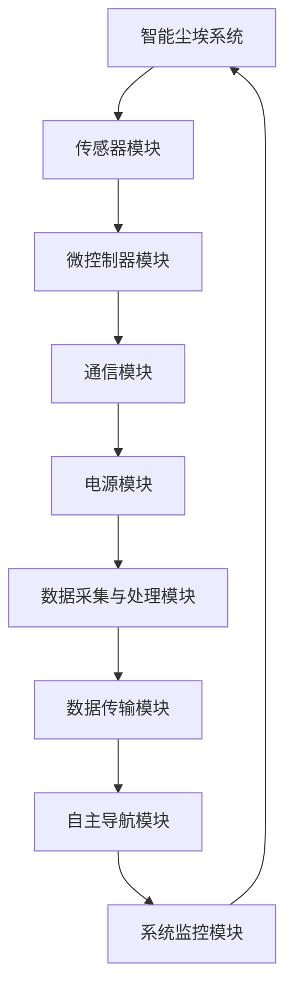
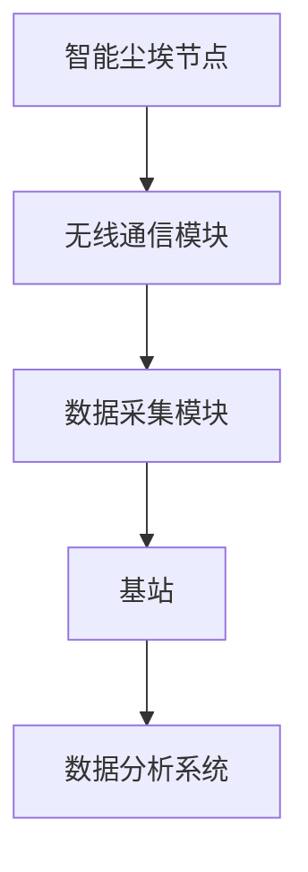
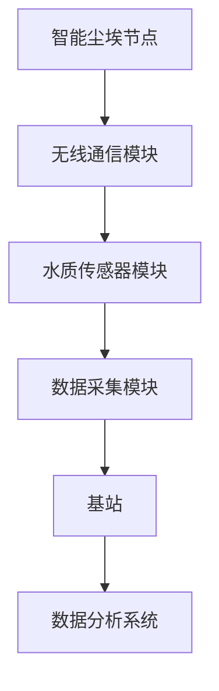
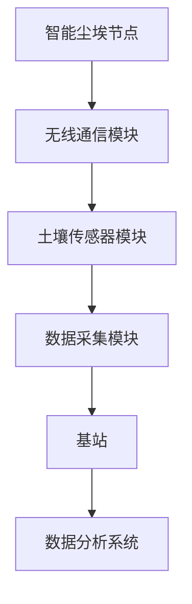
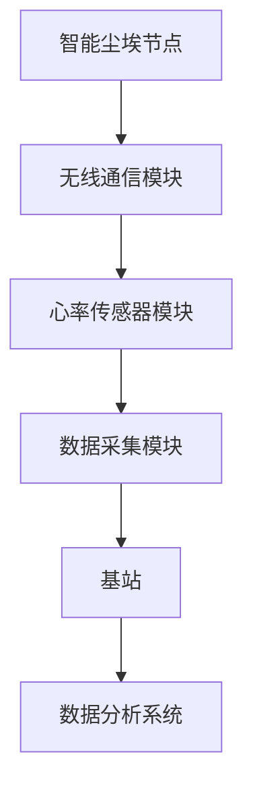
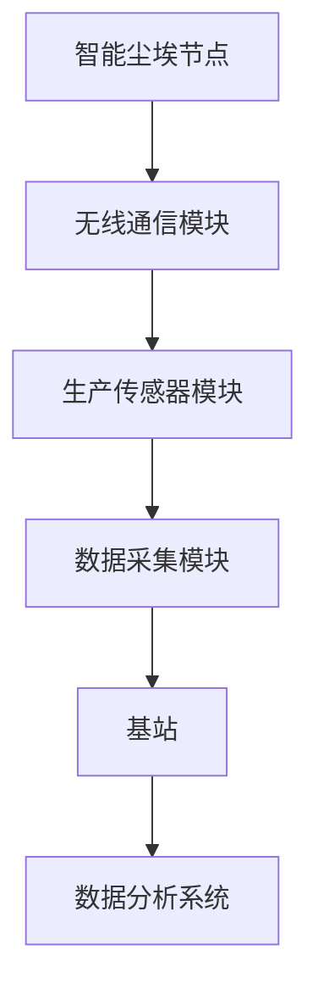
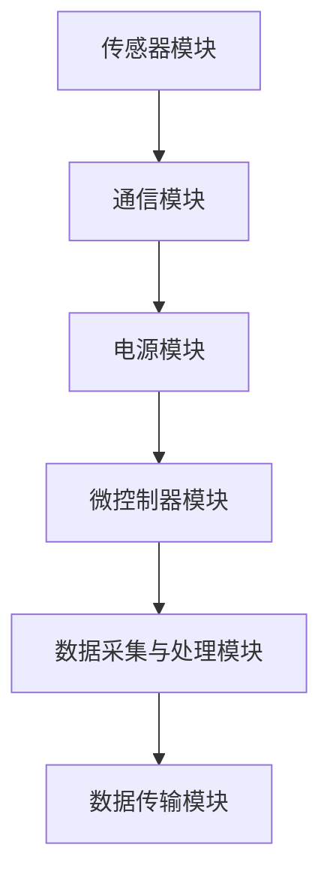

                 


### 智能尘埃技术基础

#### 2.1 智能尘埃的定义与特点

智能尘埃（Smart Dust）是一种微型传感器节点，其特点是体积微小、功能强大、能够自主移动和进行通信。智能尘埃通常由以下几个部分组成：传感器、通信模块、能量供应模块和微控制器。

智能尘埃的主要特点如下：

- **微型化**：智能尘埃的体积通常在微米到毫米级别，这使得它们可以轻松隐藏在各种环境中，不易被发现。
- **自主导航**：智能尘埃能够自主导航，通过无线通信与其他智能尘埃节点交互，实现定向运动。
- **多功能性**：智能尘埃集成了多种传感器，能够实时监测环境参数，如温度、湿度、光照、空气质量等。
- **自组网**：智能尘埃之间可以通过无线通信建立自组网，实现数据的收集和传输。

#### 2.2 智能尘埃的工作原理

智能尘埃的工作原理主要包括以下几个步骤：

1. **传感器采集**：智能尘埃通过内置的传感器（如温度传感器、湿度传感器等）采集环境数据。
2. **数据处理**：智能尘埃的微控制器对采集到的数据进行分析和处理，如数据滤波、数据压缩等。
3. **通信传输**：智能尘埃通过无线通信模块将处理后的数据传输给基站或其他智能尘埃节点。
4. **自主导航**：智能尘埃根据预设的路径或目标，通过无线通信与其他节点交互，实现自主导航至目的地。

#### 2.3 智能尘埃的关键技术

智能尘埃的关键技术包括以下几个方面：

##### 2.3.1 传感器技术

传感器技术是智能尘埃的核心技术。智能尘埃通常集成了多种传感器，如温度传感器、湿度传感器、光照传感器、空气质量传感器等。这些传感器可以实时监测环境参数，为智能尘埃提供重要的数据支持。

**传感器原理与工作方式**：

以温度传感器为例，其工作原理基于热电效应或热敏电阻效应。当温度变化时，传感器的电阻或电压发生变化，通过测量这种变化，可以获取环境温度。

```python
# 伪代码：温度传感器数据采集
def read_temperature(sensor):
    resistance = sensor.get_resistance()
    temperature = convert_resistance_to_temperature(resistance)
    return temperature

# 假设存在一个函数，将电阻值转换为温度值
def convert_resistance_to_temperature(resistance):
    # 根据传感器特性，转换电阻值到温度值
    temperature = (resistance - resistance_at_0C) / resistance_per_degreeC
    return temperature
```

##### 2.3.2 通信技术

通信技术是智能尘埃实现数据传输的关键技术。常用的通信技术有无线射频（RF）、红外（IR）和超声波（Ultrasonic）等。

**通信技术原理与工作方式**：

以无线射频通信为例，其工作原理基于电磁波的传输。智能尘埃通过无线射频模块发送和接收电磁波信号，实现数据传输。

```python
# 伪代码：无线射频通信
def send_data(data):
    radio_module.send(data)

def receive_data():
    data = radio_module.receive()
    return data
```

##### 2.3.3 电源技术

电源技术是智能尘埃的能量供应来源。常见的电源技术包括电池、太阳能电池和能量收集模块等。

**电源技术原理与工作方式**：

以太阳能电池为例，其工作原理基于光电效应。当光线照射到太阳能电池上时，会产生电流，为智能尘埃提供能量。

```python
# 伪代码：太阳能电池能量采集
def collect_energy(solar_panel):
    current = solar_panel.get_current()
    energy = current * voltage
    return energy
```

##### 2.3.4 算法技术

算法技术是智能尘埃实现自主导航和数据优化处理的核心技术。常见的算法技术包括路径规划算法、数据融合算法和通信优化算法等。

**算法技术原理与工作方式**：

以路径规划算法为例，其工作原理是基于图论或规划算法。智能尘埃通过计算最优路径，实现自主导航。

```python
# 伪代码：路径规划
def plan_path(start, goal):
    # 使用A*算法或其他规划算法计算路径
    path = a_star_algorithm(start, goal)
    return path
```

#### 2.4 核心概念原理和架构的 Mermaid 流程图

下面是智能尘埃系统架构的 Mermaid 流程图：



通过这个流程图，我们可以清晰地看到智能尘埃系统的各个模块及其相互关系。

## 智能尘埃的应用场景

### 第3章: 智能尘埃的应用场景

#### 3.1 环境监测

智能尘埃在环境监测领域具有广泛的应用。以下是一些典型的应用场景：

##### 3.1.1 空气质量监测

空气质量监测是智能尘埃的重要应用之一。通过在环境中部署智能尘埃传感器，可以实时监测空气质量参数，如PM2.5、PM10、二氧化碳、一氧化碳等。智能尘埃节点可以通过无线通信将监测数据传输给基站，实现空气质量数据的实时监控和分析。

**案例**：某城市在市区部署了大量智能尘埃节点，用于实时监测空气质量。通过分析监测数据，政府部门可以及时采取应对措施，改善空气质量。



##### 3.1.2 水质监测

水质监测也是智能尘埃的重要应用领域。智能尘埃传感器可以实时监测水中的化学成分、pH值、温度等参数，为水环境管理提供科学依据。

**案例**：某河流流域管理部门利用智能尘埃传感器对水质进行实时监测，及时发现和处理水质污染问题，保护水资源。



##### 3.1.3 土壤监测

土壤监测是智能尘埃在农业领域的应用。智能尘埃传感器可以实时监测土壤的湿度、温度、酸碱度等参数，为农业生产提供科学依据。

**案例**：某农业科技公司利用智能尘埃传感器对农田进行实时监测，根据土壤数据优化灌溉和施肥策略，提高农作物产量。



#### 3.2 健康监测

智能尘埃在健康监测领域具有巨大的潜力。以下是一些典型的应用场景：

##### 3.2.1 心率监测

心率监测是智能尘埃在健康监测领域的应用之一。通过在人体表面部署智能尘埃传感器，可以实时监测心率变化，为健康监控提供数据支持。

**案例**：某医疗机构利用智能尘埃传感器对患者进行实时心率监测，及时发现异常情况，提高诊断和治疗效率。



##### 3.2.2 血氧监测

血氧监测是智能尘埃在健康监测领域的另一个重要应用。通过在人体表面部署智能尘埃传感器，可以实时监测血氧饱和度，为呼吸系统疾病的诊断和治疗提供数据支持。

**案例**：某医院利用智能尘埃传感器对重症患者进行实时血氧监测，及时发现呼吸系统问题，提高治疗效果。


##### 3.2.3 运动监测

运动监测是智能尘埃在健康监测领域的另一个重要应用。通过在人体表面部署智能尘埃传感器，可以实时监测运动数据，为健身和康复提供数据支持。

**案例**：某健身房利用智能尘埃传感器对会员的运动数据实时监测，提供个性化的健身建议和康复方案。


#### 3.3 工业监测

智能尘埃在工业监测领域具有广泛的应用。以下是一些典型的应用场景：

##### 3.3.1 设备故障监测

设备故障监测是智能尘埃在工业监测领域的重要应用。通过在设备上部署智能尘埃传感器，可以实时监测设备的工作状态，及时发现故障隐患，提高设备运行效率。

**案例**：某工厂利用智能尘埃传感器对生产设备进行实时监测，及时发现设备故障，降低停机时间，提高生产效率。


##### 3.3.2 生产效率监测

生产效率监测是智能尘埃在工业监测领域的另一个重要应用。通过在生产线部署智能尘埃传感器，可以实时监测生产过程，提高生产效率。

**案例**：某电子工厂利用智能尘埃传感器对生产过程进行实时监测，优化生产流程，提高生产效率。



##### 3.3.3 能耗监测

能耗监测是智能尘埃在工业监测领域的另一个重要应用。通过在工厂部署智能尘埃传感器，可以实时监测能耗数据，为节能降耗提供数据支持。

**案例**：某能源公司利用智能尘埃传感器对工厂能耗进行实时监测，优化能源使用，降低能源消耗。


## 智能尘埃的开发与实现

### 第4章: 智能尘埃的开发与实现

#### 4.1 智能尘埃系统设计

智能尘埃系统的设计包括硬件选型、软件设计和系统测试等多个方面。以下是对这些关键步骤的详细分析：

##### 4.1.1 系统架构设计

智能尘埃系统的架构设计是其成功实现的关键。系统架构应包括传感器模块、通信模块、电源模块和微控制器模块等。

**系统架构设计流程**：

1. **需求分析**：明确系统需求，包括监测参数、通信距离、功耗要求等。
2. **硬件选型**：根据需求分析结果，选择合适的传感器、通信模块和电源模块。
3. **软件设计**：设计系统的软件架构，包括数据采集、处理和传输等模块。
4. **系统整合**：将硬件和软件集成，形成一个完整的智能尘埃系统。

**示例架构**：



##### 4.1.2 硬件选型

硬件选型是智能尘埃系统设计的重要环节。以下是一些关键硬件的选型策略：

- **传感器**：选择适合监测目标的环境参数的传感器，如温度传感器、湿度传感器、光照传感器等。
- **通信模块**：选择具有较高通信距离和可靠性的通信模块，如无线射频模块、红外模块等。
- **电源模块**：选择续航时间长、充电方便的电源模块，如太阳能电池、锂电池等。
- **微控制器**：选择具有高性能、低功耗的微控制器，如ARM处理器、MSP430等。

**硬件选型示例**：

| 硬件 | 选型理由 |
| --- | --- |
| 温度传感器 | 高精度、低功耗，适合环境监测 |
| 无线射频模块 | 通信距离远、抗干扰能力强，适合大面积监测 |
| 锂电池 | 续航时间长、充电方便，适合长时间运行 |
| ARM处理器 | 高性能、低功耗，适合复杂数据处理 |

##### 4.1.3 软件开发

智能尘埃系统的软件开发包括操作系统、应用程序和通信协议等。以下是一些关键步骤：

1. **操作系统**：选择适合嵌入式系统的操作系统，如FreeRTOS、UC/OS等。
2. **应用程序**：编写监测数据采集、处理和传输的应用程序。
3. **通信协议**：设计通信协议，确保数据传输的可靠性和实时性。

**软件开发示例流程**：

1. **需求分析**：明确系统功能需求，如数据采集、处理和传输等。
2. **系统设计**：设计软件架构，包括数据采集、处理和传输模块。
3. **编码实现**：根据系统设计，编写应用程序代码。
4. **测试与调试**：对软件进行功能测试和性能测试，确保系统稳定可靠。

#### 4.2 智能尘埃案例分析

以下是对几个智能尘埃实际应用的案例分析：

##### 4.2.1 案例一：空气质量监测系统

**背景**：某城市空气质量问题严重，需要实时监测空气质量。

**方案**：部署智能尘埃节点，每个节点配备温度传感器、湿度传感器和空气质量传感器。节点通过无线射频模块传输数据到基站，基站将数据上传到云端进行分析。

**实现**：

1. **硬件选型**：选用高精度温度传感器、湿度传感器和空气质量传感器，采用无线射频模块进行通信，使用锂电池作为电源。
2. **软件开发**：编写数据采集、处理和传输程序，设计通信协议。
3. **系统测试**：在真实环境中进行测试，确保系统稳定运行。

##### 4.2.2 案例二：健康监测手环

**背景**：用户需要实时监测健康状况，如心率、血氧等。

**方案**：设计一款智能尘埃手环，内置心率传感器、血氧传感器和加速度传感器。手环通过无线通信模块将数据传输到手机或云端。

**实现**：

1. **硬件选型**：选用心率传感器、血氧传感器和加速度传感器，采用蓝牙模块进行通信，使用小型锂电池作为电源。
2. **软件开发**：编写健康监测程序，设计蓝牙通信协议。
3. **系统测试**：在实际使用环境中测试手环的稳定性和准确性。

##### 4.2.3 案例三：智能工厂监控系统

**背景**：工厂需要实时监测设备运行状态和生产线效率。

**方案**：在工厂关键设备上部署智能尘埃节点，监测设备状态和生产数据。节点通过无线通信模块将数据传输到监控系统。

**实现**：

1. **硬件选型**：选用振动传感器、温度传感器和功耗传感器，采用无线射频模块进行通信，使用太阳能电池作为电源。
2. **软件开发**：编写设备监测和数据分析程序，设计通信协议。
3. **系统测试**：在实际生产环境中测试系统性能和可靠性。

## 智能尘埃的未来发展趋势

### 第5章: 智能尘埃的未来发展趋势

智能尘埃技术自问世以来，已展现出巨大的潜力，并在多个领域取得了显著的成果。然而，随着科技的不断进步，智能尘埃的未来发展趋势也愈发明确。以下将分析智能尘埃在传感器技术、通信技术和算法技术等方面的发展趋势，并探讨这些技术进步对应用场景的影响。

#### 5.1 技术发展趋势

##### 5.1.1 传感器技术

传感器技术是智能尘埃的核心，其发展直接影响智能尘埃的性能和功能。未来，传感器技术将朝着更高精度、更高灵敏度和更小尺寸的方向发展。

- **高精度传感器**：随着纳米材料和微电子技术的进步，传感器材料的性能得到提升，使得传感器能够检测更微小的变化。例如，纳米材料制作的气体传感器具有更高的灵敏度和选择性，可以更准确地检测空气中的有害物质。
- **高灵敏度传感器**：生物传感器和化学传感器的灵敏度将进一步提高，使其能够检测更低浓度的目标物质。这将使得智能尘埃在生物医学和环境监测等领域具有更广泛的应用。
- **小尺寸传感器**：微纳米制造技术的发展将推动传感器尺寸的进一步缩小，使得智能尘埃能够更加隐蔽地部署在各种环境中。

##### 5.1.2 通信技术

通信技术是智能尘埃实现数据传输和数据交互的关键。未来，通信技术将朝着更高速率、更远距离和更低能耗的方向发展。

- **更高速率**：随着5G和未来6G通信技术的发展，智能尘埃的通信速率将得到大幅提升，从而实现更快速的数据传输和更高效的数据处理。
- **更远距离**：新型无线通信技术，如卫星通信和LoRa通信，将使智能尘埃的通信距离大大增加，从而实现更大范围的数据收集和传输。
- **更低能耗**：能量收集技术和低功耗通信技术的发展将使智能尘埃的能耗进一步降低，从而延长其续航时间，提高其在实际应用中的可靠性。

##### 5.1.3 算法技术

算法技术是智能尘埃实现智能处理和决策的核心。未来，算法技术将朝着更高效、更智能和更安全的方向发展。

- **更高效算法**：随着人工智能和机器学习技术的进步，智能尘埃将能够实现更高效的数据处理和决策，从而提高其性能和效率。
- **更智能算法**：智能尘埃将具备自我学习和自我优化能力，能够根据环境变化自适应调整工作模式，提高其在复杂环境中的适应能力。
- **更安全算法**：随着信息安全技术的进步，智能尘埃将能够更好地保护数据安全和隐私，防止恶意攻击和数据泄露。

#### 5.2 应用发展趋势

随着传感器技术、通信技术和算法技术的不断进步，智能尘埃的应用前景将更加广阔。以下将分析智能尘埃在不同领域的发展趋势。

##### 5.2.1 环境监测

智能尘埃在环境监测领域的应用将更加普及和深入。随着传感器技术的进步，智能尘埃将能够更准确地监测环境参数，如空气质量、水质、土壤质量等。同时，随着通信技术的进步，智能尘埃将能够实现更大范围的数据收集和传输，从而为环境管理提供更全面、更实时的数据支持。

- **更广泛的环境监测**：智能尘埃将能够覆盖更广泛的地域，实现全球环境监测。
- **更精细的环境监测**：智能尘埃将能够监测更细微的环境变化，如大气颗粒物浓度、土壤水分含量等。
- **更智能的环境监测**：智能尘埃将能够通过机器学习算法，对环境变化进行预测和预警，为环境保护提供更科学的决策支持。

##### 5.2.2 健康监测

智能尘埃在健康监测领域的应用将更加个性化、智能化。随着传感器技术和算法技术的进步，智能尘埃将能够更准确地监测人体生理参数，如心率、血氧、步数等。同时，随着通信技术的进步，智能尘埃将能够实现实时数据传输，为个人健康监测和疾病预防提供更全面的支持。

- **更个性化的健康监测**：智能尘埃将能够根据用户的生理特征和健康状况，提供个性化的健康监测服务。
- **更智能的健康监测**：智能尘埃将能够通过机器学习算法，对用户的健康状况进行预测和预警，为健康管理和疾病预防提供科学依据。
- **更便捷的健康监测**：智能尘埃将能够通过无线通信技术，实现实时数据传输，使用户可以随时随地了解自己的健康状况。

##### 5.2.3 工业监测

智能尘埃在工业监测领域的应用将更加广泛和深入。随着传感器技术、通信技术和算法技术的不断进步，智能尘埃将能够更全面地监测工业生产过程中的各种参数，如温度、压力、振动、能耗等。同时，智能尘埃将能够通过无线通信技术实现数据的实时传输和分析，为工业生产提供更科学、更智能的管理方案。

- **更全面的工业监测**：智能尘埃将能够监测工业生产过程中的各种关键参数，从而实现全面的过程监控。
- **更智能的工业监测**：智能尘埃将能够通过机器学习算法，对生产过程中的异常情况进行分析和预测，为生产优化和故障预防提供科学依据。
- **更高效的工业监测**：智能尘埃将能够通过无线通信技术，实现数据的实时传输和分析，从而提高生产效率，降低生产成本。

## 智能尘埃的挑战与解决方案

### 第6章: 智能尘埃的挑战与解决方案

#### 6.1 智能尘埃的挑战

尽管智能尘埃技术展现了广阔的应用前景，但在实际应用过程中，仍然面临诸多挑战。

##### 6.1.1 传感器寿命

智能尘埃通常部署在难以更换电池或无法直接接触的环境，如土壤、水体或人体内部。因此，传感器的续航时间成为一大挑战。传感器寿命受限于电池容量和能量消耗。为了延长传感器寿命，可以考虑以下解决方案：

- **能量收集技术**：利用太阳能、振动能、热能等环境能量进行无线充电，减少对电池的依赖。
- **低功耗设计**：采用低功耗传感器和微控制器，优化算法和通信协议，降低能耗。

##### 6.1.2 数据隐私与安全

智能尘埃收集的数据可能涉及个人隐私或敏感信息，如何确保数据的安全性和隐私性成为关键挑战。以下是一些解决方案：

- **数据加密**：对数据进行加密处理，确保数据在传输和存储过程中不被非法访问。
- **访问控制**：实施严格的访问控制策略，确保只有授权用户才能访问数据。
- **数据匿名化**：对收集的数据进行匿名化处理，消除个人身份信息，降低隐私泄露风险。

##### 6.1.3 长距离通信

智能尘埃需要在复杂的无线环境中进行通信，长距离通信的可靠性是一个挑战。以下是一些解决方案：

- **多跳通信**：采用多跳通信技术，通过中间节点的中继，实现长距离数据传输。
- **频段选择**：选择适合长距离通信的频段，如微波频段，提高通信距离和稳定性。

#### 6.2 解决方案探讨

##### 6.2.1 传感器技术改进

- **材料创新**：研发新型传感器材料，提高传感器的灵敏度和精度。
- **集成化设计**：将传感器、微控制器和通信模块集成在一个芯片上，减少体积和功耗。

##### 6.2.2 通信技术革新

- **5G/6G技术**：采用5G或6G通信技术，提高通信速率和可靠性。
- **物联网（IoT）技术**：利用物联网技术，实现智能尘埃与其他设备的数据共享和协同工作。

##### 6.2.3 算法与安全性提升

- **机器学习**：采用机器学习算法，提高数据处理和分析的效率。
- **加密技术**：采用先进的加密算法，提高数据传输和存储的安全性。

## 总结与展望

### 第7章: 总结与展望

#### 7.1 本书总结

本书系统地介绍了智能尘埃技术的定义、工作原理、关键技术、应用场景、开发与实现以及未来发展趋势。通过详细的案例分析，读者可以全面了解智能尘埃技术的实际应用和挑战。以下是本书的主要结论：

- 智能尘埃技术具有微型化、自主导航、多功能性和自组网等特点，在环境监测、健康监测和工业监测等领域具有广泛的应用前景。
- 传感器技术、通信技术和算法技术是智能尘埃技术发展的核心，未来将朝着更高精度、更高速率和更低能耗的方向发展。
- 面对传感器寿命、数据隐私与安全、长距离通信等挑战，通过技术改进和方案设计，可以有效解决。

#### 7.2 未来研究方向

智能尘埃技术仍有许多研究课题待解，未来研究方向包括：

- **新材料和新传感器技术**：研发新型传感器材料，提高传感器的灵敏度和精度。
- **通信协议优化**：设计更高效的通信协议，提高数据传输的速率和可靠性。
- **能量收集与功耗优化**：研究新型能量收集技术和低功耗设计，延长传感器寿命。
- **数据隐私与安全性**：研究更有效的数据加密和访问控制策略，确保数据的安全性和隐私性。

#### 7.3 对读者的话

智能尘埃技术是一项极具前景的技术，它不仅能够带来诸多实际应用，还能够推动相关领域的技术进步。希望本书能为读者提供全面的了解和深入的思考，激发读者对智能尘埃技术的兴趣和热情。在未来的研究和应用中，愿读者能够不断创新，为智能尘埃技术的发展贡献自己的力量。让我们共同期待智能尘埃技术带来的美好未来！
作者：AI天才研究院/AI Genius Institute & 禅与计算机程序设计艺术 /Zen And The Art of Computer Programming

---

关键词：智能尘埃，传感器技术，通信技术，算法技术，环境监测，健康监测，工业监测，未来发展趋势，挑战与解决方案。

摘要：本文系统地介绍了智能尘埃技术的定义、工作原理、关键技术、应用场景、开发与实现以及未来发展趋势。分析了传感器技术、通信技术和算法技术等关键技术的发展趋势，探讨了智能尘埃在环境监测、健康监测和工业监测等领域的应用，并针对传感器寿命、数据隐私与安全、长距离通信等挑战提出了解决方案。文章最后总结了智能尘埃技术的关键成果、未来研究方向以及对读者的寄语。全文内容丰富，逻辑清晰，适合从事智能尘埃技术研究的学者和工程技术人员阅读。

