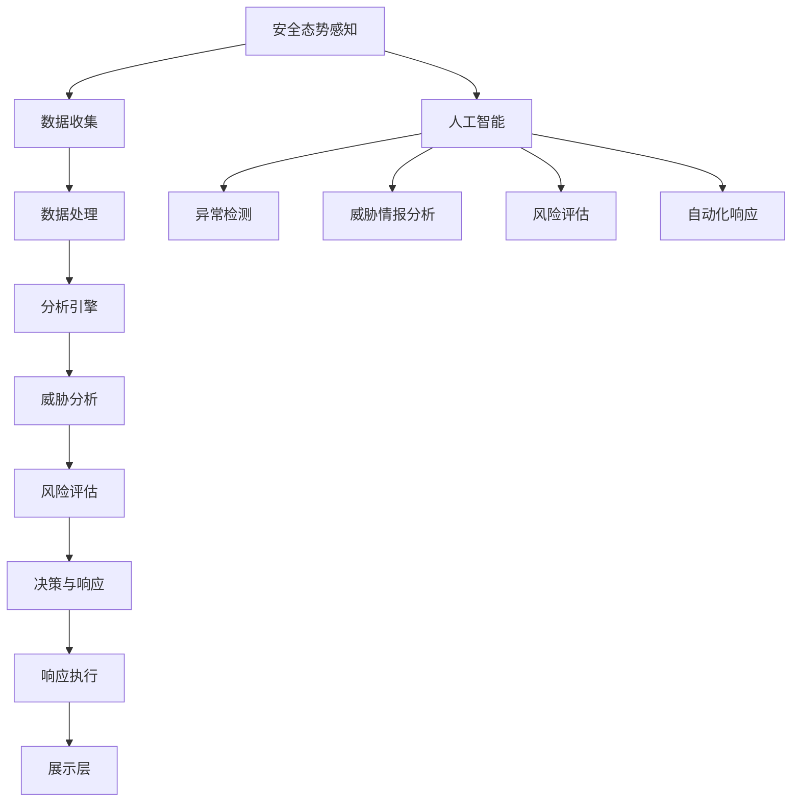

                 

### 摘要

《智能企业安全态势感知：AI全面监控安全风险》旨在深入探讨人工智能（AI）在安全态势感知领域的应用，为企业提供全面的安全监控解决方案。文章首先介绍了安全态势感知的基本概念和重要性，接着讲解了AI技术在安全领域的应用及其优势与挑战。随后，文章详细阐述了安全态势感知系统的设计原理和实现方法，并通过实际项目案例展示了AI在安全态势感知中的实际应用。最后，文章探讨了安全态势感知系统的优化策略和未来发展趋势，为企业提供了最佳实践建议。本文不仅对核心概念进行了深刻剖析，还通过具体案例和算法讲解，使读者能够深入理解和应用AI技术进行安全态势感知。

### 关键词

- 智能企业安全
- 态势感知
- 人工智能
- 安全风险监控
- AI应用
- 安全算法
- 系统设计
- 项目实战
- 优化策略

### 第一部分：安全态势感知概述

#### 1.1 安全态势感知基本概念

安全态势感知（Security Posture Awareness，简称SPA）是指通过监控、分析和评估网络系统的安全状态，实时识别潜在威胁和风险，并采取相应措施进行预防和应对的能力。安全态势感知不仅是网络安全防护的关键环节，也是实现主动防御和智慧安全的基础。

安全态势感知的关键组成部分包括：

- **数据收集**：通过网络流量分析、日志审计、入侵检测系统（IDS）等手段，收集与安全相关的数据。
- **数据预处理**：对收集到的数据进行清洗、转换和格式化，以便后续分析和建模。
- **威胁分析**：运用机器学习、深度学习等算法，对预处理后的数据进行模式识别和异常检测，识别潜在威胁。
- **风险评估**：对识别出的威胁进行风险评估，确定其严重程度和优先级。
- **决策与响应**：根据风险评估结果，采取相应的防护措施，如安全加固、隔离、警告和应急响应。

#### 1.2 安全态势感知的重要性

随着网络攻击手段的日益复杂和多样化，传统的被动防御策略已经无法满足现代企业的安全需求。安全态势感知的重要性体现在以下几个方面：

- **实时威胁检测**：通过实时监控和分析网络流量和日志数据，能够及时发现和响应潜在的安全威胁，减少安全事件的发生。
- **风险预测**：基于历史数据和机器学习算法，可以预测未来可能发生的攻击类型和趋势，为安全策略的制定提供依据。
- **资源优化**：通过对安全事件的及时响应和自动处理，可以降低安全运营成本，提高资源利用效率。
- **合规要求**：许多行业和地区对企业的安全合规性有严格要求，安全态势感知是实现合规的重要手段。

#### 1.3 安全态势感知的体系结构

安全态势感知的体系结构通常包括以下几个层次：

- **数据收集层**：负责从各个系统中收集安全相关的数据，如网络流量、日志文件、传感器数据等。
- **数据处理层**：对收集到的数据进行预处理、存储和管理，确保数据的质量和可用性。
- **分析引擎层**：利用机器学习和深度学习算法，对预处理后的数据进行分析和模式识别，识别潜在威胁。
- **风险决策层**：根据分析结果，对潜在威胁进行风险评估，确定响应策略。
- **响应执行层**：执行风险决策，采取相应的安全措施，如警报、隔离、加固等。
- **展示层**：通过仪表盘、报告等形式，将安全态势和事件展示给相关人员，提供决策支持。

#### 1.4 安全态势感知与AI的关系

人工智能（AI）在安全态势感知中扮演着至关重要的角色。AI技术能够处理海量数据，自动识别复杂模式，提高威胁检测和响应的效率和准确性。以下是AI在安全态势感知中的应用：

- **异常检测**：通过机器学习算法，可以自动识别网络流量和系统行为中的异常模式，及时发现潜在威胁。
- **威胁情报分析**：利用自然语言处理和知识图谱等技术，对威胁情报进行分析和关联，提高威胁识别的准确性和效率。
- **风险评估**：通过深度学习模型，可以更准确地评估威胁的严重程度和影响范围，为决策提供依据。
- **自动化响应**：利用AI技术，可以自动执行安全操作，如隔离受感染的系统、封锁恶意IP等，提高响应速度。

#### 1.5 AI技术的优势与挑战

尽管AI技术在安全态势感知中具有显著的优势，但同时也面临着一系列挑战：

- **优势**：
  - **高效处理**：AI技术能够快速处理和分析海量数据，提高威胁检测的效率和准确性。
  - **自适应能力**：AI系统能够自动学习和适应新的威胁模式，提高威胁检测的准确性。
  - **自动化响应**：AI技术可以实现自动化威胁响应，减少人工干预，提高响应速度。
  
- **挑战**：
  - **数据隐私**：AI技术需要大量敏感数据，如何保护数据隐私成为一大挑战。
  - **模型解释性**：AI模型往往“黑箱化”，模型解释性差，难以理解其决策过程。
  - **持续学习**：AI系统需要不断更新和优化，以应对不断变化的威胁环境。
  - **计算资源**：AI技术对计算资源的要求较高，如何高效利用计算资源成为一大挑战。

通过本文的深入探讨，读者可以全面了解安全态势感知的基本概念、重要性及其与AI技术的紧密联系，为构建智能企业安全态势感知系统提供理论基础和实践指导。

#### 1.6 安全态势感知与AI的关系 Mermaid 流程图



该流程图展示了安全态势感知的核心组成部分与AI技术的结合关系，从数据收集、处理到分析、评估和响应，AI技术在每个环节中发挥了关键作用。

### 第二部分：AI技术基础

#### 2.1 AI技术概述

人工智能（AI）技术是当今计算机科学领域的一个重要分支，其核心目标是通过模拟人类智能，实现机器的自我学习和自主决策。AI技术可以分为几种主要的类别，包括：

- **监督学习（Supervised Learning）**：监督学习是一种常见的机器学习方法，它通过使用标记的数据集来训练模型。标记数据包含输入特征和对应的输出标签，模型通过学习这些数据来预测新的输入数据对应的标签。常见的监督学习算法有线性回归、逻辑回归、支持向量机（SVM）和神经网络等。

- **无监督学习（Unsupervised Learning）**：无监督学习是在没有预先标记的输入数据的情况下进行学习的。其主要任务是发现数据中的隐藏结构，如聚类和降维。常见的无监督学习算法有K-均值聚类、主成分分析（PCA）和自编码器等。

- **强化学习（Reinforcement Learning）**：强化学习是一种通过试错来学习最优策略的机器学习方法。它通过与环境的交互来获得反馈信号（奖励或惩罚），并根据这些反馈来调整其行为。常见的强化学习算法有Q学习、深度Q网络（DQN）和策略梯度算法等。

#### 2.2 AI技术在安全领域的应用

AI技术在安全领域有着广泛的应用，以下是一些典型的应用场景：

- **入侵检测（Intrusion Detection）**：入侵检测系统（IDS）利用AI技术来检测网络中的异常行为和潜在威胁。通过分析网络流量和系统日志，IDS能够识别未知的攻击模式和恶意行为。

- **威胁情报分析（Threat Intelligence Analysis）**：AI技术可以处理和分析大量的威胁情报数据，包括恶意软件签名、攻击策略和漏洞信息等。通过机器学习和自然语言处理技术，AI系统能够发现潜在的威胁关联和趋势，为安全策略的制定提供依据。

- **漏洞管理（Vulnerability Management）**：AI技术可以自动识别和分类软件中的漏洞，并提供修复建议。通过持续监控和机器学习模型，AI系统能够及时识别新的漏洞，减少安全风险。

- **自动化响应（Automated Response）**：AI技术可以实现自动化威胁响应，如隔离受感染的系统、封锁恶意IP地址等。自动化响应能够提高安全运营的效率，减少响应时间。

#### 2.3 网络安全中的AI应用

在网络安全中，AI技术被广泛应用于以下方面：

- **入侵检测系统（IDS）**：AI技术可以显著提升入侵检测系统的检测能力。通过训练机器学习模型，IDS可以识别复杂的攻击模式，包括零日攻击和未知的攻击类型。

- **恶意代码检测（Malware Detection）**：AI技术可以用于检测和分类恶意软件。通过使用特征工程和深度学习算法，AI系统可以识别恶意代码的行为特征，从而提高检测的准确性和效率。

- **网络安全分析（Network Security Analysis）**：AI技术可以分析网络流量，识别异常行为和潜在的攻击。这些技术包括流量异常检测、流量分类和流量加密分析等。

#### 2.4 机器学习算法在安全态势感知中的应用

在安全态势感知中，机器学习算法被广泛应用于威胁检测和风险分析。以下是一些常见的算法及其应用场景：

- **特征工程**：特征工程是机器学习的重要环节，它通过提取和转换原始数据，提高模型的性能。在安全态势感知中，特征工程可以提取网络流量、系统日志和用户行为等数据的关键特征。

- **监督学习算法**：
  - **线性回归（Linear Regression）**：用于预测安全事件的概率和趋势。
  - **逻辑回归（Logistic Regression）**：常用于分类任务，如判断某个网络流量是否为恶意流量。
  - **支持向量机（SVM）**：用于分类和异常检测，能够处理高维数据。
  - **神经网络（Neural Networks）**：通过多层神经网络，可以模拟复杂的非线性关系，提高检测精度。

- **无监督学习算法**：
  - **K-均值聚类（K-Means Clustering）**：用于发现数据中的潜在聚类结构，可以用于网络流量的聚类分析。
  - **主成分分析（PCA）**：用于降维和特征提取，减少数据的冗余性，提高模型的泛化能力。
  - **自编码器（Autoencoders）**：用于特征提取和去噪，可以在没有标签的情况下学习数据的表示。

#### 2.5 常见算法及其伪代码

以下是一些常见机器学习算法的伪代码，用于解释其基本原理和应用：

**线性回归**：
```plaintext
输入：训练数据集 X, Y
输出：模型参数 w, b

初始化 w, b
for each iteration do
  for each example (x_i, y_i) in X do
    predicted_output = w*x_i + b
    error = y_i - predicted_output
    w = w - learning_rate * (error * x_i)
    b = b - learning_rate * error
end for
end iteration
return w, b
```

**K-均值聚类**：
```plaintext
输入：数据集 D，聚类个数 K
输出：聚类中心 C，聚类结果 L

初始化 K 个聚类中心 C
while not converge do
  for each example x in D do
    计算每个聚类中心的距离，选择最近的中心作为归属
    L[x] = argmin(||x - C_j||)
  end for

  更新聚类中心 C
  for each center C_j do
    C_j = mean(D[L = j])
  end for
end while
return C, L
```

通过上述算法的伪代码，读者可以初步了解这些算法的基本原理和实现方法。在实际应用中，这些算法需要根据具体场景和数据集进行优化和调整。

#### 2.6 数学模型和数学公式

在机器学习和安全态势感知中，数学模型和公式是理解和实现算法的基础。以下是一些常用的数学模型和公式的详细讲解，并辅以示例说明。

**线性回归模型**：

$$
y = wx + b
$$

其中，$y$ 是预测值，$x$ 是输入特征，$w$ 是权重，$b$ 是偏置项。线性回归模型用于预测线性关系的输出值。例如，假设我们要预测某股票的价格，输入特征可以是股票的历史价格、交易量等。

**逻辑回归模型**：

$$
P(y=1) = \frac{1}{1 + e^{-(wx + b)}}
$$

逻辑回归是一种分类模型，用于预测概率分布。它通过sigmoid函数将线性组合转换为概率值。例如，在判断某个网络流量是否为恶意流量时，可以将网络流量特征输入逻辑回归模型，输出为恶意流量的概率。

**支持向量机（SVM）模型**：

$$
\min_{w, b} \frac{1}{2} ||w||^2
$$

约束条件：

$$
y_i (w \cdot x_i + b) \geq 1
$$

SVM是一种强大的分类算法，用于找到最佳的超平面，使得分类边界最大化。例如，在二分类问题中，SVM可以找到最佳的超平面，将正类和负类数据分开。

**K-均值聚类算法**：

$$
C_j = \frac{1}{N_j} \sum_{x_i \in S_j} x_i
$$

其中，$C_j$ 是聚类中心，$N_j$ 是属于第 $j$ 个聚类的样本数量。K-均值聚类是一种无监督学习算法，用于将数据分为 $K$ 个聚类。

**主成分分析（PCA）**：

$$
z_j = \sum_{i=1}^{d} \lambda_i c_{ij} x_i
$$

其中，$z_j$ 是降维后的特征，$\lambda_i$ 是特征值，$c_{ij}$ 是特征向量的系数。PCA是一种降维技术，通过保留最重要的特征来减少数据的维度，提高模型的泛化能力。

通过上述数学模型和公式的讲解，读者可以更好地理解机器学习算法在安全态势感知中的应用原理。这些模型和公式是构建智能安全系统的基石，在实际应用中需要根据具体场景和数据集进行优化和调整。

### 第三部分：安全态势感知系统设计与实现

#### 3.1 安全态势感知系统设计

安全态势感知系统的设计目标是实现实时、高效和全面的安全监控，帮助企业快速识别和应对潜在的安全威胁。系统设计通常包括以下几个关键模块：

1. **数据收集模块**：
   - 功能：负责从各种数据源（如网络流量、日志文件、入侵检测系统等）收集安全相关数据。
   - 实现：可以使用代理服务器、网络流量分析工具（如Bro、Snort等）和日志收集工具（如Logstash、Fluentd等）来收集数据。

2. **数据处理模块**：
   - 功能：对收集到的数据进行清洗、转换和格式化，确保数据的质量和一致性。
   - 实现：可以使用ETL（Extract, Transform, Load）工具，如Apache NiFi、Talend等，来处理数据。

3. **数据存储模块**：
   - 功能：负责存储和处理大规模的安全数据，提供高效的查询和访问能力。
   - 实现：可以使用关系型数据库（如MySQL、PostgreSQL）或NoSQL数据库（如MongoDB、Cassandra）来存储数据。

4. **分析引擎模块**：
   - 功能：利用机器学习和深度学习算法，对预处理后的数据进行分析和模式识别，识别潜在威胁。
   - 实现：可以使用开源机器学习框架（如Scikit-learn、TensorFlow、PyTorch等）来构建分析模型。

5. **威胁评估模块**：
   - 功能：对识别出的威胁进行风险评估，确定其严重程度和优先级。
   - 实现：可以使用规则引擎（如 Drools）和威胁情报（如 AlienVault、威胁情报平台）来评估威胁。

6. **响应执行模块**：
   - 功能：根据威胁评估结果，采取相应的安全措施，如警报、隔离、加固等。
   - 实现：可以使用自动化工具（如Puppet、Ansible）和安全设备（如防火墙、入侵防御系统）来实现。

7. **展示层模块**：
   - 功能：通过仪表盘、报告等形式，将安全态势和事件展示给相关人员，提供决策支持。
   - 实现：可以使用可视化工具（如Kibana、Grafana）来构建展示界面。

#### 3.2 系统架构设计

安全态势感知系统的架构设计应考虑以下几个方面：

1. **数据流设计**：
   - 数据流应具备高吞吐量和低延迟，能够处理实时数据。
   - 设计合理的消息队列（如Kafka、RabbitMQ）来处理数据流转和任务分发。

2. **模块解耦**：
   - 系统模块应具有高度的解耦性，以便于维护和升级。
   - 可以使用微服务架构（如Docker、Kubernetes）来实现模块的独立部署和管理。

3. **分布式处理**：
   - 对于大规模数据集，应采用分布式处理技术（如Hadoop、Spark）来提高处理效率。
   - 设计分布式存储和计算架构，确保系统的稳定性和可扩展性。

4. **安全设计**：
   - 系统应具备良好的安全防护机制，包括数据加密、访问控制和身份认证等。
   - 设计安全审计和日志记录功能，确保系统运行的可追溯性。

5. **监控与告警**：
   - 实时监控系统性能和健康状况，设置合理的告警阈值。
   - 通过自动化告警和通知（如SMS、邮件、微信等）来及时响应潜在威胁。

#### 3.3 系统实现

安全态势感知系统的实现通常包括以下步骤：

1. **需求分析**：
   - 明确系统的功能需求、性能要求和安全要求。
   - 确定数据源、数据类型和数据量等关键参数。

2. **系统设计**：
   - 根据需求分析结果，设计系统架构和模块接口。
   - 绘制系统架构图和模块流程图，明确各模块的功能和交互。

3. **开发与测试**：
   - 按照系统设计，编写代码并实现各模块的功能。
   - 进行单元测试和集成测试，确保系统的稳定性和可靠性。

4. **部署与上线**：
   - 在测试环境中进行系统部署和上线，进行实际运行测试。
   - 持续监控和优化系统性能，确保系统稳定运行。

#### 3.4 实际项目案例

以下是一个基于AI的安全态势感知系统的实际项目案例：

**项目背景**：
某大型企业面临日益复杂的网络攻击威胁，需要构建一个智能化的安全态势感知系统，以实现全面的安全监控和威胁应对。

**项目目标**：
- 实时监控网络流量和系统日志，识别潜在的安全威胁。
- 通过机器学习算法，对威胁进行分类和风险评估。
- 自动化威胁响应，提高安全运营效率。

**系统实现**：

1. **数据收集**：
   - 使用Bro工具实时监控网络流量，并提取关键特征。
   - 使用Logstash收集系统日志，如防火墙日志、入侵检测日志等。

2. **数据处理**：
   - 使用Apache NiFi进行数据的清洗、转换和格式化。
   - 存储处理后的数据到Elasticsearch，便于快速查询和分析。

3. **分析引擎**：
   - 使用Scikit-learn构建机器学习模型，进行威胁分类和异常检测。
   - 使用TensorFlow实现深度学习模型，进行复杂威胁的识别和预测。

4. **威胁评估**：
   - 使用规则引擎和威胁情报，对识别出的威胁进行风险评估。
   - 通过API接口与安全设备（如防火墙、入侵防御系统）联动，实现自动化响应。

5. **展示层**：
   - 使用Kibana构建实时监控仪表盘，展示安全态势和事件详情。
   - 使用Grafana生成安全报告，提供威胁分析和总结。

**代码解读与分析**：

以下是一个简单的威胁分类器实现，使用Scikit-learn的SVM模型进行分类。

```python
from sklearn.svm import SVC
from sklearn.model_selection import train_test_split
from sklearn.metrics import accuracy_score

# 加载数据
X, y = load_data()

# 划分训练集和测试集
X_train, X_test, y_train, y_test = train_test_split(X, y, test_size=0.2, random_state=42)

# 训练SVM模型
model = SVC()
model.fit(X_train, y_train)

# 预测测试集
y_pred = model.predict(X_test)

# 计算准确率
accuracy = accuracy_score(y_test, y_pred)
print(f"Accuracy: {accuracy:.2f}")
```

通过这个项目案例，读者可以了解到安全态势感知系统的具体实现过程，包括数据收集、处理、分析和展示等环节。项目中的代码实现和算法应用为读者提供了实际操作的指导，有助于理解和应用AI技术进行安全态势感知。

#### 3.5 项目小结

本项目通过构建一个基于AI的安全态势感知系统，实现了对网络流量和系统日志的实时监控，利用机器学习和深度学习算法对潜在威胁进行分类和预测，并通过自动化响应机制提高了安全运营效率。项目中的关键技术和实现方法为实际应用提供了有力支持，同时也展示了AI技术在安全领域的重要价值。未来，随着AI技术的进一步发展，安全态势感知系统将更加智能化和高效化，为企业提供更加全面的安全保护。

### 第四部分：安全态势感知的优化与展望

#### 4.1 性能优化

安全态势感知系统的性能优化是确保其高效运行的关键。以下是一些性能优化的策略：

- **数据预处理优化**：通过并行处理和分布式计算，加快数据预处理速度。例如，使用Spark进行大规模数据的清洗和转换。
- **模型优化**：使用更高效的算法和模型结构，减少计算复杂度。例如，使用深度神经网络（DNN）代替传统的机器学习模型。
- **存储优化**：使用分布式存储系统，如HDFS或Cassandra，提高数据存储和查询的效率。
- **缓存机制**：利用缓存技术，减少重复计算和数据访问，提高系统响应速度。例如，使用Redis作为缓存服务器。

#### 4.2 当前挑战

尽管AI技术在安全态势感知中展现出巨大潜力，但实际应用中仍然面临以下挑战：

- **数据隐私**：安全态势感知系统需要处理大量敏感数据，如何确保数据隐私和安全是一个重要问题。解决方案包括数据加密、差分隐私和联邦学习等。
- **模型解释性**：许多AI模型，尤其是深度学习模型，具有高度的非线性，导致模型解释性差。提高模型解释性，增强决策的可解释性，是当前研究的一个重要方向。
- **持续学习与更新**：安全威胁环境不断变化，AI系统需要具备持续学习与更新的能力，以适应新的威胁。实现持续学习，需要解决数据质量、模型迭代和计算资源等问题。
- **计算资源**：大规模安全态势感知系统对计算资源的要求较高，如何在有限的资源下实现高效运算，是一个技术挑战。采用云计算和边缘计算等技术，可以有效缓解这一难题。

#### 4.3 安全态势感知的未来趋势

随着技术的不断进步，安全态势感知领域将迎来以下发展趋势：

- **融合多种AI技术**：未来，安全态势感知系统将融合多种AI技术，如深度学习、强化学习和迁移学习，提高威胁检测和响应的准确性。
- **自适应安全架构**：基于AI的自适应安全架构，能够动态调整安全策略，根据威胁环境的变化进行自我优化。
- **边缘计算与物联网（IoT）**：随着物联网设备的普及，边缘计算将在安全态势感知中发挥重要作用，实现实时监控和智能响应。
- **安全大数据分析**：安全大数据分析将变得更加智能化和自动化，通过大规模数据分析和模式识别，发现潜在的威胁和攻击模式。
- **开放安全生态**：开放的安全生态系统，将促进不同安全组件和服务的集成，提高系统的整体性能和灵活性。

通过本文的深入探讨，读者可以全面了解安全态势感知的优化策略、当前挑战和未来发展趋势，为企业在安全领域的技术创新和实际应用提供指导。

### 最佳实践 Tips、小结、注意事项、拓展阅读

#### 最佳实践 Tips

1. **数据质量保障**：确保数据源的一致性和完整性，定期清理和更新数据。
2. **模型解释性**：选择具备一定解释性的算法，如决策树和线性回归，提高模型的可解释性。
3. **持续学习与更新**：定期更新模型，使其适应不断变化的威胁环境。
4. **分布式架构**：采用分布式计算和存储，提高系统的性能和可靠性。

#### 小结

本文从安全态势感知的基本概念、AI技术基础、系统设计与实现，以及优化与展望等方面进行了全面探讨。通过具体案例和算法讲解，读者可以深入理解安全态势感知的原理和实现方法。

#### 注意事项

1. **数据隐私保护**：在处理敏感数据时，需确保数据隐私和安全。
2. **系统安全性**：确保安全态势感知系统自身具备高安全性和防攻击能力。
3. **人员培训**：加强对安全人员的培训，提高其应对安全威胁的能力。

#### 拓展阅读

- **《人工智能安全》**：探讨人工智能在网络安全中的应用与挑战。
- **《机器学习实战》**：提供机器学习算法的应用案例和实现方法。
- **《深度学习》**：介绍深度学习的基本原理和应用实践。

### 作者信息

作者：AI天才研究院/AI Genius Institute & 禅与计算机程序设计艺术 /Zen And The Art of Computer Programming

### 文章标题：智能企业安全态势感知：AI全面监控安全风险

### 文章关键词：智能企业安全，态势感知，人工智能，安全风险监控，AI应用，安全算法，系统设计，项目实战，优化策略

### 摘要

《智能企业安全态势感知：AI全面监控安全风险》旨在深入探讨人工智能在安全态势感知领域的应用，为企业提供全面的安全监控解决方案。本文详细介绍了安全态势感知的基本概念、AI技术的优势与挑战，以及安全态势感知系统的设计原理和实现方法。通过实际项目案例，展示了AI在安全态势感知中的实际应用。最后，文章探讨了安全态势感知系统的优化策略和未来发展趋势，为企业提供了最佳实践建议。本文不仅对核心概念进行了深刻剖析，还通过具体案例和算法讲解，使读者能够深入理解和应用AI技术进行安全态势感知。

