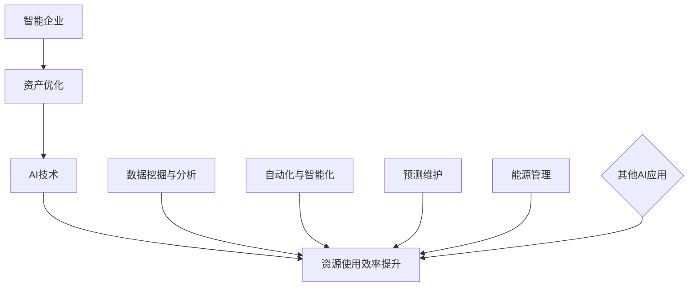

                 

### 文章标题：智能企业资产优化：AI提升资源使用效率

> 关键词：智能企业、资产优化、AI、资源使用效率、机器学习、深度学习、计算机视觉、自然语言处理

> 摘要：本文深入探讨了智能企业在资产优化过程中如何利用人工智能（AI）技术提升资源使用效率。通过定义核心概念、分析核心算法原理、展示实际应用案例，本文旨在为读者提供一份全面的技术指南，帮助他们理解和应用AI技术以实现企业资产的最优化。

---

**引言**

在当今信息化时代，智能企业已经成为企业发展的新趋势。智能企业通过利用先进的信息技术，如人工智能（AI）、大数据、云计算等，实现企业运营的自动化、智能化和高效化。资产优化作为智能企业建设的重要组成部分，对于提升企业竞争力具有重要意义。而AI技术作为推动资产优化的关键力量，其应用范围和效果日益凸显。

本文将围绕智能企业资产优化展开，探讨AI技术在其中的应用及其提升资源使用效率的具体方法。本文旨在为企业和IT专业人员提供一份实用指南，帮助他们理解AI技术的基本原理，掌握资产优化的核心算法，并了解如何在实际项目中应用这些技术。

**第一部分：智能企业与资产优化**

**1.1 智能企业的概念与特点**

智能企业是指通过利用先进的信息技术，如人工智能、大数据、云计算等，实现企业运营的自动化、智能化和高效化的企业。智能企业具有以下几个特点：

- **数据驱动：** 智能企业通过收集、存储、分析和利用海量数据，实现对企业业务运行状况的全面感知和精准预测。
- **业务智能化：** 智能企业通过人工智能技术，实现业务流程的自动化和智能化，提高企业运营效率和决策质量。
- **跨部门协同：** 智能企业通过建立统一的数据平台和业务系统，实现跨部门的信息共享和协同工作，提高企业整体运作效率。
- **快速响应市场：** 智能企业能够快速响应市场变化，通过数据分析预测市场趋势，调整业务策略，提高市场竞争力。

**1.2 资产优化的定义与重要性**

资产优化是指通过优化企业的资产配置、提高资产利用效率，从而实现企业价值最大化的过程。资产优化的核心目标是提高资产的投资回报率（ROI），降低成本，提高企业的盈利能力。

资产优化对于智能企业具有重要意义：

- **提高资源利用效率：** 资产优化能够帮助企业合理配置资源，减少浪费，提高资源利用效率。
- **降低运营成本：** 资产优化有助于企业降低运营成本，提高企业的盈利能力。
- **提升竞争力：** 资产优化能够帮助企业提高产品和服务质量，提高市场竞争力。
- **促进可持续发展：** 资产优化有助于企业实现可持续发展，减少对环境的负面影响。

**1.3 AI在提升资源使用效率中的应用**

人工智能（AI）技术作为推动资产优化的关键力量，其应用范围和效果日益凸显。AI技术在资产优化中的应用主要包括以下几个方面：

- **数据挖掘与分析：** AI技术可以帮助企业挖掘海量数据中的有价值信息，进行深度分析和预测，为企业决策提供支持。
- **自动化与智能化：** AI技术可以实现企业业务流程的自动化和智能化，减少人力成本，提高运营效率。
- **预测维护：** AI技术可以基于历史数据和实时监测数据，预测设备故障和性能问题，实现预防性维护，降低设备故障率。
- **能源管理：** AI技术可以优化能源使用，降低能源消耗，提高能源利用效率。

**第二部分：核心概念与联系**

**2.1 智能企业资产优化的Mermaid流程图**

为了更好地理解智能企业资产优化的过程，我们可以使用Mermaid流程图来展示核心概念之间的联系。以下是智能企业资产优化的Mermaid流程图：

在上面的流程图中，智能企业通过资产优化实现资源使用效率的提升，而AI技术在数据挖掘与分析、自动化与智能化、预测维护、能源管理等多个方面发挥着重要作用。

**2.2 AI提升资源使用效率的核心算法**

AI技术提升资源使用效率的核心算法主要包括机器学习、深度学习和强化学习等。下面我们将分别介绍这些算法的基本原理。

**2.2.1 机器学习算法**

机器学习（Machine Learning，ML）是一种通过数据训练模型，使模型能够对未知数据进行预测或分类的技术。机器学习算法可以分为监督学习、无监督学习和半监督学习三种类型。

- **监督学习（Supervised Learning）：** 监督学习是指利用带有标签的数据进行训练，通过学习数据与标签之间的关系，实现对新数据的预测。常见的监督学习算法包括线性回归、逻辑回归、支持向量机（SVM）等。
- **无监督学习（Unsupervised Learning）：** 无监督学习是指在没有标签的数据上进行训练，通过寻找数据中的模式和结构，实现数据的聚类、降维等操作。常见的无监督学习算法包括K-均值聚类、主成分分析（PCA）等。
- **半监督学习（Semi-supervised Learning）：** 半监督学习是指利用部分带有标签的数据和大量无标签的数据进行训练，通过结合标签数据和未标签数据的信息，提高模型的性能。

机器学习算法在资产优化中的应用主要包括：

- **预测分析：** 利用机器学习算法对历史数据进行分析，预测未来数据的变化趋势，帮助企业制定合理的资源配置策略。
- **异常检测：** 利用机器学习算法检测数据中的异常值，帮助企业及时发现潜在问题，进行预防性维护。
- **优化决策：** 利用机器学习算法优化企业的资源配置和运营决策，提高资源利用效率。

**2.2.2 深度学习算法**

深度学习（Deep Learning，DL）是一种基于多层神经网络（Neural Network）的机器学习技术。深度学习通过学习大量的数据和复杂的模型，实现更准确的预测和分类。

深度学习算法可以分为以下几个层次：

- **浅层网络（Shallow Networks）：** 指的是只有一层或几层神经元的神经网络，如感知机、多层感知机等。
- **中层网络（Mid-level Networks）：** 指的是具有数十层神经元的神经网络，如卷积神经网络（CNN）。
- **深层网络（Deep Networks）：** 指的是具有数百层或更多神经元的神经网络，如循环神经网络（RNN）、生成对抗网络（GAN）等。

深度学习算法在资产优化中的应用主要包括：

- **图像识别：** 利用卷积神经网络（CNN）进行图像识别，帮助企业实现自动化设备监控和维护。
- **语音识别：** 利用循环神经网络（RNN）进行语音识别，帮助企业实现自动化客户服务和管理。
- **自然语言处理：** 利用深度学习算法进行自然语言处理，帮助企业实现自动化文档管理和智能问答系统。

**2.2.3 强化学习算法**

强化学习（Reinforcement Learning，RL）是一种通过与环境交互，学习最优策略的机器学习技术。强化学习通过不断尝试和反馈，逐步优化决策策略，以实现最优目标。

强化学习算法可以分为以下几个类型：

- **基于策略的强化学习（Policy-based RL）：** 直接学习最优策略，通过策略优化实现目标。
- **基于值函数的强化学习（Value-based RL）：** 学习状态-动作值函数，通过值函数优化实现目标。
- **混合型强化学习（Hybrid RL）：** 结合策略和值函数优化的特点，实现更好的效果。

强化学习算法在资产优化中的应用主要包括：

- **智能调度：** 利用强化学习算法优化企业的生产调度和资源分配，提高生产效率和资源利用率。
- **路径规划：** 利用强化学习算法优化物流和交通路线规划，降低运输成本和能耗。
- **能源管理：** 利用强化学习算法优化能源消耗和供应，提高能源利用效率。

**第三部分：技术基础**

**3.1 AI技术概述**

AI技术是一种模拟人类智能行为的技术，主要包括机器学习、深度学习、自然语言处理、计算机视觉等领域。AI技术通过学习大量的数据和复杂的模型，实现自动化、智能化和高效化的数据处理和分析。

**3.2 机器学习与深度学习基础**

机器学习（Machine Learning，ML）是一种通过数据训练模型，使模型能够对未知数据进行预测或分类的技术。机器学习算法可以分为监督学习、无监督学习和半监督学习三种类型。

深度学习（Deep Learning，DL）是一种基于多层神经网络（Neural Network）的机器学习技术。深度学习通过学习大量的数据和复杂的模型，实现更准确的预测和分类。

**3.3 计算机视觉与自然语言处理**

计算机视觉（Computer Vision，CV）是一种利用计算机技术处理和分析图像、视频等视觉信息的技术。计算机视觉包括图像识别、目标检测、图像分割、图像恢复等多个子领域。

自然语言处理（Natural Language Processing，NLP）是一种利用计算机技术处理和分析自然语言（如英语、汉语等）的技术。自然语言处理包括文本分类、情感分析、机器翻译、语音识别等多个子领域。

**第四部分：应用实例**

**4.1 智能能耗管理系统**

智能能耗管理系统是一种利用AI技术优化能源消耗和管理的系统。通过监测和分析能源消耗数据，智能能耗管理系统可以实现以下功能：

- **能耗预测：** 利用机器学习算法预测未来的能源消耗趋势，帮助企业制定合理的能源使用计划。
- **节能优化：** 利用深度学习算法优化能源消耗，降低能耗成本，提高能源利用效率。
- **故障预警：** 利用计算机视觉算法监测设备运行状态，及时发现设备故障，进行预防性维护。

**4.2 智能仓储与物流管理系统**

智能仓储与物流管理系统是一种利用AI技术优化仓储和物流运作的系统。通过实时监测和分析仓储和物流数据，智能仓储与物流管理系统可以实现以下功能：

- **库存管理：** 利用机器学习算法优化库存管理，降低库存成本，提高库存周转率。
- **路径优化：** 利用强化学习算法优化物流路径，降低运输成本，提高运输效率。
- **异常检测：** 利用计算机视觉算法监测仓库和运输过程中的异常情况，及时进行处理。

**第五部分：案例分析**

**5.1 案例一：某大型企业智能资产优化实践**

某大型企业在建设智能企业过程中，采用了AI技术进行资产优化。通过数据挖掘和分析，企业成功实现了以下成果：

- **能耗优化：** 通过能耗预测和节能优化，企业降低了10%的能源消耗，节省了大量能源成本。
- **库存优化：** 通过库存管理和路径优化，企业提高了15%的库存周转率，降低了库存成本。
- **生产优化：** 通过生产调度和设备监控，企业提高了20%的生产效率，降低了生产成本。

**5.2 案例二：AI在电力行业资产优化中的应用**

电力行业通过引入AI技术进行资产优化，取得了显著成果。以下是一个具体案例：

- **设备故障预测：** 通过计算机视觉和自然语言处理技术，电力公司实现了对设备运行状态的实时监控，准确预测了设备故障，降低了设备停机时间。
- **电力需求预测：** 通过机器学习算法，电力公司实现了对电力需求的准确预测，优化了电力供应计划，提高了电力利用效率。

**5.3 案例三：AI在制造业资产优化中的挑战与机遇**

制造业在引入AI技术进行资产优化过程中，面临着一系列挑战和机遇。以下是一个具体案例：

- **挑战：** 制造业数据量巨大，数据质量和数据一致性存在问题，给AI算法的训练和预测带来困难。此外，制造业生产线复杂，对AI技术的实时响应能力要求较高。
- **机遇：** 通过AI技术，制造业可以实现生产线的自动化和智能化，提高生产效率和质量。同时，AI技术还可以优化库存管理、供应链优化等环节，降低运营成本。

**第六部分：未来展望**

**6.1 AI技术发展趋势**

随着AI技术的不断发展和创新，未来AI技术将在智能企业资产优化中发挥更加重要的作用。以下是一些AI技术发展趋势：

- **更强大的算法：** 未来的AI算法将更加复杂和高效，能够处理更大量的数据和更复杂的任务。
- **跨领域应用：** AI技术将在更多领域得到应用，如医疗、金融、教育等，实现更广泛的价值创造。
- **边缘计算：** 边缘计算将与AI技术紧密结合，实现实时数据处理和智能决策，提高系统的响应速度和可靠性。

**6.2 企业资产优化面临的新挑战与新机遇**

随着AI技术的发展，企业资产优化面临着一系列新的挑战和机遇：

- **挑战：** 数据隐私和安全问题、技术人才短缺、技术成熟度不足等。
- **机遇：** 提高资源利用效率、降低运营成本、提升市场竞争力等。

**6.3 智能企业资产优化的未来发展方向**

智能企业资产优化的未来发展方向主要包括：

- **智能化生产：** 通过AI技术实现生产线的自动化和智能化，提高生产效率和质量。
- **智能化管理：** 通过AI技术优化企业内部管理流程，提高管理效率和决策质量。
- **智能化服务：** 通过AI技术优化客户服务，提升客户满意度和忠诚度。

**结语**

智能企业资产优化是企业发展的重要趋势，而AI技术是实现这一目标的关键力量。通过本文的探讨，我们了解了智能企业资产优化的核心概念、AI技术的应用方法以及实际案例。希望本文能为读者提供有价值的参考，助力他们在实际工作中实现资产优化，提升企业竞争力。

**作者信息**

作者：AI天才研究院/AI Genius Institute & 禅与计算机程序设计艺术 /Zen And The Art of Computer Programming****

