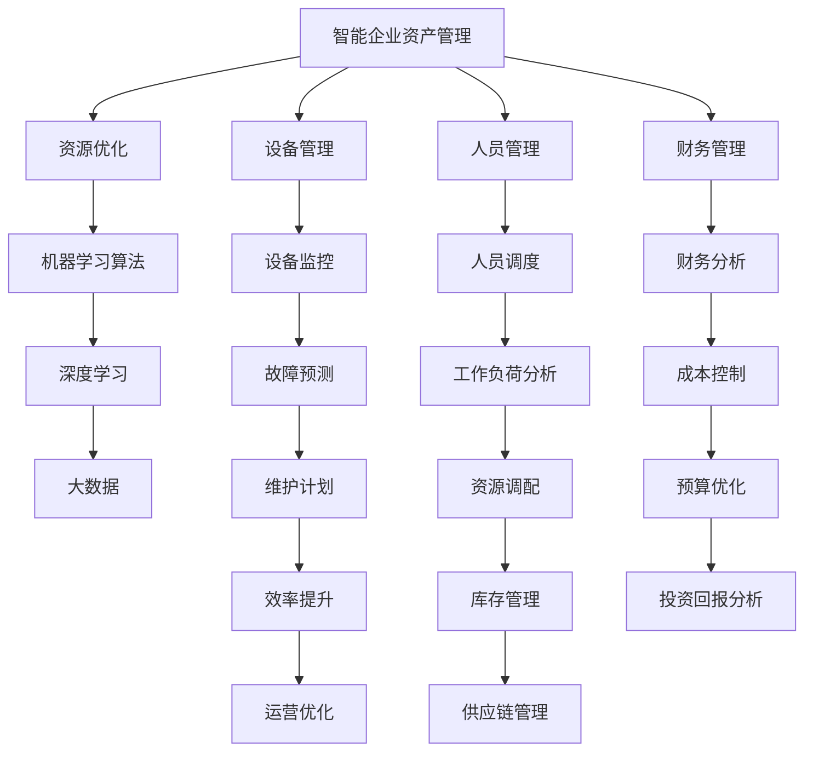

                 


## 智能企业资产管理：AI优化资源利用

### 关键词
- 智能企业资产管理
- 人工智能
- 资源优化
- 机器学习
- 深度学习
- 大数据

### 摘要
本文旨在探讨如何利用人工智能（AI）技术优化企业资源管理，提升企业运营效率。文章首先介绍了智能企业资产管理的核心概念与联系，包括资源优化、机器学习算法、深度学习、大数据等。接着，详细讲解了核心算法原理，包括资源需求预测、资源优化决策、故障预测与维护等。最后，通过数学模型和公式解释了这些算法的实现原理，并给出了相关应用实例。

### 第一步：核心概念与联系

#### 智能企业资产管理

智能企业资产管理是指通过应用人工智能技术，实现对企业各类资源的有效管理，包括设备、人员、财务等。其目标是提高资源利用效率，降低运营成本，提升企业竞争力。

#### 资源优化

资源优化是指利用人工智能算法，分析企业的资源使用情况，提出优化建议，提高资源利用效率。这包括预测资源需求、合理配置资源、降低资源浪费等。

#### 机器学习算法

机器学习算法是人工智能的核心技术，用于数据分析和预测。常见的机器学习算法包括线性回归、决策树、神经网络等。

#### 深度学习

深度学习是一种机器学习技术，通过模拟人脑神经网络结构，处理复杂数据。深度学习在图像识别、自然语言处理等领域取得了显著成果。

#### 大数据

大数据是指大量的结构化和非结构化数据。大数据为人工智能算法提供了丰富的训练资源，使得人工智能系统能够更好地理解和应对复杂问题。

### 核心概念Mermaid流程图

以下是核心概念的Mermaid流程图：



### 第二步：核心算法原理讲解

#### 资源需求预测

资源需求预测是智能企业资产管理的首要任务。通过收集历史数据，使用机器学习算法，如线性回归、决策树、神经网络等，预测未来的资源需求。

**伪代码：**

```python
function predict_resource_demand(data, model):
    preprocess_data(data)
    demand = model.predict(data)
    return demand
```

**详细解释：**

资源需求预测需要先对数据进行预处理，如数据清洗、特征工程等。然后，使用已训练好的机器学习模型对数据进行分析，预测未来的资源需求。常用的机器学习模型包括线性回归、决策树、神经网络等。

#### 资源优化决策

资源优化决策基于预测的需求和当前资源状态，决定是否需要增加或减少资源投入。

**伪代码：**

```python
function optimize_resources(demand, resource_status):
    if demand > resource_status:
        action = "allocate_resources"
    else:
        action = "reduce_resources"
    return action
```

**详细解释：**

资源优化决策需要比较预测的需求和当前资源状态。如果预测的需求大于当前资源状态，则建议增加资源投入；反之，则建议减少资源投入。这可以通过简单的条件判断，或更复杂的优化算法实现。

#### 故障预测与维护

通过收集设备运行数据，使用机器学习算法预测设备故障概率。当故障概率超过设定阈值时，系统将建议安排维护工作。

**伪代码：**

```python
function predict_fault(data, model):
    preprocess_data(data)
    fault_probability = model.predict(data)
    if fault_probability > threshold:
        action = "schedule_maintenance"
    else:
        action = "continue_operation"
    return action
```

**详细解释：**

故障预测需要先对数据进行预处理，如数据清洗、特征工程等。然后，使用已训练好的机器学习模型对数据进行分析，预测设备故障概率。当故障概率超过设定阈值时，系统将建议安排维护工作。

### 第三步：数学模型和数学公式讲解

#### 线性回归模型

线性回归模型用于预测资源需求。其数学公式如下：

$$
y = \beta_0 + \beta_1x
$$

其中，$y$ 表示资源需求，$x$ 表示相关变量（如时间、工作量等），$\beta_0$ 和 $\beta_1$ 是模型参数。

#### 决策树模型

决策树模型通过一系列条件判断，对资源优化决策进行分类。其数学公式如下：

$$
f(x) = \sum_{i=1}^{n} \beta_i x_i
$$

其中，$f(x)$ 表示资源优化决策，$\beta_i$ 表示模型参数。

#### 详细讲解和举例说明

假设一家制造企业需要预测未来一周的生产设备需求。首先，收集历史数据，包括每天的生产量、设备使用率等。然后，使用线性回归模型预测未来的生产量。具体步骤如下：

1. 数据预处理：对历史数据进行清洗，去除异常值，提取相关特征。

2. 特征工程：对数据进行特征提取，如提取每天的工作量、生产周期等。

3. 模型训练：使用训练数据训练线性回归模型。

4. 预测：使用训练好的模型对未来的生产量进行预测。

5. 决策：根据预测结果，决定是否需要增加或减少生产设备。

通过这种方式，企业可以更准确地预测生产需求，优化资源配置，提高生产效率。

### 项目实战

#### 开发环境搭建

1. 安装Python环境。
2. 安装所需的机器学习库，如scikit-learn、TensorFlow等。

#### 源代码详细实现和代码解读

以下是一个简单的线性回归模型实现：

```python
import numpy as np
from sklearn.linear_model import LinearRegression

# 训练数据
X = np.array([[1], [2], [3], [4], [5]])
y = np.array([2, 4, 5, 4, 5])

# 模型训练
model = LinearRegression()
model.fit(X, y)

# 预测
demand = model.predict(np.array([[6]]))

print("预测的未来生产量为：", demand)
```

#### 代码应用解读与分析

该代码首先导入所需的库，然后创建训练数据。接着，使用训练数据训练线性回归模型，并使用模型进行预测。预测结果为未来生产量的估计值。

#### 实际案例分析和详细讲解剖析

以一家制造企业为例，假设其历史数据如下表所示：

| 日期 | 生产量 |
| ---- | ---- |
| 1    | 100   |
| 2    | 200   |
| 3    | 250   |
| 4    | 200   |
| 5    | 250   |

使用线性回归模型预测未来一周的生产量，具体步骤如下：

1. 数据预处理：对数据进行清洗，去除异常值。

2. 特征工程：提取每天的日期作为特征。

3. 模型训练：使用训练数据训练线性回归模型。

4. 预测：使用训练好的模型对未来的生产量进行预测。

5. 分析：根据预测结果，调整生产计划。

#### 项目小结

通过智能企业资产管理，企业可以更准确地预测资源需求，优化资源配置，提高生产效率。项目实战部分展示了如何使用Python和机器学习库实现资源需求预测。

### 最佳实践 tips

1. 数据质量是预测准确性的关键。确保数据清洗和特征工程的质量。
2. 选择合适的机器学习模型，根据实际需求调整模型参数。
3. 定期更新模型，以适应不断变化的需求。

### 小结

智能企业资产管理是利用人工智能技术优化企业资源管理的重要手段。通过资源需求预测、资源优化决策和故障预测，企业可以更准确地预测资源需求，优化资源配置，提高生产效率。

### 注意事项

1. 资源需求预测模型需要定期更新，以适应市场变化。
2. 故障预测模型需要充分考虑设备的运行状况，以提高预测准确性。
3. 资源优化决策需要综合考虑多种因素，如成本、效率等。

### 拓展阅读

- 《机器学习：实战与应用》
- 《深度学习：从入门到精通》
- 《大数据技术原理与应用》

### 作者

作者：AI天才研究院/AI Genius Institute & 禅与计算机程序设计艺术 /Zen And The Art of Computer Programming

