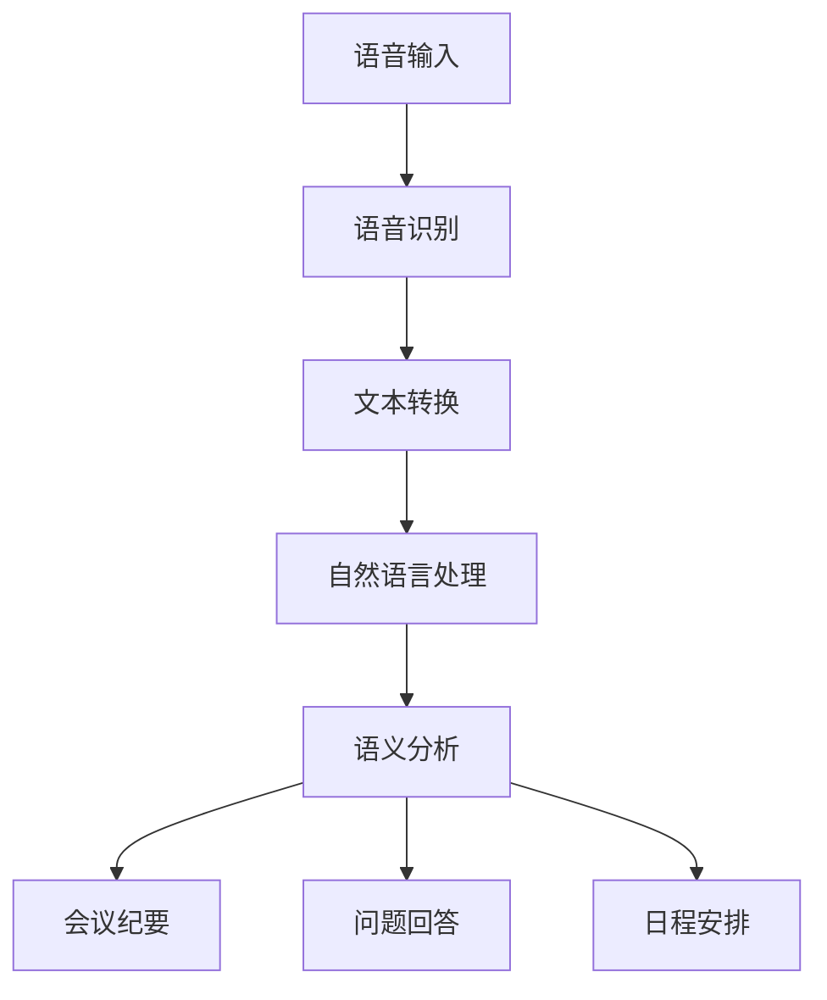

                 

### 引言与概述

在现代企业环境中，高效沟通是确保团队协作顺畅、项目进展顺利的关键。然而，传统的会议沟通方式常常伴随着时间成本高、记录繁琐、信息遗漏等问题。为了解决这些问题，智能会议助手应运而生，利用人工智能技术提升企业沟通效率，成为企业数字化转型的重要工具。

#### 核心概念与联系

智能会议助手是基于人工智能技术，为会议提供自动化、智能化的服务工具。它涵盖了语音识别、自然语言处理、语义分析等多个技术领域，通过以下Mermaid流程图进行展示：



从图中可以看出，语音识别模块将语音转化为文本，自然语言处理模块对文本进行语义分析和理解，最终生成会议纪要、回答问题和提醒日程等。

#### 核心算法原理讲解

智能会议助手的语音识别和自然语言处理模块是核心组成部分。以下是这些算法原理的伪代码讲解：

**语音识别算法原理伪代码：**

```pseudocode
function SpeechRecognition(voice_data):
    # 1. 语音预处理
    preprocessed_data = PreprocessVoice(voice_data)

    # 2. 声学模型特征提取
    features = ExtractAcousticFeatures(preprocessed_data)

    # 3. 语言模型特征提取
    language_features = ExtractLanguageFeatures(features)

    # 4. 声学-语言模型结合
    acoustic_score, language_score = CombineAcousticAndLanguageModels(language_features)

    # 5. 声音转文字
    text = ConvertToText(acoustic_score, language_score)

    return text
```

**自然语言处理算法原理伪代码：**

```pseudocode
function NaturalLanguageProcessing(text):
    # 1. 文本预处理
    preprocessed_text = PreprocessText(text)

    # 2. 词汇表示
    word_embeddings = WordEmbedding(preprocessed_text)

    # 3. 语法分析
    parsed_tree = ParseSyntax(preprocessed_text)

    # 4. 语义分析
    semantics = AnalyzeSemantics(word_embeddings, parsed_tree)

    return semantics
```

#### 数学模型和公式

在自然语言处理过程中，常用的数学模型包括词向量模型、序列标注模型等。以下是一个词向量模型的简单公式：

$$
\text{word\_embedding} = \text{vec}(w)
$$

其中，$w$表示单词，$\text{vec}(w)$表示该单词的词向量表示。

#### 数学公式详细讲解

词向量模型通过将单词映射到高维空间中的向量，来实现对单词的表示和计算。在词向量模型中，通常使用余弦相似度来衡量两个单词的相似性：

$$
\text{similarity}(w_1, w_2) = \frac{\text{vec}(w_1) \cdot \text{vec}(w_2)}{||\text{vec}(w_1)|| \cdot ||\text{vec}(w_2)||}
$$

#### 实际案例分析和详细讲解剖析

为了更好地理解智能会议助手的工作原理，我们来看一个实际案例。

假设我们有一个会议场景，其中参会者讨论了一个新的产品开发计划。会议中的语音数据通过智能会议助手进行实时转换和记录，以下是一个简单的实际案例分析和详细讲解：

**案例：会议纪要生成**

1. **语音输入**：参会者的发言被智能会议助手实时记录下来。

```bash
> 产品开发计划非常重要，我们需要在一个月内完成市场调研。
> 我们计划分为三个阶段：第一阶段是市场调研，第二阶段是产品设计和开发，第三阶段是产品发布和推广。
```

2. **语音识别**：智能会议助手将语音转换为文本。

```text
产品开发计划非常重要，我们需要在一个月内完成市场调研。我们计划分为三个阶段：第一阶段是市场调研，第二阶段是产品设计和开发，第三阶段是产品发布和推广。
```

3. **自然语言处理**：智能会议助手对文本进行语义分析和理解。

```text
[关键信息] 产品开发计划、一个月内、市场调研、三个阶段、市场调研、产品设计、开发、产品发布、推广
```

4. **会议纪要生成**：智能会议助手根据分析结果生成会议纪要。

```text
会议纪要：

- 产品开发计划非常重要
- 需要在一个月内完成市场调研
- 计划分三个阶段：
  - 第一阶段：市场调研
  - 第二阶段：产品设计和开发
  - 第三阶段：产品发布和推广
```

通过这个实际案例，我们可以看到智能会议助手如何通过语音识别和自然语言处理技术，将会议内容转化为结构化的信息，从而提高企业沟通效率。

#### 小结

智能会议助手通过结合语音识别、自然语言处理和语义分析等技术，能够有效地将会议中的语音信息转化为结构化的文本，生成会议纪要、回答问题和提醒日程。这一过程不仅减少了人工记录的时间和错误，还能够帮助参会者快速获取会议的关键信息，从而提升企业沟通效率。

在接下来的章节中，我们将进一步探讨智能会议助手的技术基础、应用场景、原理与方法，以及如何通过实战项目来提升企业沟通效率。让我们继续深入探索这一领域的奥秘。

