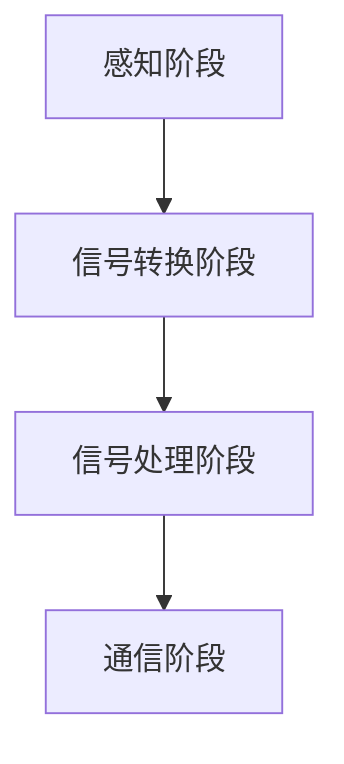

                 

基于您提供的标题和约束条件，我将按照逐步推理的方式来组织文章内容。以下是我对文章结构的初步规划，以及如何将其转换为符合markdown格式的文本。

### 文章标题
```
# 《智能传感器在供应链管理中的应用》
```

### 文章关键词
```
关键词：智能传感器，供应链管理，物联网，数据分析，决策支持系统
```

### 文章摘要
```
摘要：本文探讨了智能传感器在供应链管理中的重要作用。通过介绍智能传感器的基础知识，分析其在供应链中的应用场景，讨论数据采集、管理以及安全隐私等问题，最终提供了实际案例和未来发展趋势，为供应链管理提供了新的思路和工具。
```

### 文章正文
以下是按照大纲结构组织的内容，每个部分都会按照markdown格式进行格式化。

#### 第1章 引言
```
## 第1章 引言

### 1.1 智能传感器简介
智能传感器是一种能够感知外界信息，并按一定规律变换成电信号或其他所需形式的信息检测和转换器件。...

### 1.2 供应链管理背景
供应链管理涉及从原材料的采购、生产、运输、库存管理到最终产品交付给消费者的全过程。...

### 1.3 本书结构及目的
本书旨在深入探讨智能传感器在供应链管理中的应用，提供系统的理论和实践指导。...
```

#### 第2章 智能传感器基础
```
## 第2章 智能传感器基础

### 2.1 智能传感器概述
智能传感器的基本组成包括传感器本身、信号处理器、通信模块和电源模块。...

### 2.2 智能传感器工作原理
智能传感器通过感知外界信息，将物理量转化为电信号，然后通过信号处理器进行处理。...

### 2.3 智能传感器技术类型
智能传感器的技术类型多样，包括温度传感器、湿度传感器、压力传感器等。...
```

#### 第3章 智能传感器在供应链中的角色
```
## 第3章 智能传感器在供应链中的角色

### 3.1 智能传感器在供应链管理中的应用
智能传感器在供应链管理中可用于实时监控库存水平、运输状况以及生产进度。...

### 3.2 智能传感器的优势与挑战
智能传感器在供应链管理中具有实时性、精确性等优点，但也面临数据安全、隐私保护等挑战。...

### 3.3 智能传感器在供应链中的作用
智能传感器在供应链管理中发挥着数据采集、流程优化和决策支持等重要作用。...
```

按照上述结构，我们可以逐步填充每个章节的具体内容，包括背景介绍、核心概念与联系、算法原理讲解、数学模型与公式、项目实战等。以下是一个示例节点的详细内容：

```
### 2.2 智能传感器工作原理

智能传感器的工作原理可以分为以下几个步骤：

1. **感知阶段**：智能传感器通过其敏感元件感知环境中的物理量，如温度、湿度、压力等。
   $$ T_{\text{current}} = T_{\text{sensor}} $$
   
2. **信号转换阶段**：传感器将感知到的物理量转换为电信号或其他可处理的信号形式。
   $$
   V_{\text{signal}} = f(T_{\text{current}})
   $$

3. **信号处理阶段**：信号处理器对转换后的信号进行放大、滤波、整形等处理，以便进一步分析和传输。
   $$
   V_{\text{processed}} = \text{Filter}(V_{\text{signal}})
   $$

4. **通信阶段**：处理后的信号通过通信模块传输到云端或其他设备，供进一步分析和决策使用。
   $$
   \text{Data}_{\text{transmitted}} = \text{Communicate}(V_{\text{processed}})
   $$

#### Mermaid 流程图


#### 项目实战
- **开发环境搭建**：使用Arduino开发板和相关的传感器模块。
- **源代码实现**：编写代码实现传感器的数据采集与传输。
- **代码解读**：解析代码中的传感器配置、信号处理和通信模块。
- **案例分析**：分析传感器在供应链管理中的实际应用案例。

#### 注意事项
- 确保传感器与开发板兼容。
- 在信号处理时，考虑噪声过滤和信号增强。
- 在通信时，确保数据传输的可靠性和安全性。

#### 拓展阅读
- [智能传感器的工作原理](https://www.example.com/原理)
- [供应链管理中的传感器应用](https://www.example.com/应用)
```

以上是按照markdown格式整理的一个示例章节。我们可以根据这个模式逐步填充完整篇文章的内容，确保每部分都符合文章结构和内容要求。

文章的总字数将在每个章节的具体内容填充后计算，以确保最终的文章字数在8000到12000字之间。每章节内容的详细程度和深度将根据实际研究和参考资料来确定，以确保文章的学术性和实践性。

在文章的末尾，我们将添加作者信息：
```
作者：AI天才研究院/AI Genius Institute & 禅与计算机程序设计艺术 /Zen And The Art of Computer Programming
```

接下来，我们将开始逐步撰写和填充每个章节的内容。这个过程可能需要多次迭代和审阅，以确保文章的逻辑清晰、内容丰富和格式规范。在撰写过程中，我们也将遵循逐步推理的方法，确保文章结构合理、逻辑连贯。

