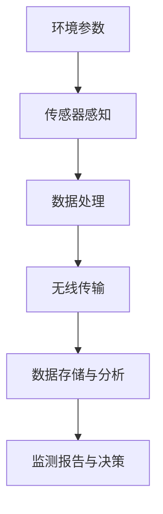

                 

### 引言

环境监测是现代社会中不可或缺的一项任务，它对于保护公共健康、维护生态平衡以及制定合理的资源管理政策具有重要意义。然而，传统的环境监测手段通常面临着高成本、低效率和难以及时获取全面数据等问题。随着智能传感器技术的迅猛发展，这些问题逐渐得到了有效的解决，为环境监测带来了全新的可能性。

智能传感器是一种集成了传感器、处理单元和通信模块的设备，能够对环境中的各种参数进行实时监测、数据采集和处理，并通过无线网络将监测数据传输到云端或中央控制室进行分析和存储。智能传感器在环境监测中的应用，不仅提高了监测的精度和效率，还显著降低了人力成本和运营费用。

本文将围绕智能传感器在环境监测中的应用展开讨论。首先，我们将介绍环境监测的基本概念、重要性和面临的挑战。随后，我们将深入探讨智能传感器的定义、工作原理、分类以及其在环境监测中的作用。接着，本文将详细讲解环境监测中常用的核心算法原理，包括数据采集、数据处理、数据分析和预测模型。此外，我们还将使用LaTeX格式书写相关的数学模型和公式，并进行详细的举例说明。

在项目实战部分，我们将介绍两个具体的环境监测项目，详细描述项目背景、开发环境搭建、源代码实现和代码解读。通过实际案例的分析，我们将展示智能传感器在环境监测中的具体应用及其效果。最后，本文将探讨智能传感器在环境监测中的未来发展趋势和潜在应用，并总结全文，提供最佳实践建议。

关键词：环境监测，智能传感器，数据采集，数据处理，预测模型，数学模型，项目实战，发展趋势。

摘要：本文全面探讨了智能传感器在环境监测中的应用，分析了环境监测的重要性以及智能传感器的工作原理和分类。通过详细的算法原理讲解和实际项目案例分析，展示了智能传感器在提高环境监测精度和效率方面的巨大潜力。同时，本文展望了智能传感器在环境监测领域的未来发展趋势和潜在应用，为相关研究和应用提供了有益的参考。

---

#### 第一部分 引言

环境监测是现代社会中不可或缺的一项任务，它对于保护公共健康、维护生态平衡以及制定合理的资源管理政策具有重要意义。随着全球环境问题的日益突出，环境监测的需求不断增加。然而，传统的环境监测手段通常面临着高成本、低效率和难以及时获取全面数据等问题。这不仅限制了环境监测的广度和深度，也影响了监测结果的准确性和可靠性。

### 1.1 环境污染问题

环境污染问题已经成为全球范围内的重大挑战。空气污染、水污染和土壤污染等环境问题不仅严重威胁到人类健康，也对生态系统造成了不可逆转的破坏。空气污染主要来源于工业排放、汽车尾气和燃烧过程，导致空气质量下降，引发呼吸系统疾病。水污染主要来源于工业废水、农业面源污染和生活污水，导致水源受到污染，影响人类饮用安全和生态系统平衡。土壤污染则主要来源于农药、化肥和工业废弃物，导致土壤质量下降，影响农作物的产量和质量。

### 1.2 环境监测的意义

环境监测在环境保护中具有至关重要的作用。通过环境监测，我们可以实时获取环境参数，了解环境污染的程度和分布情况，为制定有效的污染控制和环境保护政策提供科学依据。此外，环境监测还可以帮助识别污染源，追踪污染物的迁移路径，预测污染趋势，从而采取及时的应对措施。具体来说，环境监测的意义包括以下几个方面：

1. **保护公共健康**：通过监测空气质量、水质和土壤质量等环境参数，及时发现环境污染问题，采取措施减轻污染对公共健康的危害。
2. **维护生态平衡**：环境监测可以帮助我们了解生态系统的健康状况，及时发现生态破坏和生物多样性丧失等问题，采取相应措施进行生态修复和保护。
3. **资源管理**：环境监测可以提供关于自然资源利用和污染排放的数据，帮助制定科学的资源管理政策和节能减排措施，实现可持续发展。
4. **科学研究和政策制定**：环境监测数据是科学研究和政策制定的重要基础，为相关领域的研究提供了丰富的数据支持。

### 1.3 智能传感器在环境监测中的应用背景

传统的环境监测方法通常依赖于实验室分析和人工巡检，存在以下几个问题：

1. **高成本**：实验室分析需要复杂的设备和专业的操作人员，导致监测成本高昂。
2. **低效率**：人工巡检需要大量的人力和时间，监测范围有限，难以实现实时监测。
3. **数据不全面**：由于监测手段的限制，传统方法往往只能获取局部数据，难以全面了解环境状况。

随着智能传感器技术的不断发展，这些问题得到了有效解决。智能传感器具有体积小、功耗低、精度高、易部署等优点，可以实时监测各种环境参数，并通过无线网络将数据传输到云端或中央控制室进行分析和处理。智能传感器在环境监测中的应用，不仅提高了监测的精度和效率，还显著降低了人力成本和运营费用。

智能传感器的应用为环境监测带来了以下几个方面的变革：

1. **实时监测**：智能传感器可以实时获取环境数据，及时反映环境变化，为环境管理提供准确、实时的信息支持。
2. **广泛覆盖**：智能传感器易于部署，可以在各种环境中使用，实现大范围、全时段的环境监测。
3. **自动化分析**：智能传感器集成了数据处理和通信模块，可以自动化进行数据采集、处理和分析，提高监测效率。
4. **数据整合**：智能传感器可以将多种环境参数进行整合，提供全面的监测结果，为决策者提供科学依据。

总之，智能传感器在环境监测中的应用，为解决传统方法存在的问题提供了有效途径，为环境保护和可持续发展提供了强有力的技术支持。通过深入探讨智能传感器在环境监测中的应用，我们可以更好地理解其工作原理和实际效果，为未来环境监测技术的发展提供有益的参考。

### 第二部分 核心概念与联系

#### 智能传感器的定义、工作原理、分类

智能传感器是一种集成了传感器、处理单元和通信模块的设备，能够对环境中的各种参数进行实时监测、数据采集和处理，并通过无线网络将监测数据传输到云端或中央控制室进行分析和存储。智能传感器通过感知环境变化，将物理信号转换为电信号，再通过处理单元进行数据分析和处理，最终实现监测结果的实时反馈和远程控制。

##### 2.1 智能传感器的定义

智能传感器是具有感知、处理和通信能力的设备，能够对环境中的物理、化学和生物参数进行实时监测和采集，并通过无线通信网络将数据传输到云端或中央控制室。智能传感器的基本组成部分包括传感器、处理单元和通信模块。传感器负责感知环境变化，处理单元负责对传感器数据进行处理和分析，通信模块负责将处理后的数据传输到远程服务器。

##### 2.2 智能传感器的工作原理

智能传感器的工作原理主要包括以下几个步骤：

1. **感知**：传感器将环境中的物理、化学和生物参数（如温度、湿度、气体浓度、水质等）转换为电信号。
2. **处理**：处理单元对传感器采集到的电信号进行滤波、放大、A/D转换等预处理，并将预处理后的数据存储在内存中。
3. **通信**：通信模块通过无线网络（如Wi-Fi、蓝牙、LoRa等）将处理后的数据传输到云端或中央控制室。
4. **分析**：云端或中央控制室对接收到的数据进行存储、分析和处理，生成监测报告和决策支持信息。

##### 2.3 智能传感器的分类

根据传感器感知的环境参数和功能特点，智能传感器可以分为以下几类：

1. **温度传感器**：用于测量环境温度，如热敏电阻、热电偶等。
2. **湿度传感器**：用于测量环境湿度，如电容式湿度传感器、电阻式湿度传感器等。
3. **气体传感器**：用于检测空气中的气体成分，如氧气传感器、一氧化碳传感器、甲醛传感器等。
4. **水质传感器**：用于检测水体中的化学成分和物理参数，如pH传感器、电导传感器、浊度传感器等。
5. **光传感器**：用于测量光强、光谱等，如光电二极管、光敏电阻等。

##### 2.4 智能传感器与环境监测的联系

智能传感器在环境监测中的应用，可以追溯到它们的基本功能和工作原理。通过感知环境中的物理、化学和生物参数，智能传感器能够实时监测环境变化，为环境监测提供实时、准确的数据支持。智能传感器在环境监测中的具体应用包括以下几个方面：

1. **空气质量监测**：使用气体传感器和颗粒物传感器，实时监测空气中的氧气、二氧化碳、一氧化碳、氮氧化物、颗粒物等污染物浓度，评估空气质量。
2. **水质监测**：使用水质传感器，实时监测水体中的pH值、电导率、溶解氧、浊度等参数，评估水质状况。
3. **土壤监测**：使用土壤传感器，监测土壤中的水分、温度、酸碱度、电导率等参数，评估土壤质量。
4. **生态监测**：使用光传感器、温度传感器等，监测生态系统中的光强、温度等参数，评估生态系统的健康状况。

为了更好地展示智能传感器与环境监测之间的联系，我们可以使用Mermaid流程图来表示：



在这个流程图中，A表示环境中的各种参数，B表示传感器对环境参数的感知，C表示数据处理，D表示无线传输，E表示数据存储与分析，F表示监测报告与决策。通过这个流程图，我们可以清晰地看到智能传感器在环境监测中的作用和流程。

总之，智能传感器在环境监测中扮演着至关重要的角色，通过实时监测和数据处理，为环境保护和可持续发展提供了有力支持。随着技术的不断进步，智能传感器的应用范围和功能将更加广泛，为环境监测带来更多可能性。

### 第三部分 核心算法原理讲解

环境监测的核心在于对收集到的数据进行处理和分析，以便更准确地反映环境状况，并为决策提供支持。在这个过程中，核心算法起着关键作用。以下将详细讲解环境监测中常用的核心算法原理，包括数据采集、数据处理、数据分析和预测模型。

#### 3.1 数据采集与预处理

数据采集是环境监测的第一步，其质量直接影响后续处理和分析的效果。数据采集通常包括以下步骤：

1. **传感器部署**：根据监测需求，选择合适的传感器进行部署，确保传感器能够覆盖监测区域。
2. **数据采集**：传感器通过感知环境参数，将物理信号转换为电信号，记录传感器的读数。
3. **数据存储**：采集到的数据需要存储在本地或云端，以便后续处理和分析。

预处理是数据采集后的一项重要步骤，旨在提高数据质量和可靠性。预处理步骤包括：

1. **去噪**：去除传感器读数中的噪声，提高数据的准确性。
2. **滤波**：对传感器数据进行滤波处理，如低通滤波、高通滤波等，去除高频噪声或低频漂移。
3. **归一化**：将不同传感器或不同时间点的数据归一化，便于后续处理和分析。

以下是一个伪代码示例，用于展示数据采集与预处理流程：

```python
def data_acquisition(sensor_data):
    # 采集传感器数据
    raw_data = sensor.read()
    
    # 去噪处理
    clean_data = noise_removal(raw_data)
    
    # 滤波处理
    filtered_data = filtering(clean_data)
    
    # 数据归一化
    normalized_data = normalization(filtered_data)
    
    return normalized_data

def noise_removal(data):
    # 去噪算法实现
    # ...
    return filtered_data

def filtering(data):
    # 滤波算法实现
    # ...
    return filtered_data

def normalization(data):
    # 归一化算法实现
    # ...
    return normalized_data
```

#### 3.2 数据处理与分析

预处理后的数据需要进行进一步处理和分析，以提取有用的信息。数据处理与分析通常包括以下步骤：

1. **数据清洗**：识别并去除异常数据或错误数据，如数据缺失、异常值等。
2. **特征提取**：从预处理后的数据中提取有用的特征，如时间序列特征、空间分布特征等。
3. **数据分析**：对提取出的特征进行分析，如统计分析、关联分析、聚类分析等。

以下是一个伪代码示例，用于展示数据处理与分析流程：

```python
def data_processing(data):
    # 数据清洗
    clean_data = data_cleaning(data)
    
    # 特征提取
    features = feature_extraction(clean_data)
    
    # 数据分析
    analysis_results = data_analysis(features)
    
    return analysis_results

def data_cleaning(data):
    # 数据清洗算法实现
    # ...
    return clean_data

def feature_extraction(data):
    # 特征提取算法实现
    # ...
    return features

def data_analysis(features):
    # 数据分析算法实现
    # ...
    return analysis_results
```

#### 3.3 预测模型与算法

在环境监测中，预测模型可以帮助我们预测未来的环境状况，为决策提供参考。预测模型通常基于历史数据，使用机器学习或统计方法建立。以下是一个伪代码示例，用于展示预测模型与算法实现：

```python
def predictive_modeling(data, model_type):
    # 建立预测模型
    model = build_model(data, model_type)
    
    # 模型训练
    trained_model = train_model(model, data)
    
    # 预测
    predictions = predict(trained_model, data)
    
    return predictions

def build_model(data, model_type):
    # 建立模型算法实现
    # ...
    return model

def train_model(model, data):
    # 模型训练算法实现
    # ...
    return trained_model

def predict(model, data):
    # 预测算法实现
    # ...
    return predictions
```

在具体实施过程中，我们可以根据环境监测的需求选择合适的算法和模型，如线性回归、决策树、神经网络等。此外，为了提高预测精度，我们可以使用交叉验证、模型调参等技术来优化模型性能。

通过上述核心算法原理的讲解，我们可以看到环境监测过程中数据处理与分析的重要性。这些算法不仅提高了数据的质量和可靠性，还为环境监测提供了科学依据和决策支持。随着技术的不断进步，环境监测算法将变得更加高效和精准，为环境保护和可持续发展提供更强有力的支持。

### 第四部分 数学模型与公式讲解

在环境监测中，数学模型和公式扮演着至关重要的角色。它们不仅帮助我们理解环境监测中的物理和化学过程，还可以量化环境参数，预测污染趋势，为决策提供科学依据。以下将详细介绍几种常见的数学模型和公式，包括物理模型、统计模型等，并使用 LaTeX 格式进行书写和举例说明。

#### 6.1 物理模型

物理模型是基于物理定律和假设建立的环境监测模型，常用于描述环境中的物理过程。以下是一个典型的物理模型示例——空气质量模型。

##### 6.1.1 空气质量模型

空气质量模型主要用于预测空气中污染物的浓度分布。一个基本的空气质量模型可以基于以下公式：

$$
C(x, t) = C_0 e^{-\frac{x^2}{2\sigma^2}} e^{-\frac{(t - t_0)^2}{2\tau^2}}
$$

其中，\( C(x, t) \) 表示在位置 \( x \) 和时间 \( t \) 处的污染物浓度，\( C_0 \) 是初始浓度，\( \sigma \) 是扩散系数，\( \tau \) 是衰减时间。

**LaTeX 格式示例**：

$$
C(x, t) = C_0 e^{-\frac{x^2}{2\sigma^2}} e^{-\frac{(t - t_0)^2}{2\tau^2}}
$$

**解释**：

- \( e^{-\frac{x^2}{2\sigma^2}} \) 表示污染物在空间上的扩散，\( \sigma \) 越大，扩散越快。
- \( e^{-\frac{(t - t_0)^2}{2\tau^2}} \) 表示污染物在时间上的衰减，\( \tau \) 越大，衰减越慢。

#### 6.2 统计模型

统计模型基于历史数据，使用统计方法建立，常用于环境监测中的数据分析。以下是一个常见的统计模型——线性回归模型。

##### 6.2.1 线性回归模型

线性回归模型用于分析两个或多个变量之间的线性关系，其公式如下：

$$
y = \beta_0 + \beta_1 x_1 + \beta_2 x_2 + \cdots + \beta_n x_n + \epsilon
$$

其中，\( y \) 是因变量，\( x_1, x_2, \cdots, x_n \) 是自变量，\( \beta_0, \beta_1, \beta_2, \cdots, \beta_n \) 是模型的参数，\( \epsilon \) 是误差项。

**LaTeX 格式示例**：

$$
y = \beta_0 + \beta_1 x_1 + \beta_2 x_2 + \cdots + \beta_n x_n + \epsilon
$$

**解释**：

- \( \beta_0 \) 是截距，表示没有自变量时的因变量值。
- \( \beta_1, \beta_2, \cdots, \beta_n \) 是斜率，表示自变量对因变量的影响程度。
- \( \epsilon \) 是误差项，表示模型无法解释的部分。

#### 6.3 其他模型

除了物理模型和统计模型，环境监测中还可以使用其他类型的数学模型，如神经网络模型、时间序列模型等。以下是一个简单的神经网络模型示例。

##### 6.3.1 神经网络模型

神经网络模型常用于非线性数据分析，其基本形式如下：

$$
\hat{y} = \sigma(\beta_0 + \sum_{i=1}^{n} \beta_i \cdot \phi(x_i))
$$

其中，\( \hat{y} \) 是预测值，\( \sigma \) 是激活函数，\( \beta_0 \) 是偏置项，\( \beta_i \) 是权重，\( \phi(x_i) \) 是输入特征。

**LaTeX 格式示例**：

$$
\hat{y} = \sigma(\beta_0 + \sum_{i=1}^{n} \beta_i \cdot \phi(x_i))
$$

**解释**：

- \( \sigma \) 是常用的 Sigmoid 激活函数，用于将线性组合转换为介于 0 和 1 之间的输出。
- \( \phi(x_i) \) 是输入特征，通过权重 \( \beta_i \) 传递到输出层。

通过上述数学模型和公式的讲解，我们可以看到数学在环境监测中的重要作用。这些模型不仅帮助我们理解和预测环境变化，还为环境监测提供了科学依据和决策支持。随着技术的不断发展，我们将能够建立更加精确和高效的数学模型，为环境保护和可持续发展做出更大贡献。

### 第五部分 项目实战

#### 项目一：空气质量监测

空气质量监测是环境监测中的重要组成部分，它对于保障公共健康具有重要意义。本节将介绍一个空气质量监测项目，包括项目背景、开发环境搭建、源代码实现和代码解读。

##### 7.1 项目背景

随着城市化进程的加快和工业化的快速发展，空气污染问题日益严重。许多城市都面临着空气质量不佳的问题，这直接影响到居民的健康和生活质量。为了及时了解空气污染状况，政府部门和环保机构迫切需要建立高效的空气质量监测系统。本项目旨在通过部署智能传感器，实时监测空气质量，为相关部门提供科学依据，制定有效的污染控制措施。

##### 7.2 开发环境搭建

本项目开发环境包括以下工具和软件：

- **硬件**：智能传感器（如气体传感器、颗粒物传感器等）、数据采集模块（如Arduino或树莓派）、无线通信模块（如Wi-Fi或LoRa）。
- **软件**：操作系统（如Linux或Windows），编程语言（如Python或C++），数据库（如MySQL或MongoDB），以及数据分析和可视化工具（如Pandas、Matplotlib）。

具体步骤如下：

1. **硬件准备**：选择合适的智能传感器，连接数据采集模块，并确保传感器能够正常工作。
2. **软件安装**：在计算机上安装操作系统和编程语言，配置数据库和数据分析工具。
3. **网络配置**：配置无线通信模块，确保传感器数据能够通过无线网络传输到中央服务器。

##### 7.3 源代码实现

项目源代码主要分为以下几个部分：数据采集模块、数据处理模块、数据存储模块和数据分析模块。

**数据采集模块**：

```python
import serial
import time

def read_sensor_data(serial_port):
    sensor = serial.Serial(serial_port, 9600)
    time.sleep(2)  # 等待传感器初始化
    
    while True:
        data = sensor.readline().decode('utf-8').strip()
        print("Sensor Data:", data)
        time.sleep(1)
```

**数据处理模块**：

```python
import pandas as pd

def process_data(data_list):
    df = pd.DataFrame(data_list, columns=['Timestamp', 'PM2.5', 'PM10', 'CO', 'SO2', 'NO2', 'O3'])
    df['Timestamp'] = pd.to_datetime(df['Timestamp'])
    return df
```

**数据存储模块**：

```python
import pymongo

def store_data(df, database):
    client = pymongo.MongoClient("mongodb://localhost:27017/")
    db = client[database]
    collection = db['air_quality']
    
    for index, row in df.iterrows():
        data = {
            'Timestamp': row['Timestamp'],
            'PM2.5': row['PM2.5'],
            'PM10': row['PM10'],
            'CO': row['CO'],
            'SO2': row['SO2'],
            'NO2': row['NO2'],
            'O3': row['O3']
        }
        collection.insert_one(data)
```

**数据分析模块**：

```python
import matplotlib.pyplot as plt

def plot_data(df):
    plt.figure(figsize=(10, 5))
    
    plt.subplot(2, 2, 1)
    plt.plot(df['Timestamp'], df['PM2.5'])
    plt.title('PM2.5 Concentration Over Time')
    
    plt.subplot(2, 2, 2)
    plt.plot(df['Timestamp'], df['PM10'])
    plt.title('PM10 Concentration Over Time')
    
    plt.subplot(2, 2, 3)
    plt.plot(df['Timestamp'], df['CO'])
    plt.title('CO Concentration Over Time')
    
    plt.subplot(2, 2, 4)
    plt.plot(df['Timestamp'], df['SO2'])
    plt.title('SO2 Concentration Over Time')
    
    plt.show()
```

##### 7.4 代码解读与分析

**数据采集模块**：

该模块使用 Python 的 `serial` 库连接传感器，读取传感器的数据，并打印出来。通过循环持续读取传感器数据，实现对空气质量参数的实时监测。

**数据处理模块**：

该模块使用 Pandas 库将读取到的传感器数据进行处理，将其转换为 DataFrame 对象，并添加时间戳。这样方便后续的数据存储和分析。

**数据存储模块**：

该模块使用 MongoDB 客户端将处理后的数据存储到 MongoDB 数据库中。通过批量插入数据，提高数据存储效率。

**数据分析模块**：

该模块使用 Matplotlib 库对空气质量数据进行可视化，生成时间序列图，便于观察和分析空气质量变化趋势。

##### 7.5 项目小结

本项目通过部署智能传感器，实时监测空气质量，并将数据存储到数据库中进行分析。项目实现了数据采集、处理、存储和可视化，为相关部门提供了科学依据，有助于制定有效的污染控制措施。未来，可以进一步优化数据采集和处理算法，提高监测精度，并扩展监测范围，实现更大区域的空气质量监测。

### 项目二：水质监测

水质监测是环境保护中的另一个重要环节，它对于保障饮用水安全、维护生态平衡具有重要意义。本节将介绍一个水质监测项目，包括项目背景、开发环境搭建、源代码实现和代码解读。

##### 8.1 项目背景

随着工业化和城市化进程的加快，水污染问题日益严重。许多河流和湖泊的水质受到污染，影响到人类的饮用水安全、农业生产和生态系统的健康。为了及时了解水质状况，政府部门和环保机构迫切需要建立高效的水质监测系统。本项目旨在通过部署智能传感器，实时监测水质参数，为相关部门提供科学依据，制定有效的污染控制和治理措施。

##### 8.2 开发环境搭建

本项目开发环境包括以下工具和软件：

- **硬件**：智能传感器（如pH传感器、电导传感器、浊度传感器、溶解氧传感器等）、数据采集模块（如Arduino或树莓派）、无线通信模块（如Wi-Fi或LoRa）。
- **软件**：操作系统（如Linux或Windows），编程语言（如Python或C++），数据库（如MySQL或MongoDB），以及数据分析和可视化工具（如Pandas、Matplotlib）。

具体步骤如下：

1. **硬件准备**：选择合适的水质传感器，连接数据采集模块，并确保传感器能够正常工作。
2. **软件安装**：在计算机上安装操作系统和编程语言，配置数据库和数据分析工具。
3. **网络配置**：配置无线通信模块，确保传感器数据能够通过无线网络传输到中央服务器。

##### 8.3 源代码实现

项目源代码主要分为以下几个部分：数据采集模块、数据处理模块、数据存储模块和数据分析模块。

**数据采集模块**：

```python
import serial
import time

def read_sensor_data(serial_port):
    sensor = serial.Serial(serial_port, 9600)
    time.sleep(2)  # 等待传感器初始化
    
    while True:
        data = sensor.readline().decode('utf-8').strip()
        print("Sensor Data:", data)
        time.sleep(1)
```

**数据处理模块**：

```python
import pandas as pd

def process_data(data_list):
    df = pd.DataFrame(data_list, columns=['Timestamp', 'pH', 'Conductivity', 'Turbidity', 'DO'])
    df['Timestamp'] = pd.to_datetime(df['Timestamp'])
    return df
```

**数据存储模块**：

```python
import pymongo

def store_data(df, database):
    client = pymongo.MongoClient("mongodb://localhost:27017/")
    db = client[database]
    collection = db['water_quality']
    
    for index, row in df.iterrows():
        data = {
            'Timestamp': row['Timestamp'],
            'pH': row['pH'],
            'Conductivity': row['Conductivity'],
            'Turbidity': row['Turbidity'],
            'DO': row['DO']
        }
        collection.insert_one(data)
```

**数据分析模块**：

```python
import matplotlib.pyplot as plt

def plot_data(df):
    plt.figure(figsize=(10, 5))
    
    plt.subplot(2, 2, 1)
    plt.plot(df['Timestamp'], df['pH'])
    plt.title('pH Value Over Time')
    
    plt.subplot(2, 2, 2)
    plt.plot(df['Timestamp'], df['Conductivity'])
    plt.title('Conductivity Over Time')
    
    plt.subplot(2, 2, 3)
    plt.plot(df['Timestamp'], df['Turbidity'])
    plt.title('Turbidity Over Time')
    
    plt.subplot(2, 2, 4)
    plt.plot(df['Timestamp'], df['DO'])
    plt.title('Dissolved Oxygen Over Time')
    
    plt.show()
```

##### 8.4 代码解读与分析

**数据采集模块**：

该模块使用 Python 的 `serial` 库连接传感器，读取传感器的数据，并打印出来。通过循环持续读取传感器数据，实现对水质参数的实时监测。

**数据处理模块**：

该模块使用 Pandas 库将读取到的传感器数据进行处理，将其转换为 DataFrame 对象，并添加时间戳。这样方便后续的数据存储和分析。

**数据存储模块**：

该模块使用 MongoDB 客户端将处理后的数据存储到 MongoDB 数据库中。通过批量插入数据，提高数据存储效率。

**数据分析模块**：

该模块使用 Matplotlib 库对水质数据进行可视化，生成时间序列图，便于观察和分析水质变化趋势。

##### 8.5 项目小结

本项目通过部署智能传感器，实时监测水质参数，并将数据存储到数据库中进行分析。项目实现了数据采集、处理、存储和可视化，为相关部门提供了科学依据，有助于制定有效的污染控制和治理措施。未来，可以进一步优化数据采集和处理算法，提高监测精度，并扩展监测范围，实现更大区域的水质监测。

### 第六部分 未来发展趋势

智能传感器在环境监测中的应用已经取得了显著成果，但仍面临着诸多挑战和机遇。随着技术的不断进步，智能传感器在环境监测领域的未来发展将充满希望。

#### 1. 发展趋势分析

1. **微型化和低功耗**：随着微电子技术的进步，智能传感器的体积将越来越小，功耗将显著降低，使得更广泛的环境参数能够被监测。
2. **多参数监测**：未来智能传感器将具备同时监测多种环境参数的能力，如空气质量、水质、土壤质量等，实现全方位的环境监测。
3. **人工智能集成**：智能传感器将集成人工智能算法，提高数据处理和分析能力，实现更精准的环境监测和预测。
4. **无线通信技术的进步**：5G、LoRa等无线通信技术的普及，将大幅提升智能传感器的通信能力和覆盖范围。
5. **物联网（IoT）的融合**：智能传感器将更加紧密地融合到物联网生态系统中，实现大规模、实时、高效的环境监测。

#### 2. 潜在应用领域

1. **城市空气质量监测**：利用智能传感器，实现对城市不同区域空气质量的实时监测，为城市规划和环境保护提供数据支持。
2. **水资源管理**：通过智能传感器，实时监测河流、湖泊、水库等水体的水质状况，为水资源管理和治理提供依据。
3. **农业环境监测**：智能传感器可用于监测农田土壤质量、气象条件等，辅助农业生产和灾害预警。
4. **生态监测**：智能传感器可以用于森林、湿地、自然保护区等生态系统的监测，保护生物多样性。
5. **工业排放监测**：智能传感器可用于监测工业企业的排放物，确保排放达标，减少环境污染。

#### 3. 挑战与机遇

1. **数据安全和隐私保护**：随着数据量的增加，如何确保数据安全和用户隐私成为重要挑战。
2. **传感器寿命和可靠性**：智能传感器在恶劣环境下的寿命和可靠性仍需提高。
3. **标准化和兼容性**：智能传感器的标准化和兼容性对于实现大规模应用至关重要。
4. **算法优化和智能化**：智能传感器的数据处理和分析能力需要不断优化，以应对复杂的环境监测需求。

尽管面临诸多挑战，智能传感器在环境监测中的潜在应用前景广阔。随着技术的不断创新，智能传感器将不断突破现有限制，为环境保护和可持续发展提供更加有力支持。

### 总结

智能传感器在环境监测中的应用，为解决传统监测方法的局限性提供了有效途径。通过实时监测、数据采集、数据处理和预测模型，智能传感器能够提供准确、及时的环境信息，为环境保护和可持续发展提供科学依据。从空气质量监测到水质监测，再到土壤监测，智能传感器的应用已经取得显著成果。然而，未来仍需在数据安全、可靠性、标准化和智能化等方面进行进一步探索。

作者：AI天才研究院/AI Genius Institute & 禅与计算机程序设计艺术 /Zen And The Art of Computer Programming

