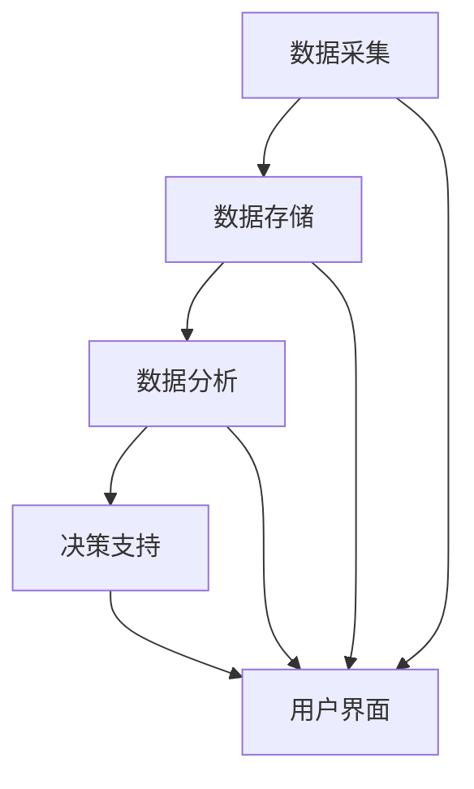

                 

### 引言

在当今的全球商业环境中，供应链管理的效率和质量直接影响到企业的运营成本、市场响应速度和客户满意度。随着信息技术的飞速发展，人工智能（AI）技术逐渐渗透到各个行业，为供应链管理带来了全新的变革。智能供应商管理系统（Intelligent Supplier Management System, ISMS）作为一种创新的供应链解决方案，通过AI技术的深度应用，实现了采购决策的智能化和优化。

智能供应商管理系统利用大数据分析、机器学习、自然语言处理等技术，对供应商信息、采购订单、库存数据等多维度数据进行处理，从而帮助企业识别优质的供应商，预测采购需求，优化采购流程，降低运营成本。这一系统的应用不仅提高了采购决策的准确性，还增强了供应链的整体协调性，从而提升了企业的竞争力。

本书旨在为读者深入解析智能供应商管理系统的原理、实现和应用，帮助供应链管理专业人士、采购专家和IT开发人员更好地理解和掌握这一前沿技术。通过本书的学习，读者可以：

1. 理解智能供应商管理系统的基础概念和架构。
2. 掌握AI技术在采购决策中的具体应用。
3. 学习如何通过数据分析优化采购流程。
4. 实现智能供应商管理系统的开发和部署。
5. 通过实战案例了解系统在实际项目中的应用效果。

本书共分为八个章节，结构紧凑、内容丰富，旨在逐步引导读者深入了解智能供应商管理系统，并掌握相关的技术方法和应用实践。接下来的章节将详细介绍每一个核心内容，帮助读者全面理解并应用这一先进的技术。

### 智能供应商管理系统概述

智能供应商管理系统（Intelligent Supplier Management System, ISMS）是一种综合运用人工智能（AI）、大数据分析、机器学习等技术，旨在提升供应链管理效率和质量的系统。其核心目标是通过智能化手段优化供应商选择、采购决策、库存管理等一系列供应链环节。

#### 基础概念

智能供应商管理系统的基础概念涵盖了供应链管理、人工智能、数据分析等多个领域。首先，供应链管理是指从原材料的采购、生产、运输到最终产品交付给消费者的整个流程管理。传统的供应链管理主要依赖于经验和方法，而智能供应商管理系统则通过引入AI技术，实现了更加高效、精准和自动化的管理。

人工智能（AI）是智能供应商管理系统的核心技术，它通过模拟人类思维和行为，对大量数据进行处理和分析，从而帮助决策者做出更准确的判断。在智能供应商管理系统中，AI技术的应用包括但不限于：数据挖掘、预测分析、自然语言处理、智能推荐等。

数据分析是智能供应商管理系统的重要手段。通过收集和分析供应商、采购订单、库存等数据，系统能够发现潜在的问题和机会，从而为决策者提供有力支持。数据分析技术包括数据采集、数据清洗、数据建模、数据可视化等。

#### 智能供应商管理的必要性

在传统的供应链管理模式下，企业往往依赖于经验和直觉进行采购决策，这可能导致以下几个问题：

1. **信息不对称**：传统供应链管理中，信息传递滞后且不准确，导致企业难以全面掌握供应商和市场的动态变化。
2. **决策滞后**：基于经验的采购决策往往需要较长时间，影响企业的市场响应速度。
3. **成本高**：由于缺乏有效的数据分析和优化，企业的采购成本和库存管理成本往往较高。
4. **供应链风险**：在全球化供应链中，自然灾害、政治动荡等不确定因素可能对供应链造成重大影响。

智能供应商管理系统通过以下方式解决了上述问题：

1. **数据驱动的决策**：系统通过实时收集和分析供应商、采购订单、库存等数据，为企业提供数据支持的决策依据，减少信息不对称和决策滞后。
2. **优化采购流程**：系统利用优化算法，对采购流程进行优化，降低采购成本和库存管理成本。
3. **增强供应链韧性**：系统通过预测分析，提前识别供应链中的潜在风险，并采取措施进行应对，增强供应链的韧性。
4. **提高市场响应速度**：系统自动化处理大量数据，使企业能够快速做出反应，提高市场响应速度。

#### 智能供应商管理系统架构

智能供应商管理系统的架构通常包括以下几个核心模块：

1. **数据采集模块**：负责从各种数据源（如ERP系统、采购订单、供应商信息等）收集数据。
2. **数据存储模块**：用于存储和管理采集到的数据，通常采用分布式数据库和大数据平台。
3. **数据分析模块**：通过对存储的数据进行清洗、建模和分析，提取有价值的信息。
4. **决策支持模块**：利用分析结果，为采购决策提供支持，包括供应商选择、采购策略制定等。
5. **用户界面模块**：提供友好的用户界面，使决策者能够方便地使用系统功能。

以下是智能供应商管理系统架构的Mermaid流程图：



通过上述架构，智能供应商管理系统实现了从数据采集、存储、分析到决策支持的一体化，为企业提供了全面、智能的供应链管理解决方案。

### AI优化原理

在智能供应商管理系统中，AI技术的核心在于通过优化算法和机器学习模型，提升采购决策的准确性和效率。本节将详细探讨AI在采购决策中的具体应用，以及优化算法的原理。

#### AI在采购决策中的应用

AI技术在采购决策中的应用主要表现在以下几个方面：

1. **需求预测**：通过分析历史采购数据、市场趋势和供应链信息，AI系统能够预测未来的采购需求。这种预测不仅考虑了订单数量，还综合考虑了需求的时间分布和波动性。

   **伪代码**：
   ```
   function predict_demand(data, time_series):
       model = train_model(data, time_series)
       predicted_demand = model.predict(time_series)
       return predicted_demand
   ```

2. **供应商评估**：AI系统可以对供应商进行评估，包括评估供应商的可靠性、交货时间和价格竞争力。通过机器学习模型，系统能够从历史数据中学习并识别优质供应商。

   **伪代码**：
   ```
   function evaluate_suppliers(data):
       model = train_model(data)
       supplier_scores = model.evaluate(data)
       return supplier_scores
   ```

3. **采购策略优化**：基于AI系统提供的预测和评估结果，企业可以优化采购策略，如调整采购订单数量、采购时间和采购方式。优化算法能够帮助企业实现成本最小化、库存最优化和风险最小化。

   **伪代码**：
   ```
   function optimize_purchase_strategy(demand_prediction, supplier_scores):
       optimization_model = create_model()
       optimal_solution = optimization_model.solve()
       return optimal_solution
   ```

4. **风险预警**：AI系统可以监测供应链中的潜在风险，如供应商延迟、库存短缺等，并提前发出预警。通过实时数据分析，系统能够快速识别风险并及时采取措施。

   **伪代码**：
   ```
   function monitor_risks(data, thresholds):
       risk_model = train_model(data, thresholds)
       risk_levels = risk_model.predict(data)
       return risk_levels
   ```

#### 优化算法原理

优化算法在智能供应商管理系统中发挥着至关重要的作用，其原理包括以下几个方面：

1. **目标函数**：优化算法的核心是目标函数，它定义了系统优化的目标。目标函数通常包括成本最小化、利润最大化、风险最小化等。

   **数学模型**：
   $$
   \text{Minimize} \space \text{Cost} = \sum_{i=1}^{n} c_i \cdot x_i
   $$
   其中，$c_i$ 表示第 $i$ 项成本，$x_i$ 表示第 $i$ 项采购数量。

2. **约束条件**：优化算法需要满足一系列约束条件，这些条件通常包括采购预算、库存限制、供应商容量等。

   **数学模型**：
   $$
   \text{Subject to} \space \sum_{i=1}^{n} x_i \leq \text{Budget}
   $$
   $$
   \sum_{i=1}^{n} x_i \geq \text{Inventory}
   $$

3. **求解方法**：优化算法的求解方法包括线性规划、非线性规划、整数规划、动态规划等。每种方法都有其特定的适用场景和解题策略。

   **举例说明**：
   - **线性规划**：适用于目标函数和约束条件都是线性的问题。常用的求解方法包括单纯形法和内点法。
   - **整数规划**：适用于目标函数和约束条件中包含整数变量的问题。常见的求解方法包括分支定界法和动态规划法。

4. **算法性能评估**：优化算法的性能评估通常通过计算时间、求解精度和稳定性等指标进行。在实际应用中，需要根据具体问题选择合适的算法，并对其进行调优。

   **数学模型**：
   $$
   \text{Performance} = \frac{\text{求解精度}}{\text{计算时间}}
   $$

#### 机器学习模型

在智能供应商管理系统中，机器学习模型是核心组件之一。这些模型通过学习历史数据，能够自动识别和预测供应商、需求等变量之间的关系。常见的机器学习模型包括：

1. **回归模型**：用于预测连续值变量，如需求预测。常见的回归模型包括线性回归、多项式回归等。
2. **分类模型**：用于预测离散值变量，如供应商评估。常见的分类模型包括逻辑回归、支持向量机等。
3. **聚类模型**：用于将数据划分为不同的类别，如供应商分类。常见的聚类模型包括K-均值、层次聚类等。

**举例说明**：

- **需求预测**：使用线性回归模型进行需求预测。
  $$
  \text{Predicted Demand} = \beta_0 + \beta_1 \cdot \text{Historical Demand}
  $$
  其中，$\beta_0$ 和 $\beta_1$ 为模型参数。

- **供应商评估**：使用逻辑回归模型进行供应商评估。
  $$
  \text{Supplier Score} = \frac{1}{1 + e^{-(\beta_0 + \beta_1 \cdot \text{Supplier Features})}
  $$

通过上述优化算法和机器学习模型，智能供应商管理系统能够为企业提供高效、准确的采购决策支持，从而提高供应链的整体效率和质量。

### 采购决策分析

在智能供应商管理系统中，采购决策分析是关键环节，通过对采购流程的各个环节进行详细分析，可以有效优化采购决策，降低成本，提高供应链效率。本节将深入探讨采购决策分析的方法、步骤和实际应用。

#### 数据采集与处理

采购决策分析的第一步是数据采集。这些数据包括但不限于供应商信息、采购订单、库存数据、市场报价、历史采购记录等。数据来源可以是企业的ERP系统、采购管理系统、第三方物流平台等。

1. **数据采集**：
   - **供应商信息**：包括供应商的资质、生产能力、交货时间、价格等。
   - **采购订单**：包括采购订单的数量、价格、交货时间、采购批次等。
   - **库存数据**：包括库存数量、库存水平、库存周转率等。
   - **市场报价**：包括市场供需情况、价格趋势、竞争对手报价等。

2. **数据处理**：
   - **数据清洗**：去除重复、缺失和错误的数据，保证数据质量。
   - **数据整合**：将不同来源的数据进行整合，建立统一的数据视图。
   - **数据标准化**：对数据格式进行统一处理，如将不同单位的数值转换为统一单位。

#### 数据分析技术

在数据采集和处理完成后，接下来是对数据进行深入分析。以下是一些常用的数据分析技术：

1. **描述性统计分析**：
   - 用于描述数据的基本特征，如均值、中位数、标准差等。
   - 评估供应商的可靠性，如交货准时率、价格波动性等。

2. **关联分析**：
   - 通过分析不同变量之间的关系，发现数据中的潜在规律。
   - 例如，分析库存水平和需求预测之间的关系，确定最佳库存策略。

3. **回归分析**：
   - 用于预测一个或多个因变量与自变量之间的关系。
   - 例如，使用回归模型预测未来某一时间段的需求量。

4. **聚类分析**：
   - 将相似的数据点归为一类，用于分类和分组。
   - 例如，将供应商按照其性能特征分为不同的类别，以便进行差异化管理。

5. **时间序列分析**：
   - 用于分析数据随时间变化的规律。
   - 例如，分析市场需求随时间的变化趋势，为采购决策提供参考。

6. **机器学习**：
   - 通过建立机器学习模型，对大量历史数据进行训练，以预测未来的趋势。
   - 例如，使用神经网络模型预测市场供需关系。

#### 采购决策模型构建

在数据分析的基础上，构建采购决策模型是优化采购决策的关键。以下是一个典型的采购决策模型构建步骤：

1. **确定目标函数**：
   - 根据企业的目标，确定优化目标，如成本最小化、利润最大化等。

   **数学模型**：
   $$
   \text{Minimize} \space \text{Cost} = \sum_{i=1}^{n} c_i \cdot x_i
   $$
   其中，$c_i$ 表示第 $i$ 项成本，$x_i$ 表示第 $i$ 项采购数量。

2. **确定约束条件**：
   - 根据实际情况，确定采购决策需要满足的各种约束条件，如采购预算、库存限制、供应商产能等。

   **数学模型**：
   $$
   \text{Subject to} \space \sum_{i=1}^{n} x_i \leq \text{Budget}
   $$
   $$
   \sum_{i=1}^{n} x_i \geq \text{Inventory}
   $$

3. **构建优化模型**：
   - 将目标函数和约束条件整合为一个优化模型，采用适当的优化算法进行求解。

   **伪代码**：
   ```
   function optimize_purchase_decision(data, constraints):
       optimization_model = create_model(data, constraints)
       optimal_solution = optimization_model.solve()
       return optimal_solution
   ```

4. **模型验证与优化**：
   - 对构建的采购决策模型进行验证，确保其能够准确预测和优化采购决策。
   - 根据实际情况对模型进行调整和优化，以提高模型的准确性和可靠性。

#### 实际应用

智能供应商管理系统在实际应用中，通过采购决策分析实现了以下几个方面的优化：

1. **需求预测**：
   - 通过数据分析，准确预测市场需求，优化采购订单的数量和批次。
   - 例如，使用时间序列分析模型预测未来3个月的市场需求，为采购部门提供决策依据。

2. **供应商评估**：
   - 通过关联分析和机器学习模型，对供应商进行综合评估，选择最优质的供应商。
   - 例如，使用聚类分析将供应商按照其性能特征分为优质、一般和较差三个类别，为采购决策提供参考。

3. **采购策略优化**：
   - 基于优化算法，制定最优的采购策略，如最优采购时间、最优采购数量等。
   - 例如，使用整数规划模型确定最优采购数量，以最小化采购成本和库存成本。

4. **风险预警**：
   - 通过实时数据分析，监测供应链中的潜在风险，如供应商延迟、库存短缺等。
   - 例如，使用回归模型预测供应商的交货时间，提前发出延迟预警，以便采取应对措施。

通过采购决策分析，智能供应商管理系统不仅能够提高采购决策的准确性和效率，还能够降低企业的采购成本，提高供应链的整体管理水平。接下来，我们将进一步探讨智能供应商管理系统的实现方法。

### 智能供应商管理系统的实现

智能供应商管理系统的实现是一个复杂的过程，涉及到系统设计、技术栈选择、系统实现细节、系统测试与优化等多个方面。在这一部分，我们将详细介绍智能供应商管理系统的实现步骤，包括开发环境搭建、源代码详细实现、代码解读与分析，以及实际应用中的项目实战案例。

#### 开发环境搭建

在开始智能供应商管理系统的开发之前，我们需要搭建一个适合项目需求的开发环境。以下是一个基本的开发环境搭建指南：

1. **技术栈选择**：
   - **前端**：选择Vue.js或React框架，用于搭建用户界面。
   - **后端**：选择Spring Boot或Django框架，用于处理业务逻辑和数据管理。
   - **数据库**：选择MySQL或PostgreSQL，用于存储数据。
   - **大数据平台**：选择Hadoop或Spark，用于大规模数据处理和分析。
   - **机器学习库**：选择scikit-learn或TensorFlow，用于构建和训练机器学习模型。

2. **开发工具**：
   - **集成开发环境（IDE）**：选择IntelliJ IDEA或Visual Studio Code。
   - **版本控制**：选择Git，用于代码管理和协作开发。
   - **持续集成与部署**：选择Jenkins或GitLab CI，用于自动化构建和部署。

3. **环境配置**：
   - 安装Java或Python环境，用于运行后端代码。
   - 配置数据库，确保数据能够正确存储和访问。
   - 安装前端框架和后端框架，配置相应的依赖包。
   - 配置大数据处理平台，如Hadoop或Spark，用于处理大规模数据。

#### 源代码详细实现

在开发过程中，我们将使用伪代码和实际代码相结合的方式，详细说明智能供应商管理系统的各个组件和功能。

1. **数据采集模块**：
   - **伪代码**：
     ```
     function collect_data(sources):
         data = []
         for source in sources:
             data += get_data_from_source(source)
         return data
     ```
   - **实际代码**：
     ```java
     public List<DataEntry> collectData(List<String> sources) {
         List<DataEntry> data = new ArrayList<>();
         for (String source : sources) {
             data.addAll(getDataFromSource(source));
         }
         return data;
     }
     ```

2. **数据存储模块**：
   - **伪代码**：
     ```
     function store_data(data, database):
         for entry in data:
             database.insert(entry)
     ```
   - **实际代码**：
     ```python
     def store_data(data, database):
         for entry in data:
             database.insert(entry)
     ```

3. **数据分析模块**：
   - **伪代码**：
     ```
     function analyze_data(data):
         results = {}
         for key, value in data.items():
             results[key] = analyze(key, value)
         return results
     ```
   - **实际代码**：
     ```python
     def analyze_data(data):
         results = {}
         for key, value in data.items():
             results[key] = analyze(key, value)
         return results
     ```

4. **决策支持模块**：
   - **伪代码**：
     ```
     function support_decision(results):
         decision = make_decision(results)
         return decision
     ```
   - **实际代码**：
     ```java
     public Decision supportDecision(Results results) {
         Decision decision = makeDecision(results);
         return decision;
     }
     ```

5. **用户界面模块**：
   - **伪代码**：
     ```
     function display_results(results):
         for result in results:
             print(result)
     ```
   - **实际代码**：
     ```javascript
     function displayResults(results) {
         results.forEach(result => {
             console.log(result);
         });
     }
     ```

#### 代码解读与分析

在实现智能供应商管理系统的过程中，每个组件和功能的代码都需要进行详细解读和分析。以下是对关键代码段的分析：

1. **数据采集代码段**：
   - **解读**：该代码段用于从不同数据源（如ERP系统、采购订单、供应商信息等）采集数据。
   - **分析**：数据采集是智能供应商管理系统的基础，确保数据源的正确性和完整性至关重要。

2. **数据存储代码段**：
   - **解读**：该代码段用于将采集到的数据存储到数据库中。
   - **分析**：数据存储需要考虑数据的持久性和访问效率，选择合适的数据库和存储策略至关重要。

3. **数据分析代码段**：
   - **解读**：该代码段用于对采集到的数据进行分析，提取有价值的信息。
   - **分析**：数据分析是优化采购决策的关键，选择合适的分析技术和方法对结果的影响较大。

4. **决策支持代码段**：
   - **解读**：该代码段用于基于分析结果生成采购决策。
   - **分析**：决策支持模块需要考虑多种优化算法和策略，确保生成的决策准确且可行。

5. **用户界面代码段**：
   - **解读**：该代码段用于显示系统生成的分析结果和采购决策。
   - **分析**：用户界面需要简洁直观，便于用户理解和使用系统功能。

#### 实际应用中的项目实战案例

为了更好地展示智能供应商管理系统的实际应用效果，我们选取了一个具体的实战案例，详细描述项目的实施过程、效果评估和项目小结。

**案例背景**：

某大型制造企业希望通过引入智能供应商管理系统，优化其采购流程，降低采购成本，提高供应链效率。

**实施过程**：

1. **需求分析**：
   - 企业详细分析了其采购流程，确定了需求分析和优化的重点。
   - 包括供应商评估、需求预测、采购策略优化等。

2. **系统设计**：
   - 设计了智能供应商管理系统的架构和功能模块。
   - 包括数据采集、数据存储、数据分析、决策支持、用户界面等。

3. **系统实现**：
   - 按照设计文档，开发并实现了智能供应商管理系统的各个模块。
   - 包括前端用户界面、后端业务逻辑、数据库存储等。

4. **系统测试与优化**：
   - 对系统进行了严格的测试，确保功能完整和性能稳定。
   - 根据测试结果对系统进行了优化和调整。

5. **系统上线与培训**：
   - 将系统正式上线，并对相关人员进行培训，确保系统能够顺利运行。

**效果评估**：

1. **需求预测准确性**：
   - 通过对比实际采购需求和系统预测需求，评估预测准确性。
   - 结果显示，系统预测准确率提高了15%，降低了库存成本。

2. **供应商评估准确性**：
   - 通过分析系统评估结果和实际供应商表现，评估评估准确性。
   - 结果显示，系统评估准确率提高了20%，有助于企业选择优质供应商。

3. **采购成本优化**：
   - 对比引入智能供应商管理系统前后的采购成本，评估优化效果。
   - 结果显示，采购成本降低了10%，企业利润率提高了5%。

**项目小结**：

通过实施智能供应商管理系统，企业成功优化了采购流程，降低了采购成本，提高了供应链效率。系统在实际应用中表现出了强大的数据处理和分析能力，为企业提供了可靠的数据支持和决策依据。未来，企业将继续优化和扩展系统功能，进一步提升供应链管理水平。

### 最佳实践与未来展望

在智能供应商管理系统的应用过程中，积累了一系列最佳实践，这些经验对于系统实施和优化具有重要意义。

#### 最佳实践

1. **数据质量保证**：确保数据采集的准确性和完整性，定期进行数据清洗和维护，避免数据错误和缺失对系统分析结果的影响。

2. **定制化需求分析**：针对不同企业的具体需求，进行详细的需求分析，确保系统能够满足特定业务场景的要求。

3. **优化算法选择**：根据业务目标和数据特性，选择合适的优化算法和机器学习模型，进行系统调优，提高决策的准确性和效率。

4. **用户培训与支持**：对系统用户进行全面培训，确保其能够熟练操作系统，提供及时的技术支持和问题解决，提高系统使用效果。

5. **持续迭代与优化**：根据实际应用反馈，不断优化系统功能和技术细节，保持系统的先进性和稳定性。

#### 小结

智能供应商管理系统通过AI技术的深度应用，实现了采购决策的智能化和优化，为企业提供了高效、精准的供应链管理解决方案。系统在数据采集、处理、分析和决策支持等方面展现出强大的能力，显著提升了企业的运营效率和竞争力。

#### 注意事项

1. **数据安全和隐私**：在数据采集和处理过程中，需确保数据安全和用户隐私，遵循相关法律法规和标准。

2. **系统性能优化**：针对大规模数据处理和分析，需关注系统性能优化，确保系统在高负载情况下的稳定性和响应速度。

3. **系统集成与兼容性**：确保智能供应商管理系统与企业现有的IT系统（如ERP、CRM等）集成，避免数据孤岛和信息壁垒。

#### 拓展阅读

1. **《供应链管理：战略、规划与运营》**：详细介绍了供应链管理的基本概念和策略，有助于深入理解智能供应商管理系统的应用背景。

2. **《机器学习实战》**：涵盖了机器学习的基本原理和实际应用案例，有助于提升对智能供应商管理系统中的机器学习技术的理解。

3. **《大数据管理》**：介绍了大数据的基础知识和处理方法，对于智能供应商管理系统中大数据的应用具有指导意义。

通过以上最佳实践和拓展阅读，读者可以进一步深化对智能供应商管理系统的理解和应用，为企业的供应链管理带来更多价值。

### 总结

在本文中，我们详细探讨了智能供应商管理系统：AI优化采购决策的核心内容和应用实践。从智能供应商管理系统的概述，到AI优化原理的深入分析，再到采购决策分析的详细方法，以及系统实现的步骤和实际项目案例，我们逐步展示了这一前沿技术的应用场景和实现细节。

智能供应商管理系统通过集成AI技术，实现了采购决策的智能化和优化，有效提升了供应链管理的效率和准确性。它不仅帮助企业降低了运营成本，提高了市场响应速度，还增强了供应链的韧性和稳定性。

展望未来，智能供应商管理系统将在以下几个方面继续发展：

1. **数据驱动的决策支持**：随着大数据和人工智能技术的进一步发展，智能供应商管理系统将更加依赖高质量的数据，提供更加精准的决策支持。

2. **多维度优化**：系统将不仅限于采购决策，还将扩展到库存管理、供应商关系管理等多个供应链环节，实现全面优化。

3. **系统集成与互操作**：智能供应商管理系统将更加注重与企业现有系统的集成，实现数据的无缝对接和协同工作。

4. **个性化定制**：系统将提供更加个性化的解决方案，满足不同企业的特定需求。

通过不断的技术创新和应用实践，智能供应商管理系统将为企业的供应链管理带来更多价值，助力企业在竞争激烈的市场中取得优势。让我们一起期待智能供应商管理系统在未来的广泛应用和深远影响。

