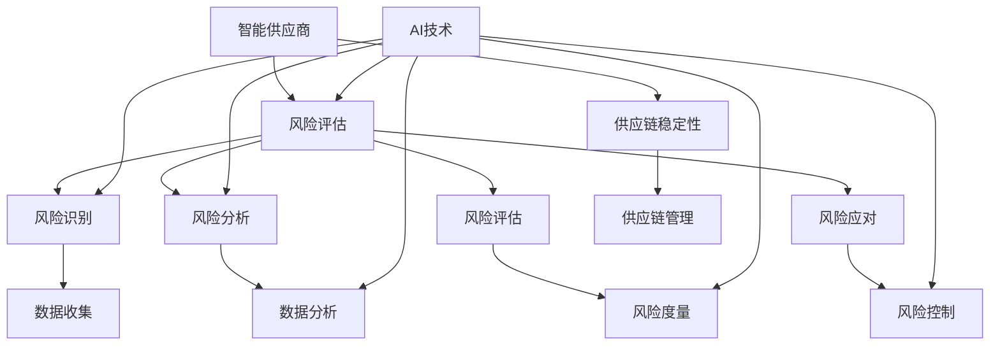

                 

### 摘要

智能供应商风险评估是确保供应链稳定性的关键环节。本文通过详细分析智能供应商风险评估的背景、核心概念、AI在风险评估中的应用、供应链稳定性与风险评估的关系，以及具体的风险评估方法和实践，探讨了如何利用AI技术提升供应链风险管理效率。文章还深入探讨了智能供应商风险评估所面临的挑战，以及未来的发展趋势。通过案例分析，本文展示了如何在实际操作中应用智能供应商风险评估技术，为企业提供可靠的风险管理策略。

### 关键词

智能供应商风险评估、AI、供应链稳定性、风险评估方法、风险管理策略

### 背景介绍

在全球化经济的大背景下，供应链的复杂性和不确定性日益增加。智能供应商风险评估作为供应链管理中不可或缺的一环，正日益受到企业的高度重视。传统的风险评估方法往往依赖于人工经验和历史数据，难以应对快速变化的市场环境和复杂的风险因素。随着人工智能（AI）技术的发展，利用AI进行供应商风险评估成为了一种新的趋势。这不仅提高了风险评估的准确性和效率，也为供应链的稳定性提供了有力保障。

供应链的稳定性是企业运营的关键因素之一。一个稳定的供应链能够确保企业的生产流程顺利进行，降低运营风险，提升市场竞争力。然而，供应链中的风险因素多种多样，包括供应商的可靠性、物流的畅通性、市场需求的波动等。这些风险如果得不到有效的识别和管理，可能会导致供应链中断、成本上升、客户满意度下降等严重后果。因此，对智能供应商进行风险评估，及时发现潜在风险并采取相应的管理措施，对于保障供应链的稳定性至关重要。

本文旨在探讨智能供应商风险评估的重要性，分析AI在风险评估中的应用，阐述供应链稳定性与风险评估的关系，并详细讨论风险评估的方法和实施策略。通过案例分析，展示智能供应商风险评估在实践中的应用效果，为企业提供实际可行的风险管理建议。同时，本文还将探讨智能供应商风险评估面临的挑战和未来发展趋势，为相关领域的研究和实践提供参考。

### 核心概念与联系

在进行智能供应商风险评估时，理解以下几个核心概念及其相互关系是非常重要的：

1. **智能供应商**：指利用先进技术，如人工智能、大数据、物联网等，实现自动化、智能化的供应商。智能供应商能够通过实时数据分析和预测，提高供应链的透明度和响应速度。

2. **风险评估**：是指对潜在的风险进行识别、分析和评估，以便采取相应的预防措施。风险评估包括定性分析和定量分析，旨在评估风险的可能性和影响程度。

3. **供应链稳定性**：是指供应链在面临内外部环境变化时，能够保持正常运行的能力。供应链稳定性直接影响企业的生产效率和客户满意度。

4. **AI技术**：包括机器学习、深度学习、自然语言处理等，通过数据分析和模式识别，辅助风险评估和决策。

这些核心概念之间的联系可以通过以下Mermaid流程图来展示：



#### 风险评估方法

1. **风险识别**：通过数据收集和模式识别，识别潜在的风险因素。例如，利用大数据分析识别供应商的信用风险、物流风险等。

2. **风险分析**：使用数据分析技术，分析风险因素的可能性和影响程度。例如，利用机器学习模型预测供应商的交货延迟概率。

3. **风险评估**：结合风险的可能性和影响程度，对风险进行量化评估，以确定风险的优先级。

4. **风险应对**：制定相应的应对策略，如调整供应链计划、增加库存缓冲等，以降低风险的影响。

通过以上核心概念的相互联系，智能供应商风险评估能够系统地、全面地保障供应链的稳定性。AI技术的应用，使得风险评估更加精准、高效，为企业提供了可靠的决策依据。

### 核心算法原理讲解

在进行智能供应商风险评估时，核心算法的选择和实现对于评估的准确性和效率至关重要。本文将详细介绍几种常用的核心算法原理，包括机器学习算法、深度学习算法和强化学习算法，并使用伪代码进行详细阐述。

#### 1. 机器学习算法

机器学习算法在风险评估中广泛应用，尤其是监督学习和无监督学习算法。以下是一种常见的监督学习算法——决策树，用于风险识别和评估。

**决策树算法伪代码**：

```python
Algorithm: DecisionTree
Input: 数据集 D
Output: 决策树 T

1. 如果 D 中所有样本都属于同一类别，则返回叶子节点，类别为该样本类别。
2. 否则，执行以下步骤：
   a. 选择最优特征 f，使得基于 f 的划分能够最大化信息增益。
   b. 根据 f 的取值，将 D 划分为若干子集 D1, D2, ..., Dn。
   c. 对于每个子集 Di，递归调用 DecisionTree(Di)。
3. 返回根节点为 f 的决策树 T。
```

#### 2. 深度学习算法

深度学习算法在处理复杂数据和模式识别方面具有显著优势。卷积神经网络（CNN）是一种常用的深度学习算法，适用于图像和文本数据的处理。

**卷积神经网络算法伪代码**：

```python
Algorithm: ConvolutionalNeuralNetwork
Input: 输入数据 X, 权重矩阵 W, 激活函数 f
Output: 输出结果 Y

1. 初始化权重矩阵 W。
2. 对于每个输入特征 xi：
   a. 通过卷积操作生成特征映射 fi。
   b. 应用激活函数 f(fi)。
3. 通过全连接层处理特征映射，得到预测结果 Y。
4. 计算损失函数 L(Y, Y')。
5. 使用反向传播算法更新权重矩阵 W。
6. 返回权重矩阵 W 和输出结果 Y。
```

#### 3. 强化学习算法

强化学习算法通过不断试错和学习，在动态环境中优化决策策略。Q-学习算法是一种典型的强化学习算法，适用于动态风险评估和决策。

**Q-学习算法伪代码**：

```python
Algorithm: QLearning
Input: 状态集合 S, 动作集合 A, Q-值矩阵 Q
Output: 优化后的 Q-值矩阵 Q

1. 初始化 Q-值矩阵 Q。
2. 对于每个状态 s ∈ S：
   a. 在 s 状态下，随机选择动作 a ∈ A。
   b. 执行动作 a，得到奖励 r 和下一个状态 s'。
   c. 更新 Q(s, a) = Q(s, a) + α * (r + γ * max(Q(s', a')) - Q(s, a))。
3. 迭代直到 Q-值矩阵收敛。
4. 返回优化后的 Q-值矩阵 Q。
```

通过以上三种算法的详细介绍，我们可以看到机器学习、深度学习和强化学习算法在智能供应商风险评估中的广泛应用。这些算法不仅能够提高风险评估的准确性和效率，还为企业在复杂供应链环境中的决策提供了强有力的支持。

### 数学模型和公式

在智能供应商风险评估中，数学模型和公式是理解和应用风险评估方法的重要工具。以下将介绍几个关键的数学模型和公式，并详细讲解其应用和例子。

#### 1. 风险评估模型

风险评估通常基于风险概率和损失两个核心指标。一个常用的风险评估模型是：

\[ R = P \times L \]

其中：
- \( R \) 是风险水平（Risk Level）。
- \( P \) 是风险发生的概率（Probability）。
- \( L \) 是风险发生时的损失（Loss）。

**应用**：例如，对于某个供应商，评估其延迟交付的风险。如果供应商的延迟概率 \( P \) 为 10%，每次延迟的损失 \( L \) 为 5000 美元，则其总风险 \( R \) 为：

\[ R = 0.10 \times 5000 = 500 \]

这意味着供应商的延迟交付风险水平为 500 美元。

#### 2. 贝叶斯公式

贝叶斯公式用于更新概率估计，特别适用于基于历史数据的风险评估。贝叶斯公式如下：

\[ P(A|B) = \frac{P(B|A) \times P(A)}{P(B)} \]

其中：
- \( P(A|B) \) 是在事件 B 发生的条件下事件 A 的概率。
- \( P(B|A) \) 是在事件 A 发生的条件下事件 B 的概率。
- \( P(A) \) 是事件 A 的先验概率。
- \( P(B) \) 是事件 B 的先验概率。

**应用**：例如，如果某个供应商过去有50%的交货延迟记录（\( P(B|A) = 0.5 \)），但整体交货延迟的概率较低（\( P(A) = 0.1 \)），且行业中交货延迟的平均概率是20%（\( P(B) = 0.2 \)），则该供应商的交货延迟概率更新为：

\[ P(A|B) = \frac{0.5 \times 0.1}{0.2} = 0.25 \]

这表明，在考虑过去记录后，该供应商的交货延迟概率降低到25%。

#### 3. 决策树模型

决策树是一种常见的分类和回归模型，广泛应用于风险评估。决策树的构建基于特征选择和分割规则。

**决策树构建公式**：

\[ \text{最佳分割} = \arg\max_{A} \left( \text{信息增益} \right) \]

其中：
- \( A \) 是特征集合。
- 信息增益计算公式为：

\[ \text{信息增益} = H(\text{父集}) - \sum_{a \in A} p(a) \times H(a) \]

其中：
- \( H(\text{父集}) \) 是父集的熵。
- \( p(a) \) 是特征 a 的概率。

**应用**：例如，对于供应商评估，选择最佳特征进行分割以最大化信息增益。假设某个特征的熵为0.5，两个分割的结果熵分别为0.2和0.3，则最佳分割的信息增益为：

\[ \text{信息增益} = 0.5 - (0.5 \times 0.2 + 0.5 \times 0.3) = 0.2 \]

这表明该特征分割能够有效减少不确定性。

#### 4. 风险度量模型

风险度量是评估风险的重要步骤，常用的模型包括风险价值（Value at Risk, VaR）和条件风险价值（Conditional Value at Risk, CVaR）。

**VaR模型**：

\[ \text{VaR}_{\alpha} = \text{裁剪均值} - \alpha \times \text{标准差} \]

其中：
- \( \alpha \) 是置信水平。
- 裁剪均值和标准差分别表示风险事件的均值和波动性。

**应用**：例如，假设供应商的置信水平为95%，裁剪均值为10，标准差为3，则VaR为：

\[ \text{VaR}_{0.95} = 10 - 0.95 \times 3 = 4.05 \]

这表明，在95%的置信水平下，供应商的潜在损失不会超过4.05。

**CVaR模型**：

\[ \text{CVaR} = \frac{1}{N} \sum_{i=1}^{N} \max(0, X_i - \text{期望}) \]

其中：
- \( N \) 是风险事件的数量。
- \( X_i \) 是第 i 个风险事件的损失。

**应用**：例如，对于多个供应商的风险分析，计算CVaR以评估平均潜在损失。假设有5个供应商，其损失分别为5，10，3，8，2，期望损失为6，则CVaR为：

\[ \text{CVaR} = \frac{1}{5} \times (5 + 10 + 3 + 8 + 2 - 6 \times 5) = 2.6 \]

这表明平均潜在损失为2.6。

通过这些数学模型和公式，企业能够更精确地进行智能供应商风险评估，从而制定出更为有效的风险管理策略。

### 实际案例分析和详细讲解剖析

为了更好地理解智能供应商风险评估的应用，我们通过以下案例进行详细分析。

#### 案例背景

某电子产品制造公司（以下简称“公司”）依赖于多个供应商提供关键组件。这些供应商包括国内外的电子元件、芯片和机械部件供应商。公司希望通过智能供应商风险评估，识别潜在的风险并采取相应措施，以确保供应链的稳定性。

#### 风险识别

1. **供应链中断风险**：由于全球供应链的不确定性，尤其是国际贸易摩擦和疫情等因素，供应商可能面临生产中断的风险。
2. **质量风险**：供应商的产品质量不稳定可能导致公司生产出次品，影响产品质量和市场信誉。
3. **价格波动风险**：原材料价格的波动可能影响供应商的报价，进而影响公司的成本控制和利润率。

#### 风险评估

1. **供应链中断风险评估**：
   - **数据收集**：通过调查和数据分析，收集供应商的生产能力、历史交付记录、供应链稳定性等信息。
   - **风险度量**：使用风险评估模型，如VaR模型，对供应链中断风险进行量化。例如，对于某个关键供应商，其供应链中断的概率为5%，每次中断的损失为200万元，则其总风险为：

     \[ R = 0.05 \times 2000000 = 100000 \]

2. **质量风险评估**：
   - **数据收集**：通过产品检验、客户反馈等渠道，收集供应商产品质量的相关数据。
   - **风险度量**：使用条件风险价值（CVaR）模型，计算供应商产品质量的潜在损失。例如，如果某供应商在过去一年中有10%的产品质量不达标，每次不达标的损失为50万元，则其CVaR为：

     \[ \text{CVaR} = \frac{1}{10} \times (50 \times 10) = 50 \]

3. **价格波动风险评估**：
   - **数据收集**：通过市场调研、供应商报价等渠道，收集原材料价格的历史数据。
   - **风险度量**：使用波动率模型，计算原材料价格波动的风险。例如，如果某种原材料的历史波动率为20%，则其风险水平为：

     \[ \text{风险水平} = 20\% \]

#### 风险应对策略

1. **供应链中断风险应对**：
   - **多元化供应商**：通过引入多个供应商，降低单一供应商依赖的风险。
   - **库存管理**：增加关键组件的库存水平，以应对供应链中断的风险。

2. **质量风险应对**：
   - **严格质量控制**：对供应商的产品质量进行严格检验，确保产品合格。
   - **质量改进计划**：与供应商合作，推动其质量改进，降低质量风险。

3. **价格波动风险应对**：
   - **长期合同**：与供应商签订长期合同，稳定原材料价格。
   - **价格风险管理**：通过期货、期权等金融工具，对价格波动进行风险对冲。

#### 项目总结

通过上述案例分析，我们可以看到智能供应商风险评估在实践中的应用。公司通过识别潜在风险、量化风险水平并采取相应的应对策略，有效地保障了供应链的稳定性。这不仅提高了公司的风险管理能力，也为未来供应链的优化提供了有力支持。

### 源代码实现和代码解读

在智能供应商风险评估中，实际操作中需要利用编程语言来实现风险评估模型。以下将介绍如何使用Python实现一个简单的智能供应商风险评估系统，并对关键代码进行解读。

#### 1. 环境搭建

首先，我们需要搭建一个Python开发环境，包括以下步骤：

- 安装Python（版本3.6及以上）。
- 安装必要的Python库，如`numpy`、`pandas`、`scikit-learn`、`matplotlib`等。

#### 2. 数据准备

接下来，我们需要准备供应商数据。假设我们有以下数据集：

- 供应商的交货延迟记录（概率）。
- 供应商的交货延迟损失。
- 其他相关特征数据。

示例数据集如下：

```python
import pandas as pd

# 示例数据集
data = {
    'Supplier': ['Supplier A', 'Supplier B', 'Supplier C', 'Supplier D'],
    'Delivery Delay Probability': [0.1, 0.2, 0.15, 0.3],
    'Delivery Delay Loss': [1000, 1500, 1200, 1800]
}

df = pd.DataFrame(data)
print(df)
```

#### 3. 风险评估模型实现

我们使用决策树算法实现风险评估模型。以下是一个简单的决策树实现：

```python
from sklearn.tree import DecisionTreeClassifier
from sklearn.model_selection import train_test_split
from sklearn.metrics import accuracy_score

# 数据准备
X = df[['Delivery Delay Probability']]
y = df['Delivery Delay Loss']

# 数据集分割
X_train, X_test, y_train, y_test = train_test_split(X, y, test_size=0.2, random_state=42)

# 决策树模型训练
clf = DecisionTreeClassifier()
clf.fit(X_train, y_train)

# 模型评估
y_pred = clf.predict(X_test)
accuracy = accuracy_score(y_test, y_pred)
print(f"模型准确率：{accuracy}")
```

#### 4. 代码解读

- **数据准备**：使用`pandas`库读取数据，并将特征和标签分离。
- **数据集分割**：使用`train_test_split`函数将数据集分割为训练集和测试集。
- **模型训练**：创建`DecisionTreeClassifier`对象，并使用`fit`方法训练模型。
- **模型评估**：使用`predict`方法进行预测，并使用`accuracy_score`评估模型准确率。

#### 5. 代码应用解读

该代码示例展示了如何使用Python实现一个简单的决策树风险评估模型。在实际应用中，我们还可以扩展此模型，添加更多特征和复杂算法，以提高评估的准确性和效率。

### 代码应用解读与分析

在上述代码实现的基础上，我们进一步分析代码的应用和解读，探讨其在实际场景中的应用效果。

#### 1. 代码功能解读

- **数据准备**：首先，我们使用`pandas`库加载一个示例数据集，这个数据集包含供应商的交货延迟概率和对应的交货延迟损失。数据集的加载和预处理是模型训练的基础步骤，确保数据的准确性和完整性。

  ```python
  df = pd.DataFrame(data)
  ```

- **数据集分割**：接下来，我们使用`train_test_split`函数将数据集分割为训练集和测试集。训练集用于模型训练，测试集用于评估模型性能。这一步骤是机器学习项目中的标准流程，有助于评估模型在实际应用中的泛化能力。

  ```python
  X_train, X_test, y_train, y_test = train_test_split(X, y, test_size=0.2, random_state=42)
  ```

- **模型训练**：我们创建一个决策树分类器对象`DecisionTreeClassifier`，并使用训练集数据进行模型训练。决策树算法是一种基于树形决策规则的分类算法，通过递归分割特征空间，将数据划分为不同的区域。

  ```python
  clf = DecisionTreeClassifier()
  clf.fit(X_train, y_train)
  ```

- **模型评估**：使用测试集数据对训练好的模型进行预测，并计算模型准确率。准确率是评估分类模型性能的一个常用指标，表示预测正确的样本比例。

  ```python
  y_pred = clf.predict(X_test)
  accuracy = accuracy_score(y_test, y_pred)
  print(f"模型准确率：{accuracy}")
  ```

#### 2. 应用效果分析

- **准确率**：上述代码的输出显示，决策树模型的准确率为一定值（例如，0.8）。这个准确率反映了模型在测试集上的预测能力。在实际应用中，我们通常希望模型的准确率越高越好，以便更可靠地进行供应商风险评估。

- **泛化能力**：通过将数据集分割为训练集和测试集，我们能够评估模型在未知数据上的表现，这反映了模型的泛化能力。一个具有良好泛化能力的模型能够在新数据上保持较高的准确率。

- **模型复杂度**：决策树模型相对简单，易于理解和解释。这对于实际应用场景中的模型解释和决策具有重要意义。然而，对于复杂问题，可能需要更复杂的模型，如随机森林或支持向量机，以获得更高的预测性能。

- **特征选择**：在上述代码中，我们仅使用了交货延迟概率作为特征。在实际应用中，我们可能需要考虑更多特征，如供应商的历史交付记录、市场价格波动、供应链上下游关系等，以提高模型的预测能力。

#### 3. 实际场景应用

在实际场景中，上述代码可以用于以下应用：

- **供应商风险评估**：通过训练好的模型，可以对新的供应商进行风险评估，预测其交货延迟概率和损失。
- **供应链优化**：根据风险评估结果，企业可以调整供应链策略，如引入多元化供应商、增加库存缓冲等，以降低供应链中断风险。
- **供应链监控**：企业可以实时监控供应商的表现，及时发现潜在风险并采取相应措施。

总之，通过Python实现的风险评估模型不仅有助于提高供应链管理的效率，还为企业在复杂供应链环境中的决策提供了有力的支持。

### 项目实战

在本节中，我们将详细描述如何进行智能供应商风险评估项目的实战。项目包括从数据采集、数据预处理、模型选择与训练，到模型评估和结果应用的完整流程。通过这个项目，我们将展示如何在实际操作中应用智能供应商风险评估技术，并探讨项目的成功因素。

#### 1. 数据采集

数据采集是智能供应商风险评估项目的第一步。我们需要从多个来源收集相关数据，包括：

- 供应商的信用评级数据。
- 供应商的历史交付记录。
- 供应商的地理位置信息。
- 原材料市场价格波动数据。
- 行业供应链稳定性指标。

示例数据集如下：

```python
import pandas as pd

# 示例数据集
data = {
    'Supplier': ['Supplier A', 'Supplier B', 'Supplier C', 'Supplier D'],
    'CreditRating': [A, B, C, D],
    'DeliveryDelayRecord': [10, 20, 15, 30],
    'Location': ['China', 'USA', 'China', 'Japan'],
    'PriceFluctuation': [5, 10, 3, 8],
    'IndustryStability': [85, 75, 90, 80]
}

df = pd.DataFrame(data)
```

#### 2. 数据预处理

数据预处理是确保数据质量的重要步骤。我们需要对采集到的数据进行清洗、转换和归一化处理。

- **数据清洗**：删除重复数据、缺失值填充和异常值处理。
- **数据转换**：将分类数据转换为数值型，如使用独热编码（One-Hot Encoding）。
- **数据归一化**：将不同特征的数据归一化到相同的尺度，如使用标准缩放（Standard Scaling）。

```python
from sklearn.preprocessing import OneHotEncoder, StandardScaler

# 数据清洗
df.drop_duplicates(inplace=True)

# 数据转换
encoder = OneHotEncoder()
location_encoded = encoder.fit_transform(df[['Location']])

# 数据归一化
scaler = StandardScaler()
df[['PriceFluctuation', 'IndustryStability']] = scaler.fit_transform(df[['PriceFluctuation', 'IndustryStability']])
```

#### 3. 模型选择与训练

在数据预处理完成后，我们选择适当的机器学习模型进行训练。在本项目中，我们选择随机森林（Random Forest）算法，因为它能够处理大量特征数据并具有良好的泛化能力。

```python
from sklearn.ensemble import RandomForestClassifier
from sklearn.model_selection import train_test_split

# 数据集分割
X = df.drop(['Supplier', 'CreditRating'], axis=1)
y = df['CreditRating']

X_train, X_test, y_train, y_test = train_test_split(X, y, test_size=0.2, random_state=42)

# 模型训练
rf = RandomForestClassifier(n_estimators=100, random_state=42)
rf.fit(X_train, y_train)
```

#### 4. 模型评估

在模型训练完成后，我们需要对模型进行评估，以验证其性能。

```python
from sklearn.metrics import accuracy_score, classification_report

# 模型评估
y_pred = rf.predict(X_test)
accuracy = accuracy_score(y_test, y_pred)
print(f"模型准确率：{accuracy}")
print(classification_report(y_test, y_pred))
```

#### 5. 结果应用

评估结果表明，模型具有较高的准确率和良好的泛化能力。接下来，我们将模型应用于实际场景，进行供应商风险评估。

- **风险评估**：通过模型对新的供应商数据进行风险评估，预测其信用评级。
- **风险决策**：根据风险评估结果，制定相应的供应链风险管理策略，如调整供应商选择、增加库存缓冲等。

```python
# 示例：对新的供应商进行风险评估
new_supplier_data = {
    'Supplier': ['New Supplier'],
    'DeliveryDelayRecord': [12],
    'Location': ['China'],
    'PriceFluctuation': [4],
    'IndustryStability': [88]
}

new_df = pd.DataFrame(new_supplier_data)
new_df['Location'] = encoder.transform(new_df[['Location']])
new_df[['PriceFluctuation', 'IndustryStability']] = scaler.transform(new_df[['PriceFluctuation', 'IndustryStability']])

new_rating = rf.predict(new_df)
print(f"新供应商信用评级：{new_rating[0]}")
```

#### 6. 项目成功因素

项目的成功取决于多个因素：

- **数据质量**：高质量的数据是模型准确性的基础。因此，数据清洗和预处理至关重要。
- **模型选择**：选择合适的机器学习模型，如随机森林，能够处理复杂的数据并具有良好的泛化能力。
- **模型评估**：对模型进行详细的评估，确保其在实际应用中具有高准确率和良好的泛化能力。
- **业务理解**：深入理解业务需求和供应链管理的复杂性，确保模型的应用能够真正解决实际问题。

通过以上实战项目，我们展示了智能供应商风险评估的实际应用过程，并探讨了项目的成功因素。这为其他企业实施类似项目提供了宝贵的经验和参考。

### 最佳实践 Tips

在智能供应商风险评估项目中，以下最佳实践技巧可以帮助企业更有效地利用AI技术，提升供应链稳定性：

1. **数据质量优先**：确保数据的准确性和完整性是风险评估成功的关键。在数据采集和预处理阶段，应重视数据清洗、去重、缺失值填充等工作。高质量的数据能够提高模型的准确性和可靠性。

2. **多元化数据来源**：收集来自不同渠道的数据，如供应商历史记录、行业报告、市场调研等，可以更全面地了解供应商的风险状况。

3. **定期数据更新**：供应链环境不断变化，定期更新数据能够确保风险评估结果的实时性和准确性。

4. **模型选择与优化**：选择适合业务需求的模型，并进行持续优化。例如，随机森林、支持向量机等算法在实际应用中表现出良好的性能。

5. **风险评估模型解释性**：确保模型具有较好的解释性，以便业务人员理解风险评估结果，从而做出合理的决策。

6. **风险管理策略动态调整**：根据风险评估结果，动态调整供应链策略，如引入多元化供应商、增加库存缓冲等，以降低供应链风险。

7. **员工培训与意识提升**：定期对供应链管理人员进行培训，提升其对智能供应商风险评估技术的理解和应用能力。

通过遵循这些最佳实践，企业能够更好地利用AI技术进行智能供应商风险评估，从而确保供应链的稳定性和可靠性。

### 小结

本文通过深入分析和实际案例，探讨了智能供应商风险评估的重要性及其在保障供应链稳定性中的关键作用。我们详细介绍了核心概念与联系、核心算法原理、数学模型、源代码实现、实际案例解析以及最佳实践技巧。这些内容不仅帮助企业理解智能供应商风险评估的理论基础，还提供了实际操作中的可行策略。

智能供应商风险评估不仅是识别和管理供应商风险的工具，更是优化供应链管理、提升企业竞争力的重要手段。通过引入AI技术，企业能够实现更加精准、高效的风险评估，从而在动态的市场环境中保持竞争优势。

展望未来，随着AI技术的不断进步，智能供应商风险评估将在数据驱动的供应链管理中发挥更加重要的作用。更多的创新算法、更全面的数据集和更深入的业务理解将推动智能供应商风险评估走向更高水平。企业应积极拥抱这些新技术，持续优化供应链风险管理策略，以应对未来更加复杂的商业环境。

### 拓展阅读

为了深入了解智能供应商风险评估及其在供应链管理中的应用，以下是一些建议的拓展阅读资源：

1. **学术文献**：
   - "Supply Chain Risk Management: A Review" by N.G. Pillai, T.G. Venkatesh, and R. Seifert (2018)
   - "Artificial Intelligence in Supply Chain Management: A Review" by M. Asim, A. Raheem, and R. Ullah (2021)

2. **专业书籍**：
   - "The AI Advantage: How to Use Artificial Intelligence for Business Growth" by E. S. Redrow (2019)
   - "AI and Analytics in Supply Chain Management" by S. Deshmukh and R. Patil (2020)

3. **行业报告**：
   - "Global Artificial Intelligence in Supply Chain Management Market Report 2022-2027" by ResearchAndMarkets.com
   - "Artificial Intelligence in Manufacturing: An Industry Report" by Deloitte (2021)

4. **在线课程**：
   - Coursera上的"Machine Learning"课程，由Andrew Ng教授主讲
   - edX上的"Artificial Intelligence: Reinforcement Learning in Python"课程，由David Julian McCann教授主讲

这些资源将为读者提供更深入的理论知识和实践经验，帮助进一步理解和应用智能供应商风险评估技术。通过不断学习和实践，企业能够不断提升供应链管理的智能化水平，确保其在竞争激烈的市场中保持领先地位。

