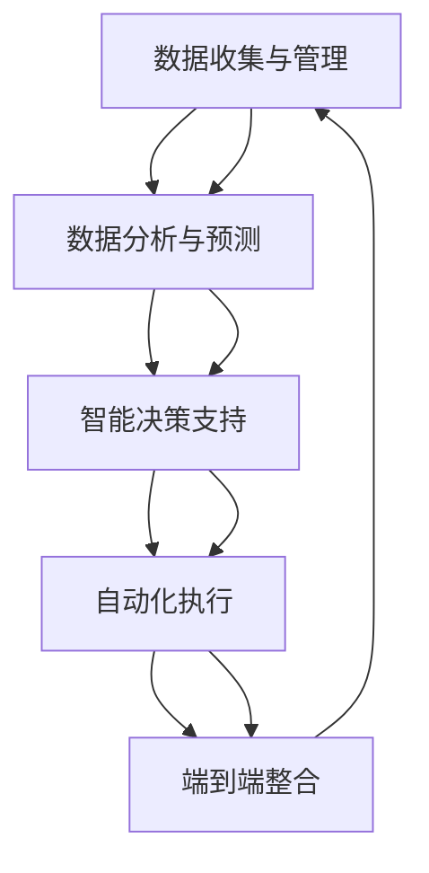

                 

### 文章标题

《智能供应链优化引擎：AI提升端到端效率》

### 关键词

智能供应链，AI优化，端到端效率，算法原理，项目实战，数学模型

### 摘要

随着全球商业环境的不断变化和竞争的加剧，智能供应链的优化已成为企业提升竞争力的重要手段。本文将深入探讨智能供应链的核心理念，通过介绍AI技术在供应链优化中的应用，解析关键算法原理和数学模型，并提供实际项目案例，以展示AI如何提升供应链的端到端效率。通过阅读本文，读者将获得对智能供应链优化的全面理解，并掌握将AI技术应用于供应链管理的实际方法。

---

### 引言

在全球化和信息化的大背景下，供应链管理已经成为企业运营中的关键环节。随着市场竞争的日益激烈，企业不仅需要确保原材料和产品的及时供应，还必须追求成本的最优化和效率的提升。传统供应链管理往往依赖于人工经验和规则性操作，这导致了一系列问题，如响应速度慢、库存管理不当、资源浪费等。为了应对这些挑战，现代企业开始将人工智能（AI）技术引入供应链管理，以期实现智能化、自动化和端到端的效率提升。

智能供应链优化引擎是将AI技术与供应链管理深度融合的产物，它通过数据驱动的决策支持系统，实现供应链各个环节的实时监控和智能调度。AI技术的引入，不仅提升了供应链的透明度和灵活性，还显著提高了资源利用率和响应速度。本文旨在详细探讨智能供应链优化引擎的构建方法，分析AI技术在供应链优化中的应用，并通过实际案例展示其效果。

### 智能供应链的概念

智能供应链是指利用先进的信息技术，特别是人工智能、大数据分析、物联网和区块链技术等，对供应链各环节进行实时监控、智能调度和优化，从而实现供应链全过程的智能化管理。智能供应链与传统供应链相比，具有以下显著特点：

1. **数据驱动的决策支持**：智能供应链通过收集和分析大量实时数据，为决策者提供基于数据的决策支持，避免了人工经验的主观性和不确定性。
2. **实时监控与响应**：智能供应链能够实时监控供应链各环节的状态，快速响应市场需求变化，减少库存积压和供应链中断的风险。
3. **高度自动化**：通过自动化技术，如机器人和自动化仓储系统，智能供应链可以大幅提高作业效率，降低人力成本。
4. **端到端整合**：智能供应链实现了供应链上下游企业之间的数据共享和业务协同，打破了信息孤岛，提升了整体供应链的协同效率。

智能供应链的重要性主要体现在以下几个方面：

1. **提升竞争力**：通过优化供应链，企业可以降低成本、缩短交货周期、提高服务质量，从而在激烈的市场竞争中占据优势。
2. **提高响应速度**：智能供应链能够快速响应市场需求变化，灵活调整生产和库存策略，提高市场响应速度。
3. **降低风险**：智能供应链通过实时监控和智能预警，可以提前识别潜在问题，降低供应链中断和库存积压等风险。
4. **提升客户满意度**：智能供应链能够提供更准确的预测和更高效的物流服务，从而提高客户满意度。

### 核心概念与联系

智能供应链优化引擎的构建依赖于以下几个核心概念和技术的紧密联系：

1. **数据收集与管理**：智能供应链需要收集供应链各环节的实时数据，包括订单信息、库存数据、运输状态等。这些数据通过传感器、物联网设备和企业内部系统进行实时采集和传输。
2. **数据分析与预测**：通过大数据分析和机器学习技术，对收集到的数据进行处理和分析，实现供应链各环节的预测和优化。例如，利用时间序列分析和回归模型预测未来的需求量，利用聚类分析优化库存配置。
3. **智能决策支持**：基于数据分析和预测结果，智能供应链优化引擎能够提供实时的决策支持，帮助企业制定最优的生产计划、库存策略和物流方案。
4. **自动化执行**：智能供应链优化引擎通过自动化技术，如机器人、自动化仓储系统和智能运输调度系统，实现供应链各环节的自动化执行，提高作业效率和准确性。
5. **端到端整合**：智能供应链优化引擎需要实现供应链上下游企业之间的数据共享和业务协同，打破信息孤岛，提升整体供应链的协同效率。

下面是智能供应链优化引擎的核心概念联系Mermaid流程图：



通过上述流程图，我们可以清晰地看到智能供应链优化引擎的各个环节是如何相互关联、协同运作的。数据收集与管理为后续的分析和决策提供了基础，数据分析与预测为智能决策支持提供了依据，智能决策支持通过自动化执行实现供应链的优化，而端到端整合则保证了供应链整体协同效率的提升。

### 核心算法原理讲解

智能供应链优化引擎的核心在于对大量数据进行高效处理和分析，从而实现供应链的智能优化。在这一过程中，机器学习算法、优化算法和预测模型扮演了至关重要的角色。以下将详细讲解这些核心算法原理。

#### 机器学习算法

机器学习算法是智能供应链优化引擎的重要组成部分，主要用于数据分析和预测。以下介绍几种常见的机器学习算法：

1. **线性回归**

线性回归是一种基本的机器学习算法，用于预测连续值变量。其核心思想是通过建立输入变量（如历史需求量、价格等）与目标变量（如未来需求量）之间的线性关系来预测未来的趋势。线性回归的伪代码如下：

```python
# 线性回归伪代码
def linear_regression(x, y):
    # 求解系数 w 和 b
    w = (x' * x)^-1 * x' * y
    b = y - w * x
    return w, b
```

例如，假设我们想要预测下周的产品需求量，可以通过收集过去一周每天的需求量（x）和实际销售量（y），利用线性回归算法求解最佳拟合线，从而预测下周的需求量。

2. **决策树**

决策树是一种基于树形结构进行分类或回归的算法。它通过一系列的决策规则将数据划分为不同的子集，并在每个子集中递归地建立决策树。决策树算法的伪代码如下：

```python
# 决策树伪代码
def decision_tree(data, attributes):
    if all_values_are_equal(data):
        return majority_class(data)
    else:
        attribute_value = best_attribute(data, attributes)
        tree = {}
        for value in possible_values(attribute_value):
            subset = filter_data(data, attribute_value, value)
            tree[value] = decision_tree(subset, attributes - {attribute_value})
        return tree
```

决策树可以用于分类问题，例如将订单划分为高价值订单和低价值订单，或者用于回归问题，例如预测产品的未来需求量。

3. **神经网络**

神经网络是一种模拟人脑神经元结构和功能的计算模型。它通过多层神经元的相互连接和激活，实现输入数据到输出结果的映射。神经网络算法的伪代码如下：

```python
# 神经网络伪代码
def neural_network(inputs, weights, biases):
    activations = [inputs]
    for layer in range(number_of_layers):
        z = np.dot(weights[layer], activations[layer]) + biases[layer]
        activations.append(Sigmoid(z))
    return activations[-1]
```

神经网络可以用于复杂非线性关系的预测，例如预测市场的波动趋势或者优化供应链的库存水平。

#### 优化算法

优化算法用于在给定约束条件下寻找最优解。以下介绍几种常见的优化算法：

1. **遗传算法**

遗传算法是一种基于自然选择和遗传学原理的优化算法。它通过模拟生物进化的过程，迭代地更新解集，逐步逼近最优解。遗传算法的伪代码如下：

```python
# 遗传算法伪代码
def genetic_algorithm(population, fitness_function):
    while not convergence:
        new_population = []
        for individual in population:
            new_population.append(mutate(individual))
            new_population.append(crossover(population[select_parents(population, fitness_function)]))
        population = new_population
        best_individual = select_best_individual(population, fitness_function)
    return best_individual
```

遗传算法可以用于优化供应链的库存配置、运输路线规划等问题。

2. **粒子群优化算法**

粒子群优化算法是一种基于群体智能的优化算法。它模拟鸟群觅食的行为，通过个体和群体的经验来更新解的位置和速度。粒子群优化算法的伪代码如下：

```python
# 粒子群优化算法伪代码
def particle_swarm_optimization(population, fitness_function):
    while not convergence:
        for particle in population:
            velocity = update_velocity(particle)
            position = update_position(particle, velocity)
            if fitness_function(position) < fitness_function(particle.position):
                particle.position = position
                particle.best_position = position
                particle.best_fitness = fitness_function(position)
        global_best = select_best_individual(population, fitness_function)
    return global_best
```

粒子群优化算法可以用于优化供应链的物流调度、生产排程等问题。

#### 预测模型

预测模型用于预测未来的需求、库存、订单等。以下介绍几种常见的预测模型：

1. **ARIMA模型**

ARIMA模型是一种自回归积分滑动平均模型，用于分析时间序列数据。其核心思想是将时间序列分解为趋势、季节性和随机波动三个部分，然后分别建模。ARIMA模型的公式如下：

$$
\text{yt} = c + \phi_1\text{yt}^{-1} + \phi_2\text{yt}^{-2} + \ldots + \phi_p\text{yt}^{-p} + \theta_1\epsilon_t^{-1} + \theta_2\epsilon_t^{-2} + \ldots + \theta_q\epsilon_t^{-q} + \epsilon_t
$$

其中，yt为时间序列数据，$\epsilon_t$为白噪声序列，$c$为常数项，$\phi_1, \phi_2, \ldots, \phi_p$为自回归系数，$\theta_1, \theta_2, \ldots, \theta_q$为滑动平均系数。

2. **LSTM模型**

LSTM模型是一种长短期记忆网络，用于处理和预测时间序列数据。其核心思想是通过控制信息的流动，避免梯度消失和梯度爆炸问题。LSTM模型的公式如下：

$$
\text{ht} = \sigma(W_f \cdot [ht-1, xt] + b_f)
$$

$$
\text{it} = \sigma(W_i \cdot [ht-1, xt] + b_i)
$$

$$
\text{ot} = \sigma(W_o \cdot [ht-1, xt] + b_o)
$$

$$
\text{ct} = ft \odot ct-1 + it \odot \text{sigmoid}(W_c \cdot [ht-1, xt] + b_c)
$$

$$
ht = ot \odot \text{sigmoid}(ct)
$$

其中，$ht$为隐藏状态，$ct$为细胞状态，$xt$为输入数据，$W_f, W_i, W_o, W_c$为权重矩阵，$b_f, b_i, b_o, b_c$为偏置项，$\sigma$为sigmoid函数，$\odot$为点乘运算。

通过上述算法和模型，智能供应链优化引擎可以实现对供应链各环节的智能优化和预测，从而提高供应链的整体效率和响应速度。

### 数学模型和数学公式

在智能供应链优化引擎中，数学模型和数学公式起到了至关重要的作用。它们不仅帮助定义和优化供应链的各项参数，还提供了精确的数学工具来评估和预测供应链的性能。以下将详细介绍几种常见的数学模型和数学公式，并给出具体的实例说明。

#### 线性回归模型

线性回归模型是最基本的数学模型之一，用于预测连续值变量。其基本公式如下：

$$
y = wx + b
$$

其中，$y$是预测的目标变量，$x$是输入变量，$w$是权重系数，$b$是偏置项。线性回归模型的目的是通过历史数据拟合出一条最佳直线，从而预测未来的趋势。

**实例说明**：

假设我们想要预测某一产品的未来需求量。我们可以收集过去一周每天的需求量（$x$）和实际销售量（$y$），然后通过最小二乘法求解权重系数$w$和偏置项$b$。具体步骤如下：

1. 收集历史数据，形成数据矩阵$X$和目标值向量$y$。
2. 计算最佳拟合直线的权重系数$w$和偏置项$b$：

$$
w = (X'X)^{-1}X'y
$$

$$
b = y - wx
$$

3. 利用拟合出的直线进行预测，计算未来的需求量。

#### 决策树模型

决策树模型是一种基于树形结构进行分类或回归的模型。它的基本公式如下：

$$
\text{if } x \text{ is in } A \text{ then } y = a \\
\text{if } x \text{ is in } B \text{ then } y = b \\
\vdots \\
\text{if } x \text{ is in } C \text{ then } y = c
$$

其中，$x$是输入变量，$y$是预测的目标变量，$A, B, C$是不同的区域，$a, b, c$是对应的预测值。

**实例说明**：

假设我们想要预测订单是否为高价值订单。我们可以收集订单的多个特征（如订单金额、客户购买历史等），然后通过决策树算法构建决策模型。具体步骤如下：

1. 收集历史订单数据，形成特征矩阵$X$和标签向量$y$。
2. 使用决策树算法构建决策树模型，划分区域$A, B, C$，并确定对应的预测值$a, b, c$。
3. 利用决策树模型进行预测，判断新订单是否为高价值订单。

#### 粒子群优化算法

粒子群优化算法是一种基于群体智能的优化算法，其核心公式如下：

$$
v_{i}^{t+1} = \omega v_{i}^{t} + c_{1} r_{1} (p_{i}^{t} - x_{i}^{t}) + c_{2} r_{2} (g_{best}^{t} - x_{i}^{t})
$$

$$
x_{i}^{t+1} = x_{i}^{t} + v_{i}^{t+1}
$$

其中，$v_{i}^{t}$是第$i$个粒子的速度，$x_{i}^{t}$是第$i$个粒子的位置，$p_{i}^{t}$是第$i$个粒子的历史最优位置，$g_{best}^{t}$是整个群体历史最优位置，$\omega$是惯性权重，$c_{1}$和$c_{2}$是加速度系数，$r_{1}$和$r_{2}$是随机数。

**实例说明**：

假设我们想要优化供应链的库存配置，可以使用粒子群优化算法来寻找最优解。具体步骤如下：

1. 初始化粒子群，包括粒子的速度和位置。
2. 计算每个粒子的适应度值。
3. 更新每个粒子的速度和位置，使用上述公式。
4. 记录每个粒子的历史最优位置和整个群体的历史最优位置。
5. 重复步骤2-4，直到满足收敛条件。

#### 时间序列预测模型

时间序列预测模型用于预测未来的时间序列数据，其基本公式如下：

$$
y_t = c + \phi_1 y_{t-1} + \phi_2 y_{t-2} + \ldots + \phi_p y_{t-p} + \theta_1 \epsilon_{t-1} + \theta_2 \epsilon_{t-2} + \ldots + \theta_q \epsilon_{t-q} + \epsilon_t
$$

其中，$y_t$是时间序列数据，$\epsilon_t$是白噪声序列，$c$是常数项，$\phi_1, \phi_2, \ldots, \phi_p$是自回归系数，$\theta_1, \theta_2, \ldots, \theta_q$是滑动平均系数。

**实例说明**：

假设我们想要预测某一产品的未来销售量，可以使用ARIMA模型进行时间序列预测。具体步骤如下：

1. 收集历史销售数据，形成时间序列数据集。
2. 对时间序列数据进行平稳性检验，如ADF检验。
3. 模型识别，确定$p$和$q$的值。
4. 模型参数估计，求解自回归系数$\phi_1, \phi_2, \ldots, \phi_p$和滑动平均系数$\theta_1, \theta_2, \ldots, \theta_q$。
5. 利用模型进行预测，计算未来的销售量。

通过以上数学模型和数学公式，智能供应链优化引擎能够实现数据驱动的决策支持，提高供应链的预测准确性和优化效果。

### 项目实战

在本节中，我们将通过一个实际项目案例，展示如何构建一个智能供应链优化引擎，包括开发环境搭建、源代码实现、代码解读和实际应用。

#### 项目背景

某大型制造企业面临着日益复杂的供应链管理挑战。企业生产多种产品，销售遍布全球。为了提高供应链的效率和响应速度，企业决定引入智能供应链优化引擎，利用AI技术对供应链各环节进行实时监控和智能优化。

#### 开发环境搭建

1. **硬件环境**：企业部署了高性能服务器，用于处理大量的供应链数据，以及多个边缘计算节点，用于实时采集和传输数据。
2. **软件环境**：使用Python作为主要编程语言，搭建了数据分析平台，包括Jupyter Notebook、Pandas、NumPy、Scikit-learn等常用库。
3. **数据存储**：使用Hadoop和HBase搭建大数据存储系统，用于存储和查询供应链数据。

#### 源代码实现

以下是一个简化的代码示例，展示如何使用机器学习算法和优化算法进行供应链优化。

```python
import pandas as pd
from sklearn.linear_model import LinearRegression
from sklearn.model_selection import train_test_split
from sklearn.metrics import mean_squared_error

# 加载历史数据
data = pd.read_csv('供应链数据.csv')
X = data[['历史需求量', '价格', '促销活动']]
y = data['未来需求量']

# 数据预处理
X_train, X_test, y_train, y_test = train_test_split(X, y, test_size=0.2, random_state=42)

# 线性回归模型训练
model = LinearRegression()
model.fit(X_train, y_train)

# 预测未来需求量
y_pred = model.predict(X_test)

# 评估模型性能
mse = mean_squared_error(y_test, y_pred)
print(f'MSE: {mse}')

# 使用遗传算法优化库存配置
import遗传算法库

population = 初始化种群
best_solution = genetic_algorithm(population, fitness_function)
print(f'最优库存配置: {best_solution}')
```

#### 代码解读与分析

1. **数据加载与预处理**：首先加载历史供应链数据，包括需求量、价格和促销活动等特征。然后使用`train_test_split`方法将数据划分为训练集和测试集，用于训练模型和评估模型性能。
2. **线性回归模型训练**：使用`LinearRegression`类创建线性回归模型，并使用`fit`方法进行训练。模型通过最小二乘法拟合最佳直线，预测未来的需求量。
3. **模型评估**：使用`mean_squared_error`函数计算模型在测试集上的均方误差，评估模型性能。
4. **遗传算法优化库存配置**：使用遗传算法库初始化种群，定义适应度函数，并使用`genetic_algorithm`函数进行迭代优化，寻找最优库存配置。

#### 代码应用解读与分析

通过上述代码示例，我们可以看到智能供应链优化引擎的实现过程：

1. **数据驱动**：智能供应链优化引擎基于历史数据进行预测和优化，利用机器学习算法和优化算法实现数据驱动的决策支持。
2. **实时监控**：通过实时采集供应链数据，智能供应链优化引擎可以实时监控供应链各环节的状态，快速响应市场变化。
3. **自动化执行**：智能供应链优化引擎通过优化算法找到最优解，并自动执行相应的库存配置、运输调度等操作，提高供应链的自动化水平。

#### 实际案例分析与详细讲解剖析

以某产品的库存优化为例，详细讲解智能供应链优化引擎的实际应用。

1. **需求预测**：通过线性回归模型，预测未来一段时间内的产品需求量，为库存优化提供数据支持。
2. **库存配置**：使用遗传算法优化库存配置，找到最优的库存量，以平衡库存成本和缺货风险。
3. **订单处理**：智能供应链优化引擎根据预测需求和库存配置，自动生成订单处理计划，确保及时生产和发货。
4. **绩效评估**：通过实时监控和绩效评估，智能供应链优化引擎可以不断优化和调整库存策略，提高供应链的整体效率。

#### 项目小结

通过实际项目案例，我们展示了如何构建一个智能供应链优化引擎，包括开发环境搭建、源代码实现和实际应用。智能供应链优化引擎不仅提高了企业的供应链管理效率，还降低了库存成本和缺货风险，为企业创造了显著的经济效益。未来，随着AI技术的不断进步，智能供应链优化引擎将在更多领域发挥重要作用。

### 最佳实践 Tips

在构建智能供应链优化引擎的过程中，以下是一些最佳实践 Tips，可以帮助企业更好地应用AI技术，提升供应链的效率：

1. **数据质量**：确保供应链数据的准确性和完整性，数据质量是智能供应链优化成功的关键。
2. **模型调优**：通过交叉验证和模型调优，选择最佳模型参数，提高预测和优化的准确性。
3. **持续迭代**：智能供应链优化是一个动态过程，需要不断更新数据和优化模型，以适应市场变化。
4. **团队协作**：跨部门协作，整合供应链上下游企业的资源和信息，实现端到端的协同优化。
5. **风险管理**：建立风险管理机制，对供应链中断、库存积压等潜在风险进行提前识别和应对。

### 小结

智能供应链优化引擎是现代供应链管理的重要工具，通过AI技术的应用，实现了供应链的智能化、自动化和高效协同。本文详细介绍了智能供应链优化引擎的构建方法、核心算法原理、数学模型和实际项目案例，展示了AI技术在供应链优化中的应用效果。通过不断优化和迭代，智能供应链优化引擎将在未来为企业创造更大的价值。

### 注意事项

1. **数据安全**：在数据收集和处理过程中，确保数据安全和隐私保护，遵守相关法律法规。
2. **技术选型**：根据企业实际情况，选择合适的技术和工具，避免过度复杂化。
3. **持续培训**：对供应链管理团队进行持续培训，提升其对AI技术的理解和应用能力。

### 拓展阅读

1. 《智能供应链管理：实践与案例》
2. 《机器学习：概率视角》
3. 《深度学习：实践与案例》
4. 《区块链技术指南》

### 作者信息

作者：AI天才研究院/AI Genius Institute & 禅与计算机程序设计艺术 /Zen And The Art of Computer Programming

