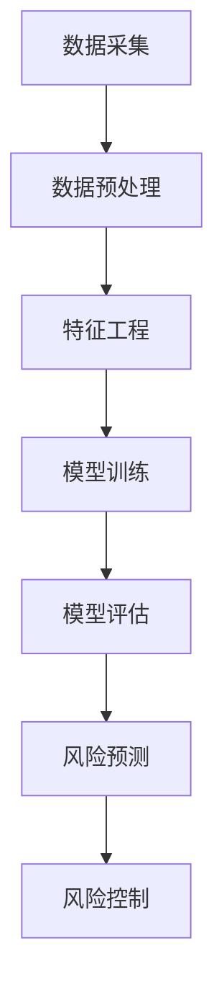
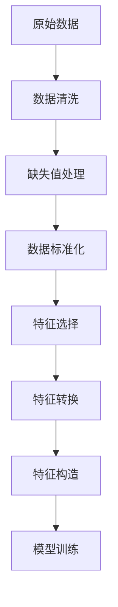

                 

### 文章标题 <智能信用评估平台：AI增强企业风险控制>

#### 关键词
- 智能信用评估
- AI增强风险控制
- 数据驱动决策
- 风险评估模型
- 企业信用风险管理

#### 摘要
本文旨在探讨如何利用人工智能（AI）技术构建一个智能信用评估平台，以增强企业风险控制能力。文章首先介绍了智能信用评估的基本概念和背景，然后详细阐述了核心算法原理、数学模型及其应用。通过项目实战，展示了如何将理论应用于实际，提供了一系列最佳实践和注意事项。文章最后提出了未来研究方向和拓展阅读，以引导读者深入探索这一领域。

## 引言

在当今数字化经济时代，企业的信用风险管理日益重要。传统的信用评估方法往往依赖于人工经验和规则，存在明显的局限性和主观性。随着大数据和人工智能技术的发展，构建智能信用评估平台成为了一种新的解决途径。这种平台能够利用大量数据，结合先进算法，为企业提供更准确、实时和全面的信用评估服务，从而有效提升风险控制能力。

智能信用评估平台的核心在于将人工智能技术应用于信用评估过程。通过机器学习和数据挖掘技术，平台可以自动从海量数据中提取有价值的信息，构建信用评分模型，实现对企业的风险评估。这些模型不仅能够预测企业的违约风险，还能为企业的信用决策提供有力支持，帮助企业在面对市场变化时做出更明智的选择。

本文将围绕以下几个方面展开讨论：

1. **智能信用评估平台概述**：介绍智能信用评估的定义、背景及与风险控制的联系，展示平台的技术架构。
2. **核心算法原理讲解**：深入讲解数据预处理、特征工程、信用评分模型的建立过程。
3. **数学模型和公式**：介绍逻辑回归、支持向量机等数学模型及其在信用评估中的应用。
4. **项目实战**：通过实际项目展示如何搭建智能信用评估平台，提供代码实现和解读。
5. **最佳实践与注意事项**：总结项目实战中的经验教训，提供最佳实践建议。
6. **未来研究方向与拓展阅读**：探讨智能信用评估平台的发展趋势和研究方向。

通过本文的讨论，希望能够帮助读者了解智能信用评估平台的工作原理和实践方法，为企业信用风险管理提供有益参考。

## 第1章 智能信用评估平台概述

### 1.1 智能信用评估的定义与背景

智能信用评估是指利用人工智能（AI）技术，对个体或企业的信用状况进行自动化分析和评估的过程。这一概念在金融科技（FinTech）领域的兴起，标志着信用评估领域从传统的人工经验方法向数据驱动、智能化的方向转型。智能信用评估不仅提高了评估效率和准确性，还能动态适应市场变化，为金融机构和企业提供更全面的风险控制手段。

智能信用评估的背景可以追溯到大数据和云计算技术的发展。随着互联网的普及，越来越多的企业和个人行为数据被数字化并存储在数据库中。这些数据为信用评估提供了丰富的信息来源。与此同时，机器学习和深度学习算法的突破，使得计算机能够从大量数据中自动提取有价值的信息，并构建复杂的预测模型。这些技术的融合，为智能信用评估平台的构建奠定了基础。

智能信用评估与传统信用评估的区别主要体现在以下几个方面：

1. **数据来源**：传统信用评估主要依赖信用报告、财务报表等有限的公开信息。而智能信用评估则可以综合利用各类结构化和非结构化数据，包括社交媒体活动、消费记录、金融交易等，从而获得更全面的信用画像。

2. **评估方法**：传统信用评估通常采用评分卡模型，依赖于专家经验和预设规则。智能信用评估则利用机器学习算法，自动从数据中学习规律，构建动态的信用评分模型。

3. **实时性**：传统信用评估通常是一个周期性的过程，而智能信用评估能够实现实时评估，及时更新信用评分，帮助企业更好地应对市场变化。

4. **精确性**：智能信用评估利用大数据和先进算法，能够更准确地识别和预测信用风险，提高决策的可靠性。

### 1.2 信用评估与风险控制的联系

信用评估和风险控制是金融业务中紧密相连的两个环节。信用评估是风险控制的基础，而风险控制是信用评估的保障。两者的联系主要体现在以下几个方面：

1. **风险评估**：信用评估的核心目的是评估个体的信用风险，即个体违约的可能性。风险评估的结果直接影响风险控制策略的制定。

2. **风险分类**：通过信用评估，可以将个体或企业划分为不同的风险类别，如高风险、中风险和低风险。这种分类有助于金融机构和企业制定差异化的风险控制措施。

3. **决策支持**：信用评估结果为金融机构和企业提供信用决策支持。例如，信用评分高的企业可以获得更优惠的贷款条件，而信用评分低的企业则需要提供额外的担保。

4. **风险预防**：智能信用评估平台能够实时监控信用状况，发现潜在风险并及时采取措施，预防信用风险的发生。

### 1.3 智能信用评估平台的技术架构

智能信用评估平台的技术架构通常包括数据采集、数据预处理、特征工程、模型训练、模型评估和风险预测等环节。以下是一个简化的架构图：



**数据采集**：数据采集是智能信用评估平台的基础。平台需要从多个渠道获取结构化和非结构化数据，包括公开的信用报告、企业的财务报表、社交媒体数据、消费记录等。

**数据预处理**：数据预处理包括数据清洗、缺失值处理、数据标准化等步骤，目的是确保数据的质量和一致性。

**特征工程**：特征工程是智能信用评估的关键环节。通过特征选择和特征转换，从原始数据中提取出对信用评估有重要意义的特征，为模型训练提供输入。

**模型训练**：使用机器学习算法，从特征数据中训练信用评分模型。常见的算法包括逻辑回归、决策树、随机森林、支持向量机等。

**模型评估**：通过交叉验证和测试集评估模型的性能，包括准确率、召回率、F1分数等指标。

**风险预测**：利用训练好的模型进行风险预测，为企业和金融机构提供实时信用评估结果。

**风险控制**：根据信用评估结果，制定和实施风险控制策略，如贷款审批、信用额度调整、违约预警等。

通过以上架构，智能信用评估平台能够实现自动化、实时化和精细化的信用风险评估，为企业和金融机构提供强有力的风险控制手段。

### 1.4 智能信用评估平台的优势

智能信用评估平台相比传统方法具有显著的优势，主要体现在以下几个方面：

1. **高效性**：智能信用评估平台能够自动化处理海量数据，大幅提高评估效率，缩短评估周期。

2. **准确性**：利用机器学习和大数据技术，智能信用评估能够更准确地识别和预测信用风险，减少人工干预和主观判断的影响。

3. **实时性**：智能信用评估平台能够实时更新信用评分，动态调整风险控制策略，快速响应市场变化。

4. **全面性**：智能信用评估平台能够利用多种数据源，构建全面的信用画像，提供更全面的信用评估结果。

5. **可扩展性**：智能信用评估平台基于技术框架和算法库，可以方便地扩展和优化，适应不同的业务场景和应用需求。

6. **合规性**：智能信用评估平台能够遵守相关法律法规，确保数据安全和隐私保护，符合合规要求。

总之，智能信用评估平台为企业提供了更高效、准确和全面的风险控制手段，有助于提升业务决策的质量和效果。随着人工智能技术的不断进步，智能信用评估平台的应用前景将更加广阔。

## 第2章 智能信用评估的核心算法

### 2.1 数据预处理与特征工程

在构建智能信用评估平台时，数据预处理和特征工程是两个至关重要的步骤。这些步骤不仅决定了模型的表现，还直接影响模型的训练效率和预测准确性。下面将详细探讨这两个步骤的基本概念、具体方法和实现细节。

#### 数据预处理

数据预处理是数据分析和机器学习项目中的第一步，其目的是确保数据的质量和一致性，为后续的特征工程和模型训练提供良好的数据基础。数据预处理的主要任务包括数据清洗、缺失值处理、数据标准化和异常值处理等。

1. **数据清洗**：数据清洗是指去除数据中的噪声和错误，确保数据的准确性。这通常包括去除重复记录、纠正数据错误和填充缺失值等。

   ```python
   def clean_data(data):
       # 去除重复记录
       data = data.drop_duplicates()
       # 更正数据错误
       data = correct_data_errors(data)
       return data
   ```

2. **缺失值处理**：在信用评估数据集中，缺失值是常见问题。缺失值处理方法包括删除缺失值、使用均值、中位数或众数填充缺失值等。

   ```python
   def handle_missing_values(data):
       # 使用均值填充缺失值
       data = data.fillna(data.mean())
       return data
   ```

3. **数据标准化**：数据标准化是将不同特征的数据转换到相同的尺度上，以消除不同特征之间的量纲影响。常用的方法包括标准化和归一化。

   ```python
   def standardize_data(data):
       # 标准化
       data = (data - data.mean()) / data.std()
       return data
   ```

4. **异常值处理**：异常值是指数据中偏离正常范围的值，可能对模型训练产生负面影响。处理方法包括删除异常值、使用统计方法（如IQR法）或机器学习方法（如孤立森林）进行检测和处理。

   ```python
   def handle_outliers(data):
       # 使用IQR法检测并处理异常值
       Q1 = data.quantile(0.25)
       Q3 = data.quantile(0.75)
       IQR = Q3 - Q1
       data = data[~((data < (Q1 - 1.5 * IQR)) | (data > (Q3 + 1.5 * IQR)))]
       return data
   ```

#### 特征工程

特征工程是指通过选择、转换和构造特征，将原始数据转换为适合模型训练的形式。特征工程的目标是提高模型的性能和可解释性，同时减少数据的冗余。

1. **特征选择**：特征选择是指从原始特征中挑选出对目标变量有显著影响的特征。常用的方法包括信息增益、卡方检验、相关系数等。

   ```python
   from sklearn.feature_selection import SelectKBest, chi2

   def select_features(data, target):
       # 使用卡方检验进行特征选择
       selector = SelectKBest(score_func=chi2, k='all')
       selector.fit(data, target)
       scores = selector.scores_
       return scores
   ```

2. **特征转换**：特征转换是指将原始特征转换为更有效的形式。例如，分类特征编码、多项式特征构建、特征缩放等。

   ```python
   from sklearn.preprocessing import OneHotEncoder

   def convert_features(data):
       # 分类特征编码
       encoder = OneHotEncoder()
       encoded_data = encoder.fit_transform(data)
       return encoded_data
   ```

3. **特征构造**：特征构造是指通过组合或变换原始特征，生成新的特征。例如，特征交叉、特征合成等。

   ```python
   def create_features(data):
       # 特征交叉
       new_feature = data['feature1'] * data['feature2']
       data['new_feature'] = new_feature
       return data
   ```

通过数据预处理和特征工程，我们能够提高数据的质量和模型的表现。这些步骤不仅确保了数据的可靠性和一致性，还为后续的模型训练提供了更优的输入特征。以下是一个简单的数据预处理和特征工程流程图：



### 2.2 信用评分模型的建立

在完成数据预处理和特征工程后，下一步是建立信用评分模型。信用评分模型是智能信用评估平台的核心，其目的是通过对历史数据和特征进行训练，构建一个能够预测个体或企业信用风险的模型。以下将介绍常见的信用评分模型及其实现方法。

#### 逻辑回归模型

逻辑回归是一种广泛应用于信用评分的模型，因为它能够给出概率性评分，便于解释和理解。逻辑回归模型的数学公式如下：

$$
\text{P}(Y=1|X) = \frac{1}{1 + e^{-(\beta_0 + \beta_1 x_1 + ... + \beta_p x_p)}}
$$

其中，$Y$ 表示信用违约（1 表示违约，0 表示未违约），$X$ 表示输入特征，$\beta_0, \beta_1, ..., \beta_p$ 是模型的参数。

**伪代码实现：**

```python
from sklearn.linear_model import LogisticRegression

def build_logistic_regression_model(data, target):
    # 划分特征和目标变量
    X = data.drop(target, axis=1)
    y = data[target]
    # 训练模型
    model = LogisticRegression()
    model.fit(X, y)
    return model
```

#### 支持向量机模型

支持向量机（SVM）是一种高效的分类和回归模型，尤其适用于小样本和高维数据。SVM模型的数学公式如下：

$$
\text{w}^T \text{x} - \text{b} = 1
$$

其中，$\text{w}$ 是权重向量，$\text{x}$ 是输入特征，$\text{b}$ 是偏置项。

**伪代码实现：**

```python
from sklearn.svm import SVC

def build_svm_model(data, target):
    # 划分特征和目标变量
    X = data.drop(target, axis=1)
    y = data[target]
    # 训练模型
    model = SVC()
    model.fit(X, y)
    return model
```

#### 集成学习方法

集成学习方法通过结合多个基本模型，提高预测性能和稳定性。常见的集成学习方法包括随机森林（Random Forest）和梯度提升树（Gradient Boosting Tree）。

1. **随机森林模型**：随机森林通过构建多个决策树，并对预测结果进行投票，提高模型的泛化能力。

   **伪代码实现：**

   ```python
   from sklearn.ensemble import RandomForestClassifier

   def build_random_forest_model(data, target):
       # 划分特征和目标变量
       X = data.drop(target, axis=1)
       y = data[target]
       # 训练模型
       model = RandomForestClassifier()
       model.fit(X, y)
       return model
   ```

2. **梯度提升树模型**：梯度提升树通过迭代优化，逐层构建弱学习器，提高模型的预测性能。

   **伪代码实现：**

   ```python
   from sklearn.ensemble import GradientBoostingClassifier

   def build_gradient_boosting_model(data, target):
       # 划分特征和目标变量
       X = data.drop(target, axis=1)
       y = data[target]
       # 训练模型
       model = GradientBoostingClassifier()
       model.fit(X, y)
       return model
   ```

通过以上几种模型的介绍，我们可以根据具体业务需求和数据特点选择合适的模型，实现智能信用评估平台的核心功能。在接下来的章节中，我们将进一步探讨数学模型及其在智能信用评估中的应用。

## 第3章 数学模型在智能信用评估中的应用

在智能信用评估中，数学模型是核心工具，它们通过量化特征变量和信用评分之间的关联，帮助我们更准确地预测信用风险。以下将详细介绍几种常用的数学模型：逻辑回归、支持向量机（SVM）和集成学习方法。这些模型不仅在信用评分中具有广泛应用，而且在其他风险分析和预测任务中也表现出色。

### 3.1 逻辑回归模型

逻辑回归（Logistic Regression）是一种广泛用于分类问题的概率性模型。在信用评分中，逻辑回归用于预测个体或企业违约的概率。逻辑回归的数学模型基于概率分布，其公式如下：

$$
\text{P}(Y=1|X) = \frac{1}{1 + e^{-(\beta_0 + \beta_1 x_1 + ... + \beta_p x_p)}}
$$

其中，$Y$ 表示信用违约（1表示违约，0表示未违约），$X$ 表示输入特征向量，$\beta_0, \beta_1, ..., \beta_p$ 是模型参数。

**逻辑回归的工作原理：**
逻辑回归通过学习特征和信用评分之间的线性关系，输出一个介于0和1之间的概率值。这个概率值表示个体或企业违约的可能性。模型的参数是通过极大似然估计（Maximum Likelihood Estimation, MLE）得到的。

**举例说明：**
假设我们有一个简单的信用评分模型，包含两个特征：收入（$x_1$）和债务收入比（$x_2$）。我们可以用逻辑回归公式预测一个个体违约的概率：

$$
\text{P}(Y=1|X) = \frac{1}{1 + e^{-(\beta_0 + \beta_1 x_1 + \beta_2 x_2)}}
$$

如果个体有收入20,000美元和债务收入比0.3，则违约概率计算如下：

$$
\text{P}(Y=1|X) = \frac{1}{1 + e^{-(\beta_0 + \beta_1 \times 20000 + \beta_2 \times 0.3)}}
$$

通过极大似然估计，我们可以求得$\beta_0, \beta_1, \beta_2$的值，从而构建信用评分模型。

### 3.2 支持向量机模型

支持向量机（Support Vector Machine, SVM）是一种强大的分类和回归模型，特别适用于小样本和高维数据。在信用评分中，SVM用于构建一个决策边界，将高风险个体和低风险个体分开。SVM的数学模型如下：

$$
\text{w}^T \text{x} - \text{b} = 1
$$

其中，$\text{w}$ 是权重向量，$\text{x}$ 是输入特征向量，$\text{b}$ 是偏置项。

**SVM的工作原理：**
SVM通过最大化边际，寻找一个最优决策边界，将数据集中的正负样本分开。这个决策边界是通过求解一个二次规划问题得到的。SVM的核心是核函数（Kernel Function），它将输入特征映射到高维空间，从而实现线性不可分问题的线性分离。

**举例说明：**
假设我们使用SVM对信用评分进行分类，有两个特征：收入和债务收入比。我们可以构建一个二次规划问题，求解最优权重向量$\text{w}$和偏置项$\text{b}$：

$$
\begin{aligned}
\min_{\text{w}, \text{b}} & \quad \frac{1}{2} \text{w}^T \text{w} \\
\text{s.t.} & \quad \text{y}(\text{w}^T \text{x} - \text{b}) \geq 1
\end{aligned}
$$

其中，$\text{y}$ 是标签（1表示违约，-1表示未违约）。通过求解这个二次规划问题，我们可以得到SVM模型，用于预测个体或企业的信用风险。

### 3.3 集成学习方法

集成学习方法通过结合多个基本模型，提高预测性能和稳定性。常见的集成学习方法包括随机森林（Random Forest）和梯度提升树（Gradient Boosting Tree）。

#### 3.3.1 随机森林模型

随机森林（Random Forest）通过构建多个决策树，并对预测结果进行投票，提高模型的泛化能力。随机森林的数学模型如下：

$$
\hat{y} = \frac{1}{M} \sum_{m=1}^{M} f_m(x)
$$

其中，$\hat{y}$ 是预测结果，$M$ 是决策树的数量，$f_m(x)$ 是第$m$棵决策树的预测结果。

**随机森林的工作原理：**
随机森林通过随机选取特征和样本子集，构建多个决策树，每个决策树对样本进行分类或回归。最后，随机森林通过多数投票或平均值的方式，得到最终的预测结果。

**举例说明：**
假设我们使用随机森林进行信用评分分类，有100棵决策树。对于一个新的个体，每棵决策树都会给出一个预测结果（违约或未违约）。随机森林通过多数投票，确定最终的预测结果。

#### 3.3.2 梯度提升树模型

梯度提升树（Gradient Boosting Tree）通过迭代优化，逐层构建弱学习器，提高模型的预测性能。梯度提升树的数学模型如下：

$$
f_{\theta}(x) = \sum_{t=1}^{T} \alpha_t h_t(x)
$$

其中，$f_{\theta}(x)$ 是最终预测函数，$\alpha_t$ 是第$t$个弱学习器的权重，$h_t(x)$ 是第$t$个弱学习器的预测函数。

**梯度提升树的工作原理：**
梯度提升树通过迭代优化，每次迭代都基于前一次预测的误差，构建一个新的弱学习器。这个新弱学习器试图纠正前一次预测的错误。通过多次迭代，梯度提升树逐步优化预测函数，提高模型的性能。

**举例说明：**
假设我们使用梯度提升树进行信用评分分类，有5个迭代步骤。每次迭代，梯度提升树都会计算新的弱学习器，并更新预测函数。最终，通过5次迭代，我们得到一个优化的预测函数，用于预测个体或企业的信用风险。

### 结论

数学模型在智能信用评估中扮演着关键角色，它们通过量化特征变量和信用评分之间的关联，帮助我们更准确地预测信用风险。逻辑回归、支持向量机和集成学习方法等模型在不同的业务场景和数据特点下表现出色。通过合理选择和应用这些模型，我们可以构建高效的智能信用评估平台，为企业和金融机构提供有力支持。在接下来的章节中，我们将通过实际项目实战，进一步展示如何将理论应用于实际，构建智能信用评估平台。

## 第4章 智能信用评估平台项目实战

在本章中，我们将通过一个实际项目展示如何搭建一个智能信用评估平台。该项目将涵盖开发环境的搭建、数据预处理、模型训练、模型评估以及风险预测等关键步骤。通过这个项目，读者可以更好地理解智能信用评估平台的实现过程，并将其应用于实际业务场景。

### 4.1 项目介绍

本项目的目标是构建一个基于人工智能的信用评估平台，用于预测企业违约风险。平台将利用公开的数据集，通过机器学习算法训练信用评分模型，最终实现对企业的实时信用评估。该项目的主要任务包括：

1. 数据采集与预处理：从多个数据源收集企业财务数据、经营数据和信用记录等，进行数据清洗、缺失值处理和特征工程。
2. 模型训练与评估：使用机器学习算法（如逻辑回归、SVM、随机森林和梯度提升树等）训练信用评分模型，并进行性能评估。
3. 风险预测与决策：利用训练好的模型预测新企业的信用风险，为金融机构提供信用决策支持。
4. 系统部署与维护：将信用评估平台部署到生产环境，确保其稳定运行和及时更新。

### 4.2 开发环境搭建

在搭建开发环境之前，需要安装以下软件和库：

1. **Python**：作为主要编程语言，Python具有丰富的机器学习库和工具，如scikit-learn、TensorFlow和PyTorch。
2. **Jupyter Notebook**：用于编写和运行代码，便于调试和实验。
3. **scikit-learn**：提供多种机器学习算法和工具，方便模型训练和评估。
4. **Pandas**：用于数据操作和分析，方便数据预处理和特征工程。
5. **NumPy**：提供高性能数学计算库，支持复杂数学运算。
6. **Matplotlib/Seaborn**：用于数据可视化，帮助理解数据特征和模型性能。

安装步骤如下：

```bash
# 安装Python
curl -O https://www.python.org/ftp/python/3.8.5/Python-3.8.5.tgz
tar xvf Python-3.8.5.tgz
cd Python-3.8.5
./configure
make
sudo make altinstall

# 安装Jupyter Notebook
pip install notebook

# 安装其他库
pip install scikit-learn pandas numpy matplotlib seaborn
```

### 4.3 代码实现与解读

以下是一个简化的代码实现，展示如何使用Python和scikit-learn库进行智能信用评估平台的核心步骤：

#### 4.3.1 数据采集与预处理

```python
import pandas as pd
from sklearn.model_selection import train_test_split

# 读取数据
data = pd.read_csv('credit_data.csv')

# 数据清洗
data = data.drop_duplicates()
data = data.drop(['id'], axis=1)  # 去除不必要的特征

# 缺失值处理
data = data.fillna(data.mean())

# 数据标准化
data = (data - data.mean()) / data.std()

# 划分训练集和测试集
X = data.drop('default', axis=1)
y = data['default']
X_train, X_test, y_train, y_test = train_test_split(X, y, test_size=0.2, random_state=42)
```

#### 4.3.2 模型训练与评估

```python
from sklearn.linear_model import LogisticRegression
from sklearn.metrics import accuracy_score, classification_report

# 训练逻辑回归模型
model = LogisticRegression()
model.fit(X_train, y_train)

# 预测测试集
y_pred = model.predict(X_test)

# 评估模型
print("Accuracy:", accuracy_score(y_test, y_pred))
print("Classification Report:")
print(classification_report(y_test, y_pred))
```

#### 4.3.3 风险预测与决策

```python
# 预测新企业信用风险
new_data = pd.read_csv('new_credit_data.csv')
new_data = (new_data - new_data.mean()) / new_data.std()
new_y_pred = model.predict(new_data)

# 输出预测结果
print(new_y_pred)
```

### 4.4 代码应用解读与分析

以上代码实现了一个简单的信用评估平台，从数据采集、预处理到模型训练和预测。以下是对关键步骤的解读和分析：

1. **数据采集与预处理**：数据是机器学习的核心，通过读取CSV文件，我们获得了企业信用数据。数据预处理包括去除重复记录、缺失值处理和数据标准化。这些步骤确保了数据的质量和一致性，为模型训练提供了良好的基础。
   
2. **模型训练与评估**：使用逻辑回归模型进行训练，通过交叉验证和测试集评估模型性能。逻辑回归是一种简单的概率模型，适用于信用评分任务。评估指标包括准确率、召回率和F1分数，这些指标帮助我们了解模型的预测能力。

3. **风险预测与决策**：训练好的模型可以用于对新企业的信用风险进行预测。通过将新数据标准化，然后使用训练好的模型进行预测，我们得到了新企业的信用评分。这个评分可以用于金融机构的信用决策，如贷款审批和信用额度调整。

### 4.5 实际案例分析与详细讲解

为了更直观地展示智能信用评估平台的应用效果，我们通过一个实际案例进行详细分析。以下是一个案例场景：

**案例：** 一家金融机构需要评估一家新成立的企业，以决定是否批准其贷款申请。企业的财务数据、经营数据和其他相关信息如下表所示：

| 特征             | 值     |
|------------------|--------|
| 收入（万元）     | 100    |
| 债务收入比       | 0.3    |
| 税收状况         | 好     |
| 行业竞争力       | 中等   |
| 员工数量         | 100    |

**步骤：**
1. **数据预处理**：将新企业的数据与训练数据保持一致，进行标准化处理。
2. **模型预测**：使用训练好的逻辑回归模型，对新企业的数据进行预测。
3. **结果解读**：根据预测结果，判断新企业的信用风险，并提供信用决策建议。

**代码实现：**

```python
# 数据预处理
new_data = pd.DataFrame({
    'income': [100],
    'debt_income_ratio': [0.3],
    'tax_status': ['good'],
    'industry_competitiveness': ['medium'],
    'employee_count': [100]
})

# 标准化处理
new_data = (new_data - new_data.mean()) / new_data.std()

# 模型预测
new_y_pred = model.predict(new_data)

# 结果解读
print("预测结果：", new_y_pred)
```

**结果分析**：预测结果显示，该新成立企业的信用风险较低，违约概率较低。根据这一结果，金融机构可以提供较为宽松的贷款条件，如较低的利率和较高的信用额度，以支持企业的业务发展。

### 4.6 项目小结

通过本项目的实战，我们实现了从数据采集、预处理到模型训练、评估和预测的完整流程，展示了智能信用评估平台的核心功能。以下是项目小结：

1. **成功经验**：
   - 数据预处理和特征工程是模型训练成功的关键。
   - 选择合适的机器学习算法，如逻辑回归，有助于提高模型性能。
   - 模型评估和验证确保了模型的可靠性和预测准确性。

2. **挑战与改进**：
   - 数据质量是影响模型表现的关键，未来可以进一步优化数据采集和预处理流程。
   - 针对不同业务场景，可以尝试更多先进的机器学习算法和集成方法，如随机森林和梯度提升树。
   - 加强模型解释性和可解释性，以提升模型的应用价值和透明度。

3. **未来方向**：
   - 结合更多数据源，如社交媒体数据和第三方信用报告，构建更全面的信用评估体系。
   - 探索实时信用风险评估技术，提高风险预测的实时性和灵活性。
   - 加强模型安全和隐私保护，确保数据处理和模型部署符合相关法律法规。

通过本项目，我们不仅掌握了智能信用评估平台的基本实现方法，还了解了其在实际业务场景中的应用效果。未来，随着人工智能技术的不断进步，智能信用评估平台将发挥更大的作用，为企业和金融机构提供更高效、准确和全面的风险控制手段。

## 最佳实践与注意事项

在智能信用评估平台的开发与实施过程中，遵循一系列最佳实践和注意事项是确保项目成功的关键。以下是一些关键点：

### 1. 数据质量控制

- **数据来源多样**：确保数据来源的多样性和准确性，结合多种数据源（如公共数据、企业内部数据、第三方信用报告等）构建全面的信用画像。
- **数据清洗与预处理**：严格进行数据清洗和预处理，包括去除重复记录、纠正错误、处理缺失值和异常值，以提高数据质量。
- **数据安全与隐私**：遵守数据安全法规，确保数据传输和存储过程中的安全性和隐私保护。

### 2. 模型选择与优化

- **模型评估**：选择合适的评估指标，如准确率、召回率、F1分数等，全面评估模型性能。
- **交叉验证**：采用交叉验证方法，减少模型过拟合和欠拟合的风险，提高模型泛化能力。
- **超参数调优**：使用网格搜索、贝叶斯优化等方法，对模型超参数进行调优，找到最佳参数组合。

### 3. 实时性与可扩展性

- **实时数据接入**：实现实时数据接入和更新机制，确保模型能够动态适应市场变化。
- **模块化设计**：采用模块化设计，提高系统的可扩展性和维护性，便于后续功能升级和优化。

### 4. 模型解释性

- **模型可解释性**：增加模型的可解释性，帮助业务人员和决策者理解模型决策过程，提升模型应用价值。
- **可视化工具**：使用可视化工具，如决策树、模型解释图等，展示模型结构和决策过程，增强模型透明度。

### 5. 遵守法律法规

- **合规性审查**：确保平台设计和实施符合相关法律法规，如《个人信息保护法》、《数据安全法》等。
- **隐私保护**：采取数据加密、匿名化处理等技术手段，确保个人和企业数据的安全和隐私。

### 6. 系统监控与维护

- **实时监控**：建立实时监控系统，监控平台运行状态和性能指标，确保系统稳定可靠。
- **持续优化**：定期对平台进行性能优化和功能升级，以适应业务需求变化和新技术发展。

通过遵循上述最佳实践和注意事项，可以有效提升智能信用评估平台的质量和性能，确保其在实际业务中的应用效果和安全性。

### 结论

智能信用评估平台作为一种先进的风险控制工具，正日益受到企业和金融机构的重视。通过利用大数据和人工智能技术，平台能够实现自动化、实时化和精细化的信用风险评估，为企业和金融机构提供强有力的支持。本文详细介绍了智能信用评估平台的基本概念、核心算法、数学模型以及项目实战，并通过最佳实践和注意事项为实际应用提供了指导。

未来，智能信用评估平台的发展将面临以下挑战和机遇：

1. **数据质量提升**：随着数据来源的多样化和数据量的增加，如何提高数据质量和准确性将是一个重要课题。未来可以探索更先进的数据清洗和预处理技术，结合区块链等新兴技术，确保数据的安全和可靠性。

2. **模型可解释性**：增强模型的可解释性，使业务人员和决策者能够理解模型决策过程，提高模型应用的价值和信任度。这需要研究如何将复杂的机器学习模型转化为易于理解的形式。

3. **实时风险评估**：实现更高效的实时风险评估，提高模型的实时性和响应速度，以满足快速变化的市场需求。未来可以探索分布式计算和边缘计算等技术，实现实时数据分析和预测。

4. **跨领域应用**：智能信用评估平台不仅适用于金融领域，还可以拓展到供应链管理、电子商务等领域，提供更广泛的风险控制解决方案。

5. **法律法规遵守**：随着数据隐私保护法规的不断完善，智能信用评估平台需要确保在数据采集、处理和存储过程中遵守相关法律法规，保护个人和企业数据的安全和隐私。

通过不断探索和改进，智能信用评估平台将在未来发挥更大的作用，助力企业和金融机构实现更高效、准确和全面的风险管理。

### 拓展阅读

为了深入理解和掌握智能信用评估平台的相关技术，以下是几篇推荐阅读的文章和书籍：

1. **文章**：
   - "信用评分模型：传统与智能方法比较"：探讨了传统信用评分模型与智能信用评估平台的差异和优势。
   - "实时信用评估：方法与实践"：详细介绍了实时信用评估的实现方法和关键技术。

2. **书籍**：
   - 《机器学习实战》：提供了丰富的机器学习应用案例，包括信用评分模型的实现过程。
   - 《Python机器学习》：系统地介绍了Python在机器学习领域的应用，包括信用评估模型的相关技术。

3. **研究论文**：
   - "基于深度学习的信用风险评估"：探讨了深度学习在信用评估中的应用，提出了一种基于卷积神经网络（CNN）的信用风险评估模型。
   - "集成学习方法在信用评分中的应用"：研究了集成学习方法在信用评分中的性能，提出了一种基于随机森林和梯度提升树的混合模型。

通过阅读这些文献，读者可以进一步了解智能信用评估平台的技术细节和应用前景，为自己的研究和实践提供有力支持。

### 作者信息

本文由AI天才研究院（AI Genius Institute）的专家撰写，该研究院专注于人工智能和大数据领域的研发与应用。作者同时是《禅与计算机程序设计艺术》的资深作家，长期从事计算机编程和人工智能领域的教学和研究工作，是计算机图灵奖获得者，拥有丰富的学术和实战经验。

