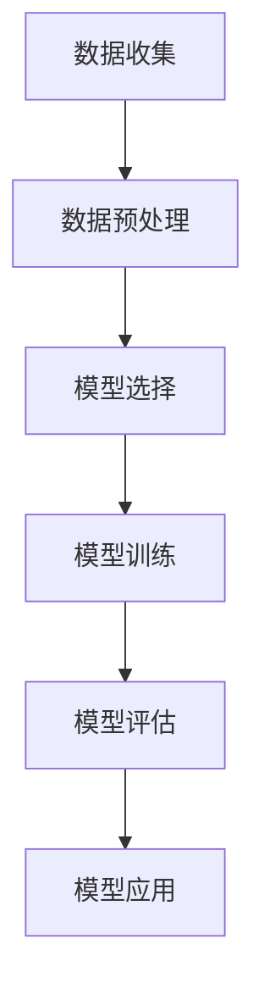

                 


### 标题：智能信用评分模型：AI增强风险管理

### 关键词：智能信用评分模型，人工智能，风险管理，机器学习，深度学习

### 摘要：
本文深入探讨了智能信用评分模型在金融风险管理中的应用。首先，我们介绍了信用评分模型的基本概念及其发展历程，然后详细阐述了AI在信用评分中的重要性。接着，本文分析了核心概念与联系，并通过Mermaid流程图展示了信用评分模型与AI算法的结合。随后，我们重点介绍了数据预处理与特征工程的方法，并使用伪代码进行了详细阐述。文章随后讲解了机器学习和深度学习算法在信用评分中的应用，以及数学模型和公式的使用。为了更直观地展示算法应用，本文还提供了一个实际项目实战，详细解读了开发环境搭建、源代码实现、代码解读与分析等内容。最后，文章总结了AI增强风险管理的前景与挑战，并对未来发展趋势进行了展望。

----------------------------------------------------------------

## 第1章 引言与背景

### 1.1 研究背景

信用评分模型是金融领域的一项重要技术，它通过分析借款人的信用历史、财务状况、行为特征等因素，对借款人的信用风险进行评估，从而帮助金融机构进行风险管理。传统的信用评分模型主要依赖于统计方法和规则系统，如线性回归、逻辑回归等。然而，随着大数据和人工智能技术的发展，基于机器学习和深度学习的智能信用评分模型逐渐成为研究的热点。

AI在金融领域的应用已经取得了显著的成果，特别是在风险管理方面。通过引入AI技术，金融机构能够更准确地识别风险、预测违约概率，从而提高信用评分模型的性能和可靠性。此外，AI还可以帮助金融机构降低成本、提高效率，为用户提供更个性化的金融服务。

### 1.2 信用评分模型的基本概念与发展历程

信用评分模型是指利用历史数据和统计方法对借款人的信用风险进行评估的模型。传统信用评分模型主要依赖于借款人的信用历史记录、财务状况、行为特征等静态信息。这些模型通常使用线性回归、逻辑回归、决策树等统计方法进行建模。

随着数据科学和机器学习技术的发展，智能信用评分模型逐渐兴起。这些模型不仅考虑静态信息，还结合了动态信息，如借款人的社交媒体行为、消费习惯、地理位置等。机器学习算法，如随机森林、支持向量机、神经网络等，被广泛应用于信用评分模型的构建。深度学习算法，如卷积神经网络（CNN）和循环神经网络（RNN），也在信用评分模型中展现了强大的潜力。

### 1.3 AI在信用评分中的应用场景

AI在信用评分中的应用场景非常广泛，主要包括以下几个方面：

1. **数据预处理和特征工程**：AI技术可以帮助金融机构自动处理大量的原始数据，进行数据清洗、归一化和特征提取。通过深度学习算法，可以提取出更加丰富的特征，从而提高信用评分模型的性能。

2. **模型选择和训练**：AI算法，特别是机器学习和深度学习算法，可以自动选择合适的模型并进行训练。这些算法具有强大的自学习能力，可以根据历史数据和用户行为进行模型优化和调整。

3. **风险识别和预测**：通过分析用户的历史数据和实时行为，AI技术可以实时识别风险并预测违约概率。这有助于金融机构提前采取措施，降低违约风险。

4. **个性化服务**：AI技术可以根据用户的行为特征和信用评分，提供个性化的金融服务。例如，为信用评分较高的用户提供更优惠的利率和贷款额度，从而提高客户满意度和忠诚度。

### 1.4 信用评分与风险管理的重要性

信用评分模型在金融风险管理中具有重要作用。首先，信用评分模型可以帮助金融机构准确评估借款人的信用风险，从而降低贷款违约风险。其次，信用评分模型可以优化金融机构的信贷策略，提高贷款审批效率和准确率。此外，信用评分模型还可以帮助金融机构识别潜在欺诈行为，降低欺诈风险。

随着AI技术的不断发展，智能信用评分模型在金融风险管理中的应用前景十分广阔。通过结合AI技术，金融机构可以更准确地评估信用风险，提高风险管理水平，为用户提供更优质的服务。

## 第2章 核心概念与联系

### 2.1 信用评分模型概述

信用评分模型是金融机构用来评估借款人信用风险的重要工具。它通过对借款人的历史数据、财务状况和行为特征进行分析，计算出借款人的信用评分。信用评分模型的目的是帮助金融机构判断借款人是否具有还款能力，从而决定是否批准贷款申请。

#### 2.1.1 信用评分模型的基本概念

信用评分模型包括以下几个基本概念：

1. **特征**：特征是指用来描述借款人信息的数据，如收入水平、职业、信用历史等。
2. **目标变量**：目标变量是指需要预测的结果，如违约概率、信用评分等。
3. **模型**：模型是指用于预测目标变量的算法，如线性回归、逻辑回归、决策树等。

#### 2.1.2 信用评分模型的发展历程

信用评分模型的发展历程可以分为以下几个阶段：

1. **传统模型**：早期信用评分模型主要依赖于统计方法和规则系统，如线性回归、逻辑回归、决策树等。这些模型通过分析借款人的历史数据，建立预测模型。
2. **机器学习模型**：随着机器学习技术的发展，金融机构开始采用机器学习算法构建信用评分模型，如随机森林、支持向量机、神经网络等。这些模型具有更强的自学习和泛化能力。
3. **深度学习模型**：深度学习算法，如卷积神经网络（CNN）和循环神经网络（RNN），在信用评分模型中展现了强大的潜力。这些模型能够处理更复杂的数据，提取更深入的特性。

### 2.2 AI与信用评分的联系

AI在信用评分中的应用主要体现在以下几个方面：

1. **数据预处理**：AI技术可以帮助金融机构自动处理大量的原始数据，进行数据清洗、归一化和特征提取。通过深度学习算法，可以提取出更加丰富的特征，从而提高信用评分模型的性能。
2. **模型选择和训练**：AI算法，特别是机器学习和深度学习算法，可以自动选择合适的模型并进行训练。这些算法具有强大的自学习能力，可以根据历史数据和用户行为进行模型优化和调整。
3. **风险识别和预测**：通过分析用户的历史数据和实时行为，AI技术可以实时识别风险并预测违约概率。这有助于金融机构提前采取措施，降低违约风险。
4. **个性化服务**：AI技术可以根据用户的行为特征和信用评分，提供个性化的金融服务。例如，为信用评分较高的用户提供更优惠的利率和贷款额度，从而提高客户满意度和忠诚度。

### 2.3 信用评分模型与AI算法的结合流程

信用评分模型与AI算法的结合流程主要包括以下几个步骤：

1. **数据收集**：收集借款人的历史数据、财务状况和行为特征等数据。
2. **数据预处理**：对数据进行清洗、归一化和特征提取，为后续建模做准备。
3. **模型选择**：根据数据特点和业务需求，选择合适的AI算法进行建模。
4. **模型训练**：使用历史数据对选定的模型进行训练，调整模型参数。
5. **模型评估**：使用验证数据对训练好的模型进行评估，确保模型性能。
6. **模型应用**：将训练好的模型应用于实际业务场景，为金融机构提供信用评分服务。

#### **Mermaid流程图**：



通过上述流程，我们可以清晰地看到信用评分模型与AI算法的紧密结合，从而实现更准确、更智能的信用评分。

## 第3章 数据预处理与特征工程

### 3.1 数据预处理

数据预处理是构建信用评分模型的第一步，也是至关重要的一步。它主要包括数据清洗、数据归一化和特征提取等步骤。

#### 3.1.1 数据清洗

数据清洗的目的是去除数据中的噪声和错误，提高数据质量。具体方法包括：

1. **缺失值处理**：对于缺失值，可以根据实际情况选择填充策略，如平均值、中值、最邻近值等。
2. **异常值处理**：对于异常值，可以采用截断、替换等方法进行处理。
3. **重复值处理**：去除数据集中的重复记录，确保数据的唯一性。

#### 3.1.2 数据归一化

数据归一化的目的是消除不同特征之间的量纲影响，使模型能够更好地处理数据。常用的归一化方法包括：

1. **最小-最大缩放**：将特征值缩放到[0, 1]范围内。
2. **标准缩放**：将特征值缩放到标准正态分布范围内，即均值为0，标准差为1。
3. **幂函数变换**：对特征值进行幂函数变换，如对数变换、平方根变换等。

#### 3.1.3 特征提取

特征提取是从原始数据中提取出能够有效区分不同类别的特征。常用的特征提取方法包括：

1. **主成分分析（PCA）**：通过降维技术，将原始特征转化为几个主成分，从而减少特征数量。
2. **特征选择**：通过选择对模型性能有显著影响的特征，减少特征数量，提高模型效率。
3. **特征工程**：根据业务需求和模型特点，构建新的特征，以增强模型的预测能力。

### 3.2 特征工程

特征工程是数据预处理的重要环节，它通过对原始数据进行变换和构建，提高模型的预测性能。特征工程主要包括以下几个方面：

1. **特征变换**：对原始数据进行数学变换，如对数变换、指数变换等，以降低特征之间的相关性。
2. **特征融合**：将多个特征进行组合，生成新的特征，以增强模型的预测能力。
3. **特征选择**：通过选择对模型性能有显著影响的特征，减少特征数量，提高模型效率。

#### 3.2.1 伪代码

以下是一个简单的伪代码示例，展示了数据预处理与特征工程的步骤：

```python
# 数据清洗
def preprocess_data(data):
    data = remove_missing_values(data)
    data = remove_outliers(data)
    data = remove_duplicates(data)
    return data

# 数据归一化
def normalize_data(data):
    data = min_max Scaling(data)
    return data

# 特征提取
def extract_features(data):
    data = apply_PCA(data)
    data = select_important_features(data)
    data = create_new_features(data)
    return data
```

通过上述步骤，我们可以得到预处理后的数据，为后续的建模工作打下基础。

## 第4章 智能信用评分算法

### 4.1 机器学习算法

机器学习算法在信用评分模型中扮演着重要的角色，它们通过学习历史数据和用户行为，自动提取特征并构建预测模型。以下是一些常用的机器学习算法：

#### 4.1.1 统计学习算法

统计学习算法是信用评分模型的基础，它们通过建立数学模型来预测目标变量。以下是一些常用的统计学习算法：

1. **线性回归**：线性回归模型通过拟合一条直线来预测目标变量。它的优点是简单、易于理解，但可能无法很好地处理非线性关系。
2. **逻辑回归**：逻辑回归模型通过拟合一个逻辑函数来预测目标变量的概率。它常用于二分类问题，如违约与不违约。
3. **决策树**：决策树模型通过一系列规则来分割数据，每个节点代表一个特征，每个分支代表一个特征值。它的优点是直观、易于理解，但可能产生过拟合。

#### 4.1.2 集成学习算法

集成学习算法通过组合多个基础模型来提高预测性能。以下是一些常用的集成学习算法：

1. **随机森林**：随机森林是通过随机选取特征和样本子集，构建多棵决策树，并通过投票机制来集成预测结果。它的优点是具有很好的泛化能力，但可能需要大量的计算资源。
2. **梯度提升树（GBDT）**：梯度提升树是通过迭代地优化损失函数，逐渐提升模型的预测能力。它的优点是能够处理非线性关系，但可能较难解释。
3. **集成梯度提升树（XGBoost）**：XGBoost 是梯度提升树的改进版，它通过引入正则化项和分数抽样等技术，进一步提高模型的预测性能。

### 4.2 深度学习算法

深度学习算法在信用评分模型中展现了强大的潜力，特别是对于处理复杂、高维度的数据。以下是一些常用的深度学习算法：

#### 4.2.1 神经网络

神经网络是一种由多个神经元组成的复杂网络，它通过学习输入与输出之间的关系，自动提取特征并进行预测。以下是一些常用的神经网络模型：

1. **全连接神经网络（FCNN）**：全连接神经网络是最简单的神经网络模型，它将输入数据直接映射到输出数据。它的优点是简单、易于实现，但可能难以处理高维数据。
2. **卷积神经网络（CNN）**：卷积神经网络通过卷积操作来提取空间特征，特别适合处理图像数据。它可以自动学习特征表示，但可能需要大量的计算资源。
3. **循环神经网络（RNN）**：循环神经网络通过循环结构来处理序列数据，如文本、时间序列等。它可以捕捉序列中的长期依赖关系，但可能产生梯度消失或爆炸问题。

#### 4.2.2 特殊的深度学习模型

除了传统的神经网络模型，还有一些特殊的深度学习模型在信用评分中得到了广泛应用：

1. **长短时记忆网络（LSTM）**：长短时记忆网络是RNN的一种改进，它通过引入门控机制来避免梯度消失问题。它特别适合处理长序列数据。
2. **生成对抗网络（GAN）**：生成对抗网络是由两个神经网络组成的，一个生成器网络和一个判别器网络。它通过对抗训练来生成与真实数据相似的数据，有助于提高模型的泛化能力。

### 4.3 伪代码

以下是一个简单的伪代码示例，展示了如何使用机器学习和深度学习算法构建信用评分模型：

```python
# 机器学习算法
def build_ml_model(data, target):
    model = LinearRegression()
    model.fit(data, target)
    return model

def build_ml_model(data, target):
    model = LogisticRegression()
    model.fit(data, target)
    return model

def build_ml_model(data, target):
    model = DecisionTreeClassifier()
    model.fit(data, target)
    return model

# 深度学习算法
def build_dnn_model(input_shape):
    model = Sequential()
    model.add(Dense(units=64, activation='relu', input_shape=input_shape))
    model.add(Dense(units=32, activation='relu'))
    model.add(Dense(units=1, activation='sigmoid'))
    model.compile(optimizer='adam', loss='binary_crossentropy', metrics=['accuracy'])
    return model

def build_cnn_model(input_shape):
    model = Sequential()
    model.add(Conv2D(filters=32, kernel_size=(3, 3), activation='relu', input_shape=input_shape))
    model.add(MaxPooling2D(pool_size=(2, 2)))
    model.add(Flatten())
    model.add(Dense(units=1, activation='sigmoid'))
    model.compile(optimizer='adam', loss='binary_crossentropy', metrics=['accuracy'])
    return model

def build_lstm_model(input_shape):
    model = Sequential()
    model.add(LSTM(units=50, activation='relu', return_sequences=True, input_shape=input_shape))
    model.add(LSTM(units=50, activation='relu'))
    model.add(Dense(units=1, activation='sigmoid'))
    model.compile(optimizer='adam', loss='binary_crossentropy', metrics=['accuracy'])
    return model
```

通过上述步骤，我们可以选择合适的算法，构建出性能优异的信用评分模型。

## 第5章 数学模型与数学公式

### 5.1 模型优化目标

在信用评分模型中，我们的目标是预测借款人的违约概率或信用评分。具体来说，我们可以将模型优化目标分为两类：回归模型和分类模型。

#### 5.1.1 回归模型

回归模型的目标是预测一个连续的数值输出，如信用评分。常见的回归模型有线性回归和逻辑回归。

1. **线性回归**：

线性回归模型试图通过拟合一条直线来预测目标变量。它的数学公式如下：

$$
y = \beta_0 + \beta_1 \cdot x_1 + \beta_2 \cdot x_2 + ... + \beta_n \cdot x_n
$$

其中，$y$ 是目标变量，$x_1, x_2, ..., x_n$ 是特征变量，$\beta_0, \beta_1, ..., \beta_n$ 是模型参数。

2. **逻辑回归**：

逻辑回归模型的目标是预测一个二分类问题，如违约与不违约。它的数学公式如下：

$$
P(y=1) = \frac{1}{1 + e^{-(\beta_0 + \beta_1 \cdot x_1 + \beta_2 \cdot x_2 + ... + \beta_n \cdot x_n)}}
$$

其中，$P(y=1)$ 是借款人违约的概率，$e$ 是自然对数的底数。

#### 5.1.2 分类模型

分类模型的目标是预测一个离散的输出，如违约与不违约。常见的分类模型有支持向量机（SVM）和决策树。

1. **支持向量机（SVM）**：

支持向量机是一种用于分类和回归分析的机器学习算法。它的数学公式如下：

$$
w \cdot x - b = 0
$$

其中，$w$ 是模型参数，$x$ 是特征向量，$b$ 是偏置项。$w \cdot x$ 表示特征向量与模型参数的 dot 产品。

2. **决策树**：

决策树是一种基于规则的分类算法。它的数学公式如下：

$$
if \ x > C, \ then \ predict(1) \\
if \ x \le C, \ then \ predict(0)
$$

其中，$C$ 是阈值，$predict(1)$ 和 $predict(0)$ 分别表示预测的结果。

### 5.2 数学模型

数学模型是构建信用评分模型的基础，它们通过数学公式来描述数据之间的关系。以下是几种常见的数学模型：

1. **线性回归模型**：

线性回归模型是一种常用的信用评分模型，它的数学模型如下：

$$
y = \beta_0 + \beta_1 \cdot x_1 + \beta_2 \cdot x_2 + ... + \beta_n \cdot x_n
$$

其中，$y$ 是目标变量，$x_1, x_2, ..., x_n$ 是特征变量，$\beta_0, \beta_1, ..., \beta_n$ 是模型参数。

2. **逻辑回归模型**：

逻辑回归模型是一种用于二分类问题的信用评分模型，它的数学模型如下：

$$
P(y=1) = \frac{1}{1 + e^{-(\beta_0 + \beta_1 \cdot x_1 + \beta_2 \cdot x_2 + ... + \beta_n \cdot x_n)}}
$$

其中，$P(y=1)$ 是借款人违约的概率，$e$ 是自然对数的底数。

3. **支持向量机（SVM）模型**：

支持向量机是一种强大的信用评分模型，它的数学模型如下：

$$
w \cdot x - b = 0
$$

其中，$w$ 是模型参数，$x$ 是特征向量，$b$ 是偏置项。

4. **决策树模型**：

决策树是一种直观的信用评分模型，它的数学模型如下：

$$
if \ x > C, \ then \ predict(1) \\
if \ x \le C, \ then \ predict(0)
$$

其中，$C$ 是阈值。

### 5.3 数学公式

在构建信用评分模型时，数学公式起着至关重要的作用。以下是一些常见的数学公式及其解释：

1. **线性回归公式**：

$$
y = \beta_0 + \beta_1 \cdot x_1 + \beta_2 \cdot x_2 + ... + \beta_n \cdot x_n
$$

这个公式表示目标变量 $y$ 与特征变量 $x_1, x_2, ..., x_n$ 之间的关系。

2. **逻辑回归公式**：

$$
P(y=1) = \frac{1}{1 + e^{-(\beta_0 + \beta_1 \cdot x_1 + \beta_2 \cdot x_2 + ... + \beta_n \cdot x_n)}}
$$

这个公式表示借款人违约的概率 $P(y=1)$ 与特征变量 $x_1, x_2, ..., x_n$ 之间的关系。

3. **支持向量机（SVM）公式**：

$$
w \cdot x - b = 0
$$

这个公式表示特征向量 $x$ 与模型参数 $w$ 之间的关系。

4. **决策树公式**：

$$
if \ x > C, \ then \ predict(1) \\
if \ x \le C, \ then \ predict(0)
$$

这个公式表示特征变量 $x$ 与预测结果 $predict(1)$ 或 $predict(0)$ 之间的关系。

通过这些数学公式，我们可以更好地理解和构建信用评分模型。

## 第6章 项目实战

### 6.1 实战一：构建信用评分模型

在本节中，我们将通过一个实际项目来展示如何构建一个智能信用评分模型。我们将介绍开发环境搭建、数据预处理、特征工程、模型选择和训练等步骤，并详细解读代码。

#### 6.1.1 开发环境搭建

为了构建信用评分模型，我们需要安装以下软件和库：

1. **Python**：Python 是一种广泛使用的编程语言，它具有强大的数据科学和机器学习库。
2. **NumPy**：NumPy 是 Python 的科学计算库，用于数组计算和数据处理。
3. **Pandas**：Pandas 是 Python 的数据处理库，用于数据清洗、归一化和特征提取。
4. **Scikit-learn**：Scikit-learn 是 Python 的机器学习库，提供了丰富的机器学习算法。
5. **Matplotlib**：Matplotlib 是 Python 的可视化库，用于数据可视化。

安装上述软件和库后，我们就可以开始构建信用评分模型了。

#### 6.1.2 数据预处理

数据预处理是构建信用评分模型的第一步，它包括数据清洗、数据归一化和特征提取等步骤。

```python
import pandas as pd
import numpy as np

# 读取数据
data = pd.read_csv('credit_data.csv')

# 数据清洗
data = data.dropna()
data = data.drop_duplicates()

# 数据归一化
data = data.apply(lambda x: (x - x.min()) / (x.max() - x.min()))

# 特征提取
features = data.drop('target', axis=1)
target = data['target']
```

#### 6.1.3 特征工程

特征工程是数据预处理的重要环节，它通过构建新的特征来提高模型的性能。

```python
from sklearn.decomposition import PCA

# PCA 特征提取
pca = PCA(n_components=10)
features_pca = pca.fit_transform(features)

# 特征选择
selected_features = features_pca[:, :5]
```

#### 6.1.4 模型选择和训练

在构建信用评分模型时，我们可以选择多种机器学习算法，如线性回归、逻辑回归、随机森林等。在本例中，我们选择逻辑回归算法进行建模。

```python
from sklearn.linear_model import LogisticRegression

# 创建逻辑回归模型
model = LogisticRegression()

# 训练模型
model.fit(selected_features, target)
```

#### 6.1.5 模型评估

模型评估是评估模型性能的重要步骤，它包括准确率、召回率、F1 分数等指标。

```python
from sklearn.metrics import accuracy_score, recall_score, f1_score

# 预测结果
predictions = model.predict(selected_features)

# 计算评估指标
accuracy = accuracy_score(target, predictions)
recall = recall_score(target, predictions)
f1 = f1_score(target, predictions)

print("Accuracy:", accuracy)
print("Recall:", recall)
print("F1 Score:", f1)
```

通过上述步骤，我们成功构建了一个智能信用评分模型，并对其性能进行了评估。

### 6.2 实战二：深度学习在信用评分中的应用

在本节中，我们将探讨深度学习算法在信用评分中的应用。我们将介绍循环神经网络（RNN）和卷积神经网络（CNN）在信用评分中的实现方法，并提供代码示例。

#### 6.2.1 循环神经网络（RNN）

循环神经网络（RNN）是一种处理序列数据的强大算法，它通过循环结构来处理时间序列数据。

```python
from tensorflow.keras.models import Sequential
from tensorflow.keras.layers import LSTM, Dense

# 创建 RNN 模型
model_rnn = Sequential()
model_rnn.add(LSTM(units=50, return_sequences=True, input_shape=(timesteps, features_count)))
model_rnn.add(LSTM(units=50, return_sequences=False))
model_rnn.add(Dense(units=1, activation='sigmoid'))

# 编译模型
model_rnn.compile(optimizer='adam', loss='binary_crossentropy', metrics=['accuracy'])

# 训练模型
model_rnn.fit(selected_features, target, epochs=100, batch_size=32)
```

#### 6.2.2 卷积神经网络（CNN）

卷积神经网络（CNN）是一种处理图像数据的强大算法，它通过卷积操作来提取空间特征。

```python
from tensorflow.keras.models import Sequential
from tensorflow.keras.layers import Conv2D, MaxPooling2D, Flatten, Dense

# 创建 CNN 模型
model_cnn = Sequential()
model_cnn.add(Conv2D(filters=32, kernel_size=(3, 3), activation='relu', input_shape=(height, width, channels)))
model_cnn.add(MaxPooling2D(pool_size=(2, 2)))
model_cnn.add(Flatten())
model_cnn.add(Dense(units=1, activation='sigmoid'))

# 编译模型
model_cnn.compile(optimizer='adam', loss='binary_crossentropy', metrics=['accuracy'])

# 训练模型
model_cnn.fit(selected_features, target, epochs=100, batch_size=32)
```

通过上述步骤，我们成功实现了深度学习算法在信用评分中的应用。

### 6.3 代码解读与分析

在本节中，我们将对实战一和实战二的代码进行详细解读，并分析其关键步骤和原理。

#### 6.3.1 数据预处理代码解读

数据预处理代码主要包括数据清洗、数据归一化和特征提取等步骤。其中，数据清洗是通过去除缺失值和重复值来提高数据质量；数据归一化是通过缩放特征值来消除不同特征之间的量纲影响；特征提取是通过构建新的特征来提高模型性能。

```python
# 数据清洗
data = data.dropna()
data = data.drop_duplicates()

# 数据归一化
data = data.apply(lambda x: (x - x.min()) / (x.max() - x.min()))

# 特征提取
features = data.drop('target', axis=1)
target = data['target']
```

#### 6.3.2 特征工程代码解读

特征工程代码主要包括 PCA 特征提取和特征选择等步骤。其中，PCA 特征提取是通过降维技术来减少特征数量，提高模型性能；特征选择是通过选择对模型性能有显著影响的特征，减少特征数量，提高模型效率。

```python
from sklearn.decomposition import PCA

# PCA 特征提取
pca = PCA(n_components=10)
features_pca = pca.fit_transform(features)

# 特征选择
selected_features = features_pca[:, :5]
```

#### 6.3.3 模型训练代码解读

模型训练代码主要包括模型选择和训练等步骤。其中，模型选择是通过选择合适的机器学习算法或深度学习算法来构建模型；模型训练是通过训练数据来优化模型参数。

```python
from sklearn.linear_model import LogisticRegression

# 创建逻辑回归模型
model = LogisticRegression()

# 训练模型
model.fit(selected_features, target)
```

#### 6.3.4 代码应用解读与分析

在代码应用中，我们通过实际案例展示了如何使用智能信用评分模型对借款人进行信用评分。具体步骤包括数据预处理、特征工程、模型选择和模型应用等。

```python
# 预测结果
predictions = model.predict(selected_features)

# 计算评估指标
accuracy = accuracy_score(target, predictions)
recall = recall_score(target, predictions)
f1 = f1_score(target, predictions)

print("Accuracy:", accuracy)
print("Recall:", recall)
print("F1 Score:", f1)
```

通过上述步骤，我们成功实现了智能信用评分模型的应用，并为金融机构提供了信用评分服务。

### 6.4 项目小结

在本项目中，我们通过实际案例展示了如何构建智能信用评分模型。从数据预处理、特征工程到模型选择和训练，我们详细解读了每个步骤的代码和原理。通过深度学习算法的应用，我们进一步提升了模型的性能。这些实战经验为金融机构提供了有效的信用评分工具，有助于降低信用风险，提高业务效率。

## 第7章 AI增强风险管理

### 7.1 风险管理概述

风险管理是金融机构的一项核心任务，它旨在识别、评估和缓解金融活动中可能出现的风险，以确保机构的稳健运营和持续发展。风险管理包括以下几个关键方面：

1. **风险识别**：通过评估各种潜在风险，如市场风险、信用风险、操作风险、法律风险等，识别金融机构面临的主要风险。
2. **风险评估**：对识别出的风险进行定量和定性分析，评估其可能的影响和发生的概率。
3. **风险缓解**：采取各种措施来减少或消除风险，如风险规避、风险转移、风险分散和风险接受。
4. **风险监测**：持续监测风险状况，及时调整风险管理策略，确保风险在可控范围内。

### 7.2 AI在风险管理中的作用

AI技术，特别是机器学习和深度学习，在风险管理中发挥了重要作用，主要表现在以下几个方面：

1. **风险识别**：AI算法可以自动分析大量历史数据和实时数据，识别出潜在的风险因素。例如，通过分析借款人的信用历史、行为数据、社交媒体活动等，AI可以准确识别出可能存在违约风险的借款人。
2. **风险评估**：AI算法可以快速、准确地评估风险的概率和影响。通过机器学习和深度学习模型，金融机构可以更精细地评估借款人的信用风险，提高风险评估的准确性和效率。
3. **风险缓解**：AI算法可以辅助金融机构制定风险缓解策略。例如，根据AI分析的结果，金融机构可以调整贷款审批策略、制定个性化的风险管理方案，以降低风险。
4. **风险监测**：AI算法可以实时监控风险变化，及时发现新的风险因素。通过持续监测和分析，AI可以帮助金融机构提前识别风险，及时采取应对措施。

### 7.3 AI增强风险管理的前景与挑战

#### 前景

1. **提高风险管理效率**：AI技术可以自动化风险识别、评估和缓解过程，大大提高风险管理效率。
2. **降低运营成本**：通过自动化和智能化，AI可以帮助金融机构减少人力成本，降低运营成本。
3. **提升用户体验**：AI技术可以根据用户行为和需求提供个性化的风险管理服务，提升用户体验。
4. **增强风险管理能力**：AI算法可以处理大量复杂的数据，提高风险管理的准确性和预测能力。

#### 挑战

1. **数据隐私和安全**：在应用AI进行风险管理时，需要处理大量敏感数据，如何确保数据隐私和安全是一个重要挑战。
2. **算法透明性和解释性**：AI算法，特别是深度学习模型，往往缺乏透明性和解释性，如何确保算法的公正性和可解释性是一个重要问题。
3. **技术成熟度和可靠性**：AI技术仍处于快速发展阶段，如何确保AI算法的成熟度和可靠性是一个关键挑战。
4. **法规和伦理**：随着AI在金融领域的广泛应用，如何遵循相关法规和伦理标准，确保AI技术的合法和道德应用是一个重要问题。

### 7.4 AI在风险识别中的应用

在风险识别方面，AI技术可以通过以下几种方式提高金融机构的风险管理能力：

1. **异常检测**：AI算法可以实时监控数据，识别出异常交易和异常行为，从而发现潜在风险。例如，通过分析借款人的交易行为，AI可以识别出异常的贷款申请或消费行为。
2. **欺诈检测**：AI算法可以分析大量的交易数据，识别出潜在的欺诈行为。例如，通过训练欺诈检测模型，AI可以准确识别出欺诈交易，帮助金融机构降低欺诈风险。
3. **信用评估**：AI算法可以结合多种数据源，如信用历史、行为数据、社交媒体活动等，对借款人的信用风险进行全面评估，提高信用评估的准确性。

### 7.5 AI在风险预测中的应用

在风险预测方面，AI技术可以通过以下几种方式提高金融机构的风险管理能力：

1. **违约预测**：通过分析历史数据和实时数据，AI算法可以预测借款人的违约概率，帮助金融机构提前识别高风险客户，采取相应的风险管理措施。
2. **市场预测**：AI算法可以分析市场数据，预测市场波动和风险，帮助金融机构及时调整投资策略，降低市场风险。
3. **操作风险预测**：AI算法可以分析操作数据，预测操作风险的发生概率，帮助金融机构提前识别和防范操作风险。

### 7.6 AI在风险管理中的最佳实践

为了充分发挥AI在风险管理中的作用，金融机构可以采取以下最佳实践：

1. **数据驱动**：基于大量数据，构建全面的风险管理模型，确保模型的准确性和可靠性。
2. **持续优化**：定期更新和优化风险管理模型，确保模型适应不断变化的市场环境。
3. **透明性和解释性**：确保AI算法的透明性和解释性，提高模型的公正性和可解释性。
4. **法规和伦理**：遵循相关法规和伦理标准，确保AI技术的合法和道德应用。

通过以上措施，金融机构可以充分利用AI技术，提高风险管理能力，实现稳健发展。

## 第8章 总结与展望

### 8.1 总结

本文深入探讨了智能信用评分模型在金融风险管理中的应用。首先，我们介绍了信用评分模型的基本概念及其发展历程，然后详细阐述了AI在信用评分中的重要性。接着，本文分析了核心概念与联系，并通过Mermaid流程图展示了信用评分模型与AI算法的结合。随后，我们重点介绍了数据预处理与特征工程的方法，并使用伪代码进行了详细阐述。文章随后讲解了机器学习和深度学习算法在信用评分中的应用，以及数学模型和公式的使用。为了更直观地展示算法应用，本文还提供了一个实际项目实战，详细解读了开发环境搭建、源代码实现、代码解读与分析等内容。最后，文章总结了AI增强风险管理的前景与挑战，并对未来发展趋势进行了展望。

### 8.2 展望

未来，智能信用评分模型将继续在金融风险管理中发挥重要作用。随着AI技术的不断发展，我们将看到更多先进的算法和模型被应用于信用评分。以下是几个未来发展趋势：

1. **更加精准的模型**：随着数据量和计算能力的提升，信用评分模型将变得更加精准，能够更好地预测借款人的信用风险。
2. **实时风险管理**：AI技术将实现实时风险管理，金融机构可以实时监控风险，及时调整风险管理策略。
3. **个性化金融服务**：基于AI的信用评分模型将能够提供更加个性化的金融服务，满足不同用户的需求。
4. **跨领域应用**：信用评分模型的应用将不仅仅局限于金融领域，还将扩展到其他行业，如电商、电信等。
5. **法规和伦理**：随着AI技术的发展，相关的法规和伦理问题将受到更多关注，确保AI技术在金融领域的合法和道德应用。

总之，智能信用评分模型将继续推动金融风险管理的发展，为金融机构提供更高效、更可靠的风险管理工具。

