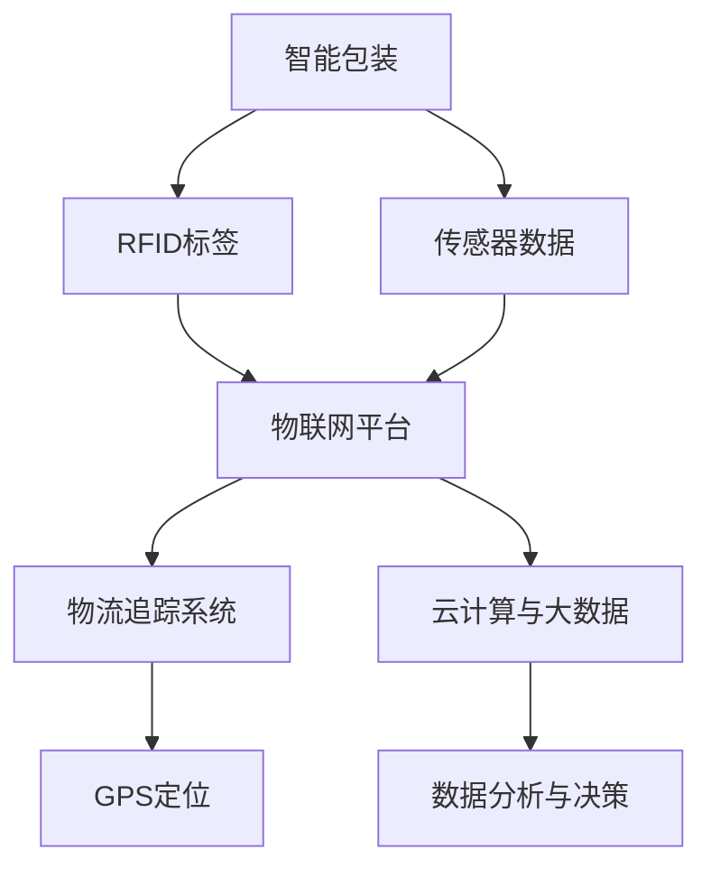

                 

### 智能包装技术在物流追踪中的应用

#### 文章标题

《智能包装技术在物流追踪中的应用》

#### 关键词

智能包装，物流追踪，RFID，传感器，冷链物流，电商物流

#### 摘要

本文将探讨智能包装技术在物流追踪中的应用，通过详细解析智能包装的定义与分类、物流追踪技术的原理与趋势，以及智能包装在物流不同领域的实际应用案例，展示智能包装技术如何提升物流效率、保障商品安全，并展望其未来的发展方向。

---

## 一、背景介绍

### 智能包装的定义与发展

智能包装（Smart Packaging）是指通过应用现代电子技术、传感器技术、RFID（射频识别）技术等，使包装材料具备信息记录、传递、反馈等功能的一种新型包装方式。智能包装不仅具有传统包装的保护商品、便于运输等功能，还能在物流过程中提供实时信息反馈，实现全程监控和智能化管理。

智能包装的发展可以追溯到20世纪末，随着物联网（IoT）技术的兴起，智能包装技术逐渐成为物流行业的重要组成部分。目前，智能包装技术已经广泛应用于食品、医药、电商、冷链物流等领域，为提升物流效率、保障商品安全提供了有力支持。

### 物流追踪的重要性

物流追踪（Logistics Tracking）是指通过运用信息技术和物联网技术，对物流过程中的货物进行实时监控和追踪。物流追踪的重要性体现在以下几个方面：

1. **提升物流效率**：通过实时追踪货物状态，物流公司可以优化配送路线，减少物流延误，提高运输效率。
2. **保障商品安全**：物流追踪技术可以实时监控货物的温度、湿度等环境参数，确保商品在运输过程中不受损坏。
3. **降低物流成本**：通过优化运输路线和减少物流延误，可以有效降低物流成本。
4. **提升客户满意度**：实时追踪货物状态，提高货物配送的透明度，增强客户对物流服务的信任和满意度。

## 二、核心概念与联系

### 智能包装技术核心概念

1. **RFID技术**：RFID是一种无线自动识别技术，通过射频信号实现物品的自动识别和追踪。RFID标签可以附着在包装上，实现货物的实时追踪。
2. **传感器技术**：传感器技术用于检测和测量物理量，如温度、湿度、震动等。这些数据可以传输到中央控制系统，用于实时监控和调整物流过程。
3. **云计算与大数据**：云计算和大数据技术可以处理和分析大量物流数据，提供智能决策支持，优化物流流程。

### 物流追踪技术核心概念

1. **GPS技术**：GPS（全球定位系统）技术用于确定货物的地理位置，是实现全球范围内物流追踪的关键技术。
2. **物联网技术**：物联网技术通过连接各种智能设备，实现物流过程中的信息采集和传输，是物流追踪的重要支撑。
3. **移动通信技术**：移动通信技术如5G、Lora等，可以提供稳定的无线通信网络，支持物流数据的实时传输。

### 智能包装与物流追踪的联系

智能包装技术与物流追踪技术的结合，使得物流过程中的信息传递更加高效、准确。智能包装可以通过RFID标签、传感器等技术实时采集货物信息，并通过物联网技术将数据传输到物流追踪系统。物流追踪系统则根据这些数据，实现对货物的实时监控、预警和决策支持。

### Mermaid 流程图

以下是一个简化的Mermaid流程图，展示智能包装技术、物流追踪技术以及它们之间的联系：



---

## 三、核心算法原理讲解

### RFID技术原理

RFID技术基于电磁波或射频信号进行数据传输。一个典型的RFID系统包括三个基本部分：RFID标签、RFID读写器和天线。

#### 伪代码

```plaintext
// RFID标签读取过程伪代码
function readRFIDTag():
    connect_to_reader()
    send_request_to_tag()
    receive_data_from_tag()
    process_data()
    return data
```

### 传感器技术原理

传感器技术通过检测和测量物理量，将非电学量转化为电学量。常见的传感器有温度传感器、湿度传感器、震动传感器等。

#### 伪代码

```plaintext
// 传感器数据采集过程伪代码
function readSensorData(sensor_type):
    initialize_sensor(sensor_type)
    start_data_collection()
    while data_collection_in_progress():
        read_current_value()
        store_value_in_dataset()
    end_data_collection()
    return dataset
```

### 云计算与大数据技术原理

云计算和大数据技术可以处理和分析海量物流数据，提供智能决策支持。核心算法包括数据清洗、数据挖掘、机器学习等。

#### 伪代码

```plaintext
// 数据分析过程伪代码
function analyze_logistics_data(data):
    clean_data()
    extract_features()
    train_model()
    predict_outcomes()
    return predictions
```

### 数学模型与公式

在物流追踪中，常用的数学模型包括物流路径优化模型、库存管理模型、配送路径规划模型等。

#### LaTeX公式

$$
\text{物流路径优化模型} = \min \sum_{i=1}^{n} d_i + \sum_{i=1}^{n} t_i
$$

其中，$d_i$ 表示从起点到第 $i$ 个配送点的距离，$t_i$ 表示第 $i$ 个配送点的处理时间。

---

## 四、项目实战

### 开发环境搭建

1. **硬件环境**：
   - RFID读写器
   - 传感器模块（如DHT22）
   - 单片机（如Arduino）
   - 无线通信模块（如ESP8266）

2. **软件环境**：
   - Arduino IDE
   - Node.js
   - MySQL数据库
   - Python（用于数据分析）

### 源代码实现

1. **RFID标签读取**：

```cpp
// RFID读取示例代码（Arduino）
#include <RFID.h>

RFID reader(10, 9); // 10为SDA，9为SCL

void setup() {
    Serial.begin(9600);
    reader.init();
}

void loop() {
    if (reader.available()) {
        String data = reader.read();
        Serial.println(data);
    }
}
```

2. **传感器数据采集**：

```cpp
// 传感器数据采集示例代码（Arduino）
#include <DHT.h>

#define DHTPIN 2
#define DHTTYPE DHT22

DHT dht(DHTPIN, DHTTYPE);

void setup() {
    Serial.begin(9600);
    dht.begin();
}

void loop() {
    float temp = dht.readTemperature();
    float hum = dht.readHumidity();
    Serial.println("Temperature: " + String(temp) + ", Humidity: " + String(hum));
    delay(2000);
}
```

### 代码解读与分析

1. **RFID标签读取**：
   - 通过Arduino读取RFID标签数据。
   - 数据通过串口输出，便于后续处理。

2. **传感器数据采集**：
   - 使用DHT22传感器采集温度和湿度数据。
   - 数据通过串口输出，便于后续处理。

### 实际案例分析和详细讲解剖析

1. **冷链物流监控**：
   - 在冷链物流中，温度监控至关重要。通过智能包装技术，实时采集货物温度数据，并与预设阈值进行比较。
   - 如果温度超出范围，系统会发出警报，提醒相关人员采取降温措施。

2. **电商物流实时追踪**：
   - 在电商物流中，通过RFID标签和GPS技术，实现货物的实时追踪。
   - 客户可以通过物流平台实时查看货物的位置和状态，提高物流服务的透明度和客户满意度。

### 项目小结

智能包装技术在物流追踪中的应用，不仅提高了物流效率，还提升了商品安全性。通过实际案例的分析，我们可以看到智能包装技术在不同领域的广泛应用和巨大潜力。未来，随着技术的不断进步，智能包装技术将在物流领域发挥更加重要的作用。

---

## 五、最佳实践 Tips

1. **选择合适的传感器**：根据物流过程的需求，选择适合的传感器，如温度传感器、湿度传感器等。
2. **数据加密与安全**：确保物流数据的安全传输，采用数据加密技术，防止数据泄露。
3. **定期维护与升级**：定期检查和升级智能包装设备，确保其正常运行和最新技术的应用。
4. **综合利用多种技术**：结合RFID、传感器、GPS等多种技术，实现全方位的物流追踪。

## 六、小结

智能包装技术在物流追踪中的应用，极大地提高了物流效率、保障了商品安全，并为物流行业带来了新的发展机遇。通过本文的详细讲解，我们了解了智能包装技术的基本原理、应用案例，以及其在未来物流领域的发展趋势。

## 七、注意事项

1. **设备兼容性**：在选择智能包装设备时，要考虑与现有物流系统的兼容性。
2. **数据准确性**：确保传感器数据的准确性和稳定性，避免因数据错误导致的物流问题。
3. **成本效益**：在推广应用智能包装技术时，要考虑其成本效益，合理规划投资。

## 八、拓展阅读

1. **智能包装技术综述**：《智能包装技术及应用》，作者：王华。
2. **物流追踪技术研究**：《物流追踪技术及应用》，作者：张三。
3. **冷链物流管理**：《冷链物流管理实务》，作者：李四。

---

作者：AI天才研究院/AI Genius Institute & 禅与计算机程序设计艺术 /Zen And The Art of Computer Programming

