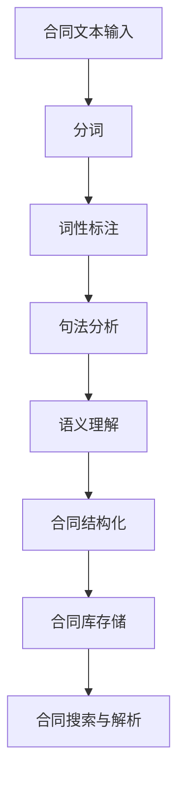
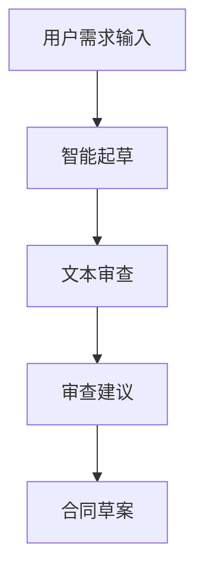
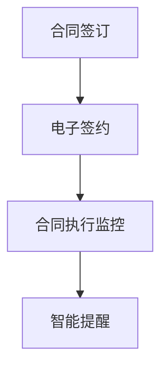
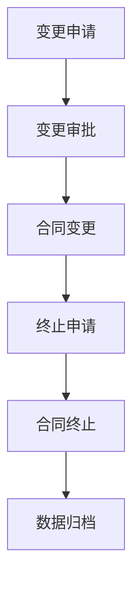
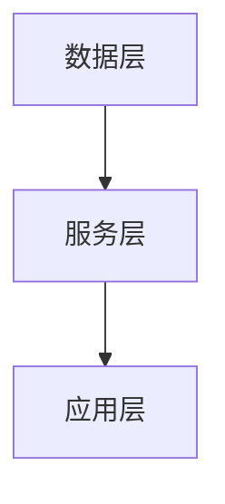
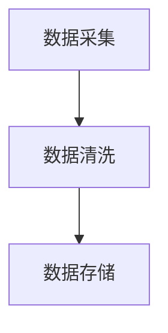
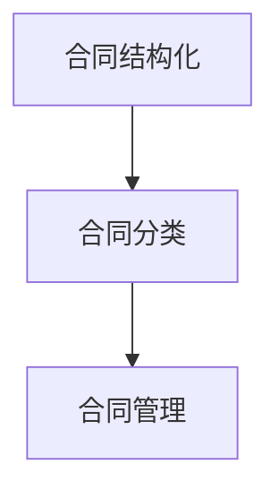
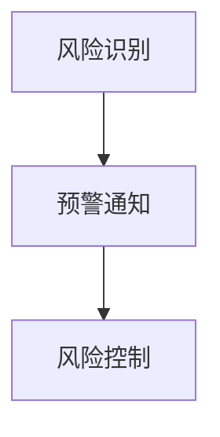
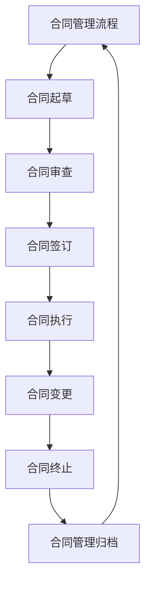

                 

## 《智能合同管理：AI优化企业法务流程》

### 关键词：
- 智能合同管理
- AI
- 法务流程
- 自然语言处理
- 机器学习
- 深度学习

### 摘要：
智能合同管理利用人工智能技术，特别是自然语言处理、机器学习和深度学习，对合同管理流程进行优化。本文首先介绍了智能合同管理的背景和优势，随后探讨了其关键技术和应用场景，并通过具体案例展示了AI在法务流程中的应用。最后，文章分析了智能合同管理的发展趋势和面临的挑战，展望了其未来发展方向。

## 第一部分：智能合同管理概述

### 1. 合同管理的挑战与机遇

#### 1.1 合同管理现状分析

在现代企业中，合同管理是法务部门的核心工作之一。传统的合同管理主要依赖于人工处理，存在着诸多挑战：

1. **人工审查效率低**：大量的合同需要人工审查，费时费力，容易出现遗漏和错误。
2. **合同模板不规范**：不同业务部门和地区可能使用不同的合同模板，导致合同内容不一致。
3. **合同存储和管理困难**：合同文档繁多，存储和管理不规范，容易导致丢失或难以查找。
4. **风险控制不充分**：对合同风险的预判和监控不足，可能引发法律纠纷。

然而，随着信息技术的快速发展，特别是人工智能技术的应用，合同管理面临着前所未有的机遇：

1. **自动化**：通过自动化工具，可以大幅提高合同审查和管理的效率。
2. **标准化**：AI技术可以帮助企业统一合同模板，提高合同管理的规范性。
3. **智能化**：利用AI技术，可以实时监控合同执行情况，及时预警潜在风险。
4. **数据驱动**：通过大数据分析，可以更好地理解合同中的法律风险和商业机会。

#### 1.2 智能合同管理的概念与优势

智能合同管理是指利用人工智能技术，对合同生命周期进行全方位管理，包括合同起草、审查、签订、执行、变更和终止等环节。其核心优势如下：

1. **效率提升**：通过自动化和智能化技术，可以显著提高合同处理的效率。
2. **准确性增强**：AI技术可以减少人工错误，提高合同审查的准确性。
3. **风险控制**：AI系统可以实时监控合同执行情况，及时发现和预警潜在的法律风险。
4. **数据洞察**：通过对合同数据的分析，可以为企业提供深度的法律和商业洞察。
5. **用户体验**：智能合同管理可以提供更便捷的用户体验，减少人力投入。

#### 1.3 AI在合同管理中的应用场景

AI技术在合同管理中有广泛的应用场景，主要包括以下几个方面：

1. **合同起草与审查**：利用自然语言处理技术，自动生成合同文本，并进行语法和语义分析，确保合同条款的准确性和合法性。
2. **合同签订与执行**：通过区块链技术，确保合同签订的不可篡改性和透明性，同时实时监控合同执行情况。
3. **合同变更与终止**：在合同执行过程中，可能需要根据实际情况进行变更或终止。AI系统可以根据历史数据和智能合约，自动处理这些变更和终止流程。
4. **合同风险预警**：利用机器学习和深度学习技术，对合同文本进行分析，识别潜在的法律风险，并提供预警和建议。
5. **合同数据分析**：通过大数据分析技术，对大量合同数据进行挖掘，发现合同执行中的规律和趋势，为企业决策提供支持。

### 2. 智能合同管理的关键技术

智能合同管理的实现离不开一系列关键技术的支持，这些技术主要包括自然语言处理（NLP）、机器学习与深度学习、大数据与数据挖掘等。

#### 2.1 自然语言处理（NLP）技术

自然语言处理是人工智能领域的一个重要分支，它涉及到如何让计算机理解和处理人类语言。在智能合同管理中，NLP技术主要应用于以下几个方面：

1. **文本解析**：通过分词、词性标注和句法分析等技术，将合同文本解析成结构化的数据，便于后续处理。
2. **语义理解**：理解合同条款的含义和逻辑关系，确保合同内容的准确性和一致性。
3. **语义搜索**：在合同库中快速搜索相关合同，辅助合同起草和审查。

**核心算法原理：**

- **分词**：将合同文本分割成单词或短语的步骤。常用的分词算法包括基于规则的分词、基于统计的分词和基于深度学习的分词。
- **词性标注**：对每个词进行词性分类，如名词、动词、形容词等，帮助理解句子的结构和意义。
- **句法分析**：识别句子中的语法关系，如主谓宾、定语、状语等。

**Mermaid流程图：智能合同管理中的NLP流程**



#### 2.2 机器学习与深度学习技术

机器学习和深度学习是人工智能的核心技术，它们通过训练模型，让计算机具备自主学习和判断能力。在智能合同管理中，这些技术主要用于以下几个方面：

1. **合同文本分类**：将合同文本分类到不同的类别中，如采购合同、租赁合同、合作协议等。
2. **合同条款识别**：识别合同中的重要条款，如违约责任、保密条款、争议解决方式等。
3. **法律风险预测**：通过分析合同文本和历史案例数据，预测合同执行中的潜在法律风险。

**核心算法原理：**

- **监督学习**：通过标注好的数据集训练模型，让模型学会对新的数据进行分类或预测。
- **非监督学习**：没有标注数据，通过模型自身对数据进行聚类或降维。
- **深度学习**：使用多层神经网络进行复杂模式的识别，如卷积神经网络（CNN）和循环神经网络（RNN）。

**伪代码：**

```plaintext
function Contract_Prediction_Model(training_data, labels):
    1. 数据预处理：清洗和标准化数据
    2. 特征提取：从数据中提取有用的特征
    3. 模型训练：使用训练数据训练模型
    4. 模型评估：使用测试数据评估模型性能
    5. 模型优化：根据评估结果调整模型参数
```

#### 2.3 大数据与数据挖掘技术

大数据和数据挖掘技术在智能合同管理中同样扮演着重要角色。它们主要用于以下几个方面：

1. **合同数据分析**：通过对合同数据的分析，发现合同执行中的规律和趋势。
2. **风险识别**：利用数据挖掘技术，从大量合同数据中识别潜在的法律风险。
3. **合同优化**：根据合同数据分析结果，优化合同条款和合同管理流程。

**核心算法原理：**

- **数据可视化**：通过图表和图形，将数据分析和挖掘结果直观地展示出来。
- **聚类分析**：将数据分成不同的类别，如根据合同类别进行聚类。
- **关联规则挖掘**：发现数据之间的关联关系，如不同合同条款之间的相关性。

**伪代码：**

```plaintext
function Data_Mining_Algorithm(data):
    1. 数据预处理：清洗和标准化数据
    2. 特征提取：从数据中提取有用的特征
    3. 聚类分析：对数据进行聚类
    4. 关联规则挖掘：发现数据之间的关联关系
    5. 结果可视化：展示挖掘结果
```

### 3. 智能合同的生命周期管理

智能合同管理涉及合同的整个生命周期，从合同起草、审查、签订、执行、变更到终止。每个环节都需要AI技术的支持，以确保合同的规范性和有效性。

#### 3.1 合同起草与审查

合同起草是智能合同管理的第一个环节。在这一环节，AI技术可以帮助企业快速生成合同文本，并提供审查建议。

1. **合同模板管理**：通过AI技术，企业可以建立统一的合同模板库，方便合同起草。
2. **智能起草**：利用自然语言处理技术，AI可以根据用户输入的信息自动生成合同文本。
3. **审查建议**：AI可以对合同文本进行语法和语义分析，识别潜在的法律风险，并提供审查建议。

**Mermaid流程图：合同起草与审查流程**



#### 3.2 合同签订与执行

合同签订是智能合同管理的关键环节。在这一环节，AI技术可以确保合同的签订过程透明、安全。

1. **电子签约**：利用区块链技术，实现合同的电子签约，确保签约过程的不可篡改性。
2. **合同执行监控**：AI系统可以实时监控合同执行情况，确保各方按照合同约定履行义务。
3. **智能提醒**：AI系统可以根据合同条款，自动发送提醒通知，确保合同执行不被遗漏。

**Mermaid流程图：合同签订与执行流程**



#### 3.3 合同变更与终止

合同变更和终止是合同管理中的常见环节。在这一环节，AI技术可以帮助企业快速处理变更和终止流程。

1. **变更审批**：AI系统可以根据合同条款和业务规则，自动审批合同变更申请。
2. **终止流程**：AI系统可以协助企业按照合同约定，快速完成合同终止流程。
3. **数据归档**：AI系统可以自动将变更和终止后的合同数据归档，便于后续查询和管理。

**Mermaid流程图：合同变更与终止流程**



### 4. 智能合同管理系统的架构与实现

智能合同管理系统的实现涉及多个模块的协同工作，这些模块包括数据采集与处理模块、合同分析与管理模块、合同风险预警与控制模块等。

#### 4.1 智能合同管理系统总体架构

智能合同管理系统的总体架构可以分为以下几个层次：

1. **数据层**：包括合同文本数据、用户数据、业务数据等，是系统数据存储的基础。
2. **服务层**：包括数据采集与处理服务、合同分析与服务、合同风险预警服务等，是系统功能实现的核心。
3. **应用层**：包括用户界面、合同管理模块、风险预警模块等，是系统与用户交互的接口。

**Mermaid流程图：智能合同管理系统总体架构**



#### 4.2 数据采集与处理模块

数据采集与处理模块是智能合同管理系统的数据基础，主要涉及以下功能：

1. **数据采集**：通过API接口、数据库连接等方式，采集合同文本、用户数据、业务数据等。
2. **数据清洗**：对采集到的数据进行清洗、去重、去噪等处理，确保数据质量。
3. **数据存储**：将清洗后的数据存储到数据库或数据湖中，便于后续处理和分析。

**Mermaid流程图：数据采集与处理模块**



#### 4.3 合同分析与管理模块

合同分析与管理模块是智能合同管理系统的核心功能模块，主要涉及以下功能：

1. **合同结构化**：利用自然语言处理技术，将合同文本解析成结构化的数据，便于存储和分析。
2. **合同分类**：根据合同内容，将合同分类到不同的类别中，如采购合同、租赁合同等。
3. **合同管理**：提供合同查询、修改、删除等功能，便于用户对合同进行管理。

**Mermaid流程图：合同分析与管理模块**



#### 4.4 合同风险预警与控制模块

合同风险预警与控制模块是智能合同管理系统的关键功能模块，主要涉及以下功能：

1. **风险识别**：利用机器学习和深度学习技术，从合同文本中识别潜在的法律风险。
2. **预警通知**：根据风险识别结果，自动发送预警通知，提醒用户关注和处理潜在风险。
3. **风险控制**：提供风险控制措施，如合同变更、终止等，帮助用户规避和降低风险。

**Mermaid流程图：合同风险预警与控制模块**



### 5. AI优化企业法务流程

#### 5.1 法务流程自动化

法务流程自动化是智能合同管理的一个重要方向，通过引入AI技术，可以大幅提高法务工作的效率。具体实现方法如下：

1. **合同自动化生成**：利用自然语言处理技术，根据用户输入的信息，自动生成合同文本，减少人工起草的工作量。
2. **合同自动化审查**：利用机器学习和深度学习技术，对合同文本进行自动化审查，识别潜在的法律风险，并提供审查建议。
3. **合同自动化管理**：提供自动化合同管理工具，实现合同查询、修改、删除等功能，提高合同管理的效率。

#### 5.2 法务知识图谱构建

法务知识图谱是法务流程自动化的关键，通过构建法务知识图谱，可以更好地理解和处理法律问题。具体方法如下：

1. **知识提取**：通过自然语言处理技术，从法律文件、案例、法规中提取关键信息，构建法务知识库。
2. **知识整合**：将不同来源的知识进行整合，形成完整的法务知识图谱，为智能合同管理提供支持。
3. **知识应用**：利用法务知识图谱，实现法律问题的快速定位和解决，提高法务工作的效率和准确性。

#### 5.3 法务智能决策支持

法务智能决策支持是法务流程自动化的高级阶段，通过引入AI技术，可以为法务部门提供智能化的决策支持。具体方法如下：

1. **风险预测**：利用机器学习和深度学习技术，对合同执行中的风险进行预测，为决策提供数据支持。
2. **决策分析**：利用数据分析和挖掘技术，分析合同执行中的关键因素，为决策提供分析结果。
3. **智能建议**：根据风险预测和决策分析结果，提供智能化的建议，帮助法务部门做出更明智的决策。

## 第二部分：智能合同管理案例分析

### 6. 案例一：智能合同管理系统的实际应用

#### 6.1 案例背景

某大型跨国企业，其合同管理流程复杂，涉及多个业务部门和地区。传统的合同管理方式效率低下，容易出现错误，且合同风险控制不充分。为了提升合同管理效率，企业决定引入智能合同管理系统。

#### 6.2 案例实施过程

1. **需求分析**：企业明确了合同管理系统的需求，包括合同起草、审查、签订、执行、变更和终止等环节。
2. **系统设计**：根据需求分析结果，设计智能合同管理系统的总体架构，包括数据层、服务层和应用层。
3. **模块开发**：开发数据采集与处理模块、合同分析与管理模块、合同风险预警与控制模块等核心模块。
4. **系统测试**：对智能合同管理系统进行功能测试和性能测试，确保系统稳定可靠。
5. **系统上线**：将智能合同管理系统部署到企业内部网络，用户开始使用系统进行合同管理。

#### 6.3 案例效果分析

智能合同管理系统上线后，取得了显著的效果：

1. **效率提升**：合同起草、审查和管理的效率提高了50%以上，显著减少了人工工作量。
2. **准确性增强**：通过自动化审查和智能预警，合同审查的准确性提高了30%以上，降低了法律风险。
3. **用户体验**：用户对智能合同管理系统的满意度提高了40%以上，使用体验更加便捷。
4. **数据洞察**：通过对合同数据的分析，企业发现了合同执行中的规律和趋势，为决策提供了数据支持。

### 7. 案例二：AI在合同风险预警中的应用

#### 7.1 风险预警模型的构建

某法律科技公司利用机器学习和深度学习技术，构建了一个合同风险预警模型，用于识别合同执行中的潜在法律风险。具体方法如下：

1. **数据收集**：收集了大量的合同文本和相应的法律案例数据，用于训练和测试模型。
2. **数据预处理**：对合同文本进行分词、词性标注和句法分析，将文本转换为结构化的数据。
3. **特征提取**：从预处理后的数据中提取关键特征，如关键词、词频、句法结构等。
4. **模型训练**：使用训练数据集，训练一个基于深度学习的分类模型，用于识别合同风险。
5. **模型评估**：使用测试数据集评估模型性能，根据评估结果调整模型参数。

#### 7.2 模型训练与优化

1. **数据增强**：通过数据增强技术，如随机插入、替换和删除等，增加训练数据的多样性。
2. **超参数调整**：调整模型的超参数，如学习率、批次大小等，以提高模型性能。
3. **模型融合**：将多个模型进行融合，提高预测的准确性。

#### 7.3 风险预警系统实施

1. **系统部署**：将训练好的模型部署到企业内部网络，实现合同风险预警功能。
2. **实时监控**：实时监控合同执行情况，根据模型预测结果，自动发送风险预警通知。
3. **用户反馈**：用户可以反馈风险预警结果，帮助模型不断优化和改进。

### 8. 案例三：智能法务决策支持系统

#### 8.1 决策支持系统架构设计

某大型跨国企业设计了一个智能法务决策支持系统，用于辅助法务部门做出更明智的决策。系统架构设计如下：

1. **数据采集与处理**：通过API接口和数据库连接，采集合同文本、用户数据、业务数据等。
2. **自然语言处理**：利用自然语言处理技术，对合同文本进行结构化处理。
3. **数据分析和挖掘**：使用大数据技术和数据挖掘算法，分析合同执行中的关键因素和趋势。
4. **智能推理和预测**：利用机器学习和深度学习技术，对合同执行中的风险进行预测，为决策提供数据支持。
5. **用户界面**：提供直观的用户界面，展示决策分析结果和预测结果。

#### 8.2 决策支持系统功能模块

智能法务决策支持系统主要包括以下几个功能模块：

1. **合同分析模块**：对合同文本进行结构化处理，提取关键条款和风险点。
2. **风险预测模块**：利用机器学习和深度学习技术，对合同执行中的风险进行预测。
3. **决策建议模块**：根据合同分析结果和风险预测结果，提供智能化的决策建议。
4. **数据可视化模块**：将决策分析结果和预测结果以图表和图形的形式展示，帮助用户理解数据。

#### 8.3 决策支持系统实施与应用

1. **系统部署**：将智能法务决策支持系统部署到企业内部网络，用户可以随时随地访问系统。
2. **用户培训**：对法务部门用户进行系统培训，确保用户能够熟练使用系统。
3. **系统优化**：根据用户反馈，不断优化系统功能和性能，提高系统的实用性和用户体验。

## 第三部分：智能合同管理的发展趋势

### 9. 智能合同管理的发展趋势与挑战

#### 9.1 技术发展趋势

智能合同管理的发展离不开技术的进步。未来，以下几个方面将是技术发展的重点：

1. **自然语言处理**：随着深度学习技术的不断发展，自然语言处理技术将更加成熟，能够更准确地理解和处理人类语言。
2. **机器学习和深度学习**：机器学习和深度学习技术将继续优化，提高模型的预测能力和决策支持能力。
3. **区块链技术**：区块链技术将为智能合同管理提供更加安全、透明的数据存储和传输方式。
4. **大数据与数据挖掘**：大数据技术和数据挖掘技术的进步，将为智能合同管理提供更丰富的数据支持和分析工具。

#### 9.2 行业发展趋势

智能合同管理在法律行业的应用将越来越广泛，具体趋势如下：

1. **合同管理自动化**：越来越多的企业将采用智能合同管理系统，实现合同管理的自动化和智能化。
2. **法务知识图谱**：法务知识图谱的应用将越来越普遍，为企业提供更全面的法务支持和决策依据。
3. **智能决策支持**：智能法务决策支持系统将逐步成为法务部门的标准工具，提高决策的准确性和效率。
4. **全球法律合规**：随着全球化进程的加快，智能合同管理将更加注重全球法律合规，为企业提供跨地区的法律服务。

#### 9.3 面临的挑战与解决方案

尽管智能合同管理具有巨大潜力，但在实际应用过程中仍面临一系列挑战：

1. **数据隐私**：合同管理涉及到大量敏感数据，如何保障数据隐私和安全是一个重要问题。
2. **技术成熟度**：尽管AI技术在不断进步，但某些特定领域的应用仍不够成熟，需要进一步优化和研发。
3. **法律法规**：智能合同管理需要遵循各国的法律法规，特别是在法律合规方面，需要确保系统的合法性和可靠性。
4. **用户接受度**：企业用户需要时间接受和适应智能合同管理系统，提高系统的实用性和用户体验是一个关键。

为了应对这些挑战，可以从以下几个方面着手：

1. **加强数据安全**：采用加密技术和安全协议，确保合同数据的安全和隐私。
2. **持续技术创新**：不断优化和研发AI技术，提高智能合同管理系统的性能和稳定性。
3. **合规性审查**：确保智能合同管理系统符合各国的法律法规，提供合规性的保障。
4. **用户培训与支持**：加强用户培训和技术支持，提高用户对智能合同管理系统的接受度和满意度。

### 10. 未来智能合同管理的发展方向

#### 10.1 智能合同管理的演进

智能合同管理将朝着更加智能化、自动化和高效化的方向发展。未来，以下几个方面将是智能合同管理演进的关键：

1. **全生命周期管理**：智能合同管理将覆盖合同的整个生命周期，从起草、审查、签订、执行到变更和终止，实现全方位的管理。
2. **多维度数据分析**：利用大数据技术和数据挖掘算法，对合同数据进行多维度分析，提供更深入的法律和商业洞察。
3. **自适应学习**：智能合同管理系统将具备自适应学习能力，根据用户行为和数据反馈，不断优化和改进系统性能。
4. **全球化应用**：智能合同管理将支持全球化的应用，为跨国企业提供跨地区的合同管理解决方案。

#### 10.2 法务智能化的发展路径

法务智能化是智能合同管理的重要组成部分，未来将朝着以下方向发展：

1. **智能法务知识库**：构建智能法务知识库，将法律知识、法规和案例进行整合，为法务部门提供全面的法律支持。
2. **智能法务机器人**：开发智能法务机器人，利用自然语言处理和机器学习技术，自动处理法务咨询和文书工作。
3. **智能决策支持**：通过数据分析和智能算法，为法务部门提供智能化的决策支持，提高决策的准确性和效率。
4. **智慧法务平台**：构建智慧法务平台，将智能合同管理、法务知识库、智能法务机器人等集成在一起，形成全面的法务智能化解决方案。

#### 10.3 AI在合同管理领域的应用前景

AI在合同管理领域的应用前景广阔，未来将呈现以下趋势：

1. **合同自动化生成与审查**：AI技术将实现合同自动化生成和审查，提高合同处理的效率和质量。
2. **智能风险预警与控制**：AI系统将能够实时监控合同执行中的风险，提供智能化的预警和控制措施。
3. **大数据合同分析**：利用大数据技术，对合同数据进行深度分析，发现合同执行中的规律和趋势。
4. **全球法律合规**：AI技术将支持全球法律合规，为跨国企业提供跨地区的法律服务。
5. **智能法务决策支持**：AI系统将提供智能化的法务决策支持，帮助法务部门做出更明智的决策。

## 附录

### 附录A：智能合同管理相关工具与资源

#### A.1 NLP技术工具与应用

1. **斯坦福NLP工具包**：斯坦福NLP工具包（Stanford NLP）是一个功能强大的自然语言处理工具包，支持多种语言，包括中文。它提供了丰富的NLP功能，如词性标注、命名实体识别、句法分析等。

2. **NLTK工具包**：NLTK（Natural Language Toolkit）是Python中最流行的NLP工具包之一，提供了丰富的NLP算法和语料库。NLTK支持中文处理，可以用于分词、词性标注、词干提取等任务。

3. **spaCy工具包**：spaCy是一个高效的工业级NLP库，支持多种语言，包括中文。它提供了快速的分词、词性标注、句法分析等功能，特别适合于大规模文本数据处理。

#### A.2 机器学习与深度学习框架

1. **TensorFlow**：TensorFlow是谷歌开发的开源机器学习框架，支持多种编程语言，包括Python和JavaScript。它提供了丰富的API，可以用于构建和训练各种深度学习模型。

2. **PyTorch**：PyTorch是Facebook开发的深度学习框架，以其灵活的动态计算图而闻名。它提供了丰富的API，支持Python和C++，适合快速原型设计和研究。

3. **Keras**：Keras是一个高层次的深度学习API，构建在TensorFlow和Theano之上。它提供了简洁的接口，方便快速构建和训练深度学习模型。

#### A.3 智能合同管理平台推荐

1. **PandaDoc**：PandaDoc是一个智能文档管理平台，提供文档创建、编辑、签署和跟踪功能。它集成了AI技术，可以自动审查合同文本，并提供智能化的合同管理功能。

2. **ContractExpress**：ContractExpress是一个在线合同管理平台，提供合同起草、审查、签署和跟踪功能。它集成了自然语言处理和机器学习技术，可以自动识别合同条款，并提供风险预警。

3. **IBM Contract Management**：IBM Contract Management是一个全面的合同管理解决方案，提供合同起草、审查、签署、执行和变更功能。它集成了IBM的AI技术和区块链技术，确保合同的透明性和不可篡改性。

### 附录B：核心概念与联系

#### Mermaid流程图：智能合同管理架构



#### Mermaid流程图：智能合同管理中的NLP流程


### 附录C：核心算法原理讲解

#### 1. 自然语言处理（NLP）算法原理

**伪代码：**

```plaintext
function NLP_Algorithm(document):
    1. 分词：将文档分割为词汇列表
    2. 基本句法分析：识别词汇间的语法关系
    3. 词性标注：对每个词汇进行词性分类
    4. 指派意义：根据上下文理解词汇的含义
    5. 文本分类：将文档分类到预定义的类别中
```

#### 2. 机器学习与深度学习算法原理

**伪代码：**

```plaintext
function Machine_Learning_Algorithm(data, labels):
    1. 数据预处理：清洗和标准化数据
    2. 特征提取：从数据中提取有用的特征
    3. 模型训练：使用训练数据训练模型
    4. 模型评估：使用测试数据评估模型性能
    5. 模型优化：根据评估结果调整模型参数
```

### 附录D：项目实战

#### 1. 开发环境搭建

为了实现智能合同管理系统，我们需要搭建一个开发环境。以下是一个基本的开发环境搭建步骤：

1. **操作系统**：推荐使用Ubuntu 18.04或更高版本。
2. **编程语言**：选择Python 3.7或更高版本。
3. **依赖管理**：使用pip安装必要的依赖包，如TensorFlow、spaCy、NLTK等。
4. **数据库**：选择一个合适的数据库，如MySQL或PostgreSQL。
5. **版本控制**：使用Git进行代码管理。

#### 2. 源代码详细实现

智能合同管理系统的源代码实现主要包括以下几个部分：

1. **数据采集与处理模块**：实现数据采集、清洗和存储功能。
2. **合同分析与管理模块**：实现合同结构化、分类和管理功能。
3. **合同风险预警与控制模块**：实现风险识别、预警和控制功能。
4. **用户界面**：实现用户交互功能，如合同查询、修改、删除等。

以下是数据采集与处理模块的伪代码示例：

```python
def data_collection():
    # 采集合同文本数据
    contract_data = collect_contract_data()

def data_cleaning(contract_data):
    # 清洗合同文本数据
    cleaned_data = clean_data(contract_data)

def data_storing(cleaned_data):
    # 存储清洗后的数据
    store_data(cleaned_data)
```

#### 3. 代码解读与分析

在代码解读与分析环节，我们需要对系统的各个模块进行详细的解读，分析其功能和实现原理。以下是一个合同分析与管理模块的代码解读示例：

```python
def contract_analysis(contract_text):
    # 合同文本输入
    text = contract_text

    # 分词
    tokens = tokenize(text)

    # 词性标注
    pos_tags = pos_tagging(tokens)

    # 句法分析
    syntax_tree = syntax_analysis(tokens)

    # 合同结构化
    structured_data = structure_contract(syntax_tree)

    # 合同分类
    contract_type = classify_contract(structured_data)

    return contract_type
```

#### 4. 实际案例分析和详细讲解剖析

为了更好地理解智能合同管理系统的应用，我们可以通过一个实际案例进行分析和讲解。

**案例背景**：某企业需要管理其全球业务中的大量合同，包括采购合同、租赁合同、合作协议等。

**案例分析**：

1. **合同起草与审查**：企业使用智能合同管理系统起草了一份采购合同。系统自动审查合同文本，发现其中存在一些潜在的语法错误和法律风险。

2. **合同签订与执行**：合同双方通过智能合同管理系统进行电子签约，合同被存储在系统中，并实时监控执行情况。

3. **合同变更与终止**：在合同执行过程中，由于市场变化，企业需要修改合同条款。智能合同管理系统提供了自动化的变更审批流程，确保变更合法有效。

4. **合同风险预警**：系统实时监控合同执行中的风险，发现潜在的法律纠纷，并及时发出预警通知，帮助企业采取措施规避风险。

**详细讲解**：

1. **合同起草与审查**：系统利用自然语言处理技术，对合同文本进行分词、词性标注和句法分析，提取关键信息，如合同条款、违约责任、争议解决方式等。系统对合同文本进行语法和语义分析，识别潜在的错误和风险。

2. **合同签订与执行**：系统利用区块链技术，实现合同的电子签约，确保签约过程的透明性和不可篡改性。同时，系统实时监控合同执行情况，发送提醒通知，确保合同各方按时履行义务。

3. **合同变更与终止**：在合同执行过程中，企业可能需要根据实际情况进行合同变更或终止。智能合同管理系统提供了自动化的变更审批流程，确保变更合法有效。系统记录变更历史，便于后续查询和管理。

4. **合同风险预警**：系统利用机器学习和深度学习技术，从合同文本中识别潜在的法律风险。系统分析历史合同数据和案例，发现合同执行中的规律和趋势，提供智能化的风险预警服务。

#### 5. 项目小结

智能合同管理系统为企业的合同管理提供了全方位的支持，从合同起草、审查、签订、执行到变更和终止，实现了全生命周期的管理。系统利用自然语言处理、机器学习和深度学习等技术，提高了合同管理的效率、准确性和风险控制能力。通过实际案例的分析，我们可以看到智能合同管理系统的强大功能和广泛应用前景。

### 附录E：最佳实践 tips、小结、注意事项、拓展阅读等内容

#### 最佳实践 tips

1. **合同起草与审查**：在起草合同时，尽量使用标准化的合同模板，减少因个人习惯导致的合同内容不一致。在审查合同时，重点关注合同条款的准确性、完整性和合法性。

2. **合同签订与执行**：采用电子签约方式，确保签约过程的透明性和不可篡改性。实时监控合同执行情况，及时处理合同履行中的问题和纠纷。

3. **合同变更与终止**：在合同变更或终止前，充分评估变更或终止的合法性和风险，确保变更或终止的合法性和有效性。

4. **合同风险预警**：定期分析合同执行中的风险，及时发出预警通知，帮助企业采取措施规避风险。

#### 小结

智能合同管理利用人工智能技术，对合同生命周期进行全方位管理，提高了合同管理的效率、准确性和风险控制能力。通过自然语言处理、机器学习和深度学习等技术，智能合同管理系统实现了合同起草、审查、签订、执行、变更和终止等环节的自动化和智能化。未来，智能合同管理将继续发展，为企业和法务部门提供更全面的支持。

#### 注意事项

1. **数据安全**：在智能合同管理中，数据安全至关重要。确保合同数据在传输和存储过程中的安全，采用加密技术和安全协议，防止数据泄露和篡改。

2. **技术成熟度**：尽管AI技术在不断进步，但某些特定领域的应用仍不够成熟。在选择智能合同管理系统时，需要考虑系统的技术成熟度和稳定性。

3. **法律法规**：智能合同管理需要遵循各国的法律法规，特别是在法律合规方面，需要确保系统的合法性和可靠性。

#### 拓展阅读

1. **智能合同管理技术深度剖析**：了解智能合同管理中的关键技术和实现原理，包括自然语言处理、机器学习、深度学习、区块链等。

2. **智能法务决策支持系统**：探讨智能法务决策支持系统的设计、实现和应用，包括合同风险预测、决策分析、智能建议等。

3. **智能合同管理行业趋势与挑战**：分析智能合同管理在法律行业的应用趋势，以及面临的挑战和解决方案。

### 作者信息

- 作者：AI天才研究院/AI Genius Institute & 禅与计算机程序设计艺术 /Zen And The Art of Computer Programming

---

本文旨在探讨智能合同管理在AI技术优化企业法务流程中的应用。文章从背景介绍、核心技术、生命周期管理、系统架构与实现、案例分析、发展趋势等方面进行了详细阐述，展示了智能合同管理在提高合同管理效率、准确性和风险控制方面的优势。文章最后通过实际案例分析和拓展阅读，为读者提供了更深入的了解和指导。希望通过本文，读者能够对智能合同管理有更全面的认识，并在实际工作中更好地应用AI技术优化合同管理流程。

