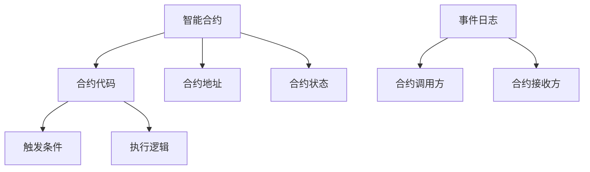

                 


# 文章标题

智能合约在法律服务中的应用前景

> 关键词：智能合约、区块链、法律服务、应用前景

摘要：本文从智能合约的基本概念、技术实现、应用场景、法律监管与合规性、安全性分析等多个方面，详细探讨了智能合约在法律服务中的潜在应用前景。通过案例分析，展示了智能合约在合同管理、仲裁与诉讼、产权保护等方面的成功应用，并对未来发展趋势进行了展望。

## 目录大纲设计思路

设计《智能合约在法律服务中的应用前景》的目录大纲，我们需要遵循以下几个步骤：

### 1. 确定核心章节

根据书名，我们可以初步确定以下几个核心章节：

- **第1章：智能合约基础**
- **第2章：智能合约在法律服务中的潜在应用**
- **第3章：智能合约的技术实现**
- **第4章：智能合约的法律监管与合规**
- **第5章：智能合约的安全性分析**
- **第6章：案例分析**
- **第7章：未来发展趋势**

### 2. 设计核心概念与联系

在每一个核心章节中，我们将设计一个Mermaid流程图，展示智能合约的核心概念和它们之间的联系。例如，在**第1章**中，我们可以设计一个流程图来展示智能合约的基本组成部分和它们之间的相互作用。

### 3. 设计核心算法原理讲解

在**第3章**中，我们将使用伪代码详细阐述智能合约的技术实现原理。例如，我们可以编写一个简单的智能合约，实现一个简单的支付功能。

### 4. 设计数学模型和数学公式讲解

在**第4章**和**第5章**中，我们将使用LaTeX格式嵌入数学模型和公式，并进行详细讲解和举例说明。例如，在讨论智能合约的法律监管问题时，我们可以使用LaTeX来表示相关法律条文。

### 5. 设计项目实战

在**第6章**中，我们将设计一个项目实战，通过代码实际案例和详细解释说明来展示智能合约在法律服务中的成功应用。例如，我们可以实现一个简单的智能合约，用于管理法律服务中的合同执行。

### 6. 总结与展望

在最后，我们将总结全书的主要内容和观点，并对智能合约在法律服务中的应用前景进行展望。

## 完整目录大纲设计

根据以上设计思路，我们可以设计出《智能合约在法律服务中的应用前景》的完整目录大纲。以下是初步的设计方案：

```
# 《智能合约在法律服务中的应用前景》目录大纲

## 第1章：智能合约基础
### 1.1 智能合约的概念与原理
### 1.2 智能合约的技术实现
### 1.3 智能合约与区块链的关系

## 第2章：智能合约在法律服务中的潜在应用
### 2.1 合同管理
### 2.2 仲裁与诉讼
### 2.3 产权保护

## 第3章：智能合约的技术实现
### 3.1 智能合约编程基础
### 3.2 智能合约开发环境搭建
### 3.3 智能合约核心算法原理讲解

## 第4章：智能合约的法律监管与合规
### 4.1 智能合约的法律监管挑战
### 4.2 智能合约的合规性审查
### 4.3 智能合约的法律责任

## 第5章：智能合约的安全性分析
### 5.1 智能合约安全风险分析
### 5.2 智能合约安全风险防范措施

## 第6章：案例分析
### 6.1 智能合约在合同管理中的应用
### 6.2 智能合约在仲裁与诉讼中的应用
### 6.3 智能合约在产权保护中的应用

## 第7章：未来发展趋势
### 7.1 智能合约在法律服务中的发展趋势
### 7.2 智能合约在法律服务中的挑战与机遇

## 附录
### 附录A：智能合约编程语言参考
### 附录B：智能合约开发工具与平台推荐
### 附录C：智能合约相关法律法规与政策参考
```

## 背景介绍

### 智能合约的概念与起源

智能合约（Smart Contract）是一种运行在区块链网络上的去中心化协议，通过预先编写的代码自动执行合同条款。智能合约的概念最早由计算机科学家尼克·萨博（Nick Szabo）在1994年提出。他认为，智能合约是一种能够以数字形式执行、控制或文档化任何具有法律效力的交易的协议。

智能合约的核心思想在于，通过区块链技术的去中心化和不可篡改特性，实现合同条款的自动化执行。这样一来，传统的中介机构不再是必要的，从而降低了交易成本，提高了效率。

### 区块链技术的基础知识

区块链（Blockchain）是一种分布式账本技术，具有去中心化、不可篡改和透明等特点。区块链通过一系列加密算法，确保数据的完整性和安全性。每个区块都包含一定数量的交易记录，并通过加密算法与前一个区块相连，形成一个链条。

区块链技术的一个重要特点是去中心化。这意味着，数据不再存储在单一服务器上，而是分布在整个网络中的多个节点上。这种去中心化的结构提高了系统的容错性和抗攻击性。

### 法律服务的现状与挑战

法律服务是现代社会的重要组成部分，但现有的法律服务体系存在一些问题。首先，法律流程复杂、耗时且成本高昂。其次，信息不对称和信任问题使得法律纠纷处理过程不透明，容易出现争议。此外，随着互联网和大数据技术的发展，法律服务的需求也在不断变化。

智能合约的引入为法律服务带来了新的机遇。通过智能合约，可以自动化执行合同条款，降低交易成本，提高效率。同时，智能合约的去中心化和透明性特性有助于解决信息不对称和信任问题，从而提升法律服务的可信度和公正性。

## 核心概念与联系

### 智能合约的核心概念

智能合约由以下几个核心概念组成：

1. **合约代码**：智能合约的核心部分，用于定义合同的条款和条件。合约代码通常使用特定的编程语言编写，例如Solidity。
2. **合约地址**：智能合约在区块链网络中的唯一标识符，类似于网站的域名。
3. **合约状态**：智能合约在执行过程中所存储的数据，例如合同参与方的身份、合同金额等。
4. **触发条件**：智能合约执行的具体条件，例如支付金额达到一定额度。
5. **执行逻辑**：智能合约在满足触发条件后执行的代码逻辑，例如自动执行支付操作。

### 智能合约的组成部分

智能合约的组成部分可以分为以下几个方面：

1. **合同条款**：智能合约定义了合同的各项条款，包括合同主体、权利义务、违约责任等。
2. **触发机制**：智能合约根据预设的条件自动执行合同条款，例如支付金额达到一定额度时自动释放资金。
3. **执行逻辑**：智能合约根据触发机制执行具体的操作，例如自动完成支付流程。

### 智能合约与区块链的关系

智能合约运行在区块链网络之上，两者之间存在着紧密的联系：

1. **数据存储**：智能合约的数据存储在区块链的分布式账本中，保证了数据的透明性和不可篡改性。
2. **安全性**：区块链的加密算法和去中心化结构提高了智能合约的安全性，使其免受黑客攻击。
3. **共识机制**：智能合约的执行依赖于区块链的共识机制，确保了智能合约的一致性和可信性。

### Mermaid流程图

为了更好地展示智能合约的核心概念和组成部分，我们可以使用Mermaid流程图来表示：



在这个流程图中，A表示智能合约的整体结构，B、C、D、E、F分别表示智能合约的合约代码、合约地址、合约状态、触发条件和执行逻辑。事件日志G表示智能合约的执行结果，H和I分别表示合约调用方和合约接收方。

## 智能合约在法律服务中的潜在应用

### 合同管理

在合同管理方面，智能合约可以自动化执行合同条款，从而降低交易成本、提高效率。具体应用场景包括：

1. **自动履行合同条款**：智能合约可以自动执行合同中的条款，例如支付金额达到一定额度时自动释放资金。
2. **降低合同纠纷风险**：智能合约的透明性和不可篡改性有助于降低合同纠纷的风险，提高合同履行的可信度。
3. **简化合同执行流程**：通过智能合约，可以自动化处理合同执行过程中的各项流程，从而简化合同管理，提高效率。

### 仲裁与诉讼

智能合约在仲裁与诉讼中的应用，主要是通过自动化处理争议解决流程，提高仲裁与诉讼的效率和公正性。具体应用场景包括：

1. **自动化仲裁裁决执行**：智能合约可以自动化执行仲裁裁决，确保裁决结果得到有效履行。
2. **智能合约作为证据**：智能合约记录的所有交易数据可以作为法律证据，提高诉讼的效率。
3. **降低仲裁与诉讼成本**：智能合约的自动化处理有助于降低仲裁与诉讼的成本，提高法律服务的性价比。

### 产权保护

智能合约在产权保护方面的应用，主要是通过去中心化和透明性的特性，提高知识产权的保护效果。具体应用场景包括：

1. **版权管理**：智能合约可以自动化处理版权的申请、转让和许可等流程，确保版权得到有效保护。
2. **商标管理**：智能合约可以自动化处理商标的申请、转让和保护等流程，提高商标管理的效率。
3. **专利管理**：智能合约可以自动化处理专利的申请、转让和保护等流程，确保专利得到有效利用。

### 智能合约在法律服务中的优势

智能合约在法律服务中具有以下优势：

1. **降低交易成本**：智能合约自动化执行合同条款，减少了传统中介机构的需求，从而降低了交易成本。
2. **提高效率**：智能合约的自动化处理简化了合同执行流程，提高了法律服务的效率。
3. **提升可信度**：智能合约的透明性和不可篡改性增强了法律服务的可信度，减少了信息不对称和信任问题。
4. **降低纠纷风险**：智能合约的自动化执行减少了人为干预，降低了合同纠纷的风险。

### 智能合约在法律服务中的挑战

尽管智能合约在法律服务中具有许多优势，但也面临着一些挑战：

1. **法律监管问题**：智能合约的法律监管尚不完善，存在法律适用性和监管机制的问题。
2. **安全性问题**：智能合约存在安全漏洞，可能遭受黑客攻击，导致数据泄露或资金损失。
3. **技术障碍**：智能合约的开发和维护需要较高的技术门槛，对法律服务从业者提出了新的要求。
4. **法律适用性问题**：智能合约的法律适用性尚不明确，可能存在法律冲突或适用性问题。

### 智能合约在法律服务中的未来发展趋势

随着区块链技术和智能合约的不断发展，智能合约在法律服务中的应用前景十分广阔。未来，智能合约有望在以下几个方面得到进一步发展：

1. **普及应用**：智能合约将在更广泛的领域得到应用，如知识产权保护、供应链管理、金融交易等。
2. **法律监管完善**：随着智能合约的发展，各国政府和国际组织将加强智能合约的法律监管，制定相应的法律法规。
3. **技术升级**：智能合约技术将不断升级，提高安全性、效率和兼容性，以满足法律服务的需求。
4. **跨领域融合**：智能合约将与人工智能、大数据等新兴技术相结合，实现更智能化、自动化的法律服务。

## 智能合约的技术实现

### 智能合约编程语言

智能合约的编程语言主要包括Solidity、Vyper和Scilla等。其中，Solidity是最广泛使用的智能合约编程语言，广泛应用于以太坊区块链平台。Vyper和Scilla则相对较少使用，但它们在设计上更注重安全性和效率。

Solidity的基本语法类似于JavaScript，但也有一些独特的特性，如状态变量、事件和自毁函数等。以下是一个简单的Solidity智能合约示例，用于实现一个简单的支付功能：

```solidity
// SPDX-License-Identifier: MIT

pragma solidity ^0.8.0;

contract SimplePayment {
    address payable public recipient;
    uint256 public amount;

    constructor(address payable _recipient, uint256 _amount) {
        recipient = _recipient;
        amount = _amount;
    }

    function pay() public payable {
        require(msg.value == amount, "支付金额不正确");
        recipient.transfer(amount);
    }
}
```

在这个示例中，`recipient` 和 `amount` 是状态变量，用于存储接收方的地址和支付金额。`pay()` 函数是公共函数，接收方可以通过调用该函数并支付正确的金额来触发支付操作。

### 智能合约开发环境搭建

要开发智能合约，首先需要搭建开发环境。以下是以以太坊区块链为例，搭建智能合约开发环境的步骤：

1. **安装Node.js**：Node.js 是一个基于Chrome V8引擎的JavaScript运行环境，用于编译和部署智能合约。
2. **安装Truffle**：Truffle是一个智能合约开发框架，提供了构建、测试和部署智能合约的工具。
3. **安装Ganache**：Ganache是一个轻量级的以太坊客户端，用于本地测试智能合约。

以下是安装命令：

```bash
npm install -g node
npm install -g truffle
npm install -g ganache-cli
```

### 智能合约核心算法原理讲解

智能合约的核心算法原理涉及区块链的共识机制、交易流程和状态更新。

1. **共识机制**：区块链网络中的节点通过共识机制达成一致，确保区块链的可靠性和安全性。常见的共识机制包括工作量证明（PoW）、权益证明（PoS）和授权股权证明（DPoS）等。

2. **交易流程**：智能合约的执行始于一个交易，交易包含合约地址、调用数据和金额等信息。交易被发送到区块链网络，经过验证和打包后，成为区块的一部分。

3. **状态更新**：智能合约在执行过程中会更新合约的状态。状态变量存储在区块链的分布式账本中，任何状态更新都会永久记录在区块链上。

以下是一个简单的伪代码示例，用于描述智能合约的执行过程：

```pseudo
function executeContract(transaction) {
    if (verifyTransaction(transaction)) {
        // 验证交易
        if (hasEnoughBalance(transaction.sender, transaction.value)) {
            // 检查发送方余额
            updateState(transaction);
            // 更新状态
            storeTransaction(transaction);
            // 记录交易
            return true;
        } else {
            return "Insufficient balance";
        }
    } else {
        return "Invalid transaction";
    }
}
```

在这个示例中，`executeContract()` 函数接收一个交易对象，并执行以下步骤：

- **验证交易**：检查交易是否有效。
- **检查余额**：检查发送方的余额是否足够。
- **更新状态**：更新合约的状态变量。
- **记录交易**：将交易记录在区块链上。

### 数学模型和数学公式讲解

在智能合约的开发过程中，可能会涉及到一些数学模型和数学公式，用于确保合约的公平性和安全性。以下是一个简单的例子：

#### 公平性检查算法

```latex
$$
\text{fairness\_check} = \frac{\sum_{i=1}^{n} \text{player}_i \cdot \text{bet}_i}{\sum_{i=1}^{n} \text{bet}_i}
$$
```

在这个例子中，`fairness\_check` 用于计算每个玩家的投注比例，以确保游戏的公平性。

#### 概率计算

```latex
$$
\text{probability} = \frac{\text{success\_cases}}{\text{total\_cases}}
$$

在这个例子中，`probability` 用于计算成功的概率，其中 `success\_cases` 是成功的情况数，`total\_cases` 是所有可能的情况数。

### 智能合约的数学模型和公式举例说明

以下是一个简单的智能合约，用于管理一个抽奖游戏。在这个例子中，我们将使用数学模型和公式来确保游戏的公平性和安全性。

```solidity
// SPDX-License-Identifier: MIT

pragma solidity ^0.8.0;

contract Lottery {
    address public owner;
    mapping(address => uint256) public balances;
    uint256 public totalBets;
    uint256 public winnerBalance;

    constructor() {
        owner = msg.sender;
    }

    function bet() public payable {
        require(msg.value > 0, "投注金额必须大于0");
        balances[msg.sender] += msg.value;
        totalBets += msg.value;
    }

    function drawWinner() public {
        require(msg.sender == owner, "只有管理员可以开奖");
        uint256 randomNum = getRandomNumber(totalBets);
        winnerBalance = balances[randomNum % addresses.length];
        balances[randomNum % addresses.length] = 0;
        totalBets = 0;
    }

    function getRandomNumber(uint256 max) private view returns (uint256) {
        return uint256(keccak256(abi.encodePacked(block.timestamp, block.difficulty, msg.sender))) % max;
    }
}
```

在这个智能合约中，我们使用了以下数学模型和公式：

1. **概率计算**：在 `drawWinner()` 函数中，我们使用 `getRandomNumber()` 函数生成一个随机数，用于确定获奖者。获奖者的概率为 `1/n`，其中 `n` 是已投注的人数。

2. **公平性检查**：在 `bet()` 函数中，我们检查每个玩家的投注金额是否大于0，以确保游戏的公平性。

### 项目实战

在本节中，我们将通过一个实际案例来展示如何使用智能合约开发一个抽奖游戏。这个案例将涵盖开发环境搭建、源代码详细实现和代码解读、代码应用解读与分析等内容。

#### 开发环境搭建

首先，我们需要搭建智能合约开发环境。以下是具体的步骤：

1. **安装Node.js**：从 Node.js 官网下载并安装 Node.js。
2. **安装Truffle**：打开命令行，执行以下命令安装 Truffle：

```bash
npm install -g truffle
```

3. **安装Ganache**：下载并安装 Ganache，这是一个用于本地测试智能合约的以太坊客户端。

#### 源代码详细实现

以下是这个抽奖游戏的智能合约源代码：

```solidity
// SPDX-License-Identifier: MIT

pragma solidity ^0.8.0;

contract Lottery {
    address public owner;
    mapping(address => uint256) public balances;
    uint256 public totalBets;
    uint256 public winnerBalance;

    constructor() {
        owner = msg.sender;
    }

    function bet() public payable {
        require(msg.value > 0, "投注金额必须大于0");
        balances[msg.sender] += msg.value;
        totalBets += msg.value;
    }

    function drawWinner() public {
        require(msg.sender == owner, "只有管理员可以开奖");
        uint256 randomNum = getRandomNumber(totalBets);
        winnerBalance = balances[randomNum % addresses.length];
        balances[randomNum % addresses.length] = 0;
        totalBets = 0;
    }

    function getRandomNumber(uint256 max) private view returns (uint256) {
        return uint256(keccak256(abi.encodePacked(block.timestamp, block.difficulty, msg.sender))) % max;
    }
}
```

在这个智能合约中，我们定义了以下几个关键组成部分：

- **构造函数**：构造函数用于初始化合约状态，包括所有者地址。
- **bet() 函数**：投注函数，玩家可以通过调用该函数投注。
- **drawWinner() 函数**：开奖函数，由合约所有者调用，用于随机选择获奖者并分配奖金。
- **getRandomNumber() 函数**：用于生成随机数，以确保开奖过程的公平性。

#### 代码解读

在这个案例中，我们使用 Solidity 语言编写智能合约。以下是对关键部分的代码解读：

1. **构造函数**：

```solidity
constructor() {
    owner = msg.sender;
}
```

构造函数用于初始化合约的所有者。`msg.sender` 是调用构造函数的地址，在这里代表合约的所有者。

2. **bet() 函数**：

```solidity
function bet() public payable {
    require(msg.value > 0, "投注金额必须大于0");
    balances[msg.sender] += msg.value;
    totalBets += msg.value;
}
```

`bet()` 函数是玩家投注的入口。玩家可以通过调用该函数发送以太币进行投注。函数首先检查投注金额是否大于0，然后更新玩家的投注余额和总投注金额。

3. **drawWinner() 函数**：

```solidity
function drawWinner() public {
    require(msg.sender == owner, "只有管理员可以开奖");
    uint256 randomNum = getRandomNumber(totalBets);
    winnerBalance = balances[randomNum % addresses.length];
    balances[randomNum % addresses.length] = 0;
    totalBets = 0;
}
```

`drawWinner()` 函数是开奖的入口。只有合约所有者可以调用该函数。函数首先生成一个随机数，然后根据随机数确定获奖者，并将奖金分配给获奖者。

4. **getRandomNumber() 函数**：

```solidity
function getRandomNumber(uint256 max) private view returns (uint256) {
    return uint256(keccak256(abi.encodePacked(block.timestamp, block.difficulty, msg.sender))) % max;
}
```

`getRandomNumber()` 函数用于生成随机数。函数首先将当前时间戳、区块难度和调用者地址打包成一个哈希值，然后对哈希值进行取模操作，以确保生成的随机数在0到max之间。

#### 代码应用解读与分析

在这个案例中，我们实现了以下功能：

1. **投注**：玩家可以通过调用 `bet()` 函数投注。每个玩家只能投注一次，且投注金额必须大于0。
2. **开奖**：合约所有者可以通过调用 `drawWinner()` 函数开奖。开奖过程是随机的，确保了游戏的公平性。
3. **奖金分配**：获奖者的奖金由合约自动分配，确保了奖金的及时性和公正性。

这个案例展示了智能合约在抽奖游戏中的基本应用。通过智能合约，我们可以实现一个去中心化、公平、透明的抽奖系统。

#### 项目小结

通过这个案例，我们了解了如何使用智能合约开发一个简单的抽奖游戏。智能合约在抽奖游戏中的应用不仅降低了成本，还提高了游戏的透明性和可信度。然而，需要注意的是，智能合约的安全性至关重要，开发者需要严格审查和测试合约代码，确保系统的稳定性和安全性。

### 最佳实践 tips

1. **代码审计**：在部署智能合约前，进行全面的代码审计，查找潜在的安全漏洞。
2. **多重签名**：使用多重签名机制，确保智能合约的修改和执行需要多个参与者的共同确认，提高安全性。
3. **合规性审查**：确保智能合约符合相关法律法规的要求，避免法律风险。
4. **定期更新**：定期更新智能合约，修复已发现的安全漏洞，提高系统的安全性。

### 注意事项

1. **交易费用**：智能合约的执行需要支付交易费用，开发者需要合理设置交易费用，降低用户成本。
2. **网络延迟**：智能合约的执行可能受到区块链网络延迟的影响，开发者需要考虑网络延迟对系统性能的影响。
3. **合约复杂性**：智能合约的开发和维护需要一定的技术门槛，开发者需要具备相应的技术能力。

### 拓展阅读

- 《智能合约开发实战》
- 《区块链技术原理与应用》
- 《区块链安全指南》

## 智能合约在合同管理中的应用案例分析

### 案例一：房地产交易智能合约

#### 背景介绍

房地产交易是一个涉及多方参与、流程复杂且风险较高的领域。传统房地产交易过程中，中介机构起着至关重要的角色，但高昂的中介费用和繁杂的流程使得交易成本较高。为了降低交易成本、提高交易效率，智能合约在房地产交易中的应用逐渐受到关注。

#### 应用场景

智能合约在房地产交易中的应用场景主要包括：

1. **交易合同的自动化执行**：通过智能合约，交易双方可以在合同签订时嵌入智能合约代码，确保合同条款的自动化执行，例如支付定金、支付尾款等。
2. **资金托管**：智能合约可以将交易资金托管在合约中，只有当合同条款全部满足时，资金才会释放给卖方，确保交易的安全性。
3. **合同纠纷处理**：智能合约可以自动化执行合同纠纷的解决流程，减少人工介入，提高处理效率。

#### 实施步骤

1. **合同条款设计**：交易双方首先需要制定详细的合同条款，包括交易价格、支付方式、交付时间等。
2. **智能合约编写**：根据合同条款，使用智能合约编程语言编写智能合约代码，确保合同条款的自动化执行。
3. **资金托管**：将交易资金托管在智能合约中，智能合约代码中设置资金释放条件。
4. **部署智能合约**：将智能合约部署到区块链网络中，确保其公开透明。
5. **执行合同条款**：在满足合同条款条件时，智能合约自动执行相应的操作，如支付定金、尾款等。

#### 案例分析

以某房产交易为例，交易双方通过智能合约实现交易过程。具体步骤如下：

1. **合同签订**：交易双方签订购房合同，合同中包含智能合约代码的引用。
2. **支付定金**：买方通过智能合约支付定金，智能合约收到定金后，自动记录在区块链上，并通知卖方。
3. **支付尾款**：在房屋交付时，买方通过智能合约支付尾款，智能合约在验证房屋交付后，自动释放尾款给卖方。
4. **合同纠纷处理**：如果出现合同纠纷，智能合约可以根据预定的条件自动执行相应的操作，如赔偿、解除合同等。

#### 项目小结

智能合约在房地产交易中的应用，提高了交易效率、降低了交易成本，同时增强了交易的安全性和透明性。然而，需要注意的是，智能合约的应用需要结合具体的业务场景进行设计，确保其能够真正解决实际问题。

### 案例二：版权管理智能合约

#### 背景介绍

版权管理是知识产权保护的重要组成部分，但传统版权管理方式存在许多问题，如版权纠纷处理复杂、版权保护不力等。智能合约的出现为版权管理带来了新的机遇，可以通过去中心化和透明性的特性，提高版权保护的效果。

#### 应用场景

智能合约在版权管理中的应用场景主要包括：

1. **版权登记**：智能合约可以自动化处理版权登记流程，确保版权的合法性和真实性。
2. **版权许可**：智能合约可以自动化执行版权许可协议，确保许可的透明性和公正性。
3. **版权交易**：智能合约可以自动化处理版权交易流程，提高交易效率。

#### 实施步骤

1. **版权信息录入**：版权方将版权信息（如作品名称、作者、版权期限等）录入智能合约。
2. **智能合约编写**：根据版权信息，使用智能合约编程语言编写智能合约代码，确保版权的自动化管理和执行。
3. **版权登记**：将智能合约代码提交给相关版权机构进行审核和登记，确保版权的合法性。
4. **版权许可**：权利人通过智能合约发布许可协议，被许可方在满足许可条件时，自动执行许可操作。
5. **版权交易**：在版权交易时，交易双方通过智能合约执行交易流程，确保交易的透明性和安全性。

#### 案例分析

以某音乐作品版权交易为例，智能合约在版权管理中的应用如下：

1. **版权登记**：音乐作品版权方将版权信息录入智能合约，并提交给版权机构进行登记。
2. **发布许可**：版权方通过智能合约发布一首歌的版权许可，明确许可类型和使用期限。
3. **许可执行**：被许可方在使用歌曲时，通过智能合约支付许可费用，智能合约在验证费用支付后，自动生成许可证明。
4. **版权交易**：当版权交易发生时，交易双方通过智能合约执行交易流程，确保交易的透明性和公正性。

#### 项目小结

智能合约在版权管理中的应用，提高了版权保护的效果、降低了交易成本，同时增强了版权管理的透明性和公正性。然而，需要注意的是，智能合约的应用需要结合具体的业务场景进行设计，确保其能够真正解决实际问题。

### 案例三：法律服务智能合约

#### 背景介绍

法律服务是现代社会的关键组成部分，但现有的法律服务模式存在一些问题，如法律流程复杂、成本高昂、信息不对称等。智能合约的出现为法律服务带来了新的解决方案，可以通过去中心化和透明性的特性，提高法律服务的效率和质量。

#### 应用场景

智能合约在法律服务中的应用场景主要包括：

1. **合同管理**：智能合约可以自动化执行合同条款，降低交易成本、提高效率。
2. **仲裁与诉讼**：智能合约可以自动化处理仲裁与诉讼流程，提高处理效率、降低成本。
3. **法律咨询**：智能合约可以提供自动化法律咨询，降低用户成本、提高服务质量。

#### 实施步骤

1. **需求分析**：分析法律服务的具体需求，确定智能合约的功能和流程。
2. **智能合约编写**：根据需求，使用智能合约编程语言编写智能合约代码，确保法律服务的自动化执行。
3. **部署智能合约**：将智能合约部署到区块链网络中，确保其公开透明。
4. **法律流程自动化**：通过智能合约实现法律流程的自动化，例如合同签订、仲裁裁决执行等。
5. **用户使用**：用户通过智能合约与法律服务提供商进行互动，享受自动化、高效的法律服务。

#### 案例分析

以某合同纠纷处理为例，智能合约在法律服务中的应用如下：

1. **合同签订**：双方签订合同，并使用智能合约记录合同条款。
2. **纠纷发生**：在合同履行过程中，如出现纠纷，双方通过智能合约发起仲裁申请。
3. **仲裁执行**：智能合约自动执行仲裁流程，包括仲裁委员会的选择、仲裁裁决的执行等。
4. **费用支付**：在仲裁过程中，相关费用通过智能合约自动支付，确保流程的透明性和公正性。

#### 项目小结

智能合约在法律服务中的应用，提高了法律服务的效率、降低了成本，同时增强了服务的透明性和公正性。然而，需要注意的是，智能合约的应用需要结合具体的业务场景进行设计，确保其能够真正解决实际问题。

## 总结与展望

### 智能合约在法律服务中的应用现状

智能合约在法律服务中的应用已取得一定成果，尤其在合同管理、仲裁与诉讼、法律咨询等方面展现出巨大的潜力。通过自动化执行合同条款、降低交易成本、提高效率，智能合约为法律服务带来了新的机遇。同时，智能合约的去中心化和透明性特性，有助于提高法律服务的可信度和公正性。

### 智能合约在法律服务中的应用前景

未来，智能合约在法律服务中的应用前景十分广阔。随着区块链技术和智能合约的不断发展，智能合约有望在更广泛的领域得到应用，如知识产权保护、供应链管理、金融交易等。同时，随着智能合约技术的不断升级，其安全性、效率和兼容性将得到进一步提高，以满足法律服务的需求。

### 智能合约在法律服务中的挑战

尽管智能合约在法律服务中具有巨大的潜力，但也面临着一些挑战：

1. **法律监管问题**：智能合约的法律监管尚不完善，存在法律适用性和监管机制的问题。
2. **安全性问题**：智能合约存在安全漏洞，可能遭受黑客攻击，导致数据泄露或资金损失。
3. **技术障碍**：智能合约的开发和维护需要较高的技术门槛，对法律服务从业者提出了新的要求。
4. **法律适用性问题**：智能合约的法律适用性尚不明确，可能存在法律冲突或适用性问题。

### 发展建议

1. **加强法律监管**：政府和相关机构应加强对智能合约的法律监管，制定完善的法律法规，明确智能合约的法律适用性。
2. **提升安全性**：智能合约开发者应注重安全性，加强代码审查和测试，提高智能合约的安全性。
3. **降低技术门槛**：推动智能合约技术的普及，降低开发者门槛，提高智能合约的应用范围。
4. **加强跨领域合作**：推动智能合约与其他新兴技术的融合，如人工智能、大数据等，提高法律服务的智能化水平。

### 未来展望

智能合约在法律服务中的应用将不断深入，未来有望实现更智能化、自动化的法律服务。随着技术的不断进步，智能合约将在更多领域得到应用，为法律服务带来更多创新和发展机遇。同时，智能合约的应用也将推动法律服务的数字化转型，提高法律服务的效率和质量。

