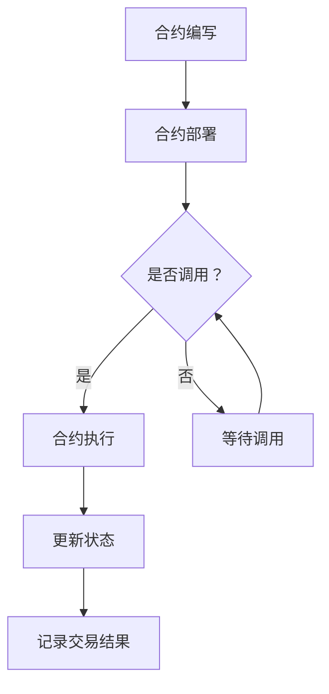

                 


### 智能合约：重塑商业交易的未来

#### 关键词
- 智能合约
- 区块链技术
- 商业交易
- 安全性
- 编程语言

#### 摘要
智能合约作为区块链技术的重要组成部分，正逐步改变着传统商业交易的模式。本文将深入探讨智能合约的定义、工作原理、编程技术，以及其在商业交易中的应用和未来发展趋势，旨在为广大读者揭示这一创新技术的潜在价值。

## 引言

在数字经济时代，传统商业交易正面临前所未有的变革。传统的商业交易依赖于复杂的合同和法律框架，存在着高成本、低效率、安全隐患等问题。而区块链技术的出现，尤其是智能合约的应用，为解决这些问题提供了新的思路和解决方案。

智能合约是一种自动执行、管理和记录合约条款的计算机程序。与传统合约不同，智能合约不需要第三方中介机构，能够在去中心化的区块链上实现自动化执行，从而提高交易效率、降低成本、提升安全性。本文将从以下几个方面展开讨论：

1. **智能合约的基本概念与历史发展**：介绍智能合约的定义、特点以及其在区块链技术中的地位。
2. **智能合约的技术原理**：详细解析智能合约的工作原理、核心算法和数学模型。
3. **智能合约的开发实战**：通过实际项目案例，展示智能合约的开发过程、源代码实现和代码解读。
4. **智能合约在商业交易中的应用**：探讨智能合约在金融、供应链等领域的具体应用。
5. **智能合约的安全性和未来发展趋势**：分析智能合约的安全性问题、面临的挑战以及未来的发展方向。

## 智能合约的基本概念与历史发展

### 定义与特点

智能合约（Smart Contract）是一种运行在区块链上的计算机程序，用于自动执行合同条款。与传统合约不同，智能合约通过编程语言定义合同条款，并嵌入区块链网络中。一旦满足特定条件，智能合约会自动执行相应的操作，例如转移资产、记录交易等。

智能合约具有以下特点：

1. **去中心化**：智能合约运行在分布式网络中，不依赖于任何中心化机构，保证了交易的透明性和不可篡改性。
2. **自动化执行**：智能合约根据预定的条件自动执行，无需人工干预，提高了交易效率。
3. **安全可靠**：智能合约代码公开透明，所有参与者都可以查看和验证，降低了欺诈和错误的风险。
4. **低成本**：由于去中心化和自动化执行，智能合约的交易成本远低于传统交易。

### 历史发展

智能合约的概念最早由法律学家尼克·萨博（Nick Szabo）在1990年代提出。他在论文《智能合约：计算机化的交易协议》中详细阐述了智能合约的定义、特点和应用场景。然而，由于当时技术的限制，智能合约未能得到广泛应用。

随着区块链技术的发展，智能合约得到了新的契机。2008年，中本聪（Satoshi Nakamoto）发布了比特币白皮书，提出了区块链技术。比特币的推出标志着智能合约的首次实现，使得智能合约的理念得以实践。

2013年，以太坊（Ethereum）的推出标志着智能合约进入了一个新的阶段。以太坊引入了图灵完备的编程语言Solidity，使得开发者可以更加灵活地编写和部署智能合约。以太坊的诞生推动了智能合约的应用范围，成为智能合约技术发展的里程碑。

## 智能合约的技术原理

### 工作原理

智能合约的工作原理可以概括为以下几个步骤：

1. **合约编写**：开发者使用Solidity等编程语言编写智能合约代码，定义合同条款和逻辑。
2. **合约部署**：将编写好的智能合约上传到区块链网络，通过矿工验证并添加到区块链上。
3. **合约调用**：用户通过区块链网络调用智能合约，触发合约执行。
4. **合约执行**：智能合约按照预定的逻辑自动执行操作，如转移资产、记录交易等。
5. **合约状态更新**：合约执行后，区块链会更新状态，记录交易结果。

### 核心算法原理

智能合约的核心算法原理主要包括以下几点：

1. **事件监听**：智能合约通过监听区块链上的事件，触发相应的操作。事件可以是链上交易、区块生成等。
2. **状态机**：智能合约采用状态机模型，根据当前状态和输入条件，执行相应的操作并更新状态。
3. **条件判断**：智能合约通过条件判断，根据输入参数和预定的条件，决定执行哪个操作。

### 数学模型和公式

智能合约中的数学模型和公式主要用于计算和验证交易结果。以下是一个简单的数学模型示例：

$$
\text{余额} = \text{初始余额} + \text{收入} - \text{支出}
$$

其中，初始余额、收入和支出都是交易金额，可以通过智能合约代码进行计算和验证。

#### Mermaid 流程图

为了更好地理解智能合约的工作原理，我们可以使用 Mermaid 流程图来展示智能合约的执行流程。以下是一个示例：



## 智能合约的开发实战

### 开发环境搭建

智能合约的开发需要配置特定的开发环境。以下是开发环境搭建的步骤：

1. **安装Node.js**：Node.js是一个基于Chrome V8引擎的JavaScript运行环境，用于编译和部署智能合约。
2. **安装Truffle**：Truffle是一个智能合约开发框架，用于管理智能合约的编译、部署和交互。
3. **安装Ganache**：Ganache是一个本地以太坊区块链节点，用于模拟智能合约的执行环境。

### 源代码实现

以下是一个简单的智能合约示例，用于存储和转移代币：

```solidity
// SPDX-License-Identifier: MIT
pragma solidity ^0.8.0;

contract Token {
    string public name = "MyToken";
    string public symbol = "MTK";
    uint8 public decimals = 18;
    uint256 public totalSupply = 1000000000 * (10 ** uint256(decimals));
    address public owner;

    mapping(address => uint256) public balanceOf;

    constructor() {
        owner = msg.sender;
        balanceOf[owner] = totalSupply;
    }

    function transfer(address to, uint256 amount) public {
        require(to != address(0));
        require(balanceOf[msg.sender] >= amount);

        balanceOf[msg.sender] -= amount;
        balanceOf[to] += amount;
    }
}
```

### 代码解读

1. **合约基本信息**：合约定义了代币的名称、符号和精度，以及代币的总供应量。
2. **构造函数**：构造函数初始化合约的创建者和代币的初始余额。
3. **转移代币**：转移代币函数用于实现代币的转移操作。

### 项目小结

通过以上实战项目，读者可以了解智能合约的基本开发流程，包括开发环境的搭建、源代码实现和代码解读。智能合约的开发是一个复杂的过程，需要开发者具备一定的编程能力和区块链知识。在后续的项目中，我们将继续探讨更复杂的智能合约应用。

## 智能合约在商业交易中的应用

### 金融领域

智能合约在金融领域的应用非常广泛，包括众筹、保险、债券等。以众筹为例，智能合约可以确保项目资金的透明和公平分配。项目发起者可以设定众筹目标和时间，智能合约会自动在众筹成功时释放资金，确保资金的合理使用。

### 供应链管理

智能合约在供应链管理中可以用于库存管理、采购与付款等环节。例如，在采购环节，智能合约可以自动触发付款流程，确保供应商按时收到款项。在库存管理中，智能合约可以实时监控库存变化，触发采购决策。

### 法律和合同管理

智能合约可以用于自动化合同管理，减少人为错误和纠纷。例如，在租赁合同中，智能合约可以自动执行租金支付、合同续约等操作，确保合同的履行。

## 智能合约的安全性和未来发展趋势

### 安全性问题

智能合约的安全性问题主要集中在合约代码的漏洞和攻击手段上。常见的漏洞包括重新分配错误、整数溢出、缓冲区溢出等。攻击手段包括重入攻击、合约提权等。

### 未来发展趋势

1. **扩容解决方案**：随着智能合约应用的增加，区块链网络需要提供更高的交易容量和速度。扩容解决方案，如状态通道、分片技术等，将有助于提升区块链的性能。
2. **跨链技术**：跨链技术可以实现不同区块链之间的交互和资产转移，拓展智能合约的应用场景。
3. **智能合约标准化**：智能合约标准化将有助于提高合约代码的可靠性和可维护性，减少安全隐患。

### 拓展阅读

- 《智能合约：从基础到高级》
- 《区块链：从入门到精通》
- 《Solidity编程实战》

## 结论

智能合约作为区块链技术的核心组件，正逐步改变着传统商业交易的模式。本文从智能合约的基本概念、技术原理、开发实战、应用场景以及未来发展等方面进行了深入探讨，旨在为广大读者揭示智能合约的潜在价值。随着技术的不断进步，智能合约将在更多领域发挥重要作用，推动商业交易的革新。

### 作者信息

- 作者：AI天才研究院/AI Genius Institute & 禅与计算机程序设计艺术 /Zen And The Art of Computer Programming

### 注意事项

- 智能合约开发过程中，务必进行充分的代码审查和测试，确保合约的安全性和可靠性。
- 在智能合约应用过程中，充分考虑法律法规和安全风险，确保交易的合规性和安全性。

### 结语

智能合约作为一项新兴技术，具有巨大的潜力和发展前景。希望通过本文的讨论，读者能够对智能合约有更深入的理解，为智能合约的应用和发展贡献自己的力量。在未来的道路上，让我们共同探索智能合约的无限可能。|>

