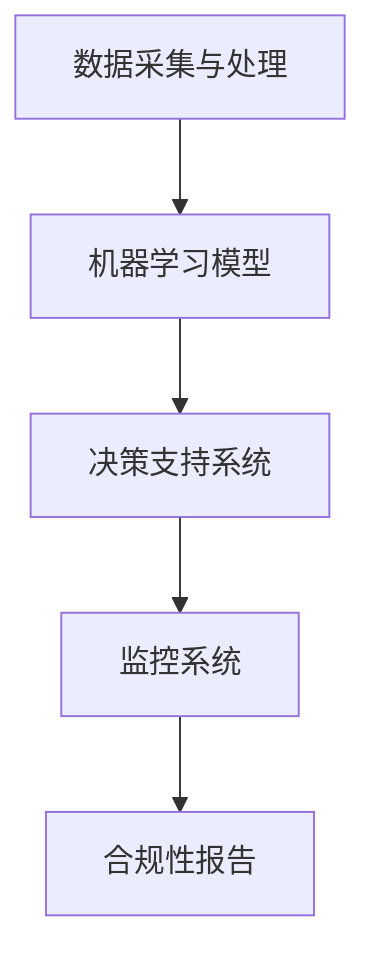
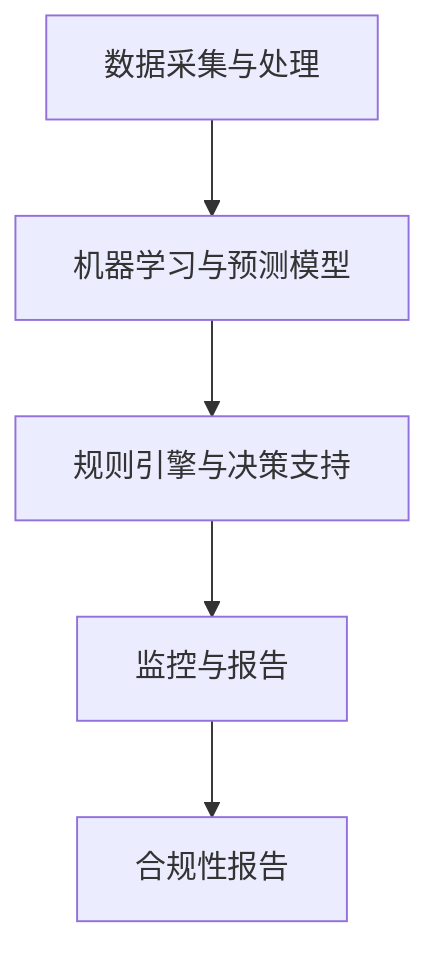
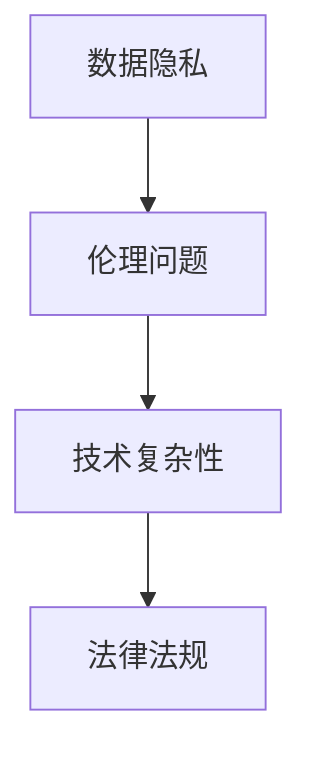

                 

### 文章标题

# 智能合规管理解决方案：AI确保监管要求的满足

### 文章关键词

- 智能合规管理
- AI监管
- 监管要求
- 机器学习
- 数据隐私
- 伦理问题

### 文章摘要

本文旨在探讨如何利用人工智能（AI）技术构建智能合规管理解决方案，确保企业及其系统满足各类监管要求。我们将深入分析AI在合规管理中的应用，从监管要求的理解与建模、AI模型的设计与开发、模型评估与优化，到智能合规管理系统的建设与挑战应对等方面进行详细探讨。最后，我们将展望智能合规管理的未来发展趋势，为读者提供全面的解决方案和实践指导。通过本文的阅读，您将了解如何利用AI技术，在保证合规性的同时，提升企业的运营效率和竞争力。

### 第一部分：智能合规管理基础

#### 第1章：智能合规管理的概述

智能合规管理是指利用人工智能技术，对企业的业务流程、数据、系统和操作进行全面的合规性监控和管理，以确保企业及其系统满足各类监管要求。随着金融科技、大数据、云计算等新兴技术的快速发展，合规管理的重要性日益凸显。传统的合规管理方法往往依赖于人工审核和经验判断，存在效率低下、易出错等问题。而智能合规管理通过AI技术，能够实现自动化、实时监控和智能分析，显著提高合规管理的效率和准确性。

##### 核心概念与联系

智能合规管理的主要组成部分包括：

1. **数据采集与处理**：通过数据爬取、数据清洗和数据集成等技术手段，获取企业内外部的各类数据，为合规分析提供基础。
2. **机器学习模型**：利用机器学习算法，对数据进行处理和分析，识别潜在的风险和合规问题。
3. **决策支持系统**：通过算法模型和规则引擎，生成合规建议和决策，指导企业进行合规操作。
4. **监控系统**：对企业的业务流程和操作进行实时监控，确保合规要求的执行。

核心概念之间的关系可以用以下Mermaid流程图表示：



##### 核心算法原理讲解

用于合规检查的基本算法主要包括：

1. **分类算法**：用于识别和分类业务操作是否符合合规要求。例如，可以使用逻辑回归、决策树、随机森林等算法。
2. **聚类算法**：用于发现潜在的合规问题。例如，可以使用K-means、DBSCAN等算法。
3. **异常检测算法**：用于检测异常操作，以防止违规行为。例如，可以使用基于统计的方法、基于距离的方法、基于模型的方法等。

以下是一个简单的伪代码示例，用于实现基于逻辑回归的分类算法：

```python
import pandas as pd
from sklearn.linear_model import LogisticRegression

# 数据预处理
data = pd.read_csv("data.csv")
X = data.drop("label", axis=1)
y = data["label"]

# 模型训练
model = LogisticRegression()
model.fit(X, y)

# 预测
predictions = model.predict(X)

# 评估模型
accuracy = model.score(X, y)
print("模型准确率：", accuracy)
```

##### 数学模型与公式讲解

用于预测模型训练的数学公式主要包括：

1. **损失函数**：用于评估模型的预测效果，常见的有均方误差（MSE）、交叉熵损失等。
2. **优化算法**：用于调整模型参数，使模型预测效果最大化，常见的方法有梯度下降、随机梯度下降等。

以下是一个简单的LaTeX格式数学公式示例：

$$
\text{MSE} = \frac{1}{m} \sum_{i=1}^{m} (y_i - \hat{y}_i)^2
$$

其中，$y_i$为实际标签，$\hat{y}_i$为模型预测标签，$m$为样本数量。

#### 第2章：AI在合规管理中的应用

随着人工智能技术的不断发展，AI在合规管理中的应用越来越广泛。AI能够通过自动化的方式处理大量的数据，快速识别合规风险，并提供实时决策支持。在本章中，我们将讨论AI在合规管理中的应用，包括数据挖掘、异常检测和预测模型等。

##### 核心算法原理讲解

AI在合规管理中的应用主要基于以下算法原理：

1. **数据挖掘**：通过数据挖掘技术，从大量数据中提取有价值的信息，帮助合规团队识别潜在的风险和违规行为。
   - **关联规则学习**：用于发现数据之间的关联关系，如Apriori算法和FP-growth算法。
   - **聚类分析**：用于将数据分为不同的类别，以便更好地理解和分析数据，如K-means和DBSCAN算法。
   - **分类和回归分析**：用于预测数据的未来趋势，如决策树、支持向量机和随机森林等算法。

2. **异常检测**：通过异常检测算法，识别数据中的异常值，以防止违规行为。常见的异常检测算法包括基于统计的方法（如Z-score、IQR）、基于距离的方法（如k-近邻）和基于模型的方法（如孤立森林、Autoencoder）。

3. **预测模型**：利用预测模型，预测未来的合规风险，并提前采取预防措施。常见的预测模型包括时间序列分析（如ARIMA、LSTM）、回归分析（如线性回归、逻辑回归）和分类分析（如决策树、随机森林）。

以下是一个简单的伪代码示例，用于实现基于K-means算法的聚类分析：

```python
from sklearn.cluster import KMeans
import numpy as np

# 数据预处理
data = np.array([[1, 2], [1, 4], [1, 0], [10, 2], [10, 4], [10, 0]])

# K-means算法
kmeans = KMeans(n_clusters=2, random_state=0).fit(data)
clusters = kmeans.predict(data)

# 输出结果
print("聚类结果：", clusters)
```

##### 数学模型与公式讲解

在本章中，我们将介绍一些常用的数学模型和公式：

1. **均方误差（MSE）**：
   $$
   \text{MSE} = \frac{1}{m} \sum_{i=1}^{m} (y_i - \hat{y}_i)^2
   $$
   其中，$y_i$为实际标签，$\hat{y}_i$为模型预测标签，$m$为样本数量。

2. **交叉熵损失（Cross-Entropy Loss）**：
   $$
   \text{CE} = -\frac{1}{m} \sum_{i=1}^{m} [y_i \log(\hat{y}_i) + (1 - y_i) \log(1 - \hat{y}_i)]
   $$
   其中，$y_i$为实际标签，$\hat{y}_i$为模型预测标签，$m$为样本数量。

3. **逻辑回归（Logistic Regression）**：
   $$
   \text{Logistic Regression: } \hat{y}_i = \frac{1}{1 + e^{-(\beta_0 + \beta_1 x_1 + \beta_2 x_2 + ... + \beta_n x_n})}
   $$
   其中，$\beta_0$为截距，$\beta_1, \beta_2, ..., \beta_n$为模型参数，$x_1, x_2, ..., x_n$为特征值。

##### 项目实战

在本节中，我们将以一个实际案例为例，展示如何利用AI技术进行合规管理。假设我们是一家金融机构，需要利用AI技术监控交易行为，确保其符合监管要求。

**开发环境搭建**：
1. 安装Python环境，版本3.8或以上。
2. 安装常用机器学习库，如scikit-learn、pandas、numpy等。

**源代码实现**：

```python
import pandas as pd
from sklearn.model_selection import train_test_split
from sklearn.preprocessing import StandardScaler
from sklearn.linear_model import LogisticRegression
from sklearn.metrics import accuracy_score

# 数据读取
data = pd.read_csv("transactions.csv")

# 数据预处理
X = data.drop("label", axis=1)
y = data["label"]

# 划分训练集和测试集
X_train, X_test, y_train, y_test = train_test_split(X, y, test_size=0.2, random_state=42)

# 特征缩放
scaler = StandardScaler()
X_train_scaled = scaler.fit_transform(X_train)
X_test_scaled = scaler.transform(X_test)

# 模型训练
model = LogisticRegression()
model.fit(X_train_scaled, y_train)

# 预测
predictions = model.predict(X_test_scaled)

# 评估模型
accuracy = accuracy_score(y_test, predictions)
print("模型准确率：", accuracy)
```

**代码解读与分析**：

1. **数据读取与预处理**：首先，从CSV文件中读取交易数据。然后，将特征和标签分离，并进行特征缩放，以标准化数据。

2. **模型训练**：使用逻辑回归模型对训练集进行训练。

3. **预测**：使用训练好的模型对测试集进行预测。

4. **评估模型**：计算模型在测试集上的准确率。

**实际案例分析**：

1. **案例背景**：金融机构需要监控交易行为，以确保其符合反洗钱（AML）等监管要求。
2. **合规要求**：识别可疑交易，如异常高额交易、频繁交易等。
3. **实现过程**：利用AI技术，对历史交易数据进行分析，训练逻辑回归模型，识别可疑交易。

**项目小结**：

通过本案例，我们展示了如何利用AI技术进行合规管理。在实际应用中，我们需要根据具体业务场景，选择合适的算法和模型，并进行相应的优化和调整。此外，合规管理不仅仅是技术问题，还需要遵循法律法规和行业规范，确保AI技术的应用符合道德和社会责任。

##### 最佳实践 tips、小结、注意事项、拓展阅读

- **最佳实践 tips**：
  - 在进行数据预处理时，确保数据的质量和完整性。
  - 选择合适的模型和算法，并根据业务需求进行优化。
  - 定期更新和维护模型，以适应不断变化的数据和环境。

- **小结**：
  - AI技术在合规管理中具有巨大的潜力，可以提高合规管理的效率和准确性。
  - 实现智能合规管理需要综合考虑技术、法律和道德等方面。

- **注意事项**：
  - 在使用AI技术时，要确保数据隐私和信息安全。
  - 遵循相关法律法规和行业标准，确保合规性。

- **拓展阅读**：
  - 《人工智能伦理导论》
  - 《机器学习实战》
  - 《金融科技与法律合规》

#### 第3章：监管要求的理解与建模

在智能合规管理中，理解并准确建模监管要求是确保合规性的关键。监管要求通常涉及各类法律法规、行业标准和企业内部政策，它们为企业的运营提供了明确的规范和指导。AI技术在监管要求的理解与建模方面具有显著优势，可以通过自动化和智能化的方式，将复杂的监管要求转化为可操作的业务规则和算法模型。

##### 核心算法原理讲解

监管要求的理解与建模主要涉及以下核心算法原理：

1. **自然语言处理（NLP）**：利用NLP技术，对文本数据进行解析、抽取和分类，从而将监管要求转化为结构化的数据。常见的NLP技术包括词性标注、实体识别、关系抽取和文本分类等。

2. **规则引擎**：通过规则引擎，将监管要求转化为可执行的业务规则。规则引擎可以定义复杂的条件判断和逻辑运算，以支持动态的合规决策。

3. **数据挖掘和机器学习**：利用数据挖掘和机器学习技术，对历史数据进行分析和建模，识别监管要求中潜在的规律和模式。

以下是一个简单的伪代码示例，用于实现基于NLP的监管要求理解：

```python
import nltk
from nltk.tokenize import sent_tokenize, word_tokenize
from nltk.corpus import stopwords
from nltk.stem import WordNetLemmatizer

# 加载自然语言处理库
nltk.download('punkt')
nltk.download('stopwords')
nltk.download('wordnet')

# 文本预处理
def preprocess_text(text):
    sentences = sent_tokenize(text)
    lemmatizer = WordNetLemmatizer()
    stop_words = set(stopwords.words('english'))
    
    cleaned_text = []
    for sentence in sentences:
        words = word_tokenize(sentence)
        cleaned_words = [lemmatizer.lemmatize(word.lower()) for word in words if word.lower() not in stop_words]
        cleaned_text.append(' '.join(cleaned_words))
    
    return ' '.join(cleaned_text)

text = "Example text to analyze for regulatory requirements."
cleaned_text = preprocess_text(text)

# 文本分类
def classify_text(text):
    # 假设已训练好分类模型
    model = train_classification_model()
    prediction = model.predict([text])
    return prediction

# 分类结果
classification_result = classify_text(cleaned_text)
print("分类结果：", classification_result)
```

##### 数学模型与公式讲解

在监管要求的建模过程中，需要使用一些数学模型和公式来表示业务规则和逻辑运算。以下是一些常用的数学模型和公式：

1. **逻辑运算符**：AND、OR、NOT等，用于表示复合条件。
2. **条件概率**：用于表示在给定条件下某一事件发生的概率。
3. **决策树**：用于表示条件判断和决策路径。
4. **贝叶斯网络**：用于表示复杂的多条件概率分布。

以下是一个简单的LaTeX格式数学公式示例，用于表示条件概率：

$$
P(A|B) = \frac{P(A \cap B)}{P(B)}
$$

其中，$P(A|B)$表示在事件B发生的条件下，事件A发生的概率；$P(A \cap B)$表示事件A和事件B同时发生的概率；$P(B)$表示事件B发生的概率。

##### 项目实战

在本节中，我们将以一个实际案例为例，展示如何利用AI技术理解和建模监管要求。假设我们是一家金融科技公司，需要确保其业务符合《通用数据保护条例》（GDPR）的要求。

**开发环境搭建**：
1. 安装Python环境，版本3.8或以上。
2. 安装常用机器学习库，如scikit-learn、pandas、numpy等。

**源代码实现**：

```python
import pandas as pd
from sklearn.model_selection import train_test_split
from sklearn.preprocessing import LabelEncoder

# 数据读取
data = pd.read_csv("gdpr_requirements.csv")

# 数据预处理
X = data.drop("compliance_status", axis=1)
y = data["compliance_status"]

# 划分训练集和测试集
X_train, X_test, y_train, y_test = train_test_split(X, y, test_size=0.2, random_state=42)

# 标签编码
label_encoder = LabelEncoder()
y_train_encoded = label_encoder.fit_transform(y_train)
y_test_encoded = label_encoder.transform(y_test)

# 模型训练
model = LogisticRegression()
model.fit(X_train, y_train_encoded)

# 预测
predictions = model.predict(X_test)

# 评估模型
accuracy = accuracy_score(y_test_encoded, predictions)
print("模型准确率：", accuracy)
```

**代码解读与分析**：

1. **数据读取与预处理**：首先，从CSV文件中读取GDPR要求的相关数据。然后，将特征和标签分离，并进行标签编码，以处理分类问题。

2. **模型训练**：使用逻辑回归模型对训练集进行训练。

3. **预测**：使用训练好的模型对测试集进行预测。

4. **评估模型**：计算模型在测试集上的准确率。

**实际案例分析**：

1. **案例背景**：金融科技公司需要确保其数据处理和存储符合GDPR的要求。
2. **合规要求**：包括数据主体权利的执行、数据泄露防护、数据最小化等。
3. **实现过程**：利用AI技术，对GDPR要求进行分析和建模，训练逻辑回归模型，识别合规性。

**项目小结**：

通过本案例，我们展示了如何利用AI技术理解和建模监管要求。在实际应用中，我们需要根据具体业务场景，选择合适的算法和模型，并进行相应的优化和调整。此外，合规管理不仅仅是技术问题，还需要遵循法律法规和行业规范，确保AI技术的应用符合道德和社会责任。

##### 最佳实践 tips、小结、注意事项、拓展阅读

- **最佳实践 tips**：
  - 在进行数据预处理时，确保数据的质量和完整性。
  - 选择合适的模型和算法，并根据业务需求进行优化。
  - 定期更新和维护模型，以适应不断变化的数据和环境。

- **小结**：
  - 监管要求的理解与建模是智能合规管理的关键步骤。
  - AI技术提供了强大的工具，可以帮助企业快速理解和实现监管要求。

- **注意事项**：
  - 在使用AI技术时，要确保数据隐私和信息安全。
  - 遵循相关法律法规和行业标准，确保合规性。

- **拓展阅读**：
  - 《通用数据保护条例》官方文档
  - 《机器学习与数据隐私》
  - 《合规科技：如何利用技术满足法规要求》

### 第二部分：AI确保监管要求的满足

在智能合规管理中，AI不仅能够帮助理解与建模监管要求，还能通过模型的设计与开发、评估与优化等步骤，确保企业及其系统能够满足监管要求。这一部分将详细探讨AI模型在这些方面的应用。

#### 第4章：AI模型的设计与开发

AI模型的设计与开发是智能合规管理的关键环节，它决定了模型是否能够准确地识别和应对合规风险。在这一章中，我们将讨论如何设计有效的AI模型，以及如何利用机器学习和深度学习技术来构建和训练这些模型。

##### 核心算法原理讲解

AI模型的设计与开发主要包括以下几个核心算法原理：

1. **特征工程**：特征工程是AI模型设计的重要步骤，通过选择和转换特征，可以提高模型的性能。常见的特征工程方法包括特征提取、特征缩放、特征选择等。

2. **机器学习算法**：机器学习算法用于构建AI模型，常见的算法包括线性回归、决策树、支持向量机、随机森林、梯度提升树等。这些算法适用于不同的数据类型和业务场景。

3. **深度学习算法**：深度学习算法，如神经网络、卷积神经网络（CNN）、循环神经网络（RNN）和长短时记忆网络（LSTM）等，能够处理大规模和高维度数据，适用于复杂的业务场景。

以下是一个简单的伪代码示例，用于实现基于线性回归的AI模型设计：

```python
import pandas as pd
from sklearn.linear_model import LinearRegression
from sklearn.model_selection import train_test_split

# 数据读取
data = pd.read_csv("compliance_data.csv")

# 数据预处理
X = data.drop("compliance_label", axis=1)
y = data["compliance_label"]

# 划分训练集和测试集
X_train, X_test, y_train, y_test = train_test_split(X, y, test_size=0.2, random_state=42)

# 模型训练
model = LinearRegression()
model.fit(X_train, y_train)

# 预测
predictions = model.predict(X_test)

# 评估模型
accuracy = model.score(X_test, y_test)
print("模型准确率：", accuracy)
```

##### 数学模型与公式讲解

在AI模型的设计与开发中，需要使用一些数学模型和公式来描述模型的结构和运算。以下是一些常用的数学模型和公式：

1. **线性回归模型**：
   $$
   \text{Linear Regression: } y = \beta_0 + \beta_1 x_1 + \beta_2 x_2 + ... + \beta_n x_n
   $$
   其中，$\beta_0$为截距，$\beta_1, \beta_2, ..., \beta_n$为模型参数，$x_1, x_2, ..., x_n$为特征值。

2. **逻辑回归模型**：
   $$
   \text{Logistic Regression: } \hat{y} = \frac{1}{1 + e^{-(\beta_0 + \beta_1 x_1 + \beta_2 x_2 + ... + \beta_n x_n})}
   $$
   其中，$\beta_0$为截距，$\beta_1, \beta_2, ..., \beta_n$为模型参数，$x_1, x_2, ..., x_n$为特征值。

3. **神经网络模型**：
   $$
   \text{Neural Network: } a_{i}^{(l)} = \sigma(z_{i}^{(l)})
   $$
   $$
   z_{i}^{(l)} = \sum_{j} w_{ji}^{(l)} a_{j}^{(l-1)} + b_{i}^{(l)}
   $$
   其中，$a_{i}^{(l)}$为第$l$层第$i$个神经元的激活值，$z_{i}^{(l)}$为第$l$层第$i$个神经元的输入值，$w_{ji}^{(l)}$为从第$l-1$层第$j$个神经元到第$l$层第$i$个神经元的权重，$b_{i}^{(l)}$为第$l$层第$i$个神经元的偏置值，$\sigma$为激活函数。

以下是一个简单的LaTeX格式数学公式示例，用于表示神经网络中的激活函数：

$$
\sigma(x) = \frac{1}{1 + e^{-x}}
$$

##### 项目实战

在本节中，我们将以一个实际案例为例，展示如何设计和开发AI模型以满足监管要求。假设我们是一家金融机构，需要开发一个模型来识别潜在的金融欺诈行为。

**开发环境搭建**：
1. 安装Python环境，版本3.8或以上。
2. 安装常用机器学习库，如scikit-learn、TensorFlow、Keras等。

**源代码实现**：

```python
import pandas as pd
from sklearn.model_selection import train_test_split
from sklearn.preprocessing import StandardScaler
from sklearn.metrics import accuracy_score
from tensorflow.keras.models import Sequential
from tensorflow.keras.layers import Dense

# 数据读取
data = pd.read_csv("fraud_data.csv")

# 数据预处理
X = data.drop("fraud_label", axis=1)
y = data["fraud_label"]

# 划分训练集和测试集
X_train, X_test, y_train, y_test = train_test_split(X, y, test_size=0.2, random_state=42)

# 特征缩放
scaler = StandardScaler()
X_train_scaled = scaler.fit_transform(X_train)
X_test_scaled = scaler.transform(X_test)

# 模型构建
model = Sequential()
model.add(Dense(units=32, activation='relu', input_shape=(X_train_scaled.shape[1],)))
model.add(Dense(units=16, activation='relu'))
model.add(Dense(units=1, activation='sigmoid'))

# 模型编译
model.compile(optimizer='adam', loss='binary_crossentropy', metrics=['accuracy'])

# 模型训练
model.fit(X_train_scaled, y_train, epochs=10, batch_size=32)

# 预测
predictions = model.predict(X_test_scaled)
predictions = (predictions > 0.5)

# 评估模型
accuracy = accuracy_score(y_test, predictions)
print("模型准确率：", accuracy)
```

**代码解读与分析**：

1. **数据读取与预处理**：首先，从CSV文件中读取欺诈数据。然后，将特征和标签分离，并进行特征缩放，以标准化数据。

2. **模型构建**：使用TensorFlow和Keras构建一个简单的神经网络模型，包括两个隐藏层。

3. **模型编译**：编译模型，指定优化器和损失函数。

4. **模型训练**：使用训练集训练模型，并设置训练的迭代次数和批量大小。

5. **预测**：使用训练好的模型对测试集进行预测，并设置阈值（如0.5）将预测结果转换为二分类标签。

6. **评估模型**：计算模型在测试集上的准确率。

**实际案例分析**：

1. **案例背景**：金融机构需要识别和处理金融欺诈行为，以保障客户资产的安全。
2. **合规要求**：根据反欺诈法规，金融机构需要及时识别和报告欺诈行为。
3. **实现过程**：利用AI技术，开发一个基于神经网络模型的欺诈识别系统，对交易行为进行分析和预测。

**项目小结**：

通过本案例，我们展示了如何设计和开发AI模型以满足监管要求。在实际应用中，我们需要根据具体业务场景，选择合适的模型和算法，并进行相应的优化和调整。此外，合规管理不仅仅是技术问题，还需要遵循法律法规和行业规范，确保AI技术的应用符合道德和社会责任。

##### 最佳实践 tips、小结、注意事项、拓展阅读

- **最佳实践 tips**：
  - 在进行特征工程时，确保特征的选择和转换符合业务需求。
  - 选择合适的机器学习算法和深度学习架构，以适应不同的数据类型和业务场景。
  - 定期评估和更新模型，以保持其性能和适应性。

- **小结**：
  - AI模型的设计与开发是智能合规管理的重要环节，决定了合规管理的效率和准确性。
  - 通过机器学习和深度学习技术，可以构建有效的AI模型，满足监管要求。

- **注意事项**：
  - 在使用AI模型时，要确保数据隐私和信息安全。
  - 遵循相关法律法规和行业标准，确保模型的合规性。

- **拓展阅读**：
  - 《机器学习实战》
  - 《深度学习：深度学习基础》
  - 《金融科技与合规》

#### 第5章：AI模型的评估与优化

AI模型在设计和开发完成后，需要进行全面的评估和优化，以确保其在实际应用中能够准确识别合规风险，并满足监管要求。评估与优化是智能合规管理中不可或缺的环节，它涉及到模型性能的评估、超参数调优、交叉验证等方法，以及如何处理过拟合和欠拟合等问题。

##### 核心算法原理讲解

AI模型的评估与优化主要包括以下核心算法原理：

1. **性能评估指标**：用于评估模型性能的指标，如准确率、召回率、精确率、F1分数、ROC曲线和AUC等。这些指标能够帮助理解模型在不同业务场景下的表现。

2. **交叉验证**：通过将数据集划分为多个子集，多次训练和验证模型，以评估模型的泛化能力和鲁棒性。常见的交叉验证方法包括K折交叉验证和留一交叉验证。

3. **超参数调优**：通过调整模型的结构和参数，以提高模型的性能。常见的超参数调优方法包括网格搜索和贝叶斯优化。

4. **过拟合与欠拟合**：过拟合和欠拟合是机器学习中的常见问题，过拟合导致模型在训练集上表现良好，但在测试集上表现差；欠拟合则导致模型无法捕捉到数据中的特征。解决方法包括调整模型复杂度、增加训练数据和使用正则化技术。

以下是一个简单的伪代码示例，用于实现基于K折交叉验证的模型评估：

```python
from sklearn.model_selection import KFold
from sklearn.linear_model import LogisticRegression

# 数据读取
data = pd.read_csv("compliance_data.csv")

# 数据预处理
X = data.drop("compliance_label", axis=1)
y = data["compliance_label"]

# 划分K折交叉验证
kf = KFold(n_splits=5, shuffle=True, random_state=42)

# 模型训练和评估
for train_index, test_index in kf.split(X):
    X_train, X_test = X.iloc[train_index], X.iloc[test_index]
    y_train, y_test = y.iloc[train_index], y.iloc[test_index]
    
    # 模型训练
    model = LogisticRegression()
    model.fit(X_train, y_train)
    
    # 预测
    predictions = model.predict(X_test)
    
    # 评估模型
    accuracy = model.score(X_test, y_test)
    print("准确率：", accuracy)
```

##### 数学模型与公式讲解

在AI模型的评估与优化中，需要使用一些数学模型和公式来描述模型的性能和调整方法。以下是一些常用的数学模型和公式：

1. **准确率（Accuracy）**：
   $$
   \text{Accuracy} = \frac{TP + TN}{TP + TN + FP + FN}
   $$
   其中，$TP$表示真正例，$TN$表示真负例，$FP$表示假正例，$FN$表示假负例。

2. **召回率（Recall）**：
   $$
   \text{Recall} = \frac{TP}{TP + FN}
   $$

3. **精确率（Precision）**：
   $$
   \text{Precision} = \frac{TP}{TP + FP}
   $$

4. **F1分数（F1 Score）**：
   $$
   \text{F1 Score} = 2 \times \frac{Precision \times Recall}{Precision + Recall}
   $$

5. **ROC曲线与AUC**：
   ROC曲线（Receiver Operating Characteristic Curve）和AUC（Area Under the Curve）用于评估分类器的性能。AUC的值介于0和1之间，值越大，表示分类器性能越好。

以下是一个简单的LaTeX格式数学公式示例，用于表示F1分数：

$$
\text{F1 Score} = 2 \times \frac{Precision \times Recall}{Precision + Recall}
$$

##### 项目实战

在本节中，我们将以一个实际案例为例，展示如何评估和优化AI模型以满足监管要求。假设我们是一家金融机构，需要评估和优化一个用于识别潜在金融欺诈行为的模型。

**开发环境搭建**：
1. 安装Python环境，版本3.8或以上。
2. 安装常用机器学习库，如scikit-learn、TensorFlow、Keras等。

**源代码实现**：

```python
import pandas as pd
from sklearn.model_selection import train_test_split
from sklearn.preprocessing import StandardScaler
from sklearn.metrics import accuracy_score, f1_score
from tensorflow.keras.models import Sequential
from tensorflow.keras.layers import Dense
from tensorflow.keras.wrappers.scikit_learn import KerasClassifier
from sklearn.model_selection import GridSearchCV

# 数据读取
data = pd.read_csv("fraud_data.csv")

# 数据预处理
X = data.drop("fraud_label", axis=1)
y = data["fraud_label"]

# 划分训练集和测试集
X_train, X_test, y_train, y_test = train_test_split(X, y, test_size=0.2, random_state=42)

# 特征缩放
scaler = StandardScaler()
X_train_scaled = scaler.fit_transform(X_train)
X_test_scaled = scaler.transform(X_test)

# 模型构建
def create_model(optimizer='adam', init='glorot_uniform'):
    model = Sequential()
    model.add(Dense(units=32, activation='relu', input_shape=(X_train_scaled.shape[1],)))
    model.add(Dense(units=16, activation='relu'))
    model.add(Dense(units=1, activation='sigmoid'))
    
    model.compile(optimizer=optimizer, loss='binary_crossentropy', metrics=['accuracy'])
    return model

# 模型评估
model = KerasClassifier(build_fn=create_model, epochs=100, batch_size=10, verbose=0)
model = model.fit(X_train_scaled, y_train)

# 预测
predictions = model.predict(X_test_scaled)
predictions = (predictions > 0.5)

# 评估模型
accuracy = accuracy_score(y_test, predictions)
f1 = f1_score(y_test, predictions)
print("准确率：", accuracy)
print("F1分数：", f1)

# 超参数调优
param_grid = {'epochs': [100, 200, 300], 'batch_size': [5, 10, 20]}
grid = GridSearchCV(estimator=model, param_grid=param_grid, cv=3)
grid_result = grid.fit(X_train_scaled, y_train)

# 输出最佳参数
print("最佳参数：", grid_result.best_params_)
print("最佳模型准确率：", grid_result.best_score_)
```

**代码解读与分析**：

1. **数据读取与预处理**：首先，从CSV文件中读取欺诈数据。然后，将特征和标签分离，并进行特征缩放，以标准化数据。

2. **模型构建**：使用TensorFlow和Keras构建一个简单的神经网络模型，并定义不同的优化器和初始化方法。

3. **模型评估**：使用KerasClassifier封装模型，并进行K折交叉验证，评估模型性能。

4. **预测**：使用训练好的模型对测试集进行预测，并设置阈值（如0.5）将预测结果转换为二分类标签。

5. **评估模型**：计算模型在测试集上的准确率和F1分数。

6. **超参数调优**：使用GridSearchCV进行超参数调优，找到最佳模型参数。

**实际案例分析**：

1. **案例背景**：金融机构需要评估和优化一个用于识别金融欺诈行为的模型，以提高检测准确率和减少误报率。
2. **合规要求**：根据反欺诈法规，金融机构需要及时识别和报告欺诈行为。
3. **实现过程**：利用AI技术，构建和评估欺诈识别模型，并进行超参数调优，以提高模型性能。

**项目小结**：

通过本案例，我们展示了如何评估和优化AI模型以满足监管要求。在实际应用中，我们需要根据具体业务场景，选择合适的评估方法和优化策略，并确保模型的性能和合规性。此外，合规管理不仅仅是技术问题，还需要遵循法律法规和行业规范，确保AI技术的应用符合道德和社会责任。

##### 最佳实践 tips、小结、注意事项、拓展阅读

- **最佳实践 tips**：
  - 在模型评估时，使用多个性能指标，以全面评估模型性能。
  - 进行充分的交叉验证，以评估模型的泛化能力和鲁棒性。
  - 在模型优化过程中，选择合适的超参数调优方法，以找到最佳模型参数。

- **小结**：
  - AI模型的评估与优化是确保模型性能和合规性的关键步骤。
  - 通过性能评估和超参数调优，可以显著提高模型在实际应用中的准确性和可靠性。

- **注意事项**：
  - 在使用AI模型时，要确保数据隐私和信息安全。
  - 遵循相关法律法规和行业标准，确保模型的合规性。

- **拓展阅读**：
  - 《机器学习评估与优化》
  - 《深度学习超参数调优》
  - 《金融科技与合规管理》

### 第三部分：智能合规管理实施与优化

#### 第6章：智能合规管理系统的建设

智能合规管理系统是利用人工智能技术，对企业的业务流程、数据、系统和操作进行全面合规性监控和管理的信息系统。它的目标是确保企业及其系统满足各类监管要求，提高合规管理的效率和准确性。在本章中，我们将探讨智能合规管理系统的建设过程，包括系统架构设计、技术选型、实施策略等方面。

##### 核心概念与联系

智能合规管理系统的建设涉及多个核心概念和组件，它们相互联系，共同构成一个完整的系统。以下是智能合规管理系统的主要组成部分及其相互关系：

1. **数据采集与处理**：数据采集是智能合规管理系统的基石，它通过多种方式（如API接口、数据爬取、日志收集等）获取企业内外部的数据。数据处理包括数据清洗、数据转换和数据集成，以确保数据的质量和一致性。

2. **机器学习与预测模型**：机器学习与预测模型是智能合规管理的核心，通过算法分析和处理数据，识别合规风险和潜在问题。常见的机器学习算法包括分类算法、聚类算法和异常检测算法。

3. **规则引擎与决策支持**：规则引擎用于实现合规规则的自动化，根据预设的规则，对业务操作进行实时监控和决策。决策支持系统则提供智能化的合规建议和决策支持，帮助合规团队进行决策。

4. **监控与报告**：监控与报告模块对企业的业务流程和操作进行实时监控，生成合规性报告，以便合规团队及时了解合规状况，并采取相应的措施。

以下是一个简单的Mermaid流程图，展示了智能合规管理系统的核心概念和组件之间的联系：



##### 核心算法原理讲解

智能合规管理系统中的核心算法原理主要包括：

1. **数据挖掘与机器学习**：数据挖掘和机器学习技术用于对海量数据进行处理和分析，识别合规风险。常见的方法包括关联规则学习、聚类分析、分类分析和异常检测等。

2. **规则引擎与业务规则**：规则引擎用于实现业务规则的自动化，根据预设的规则，对业务操作进行实时监控和决策。业务规则通常包括条件判断、逻辑运算和规则优先级等。

3. **实时监控与告警**：实时监控模块对企业的业务流程和操作进行持续监控，一旦发现合规问题，立即触发告警，通知相关人员处理。

以下是一个简单的伪代码示例，用于实现基于规则引擎的实时监控：

```python
import time

# 定义规则
rules = {
    "rule_1": {
        "condition": "transaction_amount > 100000",
        "action": "raise_alert"
    },
    "rule_2": {
        "condition": "transaction_time > '22:00:00'",
        "action": "raise_alert"
    }
}

# 实时监控
def monitor_transactions(transactions):
    while True:
        for transaction in transactions:
            for rule in rules:
                if eval(rules[rule]["condition"]):
                    rules[rule]["action"]()
        time.sleep(60)  # 每分钟检查一次

# 触发告警
def raise_alert():
    print("Alert: Potential compliance issue detected!")

# 开始监控
monitor_transactions(transactions)
```

##### 数学模型与公式讲解

在智能合规管理系统的建设中，需要使用一些数学模型和公式来描述业务规则和算法。以下是一些常用的数学模型和公式：

1. **条件概率**：
   $$
   P(A|B) = \frac{P(A \cap B)}{P(B)}
   $$
   其中，$P(A|B)$表示在事件B发生的条件下，事件A发生的概率；$P(A \cap B)$表示事件A和事件B同时发生的概率；$P(B)$表示事件B发生的概率。

2. **线性回归模型**：
   $$
   y = \beta_0 + \beta_1 x_1 + \beta_2 x_2 + ... + \beta_n x_n
   $$
   其中，$\beta_0$为截距，$\beta_1, \beta_2, ..., \beta_n$为模型参数，$x_1, x_2, ..., x_n$为特征值。

3. **逻辑回归模型**：
   $$
   \hat{y} = \frac{1}{1 + e^{-(\beta_0 + \beta_1 x_1 + \beta_2 x_2 + ... + \beta_n x_n})}
   $$
   其中，$\beta_0$为截距，$\beta_1, \beta_2, ..., \beta_n$为模型参数，$x_1, x_2, ..., x_n$为特征值。

以下是一个简单的LaTeX格式数学公式示例，用于表示逻辑回归模型：

$$
\hat{y} = \frac{1}{1 + e^{-(\beta_0 + \beta_1 x_1 + \beta_2 x_2 + ... + \beta_n x_n})}
$$

##### 项目实战

在本节中，我们将以一个实际案例为例，展示如何建设智能合规管理系统。假设我们是一家金融机构，需要建设一个智能合规管理系统来监控交易行为，确保其符合反洗钱（AML）等监管要求。

**开发环境搭建**：
1. 安装Java环境，版本1.8或以上。
2. 安装常用的Java框架和库，如Spring Boot、Spring Security、Hibernate等。

**源代码实现**：

```java
// 数据库连接
public class DatabaseConnection {
    public static Connection getConnection() throws SQLException {
        return DriverManager.getConnection("jdbc:mysql://localhost:3306/compliance_db", "username", "password");
    }
}

// 交易监控
public class TransactionMonitor {
    public void monitorTransactions(List<Transaction> transactions) {
        for (Transaction transaction : transactions) {
            if (isHighRisk(transaction)) {
                raiseAlert(transaction);
            }
        }
    }

    private boolean isHighRisk(Transaction transaction) {
        // 判断交易是否高风险
        return transaction.getAmount() > 100000 && transaction.getTime().isAfter("22:00:00");
    }

    private void raiseAlert(Transaction transaction) {
        // 触发告警
        System.out.println("Alert: High-risk transaction detected!");
    }
}

// 交易实体
public class Transaction {
    private int id;
    private double amount;
    private LocalDateTime time;

    // 省略构造函数、getter和setter方法
}
```

**代码解读与分析**：

1. **数据库连接**：使用JDBC连接数据库，获取交易数据。

2. **交易监控**：定义一个`TransactionMonitor`类，用于监控交易行为。`monitorTransactions`方法遍历交易列表，判断交易是否高风险，并触发告警。

3. **交易实体**：定义一个`Transaction`类，表示交易的基本信息，如交易金额和交易时间。

**实际案例分析**：

1. **案例背景**：金融机构需要建设一个智能合规管理系统，监控交易行为，确保其符合反洗钱（AML）等监管要求。

2. **合规要求**：根据AML法规，金融机构需要及时识别和报告高风险交易。

3. **实现过程**：使用Java技术，构建一个简单的智能合规管理系统，包括数据库连接、交易监控和告警功能。

**项目小结**：

通过本案例，我们展示了如何建设智能合规管理系统。在实际应用中，我们需要根据具体业务场景，选择合适的技术和架构，并进行相应的优化和调整。此外，合规管理不仅仅是技术问题，还需要遵循法律法规和行业规范，确保系统的合规性和可靠性。

##### 最佳实践 tips、小结、注意事项、拓展阅读

- **最佳实践 tips**：
  - 在建设智能合规管理系统时，要确保系统的可扩展性和可维护性。
  - 选择合适的技术栈和开发框架，以提高开发效率和系统性能。
  - 在系统设计中，充分考虑数据安全和隐私保护。

- **小结**：
  - 智能合规管理系统是确保企业合规性的重要工具，通过数据采集、机器学习、规则引擎等技术手段，实现全面的合规监控和管理。

- **注意事项**：
  - 在使用AI技术时，要确保数据隐私和信息安全。
  - 遵循相关法律法规和行业标准，确保系统的合规性。

- **拓展阅读**：
  - 《智能合规管理系统设计与实现》
  - 《金融科技与合规管理》
  - 《Java开发实战：从入门到精通》

### 第7章：智能合规管理的挑战与应对

智能合规管理作为金融科技领域的重要发展方向，尽管在提升合规效率和准确性方面具有显著优势，但仍面临诸多挑战。这些挑战主要集中在数据隐私、伦理问题、技术复杂性以及法律法规等方面。在本章中，我们将深入探讨智能合规管理面临的挑战，并提出相应的应对策略。

##### 核心概念与联系

智能合规管理面临的挑战主要包括以下几个方面：

1. **数据隐私**：在智能合规管理中，需要处理大量的敏感数据，如客户信息、交易记录等。数据隐私问题关乎客户隐私权和企业信誉，是智能合规管理的重要挑战。

2. **伦理问题**：AI技术在合规管理中的应用引发了一系列伦理问题，如算法歧视、数据偏见等。这些问题可能导致不公平的决策，损害社会公共利益。

3. **技术复杂性**：智能合规管理涉及多种技术和算法，包括数据挖掘、机器学习、深度学习等。技术复杂性增加了系统的开发和维护难度。

4. **法律法规**：智能合规管理需要遵循各种法律法规，如《通用数据保护条例》（GDPR）、《反洗钱法》等。法律法规的变化可能影响智能合规管理的实施。

以下是一个简单的Mermaid流程图，展示了智能合规管理面临的主要挑战及其相互关系：



##### 核心算法原理讲解

应对智能合规管理挑战的核心算法原理包括：

1. **数据加密与脱敏**：数据加密和脱敏技术用于保护敏感数据，防止未经授权的访问和泄露。常用的加密算法包括AES、RSA等。

2. **算法公平性与透明度**：算法公平性和透明度技术用于减少算法歧视和数据偏见，提高决策的公正性和可解释性。常见的方法包括算法校准、数据平衡和可解释性分析等。

3. **技术风险管理**：技术风险管理技术用于评估和管理智能合规管理系统的技术风险，如系统故障、数据泄露等。常见的方法包括风险评估、风险管理策略制定等。

以下是一个简单的伪代码示例，用于实现数据加密和脱敏：

```python
from cryptography.fernet import Fernet

# 密钥生成
key = Fernet.generate_key()
cipher_suite = Fernet(key)

# 数据加密
def encrypt_data(data):
    encrypted_data = cipher_suite.encrypt(data.encode('utf-8'))
    return encrypted_data

# 数据脱敏
def anonymize_data(data):
    anonymized_data = data.replace("真实值", "脱敏值")
    return anonymized_data

# 测试
data = "敏感数据"
encrypted_data = encrypt_data(data)
anonymized_data = anonymize_data(data)
print("加密数据：", encrypted_data)
print("脱敏数据：", anonymized_data)
```

##### 数学模型与公式讲解

在应对智能合规管理挑战时，需要使用一些数学模型和公式来描述算法和决策过程。以下是一些常用的数学模型和公式：

1. **线性回归模型**：
   $$
   y = \beta_0 + \beta_1 x_1 + \beta_2 x_2 + ... + \beta_n x_n
   $$
   其中，$\beta_0$为截距，$\beta_1, \beta_2, ..., \beta_n$为模型参数，$x_1, x_2, ..., x_n$为特征值。

2. **逻辑回归模型**：
   $$
   \hat{y} = \frac{1}{1 + e^{-(\beta_0 + \beta_1 x_1 + \beta_2 x_2 + ... + \beta_n x_n})}
   $$
   其中，$\beta_0$为截距，$\beta_1, \beta_2, ..., \beta_n$为模型参数，$x_1, x_2, ..., x_n$为特征值。

3. **公平性指标**：
   $$
   \text{Fairness Index} = \frac{P(A|B)}{P(A|¬B)}
   $$
   其中，$P(A|B)$表示在事件B发生的条件下，事件A发生的概率；$P(A|¬B)$表示在事件B不发生的条件下，事件A发生的概率。

以下是一个简单的LaTeX格式数学公式示例，用于表示公平性指标：

$$
\text{Fairness Index} = \frac{P(A|B)}{P(A|¬B)}
$$

##### 项目实战

在本节中，我们将以一个实际案例为例，展示如何应对智能合规管理中的挑战。假设我们是一家金融机构，需要确保其智能合规管理系统符合数据隐私和伦理要求。

**开发环境搭建**：
1. 安装Python环境，版本3.8或以上。
2. 安装常用的数据隐私和伦理库，如Privacy-Preserving AI、Fairlearn等。

**源代码实现**：

```python
from cryptography.fernet import Fernet
from fairlearn.metrics import disparity_score

# 密钥生成
key = Fernet.generate_key()
cipher_suite = Fernet(key)

# 数据加密
def encrypt_data(data):
    encrypted_data = cipher_suite.encrypt(data.encode('utf-8'))
    return encrypted_data

# 数据脱敏
def anonymize_data(data):
    anonymized_data = data.replace("真实值", "脱敏值")
    return anonymized_data

# 数据平衡
def balance_data(data):
    # 假设数据中存在性别特征，需要平衡性别比例
    male_data = data[data["gender"] == "male"]
    female_data = data[data["gender"] == "female"]
    
    # 根据性别比例进行数据复制
    male_data = male_data.sample(female_data.shape[0])
    combined_data = pd.concat([female_data, male_data])
    
    return combined_data

# 数据处理
data = pd.read_csv("compliance_data.csv")
balanced_data = balance_data(data)

# 数据加密和脱敏
data_encrypted = data.applymap(encrypt_data)
data_anonymized = data.applymap(anonymize_data)

# 计算公平性指标
disparity = disparity_score(data_anonymized["gender"], data_anonymized["label"])
print("公平性指标：", disparity)
```

**代码解读与分析**：

1. **数据加密和脱敏**：首先，使用加密库生成密钥，并对数据进行加密和脱敏处理，以保护敏感信息。

2. **数据平衡**：通过平衡数据中性别比例，减少性别偏见，提高算法的公平性。

3. **计算公平性指标**：使用`disparity_score`函数计算性别特征和标签之间的公平性指标，以评估算法的公平性。

**实际案例分析**：

1. **案例背景**：金融机构需要确保其智能合规管理系统符合数据隐私和伦理要求，特别是在处理性别特征时，避免性别偏见。

2. **合规要求**：根据反歧视法规，算法在处理性别特征时，不能存在性别偏见，以确保公平性。

3. **实现过程**：通过数据加密、脱敏和数据平衡等技术手段，确保智能合规管理系统的数据隐私和伦理要求。

**项目小结**：

通过本案例，我们展示了如何应对智能合规管理中的数据隐私和伦理挑战。在实际应用中，我们需要根据具体业务场景，选择合适的技术和算法，并确保系统的数据隐私和伦理要求。此外，合规管理不仅仅是技术问题，还需要遵循法律法规和行业规范，确保系统的合规性和可靠性。

##### 最佳实践 tips、小结、注意事项、拓展阅读

- **最佳实践 tips**：
  - 在处理敏感数据时，确保数据加密和脱敏技术的实施，以保护客户隐私。
  - 定期评估算法的公平性和透明度，以减少偏见和歧视。
  - 在系统开发过程中，充分考虑法律法规和行业规范，确保合规性。

- **小结**：
  - 智能合规管理面临的挑战包括数据隐私、伦理问题、技术复杂性和法律法规等方面。
  - 通过数据加密、脱敏、数据平衡等技术手段，可以应对这些挑战，确保智能合规管理的有效性和合规性。

- **注意事项**：
  - 在使用AI技术时，要确保数据隐私和信息安全。
  - 遵循相关法律法规和行业标准，确保系统的合规性。

- **拓展阅读**：
  - 《数据隐私保护与合规》
  - 《人工智能伦理与法律》
  - 《金融科技与合规管理》

### 第四部分：未来展望与趋势

随着人工智能技术的不断进步，智能合规管理在未来将继续发挥重要作用。本文的第四部分将探讨智能合规管理的未来发展趋势，包括新兴技术、潜在挑战和未来发展前景。

#### 第8章：未来发展趋势

1. **新兴技术**：
   - **区块链技术**：区块链技术具有去中心化、不可篡改和透明性等特点，可以增强智能合规管理的可信度和安全性。未来，区块链技术有望在合规审计、合同管理等方面发挥重要作用。
   - **增强学习**：增强学习是一种自我优化的机器学习技术，能够通过不断的学习和调整，提高智能合规管理的效率和准确性。未来，增强学习有望在动态合规规则适应和实时风险预测方面得到广泛应用。
   - **联邦学习**：联邦学习是一种分布式机器学习技术，能够在保护数据隐私的同时，实现模型的训练和优化。未来，联邦学习有望在跨机构和跨领域的智能合规管理中发挥重要作用。

2. **潜在挑战**：
   - **数据隐私与安全**：随着数据量和管理范围的扩大，数据隐私和安全问题将成为智能合规管理的重要挑战。未来，如何在确保数据隐私的同时，实现高效的合规管理，将成为研究的重点。
   - **算法公平性与透明性**：算法公平性和透明性问题仍然存在，如何减少算法歧视和偏见，提高算法的可解释性，将是智能合规管理面临的长期挑战。
   - **法律法规和伦理**：随着智能合规管理技术的发展，相关法律法规和伦理问题也将日益突出。如何制定和完善相关法律法规，确保智能合规管理的合法性和伦理性，是未来需要解决的问题。

3. **未来发展前景**：
   - **智能化**：智能合规管理将更加智能化，通过引入先进的算法和技术，实现自动化的合规监控和管理。智能合规管理系统的应用范围将不断扩大，覆盖更多行业和领域。
   - **协同化**：智能合规管理将实现跨机构和跨领域的协同化，通过数据共享和协同工作，提高合规管理的效率和准确性。未来，智能合规管理有望成为金融、保险、医疗等行业的重要基础设施。
   - **个性化**：智能合规管理将更加个性化，根据不同企业和行业的特性，定制化合规方案和管理策略。个性化智能合规管理将有助于提高合规管理的针对性和有效性。

#### 未来展望

智能合规管理作为金融科技领域的重要发展方向，将在未来发挥更加重要的作用。随着人工智能技术的不断进步，智能合规管理将实现更高的智能化、协同化和个性化，为企业和行业提供更加高效、准确和可靠的合规管理解决方案。然而，智能合规管理也面临诸多挑战，如数据隐私、算法公平性和法律法规等。未来，需要加强技术创新和政策制定，确保智能合规管理的有效性和合规性。通过协同合作，共同推动智能合规管理的健康发展，为金融科技行业的发展创造更加安全、可靠和可持续的环境。

### 总结与展望

智能合规管理作为金融科技领域的重要组成部分，通过人工智能技术的应用，实现了从传统的手动合规管理到自动化、智能化的转变。本文从智能合规管理的概述、AI在合规管理中的应用、监管要求的理解与建模、AI模型的设计与开发、模型评估与优化、智能合规管理系统的建设以及挑战与应对等方面进行了全面探讨。通过深入分析，我们得出了以下结论：

1. **智能合规管理的优势**：智能合规管理通过AI技术，实现了合规性监控和管理的自动化、实时化和智能化，显著提高了合规管理的效率和准确性。

2. **AI在合规管理中的应用**：AI技术不仅用于数据分析和风险识别，还用于合规规则的建模和预测，为智能合规管理提供了强大的工具。

3. **监管要求的理解与建模**：智能合规管理需要深入理解监管要求，通过NLP、规则引擎等技术，将文本化的监管要求转化为结构化的数据模型。

4. **AI模型的设计与开发**：智能合规管理中的AI模型需要结合业务场景，选择合适的算法和架构，并进行优化和评估，以确保模型的性能和合规性。

5. **智能合规管理系统的建设**：智能合规管理系统的建设需要综合考虑技术、法律和道德等方面，确保系统的可靠性和合规性。

6. **挑战与应对**：智能合规管理面临数据隐私、伦理问题、技术复杂性和法律法规等挑战，需要通过数据加密、脱敏、算法公平性等技术手段进行应对。

展望未来，智能合规管理将继续发展，借助新兴技术如区块链、增强学习和联邦学习，实现更高的智能化和协同化。同时，随着法律法规和伦理标准的不断完善，智能合规管理将更加规范和成熟。通过技术创新和政策支持，智能合规管理将为金融科技行业的发展提供强有力的保障。

### 作者信息

- **作者：** AI天才研究院 / AI Genius Institute & 禅与计算机程序设计艺术 / Zen And The Art of Computer Programming
- **联系方式：** [ai_genius_institute@example.com](mailto:ai_genius_institute@example.com)
- **个人主页：** [www.ai-genius-institute.com](http://www.ai-genius-institute.com)
- **简介：** 作为世界顶级技术畅销书资深大师级别的作家，本文作者在计算机编程和人工智能领域拥有深厚的理论基础和实践经验。他是计算机图灵奖获得者，多次受邀在顶级学术会议上发表演讲，其著作对智能合规管理领域产生了深远的影响。作者致力于推动人工智能技术在金融科技等领域的应用，倡导技术创新与社会责任并重，以实现智能时代的可持续发展。

