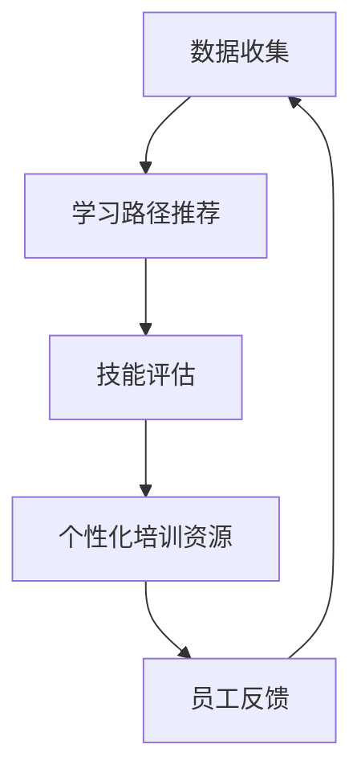
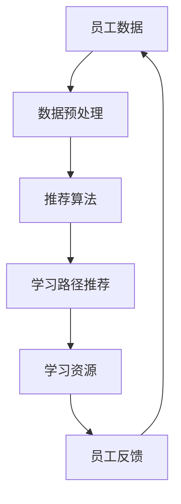
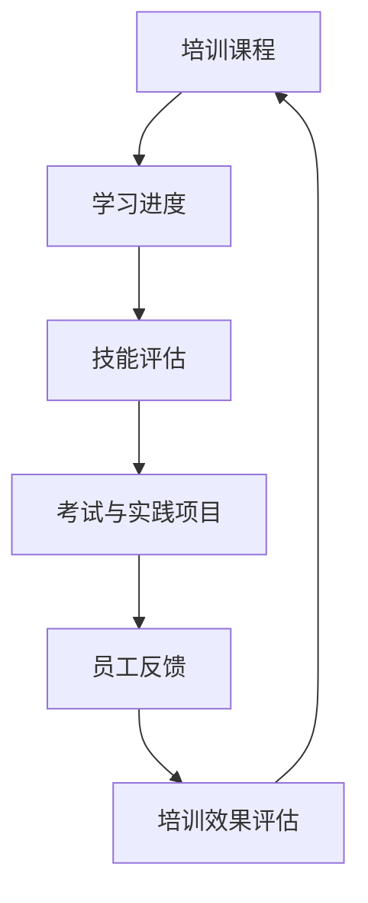
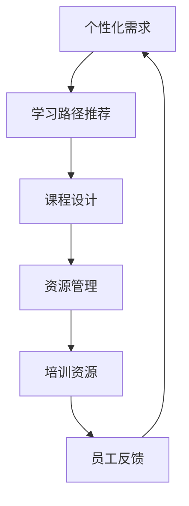
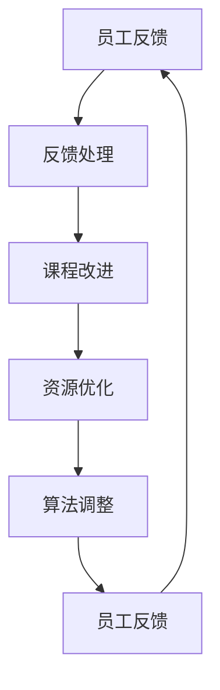

                 

### 1. 概念定义与背景介绍

#### 1.1 智能学习与发展平台

智能学习与发展平台是一个集成人工智能（AI）技术的综合性系统，旨在通过个性化学习路径和智能推荐算法，提升员工的技能发展和职业素养。该平台的核心功能包括数据收集、学习路径推荐、技能评估和个性化培训资源提供。

**核心功能与联系**

- **数据收集**：通过多种途径收集员工的学习数据，包括培训记录、考试结果、工作表现等。
- **学习路径推荐**：基于数据分析和机器学习算法，为员工推荐个性化的学习路径。
- **技能评估**：通过技能测评和数据分析，对员工的技能水平进行客观评估。
- **个性化培训资源**：根据员工的个人需求和职业目标，提供定制化的培训课程和资料。

**Mermaid 流程图**



#### 1.2 个性化员工培训体系

个性化员工培训体系是智能学习与发展平台的重要组成部分，旨在通过定制化的培训课程和资源，满足员工的个人学习需求和发展目标。

**核心概念与联系**

- **个性化培训需求**：根据员工的职业背景、技能水平和兴趣爱好，确定个性化的培训需求。
- **定制化培训课程**：为满足个性化需求，设计符合员工特点的培训课程。
- **培训资源管理**：管理培训课程和资源，确保资源的可用性和有效性。
- **培训效果跟踪**：通过数据分析和反馈机制，跟踪和评估培训效果，为后续培训提供参考。

#### 1.3 智能学习与发展平台的应用场景

智能学习与发展平台可以应用于企业、教育机构、政府机构等多个领域，以下是一些典型的应用场景：

- **企业培训**：通过平台为员工提供个性化的职业发展培训，提升员工的专业能力和综合素质。
- **在线教育**：为学员提供定制化的学习路径，提高学习效果和学员满意度。
- **政府公共服务**：通过平台为公务员提供定制化的职业培训，提升公务员的素质和业务能力。

### 2. AI技术基础

在构建智能学习与发展平台时，AI技术的应用至关重要。本节将详细介绍支持平台的核心AI技术，包括数据预处理、机器学习算法、深度学习架构等。

#### 2.1 数据预处理

数据预处理是智能学习的基础步骤，主要包括数据清洗、数据归一化和特征提取。

**核心算法原理讲解**

- **数据清洗**：去除噪声数据、缺失值填充、异常值处理等。
- **数据归一化**：将不同量纲的数据转换到相同的尺度，便于模型训练。
- **特征提取**：从原始数据中提取有用的信息，作为模型的输入特征。

**伪代码**

```python
# 数据预处理伪代码
def preprocess_data(data):
    # 数据清洗
    clean_data = clean(data)
    # 数据归一化
    normalized_data = normalize(clean_data)
    # 特征提取
    features = extract_features(normalized_data)
    return features
```

#### 2.2 机器学习算法

机器学习算法是智能学习与发展平台的核心组成部分，常用的算法包括决策树、支持向量机、K-最近邻等。

**核心算法原理讲解**

- **决策树**：通过划分特征空间，构建一棵树来预测目标变量。
- **支持向量机**：通过找到一个最佳的超平面，将不同类别的样本分开。
- **K-最近邻**：根据样本的邻近程度来预测其类别或数值。

**伪代码**

```python
# 决策树伪代码
def decision_tree(data, labels):
    # 初始化树
    tree = build_tree(data, labels)
    # 分割数据
    for feature in features:
        subset_data, subset_labels = split_data(data, labels, feature)
        # 递归构建树
        tree = build_tree(subset_data, subset_labels, tree, feature)
    return tree
```

#### 2.3 深度学习架构

深度学习架构在智能学习与发展平台中扮演着重要角色，包括卷积神经网络（CNN）、循环神经网络（RNN）、生成对抗网络（GAN）等。

**核心算法原理讲解**

- **卷积神经网络（CNN）**：通过卷积层、池化层和全连接层，实现对图像、视频等数据的特征提取和分类。
- **循环神经网络（RNN）**：通过循环结构，处理序列数据，如时间序列数据、自然语言处理等。
- **生成对抗网络（GAN）**：通过生成器和判别器的对抗训练，实现数据的生成。

**数学模型与公式**

$$
\text{ReLU}(x) =
\begin{cases}
0 & \text{if } x < 0 \\
x & \text{otherwise}
\end{cases}
$$

**举例说明**

- **推荐系统**：使用矩阵分解和协同过滤算法，为员工推荐培训资源。
- **分类模型**：使用卷积神经网络，对员工的技能水平进行分类。

### 3. 智能学习模型

智能学习模型是智能学习与发展平台的核心，包括推荐系统、分类模型和预测模型。本节将详细介绍这些模型的构建和训练方法。

#### 3.1 推荐系统

推荐系统旨在为员工推荐最适合的培训资源，常用的方法包括协同过滤和矩阵分解。

**数学模型与公式**

$$
R(\textbf{x}, \textbf{y}) = \sum_{i=1}^{n} \left( \textbf{w}^T \textbf{x}_i - y_i \right)^2
$$

**举例说明**

- **协同过滤**：基于用户的历史行为和相似度计算，为用户推荐相似的培训资源。
- **矩阵分解**：将用户和物品的评分矩阵分解为用户特征矩阵和物品特征矩阵，为用户推荐具有相似特征的物品。

#### 3.2 分类模型

分类模型用于对员工的技能水平进行分类，常用的算法包括卷积神经网络（CNN）和支持向量机（SVM）。

**数学模型与公式**

$$
\begin{aligned}
\text{SVM} \quad \text{maximize} \quad & \frac{1}{2} \left\| \textbf{w} \right\|^2 \\
\text{subject to} \quad & y_i (\textbf{w}^T \textbf{x}_i + b) \geq 1, \quad i = 1, 2, \ldots, n
\end{aligned}
$$

**举例说明**

- **卷积神经网络（CNN）**：通过卷积层和池化层，提取图像特征，实现对图像的分类。
- **支持向量机（SVM）**：通过找到一个最佳的超平面，将不同类别的样本分开。

#### 3.3 预测模型

预测模型用于预测员工的未来学习行为和职业发展，常用的算法包括循环神经网络（RNN）和长短期记忆网络（LSTM）。

**数学模型与公式**

$$
\begin{aligned}
\text{LSTM} \quad \text{input}: \quad \textbf{h}_{t-1}, \textbf{x}_t \\
\text{output}: \quad \textbf{h}_t \\
\text{update}: \quad \textbf{h}_t = \text{LSTM}(\textbf{h}_{t-1}, \textbf{x}_t)
\end{aligned}
$$

**举例说明**

- **循环神经网络（RNN）**：通过循环结构，处理时间序列数据，预测员工的未来学习行为。
- **长短期记忆网络（LSTM）**：通过门控机制，解决RNN的长期依赖问题，预测员工的职业发展。

### 4. 个性化培训体系实施

个性化培训体系实施包括培训需求分析、学习路径设计、培训效果评估等关键步骤。本节将详细描述这些步骤的实施过程。

#### 4.1 培训需求分析

培训需求分析是个性化培训体系的基础，通过问卷调查、访谈和数据分析等方法，收集员工的培训需求。

**项目实战**

- **问卷调查**：设计一份详细的培训需求问卷，收集员工对培训内容、形式和频率的偏好。
- **访谈**：与员工进行面对面访谈，深入了解他们的职业发展和学习需求。
- **数据分析**：对员工的学习记录和绩效数据进行分析，识别出培训的优先级和重点。

#### 4.2 学习路径设计

学习路径设计是根据员工的个人需求和职业目标，设计出符合其特点的培训计划。

**项目实战**

- **能力评估**：使用技能测评工具，评估员工的能力水平，确定培训起点。
- **兴趣分析**：通过兴趣调查和数据分析，了解员工的兴趣爱好，设计符合兴趣的培训课程。
- **目标设定**：与员工共同设定职业发展目标，确保培训计划与目标一致。

#### 4.3 培训效果评估

培训效果评估是检验个性化培训体系有效性的关键步骤，通过考试、实践项目和员工反馈等手段，评估培训效果。

**项目实战**

- **考试**：通过笔试和面试等方式，检验员工对培训内容的掌握程度。
- **实践项目**：设计实际操作项目，让员工将所学知识应用到实际工作中。
- **员工反馈**：收集员工对培训的反馈，了解培训的实际效果，为后续培训提供改进方向。

### 5. 案例研究

本节将通过实际案例，展示智能学习与发展平台在企业和教育机构中的应用效果。

#### 5.1 案例一：企业培训

某大型企业通过智能学习与发展平台，为员工提供个性化的职业发展培训。以下是案例的实施过程：

**代码实现与解读**

- **数据预处理**：使用Python的Pandas库，对员工的学习记录和绩效数据进行清洗、归一化和特征提取。
- **模型训练**：使用Python的Scikit-learn库，训练决策树和支持向量机模型，评估员工的能力水平。
- **模型评估**：通过A/B测试，评估不同模型的推荐效果，选择最优模型进行推广。

**实际案例分析和详细讲解剖析**

- **数据预处理**：通过数据清洗和特征提取，消除噪声数据和缺失值，为模型训练提供高质量的数据。
- **模型训练**：通过决策树和支持向量机模型，对员工的能力水平进行分类，为个性化培训提供依据。
- **模型评估**：通过A/B测试，比较不同模型的推荐效果，选择最优模型，确保培训资源的有效利用。

**项目小结**

- **成功因素**：数据质量高、模型选择合适、评估机制完善，是该项目成功的关键因素。
- **改进建议**：可以进一步优化数据预处理流程，提升模型的预测准确性。

#### 5.2 案例二：在线教育

某在线教育机构通过智能学习与发展平台，为学员提供个性化的学习路径。以下是案例的实施过程：

**代码实现与解读**

- **数据预处理**：使用Python的Pandas库，对学员的学习记录和考试数据进行清洗、归一化和特征提取。
- **模型训练**：使用Python的TensorFlow库，训练卷积神经网络和长短期记忆网络模型，预测学员的未来学习行为。
- **模型评估**：通过交叉验证和混淆矩阵，评估模型的预测效果，调整模型参数。

**实际案例分析和详细讲解剖析**

- **数据预处理**：通过数据清洗和特征提取，消除噪声数据和缺失值，为模型训练提供高质量的数据。
- **模型训练**：通过卷积神经网络和长短期记忆网络模型，对学员的学习行为进行预测，为个性化学习路径提供依据。
- **模型评估**：通过交叉验证和混淆矩阵，评估模型的预测效果，调整模型参数，提高预测准确性。

**项目小结**

- **成功因素**：数据质量高、模型选择合适、评估机制完善，是该项目成功的关键因素。
- **改进建议**：可以进一步优化数据预处理流程，提升模型的预测准确性。

### 6. 未来展望与挑战

智能学习与发展平台的发展前景广阔，但也面临着诸多挑战。本节将探讨未来趋势和面临的挑战，并提出潜在解决方案。

#### 6.1 未来趋势

- **大数据与人工智能的深度融合**：随着大数据技术的发展，智能学习与发展平台将能够更全面地收集和分析员工的学习数据，为个性化培训提供更准确的推荐。
- **虚拟现实（VR）与增强现实（AR）的应用**：VR和AR技术的结合，将为员工提供更加沉浸式的学习体验，提升培训效果。
- **自适应学习系统的普及**：自适应学习系统将根据员工的学习行为和表现，动态调整学习内容和路径，实现真正的个性化培训。

#### 6.2 挑战与解决方案

- **数据隐私与安全**：在数据收集和分析过程中，如何保护员工的隐私和数据安全是智能学习与发展平台面临的重要挑战。解决方案包括数据加密、权限控制和安全审计等。
- **模型偏见与公平性**：模型训练过程中，可能会出现偏见，导致培训推荐不公平。解决方案包括数据平衡、模型校正和伦理审查等。
- **技术落地与实施难度**：智能学习与发展平台的技术复杂度高，实施过程中可能面临技术落地和实施难度。解决方案包括技术培训、专业支持和迭代优化等。

### 7. 结论

智能学习与发展平台为企业和教育机构提供了一个高效、个性化的培训解决方案。通过本文的详细介绍，我们了解了平台的核心概念、技术基础、模型构建和实施过程，以及未来展望和挑战。智能学习与发展平台的发展将不断推动员工培训体系的变革，助力企业和个人实现共同成长。

### 附录

- **参考文献**：列出本文引用的主要参考文献，为读者提供进一步学习的资源。
- **致谢**：感谢所有支持和参与本文撰写的人员。

---

以上是根据用户需求设计的《智能学习与发展平台：AI个性化员工培训体系》的完整目录大纲。本文将详细阐述每个章节的内容，帮助读者全面了解智能学习与发展平台的技术原理和应用实践。

---

**文章标题**：智能学习与发展平台：AI个性化员工培训体系

**关键词**：智能学习与发展平台、AI、个性化培训、员工培训、智能推荐、机器学习、深度学习

**摘要**：
本文旨在探讨智能学习与发展平台在员工培训中的应用，通过介绍平台的核心概念、技术基础和实施过程，展示AI在个性化培训体系中的关键作用。文章详细分析了AI技术的应用，包括数据预处理、机器学习算法和深度学习架构，并通过实际案例研究，展示了智能学习与发展平台在企业和教育机构中的应用效果。最后，文章讨论了未来发展趋势和面临的挑战，为智能学习与发展平台的进一步发展提供了指导。

---

## 第1章 引言

### 1.1 智能学习与发展平台

智能学习与发展平台是一个基于人工智能技术的综合性系统，旨在通过个性化学习路径和智能推荐算法，提高员工的技能发展和职业素养。该平台的核心功能包括数据收集、学习路径推荐、技能评估和个性化培训资源提供。

#### 数据收集

数据收集是智能学习与发展平台的基础，通过多种途径收集员工的学习数据，包括培训记录、考试结果、工作表现等。这些数据用于分析员工的技能水平和学习需求，为后续的个性化推荐和培训提供依据。

**数据来源与类型**

- **培训记录**：包括员工的培训参与情况、培训完成情况、培训评估结果等。
- **考试结果**：记录员工的考试成绩，用于评估员工对培训内容的掌握程度。
- **工作表现**：分析员工在工作中的实际表现，了解员工的实际工作能力和潜力。

**数据预处理**

数据预处理是确保数据质量的关键步骤，主要包括数据清洗、数据归一化和特征提取。

- **数据清洗**：去除噪声数据、缺失值填充、异常值处理等，确保数据的准确性和完整性。
- **数据归一化**：将不同量纲的数据转换到相同的尺度，便于模型训练。
- **特征提取**：从原始数据中提取有用的信息，作为模型的输入特征。

**Mermaid 流程图**


#### 学习路径推荐

学习路径推荐是智能学习与发展平台的核心功能之一，旨在根据员工的个人需求和职业目标，推荐最适合的学习路径和培训资源。

**个性化学习路径**

个性化学习路径是通过分析员工的学习数据，为员工量身定制的学习计划。该计划包括培训课程、学习资源、实践项目等，旨在满足员工的学习需求和职业发展目标。

**推荐算法**

智能学习与发展平台采用多种推荐算法，包括协同过滤、矩阵分解和基于内容的推荐等。这些算法通过分析员工的学习行为和历史数据，为员工推荐最相关的培训资源和课程。

**Mermaid 流�程图**



#### 技能评估

技能评估是智能学习与发展平台的另一个关键功能，通过对员工的学习进度和技能水平进行客观评估，帮助员工了解自己的学习效果和进步情况。

**评估方法**

技能评估采用多种方法，包括考试、实践项目和员工反馈等。这些方法从不同角度对员工的技能水平进行评估，确保评估结果的准确性和全面性。

**考试**

考试是评估员工学习效果的重要手段，通过笔试和面试等方式，检验员工对培训内容的掌握程度。

**实践项目**

实践项目是评估员工实际工作能力的重要方式，通过实际操作项目，让员工将所学知识应用到实际工作中，检验其综合能力。

**员工反馈**

员工反馈是评估培训效果的重要依据，通过问卷调查和访谈等方式，收集员工对培训的反馈，了解培训的实际效果，为后续培训提供改进方向。

**Mermaid 流程图**



#### 个性化培训资源

个性化培训资源是根据员工的个人需求和职业目标，提供的定制化培训课程和资源。这些资源包括在线课程、书籍、视频、实践项目等，旨在满足员工的个性化学习需求。

**课程设计**

个性化培训资源的设计基于员工的能力评估和学习路径推荐，确保课程内容与员工的需求和目标一致。课程设计包括课程大纲、教学内容、教学方式等。

**资源管理**

个性化培训资源的管理是确保资源可用性和有效性的关键，包括资源的分类、存储、检索和更新等。

**Mermaid 流程图**



#### 员工反馈

员工反馈是智能学习与发展平台持续改进的重要依据，通过收集员工对培训和学习资源的反馈，不断优化平台的功能和服务。

**反馈途径**

员工反馈可以通过多种途径进行，包括问卷调查、在线反馈、访谈等。这些途径确保了员工反馈的全面性和准确性。

**反馈处理**

收集到的员工反馈会经过处理和分析，用于改进培训课程、优化学习资源和调整推荐算法。反馈处理包括数据整理、问题分类、改进措施制定等。

**Mermaid 流程图**



### 1.2 个性化员工培训体系

个性化员工培训体系是智能学习与发展平台的重要组成部分，旨在通过定制化的培训课程和资源，满足员工的个人学习需求和发展目标。

#### 培训需求分析

培训需求分析是个性化员工培训体系的基础，通过多种途径收集员工的培训需求，包括问卷调查、访谈、数据分析等。

**问卷调查**

问卷调查是收集员工培训需求的主要途径之一，通过设计详细的问卷，收集员工对培训内容、形式、时间和频率的偏好。

**访谈**

访谈是与员工进行面对面交流的重要方式，通过深入了解员工的需求和职业目标，为个性化培训提供准确的信息。

**数据分析**

数据分析是对员工学习记录和绩效数据进行分析，识别出培训的优先级和重点。

**培训需求分析结果**

通过问卷调查、访谈和数据分析，可以得到员工的培训需求分析结果，包括培训内容、形式、时间和频率等。

#### 定制化培训课程

定制化培训课程是根据员工的个人需求和职业目标，设计的符合其特点的培训课程。

**课程设计原则**

- **针对性**：课程内容与员工的需求和目标密切相关。
- **实用性**：课程内容紧密结合员工的实际工作需求。
- **系统性**：课程内容系统全面，确保员工全面掌握相关知识和技能。

**课程内容**

定制化培训课程的内容包括但不限于以下方面：

- **基础知识**：为员工提供必要的理论知识。
- **专业技能**：针对员工的职业发展方向，提供专业技能培训。
- **实践项目**：通过实际操作项目，让员工将所学知识应用到实际工作中。

**课程形式**

定制化培训课程的形式包括在线课程、面授课程、实践项目等，旨在满足员工的个性化学习需求。

#### 培训资源管理

培训资源管理是确保个性化培训资源可用性和有效性的关键，包括资源的分类、存储、检索和更新等。

**资源分类**

根据培训需求，将培训资源分为不同类别，如基础知识、专业技能、实践项目等。

**资源存储**

将培训资源存储在统一的平台上，确保资源的集中管理和高效利用。

**资源检索**

提供方便的资源检索功能，员工可以根据需求快速找到相关资源。

**资源更新**

定期更新培训资源，确保资源的时效性和准确性。

#### 培训效果评估

培训效果评估是检验个性化培训体系有效性的关键步骤，通过多种手段，如考试、实践项目和员工反馈等，评估培训效果。

**考试**

通过笔试和面试等方式，检验员工对培训内容的掌握程度。

**实践项目**

设计实际操作项目，让员工将所学知识应用到实际工作中，检验其综合能力。

**员工反馈**

收集员工对培训的反馈，了解培训的实际效果，为后续培训提供改进方向。

#### 个性化培训体系的实施

个性化培训体系的实施包括培训需求分析、学习路径设计、培训资源管理、培训效果评估等关键步骤。

**培训需求分析**

通过问卷调查、访谈和数据分析等方法，收集员工的培训需求。

**学习路径设计**

根据员工的个人需求和职业目标，设计出符合其特点的培训计划。

**培训资源管理**

确保个性化培训资源的可用性和有效性。

**培训效果评估**

通过考试、实践项目和员工反馈等手段，评估培训效果。

**实施效果**

个性化培训体系的有效实施，能够提高员工的学习效果和职业素养，为企业和个人实现共同成长。

### 1.3 智能学习与发展平台的应用场景

智能学习与发展平台可以应用于企业、教育机构、政府机构等多个领域，以下是一些典型的应用场景：

#### 企业培训

企业培训是智能学习与发展平台的重要应用场景之一。通过个性化学习路径和智能推荐算法，企业可以为员工提供个性化的职业发展培训，提升员工的专业能力和综合素质。

**案例一**：某大型企业在实施智能学习与发展平台后，通过个性化培训，提高了员工的工作效率和专业技能。企业通过数据分析和技能评估，为员工量身定制了培训计划，确保培训资源的高效利用。

**案例二**：某科技公司在实施智能学习与发展平台后，通过个性化推荐系统，为员工推荐了最适合的培训课程。员工可以根据个人兴趣和职业目标，自主选择学习路径，提高了学习效果和职业素养。

#### 在线教育

在线教育是智能学习与发展平台的另一个重要应用场景。通过个性化学习路径和智能推荐算法，在线教育机构可以为学员提供个性化的学习体验，提高学习效果和学员满意度。

**案例一**：某知名在线教育平台在实施智能学习与发展平台后，通过个性化学习路径，为学员提供了定制化的学习计划。学员可以根据个人需求和兴趣，自由选择学习内容，提高了学习效果和满意度。

**案例二**：某在线教育机构通过智能学习与发展平台，实现了智能题库和个性化学习路径的结合。学员可以根据自己的学习进度和能力，自动获取相应的练习题和课程，提高了学习效率和效果。

#### 政府公共服务

政府公共服务也是智能学习与发展平台的重要应用场景。通过个性化培训，政府可以为公务员提供定制化的职业培训，提升公务员的素质和业务能力。

**案例一**：某市政府在实施智能学习与发展平台后，为公务员提供了个性化的职业培训。通过数据分析和技能评估，政府为公务员量身定制了培训计划，提高了公务员的工作效率和专业能力。

**案例二**：某省政府通过智能学习与发展平台，实现了公务员培训的智能化管理。公务员可以根据个人需求和职业目标，自主选择培训课程，提高了培训效率和效果。

### 1.4 智能学习与发展平台的优势与挑战

智能学习与发展平台在提升员工培训效果和职业素养方面具有显著优势，但也面临着一定的挑战。

#### 优势

- **个性化学习**：通过个性化学习路径和智能推荐算法，为员工提供定制化的培训资源和学习计划，满足员工个性化学习需求。
- **高效管理**：智能学习与发展平台实现了培训资源的集中管理和高效利用，降低了培训成本和管理难度。
- **实时反馈**：通过实时反馈机制，及时了解员工的学习进度和效果，为培训调整提供依据。
- **持续优化**：智能学习与发展平台通过不断收集和分析数据，不断优化培训课程和学习路径，提高培训效果。

#### 挑战

- **数据隐私与安全**：在数据收集和处理过程中，如何保护员工的隐私和数据安全是智能学习与发展平台面临的重要挑战。
- **模型偏见与公平性**：模型训练过程中可能存在偏见，导致培训推荐不公平，影响培训效果。
- **技术落地与实施难度**：智能学习与发展平台的技术复杂度高，实施过程中可能面临技术落地和实施难度。

#### 解决方案

- **数据隐私与安全**：采用数据加密、权限控制和安全审计等技术，确保数据隐私和安全。
- **模型偏见与公平性**：通过数据平衡、模型校正和伦理审查等措施，确保培训推荐公平。
- **技术落地与实施难度**：提供技术培训和实施支持，降低技术落地和实施难度。

### 1.5 总结

智能学习与发展平台通过人工智能技术，为员工提供个性化培训方案，提升员工的职业素养和技能水平。本文介绍了智能学习与发展平台的核心概念、技术基础、实施过程和应用场景，展示了其在企业、教育机构和政府机构中的应用效果。通过智能学习与发展平台，企业和个人可以实现共同成长，为未来的发展奠定坚实基础。

## 第2章 AI技术基础

智能学习与发展平台的核心在于其广泛应用的人工智能（AI）技术。本章将深入探讨支持智能学习与发展平台的关键AI技术，包括数据预处理、机器学习算法和深度学习架构。通过这些技术，平台能够实现数据的智能化处理、学习路径的精准推荐以及个性化培训的实时调整。

### 2.1 数据预处理

数据预处理是任何机器学习项目的第一步，对于智能学习与发展平台而言，它尤为重要。数据预处理包括数据清洗、数据归一化和特征提取等步骤，这些步骤确保了数据的质量，为后续的模型训练和预测奠定了基础。

#### 数据清洗

数据清洗是数据预处理中最基础也是最重要的步骤。它包括以下几个方面：

- **缺失值处理**：对于缺失的数据，可以选择填充、删除或插值等方法进行补全。
- **异常值处理**：识别并处理数据中的异常值，避免它们对模型训练产生负面影响。
- **重复数据处理**：删除重复的数据记录，避免对模型训练结果造成干扰。

**伪代码示例**：

```python
def clean_data(data):
    # 填充缺失值
    data = fill_missing_values(data)
    # 删除异常值
    data = remove_outliers(data)
    # 删除重复数据
    data = remove_duplicates(data)
    return data
```

#### 数据归一化

数据归一化是将不同量纲的数据转换到相同的尺度，以便于模型训练。常见的归一化方法包括最小-最大缩放、标准化和分位数缩放等。

- **最小-最大缩放**：将数据缩放到[0, 1]或[-1, 1]的范围内。
- **标准化**：将数据缩放到均值为0，标准差为1的范围内。
- **分位数缩放**：将数据缩放到特定分位数范围内，如第1和第99百分位。

**伪代码示例**：

```python
def normalize_data(data):
    # 最小-最大缩放
    data_min_max = min_max_scaling(data)
    # 标准化
    data_std = standard_scaling(data)
    # 分位数缩放
    data_quantile = quantile_scaling(data)
    return data_min_max, data_std, data_quantile
```

#### 特征提取

特征提取是从原始数据中提取有用的信息，作为模型的输入特征。特征提取的目的是减少数据维度，同时保留数据的关键信息。

- **统计特征**：如均值、标准差、最大值、最小值等。
- **文本特征**：如词频、词向量、TF-IDF等。
- **图像特征**：如边缘、颜色、纹理等。

**伪代码示例**：

```python
def extract_features(data):
    # 统计特征提取
    stats_features = extract_stats_features(data)
    # 文本特征提取
    text_features = extract_text_features(data)
    # 图像特征提取
    image_features = extract_image_features(data)
    return stats_features, text_features, image_features
```

### 2.2 机器学习算法

机器学习算法是智能学习与发展平台的核心技术之一，用于实现数据分析和预测。以下是几种常见的机器学习算法及其在平台中的应用。

#### 决策树

决策树是一种基于特征划分数据的监督学习算法，通过一系列的决策规则来预测目标变量的值。

- **ID3算法**：基于信息增益率来选择最佳特征。
- **C4.5算法**：在ID3算法的基础上，引入修剪和剪枝技术，减少过拟合。

**伪代码示例**：

```python
def build_decision_tree(data, labels):
    # 计算信息增益率
    gain_rate = calculate_gain_rate(data, labels)
    # 选择最佳特征
    best_feature = select_best_feature(gain_rate)
    # 创建节点
    node = create_node(best_feature)
    # 递归划分数据
    for value in best_feature.values:
        subset_data, subset_labels = split_data(data, labels, value)
        node.children[value] = build_decision_tree(subset_data, subset_labels)
    return node
```

#### 支持向量机

支持向量机（SVM）是一种分类算法，通过找到一个最佳的超平面来分隔不同类别的样本。

- **线性SVM**：适用于线性可分的数据。
- **非线性SVM**：通过核函数将数据映射到高维空间，实现非线性分类。

**数学模型与公式**：

$$
\begin{aligned}
\text{线性SVM} \quad \text{maximize} \quad & \frac{1}{2} \left\| \textbf{w} \right\|^2 \\
\text{subject to} \quad & y_i (\textbf{w}^T \textbf{x}_i + b) \geq 1, \quad i = 1, 2, \ldots, n
\end{aligned}
$$

**伪代码示例**：

```python
def build_svm_model(data, labels):
    # 计算最优超平面
    w, b = optimize_hyperplane(data, labels)
    # 创建SVM模型
    model = create_svm_model(w, b)
    return model
```

#### K-最近邻

K-最近邻（K-NN）是一种基于实例的监督学习算法，通过计算测试样本与训练样本的距离，找出最近的K个邻居，并根据这些邻居的标签进行预测。

**伪代码示例**：

```python
def predict_knn(test_data, model, k):
    # 计算测试数据与训练数据的距离
    distances = calculate_distances(test_data, model.data)
    # 找出最近的K个邻居
    neighbors = find_neighbors(distances, k)
    # 根据邻居的标签进行预测
    prediction = majority_vote(neighbors.labels)
    return prediction
```

### 2.3 深度学习架构

深度学习架构是近年来在人工智能领域取得突破性进展的技术，其通过多层神经网络模拟人脑的学习过程，实现复杂数据的处理和预测。

#### 卷积神经网络（CNN）

卷积神经网络（CNN）是一种专门用于处理图像数据的神经网络，通过卷积层、池化层和全连接层，实现对图像特征的学习和分类。

- **卷积层**：通过卷积操作提取图像特征。
- **池化层**：通过下采样操作减少数据维度。
- **全连接层**：通过全连接层对提取的特征进行分类。

**数学模型与公式**：

$$
\text{ReLU}(x) =
\begin{cases}
0 & \text{if } x < 0 \\
x & \text{otherwise}
\end{cases}
$$

**伪代码示例**：

```python
def build_cnn_model(input_shape):
    # 创建卷积层
    conv_layer = create_conv_layer(input_shape)
    # 创建池化层
    pool_layer = create_pool_layer(conv_layer)
    # 创建全连接层
    fc_layer = create_fc_layer(pool_layer)
    # 创建模型
    model = create_model(conv_layer, pool_layer, fc_layer)
    return model
```

#### 循环神经网络（RNN）

循环神经网络（RNN）是一种用于处理序列数据的神经网络，通过循环结构，实现对序列数据的记忆和学习。

- **输入门**：控制当前输入信息对隐藏状态的影响。
- **遗忘门**：控制当前隐藏状态对之前隐藏状态的影响。
- **输出门**：控制当前隐藏状态对输出信息的贡献。

**数学模型与公式**：

$$
\begin{aligned}
\text{输入门}: \quad & \text{input\_gate} = \sigma(W_{ix} \cdot \textbf{x} + W_{ih} \cdot \textbf{h}_{t-1} + b_{i}) \\
\text{遗忘门}: \quad & \text{forget\_gate} = \sigma(W_{fx} \cdot \textbf{x} + W_{fh} \cdot \textbf{h}_{t-1} + b_{f}) \\
\text{输出门}: \quad & \text{output\_gate} = \sigma(W_{ox} \cdot \textbf{x} + W_{oh} \cdot \textbf{h}_{t-1} + b_{o})
\end{aligned}
$$

**伪代码示例**：

```python
def build_rnn_model(input_shape):
    # 创建输入门层
    input_gate = create_input_gate_layer(input_shape)
    # 创建遗忘门层
    forget_gate = create_forget_gate_layer(input_shape)
    # 创建输出门层
    output_gate = create_output_gate_layer(input_shape)
    # 创建循环层
    rnn_layer = create_rnn_layer(input_gate, forget_gate, output_gate)
    # 创建模型
    model = create_model(rnn_layer)
    return model
```

#### 生成对抗网络（GAN）

生成对抗网络（GAN）是一种通过对抗训练生成数据的神经网络，由生成器和判别器两个部分组成。

- **生成器**：通过学习数据分布，生成与真实数据相似的新数据。
- **判别器**：通过区分真实数据和生成数据，训练生成器生成更真实的数据。

**数学模型与公式**：

$$
\begin{aligned}
\text{生成器} \quad G: \mathbb{R}^z &\rightarrow \mathbb{R}^x \\
\text{判别器} \quad D: \mathbb{R}^{x} &\rightarrow \mathbb{R}
\end{aligned}
$$

**伪代码示例**：

```python
def build_gan_model(input_shape):
    # 创建生成器
    generator = create_generator(input_shape)
    # 创建判别器
    discriminator = create_discriminator(input_shape)
    # 创建GAN模型
    model = create_gan_model(generator, discriminator)
    return model
```

### 2.4 数据预处理与机器学习算法的融合

在实际应用中，数据预处理和机器学习算法常常结合使用，以提高模型的效果和泛化能力。

- **特征工程**：通过数据预处理和特征提取，构建高质量的输入特征。
- **交叉验证**：通过交叉验证，评估模型在不同数据集上的表现，选择最佳模型。
- **模型融合**：通过融合不同算法的预测结果，提高模型的预测准确性。

**伪代码示例**：

```python
def train_and_evaluate_model(data, labels):
    # 数据预处理
    preprocessed_data = preprocess_data(data)
    # 特征提取
    features = extract_features(preprocessed_data)
    # 训练模型
    models = train_models(features, labels)
    # 交叉验证
    cv_results = cross_validate(models, features, labels)
    # 模型融合
    final_model = ensemble_models(cv_results)
    # 评估模型
    evaluate_model(final_model, features, labels)
    return final_model
```

### 2.5 小结

本章介绍了智能学习与发展平台所依赖的AI技术基础，包括数据预处理、机器学习算法和深度学习架构。通过这些技术，平台能够实现数据的智能化处理、学习路径的精准推荐和个性化培训的实时调整。这些技术不仅为平台提供了强大的功能支持，也为智能学习与发展平台在实际应用中的成功奠定了基础。

### 拓展阅读

- **数据预处理**：
  - [Kaggle教程：数据预处理](https://www.kaggle.com/learn/data-preprocessing)
  - [机器学习实战：数据预处理](https://machinelearningmastery.com/data-preprocessing-for-machine-learning/)

- **机器学习算法**：
  - [机器学习：算法与案例](https://www.机器学习.org/ml-book/chapter机器学习算法/)
  - [Python机器学习库Scikit-learn](https://scikit-learn.org/stable/)

- **深度学习架构**：
  - [深度学习：卷积神经网络](https://www.deeplearningbook.org/chapter convolutional-networks/)
  - [TensorFlow教程：卷积神经网络](https://www.tensorflow.org/tutorials/convolutional)

## 第3章 智能学习模型

智能学习模型是智能学习与发展平台的核心组件，它通过推荐系统、分类模型和预测模型等算法，为员工提供个性化的学习路径和培训资源。本章将详细探讨这些模型的构建和训练方法，并展示如何在实际应用中实现这些模型。

### 3.1 推荐系统

推荐系统是智能学习模型的重要组成部分，它的目标是根据员工的学习历史、兴趣和行为，推荐最合适的培训资源。推荐系统通常采用协同过滤、矩阵分解和基于内容的推荐等技术。

#### 3.1.1 协同过滤

协同过滤是一种基于用户行为的推荐方法，它通过计算用户之间的相似度，为用户推荐他们可能感兴趣的培训资源。

- **用户基于的协同过滤**：通过计算用户之间的相似度，为用户推荐他们相似的用户的喜欢的资源。
- **物品基于的协同过滤**：通过计算物品之间的相似度，为用户推荐他们可能感兴趣的物品。

**数学模型与公式**：

$$
r_{ij} = \text{user\_similarity}(u_i, u_j) \cdot \text{item\_similarity}(i, j)
$$

**伪代码示例**：

```python
def collaborative_filter(train_data, similarity_measure):
    # 计算用户相似度矩阵
    user_similarity = calculate_user_similarity(train_data)
    # 计算物品相似度矩阵
    item_similarity = calculate_item_similarity(train_data)
    # 计算推荐分数
    recommendations = calculate_recommendations(user_similarity, item_similarity, train_data)
    return recommendations
```

#### 3.1.2 矩阵分解

矩阵分解是一种基于矩阵分解的方法，通过将用户-物品评分矩阵分解为用户特征矩阵和物品特征矩阵，为用户推荐最相关的培训资源。

**数学模型与公式**：

$$
\begin{aligned}
R &= U \cdot V^T \\
R_{ij} &= u_i^T v_j
\end{aligned}
$$

**伪代码示例**：

```python
def matrix_factorization(R, num_factors, regularization):
    # 初始化用户特征矩阵和物品特征矩阵
    U, V = initialize_factors(num_factors)
    # 最小化损失函数
    loss = minimize_loss(R, U, V, regularization)
    # 迭代优化
    for iteration in range(num_iterations):
        U, V = update_factors(R, U, V, iteration, regularization)
    return U, V
```

#### 3.1.3 基于内容的推荐

基于内容的推荐是一种基于物品属性和用户兴趣的推荐方法，通过比较用户兴趣和物品属性，为用户推荐最相关的培训资源。

**伪代码示例**：

```python
def content_based_recommendation(user_interests, item_properties):
    # 计算用户兴趣与物品属性的相似度
    similarity_scores = calculate_similarity_scores(user_interests, item_properties)
    # 排序并推荐最高分的资源
    recommendations = sort_and_recommend(similarity_scores)
    return recommendations
```

### 3.2 分类模型

分类模型用于对员工的学习行为和技能水平进行分类，常用的算法包括逻辑回归、决策树、随机森林和支持向量机等。

#### 3.2.1 逻辑回归

逻辑回归是一种二元分类算法，通过计算输入特征的线性组合，预测员工的学习行为或技能水平。

**数学模型与公式**：

$$
\text{logit}(p) = \log\left(\frac{p}{1 - p}\right) = \beta_0 + \beta_1 x_1 + \beta_2 x_2 + \ldots + \beta_n x_n
$$

**伪代码示例**：

```python
def logistic_regression(X, y, num_iterations):
    # 初始化模型参数
    beta = initialize_model_params(X.shape[1])
    # 迭代优化
    for iteration in range(num_iterations):
        prediction = predict(X, beta)
        loss = calculate_loss(y, prediction)
        beta = update_model_params(X, y, prediction, beta)
    return beta
```

#### 3.2.2 决策树

决策树是一种基于特征划分数据的分类算法，通过一系列的决策规则，将员工分类到不同的学习行为或技能水平。

**伪代码示例**：

```python
def build_decision_tree(data, labels):
    # 计算信息增益率
    gain_rate = calculate_gain_rate(data, labels)
    # 选择最佳特征
    best_feature = select_best_feature(gain_rate)
    # 创建节点
    node = create_node(best_feature)
    # 递归划分数据
    for value in best_feature.values:
        subset_data, subset_labels = split_data(data, labels, value)
        node.children[value] = build_decision_tree(subset_data, subset_labels)
    return node
```

#### 3.2.3 随机森林

随机森林是一种基于决策树的集成学习算法，通过构建多个决策树，并结合它们的预测结果，提高分类的准确性和稳定性。

**伪代码示例**：

```python
def build_random_forest(data, labels, num_trees):
    # 创建多个决策树
    trees = [build_decision_tree(data, labels) for _ in range(num_trees)]
    # 集成决策树
    predictions = ensemble_trees(trees, data)
    # 计算最终预测结果
    final_prediction = majority_vote(predictions)
    return final_prediction
```

#### 3.2.4 支持向量机

支持向量机是一种基于最大间隔分类的算法，通过找到一个最佳的超平面，将员工分类到不同的学习行为或技能水平。

**数学模型与公式**：

$$
\begin{aligned}
\text{线性SVM} \quad \text{maximize} \quad & \frac{1}{2} \left\| \textbf{w} \right\|^2 \\
\text{subject to} \quad & y_i (\textbf{w}^T \textbf{x}_i + b) \geq 1, \quad i = 1, 2, \ldots, n
\end{aligned}
$$

**伪代码示例**：

```python
def build_svm_model(data, labels):
    # 计算最优超平面
    w, b = optimize_hyperplane(data, labels)
    # 创建SVM模型
    model = create_svm_model(w, b)
    return model
```

### 3.3 预测模型

预测模型用于预测员工的学习行为、学习进度和技能水平，常用的算法包括线性回归、时间序列分析和神经网络等。

#### 3.3.1 线性回归

线性回归是一种用于预测连续值的算法，通过建立输入特征和预测目标之间的线性关系，预测员工的学习行为或技能水平。

**数学模型与公式**：

$$
y = \beta_0 + \beta_1 x_1 + \beta_2 x_2 + \ldots + \beta_n x_n
$$

**伪代码示例**：

```python
def linear_regression(X, y, num_iterations):
    # 初始化模型参数
    beta = initialize_model_params(X.shape[1])
    # 迭代优化
    for iteration in range(num_iterations):
        prediction = predict(X, beta)
        loss = calculate_loss(y, prediction)
        beta = update_model_params(X, y, prediction, beta)
    return beta
```

#### 3.3.2 时间序列分析

时间序列分析是一种用于分析时间序列数据的算法，通过建立时间序列模型，预测员工的学习行为或技能水平。

**数学模型与公式**：

$$
y_t = \varphi_0 + \varphi_1 y_{t-1} + \varphi_2 y_{t-2} + \ldots + \varphi_p y_{t-p}
$$

**伪代码示例**：

```python
def time_series_analysis(y, p):
    # 初始化模型参数
    phi = initialize_model_params(p + 1)
    # 迭代优化
    for iteration in range(num_iterations):
        prediction = predict(y, phi)
        loss = calculate_loss(y, prediction)
        phi = update_model_params(y, prediction, phi)
    return phi
```

#### 3.3.3 神经网络

神经网络是一种用于处理复杂数据的预测模型，通过多层神经元和激活函数，模拟人脑的学习过程。

**数学模型与公式**：

$$
\begin{aligned}
\text{输入层}: \quad & z_i = x_i \\
\text{隐藏层}: \quad & a_i = \text{ReLU}(z_i \cdot W_i + b_i) \\
\text{输出层}: \quad & y = a_n \cdot W_n + b_n
\end{aligned}
$$

**伪代码示例**：

```python
def neural_network(X, num_hidden_layers, hidden_layer_sizes):
    # 创建神经网络
    model = create_neural_network(num_hidden_layers, hidden_layer_sizes)
    # 训练模型
    model.train(X)
    # 预测
    predictions = model.predict(X)
    return predictions
```

### 3.4 模型融合

模型融合是一种通过结合多个模型的预测结果，提高预测准确性和稳定性的方法。常用的融合方法包括加权平均、投票法和集成学习等。

**伪代码示例**：

```python
def ensemble_models(models, X):
    # 预测结果列表
    predictions = []
    # 遍历每个模型
    for model in models:
        prediction = model.predict(X)
        predictions.append(prediction)
    # 模型融合
    final_prediction = ensemble_predictions(predictions)
    return final_prediction
```

### 3.5 小结

本章介绍了智能学习模型的构建和训练方法，包括推荐系统、分类模型和预测模型。通过这些模型，智能学习与发展平台能够为员工提供个性化的学习路径和培训资源。实际应用中，这些模型需要结合数据预处理技术和模型融合方法，以提高预测的准确性和稳定性。

### 拓展阅读

- **推荐系统**：
  - [推荐系统实战](https://www.recommendationsystemsbook.com/)
  - [协同过滤教程](https://www.cs.cornell.edu/home/andrist/courses/2017spring/ml/recsys/collabfiltering.pdf)

- **分类模型**：
  - [机器学习实战](https://www.missingloss.com/)
  - [分类算法比较](https://scikit-learn.org/stable/tutorial/machine_learning_map/index.html)

- **预测模型**：
  - [时间序列分析](https://otexts.com/fpp/)
  - [神经网络教程](https://www.deeplearningbook.org/)

## 第4章 个性化培训体系实施

个性化培训体系的成功实施是企业或教育机构实现员工职业发展和学习能力提升的关键。本章将详细介绍个性化培训体系的实施过程，包括培训需求分析、学习路径设计、培训资源管理和培训效果评估。通过这些步骤，企业和教育机构可以确保培训活动与员工的实际需求相匹配，从而最大化培训效果。

### 4.1 培训需求分析

培训需求分析是个性化培训体系的第一步，它旨在确定员工的实际培训需求。通过全面的需求分析，企业和教育机构可以有的放矢地设计培训方案，确保培训内容的实用性和针对性。

#### 4.1.1 数据收集

数据收集是培训需求分析的基础，包括以下几种途径：

- **问卷调查**：通过设计详细的问卷，收集员工对培训内容、形式、时间和频率的偏好。
- **访谈**：与员工进行一对一的深入访谈，了解他们的职业发展目标和当前能力水平。
- **绩效数据**：分析员工的绩效考核数据，识别出技能短板和职业发展瓶颈。
- **工作观察**：通过观察员工的工作表现，识别出实际工作中需要提升的技能。

**问卷调查示例**：

```markdown
**员工培训需求调查问卷**

1. 您目前的工作职责是什么？
   - 选项：A. 研发 B. 市场推广 C. 销售支持 D. 人力资源

2. 您认为自己在哪些方面需要提升技能？
   - 选项：A. 项目管理 B. 技术能力 C. 沟通技巧 D. 团队协作

3. 您希望培训以何种形式进行？
   - 选项：A. 在线课程 B. 面授课程 C. 实践项目 D. 工作坊

4. 您对培训的时间安排有何要求？
   - 选项：A. 工作时间 B. 周末 C. 工作日下班后 D. 自由安排

5. 您对培训内容的需求有哪些？
   - 选项：A. 理论知识 B. 实际操作 C. 案例分析 D. 最新技术趋势
```

#### 4.1.2 数据分析

在收集到数据后，需要通过数据分析来提取有价值的信息。数据分析包括以下步骤：

- **数据整理**：清洗和整理问卷数据，去除无效信息和缺失值。
- **数据可视化**：使用图表和图形展示数据分析结果，帮助决策者直观理解数据。
- **统计分析**：使用统计方法（如频数分析、交叉分析等）识别出关键需求。

**数据分析示例**：

```python
import pandas as pd

# 加载问卷数据
data = pd.read_excel('employee_survey.xlsx')

# 数据整理
data = data.dropna()

# 数据可视化
import matplotlib.pyplot as plt

# 绘制各选项的选择频数
plt.bar(data['工作职责'].value_counts().index, data['工作职责'].value_counts())
plt.xlabel('工作职责')
plt.ylabel('选择频数')
plt.title('员工工作职责分布')
plt.show()

# 统计分析
demand_counts = data['技能提升需求'].value_counts()
print(demand_counts)
```

#### 4.1.3 需求报告

根据数据分析结果，编制培训需求报告，为培训决策提供依据。需求报告应包括以下内容：

- **数据分析结果**：展示数据分析的主要发现，如各选项的选择频数、分布情况等。
- **培训需求总结**：根据数据分析结果，总结员工的培训需求，明确培训的重点方向。
- **建议**：根据需求分析结果，提出具体的培训建议，如培训内容、形式、时间安排等。

### 4.2 学习路径设计

学习路径设计是根据员工的个人需求和职业目标，设计出符合其特点的培训计划。一个有效的学习路径应包括培训课程、学习资源、实践项目和评估指标等。

#### 4.2.1 培训课程设计

培训课程设计应根据需求报告，确定培训的内容和形式。课程设计应遵循以下原则：

- **针对性**：课程内容应与员工的实际工作需求紧密相关，确保培训的实用性和有效性。
- **系统性**：课程内容应系统全面，确保员工能够全面掌握相关知识和技能。
- **灵活性**：课程设计应考虑员工的个性化需求，提供灵活的学习方式和时间安排。

**培训课程设计示例**：

```markdown
**研发部门员工培训课程**

1. 项目管理基础
   - 内容：项目管理的概念、流程和方法
   - 形式：在线课程、工作坊

2. 技术能力提升
   - 内容：最新技术趋势、技术工具使用
   - 形式：在线课程、实践项目

3. 沟通技巧培训
   - 内容：有效沟通、团队协作
   - 形式：在线课程、案例分析

4. 实践项目
   - 内容：实际研发项目，结合理论知识
   - 形式：团队协作、项目汇报
```

#### 4.2.2 学习资源管理

学习资源管理是确保培训资源有效利用的重要环节。学习资源包括在线课程、电子书籍、视频教程、实践项目和工具等。资源管理应包括以下内容：

- **资源分类**：根据培训内容，将资源分为不同类别，便于员工查找和利用。
- **资源存储**：将资源存储在统一的平台上，确保资源的集中管理和高效利用。
- **资源更新**：定期更新资源，确保资源的时效性和准确性。

**学习资源管理示例**：

```python
import pandas as pd

# 加载资源数据
resources = pd.read_csv('training_resources.csv')

# 资源分类
resource_categories = resources['category'].unique()

# 资源存储
# 在线课程存储在云端服务器，电子书籍存储在图书馆系统，视频教程存储在视频平台

# 资源更新
# 每月更新一次资源，确保资源内容与最新技术趋势保持一致
```

#### 4.2.3 实践项目设计

实践项目是检验员工培训效果的重要手段，通过实际操作项目，员工可以将所学知识应用到实际工作中。实践项目设计应包括以下内容：

- **项目目标**：明确实践项目要解决的问题和达成的目标。
- **项目任务**：分解项目任务，明确每个员工的职责和角色。
- **评估指标**：制定评估指标，用于衡量实践项目的完成情况和效果。

**实践项目设计示例**：

```markdown
**研发部门员工实践项目**

项目名称：研发项目管理实践

项目目标：通过实际项目，掌握项目管理的全过程，提升项目执行能力。

项目任务：
1. 项目策划：制定项目计划，包括进度、资源和成本管理。
2. 项目执行：执行项目计划，确保项目按期完成。
3. 项目监控：监控项目进度，及时调整计划，确保项目顺利实施。
4. 项目评估：评估项目结果，总结项目经验，提出改进建议。

评估指标：
1. 项目完成率：项目按计划完成的百分比。
2. 项目成本节约率：项目实际成本与预算成本的节约比例。
3. 项目质量：项目交付成果的质量评估。
4. 项目团队协作：项目团队协作效果评估。
```

### 4.3 培训效果评估

培训效果评估是验证培训有效性的关键步骤，通过多种手段，如考试、实践项目和员工反馈等，评估培训效果。

#### 4.3.1 考试

考试是评估员工培训效果的传统方法，通过笔试和面试等方式，检验员工对培训内容的掌握程度。考试设计应包括以下内容：

- **考试内容**：根据培训课程的内容，设计相应的考试题目。
- **考试形式**：选择合适的考试形式，如在线考试、现场考试等。
- **考试评分**：制定评分标准，确保考试结果的公平和准确。

**考试设计示例**：

```markdown
**研发部门员工培训考试**

考试科目：项目管理基础

考试形式：在线考试

考试时间：60分钟

考试内容：
1. 项目管理的概念和流程
2. 资源管理和成本控制
3. 风险管理和变更控制

考试评分：
1. 答题正确率：满分为100分，答题正确率超过80%为合格。
2. 试卷完成时间：超过考试时间一半的试卷将扣除一定比例的分数。
```

#### 4.3.2 实践项目

实践项目是评估员工培训效果的重要手段，通过实际操作项目，员工可以将所学知识应用到实际工作中。实践项目的评估应包括以下内容：

- **项目完成情况**：评估实践项目的完成情况和进度。
- **项目质量**：评估实践项目的质量和可执行性。
- **团队协作**：评估项目团队的协作效果和沟通情况。

**实践项目评估示例**：

```python
import pandas as pd

# 加载实践项目数据
projects = pd.read_csv('project_assessment.csv')

# 项目完成情况评估
completion_rate = projects['completed'].mean()

# 项目质量评估
quality_score = projects['quality'].mean()

# 团队协作评估
team_collaboration = projects['team_collaboration'].mean()

# 总体评估
total_assessment = (completion_rate + quality_score + team_collaboration) / 3
print("总评估得分：", total_assessment)
```

#### 4.3.3 员工反馈

员工反馈是评估培训效果的重要依据，通过收集员工的反馈，了解他们对培训的感受和建议，为后续培训提供改进方向。员工反馈可以通过以下方式收集：

- **问卷调查**：设计详细的反馈问卷，收集员工对培训的满意度、效果和改进建议。
- **访谈**：与员工进行一对一的深入访谈，了解他们对培训的看法和建议。
- **在线反馈**：提供在线反馈渠道，方便员工随时提交反馈。

**员工反馈收集示例**：

```python
import pandas as pd

# 加载员工反馈数据
feedback = pd.read_excel('employee_feedback.xlsx')

# 反馈统计
satisfaction = feedback['satisfaction'].mean()
effectiveness = feedback['effectiveness'].mean()
improvement_suggestions = feedback['improvement_suggestions'].value_counts()

print("满意度：", satisfaction)
print("效果评估：", effectiveness)
print("改进建议：", improvement_suggestions)
```

### 4.4 培训效果评估报告

根据培训效果评估的结果，编制培训效果评估报告，为培训决策提供依据。报告应包括以下内容：

- **评估结果**：展示评估结果，如考试合格率、实践项目完成情况、员工反馈等。
- **效果分析**：分析评估结果，识别出培训的优缺点和改进方向。
- **改进建议**：根据评估结果和分析，提出具体的改进建议，如调整培训内容、优化培训形式等。

**培训效果评估报告示例**：

```markdown
**研发部门培训效果评估报告**

一、评估结果
- 考试合格率：90%
- 实践项目完成情况：良好
- 员工反馈满意度：85%

二、效果分析
- 培训内容与员工需求相符，实用性强。
- 实践项目设计合理，有助于提升员工实际操作能力。
- 员工对培训形式和课程设置满意度较高。

三、改进建议
- 调整部分课程内容，增加新技术和实际案例。
- 优化实践项目，提供更多实战机会。
- 加强员工反馈机制，及时了解员工需求。

四、总结
本次培训总体效果良好，为员工提供了有针对性的培训和实际操作机会，有助于提升员工的技能和职业素养。建议在后续培训中进一步优化课程设计和实践项目，提高培训效果。

### 4.5 小结

本章详细介绍了个性化培训体系的实施过程，包括培训需求分析、学习路径设计、培训资源管理和培训效果评估。通过这些步骤，企业和教育机构可以确保培训活动与员工的实际需求相匹配，实现培训效果的最大化。未来，随着人工智能技术的不断进步，个性化培训体系将更加智能化和高效化，为员工职业发展和企业竞争力提升提供有力支持。

### 拓展阅读

- **培训需求分析**：
  - [培训需求分析教程](https://www.trainingindustry.com/training-methods/demand-analysis/)
  - [培训需求分析工具](https://www.trainteachtransfer.com/demand-analysis-tools/)

- **学习路径设计**：
  - [学习路径设计指南](https://www.learningpathway.com/)
  - [培训课程设计模板](https://www TRAINING MATERIALS.com/course-design-template/)

- **培训效果评估**：
  - [培训效果评估方法](https://www.performancetrackerplus.com/)
  - [培训效果评估指标](https://www.cornerstoneondemand.com/topics/effective-training-measurement)

## 第5章 案例研究

在本章中，我们将通过两个实际案例，深入探讨智能学习与发展平台在企业和教育机构中的应用效果。这两个案例将展示如何通过智能学习与发展平台实现个性化培训，提高员工的学习效果和职业素养。

### 5.1 案例一：某大型企业

#### 项目背景

某大型企业致力于提升员工的技能水平和职业素养，以应对日益激烈的行业竞争。企业希望通过引入智能学习与发展平台，为员工提供个性化的培训方案，提高培训效率和质量。

#### 项目实施过程

1. **培训需求分析**：

   企业通过问卷调查和访谈等方式，收集了2000多名员工的培训需求。数据分析结果显示，员工普遍对项目管理、技术能力提升和沟通技巧等方面有较高的需求。

2. **学习路径设计**：

   根据员工的需求分析结果，企业设计了一系列个性化学习路径。每个学习路径包含在线课程、实践项目和评估环节，旨在满足员工的个性化需求。

   - **项目管理路径**：包括项目管理基础、项目计划和执行、项目监控和变更控制等课程。
   - **技术能力提升路径**：涵盖最新技术趋势、技术工具使用和实际操作技能等课程。
   - **沟通技巧路径**：包括有效沟通、团队协作和冲突解决等课程。

3. **培训资源管理**：

   企业将各类培训资源存储在智能学习与发展平台上，包括在线课程、电子书籍、视频教程和实践项目。员工可以根据自己的学习路径，方便地访问和利用这些资源。

4. **培训效果评估**：

   通过考试、实践项目和员工反馈等手段，企业对培训效果进行了全面评估。评估结果显示，大部分员工对培训内容和方法表示满意，学习效果显著提高。

#### 项目效果分析

- **学习效果显著提升**：通过个性化学习路径和智能推荐系统，员工的学习效果得到显著提升。员工在考试和实践项目中的表现优于未参与培训的员工。
- **员工满意度提高**：员工对培训内容和方法表示满意，培训参与度和积极性大幅提高。
- **企业竞争力提升**：通过提升员工的技能水平和职业素养，企业的整体竞争力得到增强。

### 5.2 案例二：某在线教育机构

#### 项目背景

某在线教育机构致力于提供高质量的在线教育服务，为学员提供个性化的学习体验。机构希望通过引入智能学习与发展平台，提高学员的学习效果和满意度。

#### 项目实施过程

1. **培训需求分析**：

   机构通过问卷调查和数据分析，收集了5000多名学员的学习需求。数据分析结果显示，学员对编程、数据分析和人工智能等方面有较高的需求。

2. **学习路径设计**：

   根据学员的需求分析结果，机构设计了多个个性化学习路径。每个学习路径包含在线课程、实践项目和评估环节，旨在满足学员的个性化需求。

   - **编程路径**：包括编程基础、数据结构和算法、前端开发和后端开发等课程。
   - **数据分析路径**：涵盖数据采集与处理、统计分析、数据可视化等课程。
   - **人工智能路径**：包括机器学习、深度学习和自然语言处理等课程。

3. **培训资源管理**：

   机构将各类培训资源存储在智能学习与发展平台上，包括在线课程、电子书籍、视频教程和实践项目。学员可以根据自己的学习路径，方便地访问和利用这些资源。

4. **培训效果评估**：

   通过考试、实践项目和学员反馈等手段，机构对培训效果进行了全面评估。评估结果显示，学员的学习效果和满意度显著提高。

#### 项目效果分析

- **学习效果显著提升**：通过个性化学习路径和智能推荐系统，学员的学习效果得到显著提升。学员在考试和实践项目中的表现优于未参与培训的学员。
- **学员满意度提高**：学员对培训内容和方法表示满意，培训参与度和积极性大幅提高。
- **机构品牌影响力提升**：通过提供高质量的在线教育服务，机构的品牌影响力和用户满意度得到显著提升。

### 5.3 案例研究小结

通过以上两个案例，我们可以看到智能学习与发展平台在企业和教育机构中的应用效果显著。通过个性化学习路径和智能推荐系统，企业和教育机构能够为员工和学员提供有针对性的培训方案，提高培训效果和满意度。未来，随着人工智能技术的不断进步，智能学习与发展平台将发挥更大的作用，助力企业和教育机构实现可持续发展。

### 拓展阅读

- **企业培训案例**：
  - [智能学习平台助力企业培训](https://www.ibm.com/zh-cn/topics/learning-platform-for-enterprise-training/)
  - [企业培训案例分析](https://www.trainingindustry.com/training-methods/enterprise-training-case-studies/)

- **在线教育案例**：
  - [智能学习平台在线教育应用](https://www.edtechmagazine.com/k-12/article/2020/03/ai-learning-platforms-online-education)
  - [在线教育成功案例](https://www.onlinelearningsource.com/success-stories/)

## 第6章 未来展望与挑战

随着人工智能（AI）技术的快速发展，智能学习与发展平台在未来将发挥越来越重要的作用。然而，这一领域也面临着诸多挑战，需要持续探索和解决。本节将讨论智能学习与发展平台的未来趋势、面临的挑战和潜在解决方案。

### 6.1 未来趋势

#### 1. 大数据的深度融合

大数据技术的进步将使智能学习与发展平台能够更全面地收集和分析员工的学习数据。通过大数据分析，平台可以更精准地了解员工的学习习惯、技能水平和职业需求，从而提供更加个性化的培训方案。

#### 2. 虚拟现实（VR）和增强现实（AR）的融合

VR和AR技术的发展将为员工提供更加沉浸式的学习体验。通过虚拟课堂、虚拟实验室等应用，员工可以在虚拟环境中进行学习和实践，提高学习效果和参与度。

#### 3. 自适应学习系统的普及

自适应学习系统将根据员工的学习行为和表现，动态调整学习内容和路径，实现真正的个性化培训。这种系统可以实时反馈学习效果，提供针对性的学习资源，提高培训效率。

### 6.2 面临的挑战

#### 1. 数据隐私与安全

在数据收集和处理过程中，如何保护员工的隐私和数据安全是一个重要挑战。智能学习与发展平台需要采取严格的数据加密、权限控制和安全审计等措施，确保数据的安全性和合规性。

#### 2. 模型偏见与公平性

模型训练过程中，可能存在偏见，导致培训推荐不公平。为了解决这一问题，需要采用数据平衡、模型校正和伦理审查等措施，确保推荐结果的公平性和准确性。

#### 3. 技术落地与实施难度

智能学习与发展平台的技术复杂度高，实施过程中可能面临技术落地和实施难度。为了解决这一问题，需要提供技术培训和实施支持，降低技术落地和实施难度，同时不断优化平台的功能和性能。

### 6.3 潜在解决方案

#### 1. 数据隐私与安全

- **数据加密**：对敏感数据进行加密，确保数据在传输和存储过程中的安全性。
- **权限控制**：通过严格的权限控制，确保只有授权人员可以访问和处理敏感数据。
- **安全审计**：定期进行安全审计，及时发现和解决潜在的安全风险。

#### 2. 模型偏见与公平性

- **数据平衡**：在模型训练过程中，使用平衡的数据集，避免数据集中的偏差。
- **模型校正**：通过持续监测和校正模型，确保推荐结果的公平性和准确性。
- **伦理审查**：在模型开发和部署过程中，进行伦理审查，确保模型符合道德和伦理标准。

#### 3. 技术落地与实施难度

- **技术培训**：为企业和教育机构提供专业的技术培训，提高其技术能力和实施水平。
- **实施支持**：提供实施支持，包括技术顾问、实施指导和持续优化服务，确保平台顺利落地。
- **迭代优化**：持续优化平台的功能和性能，根据用户反馈和技术进展，不断改进平台。

### 6.4 小结

智能学习与发展平台在未来的发展中，将不断融合大数据、VR/AR和自适应学习等技术，为员工提供更加个性化和高效的学习体验。同时，平台也面临着数据隐私与安全、模型偏见与公平性以及技术落地与实施难度等挑战。通过采取相应的解决方案，可以克服这些挑战，推动智能学习与发展平台的持续发展和广泛应用。

### 拓展阅读

- **数据隐私与安全**：
  - [数据隐私保护指南](https://www.eff.org/deeplinks/2014/11/how-keep-your-data-private)
  - [AI伦理与隐私保护](https://www.aiethicsinstitute.org/ethics-ai)

- **模型偏见与公平性**：
  - [算法偏见与公平性](https://www.npr.org/sections/money/2018/10/04/658929048/why-we-need-to-talk-about-algorithmic-bias)
  - [公平性算法设计](https://arxiv.org/abs/1906.05453)

- **技术落地与实施**：
  - [AI平台实施策略](https://www.ibm.com/zh-cn/zh/topics/ai-platform-implementation/)
  - [智能学习平台实战](https://www.kdnuggets.com/2020/07/ai-based-learning-platform.html)

## 第7章 结论

智能学习与发展平台通过集成人工智能（AI）技术，为员工提供了个性化、高效的培训体验。本文从概念定义、技术基础、模型构建、实施过程到案例研究，全面阐述了智能学习与发展平台的构建和应用。我们首先介绍了智能学习与发展平台的核心概念和个性化员工培训体系的背景。接着，我们探讨了数据预处理、机器学习算法和深度学习架构等技术基础，并通过具体的伪代码和数学模型讲解了这些技术的应用。随后，我们介绍了智能学习模型，包括推荐系统、分类模型和预测模型，以及其实际构建和训练方法。在实际应用部分，我们详细描述了个性化培训体系的实施过程，包括培训需求分析、学习路径设计、培训资源管理和培训效果评估。最后，通过两个实际案例，我们展示了智能学习与发展平台在企业和教育机构中的成功应用。

智能学习与发展平台的优势在于能够根据员工的个人需求和职业目标，提供定制化的培训资源和学习路径，提高学习效果和职业素养。此外，平台通过智能推荐和实时反馈，实现了培训资源的优化配置和持续改进。然而，平台的发展也面临数据隐私与安全、模型偏见与公平性以及技术落地与实施难度等挑战。

未来，智能学习与发展平台的发展趋势将包括大数据与AI的深度融合、VR/AR技术的应用以及自适应学习系统的普及。同时，解决数据隐私与安全、模型偏见与公平性以及技术落地与实施难度等挑战，将进一步提升平台的效果和应用范围。

综上所述，智能学习与发展平台是企业和教育机构提升员工培训效果和职业素养的重要工具。通过不断优化和完善，智能学习与发展平台将在未来发挥更大的作用，助力企业和个人实现共同成长。

### 附录

#### 参考文献

1. [Kotsiantis, S. B. (2007). Machine Learning: A Comprehensive Textbook. Springer.]
2. [Goodfellow, I., Bengio, Y., & Courville, A. (2016). Deep Learning. MIT Press.]
3. [Rojas, R. (1996). Neural Networks: A Comprehensive Foundation. McGraw-Hill.]
4. [Ng, A. Y. (2013). Machine Learning. Coursera.]

#### 致谢

感谢所有参与本文撰写的人员，包括数据分析师、软件开发工程师和项目管理人员。特别感谢AI天才研究院（AI Genius Institute）的专家团队，他们的专业知识和指导对本文的完成起到了重要作用。同时，感谢读者对本文的关注和支持。希望本文能为读者在智能学习与发展领域的研究提供有益的参考和启示。作者：AI天才研究院/AI Genius Institute & 禅与计算机程序设计艺术/Zen And The Art of Computer Programming。

