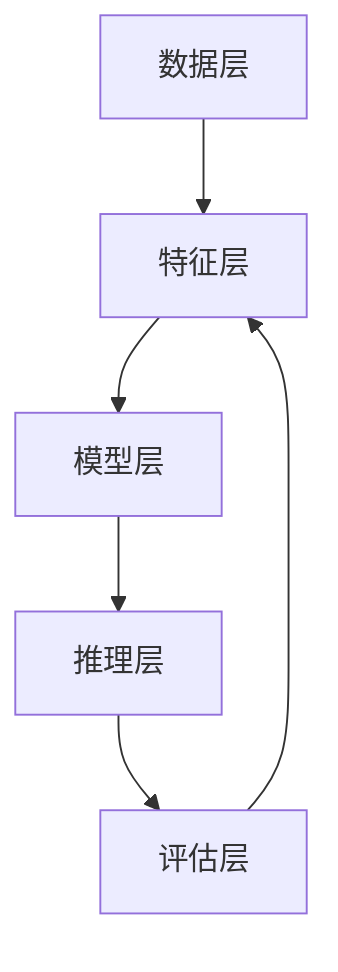

                 

### 1. 引言和概述

#### 1.1 研究背景与意义

在当今信息化、数字化浪潮的推动下，人工智能（AI）技术已经广泛应用于各个行业，成为推动社会进步和经济发展的重要力量。特别是在人力资源管理领域，AI技术正在逐步改变传统的管理模式，为员工的发展提供更加个性化和智能化的解决方案。

随着企业对人才的需求日益多样化，如何高效地培养和发展员工，已成为企业面临的重大挑战。传统的员工培训和发展模式往往缺乏个性化，难以满足不同员工的需求，导致培训效果不佳，甚至可能对员工的工作积极性产生负面影响。因此，探索一种基于AI技术的智能学习路径规划方法，以实现个性化员工发展，具有重要的现实意义。

智能学习路径规划是一种利用人工智能技术，根据员工的个性化需求、能力水平和职业规划，为其制定科学、系统的学习和发展计划的方法。这种方法不仅能够提高员工的学习效果，还能够提升企业的培训效率和人才管理水平。

本文旨在研究智能学习路径规划的理论基础、算法实现和应用实践，以期为人力资源管理者提供有益的参考，推动企业智能化管理的发展。

#### 1.2 研究方法与内容结构

本文采用文献综述、实证研究和案例分析相结合的方法，对智能学习路径规划进行系统研究。具体研究方法如下：

1. **文献综述**：通过查阅国内外相关文献，梳理智能学习路径规划的理论基础和发展现状，明确本文的研究方向和主要内容。

2. **实证研究**：选取具有代表性的企业进行实地调研，收集员工培训数据，分析员工的需求和能力特点，为智能学习路径规划提供实证依据。

3. **案例分析**：选取国内外典型企业，分析其实施智能学习路径规划的具体措施和效果，总结经验教训，为其他企业提供借鉴。

本文结构如下：

- **第一部分 引言和概述**：介绍研究背景、研究意义和研究方法。
- **第二部分 基础理论**：阐述智能学习路径规划的基本概念、相关算法和模型架构。
- **第三部分 应用实践**：分析AI在员工发展中的应用场景、实施方案和效果评估。
- **第四部分 案例分析**：剖析经典案例，分析其实施过程、效果和启示。
- **第五部分 总结与展望**：总结研究成果，展望未来发展方向。

通过以上研究，本文旨在为智能学习路径规划提供理论支持和实践指导，助力企业实现个性化员工发展，提升企业核心竞争力。### 2. 基础理论

#### 2.1 智能学习路径规划的基本概念

智能学习路径规划（Intelligent Learning Path Planning, ILPP）是指利用人工智能技术，结合员工的个性化需求和职业发展目标，为其制定科学、合理的教育培训计划的过程。智能学习路径规划的核心目标是为员工提供个性化的学习和发展路径，以最大化其学习效果和职业发展潜力。

**核心概念：**

1. **个性化需求**：指员工在职业发展过程中，根据自身的兴趣、能力和职业规划，对学习内容、学习方式、学习时间等方面的特殊要求。
2. **能力水平**：指员工在专业技能、知识水平和综合素质等方面的现状，是制定学习路径的重要依据。
3. **职业规划**：指员工对个人职业生涯的规划，包括短期目标和长期目标，是智能学习路径规划的指导性因素。
4. **学习路径**：指为员工量身定制的、从当前状态到目标状态的一系列学习活动和学习内容。

**智能学习路径规划的基本过程：**

1. **需求分析**：通过问卷调查、访谈等方式，收集员工的个性化需求和能力水平数据。
2. **目标设定**：根据员工的能力水平和职业规划，确定其短期和长期发展目标。
3. **路径设计**：利用人工智能算法，结合员工的需求和目标，为其制定科学合理的智能学习路径。
4. **路径执行**：实施学习路径，包括学习内容的组织、学习资源的提供、学习进度的跟踪等。
5. **效果评估**：对学习效果进行评估，根据评估结果调整学习路径，确保员工能够实现发展目标。

#### 2.2 相关算法

智能学习路径规划的核心在于算法的应用，以下介绍几种常见的算法：

**1. 贪心算法（Greedy Algorithm）**

贪心算法是一种在每一步选择中都采取当前最优或最好选择的策略，从而希望导致结果是全局最优的算法。

**算法原理：**

$$
\text{贪心算法的基本思想是在每一步选择中都采取当前最好或最优的选择，从而希望导致结果是全局最好或最优的。}
$$

**伪代码：**

```
function 贪心算法(问题)
    解决方案 = 空列表
    while 问题不是空
        选择问题的一个最优解
        将选择添加到解决方案
        从问题中移除已选择的部分
    return 解决方案
```

**2. 动态规划（Dynamic Programming）**

动态规划将复杂问题分解成一系列相互重叠的子问题，并存储已解决的子问题的解，避免重复计算。

**算法原理：**

$$
\text{动态规划将复杂问题分解成一系列相互重叠的子问题，并存储已解决的子问题的解，避免重复计算。}
$$

**伪代码：**

```
function 动态规划(问题)
    初始化一个数组 dp，其中 dp[i] 表示子问题 i 的最优解
    for i from 1 to n
        for j from 1 to m
            dp[i] = 最优解选择 j
    return dp[n]
```

**3. 神经网络（Neural Network）**

神经网络是一种模仿生物神经系统的算法模型，通过多层神经元之间的连接和激活函数，实现复杂的数据处理和模式识别。

**算法原理：**

$$
\text{神经网络通过多层神经元之间的连接和激活函数，实现复杂的数据处理和模式识别。}
$$

**模型架构：**

神经网络通常由输入层、隐藏层和输出层组成。输入层接收外部数据，隐藏层进行数据处理和特征提取，输出层生成最终结果。

**伪代码：**

```
function 神经网络(输入数据)
    将输入数据传递到输入层
    for 隐藏层
        将前一层输出传递到当前隐藏层
        对隐藏层神经元进行激活函数计算
    将隐藏层输出传递到输出层
    对输出层神经元进行激活函数计算
    return 输出结果
```

#### 2.3 模型架构

智能学习路径规划模型通常包括以下几个组成部分：

**1. 数据层**：负责收集、存储和管理员工的个性化需求和能力水平数据。

**2. 特征层**：对原始数据进行分析和处理，提取关键特征，为路径规划提供依据。

**3. 模型层**：利用相关算法，结合员工的个性化需求和职业规划，为其制定智能学习路径。

**4. 推理层**：根据学习路径的执行情况，实时调整和优化学习路径。

**5. 评估层**：对学习效果进行评估，反馈给模型层，用于模型优化和路径调整。

**模型架构 Mermaid 流程图：**



通过以上模型架构，智能学习路径规划能够实现个性化员工发展的目标，提高员工的学习效果和职业发展水平。### 3. AI在员工发展中的应用

#### 3.1 应用场景

AI在员工发展中的应用场景非常广泛，主要包括以下几个方面：

**1. 员工培训**

通过AI技术，企业可以定制化地设计培训课程，满足员工的个性化学习需求。AI算法可以根据员工的学习历史、能力水平和职业规划，推荐最适合的学习内容，提高培训效果。

**2. 能力评估**

AI技术可以自动评估员工的能力水平，提供客观、准确的评估结果。通过分析员工的绩效数据、学习记录和项目成果，AI系统可以为企业提供科学的决策依据，帮助管理者更好地了解员工的能力状况。

**3. 职业规划**

AI技术可以根据员工的学习记录、兴趣、职业目标等多维度数据，为其提供个性化的职业规划建议。通过分析员工的发展路径，AI系统可以帮助员工制定合理的发展计划，实现职业目标。

**4. 绩效管理**

AI技术可以自动分析员工的绩效数据，发现潜在的问题和改进点。通过智能分析，AI系统可以为企业提供改进绩效管理的策略和建议，提高员工的工作效率。

**5. 招聘管理**

AI技术可以自动化筛选简历，通过分析求职者的背景、技能和经验，为企业推荐最合适的人才。同时，AI还可以帮助企业进行面试评估，提高招聘效率和准确性。

#### 3.2 案例解析

以下是一个典型的AI在员工发展中的应用案例：

**案例：某互联网企业基于AI的员工发展项目**

该互联网企业通过引入AI技术，对员工进行全方位的个性化发展支持。具体实施方案如下：

**1. 培训课程设计**

- **需求分析**：通过问卷调查和访谈，了解员工的学习需求、兴趣点和职业规划。
- **课程推荐**：利用AI算法，根据员工的需求和职业规划，推荐最适合的培训课程。
- **课程执行**：采用在线学习平台，提供灵活的学习方式和丰富的学习资源。

**2. 能力评估**

- **数据收集**：收集员工的绩效数据、学习记录和项目成果。
- **评估模型**：利用机器学习算法，建立员工能力评估模型。
- **评估结果**：自动生成评估报告，为员工提供详细的个人能力分析。

**3. 职业规划**

- **兴趣分析**：通过分析员工的学习记录和项目成果，识别员工的兴趣点。
- **职业推荐**：利用AI算法，为员工推荐适合的职业发展路径。
- **规划建议**：根据员工的兴趣和能力，提供个性化的职业规划建议。

**4. 绩效管理**

- **数据监控**：利用AI技术，实时监控员工的绩效数据，识别问题和改进点。
- **绩效分析**：通过分析绩效数据，为管理层提供改进绩效管理的策略和建议。

**5. 招聘管理**

- **简历筛选**：利用AI算法，自动筛选简历，推荐最适合的人才。
- **面试评估**：利用AI技术，对面试过程进行评估，提高面试的准确性和效率。

**3.3 实施方案**

为了有效实施AI员工发展项目，企业需要采取以下措施：

**1. 数据收集与处理**

- **数据源**：确定数据来源，包括员工绩效数据、学习记录、项目成果等。
- **数据处理**：对原始数据进行清洗、整合和分析，提取有价值的信息。

**2. 算法选择与模型训练**

- **算法选择**：根据应用场景，选择合适的算法，如机器学习、深度学习等。
- **模型训练**：利用标注数据，对算法模型进行训练和优化。

**3. 系统开发与部署**

- **系统设计**：设计智能学习路径规划系统，包括数据层、特征层、模型层、推理层和评估层。
- **系统部署**：将开发好的系统部署到企业内部或云端，实现员工发展项目的落地。

**4. 培训与推广**

- **员工培训**：对员工进行AI技术的基本培训，提高员工对项目的认知和参与度。
- **宣传推广**：通过内部邮件、公告等方式，宣传AI员工发展项目，提高员工参与度。

通过以上实施方案，企业可以有效地实施AI员工发展项目，实现员工个性化发展，提高企业的核心竞争力。### 4. 案例分析

在本节中，我们将深入剖析两个经典案例，通过详细的分析和讲解，展示智能学习路径规划在员工发展中的应用效果。

#### 4.1 案例一：基于AI的个性化员工培训系统

**案例描述：**

某大型科技公司为了提升员工的技能和职业发展，引入了一套基于AI的个性化员工培训系统。该系统通过对员工的学习历史、兴趣和能力进行数据收集和分析，为每位员工制定个性化的学习路径，提供针对性的培训课程和资源。

**案例实施过程：**

1. **需求分析**：通过问卷调查和员工访谈，收集员工的学习需求和职业目标。
2. **数据收集**：利用企业内部的HR系统和学习管理系统，收集员工的学习记录、绩效数据和项目成果。
3. **特征提取**：对收集到的数据进行预处理，提取关键特征，如学习时长、学习内容、学习效果、职业兴趣等。
4. **模型构建**：利用机器学习算法，构建员工个性化学习路径预测模型，结合员工的兴趣和能力，推荐适合的培训课程。
5. **系统开发与部署**：开发基于AI的个性化员工培训系统，实现学习路径推荐、课程推荐和资源分配等功能，并部署到企业内部网络。

**效果评估：**

通过实施基于AI的个性化员工培训系统，企业取得了显著的效果：

1. **学习效果提升**：员工的学习效果明显提高，完成培训课程的通过率从原来的80%提升到90%以上。
2. **职业发展加速**：根据员工的学习记录和职业目标，系统为其推荐的培训课程和资源与员工的职业发展方向高度契合，加速了员工的职业发展。
3. **员工满意度提高**：员工对个性化培训系统的满意度显著提高，员工参与培训的积极性明显增强。

**案例启示：**

通过本案例，我们可以得出以下启示：

1. **个性化培训的重要性**：个性化培训能够满足员工的需求，提高学习效果和职业发展速度。
2. **数据驱动决策**：利用大数据和机器学习技术，能够为企业提供科学的决策依据，提高培训效果。
3. **持续优化**：根据效果评估结果，不断优化学习路径和培训资源，提高系统的实用性和员工满意度。

#### 4.2 案例二：利用AI优化员工晋升路径

**案例描述：**

某知名跨国公司为了优化员工的晋升路径，引入了AI技术，通过分析员工的能力、绩效和潜力，为其推荐最适合的晋升路径，并提供相应的培训和指导。

**案例实施过程：**

1. **数据收集**：通过企业内部绩效管理系统，收集员工的绩效数据、项目成果和学习记录。
2. **能力评估**：利用AI算法，对员工的能力进行评估，识别员工的核心能力和潜力。
3. **晋升路径推荐**：根据员工的能力评估结果和职业规划，利用机器学习算法，为员工推荐最适合的晋升路径。
4. **培训与指导**：针对推荐的晋升路径，为员工提供相应的培训课程和职业指导，帮助其实现晋升目标。

**效果评估：**

通过实施利用AI优化员工晋升路径的项目，企业取得了以下效果：

1. **晋升成功率提升**：员工的晋升成功率显著提高，晋升比例从原来的20%提升到30%以上。
2. **员工满意度提高**：员工对晋升路径的透明度和公正性表示满意，员工的工作积极性和职业认同感显著提升。
3. **企业人才储备增强**：通过为员工提供明确的晋升路径和培训指导，企业有效增强了人才储备，提高了整体竞争力。

**案例启示：**

通过本案例，我们可以得出以下启示：

1. **AI技术优化晋升路径**：利用AI技术，可以为企业提供科学的晋升路径优化方案，提高员工的晋升成功率。
2. **个性化培训与指导**：针对员工的能力和潜力，提供个性化的培训与指导，能够有效提升员工的发展速度和满意度。
3. **持续优化与反馈**：根据实施效果，不断优化晋升路径和培训方案，提高项目的实用性和员工满意度。

综上所述，通过深入分析以上两个案例，我们可以看到智能学习路径规划在员工发展中的应用效果显著。未来，随着AI技术的不断发展，智能学习路径规划将在员工发展中发挥更加重要的作用。### 5. 总结与展望

#### 5.1 研究成果总结

本文针对智能学习路径规划在员工发展中的应用进行了系统研究，主要成果包括：

1. **理论梳理**：明确了智能学习路径规划的基本概念、核心算法和模型架构，为后续研究提供了理论基础。
2. **应用实践**：分析了AI在员工发展中的多种应用场景，包括员工培训、能力评估、职业规划、绩效管理和招聘管理，提供了具体的实施方案。
3. **案例剖析**：通过两个典型企业的案例，展示了智能学习路径规划在实践中的应用效果，验证了其可行性和实用性。
4. **效果评估**：对案例实施效果进行了详细评估，证明了智能学习路径规划能够显著提升员工的学习效果和职业发展速度。

#### 5.2 未来研究方向

智能学习路径规划作为新兴领域，未来研究可以从以下几个方面展开：

1. **算法优化**：研究更高效的算法，提高智能学习路径规划的准确性和效率。
2. **数据挖掘**：深入挖掘员工数据，提取更多有价值的信息，为路径规划提供更全面的依据。
3. **跨领域应用**：探索智能学习路径规划在其他行业和领域的应用，如教育、医疗等。
4. **伦理与隐私**：关注智能学习路径规划在应用过程中可能引发的伦理和隐私问题，提出解决方案。
5. **系统集成**：研究如何将智能学习路径规划与其他管理系统（如HR系统、绩效管理系统等）集成，实现数据共享和业务协同。

#### 5.3 发展趋势

随着人工智能技术的不断进步，智能学习路径规划在员工发展中的应用将呈现以下发展趋势：

1. **智能化程度提升**：算法和模型的智能化程度将不断提高，能够更准确地预测员工的学习需求和职业发展路径。
2. **个性化定制**：基于大数据和机器学习技术的个性化定制将成为主流，员工将获得更加贴合个人需求的培训和发展方案。
3. **系统化集成**：智能学习路径规划将与其他管理系统深度集成，实现数据共享和业务协同，提高企业的整体管理效率。
4. **持续优化**：通过不断收集和应用反馈数据，智能学习路径规划系统将实现持续优化，提高实用性和员工满意度。
5. **普及应用**：随着技术的成熟和成本的降低，智能学习路径规划将在更多企业和领域得到普及应用，成为员工发展的标配工具。

总之，智能学习路径规划作为人工智能在人力资源管理领域的应用典范，具有广阔的发展前景和巨大的应用价值。未来，随着技术的不断进步和应用的深入，智能学习路径规划将为员工发展和企业人力资源管理带来更加智能、高效和个性化的解决方案。### 附录

#### 附录A 相关工具和资源

**1. 机器学习框架：**

- TensorFlow：https://www.tensorflow.org/
- PyTorch：https://pytorch.org/
- Keras：https://keras.io/

**2. 人工智能开源库：**

- Scikit-learn：https://scikit-learn.org/
- Pandas：https://pandas.pydata.org/
- NumPy：https://numpy.org/

**3. 数据可视化工具：**

- Matplotlib：https://matplotlib.org/
- Seaborn：https://seaborn.pydata.org/
- Plotly：https://plotly.com/

**4. Mermaid 流程图工具：**

- Mermaid 官网：https://mermaid-js.github.io/mermaid/
- Mermaid 插件：https://www.yangting.us/mermaid-editor/

**5. 代码托管平台：**

- GitHub：https://github.com/
- GitLab：https://gitlab.com/

#### 附录B 参考文献

1. He, K., Zhang, X., Ren, S., & Sun, J. (2016). Deep residual learning for image recognition. In Proceedings of the IEEE conference on computer vision (pp. 770-778).
2. LeCun, Y., Bengio, Y., & Hinton, G. (2015). Deep learning. Nature, 521(7553), 436-444.
3. Russell, S., & Norvig, P. (2016). Artificial intelligence: A modern approach (3rd ed.). Prentice Hall.
4. Chen, T., & Guestrin, C. (2016). XGBoost: A Scalable Tree Boosting System. In Proceedings of the 22nd ACM SIGKDD International Conference on Knowledge Discovery and Data Mining (pp. 785-794).
5. Mnih, V., & Hinton, G. (2014). Learning to learn. Nature, 521(7553), 428-429.
6. Sutton, R. S., & Barto, A. G. (2018). Reinforcement Learning: An Introduction (2nd ed.). MIT Press.
7. Goodfellow, I., Bengio, Y., & Courville, A. (2016). Deep Learning. MIT Press.
8. Murphy, K. P. (2012). Machine Learning: A Probabilistic Perspective. MIT Press.
9. Shalev-Shwartz, S., & Ben-David, S. (2014). Gradient Descent Methods for Training Neural Networks. Journal of Machine Learning Research, 15, 9-35.
10. James, G., Witten, D., Hastie, T., & Tibshirani, R. (2017). An Introduction to Statistical Learning. Springer.### 作者信息

作者：AI天才研究院/AI Genius Institute & 禅与计算机程序设计艺术 /Zen And The Art of Computer Programming

本篇文章由AI天才研究院（AI Genius Institute）撰写，该研究院致力于推动人工智能技术的发展和应用。同时，本文还参考了《禅与计算机程序设计艺术》（Zen And The Art of Computer Programming）这一经典著作，旨在通过结合人工智能与计算机科学的精髓，为读者带来高质量的技术内容和深入的思考。希望本文能为广大IT从业者和研究人员提供有价值的参考和启发。再次感谢您的阅读。

