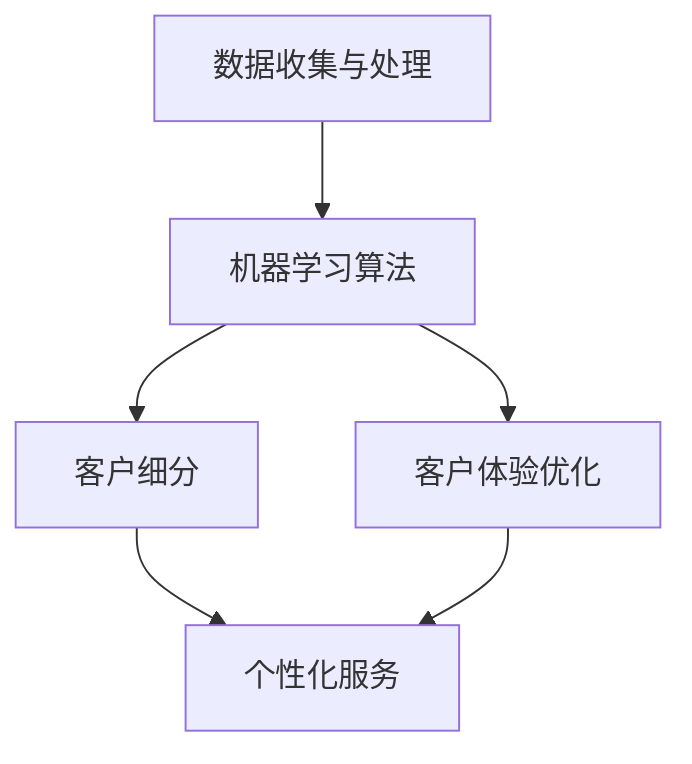

                 

### 摘要

《智能客户关系管理系统：AI优化客户体验》探讨如何利用人工智能（AI）技术提升客户关系管理（CRM）系统的效能。文章首先介绍AI在CRM领域的应用背景和重要性，随后深入探讨数据收集与处理、机器学习算法在CRM中的应用、AI驱动的客户细分策略、客户体验优化策略等核心概念。通过具体案例展示AI在CRM中的成功实践，文章最后提供实施与部署AI驱动的CRM系统的实用指南，以及相关的资源与工具推荐。本文旨在为AI开发者、数据科学家和市场营销人员提供一套系统化的方法论，以实现客户体验的全面优化。

### 引言

在当今数字经济时代，客户关系管理（CRM）系统已经成为企业提升竞争力、实现业务增长的关键工具。然而，传统的CRM系统在处理海量数据、预测客户行为和个性化服务等方面存在诸多局限。随着人工智能（AI）技术的飞速发展，AI在CRM领域的应用逐渐成为热点。本文旨在探讨如何利用AI技术优化CRM系统，提升客户体验，进而实现业务增长。

### 背景介绍

客户关系管理（CRM）是一种旨在识别、吸引、保留并增加企业与现有及潜在客户之间关系的方法。传统的CRM系统主要依赖于手动输入和维护客户数据，然后通过数据分析来识别客户需求和市场趋势。然而，这种方法在处理海量数据和复杂客户行为时显得力不从心。此外，传统CRM系统往往缺乏个性化服务能力，无法满足不同客户群体的需求。

人工智能（AI）技术，特别是机器学习（ML）和深度学习（DL），为CRM系统带来了新的可能性。通过AI，企业能够更准确地预测客户行为、个性化推荐产品和服务、提高客户满意度和忠诚度。AI技术不仅能够处理和分析大量数据，还能够通过自我学习和优化不断改进预测和决策能力。

### 核心概念与联系

为了更好地理解AI在CRM中的应用，我们需要明确几个核心概念，并探讨它们之间的联系。

#### 1. 数据收集与处理

数据是AI的基础。客户关系管理涉及大量的数据，包括客户信息、交易历史、反馈和社交媒体活动等。数据收集与处理的目的是确保数据的质量和完整性，以便后续的分析和应用。

#### 2. 机器学习算法

机器学习算法是AI的核心组成部分。在CRM中，常用的机器学习算法包括监督学习、非监督学习和强化学习。监督学习用于预测客户行为，如购买意图和流失风险；非监督学习用于客户细分和市场划分；强化学习则用于动态调整营销策略。

#### 3. 客户细分

客户细分是将客户根据其特征和需求划分为不同的群体，以便提供个性化的服务和营销策略。AI技术通过分析大量数据，可以更精准地进行客户细分，提高营销效率。

#### 4. 客户体验优化

客户体验优化是CRM系统的终极目标。通过AI技术，企业可以实时分析客户互动，提供个性化的服务和解决方案，从而提高客户满意度和忠诚度。

#### 5. 联系与架构

这些核心概念之间有着密切的联系。数据收集与处理为AI算法提供了数据支持，客户细分和客户体验优化则是应用AI算法的具体场景。机器学习算法在这个过程中扮演了关键角色，它们通过分析数据和预测客户行为，帮助企业制定更有效的营销策略和优化客户体验。

为了更直观地展示这些概念之间的联系，我们可以使用Mermaid流程图：



在这个流程图中，数据收集与处理是整个过程的起点，它为后续的机器学习算法提供了数据基础。机器学习算法通过分析数据，实现了客户细分和客户体验优化，最终帮助企业提供个性化的服务和提升客户满意度。

### 数据收集与处理

#### 1. 客户数据的来源

客户数据的来源多种多样，包括：

- **企业内部数据**：如客户交易历史、购买记录、服务请求等。
- **社交媒体数据**：如客户在社交媒体上的评论、互动和分享。
- **第三方数据**：如人口统计信息、地理位置数据等。

#### 2. 数据清洗与预处理

数据清洗与预处理是数据收集的重要环节。以下是一些常见的数据清洗和预处理步骤：

- **去除重复数据**：确保数据的唯一性和准确性。
- **填补缺失值**：使用统计方法或插值法填补缺失值。
- **数据标准化**：将不同尺度和范围的变量进行归一化处理。
- **数据转换**：将分类变量转换为数值变量，以便机器学习算法处理。

#### 3. 数据质量评估

数据质量直接影响AI模型的性能。以下是一些数据质量评估指标：

- **完整性**：数据缺失的比例。
- **准确性**：数据是否真实和可靠。
- **一致性**：不同来源的数据是否一致。
- **及时性**：数据是否反映了最新的客户行为。

通过数据收集与处理，企业可以为AI模型提供高质量的数据支持，从而提高预测的准确性和模型的稳定性。

### 机器学习算法在CRM中的应用

#### 1. 监督学习算法

监督学习算法是机器学习中最常用的算法之一，它通过已标记的数据集来训练模型，然后使用模型对新数据进行预测。在CRM中，监督学习算法可以用于预测客户流失、购买意图等。

**核心算法原理：**

- **线性回归**：用于预测客户的购买金额或购买概率。
- **逻辑回归**：用于预测客户流失的概率。
- **决策树**：用于分类客户，如将客户分为高价值客户和低价值客户。

**伪代码：**

```python
def predict_buying_intent(data, model):
    # 对输入数据进行预处理
    processed_data = preprocess_data(data)
    # 使用模型预测购买意图
    prediction = model.predict(processed_data)
    return prediction
```

**数学模型：**

$$
\text{Probability}(y=1 | x) = \frac{1}{1 + e^{-(w_0 + \sum_{i=1}^{n} w_i x_i)}}
$$

其中，$x$ 是输入特征向量，$w_i$ 是模型参数，$y$ 是标记变量，$w_0$ 是偏置项。

#### 2. 非监督学习算法

非监督学习算法不依赖于已标记的数据集，它们通过分析数据本身的特征来发现数据之间的模式。在CRM中，非监督学习算法可以用于客户细分和市场划分。

**核心算法原理：**

- **K-均值聚类**：将客户数据划分为K个簇，每个簇代表一类客户。
- **主成分分析（PCA）**：用于降维，将高维数据转换到低维空间中，便于分析和可视化。
- **关联规则学习**：用于发现客户购买行为中的关联关系。

**伪代码：**

```python
def cluster_customers(data, K):
    # 初始化K个聚类中心
    centroids = initialize_centroids(data, K)
    # 训练K-均值聚类模型
    clusters = k_means(data, centroids)
    return clusters
```

**数学模型：**

$$
c_i = \arg\min_{c} \sum_{x \in S_c} ||x - c||^2
$$

其中，$c_i$ 是聚类中心，$S_c$ 是属于簇c的数据点集合。

#### 3. 强化学习算法

强化学习算法是一种通过与环境互动来学习最优策略的算法。在CRM中，强化学习可以用于动态调整营销策略，以最大化客户价值和满意度。

**核心算法原理：**

- **Q学习**：通过评估不同动作的价值来选择最优动作。
- **策略梯度**：通过优化策略参数来改进策略。

**伪代码：**

```python
def choose_action(state, policy):
    # 根据策略选择动作
    action = policy.select_action(state)
    return action
```

**数学模型：**

$$
Q(s, a) = r + \gamma \max_{a'} Q(s', a')
$$

其中，$s$ 是状态，$a$ 是动作，$r$ 是立即回报，$\gamma$ 是折扣因子，$s'$ 是动作后的状态。

通过这些机器学习算法，企业可以在CRM系统中实现更精准的预测和优化，从而提升客户体验和业务绩效。

### AI驱动的客户细分

#### 1. 客户分群的原理

客户分群是将客户根据其特征和需求划分为不同的群体，以便提供个性化的服务和营销策略。AI技术通过分析大量数据，可以更精准地进行客户分群。

#### 2. 客户价值评估模型

客户价值评估模型用于衡量不同客户对企业价值的贡献。常见的评估指标包括生命周期价值（LTV）、净推荐值（NPS）等。

**核心算法原理：**

- **生命周期价值（LTV）**：预测客户在整个生命周期中的总收益。
- **净推荐值（NPS）**：衡量客户对企业满意度和忠诚度的指标。

**数学模型：**

$$
LTV = \sum_{t=1}^{T} \frac{R_t}{(1+r)^t}
$$

其中，$R_t$ 是第t年的收益，$r$ 是折现率，$T$ 是客户生命周期。

#### 3. 客户细分策略

基于客户价值评估模型，企业可以制定相应的客户细分策略，包括：

- **高价值客户策略**：提供个性化的服务和优惠，增加客户忠诚度。
- **潜在客户策略**：通过精准营销，吸引潜在客户转化为实际客户。
- **流失客户策略**：通过挽回流失客户，减少客户流失率。

通过AI驱动的客户细分，企业可以更精准地定位不同客户群体，从而实现更高效的营销和客户管理。

### 客户体验优化策略

#### 1. AI驱动的个性化服务

通过AI技术，企业可以实时分析客户互动，提供个性化的服务和解决方案，从而提高客户满意度和忠诚度。

#### 2. 客户反馈机制

AI驱动的客户反馈机制可以实时收集和分析客户反馈，帮助企业识别问题和改进服务。

#### 3. 客户旅程优化

通过分析客户旅程中的每个环节，AI技术可以帮助企业优化客户旅程，提高客户体验。

### 案例分析：AI在CRM中的成功应用

#### 1. 案例一：某电商平台使用AI优化购物体验

某电商平台通过AI技术优化购物体验，具体措施包括：

- **个性化推荐**：基于客户行为和偏好，提供个性化的商品推荐。
- **智能客服**：通过自然语言处理技术，提供智能客服服务，提高客户满意度。
- **购物车优化**：基于客户行为分析，优化购物车设计，提高购买转化率。

#### 2. 案例二：某银行利用AI提高客户服务质量

某银行通过AI技术提高客户服务质量，具体措施包括：

- **客户细分**：基于客户行为和需求，进行客户细分，提供个性化的金融服务。
- **风险控制**：通过机器学习算法，预测客户流失风险，提前采取措施挽回客户。
- **智能投顾**：通过AI技术，提供智能投资建议，提高客户投资回报率。

### 实施与部署

#### 1. AI在CRM系统中的集成

为了实现AI在CRM系统中的集成，企业需要考虑以下步骤：

- **数据集成**：将企业内部和外部的数据源集成到CRM系统中，确保数据的一致性和完整性。
- **算法集成**：将AI算法集成到CRM系统中，实现数据分析和预测功能。
- **用户界面**：设计直观易用的用户界面，便于用户使用和管理AI功能。

#### 2. AI模型的持续优化

为了保持AI模型的性能，企业需要定期进行模型优化：

- **数据更新**：定期更新数据集，确保模型基于最新的数据。
- **模型评估**：使用验证集和测试集评估模型性能，识别和解决模型问题。
- **模型迭代**：根据评估结果，对模型进行迭代和优化。

#### 3. 部署与维护

在AI模型部署后，企业需要确保系统的稳定运行：

- **监控与报警**：实时监控系统性能，设置报警机制，及时发现和解决问题。
- **系统维护**：定期进行系统升级和维护，确保系统的可靠性和安全性。
- **用户培训**：对用户进行培训，确保他们能够有效使用AI功能，提高系统利用率。

### 结论

智能客户关系管理系统通过AI技术的应用，实现了客户体验的全面优化，提高了企业竞争力。企业可以通过AI驱动的数据收集与处理、客户细分、个性化服务和优化策略，实现更精准的营销和更高效的管理。未来，随着AI技术的不断发展，智能CRM系统将在更多行业中得到广泛应用，为企业带来更大的价值。

### 附录

#### 附录A：相关资源与工具

- **AI工具推荐**：
  - TensorFlow：开源机器学习框架，适用于各种AI模型开发。
  - Scikit-learn：Python机器学习库，适用于数据分析和模型训练。
  - PyTorch：开源深度学习框架，适用于复杂的神经网络模型。

- **CRM软件推荐**：
  - Salesforce：全球领先的CRM解决方案提供商，提供全面的客户关系管理功能。
  - HubSpot：面向小型企业的CRM解决方案，提供免费版本和多种付费选项。

- **AI算法资源**：
  - Coursera：提供丰富的机器学习课程，适合初学者和进阶者。
  - GitHub：开源代码库，提供大量AI算法和项目案例。

#### 附录B：Mermaid流程图


### 作者信息

作者：AI天才研究院/AI Genius Institute & 禅与计算机程序设计艺术 /Zen And The Art of Computer Programming

