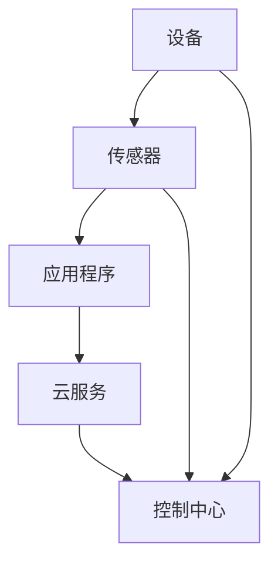

                 


### 第1章 引言

#### 1.1 智能家居生态系统概述

智能家居生态系统是由各种设备、传感器、应用程序和云服务组成的一个网络，旨在提高家庭生活的便利性和舒适性。以下是对智能家居生态系统核心组成部分的概述：

1. **设备**：智能家居设备包括智能灯泡、智能插座、智能门锁、智能摄像头、智能恒温器等。这些设备通过无线通信协议（如Wi-Fi、蓝牙、Zigbee等）连接到互联网，实现远程控制和自动化。

2. **传感器**：传感器是智能家居系统的感知器官，它们可以检测环境变化，如温度、湿度、光照、声音、运动等，并将这些信息传输到控制系统。

3. **应用程序**：智能家居应用程序是用户与系统交互的界面。用户可以通过手机、平板电脑或电脑上的应用程序来控制和管理智能家居设备。

4. **云服务**：云服务提供数据存储、处理和分析功能。智能家居设备收集的数据可以被上传到云，以便进行更复杂的分析和决策。

5. **控制中心**：控制中心是智能家居系统的核心，它负责协调和管理各个设备和传感器的工作。控制中心可以是中央控制台、智能音箱或其他智能设备。

#### 1.2 安全与隐私保护的重要性

随着智能家居系统的普及，安全与隐私保护问题日益突出。以下是智能家居生态系统面临的主要安全威胁和隐私泄露风险：

1. **设备被黑客攻击**：黑客可以通过远程攻击智能家居设备，窃取用户信息或控制设备。

2. **用户隐私泄露**：智能家居设备收集了大量用户数据，包括日常活动、个人习惯等，这些数据如果被不法分子获取，可能会造成隐私泄露。

3. **数据篡改与丢失**：恶意攻击者可能篡改智能家居设备收集的数据，或通过网络攻击导致数据丢失。

4. **安全漏洞**：智能家居设备可能存在安全漏洞，如默认密码、过时软件等，这些漏洞可能被黑客利用。

为了保障智能家居生态系统的安全与隐私，必须采取有效的安全与隐私保护措施。这不仅关系到用户的信息安全，也关系到智能家居行业的可持续发展。

### 核心概念与联系

智能家居生态系统的核心概念包括设备、传感器、应用程序、云服务和控制中心。这些概念之间的关系可以用以下 Mermaid 流程图来表示：



在智能家居生态系统中，设备通过传感器收集数据，并将数据发送到应用程序。应用程序通过云服务进行数据处理和分析，然后将结果反馈给控制中心，控制中心再根据分析结果控制设备。这种数据流转过程体现了智能家居系统的核心工作原理。

### 总结

本章介绍了智能家居生态系统的概念和发展历程，以及安全与隐私保护的重要性。通过 Mermaid 流程图展示了智能家居生态系统的核心概念和它们之间的关系。下一章将深入探讨智能家居生态系统的安全架构。

### 摘要

本文引言部分介绍了智能家居生态系统的概念、组成部分以及安全与隐私保护的重要性。通过 Mermaid 流程图展示了智能家居生态系统的核心概念和关系，为后续章节的深入探讨奠定了基础。未来章节将详细分析智能家居生态系统的安全架构和防护措施。文章结尾将总结全文内容，并对未来发展进行展望。关键字：智能家居、生态系统、安全、隐私保护。

### 第2章 智能家居生态系统安全架构

本章将深入探讨智能家居生态系统的安全架构，包括安全架构概述、安全层次结构和安全机制与策略。通过这些内容，我们将构建一个全面的智能家居安全框架，以保障系统的安全性和可靠性。

#### 2.1 安全架构概述

智能家居生态系统的安全架构是确保系统安全性的基础。安全架构的设计遵循以下几个基本原则：

1. **完整性**：确保系统的数据在传输和存储过程中不被篡改。
2. **保密性**：保护系统数据不被未经授权的第三方获取。
3. **可用性**：确保系统在遭受攻击时仍然能够正常运行。
4. **可审计性**：记录系统操作历史，以便在发生安全事件时进行审计和追溯。

安全架构的组成要素包括：

1. **硬件安全**：确保硬件设备在设计和制造过程中符合安全标准。
2. **软件安全**：通过安全编程和软件更新来保护软件系统的安全性。
3. **网络安全**：保护网络通信和数据传输的安全性。
4. **数据安全**：确保存储在系统中的数据安全。
5. **安全监控**：实时监控系统的安全状态，及时发现和响应安全事件。

#### 2.2 安全层次结构

智能家居生态系统的安全层次结构可以分为以下几层：

1. **硬件安全层次**：
   - **设备安全设计**：采用安全芯片、安全启动等硬件安全措施。
   - **物理安全**：保护硬件设备不受物理攻击，如窃取、破坏等。

2. **软件安全层次**：
   - **操作系统安全**：使用安全的操作系统，如Linux内核，并进行安全加固。
   - **应用程序安全**：通过安全编程和代码审查来提高应用程序的安全性。

3. **网络安全层次**：
   - **网络安全协议**：采用加密协议（如SSL/TLS）保护网络通信。
   - **防火墙**：部署防火墙来阻止未授权的访问。

4. **数据安全层次**：
   - **数据加密**：对传输和存储的数据进行加密，防止数据泄露。
   - **访问控制**：限制对数据的访问，确保只有授权用户可以访问。

#### 2.3 安全机制与策略

为了保障智能家居生态系统的安全性，需要采用一系列安全机制和策略：

1. **加密技术**：
   - **对称加密**：如AES，用于加密和解密数据。
   - **非对称加密**：如RSA，用于数字签名和密钥交换。

2. **认证与授权**：
   - **用户认证**：通过密码、生物识别等方式验证用户身份。
   - **权限管理**：根据用户身份和角色分配相应的权限。

3. **访问控制**：
   - **基于角色的访问控制（RBAC）**：根据用户角色分配访问权限。
   - **基于属性的访问控制（ABAC）**：根据用户的属性（如时间、地点）来控制访问。

4. **安全审计与监控**：
   - **日志记录**：记录系统操作日志，以便审计和追踪。
   - **实时监控**：通过安全监控工具实时监测系统安全状态。

#### 总结

本章介绍了智能家居生态系统安全架构的概述、安全层次结构和安全机制与策略。通过构建一个全面的安全框架，我们可以有效地保护智能家居系统的安全性和隐私。下一章将深入探讨智能家居设备的安全防护措施。

### 摘要

本章深入分析了智能家居生态系统的安全架构，包括安全架构的基本原则、安全层次结构和安全机制与策略。通过详细的讲解和示例，读者可以理解如何构建一个安全的智能家居系统。关键字：智能家居、安全架构、安全层次、安全机制。

### 第3章 智能家居设备安全防护

随着智能家居设备的普及，其安全防护问题也越来越受到关注。本章将重点探讨智能家居设备的安全防护措施，包括设备安全概述、硬件安全防护和软件安全防护。通过这些措施，我们可以有效地保护智能家居设备免受各种安全威胁。

#### 3.1 设备安全概述

智能家居设备的安全防护是智能家居生态系统安全的重要组成部分。设备安全涉及硬件和软件两个方面，主要包括以下几个方面：

1. **硬件安全**：确保设备在设计和制造过程中具备足够的安全性，如采用安全芯片、安全启动等。
2. **软件安全**：确保设备运行的应用程序没有安全漏洞，如通过安全编程和代码审计来提高应用程序的安全性。
3. **通信安全**：确保设备在通信过程中采用加密技术，如SSL/TLS等，防止数据泄露。
4. **更新和补丁**：及时更新设备的固件和软件，修补已知的安全漏洞。

智能家居设备面临的主要安全威胁包括：

1. **设备被黑客攻击**：黑客可以通过网络攻击控制设备，窃取用户信息或干扰设备正常工作。
2. **设备被恶意软件感染**：设备可能被恶意软件感染，导致设备无法正常工作或泄露用户信息。
3. **设备物理损坏**：设备可能遭受物理攻击，如窃取、破坏等。

#### 3.2 硬件安全防护

硬件安全防护是确保智能家居设备安全的基础。以下是一些常见的硬件安全防护措施：

1. **安全芯片**：采用安全芯片来存储敏感信息，如用户密码、加密密钥等，确保信息的安全性。
2. **安全启动**：确保设备在启动过程中遵循安全引导流程，防止恶意软件在设备启动时加载。
3. **物理防护**：为设备提供物理防护措施，如使用安全外壳、防水、防尘等，防止设备遭受物理攻击。
4. **加密硬件模块**：在设备中集成加密硬件模块，如安全存储、加密加速器等，提高数据加密和解密的速度和安全性。

#### 3.3 软件安全防护

软件安全防护是确保智能家居设备安全的重要手段。以下是一些常见的软件安全防护措施：

1. **安全编程**：在开发过程中遵循安全编程规范，避免常见的编程错误，如缓冲区溢出、SQL注入等。
2. **代码审计**：对应用程序的源代码进行审计，发现并修复潜在的安全漏洞。
3. **安全更新**：定期发布安全更新，修补已知的安全漏洞。
4. **安全认证**：对设备进行安全认证，确保设备符合安全标准，如Common Criteria等。
5. **隔离和沙箱技术**：采用隔离和沙箱技术，限制应用程序的权限和访问范围，防止恶意代码对系统造成破坏。

#### 总结

本章介绍了智能家居设备的安全防护措施，包括硬件安全防护和软件安全防护。通过这些措施，我们可以有效地保护智能家居设备免受各种安全威胁。下一章将探讨网络安全与隐私保护技术。

### 摘要

本章详细介绍了智能家居设备的安全防护措施，包括硬件安全防护和软件安全防护。通过这些措施，我们可以保障智能家居设备的安全性和隐私。关键字：智能家居、设备安全、硬件安全、软件安全。

### 第4章 网络安全与隐私保护

随着智能家居设备的广泛应用，网络安全与隐私保护成为至关重要的议题。本章将深入探讨网络安全与隐私保护技术，包括网络安全防护技术、隐私保护技术和相关法律法规。通过这些内容，我们将构建一个全面的网络安全与隐私保护框架，以保障智能家居生态系统的安全性和用户的隐私。

#### 4.1 网络安全概述

网络安全是保护网络环境免受未经授权的访问、数据泄露、破坏和其他威胁的措施。对于智能家居生态系统，网络安全主要包括以下几个方面：

1. **网络访问控制**：限制只有授权用户才能访问网络资源。
2. **数据传输加密**：确保在传输过程中数据不被窃取或篡改。
3. **网络隔离**：通过隔离措施，防止恶意流量进入网络。
4. **入侵检测和防御**：实时监测网络活动，识别并阻止攻击。

#### 4.2 网络安全防护技术

为了确保智能家居网络的安全，我们可以采用以下几种技术：

1. **防火墙**：防火墙是一种网络安全设备，用于监控和控制进出网络的流量。通过设置规则，防火墙可以阻止未授权的访问和恶意流量。

   ```mermaid
   graph TD
   A[外部网络] --> B[防火墙]
   B --> C[内部网络]
   ```

2. **虚拟专用网络（VPN）**：VPN通过加密通信，保护数据在公共网络上的传输。VPN可以将远程设备连接到私有网络，确保数据的安全性。

3. **入侵检测系统（IDS）**：IDS用于实时监控网络活动，识别潜在的安全威胁。当检测到异常行为时，IDS会发出警报，并采取相应措施。

4. **入侵防御系统（IPS）**：IPS是IDS的高级形式，不仅检测威胁，还可以自动采取措施阻止攻击。IPS通常结合防火墙和IDS的功能。

5. **防病毒软件**：防病毒软件用于检测和清除恶意软件，保护设备免受病毒和恶意程序的侵害。

#### 4.3 隐私保护技术

隐私保护技术旨在确保用户数据的安全和保密性。以下是一些常用的隐私保护技术：

1. **数据加密**：通过加密技术，将敏感数据转换为只有授权用户才能解密的格式。常见的加密算法包括AES、RSA等。

2. **数据脱敏**：对敏感数据进行部分隐藏或替换，以保护其真实内容。常用的脱敏技术包括数据掩码、数据随机化等。

3. **差分隐私**：差分隐私通过在数据处理过程中引入随机性，确保单个用户数据无法被识别，从而保护用户隐私。

4. **同态加密**：同态加密允许在加密数据上进行计算，而不需要解密。这种技术可以确保数据在计算过程中的安全性。

#### 4.4 法律法规与隐私保护

为了规范智能家居生态系统的隐私保护，各国制定了相关的法律法规。以下是一些关键的法律条款和法规：

1. **通用数据保护条例（GDPR）**：GDPR是欧盟制定的数据保护法律，旨在保护欧盟公民的个人数据。GDPR规定了数据处理者的责任和数据主体的权利。

2. **加州消费者隐私法案（CCPA）**：CCPA是加利福尼亚州制定的数据保护法律，旨在加强消费者对其个人信息的控制权。

3. **网络安全法**：许多国家制定了网络安全法，规定了网络运营者的安全责任和用户隐私保护措施。

#### 总结

本章详细介绍了网络安全与隐私保护技术，包括防火墙、VPN、IDS/IPS、防病毒软件等网络安全技术，以及数据加密、数据脱敏、差分隐私、同态加密等隐私保护技术。此外，还介绍了相关的法律法规，为智能家居生态系统的安全与隐私保护提供了法律依据。下一章将探讨数据安全与隐私保护政策与法规。

### 摘要

本章全面阐述了网络安全与隐私保护技术，包括防火墙、VPN、IDS/IPS、防病毒软件等网络安全技术，以及数据加密、数据脱敏、差分隐私、同态加密等隐私保护技术。同时，还介绍了相关的法律法规，为智能家居生态系统的安全与隐私保护提供了全面的框架。关键字：网络安全、隐私保护、法律法规。

### 第5章 数据安全与隐私保护

数据安全与隐私保护是智能家居生态系统安全的核心议题之一。本章将深入探讨数据安全与隐私保护的技术、政策和法规，以及在实际应用中如何实施这些措施。通过这些内容，我们将为智能家居生态系统构建一个坚实的数据安全与隐私保护体系。

#### 5.1 数据安全概述

数据安全是指保护数据在整个生命周期中的完整性、保密性和可用性。在智能家居生态系统中，数据安全尤为重要，因为系统会收集、处理和存储大量用户敏感信息，如生活习惯、家庭成员信息等。数据安全的主要目标包括：

1. **数据完整性**：确保数据在传输和存储过程中不被篡改。
2. **数据保密性**：保护数据不被未经授权的第三方访问。
3. **数据可用性**：确保数据在需要时可以正常访问和使用。

#### 5.2 数据安全防护技术

为了实现数据安全，我们可以采用以下几种技术：

1. **数据加密**：数据加密是保护数据隐私的基本手段。常用的加密算法包括AES、RSA等。数据加密分为对称加密和非对称加密。对称加密算法如AES，适用于加密大量数据；非对称加密算法如RSA，适用于密钥交换和数字签名。

2. **数据脱敏**：数据脱敏是一种对敏感数据进行部分隐藏或替换的技术，以保护数据的真实内容。常用的脱敏技术包括掩码、随机化、伪匿名化等。

3. **访问控制**：访问控制是通过权限管理来限制对数据的访问。常见的访问控制机制包括基于角色的访问控制（RBAC）和基于属性的访问控制（ABAC）。

4. **数据备份与恢复**：数据备份与恢复是确保数据可用性的重要手段。通过定期备份，可以防止数据丢失。在发生数据丢失或损坏时，通过恢复备份，可以快速恢复数据。

5. **数据监控与审计**：数据监控与审计是确保数据安全的另一种手段。通过实时监控数据访问和使用情况，可以及时发现异常行为和安全事件。同时，审计记录可以帮助追溯操作历史，便于在发生安全事件时进行调查。

#### 5.3 隐私保护政策与法规

隐私保护政策与法规是确保数据安全与隐私保护的重要法律基础。以下是一些关键的政策和法规：

1. **通用数据保护条例（GDPR）**：GDPR是欧盟制定的数据保护法律，旨在保护欧盟公民的个人数据。GDPR规定了数据处理者的责任和数据主体的权利，包括数据同意、数据访问、数据删除等。

2. **加州消费者隐私法案（CCPA）**：CCPA是加利福尼亚州制定的数据保护法律，旨在加强消费者对其个人信息的控制权。

3. **网络安全法**：许多国家制定了网络安全法，规定了网络运营者的安全责任和用户隐私保护措施。

4. **个人信息保护法（PIPL）**：PIPL是中国制定的数据保护法律，旨在保护个人信息的安全和隐私。

#### 5.4 数据安全与隐私保护在智能家居生态系统中的应用

在智能家居生态系统中，数据安全与隐私保护的应用包括以下几个方面：

1. **设备数据保护**：确保设备收集的数据在传输和存储过程中得到加密和保护。例如，智能摄像头收集的家庭监控视频应使用AES进行加密存储。

2. **用户数据管理**：实现用户数据的访问控制和隐私保护。例如，智能家居平台可以采用基于角色的访问控制，确保只有授权用户可以访问用户数据。

3. **数据监控与审计**：实时监控数据访问和使用情况，并记录审计日志，以便在发生安全事件时进行追踪和调查。

4. **用户隐私声明**：明确告知用户其个人数据的收集、使用和共享方式，并取得用户的同意。

5. **安全更新与补丁**：定期发布设备固件和软件更新，修补已知的安全漏洞和漏洞。

#### 总结

本章详细介绍了数据安全与隐私保护的技术、政策和法规，并探讨了在智能家居生态系统中的应用。通过实施这些措施，我们可以有效保护智能家居生态系统中用户数据的完整性、保密性和可用性，同时确保用户的隐私得到尊重和保护。下一章将探讨安全事件应对与风险管理。

### 摘要

本章详细阐述了数据安全与隐私保护在智能家居生态系统中的重要性，介绍了数据安全防护技术（如数据加密、数据脱敏、访问控制等），以及隐私保护政策和法规（如GDPR、CCPA等）。通过具体的应用案例，读者可以了解如何在智能家居生态系统中实施数据安全与隐私保护措施。关键字：数据安全、隐私保护、智能家居、GDPR、CCPA。

### 第6章 安全事件应对与风险管理

在智能家居生态系统中，安全事件应对与风险管理至关重要。本章将深入探讨安全事件的应对策略、风险管理方法以及相关实践。通过这些内容，我们将为智能家居生态系统构建一个全面的安全事件应对和风险管理框架。

#### 6.1 安全事件应对策略

安全事件应对策略是应对各种安全威胁和事件的指导方针，包括以下关键步骤：

1. **检测与识别**：通过实时监控和日志分析，及时发现安全事件。
2. **响应与隔离**：在确认安全事件后，立即采取行动，如断开受影响的设备或网络连接，防止事件扩大。
3. **调查与分析**：对事件进行深入调查，分析事件原因、影响范围和潜在风险。
4. **报告与通报**：及时向相关管理层和监管部门报告事件，并通知受影响的用户。
5. **恢复与恢复**：采取措施恢复系统正常运行，并对受影响的用户进行补偿。

#### 6.2 风险管理方法

风险管理是预防和减轻安全事件影响的关键手段。以下是几种常用的风险管理方法：

1. **风险评估**：通过识别潜在风险、评估风险的可能性和影响，制定相应的风险管理计划。
2. **风险控制**：实施风险缓解措施，如安全加固、数据备份、权限管理等，降低风险的发生概率和影响程度。
3. **风险监测与预警**：通过实时监控和预警系统，及时发现和响应潜在风险，防止事件发生。
4. **应急预案**：制定应急预案，确保在发生安全事件时能够迅速响应和有效处理。

#### 6.3 实践案例

以下是一个安全事件应对和风险管理的实践案例：

**案例背景**：某智能家居系统在一次网络攻击中遭受了数据泄露，导致部分用户数据被盗取。

**应对措施**：

1. **检测与识别**：系统安全监控工具发现了异常访问日志，立即通知安全团队进行调查。
2. **响应与隔离**：安全团队迅速断开了受攻击设备的网络连接，防止攻击者继续访问系统。
3. **调查与分析**：通过分析日志和系统配置，确定攻击者是通过一个已泄露的账户入侵系统的。
4. **报告与通报**：安全团队立即向管理层报告事件，并向受影响的用户发送通知，告知他们可能面临的风险。
5. **恢复与恢复**：系统管理员立即进行了系统修复和数据恢复，同时加强了对用户账户的安全管理。

**风险管理措施**：

1. **风险评估**：对系统进行了全面的安全评估，发现多个账户存在安全漏洞。
2. **风险控制**：采取了多因素认证、访问控制等安全措施，加强了账户安全管理。
3. **风险监测与预警**：部署了实时监控和预警系统，确保及时发现和响应潜在风险。
4. **应急预案**：制定了详细的应急预案，明确了安全事件应对的步骤和责任分工。

#### 总结

本章介绍了安全事件应对策略和风险管理方法，并通过实践案例展示了如何在智能家居生态系统中实施这些措施。通过有效的安全事件应对和风险管理，我们可以最大限度地降低安全事件的发生概率和影响，保障智能家居生态系统的安全稳定运行。下一章将探讨未来发展趋势与展望。

### 摘要

本章详细介绍了安全事件应对与风险管理策略，包括检测与识别、响应与隔离、调查与分析、报告与通报、恢复与恢复等步骤，以及风险评估、风险控制、风险监测与预警、应急预案等风险管理方法。通过实践案例，读者可以了解如何在智能家居生态系统中实施这些措施。关键字：安全事件应对、风险管理、智能家居、应急预案。

### 第7章 智能家居生态系统安全案例分析

为了更好地理解智能家居生态系统安全面临的具体挑战和解决方案，本章将通过几个实际案例来分析安全漏洞、用户隐私泄露和数据篡改等问题。通过这些案例分析，我们可以总结出有效的改进措施和安全建议。

#### 7.1 案例分析概述

案例分析的目的在于识别智能家居生态系统中的潜在安全威胁，并探讨如何应对这些威胁。以下是几个具有代表性的案例：

1. **案例一：设备被黑客攻击**
   - 案例背景：黑客通过未受保护的设备远程访问家庭网络，控制了多个智能设备。
   - 安全漏洞：设备安全配置不当，缺乏强密码和多因素认证。
   - 改进措施：加强设备安全配置，实施多因素认证，定期更新设备固件。

2. **案例二：用户隐私泄露**
   - 案例背景：智能家居平台因安全漏洞导致用户隐私数据被泄露。
   - 安全漏洞：数据加密不足，访问控制不当。
   - 改进措施：增强数据加密，实施严格的访问控制策略，定期进行安全审计。

3. **案例三：数据篡改与丢失**
   - 案例背景：智能家居系统中的数据在传输过程中被篡改，导致数据不准确。
   - 安全漏洞：通信过程中缺乏加密保护，数据备份不完善。
   - 改进措施：加强通信加密，定期备份数据，实施数据完整性检查。

#### 7.2 案例解析

**案例一：设备被黑客攻击**

在案例一中，黑客利用未受保护的设备远程访问家庭网络，从而控制了多个智能设备。这一攻击可能导致以下后果：

- **家庭安全风险**：黑客可以通过控制智能门锁、摄像头等设备，入侵家庭，窃取财产。
- **隐私泄露风险**：黑客可以访问用户的个人信息，如家庭成员、生活习惯等。
- **数据泄露风险**：黑客可以通过智能设备访问家庭网络中的其他设备，如电脑、手机等，窃取敏感数据。

**案例解析**：

1. **漏洞分析**：
   - **设备安全配置不当**：设备默认密码过于简单，未启用强密码策略。
   - **缺乏多因素认证**：设备未要求用户进行多因素认证，使黑客可以通过简单的暴力破解攻击成功。
   - **设备固件更新不及时**：设备未及时更新固件，可能导致已知漏洞未得到修复。

2. **改进措施**：
   - **加强设备安全配置**：为设备设置复杂的强密码，并定期更换密码。
   - **实施多因素认证**：在设备访问过程中，要求用户进行多因素认证，如密码、指纹、面部识别等。
   - **定期更新设备固件**：定期检查并更新设备固件，确保设备的安全性能。

**案例二：用户隐私泄露**

在案例二中，智能家居平台因安全漏洞导致用户隐私数据被泄露。这一泄露可能导致以下后果：

- **隐私风险**：用户的个人信息可能被用于诈骗、骚扰等违法行为。
- **声誉风险**：智能家居平台可能面临用户信任危机，影响品牌声誉。
- **法律责任风险**：平台可能因违反隐私保护法规而面临法律责任。

**案例解析**：

1. **漏洞分析**：
   - **数据加密不足**：平台在存储和传输用户数据时，未能采用足够强大的加密算法。
   - **访问控制不当**：平台对用户数据的访问控制策略不够严格，导致内部人员或外部黑客可以轻易访问用户数据。
   - **安全审计不足**：平台未定期进行安全审计，未能及时发现和修复安全漏洞。

2. **改进措施**：
   - **增强数据加密**：采用先进的加密算法，确保用户数据在存储和传输过程中得到充分保护。
   - **严格访问控制**：实施严格的访问控制策略，确保只有授权用户可以访问用户数据。
   - **定期安全审计**：定期进行安全审计，及时发现和修复安全漏洞。

**案例三：数据篡改与丢失**

在案例三中，智能家居系统中的数据在传输过程中被篡改，导致数据不准确。这一篡改可能导致以下后果：

- **数据准确性风险**：系统中的数据不准确，可能导致错误的决策和操作。
- **业务风险**：企业的业务数据被篡改，可能导致业务中断或损失。
- **法律风险**：企业可能因违反数据保护法规而面临法律责任。

**案例解析**：

1. **漏洞分析**：
   - **通信过程中缺乏加密保护**：系统在数据传输过程中未能采用加密技术，导致数据容易被篡改。
   - **数据备份不完善**：系统未进行定期的数据备份，导致数据丢失后无法恢复。
   - **数据完整性检查不足**：系统未能对传输的数据进行完整性检查，导致篡改后的数据未被及时发现。

2. **改进措施**：
   - **加强通信加密**：在数据传输过程中采用加密技术，确保数据安全。
   - **完善数据备份**：定期备份数据，确保在数据丢失后能够及时恢复。
   - **实施数据完整性检查**：对传输的数据进行完整性检查，确保数据的准确性。

#### 7.3 安全改进与建议

通过以上案例分析，我们可以总结出以下安全改进与建议：

1. **加强设备安全管理**：确保设备具有复杂的强密码、多因素认证和定期固件更新，提高设备的安全性。
2. **增强数据保护**：采用先进的数据加密技术和严格的访问控制策略，确保用户数据的安全。
3. **定期安全审计**：定期进行安全审计，及时发现和修复安全漏洞。
4. **完善数据备份与恢复机制**：定期备份数据，确保在数据丢失或篡改后能够及时恢复。
5. **加强员工安全培训**：提高员工对安全威胁的认识和应对能力，防止内部人员泄露或滥用数据。
6. **制定应急预案**：制定详细的应急预案，确保在发生安全事件时能够迅速响应和有效处理。

#### 总结

本章通过实际案例分析，探讨了智能家居生态系统面临的安全漏洞、用户隐私泄露和数据篡改等问题，并提出了相应的改进措施和安全建议。通过这些案例，读者可以更深入地了解智能家居生态系统的安全挑战，并学会如何采取有效的安全措施来保护系统和用户数据。

### 摘要

本章通过分析智能家居生态系统中实际发生的安全事件，如设备被黑客攻击、用户隐私泄露和数据篡改等，详细探讨了这些安全问题的原因和后果。同时，提出了针对性的改进措施和安全建议，旨在为智能家居系统的安全改进提供实用指导。关键字：智能家居、安全事件、隐私保护、数据安全。

### 第8章 未来发展趋势与展望

随着技术的不断进步，智能家居生态系统正面临着新的机遇和挑战。本章将探讨未来智能家居生态系统的发展趋势，包括技术进步、市场扩展和新兴应用场景，并预测未来的安全与隐私保护趋势。

#### 8.1 智能家居生态系统发展趋势

1. **物联网技术的普及**：物联网技术的快速发展和普及将为智能家居生态系统带来更多的设备和功能，实现更高的互联互通和智能化。

2. **人工智能的融合**：人工智能技术将更加深入地融入智能家居设备，提高设备的自学习能力和自适应能力，实现更加智能化的家居体验。

3. **5G技术的应用**：5G技术的普及将带来更高的网络速度和更低的延迟，为智能家居生态系统提供更稳定的网络连接和更丰富的应用场景。

4. **区块链技术的应用**：区块链技术将提高智能家居系统的安全性，通过分布式账本技术确保数据的安全性和透明性。

5. **智能边缘计算的兴起**：智能边缘计算将数据处理和存储推向设备端，降低网络带宽需求，提高系统的实时性和响应速度。

#### 8.2 安全与隐私保护未来展望

1. **安全技术的创新**：未来安全技术与隐私保护将更加依赖于先进的安全算法、机器学习和人工智能技术，以应对日益复杂的安全威胁。

2. **隐私保护机制的完善**：随着隐私保护法律法规的不断完善，智能家居生态系统将需要更加完善的隐私保护机制，确保用户数据的安全和隐私。

3. **隐私计算技术的应用**：隐私计算技术，如联邦学习、差分隐私和同态加密等，将在智能家居生态系统中得到更广泛的应用，确保数据在处理过程中的隐私保护。

4. **安全与隐私保护标准化**：未来的智能家居生态系统将需要更多的安全与隐私保护标准，以确保不同设备、系统和平台之间的互操作性和兼容性。

#### 8.3 新兴应用场景

1. **智能家居与健康护理**：智能家居将更深入地融入健康护理领域，通过智能监测和远程医疗技术，为用户提供更加个性化的健康护理服务。

2. **智能家居与能源管理**：智能家居将实现与智能电网和智能能源管理系统的集成，实现家庭能源的高效管理和优化。

3. **智能家居与城市安全**：智能家居技术将应用于城市安全管理，如智能监控、智能交通管理等，提高城市运行效率和安全性。

#### 总结

未来，智能家居生态系统将随着技术的进步和市场扩展而不断发展。同时，安全与隐私保护也将成为智能家居生态系统发展的重要驱动力。通过不断创新和完善，我们有望构建一个更加安全、智能和可持续发展的智能家居生态系统。

### 摘要

本章探讨了未来智能家居生态系统的发展趋势，包括物联网、人工智能、5G、区块链和智能边缘计算等技术的应用，以及安全与隐私保护的展望，如安全技术创新、隐私保护机制完善和隐私计算技术的应用。同时，还展望了智能家居在健康护理、能源管理和城市安全等新兴应用场景中的发展。关键字：智能家居、发展趋势、安全技术、隐私保护、新兴应用场景。

### 附录

#### 附录A：常用安全技术汇总

在本附录中，我们将总结一些在智能家居生态系统安全防护中常用的安全技术，包括加密算法、认证与授权机制和数据保护方法。

1. **加密算法**：
   - **对称加密**：如AES（高级加密标准），适用于加密和解密大量数据。
   - **非对称加密**：如RSA，适用于密钥交换和数字签名。
   - **散列算法**：如SHA-256，用于数据完整性校验和数字签名。

2. **认证与授权机制**：
   - **多因素认证**：结合密码、生物识别等不同认证方式，提高安全性。
   - **单点登录（SSO）**：简化用户登录流程，提高用户体验。
   - **基于角色的访问控制（RBAC）**：根据用户角色分配权限。

3. **数据保护方法**：
   - **数据加密**：使用加密算法对数据进行加密，防止泄露。
   - **数据脱敏**：对敏感数据进行部分隐藏或替换，以保护其真实内容。
   - **数据备份与恢复**：定期备份数据，确保在数据丢失时能够恢复。

#### 附录B：安全工具与资源推荐

为了帮助读者更好地了解和应用安全技术，以下是一些推荐的安全工具和资源：

1. **安全工具**：
   - **Wireshark**：网络流量分析工具，用于监测和分析网络数据包。
   - **Nmap**：网络扫描工具，用于发现网络中的主机和服务。
   - **Metasploit**：渗透测试框架，用于测试系统和应用程序的安全性。

2. **开源项目**：
   - **OpenVPN**：开源VPN解决方案，用于建立安全的加密通信。
   - **Keycloak**：开源的身份和访问管理（IAM）解决方案。
   - **Kubernetes**：开源容器编排平台，用于自动化部署、扩展和管理容器化应用。

3. **安全研究组织**：
   - **OWASP**：开放网络应用安全项目，提供关于Web应用程序安全的资源和指南。
   - **IEEE**：电气和电子工程师学会，提供关于计算机和通信领域的研究和标准。
   - **ACM**：计算机协会，提供计算机科学领域的学术研究和资源。

#### 小结

附录部分提供了常用安全技术汇总和安全工具与资源的推荐，旨在帮助读者更好地理解和应用安全知识，为构建安全的智能家居生态系统提供实用指导。通过这些工具和资源，读者可以加深对安全技术的理解，并能够在实际项目中应用这些技术，提升系统的安全性。

### 摘要

附录部分提供了常用安全技术汇总，包括加密算法、认证与授权机制和数据保护方法，以及推荐的安全工具和开源项目。此外，还介绍了几个安全研究组织，为读者提供了丰富的安全资源。这些内容有助于读者更好地理解和应用安全知识，提升智能家居生态系统的安全性。关键字：安全技术、安全工具、开源项目、安全研究组织。

