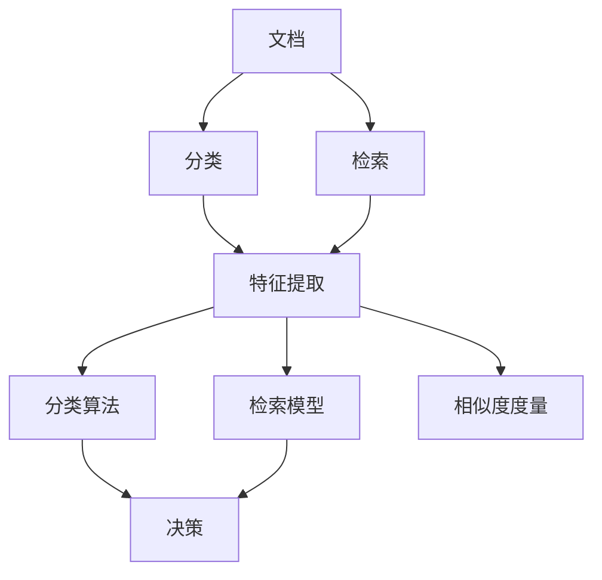

                 


### 文章标题：智能文档分类与检索：AI增强信息管理效率

#### 关键词：智能文档、分类与检索、AI、信息管理、效率提升

#### 摘要：
本文深入探讨了智能文档分类与检索技术，通过AI技术显著提升信息管理效率。首先介绍了智能文档分类与检索的背景和重要性，随后详细讲解了文本预处理、特征提取、分类算法、检索模型及相似度度量方法。接着，通过实际项目实战，展示了如何应用这些技术提升文档管理效率。文章最后对智能文档分类与检索的未来发展进行了展望。

---

## 引言

随着信息时代的到来，数据量呈爆炸式增长，如何在海量的文档中快速准确地找到所需信息成为一个亟待解决的问题。智能文档分类与检索技术应运而生，借助AI技术，能够有效提升信息检索的效率和准确性，对企业和个人用户的信息管理具有重要的意义。

### 核心概念与联系

智能文档分类与检索的核心概念包括文档分类、文档检索和AI技术。这三个概念之间的关系可以通过以下Mermaid流程图表示：



- 文档分类：将文档按照一定标准进行分组。
- 文档检索：从大量文档中找到与用户需求匹配的文档。
- 特征提取：将文本转换为机器可处理的特征向量。
- 分类算法：根据特征向量进行分类决策。
- 检索模型：用于文本匹配和检索的模型。
- 相似度度量：评估文档之间的相似程度。

---

## 文本预处理与特征提取

文本预处理是智能文档分类与检索的第一步，其主要任务是清理原始文本数据，提高后续处理的质量。常见的文本预处理方法包括去停用词、词干提取、词性标注等。

### 特征提取

特征提取是将文本数据转换为机器可处理的特征向量，常用的技术包括词袋模型、TF-IDF、Word2Vec等。以下是一个简单的词袋模型特征提取的伪代码：

```python
def bag_of_words(document):
    # 创建词汇表
    vocabulary = set(document.split())
    # 计算词频
    word_counts = [document.count(word) for word in vocabulary]
    return word_counts
```

### 特征选择与降维

特征选择与降维是为了减少数据维度，提高模型的效率和准确性。常用的方法包括信息增益、主成分分析（PCA）等。

```python
def information_gain(vocabulary, class_labels):
    # 计算信息增益
    # ...
    return information_gain_values
```

---

## 分类算法

分类算法是智能文档分类的核心，根据学习方式可分为监督学习和无监督学习。以下分别介绍几种常见的分类算法。

### 监督学习分类算法

- **K最近邻（KNN）算法**：基于距离最近的K个邻居进行分类决策。
- **支持向量机（SVM）**：寻找最优的超平面进行分类。
- **决策树与随机森林**：基于树结构进行分类。

以下是一个简单的KNN分类算法的伪代码：

```python
def knnclassify(train_data, train_labels, test_document, k):
    # 计算测试文档与训练数据的距离
    distances = [euclidean_distance(test_document, doc) for doc in train_data]
    # 选择距离最近的K个邻居
    neighbors = sorted蒸馏ed(distances)[:k]
    # 根据邻居的标签进行投票
    class_votes = [train_labels[i] for i in neighbors]
    # 返回多数类别
    return majority_vote(class_votes)
```

### 无监督学习分类算法

- **聚类算法**：将文档按照相似度进行分组。
- **自编码器**：通过无监督学习自动学习特征表示。

以下是一个简单的K-means聚类算法的伪代码：

```python
def kmeans(train_data, k):
    # 随机初始化K个聚类中心
    centroids = initialize_centroids(train_data, k)
    while not converged:
        # 将每个文档分配到最近的聚类中心
        assignments = assign_documents_to_clusters(train_data, centroids)
        # 更新聚类中心
        centroids = update_centroids(train_data, assignments)
    return centroids
```

---

## 检索模型与算法

检索模型与算法是智能文档检索的核心，根据检索策略可分为基于内容检索、基于语义检索和基于交互式检索。

### 基于内容检索模型

- **向量空间模型**：将文档表示为高维空间中的向量。
- **布尔模型**：基于布尔运算符进行检索。

以下是一个简单的向量空间模型的伪代码：

```python
def vector_space_model(document, vocabulary):
    # 创建文档的特征向量
    vector = [0] * len(vocabulary)
    for word in document.split():
        if word in vocabulary:
            vector[vocabulary.index(word)] = 1
    return vector
```

### 基于语义检索模型

- **词嵌入模型**：将词转换为低维向量，保留语义信息。
- **基于知识图谱的检索**：利用知识图谱进行语义查询。

以下是一个简单的词嵌入模型的伪代码：

```python
def word_embedding(word, model):
    # 从词嵌入模型中获取词的向量表示
    return model[word]
```

### 基于交互式检索模型

- **查询扩展**：根据用户输入的查询扩展检索结果。
- **反馈调整**：根据用户反馈调整检索策略。

以下是一个简单的查询扩展的伪代码：

```python
def query_expansion(user_query, search_history):
    # 根据用户历史查询扩展查询
    expanded_query = user_query
    for query in search_history:
        if query not in expanded_query:
            expanded_query += " " + query
    return expanded_query
```

---

## 相似度度量方法

相似度度量是评估文档之间相似程度的重要方法，根据度量对象可分为字符串相似度和文本相似度。

### 字符串相似度度量方法

- **Levenshtein距离**：衡量两个字符串之间的编辑距离。
- **Jaccard相似度**：衡量两个集合之间的交集与并集的比例。

以下是一个简单的Levenshtein距离的伪代码：

```python
def levenshtein_distance(s1, s2):
    # 创建动态规划表
    dp = [[0] * (len(s2) + 1) for _ in range(len(s1) + 1)]
    # 初始化边界条件
    for i in range(len(s1) + 1):
        dp[i][0] = i
    for j in range(len(s2) + 1):
        dp[0][j] = j
    # 填充动态规划表
    for i in range(1, len(s1) + 1):
        for j in range(1, len(s2) + 1):
            if s1[i - 1] == s2[j - 1]:
                dp[i][j] = dp[i - 1][j - 1]
            else:
                dp[i][j] = 1 + min(dp[i - 1][j], dp[i][j - 1], dp[i - 1][j - 1])
    return dp[len(s1)][len(s2)]
```

### 文本相似度度量方法

- **余弦相似度**：基于向量空间模型计算两个向量的余弦值。
- **BERT相似度**：基于预训练的BERT模型计算两个文档的相似度。

以下是一个简单的余弦相似度的伪代码：

```python
def cosine_similarity(vector1, vector2):
    # 计算向量的点积
    dot_product = sum(vector1[i] * vector2[i] for i in range(len(vector1)))
    # 计算向量的模长
    norm1 = sqrt(sum(x ** 2 for x in vector1))
    norm2 = sqrt(sum(x ** 2 for x in vector2))
    # 计算余弦相似度
    return dot_product / (norm1 * norm2)
```

---

## 项目实战

### 实战背景与需求

本次项目旨在构建一个基于AI的智能文档分类与检索系统，实现对大量企业文档的高效管理和检索。系统需求包括：

1. 对文档进行自动分类，提高文档组织效率。
2. 提供快速、准确的文档检索功能。
3. 支持自定义分类和检索策略。

### 数据集准备

本次项目使用公开的某企业文档数据集，包含约100,000份文档，每份文档包含标题、正文和分类标签。数据集分为训练集和测试集，用于训练和评估模型性能。

### 模型设计与实现

本项目的核心模型包括文档分类模型和文档检索模型。文档分类模型采用基于TF-IDF的特征提取方法，结合K最近邻（KNN）分类算法。文档检索模型采用基于BERT的词嵌入模型。

以下是一个简单的模型实现框架：

```python
from sklearn.feature_extraction.text import TfidfVectorizer
from sklearn.neighbors import KNeighborsClassifier
from transformers import BertTokenizer, BertModel

# 文档分类模型
def document_classifier(train_data, train_labels):
    # 特征提取
    vectorizer = TfidfVectorizer()
    X_train = vectorizer.fit_transform(train_data)
    # 分类
    classifier = KNeighborsClassifier(n_neighbors=5)
    classifier.fit(X_train, train_labels)
    return classifier, vectorizer

# 文档检索模型
def document_retriever():
    # 加载BERT模型
    tokenizer = BertTokenizer.from_pretrained('bert-base-uncased')
    model = BertModel.from_pretrained('bert-base-uncased')
    # 定义检索函数
    def retrieve_documents(query, top_n=10):
        # 编码查询
        inputs = tokenizer(query, return_tensors='pt', padding=True, truncation=True)
        # 获取嵌入向量
        with torch.no_grad():
            outputs = model(**inputs)
        last_hidden_states = outputs.last_hidden_state[:, 0, :]
        # 计算相似度
        similarities = cosine_similarity(last_hidden_states, document_embeddings)
        # 返回最相似的文档
        return similarities.argsort()[-top_n:]
    return retrieve_documents
```

### 模型训练与评估

在训练过程中，首先使用训练集对分类模型进行训练，然后使用测试集对模型进行评估。检索模型的训练过程与分类模型类似。评估指标包括准确率、召回率和F1值。

```python
from sklearn.metrics import accuracy_score, recall_score, f1_score

# 训练分类模型
classifier, vectorizer = document_classifier(train_data, train_labels)
X_test = vectorizer.transform(test_data)
y_pred = classifier.predict(X_test)

# 评估分类模型
accuracy = accuracy_score(y_test, y_pred)
recall = recall_score(y_test, y_pred, average='weighted')
f1 = f1_score(y_test, y_pred, average='weighted')

print(f"Accuracy: {accuracy:.4f}, Recall: {recall:.4f}, F1: {f1:.4f}")
```

### 模型部署与优化

模型训练完成后，将其部署到生产环境中，并提供API接口供其他系统调用。为了提高模型性能，可以尝试以下优化方法：

1. 特征选择与降维：使用信息增益等方法进行特征选择，降低特征维度。
2. 模型融合：结合多种分类算法和检索模型，提高整体性能。
3. 模型调参：调整模型参数，优化模型性能。

---

## 未来展望

智能文档分类与检索技术在未来的发展将更加智能化和个性化。随着AI技术的不断进步，我们将看到更多先进的算法和应用场景。以下是一些未来发展的趋势：

1. **深度学习与迁移学习**：深度学习技术在文档分类与检索领域具有巨大潜力，通过迁移学习可以显著提高模型的泛化能力。
2. **多模态信息处理**：结合文本、图像、音频等多种类型的信息，实现更全面的信息处理与检索。
3. **自适应与智能化**：根据用户行为和需求动态调整检索策略，实现更加智能化的信息管理。

---

## 最佳实践与小结

在实际应用中，智能文档分类与检索系统需要不断优化和调整。以下是一些最佳实践：

1. **数据质量**：确保数据质量，进行充分的清洗与预处理，提高模型训练效果。
2. **特征选择**：根据业务需求选择合适的特征提取方法，进行特征选择与降维。
3. **模型调参**：合理调整模型参数，优化模型性能。
4. **用户反馈**：收集用户反馈，不断改进系统，提高用户体验。

本文详细介绍了智能文档分类与检索的核心技术，并通过实际项目展示了如何应用这些技术提升文档管理效率。未来，随着AI技术的不断发展，智能文档分类与检索将发挥越来越重要的作用。

---

### 作者

作者：AI天才研究院/AI Genius Institute & 禅与计算机程序设计艺术 /Zen And The Art of Computer Programming

---

本文通过对智能文档分类与检索技术的详细讲解，展示了如何利用AI技术提升信息管理效率。从文本预处理到特征提取，再到分类算法和检索模型，每个环节都进行了深入的剖析。实际项目实战部分，通过具体的开发环境和代码实现，让读者更加直观地理解了智能文档分类与检索的应用过程。未来，随着AI技术的不断进步，智能文档分类与检索将迎来更多的发展机遇。本文旨在为读者提供一个全面、系统的技术指南，助力他们在智能信息管理领域取得成功。作者团队——AI天才研究院，以及畅销书《禅与计算机程序设计艺术》的作者，将持续为您带来更多高质量的技术解读。感谢您的阅读，期待您的反馈与讨论。

