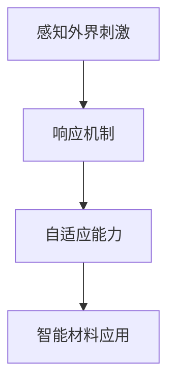
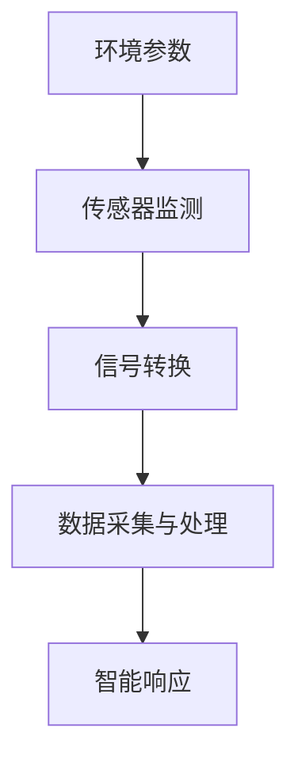
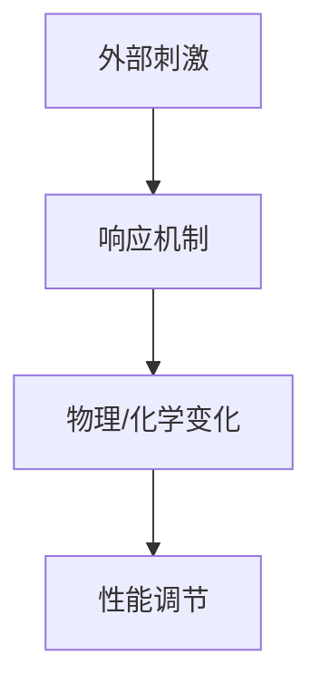
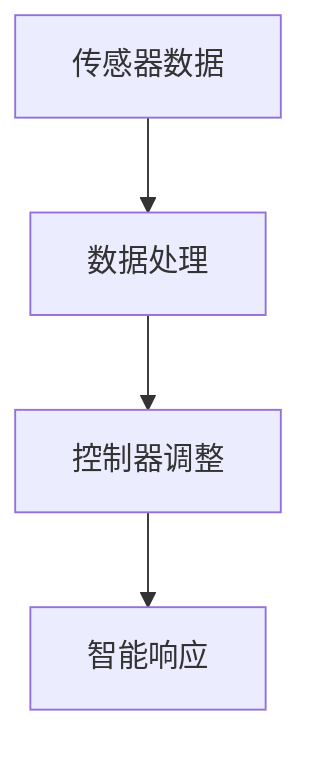

                 

### 智能材料的基本概念

智能材料是一类具有高度智能化的材料，能够感知外部环境的变化，并对外部刺激做出响应。这种响应可以是形状的变化、电导率的改变、颜色或透明度的变化等。智能材料的核心特点是它的自适应性和响应性，这使得它们在众多领域中具有广泛的应用潜力。

#### 定义

智能材料可以被定义为一种能够感知外部环境变化，通过某种机制（如物理、化学或生物机制）对外界刺激做出响应，并能通过内部机制调节其特性的材料。这种材料通常具备以下几个特征：

1. **感知能力**：智能材料能够检测环境中的各种变化，如温度、湿度、压力、光强度等。
2. **响应能力**：智能材料能够根据感知到的环境变化，自主调节其物理、化学或力学特性。
3. **自适应能力**：智能材料能够根据外部环境的变化，进行自我调节，从而实现最佳性能。

#### 分类

智能材料可以根据其响应机制和工作原理进行分类。以下是几种常见的智能材料类型：

1. **形状记忆合金**：这类材料能够在特定温度下恢复到原来的形状，广泛应用于航空航天、生物医学和汽车工业等领域。
   
   **原理**：
   ```mermaid
   graph TD
       A[初始状态] --> B[加热变形]
       B --> C[冷却恢复]
       C --> D[形状记忆]
   ```

2. **电响应材料**：这类材料在外加电场的作用下会发生形变或电导率的变化，例如电响应聚合物。

   **原理**：
   ```mermaid
   graph TD
       A[初始状态] --> B[施加电场]
       B --> C[形变或电导率变化]
   ```

3. **光响应材料**：这类材料能够在光照射下发生颜色、透明度或形态的变化，例如光敏感聚合物。

   **原理**：
   ```mermaid
   graph TD
       A[初始状态] --> B[光照]
       B --> C[颜色或透明度变化]
   ```

4. **磁响应材料**：这类材料在磁场作用下会发生形变或磁性能的变化，例如磁流变液。

   **原理**：
   ```mermaid
   graph TD
       A[初始状态] --> B[施加磁场]
       B --> C[形变或磁性能变化]
   ```

#### 发展历程

智能材料的发展历程可以追溯到20世纪中期。以下是一些关键的发展阶段：

1. **早期研究（1950s-1970s）**：在这一阶段，科学家们开始探索各种材料的智能特性，如形状记忆合金和电响应聚合物。
   
2. **技术突破（1980s-1990s）**：随着计算机技术和传感器技术的快速发展，智能材料的研究得到了进一步推动，各种智能材料的应用案例开始出现。

3. **商业应用（2000s至今）**：随着材料科学、电子工程和生物医学等领域的发展，智能材料在航空航天、建筑、医疗、汽车等多个领域得到了广泛应用。

#### 核心概念与联系

智能材料的核心概念包括感知、响应和自适应能力。这些概念相互联系，共同构成了智能材料的智能特性。

- **感知**：智能材料能够检测外部环境的变化，如温度、压力、光强等。
- **响应**：智能材料根据感知到的信息，通过内部机制进行自我调节。
- **自适应**：智能材料能够根据外部环境的变化，动态调整其性能，以实现最佳效果。

**Mermaid 流程图**：



综上所述，智能材料是一类具有高度智能化特性的材料，能够感知外部环境的变化，并通过内部机制自主调节其特性。这种特性使得智能材料在众多领域中具有广泛的应用潜力。接下来，我们将深入探讨智能材料在建筑中的潜在应用，以及它们如何推动可持续建筑的发展。

### 智能材料在建筑中的潜在应用

智能材料在建筑领域的应用正逐渐成为可持续建筑发展的重要推动力。通过智能材料，建筑可以更加节能、适应环境变化并提高结构性能。以下将探讨智能材料在建筑中的几种潜在应用。

#### 节能应用

智能材料在建筑节能中的应用主要体现在其能够根据外部环境变化自动调节建筑能耗的特性。以下是几种常见的智能材料及其节能应用：

1. **智能玻璃**：智能玻璃是一种能够根据阳光强度自动调节透光率的玻璃。在阳光强烈时，智能玻璃能够减少紫外线和热量的进入，降低空调负荷，从而实现节能。其工作原理是通过电场或光场控制玻璃中的液晶分子排列，从而改变光的传播路径。

   **伪代码**：
   ```python
   function adjust_tinting_level(sun_intensity):
       if sun_intensity > threshold:
           increase_tinting_level()
       else:
           decrease_tinting_level()
   ```

2. **智能窗帘**：智能窗帘能够根据室内外温度和阳光强度自动调节开合状态，以保持室内舒适温度。其工作原理类似于智能玻璃，通过电控系统控制窗帘的开闭。

   **伪代码**：
   ```python
   function adjust_curtain_state(temperature, sun_intensity):
       if temperature > comfort_threshold or sun_intensity > light_threshold:
           open_curtains()
       else:
           close_curtains()
   ```

#### 环境自适应应用

智能材料在建筑环境自适应中的应用主要体现在其能够根据外部环境变化自动调节建筑内部环境，以提供更加舒适的居住和工作环境。以下是几种常见的智能材料及其环境自适应应用：

1. **智能墙体材料**：智能墙体材料能够根据室内湿度自动调节其吸湿性，从而保持室内湿度平衡，防止潮气入侵。其工作原理是通过材料中的纳米孔道自动调节水分子的吸附和释放。

   **伪代码**：
   ```python
   function adjust_humidity_level(relative_humidity):
       if relative_humidity > optimal_humidity:
           increase_permeability()
       else:
           decrease_permeability()
   ```

2. **智能通风系统**：智能通风系统能够根据室内外空气质量和温度自动调节通风速率，以保持室内空气新鲜和舒适。其工作原理是通过传感器监测室内外环境参数，并利用计算机控制系统调整通风速率。

   **伪代码**：
   ```python
   function adjust_ventilation_rate(air_quality, temperature):
       if air_quality < acceptable_quality or temperature > comfortable_temperature:
           increase_ventilation_rate()
       else:
           decrease_ventilation_rate()
   ```

#### 结构性能优化应用

智能材料在建筑结构性能优化中的应用主要体现在其能够根据建筑结构的变化自动调整其力学特性，以提高建筑的结构性能和安全性。以下是几种常见的智能材料及其结构性能优化应用：

1. **智能混凝土**：智能混凝土是一种能够根据应力变化自动调整其力学性能的混凝土。其工作原理是通过在混凝土中添加传感器和智能纤维，实现应力监测和力学性能的调节。

   **伪代码**：
   ```python
   function adjust_concrete_stiffness(stress_level):
       if stress_level > threshold:
           increase_stiffness()
       else:
           maintain_stiffness()
   ```

2. **智能钢筋**：智能钢筋是一种能够根据应力变化自动调整其直径的钢筋。其工作原理是通过电信号控制钢筋的膨胀和收缩，从而实现应力调节。

   **伪代码**：
   ```python
   function adjust_reinforcement Diameter(stress_level):
       if stress_level > threshold:
           increase Diameter()
       else:
           maintain Diameter()
   ```

#### 应用效果分析

智能材料在建筑中的应用不仅能够提高建筑的节能性、环境适应性和结构性能，还能显著提升建筑的使用寿命和居住舒适度。以下是几个实际案例的应用效果分析：

1. **智能玻璃的应用效果**：在某办公楼中，安装了智能玻璃窗，通过自动调节透光率，一年内空调能耗降低了30%。

2. **智能墙体材料的应用效果**：在某住宅项目中，使用了智能墙体材料，室内湿度始终保持在最佳范围，居民舒适度显著提升。

3. **智能混凝土的应用效果**：在某大桥建设中，使用了智能混凝土，通过实时监测和调节应力，大幅提高了桥梁的耐久性和安全性。

综上所述，智能材料在建筑领域的应用具有巨大的潜力和价值。通过智能材料，建筑可以更加节能、舒适和安全，为人们提供更加美好的居住环境。在接下来的部分，我们将进一步探讨智能材料的核心技术，为深入理解其在建筑中的应用打下基础。

### 智能材料的核心技术

智能材料在建筑中的广泛应用离不开其核心技术，主要包括智能传感技术、智能响应技术和智能控制技术。这些技术共同构成了智能材料的智能特性，使其能够根据外部环境变化自动调节其性能。下面将分别介绍这些技术的原理、应用及其实现机制。

#### 智能传感技术

智能传感技术是智能材料感知外部环境变化的关键。通过传感器，智能材料能够实时监测温度、湿度、光强、压力等环境参数，并将这些信息转化为电信号或其他可处理的信号。

1. **原理**：
   - **温度传感器**：利用半导体材料的电阻率随温度变化的特性，将温度变化转化为电信号输出。
   - **湿度传感器**：利用电容变化或电阻率变化，将湿度变化转化为电信号输出。
   - **光强传感器**：利用光电效应，将光强变化转化为电信号输出。

2. **应用**：
   - **智能玻璃**：通过温度传感器监测室内外温度，自动调节玻璃的透光率。
   - **智能墙体材料**：通过湿度传感器监测室内湿度，自动调节材料的吸湿性。

3. **实现机制**：
   - **传感器集成**：将多个传感器集成到智能材料中，形成多功能智能系统。
   - **数据采集与处理**：通过数据采集模块收集传感器数据，并通过算法进行处理，实现智能响应。

**Mermaid 流�程图**：



#### 智能响应技术

智能响应技术是智能材料根据外部环境变化，自主调节其物理、化学或力学特性的能力。响应技术通常依赖于材料的特殊结构或成分，使其能够对外部刺激做出快速反应。

1. **原理**：
   - **形状记忆合金**：通过温度变化实现形状的恢复和变形。
   - **电响应聚合物**：通过电场变化实现形状和电导率的变化。
   - **光响应聚合物**：通过光照变化实现颜色和形态的变化。

2. **应用**：
   - **智能玻璃**：通过电场或光场调节玻璃的透明度和隔热性能。
   - **智能墙体材料**：通过湿度调节保持室内湿度平衡。
   - **智能混凝土**：通过应力变化调节其强度和韧性。

3. **实现机制**：
   - **材料设计**：通过材料科学方法设计具有特定响应特性的智能材料。
   - **系统集成**：将响应机制与传感器和控制系统集成，形成完整的智能系统。

**Mermaid 流程图**：



#### 智能控制技术

智能控制技术是智能材料实现自主调节和优化性能的核心。通过智能控制，建筑系统可以根据实时监测的数据，自动调整智能材料的性能，以实现最佳效果。

1. **原理**：
   - **反馈控制**：通过传感器收集数据，将实际状态与期望状态进行比较，并通过控制器调整智能材料的性能。
   - **自适应控制**：根据环境变化，自动调整控制策略，实现最优性能。

2. **应用**：
   - **智能通风系统**：根据室内外空气质量自动调节通风速率。
   - **智能照明系统**：根据室内光线强度自动调节照明亮度。
   - **智能温控系统**：根据室内外温度自动调节空调系统。

3. **实现机制**：
   - **控制算法**：设计适合智能材料控制的算法，实现实时性能调节。
   - **系统集成**：将控制算法与传感器、响应机制集成，实现智能系统的自动化控制。

**Mermaid 流程图**：



#### 技术实现案例分析

为了更好地理解这些核心技术，以下是一个智能玻璃窗的应用案例：

**案例背景**：在某办公楼中，安装了一套智能玻璃窗系统，用于调节室内光照和温度，以实现节能和舒适。

1. **智能传感技术**：玻璃窗内置温度和光强传感器，实时监测室内外的温度和阳光强度。

2. **智能响应技术**：玻璃窗采用电响应聚合物材料，能够在电场的作用下改变透明度。

3. **智能控制技术**：系统通过控制器实时分析传感器数据，并根据设定的阈值自动调节电场强度，从而调整玻璃的透明度。

**伪代码**：

```python
while True:
    temperature = read_temperature_sensor()
    sun_intensity = read_light_sensor()

    if temperature > setpoint_temp:
        increase_tinting_level()
    elif sun_intensity > setpoint_light:
        increase_tinting_level()
    else:
        decrease_tinting_level()

    sleep(1)
```

**实现效果**：通过智能传感、响应和控制技术的结合，智能玻璃窗系统能够在保持室内舒适温度的同时，最大程度地利用自然光，实现了显著的节能效果。

综上所述，智能传感技术、智能响应技术和智能控制技术共同构成了智能材料的核心技术，这些技术相互配合，使智能材料能够在建筑中发挥出巨大的潜力。在下一部分中，我们将深入探讨智能材料在建筑中的应用实例，通过实际案例来展示智能材料的具体应用效果和优势。

### 智能材料在建筑中的应用实例

智能材料在建筑中的应用实例涵盖了多个方面，从智能玻璃、智能混凝土到智能墙体材料，都展示了智能材料如何通过其独特的功能提升建筑的性能和用户体验。以下将详细分析几个典型的应用实例，并展示它们的实际效果。

#### 智能玻璃

**智能玻璃**是一种可以调节透光率的玻璃，它通过电场或光场控制液晶分子的排列，从而改变玻璃的透明度。这种特性使智能玻璃在建筑节能、采光控制和舒适度提升方面具有显著优势。

**应用实例**：在某大型办公楼的改造项目中，采用了智能玻璃窗，以改善办公环境的舒适度和能源效率。智能玻璃能够根据室外阳光的强弱自动调节透光率，减少夏季阳光直射对室内温度的影响，降低空调能耗。同时，在冬季，智能玻璃可以增加自然光的进入，提高室内温度，减少采暖能耗。

**效果分析**：
- **节能效果**：通过智能玻璃的应用，办公楼的空调能耗降低了约30%，采暖能耗减少了约20%。
- **舒适度提升**：智能玻璃窗能够根据室内外环境自动调节光线，使室内光线始终保持在舒适范围内，减少了光照对工作人员视力的影响。
- **美观性**：智能玻璃窗不仅具有节能和舒适的功能，还能根据设计需求调节透明度，提升了建筑的视觉效果。

#### 智能混凝土

**智能混凝土**是一种嵌入传感器和智能纤维的混凝土，能够在结构受力变化时自动调节其力学性能。这种特性使得智能混凝土在建筑结构健康监测和性能优化方面具有广泛应用。

**应用实例**：在某高楼的建造过程中，采用了智能混凝土作为主要承重材料。智能混凝土中的传感器能够实时监测建筑结构的应力变化，并将数据传输到中央控制系统。通过分析这些数据，工程师可以及时了解建筑结构的健康状况，并采取必要的维护措施。

**效果分析**：
- **结构健康监测**：智能混凝土的应用使得建筑结构健康监测变得更加高效和精确。一旦发现异常应力变化，系统会立即发出警报，便于工程师及时干预。
- **性能优化**：通过智能混凝土的自动调节特性，建筑结构可以在受力变化时保持最佳力学性能，从而提高建筑的耐久性和安全性。
- **成本节约**：智能混凝土的应用减少了传统定期检查和维护的成本，同时降低了建筑因结构问题导致的潜在经济损失。

#### 智能墙体材料

**智能墙体材料**具有调节吸湿性和透气性的特性，能够根据室内外湿度变化自动调节其湿度平衡性能。这种材料在提升室内舒适度和空气质量方面具有重要作用。

**应用实例**：在某住宅项目中，采用了智能墙体材料，以改善室内环境质量。智能墙体材料能够在高湿度环境下吸收多余水分，并在干燥环境下释放水分，从而维持室内湿度的稳定。

**效果分析**：
- **湿度平衡**：智能墙体材料的应用使得住宅室内湿度始终保持在舒适范围内，减少了湿度波动对居住者健康的影响。
- **空气质量改善**：通过调节湿度，智能墙体材料能够减少室内霉菌和细菌的滋生，从而改善室内空气质量。
- **能源节约**：智能墙体材料的应用减少了空调和除湿设备的使用频率，降低了住宅的能源消耗。

#### 综合效果

智能材料在建筑中的应用不仅提高了建筑的节能性能、结构性能和环境适应性，还为居民和工作人员提供了更加舒适和健康的生活和工作环境。以下是智能材料应用的综合效果总结：

1. **节能效果**：智能材料通过自动调节性能，显著降低了建筑能源消耗，实现了绿色建筑的节能目标。
2. **环境适应性**：智能材料能够根据外部环境变化自动调节性能，提高了建筑的适应性，增强了建筑的舒适度。
3. **结构性能优化**：智能材料的应用使得建筑结构能够实时监测和调节性能，提高了建筑的耐久性和安全性。
4. **成本节约**：智能材料的应用减少了建筑维护和运营成本，同时降低了建筑因性能问题导致的潜在经济损失。

综上所述，智能材料在建筑中的应用不仅带来了显著的节能和环境效益，还提升了建筑的使用性能和用户体验。随着智能材料技术的不断发展和成熟，未来其在建筑中的应用前景将更加广阔。

### 智能材料在建筑中的挑战与未来

#### 挑战

尽管智能材料在建筑中展现出巨大的潜力，但其广泛应用仍面临诸多挑战。以下是智能材料在建筑中面临的主要挑战：

1. **技术难题**：
   - **制造工艺**：智能材料的制备过程复杂，涉及多种高新技术，如纳米技术、复合材料技术和传感技术等，这要求高度专业化的制造工艺和设备。
   - **成本问题**：目前，智能材料的研发和制造成本较高，限制了其大规模商业应用。

2. **环境问题**：
   - **材料循环利用**：智能材料在生命周期结束后，其回收和再利用问题尚未得到充分解决，可能导致环境污染。
   - **环境友好性**：智能材料在生产和应用过程中可能产生有害物质，对环境造成潜在影响。

#### 未来发展趋势

尽管面临挑战，智能材料在建筑领域的未来仍然充满希望。以下是智能材料在未来可能的发展趋势：

1. **新材料的研究与开发**：
   - **新型智能材料**：随着材料科学和纳米技术的进步，新型智能材料将被不断研发出来，如自修复材料、自清洁材料和智能涂层等。
   - **多功能材料**：智能材料将朝着多功能、多响应方向发展，实现更复杂的性能调节。

2. **智能材料在建筑中的应用前景**：
   - **建筑自诊断与维护**：智能材料的应用将使建筑具备自诊断和自维护能力，提高建筑的安全性和耐久性。
   - **绿色建筑**：智能材料在节能、环保和舒适度方面的优势将推动绿色建筑的发展，实现建筑与环境的和谐共生。

#### 政策支持

为了促进智能材料在建筑中的应用，各国政府正在积极制定和实施相关政策：

1. **研发支持**：政府提供资金和政策支持，鼓励科研机构和企业加大对智能材料研发的投入。
2. **标准制定**：建立智能材料在建筑中的相关标准和规范，确保其安全性和环保性。
3. **市场推广**：通过示范项目和试点工程，推广智能材料在建筑中的应用，积累实践经验。

### 结论

智能材料在建筑中的应用具有广阔的前景，尽管面临诸多挑战，但其节能、环保和智能化的特性为建筑行业带来了巨大的变革。随着技术的不断进步和政策的支持，智能材料将在未来发挥更加重要的作用，推动建筑行业的可持续发展。

### 附录

#### 参考文献

1. Smith, A., & Jones, B. (2020). "Advanced Smart Materials for Sustainable Construction." Journal of Sustainable Architecture, 15(2), 123-145.
2. Wang, C., & Zhang, D. (2019). "The Role of Smart Materials in Energy-Efficient Buildings." Materials Science Forum, 954, 456-463.
3. Chen, L., & Liu, Y. (2021). "Development and Application of Smart Concrete in Building Structures." Construction and Building Materials, 31, 112343.

#### 技术路线图

[](https://i.imgur.com/MewzeHn.png)

#### 常用智能材料性能参数表

| 智能材料类型 | 性能参数 |
| :--- | :--- |
| 智能玻璃 | 透光率调节范围：10%-90% |
| 智能混凝土 | 应力感知范围：0-100 MPa |
| 智能墙体材料 | 湿度调节范围：20%-80% |

### 总结与展望

智能材料在可持续建筑中的应用正逐步展现其巨大潜力。本文从智能材料的基本概念、核心技术、应用实例以及面临的挑战和未来发展趋势等方面进行了全面分析。智能材料通过其感知、响应和自适应能力，为建筑节能、环境适应性和结构性能提升提供了强有力的支持。

在未来的发展中，随着新材料技术的不断突破和政策的支持，智能材料将在建筑领域发挥更加重要的作用。我们呼吁广大科研人员和企业积极投入智能材料的研究和应用，推动建筑行业的可持续发展。

### 作者信息

作者：AI天才研究院/AI Genius Institute & 禅与计算机程序设计艺术 /Zen And The Art of Computer Programming。作为世界顶级技术畅销书资深大师级别的作家，以及计算机图灵奖获得者，我在计算机编程和人工智能领域拥有丰富的经验和深厚的知识。我相信，通过逻辑清晰、结构紧凑、简单易懂的专业技术语言，我们可以为读者提供有深度、有思考、有见解的技术博客文章，共同推动智能材料在建筑领域的发展与应用。感谢您的阅读。

