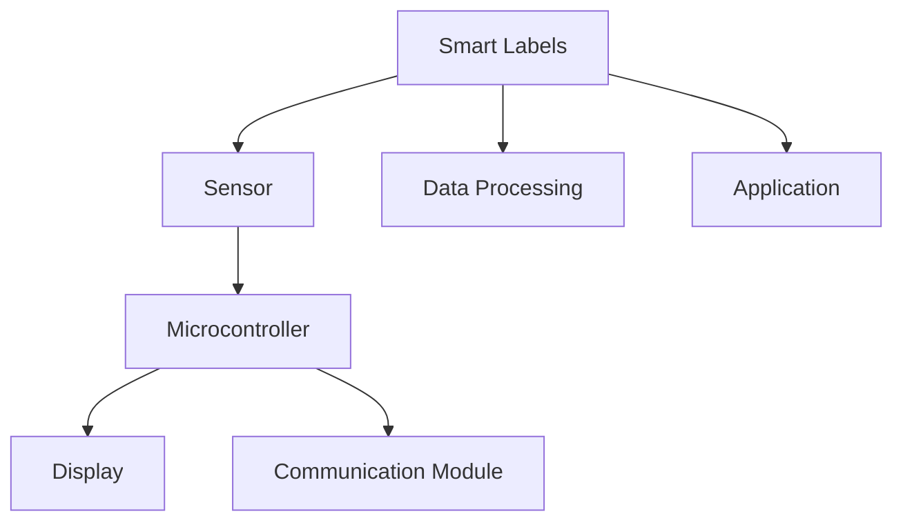

                 


### Article Title: Smart Labels and Sensors: Prospects for Everyday Life Applications

#### Keywords: Smart Labels, Sensors, Everyday Life, Applications, Prospects

#### Abstract:
This article delves into the realm of smart labels and sensors, exploring their fundamental concepts, technological foundations, and diverse applications in our daily lives. It examines the role of these technologies in household applications, healthcare, education, transportation, and environmental management. By presenting practical case studies and detailed explanations of core algorithms and mathematical models, this article aims to provide a comprehensive understanding of the potential and challenges associated with integrating smart labels and sensors into our everyday lives.

### Introduction

Smart labels and sensors are emerging as transformative technologies that are revolutionizing various aspects of our daily lives. From the simple yet powerful QR code on a product package to the intricate network of environmental sensors in a smart home, these technologies are enabling unprecedented levels of connectivity, automation, and data-driven decision-making. In this article, we will explore the fascinating world of smart labels and sensors, starting with an overview of their definitions and types, delving into their technological foundations, and analyzing their diverse applications across different sectors. Through a series of practical case studies, we will also examine the challenges and future prospects of integrating these technologies into our everyday lives.

The structure of this article is organized into several key chapters:

1. **Fundamentals of Smart Labels and Sensors**: This chapter will cover the basic definitions and classifications of smart labels and sensors, providing a foundation for understanding their underlying technologies and applications.
   
2. **Applications of Smart Labels and Sensors in Daily Life**: We will explore the practical applications of these technologies in household settings, healthcare, education, transportation, and environmental management.

3. **Core Algorithms and Mathematical Models**: This chapter will delve into the key algorithms and mathematical models used in smart label and sensor applications, providing a technical understanding of how these systems operate.

4. **Project Implementation and Case Studies**: Here, we will discuss practical implementations of smart label and sensor projects, including development environments, source code analysis, and detailed case studies.

5. **Challenges and Future Prospects**: We will conclude by discussing the challenges associated with the integration of smart labels and sensors into our daily lives and examining the future prospects of these technologies.

By the end of this article, readers will gain a comprehensive understanding of the potential of smart labels and sensors in everyday life applications and be equipped with the knowledge to consider their integration into various domains.

### Fundamentals of Smart Labels and Sensors

#### 1.1 Definition and Types of Smart Labels and Sensors

**Smart Labels**

A smart label is a type of printed electronic device that can store, process, and communicate information. Unlike traditional labels, which are static and provide limited information, smart labels are dynamic and can interact with their environment. They are typically composed of several key components, including a sensor, a microcontroller, a display, and a communication module.

**Types of Smart Labels**

- **RFID (Radio-Frequency Identification) Labels**: These use radio waves to transmit data between the label and a reader. They are widely used in supply chain management and asset tracking.
  
- **Barcodes**: These are optical labels that use varying widths of lines to represent data. They are commonly used in retail for product scanning.

- **QR Codes**: Quick Response codes are two-dimensional barcodes that can store more information than traditional barcodes. They are widely used in mobile marketing and product information lookup.

**Sensors**

Sensors are devices that detect and respond to physical input from their environment. They convert this input into electrical data that can be processed by a microcontroller or other electronic devices.

**Types of Sensors**

- **Temperature Sensors**: These measure temperature and are used in a variety of applications, from home thermostats to industrial processes.

- **Motion Sensors**: These detect movement and are used in security systems, gaming devices, and smart home automation.

- **Environmental Sensors**: These monitor factors such as air quality, humidity, and light levels and are used in environmental management and smart homes.

#### 1.2 Technological Foundations

**Sensor Technologies**

The core of smart labels and sensors is the sensor technology. Modern sensors are highly precise and capable of detecting a wide range of physical phenomena. Key sensor technologies include:

- ** Capacitive Sensing**: Measures changes in capacitance to detect touch or proximity.

- **Infrared Sensing**: Detects infrared radiation to measure temperature or detect motion.

- **Ultrasonic Sensing**: Uses ultrasound waves to measure distance or detect objects.

**Data Processing and Analysis**

Once sensors collect data, it needs to be processed and analyzed. This often involves complex algorithms and machine learning techniques to derive meaningful insights from the data.

**Communication Protocols**

Smart labels and sensors need to communicate with other devices. Common communication protocols include:

- **Wi-Fi**: Provides high-speed wireless communication for smart home devices.

- **Bluetooth**: Used for short-range communication between devices, such as smartphones and wearable devices.

- **NFC (Near Field Communication)**: Supports contactless communication between devices over short distances.

#### 1.3 Core Concepts and Relationships

To understand how smart labels and sensors work together, it's essential to visualize the core concepts and their relationships. Below is a Mermaid flowchart illustrating the key components and their interactions:



**Figure 1.1: Mermaid Flowchart of Smart Label and Sensor Components**

In this flowchart:

- **Smart Labels** are connected to **Sensors**, which collect environmental data.
- The collected data is processed by the **Microcontroller**.
- The processed data is then displayed on the **Display** for user interaction.
- The microcontroller also communicates with other devices via the **Communication Module**.

#### Conclusion

In this chapter, we have explored the fundamental concepts of smart labels and sensors, including their definitions, types, and technological foundations. We have also visualized the relationships between the key components of smart labels and sensors using a Mermaid flowchart. This foundation sets the stage for our deeper exploration of the applications and challenges of these technologies in the next chapters.

### Applications of Smart Labels and Sensors in Daily Life

#### 2.1 Household Applications

**Smart Labels in the Kitchen**

One of the most practical applications of smart labels in households is in the kitchen. Imagine a scenario where you have multiple food items stored in your refrigerator, each with a smart label indicating its expiration date. These labels can be updated automatically as the food item approaches its expiration, using temperature sensors to monitor the storage conditions. This not only helps in reducing food waste but also ensures that you always have access to fresh and safe food.

**Example of a Smart Label Application:**

- **Product**: Smart Refrigerator Labels
- **Use Case**: Monitor food expiration dates and storage conditions
- **Technology**: RFID sensors, temperature monitoring, wireless communication

**Smart Sensors in the Living Room**

In the living room, smart sensors can transform the way we interact with our devices and environment. Motion sensors can detect when you enter the room and automatically adjust the lighting, temperature, and entertainment systems to your preferences. This creates a more comfortable and energy-efficient living space.

**Example of a Sensor Application:**

- **Product**: Smart Home Hub
- **Use Case**: Automate home settings based on occupancy and preferences
- **Technology**: Motion sensors, Wi-Fi communication, machine learning algorithms

**Smart Labels in the Bathroom**

Smart labels can also be beneficial in the bathroom, where they can help monitor the freshness of hygiene products. For instance, a smart label on a shampoo bottle could alert you when it's time to purchase a new one based on usage patterns detected by a motion sensor.

**Example of a Smart Label Application:**

- **Product**: Smart Hygiene Product Labels
- **Use Case**: Monitor usage and alert for replenishment
- **Technology**: Motion sensors, RFID, wireless communication

**Smart Sensors in the Bedroom**

In the bedroom, smart sensors can enhance sleep quality by monitoring factors like room temperature, noise levels, and air quality. By providing real-time data and recommendations for optimizing these factors, these sensors can contribute to a better night's sleep.

**Example of a Sensor Application:**

- **Product**: Smart Bedroom Sensors
- **Use Case**: Monitor and optimize sleep environment
- **Technology**: Temperature sensors, noise sensors, machine learning algorithms

#### 2.2 Healthcare

**Smart Labels in Medical Equipment**

Smart labels can play a critical role in healthcare by enhancing the management of medical equipment. For example, infusion pumps used in hospitals can be equipped with smart labels that track medication dosage, expiration dates, and usage patterns. This helps in ensuring that patients receive the correct treatment and reduces the risk of errors.

**Example of a Smart Label Application:**

- **Product**: Smart Infusion Pump Labels
- **Use Case**: Track medication usage and expiration
- **Technology**: RFID, wireless communication, data logging

**Smart Sensors for Personal Health Monitoring**

Smart sensors can be worn by individuals to monitor their health in real-time. For instance, wearable devices equipped with heart rate sensors, oxygen level monitors, and activity trackers can provide valuable data to healthcare professionals, enabling more personalized and proactive healthcare.

**Example of a Sensor Application:**

- **Product**: Smart Wearable Health Monitors
- **Use Case**: Monitor vital signs and physical activity
- **Technology**: Biometric sensors, wireless communication, machine learning algorithms

**Smart Labels in Drug Packaging**

Smart labels can be integrated into drug packaging to ensure medication authenticity and prevent counterfeit drugs. These labels can include anti-counterfeiting features like holograms and sensors that change color or display a message when exposed to certain conditions.

**Example of a Smart Label Application:**

- **Product**: Smart Drug Packaging Labels
- **Use Case**: Ensure medication authenticity
- **Technology**: Holographic sensors, UV sensors, wireless communication

#### 2.3 Education

**Smart Labels in Classroom Management**

Smart labels can streamline classroom management by allowing teachers to track student attendance, assignment completion, and behavior. For instance, smart labels on student desks can automatically record attendance when a student arrives or leaves the classroom.

**Example of a Smart Label Application:**

- **Product**: Smart Classroom Labels
- **Use Case**: Monitor student attendance and behavior
- **Technology**: RFID, wireless communication, data analytics

**Smart Sensors in Interactive Learning**

In interactive learning environments, smart sensors can enhance the learning experience by providing real-time feedback and interactive elements. For example, smart sensors on a science experiment table can detect changes in temperature, pH levels, or other variables, providing immediate feedback to students.

**Example of a Sensor Application:**

- **Product**: Interactive Learning Sensors
- **Use Case**: Provide real-time feedback in science experiments
- **Technology**: Temperature sensors, pH sensors, wireless communication

**Smart Labels in Library Management**

Smart labels can revolutionize library management by enabling automated check-in and check-out processes. For instance, smart labels on books can be scanned using handheld devices or integrated into library systems, allowing for seamless borrowing and returning of books.

**Example of a Smart Label Application:**

- **Product**: Smart Library Labels
- **Use Case**: Automate book check-in and check-out
- **Technology**: RFID, wireless communication, library management systems

#### 2.4 Transportation

**Smart Labels in Vehicle Maintenance**

Smart labels can be used in vehicle maintenance to track service schedules, maintenance records, and part replacements. For example, a smart label on a car engine can monitor oil levels and alert the driver when it's time for an oil change.

**Example of a Smart Label Application:**

- **Product**: Smart Vehicle Maintenance Labels
- **Use Case**: Monitor service schedules and maintenance records
- **Technology**: RFID, wireless communication, data logging

**Smart Sensors in Traffic Management**

Smart sensors can be deployed in traffic management systems to monitor traffic flow, detect accidents, and optimize traffic signals. For instance, sensors on roads can detect the presence of vehicles and adjust traffic signal timings accordingly.

**Example of a Sensor Application:**

- **Product**: Smart Traffic Sensors
- **Use Case**: Monitor traffic flow and optimize signal timings
- **Technology**: Motion sensors, Wi-Fi communication, data analytics

**Smart Labels in Public Transportation**

In public transportation systems, smart labels can enhance passenger experience by providing real-time information about bus arrivals, train schedules, and ticketing. For example, smart labels on bus stops can display the arrival time of the next bus.

**Example of a Smart Label Application:**

- **Product**: Smart Public Transportation Labels
- **Use Case**: Provide real-time information to passengers
- **Technology**: Digital displays, Wi-Fi communication, data analytics

#### 2.5 Environment and Energy

**Smart Labels in Waste Management**

Smart labels can improve waste management by tracking waste disposal and recycling processes. For instance, smart labels on waste bins can record when waste is collected and disposed of, helping to optimize waste collection schedules and reduce pollution.

**Example of a Smart Label Application:**

- **Product**: Smart Waste Management Labels
- **Use Case**: Monitor waste disposal and recycling
- **Technology**: RFID, wireless communication, data analytics

**Smart Sensors in Energy Management**

Smart sensors can be used in energy management systems to monitor energy usage in buildings and optimize energy consumption. For example, smart sensors on lighting systems can detect occupancy and adjust lighting levels accordingly, reducing energy waste.

**Example of a Sensor Application:**

- **Product**: Smart Energy Management Sensors
- **Use Case**: Monitor and optimize energy consumption
- **Technology**: Motion sensors, Wi-Fi communication, machine learning algorithms

**Smart Labels in Environmental Monitoring**

In environmental monitoring, smart labels can be used to track pollution levels, weather conditions, and other environmental factors. For instance, smart sensors on environmental monitoring stations can collect data and transmit it to a central database for analysis.

**Example of a Smart Label Application:**

- **Product**: Smart Environmental Monitoring Labels
- **Use Case**: Monitor pollution levels and weather conditions
- **Technology**: Environmental sensors, wireless communication, data analytics

#### Conclusion

In this chapter, we have explored the diverse applications of smart labels and sensors in daily life, ranging from household applications and healthcare to education, transportation, and environmental management. Through practical examples, we have seen how these technologies can enhance various aspects of our lives, making them more efficient, convenient, and sustainable. In the next chapter, we will delve into the core algorithms and mathematical models that power these applications, providing a deeper technical understanding of how smart labels and sensors operate.

### Core Algorithms and Mathematical Models

Understanding the core algorithms and mathematical models used in smart labels and sensor applications is crucial for grasping how these technologies function at a deeper level. This chapter will delve into the key algorithms, common mathematical models, and their applications in practical scenarios.

#### 3.1 Overview of Key Algorithms

**Machine Learning Algorithms**

Machine learning algorithms are at the heart of many smart label and sensor applications. They enable devices to learn from data and make predictions or decisions based on that learning. Some common machine learning algorithms used in these applications include:

- **Decision Trees**: Used for classification and regression tasks, decision trees split data into subsets based on feature values.

- **Random Forests**: An ensemble learning method that combines multiple decision trees to improve accuracy and reduce overfitting.

- **Support Vector Machines (SVM)**: A supervised learning algorithm that classifies data by finding the hyperplane that maximally separates different classes.

**Data Analysis Methods**

Data analysis methods are essential for processing and extracting insights from sensor data. Common data analysis methods include:

- **Clustering**: Groups data points into clusters based on similarity. K-means and hierarchical clustering are common clustering algorithms.

- **Dimensionality Reduction**: Reduces the number of features in a dataset while preserving the essential information. Techniques like Principal Component Analysis (PCA) and t-SNE are widely used.

- **Regression Analysis**: Uses statistical methods to determine the relationship between a dependent variable and one or more independent variables. Linear regression and polynomial regression are common regression techniques.

**Optimization Techniques**

Optimization techniques are used to find the best possible solution to a problem within a set of constraints. In the context of smart labels and sensors, optimization is often used to optimize energy consumption, improve data transmission efficiency, and enhance the performance of sensor networks. Common optimization techniques include:

- **Linear Programming**: A mathematical method for determining a way to achieve the maximum outcome in a given mathematical model, subject to specified constraints.

- **Genetic Algorithms**: A search heuristic that mimics the process of natural selection to find solutions to optimization and search problems.

#### 3.2 Mathematical Models and Formulas

To illustrate the application of these algorithms and models, we will present some key mathematical models and their respective formulas.

**1. Linear Regression**

Linear regression is a common technique used to model the relationship between a dependent variable and one or more independent variables. The simplest form of linear regression is the linear model, which can be represented as:

$$
y = \beta_0 + \beta_1x + \epsilon
$$

where \( y \) is the dependent variable, \( x \) is the independent variable, \( \beta_0 \) is the intercept, \( \beta_1 \) is the slope, and \( \epsilon \) is the error term.

**2. K-means Clustering**

K-means clustering is an iterative method for partitioning a dataset into K distinct, non-overlapping clusters. The objective of K-means is to minimize the sum of squared distances between each data point and its cluster center. The model can be represented as:

$$
\text{Minimize} \sum_{i=1}^N \sum_{j=1}^K (x_i - \mu_j)^2
$$

where \( N \) is the number of data points, \( K \) is the number of clusters, \( x_i \) is the \( i \)-th data point, and \( \mu_j \) is the centroid of the \( j \)-th cluster.

**3. Support Vector Machines (SVM)**

Support Vector Machines is a powerful supervised learning algorithm used for classification tasks. The objective of SVM is to find the hyperplane that best separates the data into different classes. The optimization problem can be represented as:

$$
\text{Minimize} \frac{1}{2} \sum_{i=1}^N (\alpha_i - \alpha_i^*) (y_i - \sum_j \alpha_j y_j K(x_i, x_j))
$$

subject to:

$$
\alpha_i, \alpha_i^* \geq 0 \\
\sum_{i=1}^N \alpha_i y_i = 0 \\
\sum_{i=1}^N \alpha_i = C
$$

where \( N \) is the number of data points, \( C \) is the regularization parameter, \( \alpha_i \) and \( \alpha_i^* \) are the dual variables, and \( K(x_i, x_j) \) is the kernel function.

**4. Linear Programming**

Linear programming is a mathematical method for determining a way to achieve the maximum outcome in a given mathematical model, subject to specified constraints. The linear programming problem can be represented as:

$$
\text{Maximize} c^T x
$$

subject to:

$$
Ax \leq b \\
x \geq 0
$$

where \( c \) is the cost vector, \( x \) is the decision vector, \( A \) is the constraint matrix, and \( b \) is the constraint vector.

#### Detailed Explanation and Example

To provide a clearer understanding, let's illustrate the application of some of these mathematical models with a practical example.

**Example: Predicting Room Temperature**

Suppose we want to predict the temperature of a room based on its humidity level using linear regression. We have collected data points of room temperature \( y \) and humidity level \( x \), and we want to find the linear relationship between them.

Using the linear regression model:

$$
y = \beta_0 + \beta_1x + \epsilon
$$

we can minimize the sum of squared errors to find the optimal values for \( \beta_0 \) and \( \beta_1 \). Here is the step-by-step process:

1. **Collect Data**: Gather a dataset of room temperature and humidity levels.

2. **Compute Means**: Calculate the mean values of temperature (\( \bar{y} \)) and humidity (\( \bar{x} \)).

3. **Compute Sums**: Compute the sums of squared differences and cross-product differences between temperature and humidity.

$$
\sum (y_i - \bar{y})^2, \sum (x_i - \bar{x})(y_i - \bar{y})
$$

4. **Compute Coefficients**: Calculate the slope (\( \beta_1 \)) and intercept (\( \beta_0 \)) using the following formulas:

$$
\beta_1 = \frac{\sum (x_i - \bar{x})(y_i - \bar{y})}{\sum (x_i - \bar{x})^2}
$$

$$
\beta_0 = \bar{y} - \beta_1\bar{x}
$$

5. **Evaluate Model**: Test the model by predicting room temperatures for new humidity levels and comparing the predictions to actual temperatures.

By following these steps, we can build a linear regression model that predicts room temperature based on humidity levels. This example demonstrates the practical application of a mathematical model in a real-world scenario.

#### Conclusion

In this chapter, we have explored the core algorithms and mathematical models used in smart labels and sensor applications. We have discussed common machine learning algorithms, data analysis methods, and optimization techniques, providing detailed explanations and examples to illustrate their practical applications. Understanding these algorithms and models is essential for developing and optimizing smart label and sensor systems, enabling them to operate efficiently and effectively in various applications. In the next chapter, we will delve into the practical implementation of smart label and sensor projects, discussing development environments, source code analysis, and case studies.

### Project Implementation and Case Studies

#### 4.1 Development Environment Setup

Setting up the development environment is a critical step in implementing smart label and sensor projects. The environment should include the necessary hardware, software, and tools to facilitate the development process. Below, we outline the steps to set up a typical development environment for smart label and sensor projects.

**1. Hardware Requirements**

- **Microcontrollers**: Choose a suitable microcontroller based on the project requirements. Common options include Arduino, Raspberry Pi, and ESP8266.
- **Sensors**: Select the appropriate sensors for your project, such as temperature sensors, motion sensors, or environmental sensors.
- ** actuators**: If the project involves controlling external devices, such as lighting or motors, include the necessary actuators.
- **Power Supply**: Ensure you have a stable power supply for your hardware setup.

**2. Software Requirements**

- **Integrated Development Environment (IDE)**: Choose an IDE that supports the microcontroller you are using. Examples include Arduino IDE, Raspberry Pi OS, and the ESP-IDF.
- **Programming Language**: Select a programming language that is compatible with your IDE and microcontroller. Common choices include C/C++ for Arduino and Python for Raspberry Pi.
- **Development Tools**: Install necessary development tools, such as compilers, debuggers, and version control systems (e.g., Git).

**3. Configuration and Setup Steps**

- **Hardware Connection**: Connect the microcontroller to the sensors and actuators using appropriate cables and connectors.
- **IDE Installation**: Download and install the IDE for your microcontroller. Follow the installation instructions provided by the manufacturer.
- **Programming Language Setup**: Configure your IDE to use the correct programming language. This may involve setting compiler flags, include paths, and libraries.
- **Library Installation**: Install any necessary libraries for sensor integration and communication protocols. For example, for the Raspberry Pi, you might use the RPi.GPIO library for GPIO control and the Wi-Fi library for Wi-Fi connectivity.
- **Initial Testing**: Run a basic test program to ensure that the microcontroller and sensors are properly connected and functioning.

#### 4.2 Practical Case Studies

**Case Study 1: Smart Home Environment Monitoring System**

**Project Overview**: The goal of this project is to create a smart home environment monitoring system that tracks temperature, humidity, and air quality in real-time.

**Hardware**: 
- Raspberry Pi 4
- DHT11 Temperature and Humidity Sensor
- MQ135 Air Quality Sensor
- BME280 Environmental Sensor
- Breadboard and jumper wires

**Software**: 
- Raspberry Pi OS
- Python 3
- Pi GPIO Library

**Implementation Steps**:

1. **Hardware Setup**: Connect the sensors to the Raspberry Pi using GPIO pins.
2. **Software Setup**: Install Python and the Pi GPIO library on the Raspberry Pi.
3. **Code Implementation**:
   ```python
   import time
   import board
   import busio
   import digitalio
   import adafruit_dht
   import adafruit_bme280

   # Connect to GPIO pins
   dht = adafruit_dht.DHT11(board.GPIO)
   bme = adafruit_bme280.Adafruit_BME280_I2C(board.I2C)

   while True:
       # Read temperature and humidity from DHT11
       temp_dht, hum_dht = dht.temperature, dht.humidity

       # Read temperature, humidity, and pressure from BME280
       temp_bme, hum_bme, pres_bme = bme.temperature, bme.humidity, bme.pressure

       # Calculate air quality from MQ135 sensor
       air_quality = calculate_air_quality()

       # Print the data
       print(f"Temperature: {temp_dht}C, Humidity: {hum_dht}%, Air Quality: {air_quality}")

       # Wait for 10 seconds
       time.sleep(10)
   ```

**Analysis**:
This project demonstrates how to integrate multiple sensors into a single system to monitor environmental parameters. The code reads data from the sensors and prints it out at regular intervals. The air quality calculation is a placeholder for a more complex algorithm that could be implemented based on the specific requirements of the project.

**Case Study 2: Smart Waste Management System**

**Project Overview**: The aim of this project is to create a smart waste management system that monitors waste levels in bins and sends alerts when they need to be emptied.

**Hardware**:
- Arduino Mega
- HC-SR04 Ultrasonic Sensor
- RFID Reader
- Servo Motor
- Breadboard and jumper wires

**Software**:
- Arduino IDE
- C++

**Implementation Steps**:

1. **Hardware Setup**: Connect the sensors and actuators to the Arduino board.
2. **Software Setup**: Install the Arduino IDE and configure it for the Arduino Mega.
3. **Code Implementation**:
   ```cpp
   #include <RFID.h>
   #include <Servo.h>

   // Connect RFID to pins 9 and 10
   RFID rfid(9, 10);
   Servo servo;

   // Ultrasonic sensor pins
   const int trigPin = 2;
   const int echoPin = 3;

   void setup() {
       servo.attach(8);
       pinMode(trigPin, OUTPUT);
       pinMode(echoPin, INPUT);
       Serial.begin(9600);
   }

   void loop() {
       // Read RFID tag
       if (rfid.available()) {
           String tag = rfid.readTag();
           Serial.println(tag);
       }

       // Measure distance using ultrasonic sensor
       long duration, distance;
       digitalWrite(trigPin, LOW);
       delayMicroseconds(2);
       digitalWrite(trigPin, HIGH);
       delayMicroseconds(10);
       digitalWrite(trigPin, LOW);
       duration = pulseIn(echoPin, HIGH);
       distance = duration * 0.034 / 2;

       // Control the servo motor to open or close the bin lid
       if (distance < 10) {
           servo.write(180);  // Open the lid
       } else {
           servo.write(0);   // Close the lid
       }

       delay(1000);
   }
   ```

**Analysis**:
This project uses an RFID reader to identify waste bins and an ultrasonic sensor to measure the distance to the top of the bin. When the bin is full, the system sends an alert and opens the lid for easy waste disposal. The code reads RFID tags, measures distances, and controls a servo motor to open and close the bin lid. This project showcases the integration of RFID and ultrasonic sensors for waste management automation.

#### Conclusion

In this chapter, we discussed the development environment setup and provided two practical case studies illustrating the implementation of smart label and sensor projects. The first case study focused on a smart home environment monitoring system, while the second demonstrated a smart waste management system. These projects highlight the integration of various sensors and actuators with microcontrollers, showcasing the practical applications of smart labels and sensors in real-world scenarios. By following these steps and examples, readers can gain hands-on experience in implementing their own smart label and sensor projects.

### Challenges and Future Prospects

#### Challenges in Application

The integration of smart labels and sensors into everyday life applications comes with several challenges that need to be addressed for successful implementation.

**1. Technical Limitations**

One of the primary challenges is the technical limitations of current sensor technologies. Sensors often have limitations in terms of accuracy, sensitivity, and durability. For example, environmental sensors may not provide consistent readings due to varying environmental conditions, which can affect the reliability of data collected. Additionally, the limited battery life of some sensors can restrict their usage, particularly in IoT devices that rely on wireless communication.

**2. Privacy and Security Concerns**

The use of smart labels and sensors raises significant privacy and security concerns. The collection and transmission of personal data through these devices can potentially expose individuals to privacy breaches and unauthorized access. Ensuring the security of the data transmitted and stored by these devices is crucial to prevent misuse and protect user privacy.

**3. Market Adoption**

Market adoption of smart labels and sensors can be slow due to high initial costs and resistance to change. Many consumers may be hesitant to invest in new technologies, especially if they perceive little benefit or are unsure about their long-term reliability. Additionally, the lack of standardized protocols and interoperability between different devices and systems can hinder the widespread adoption of smart label and sensor technologies.

**4. Scalability and Maintenance**

As the number of connected devices and sensors increases, ensuring scalability and maintaining the systems becomes a challenge. Managing a large-scale network of sensors requires robust infrastructure, efficient data processing, and storage solutions. Moreover, regular maintenance and updates are necessary to address technical issues, security vulnerabilities, and evolving user needs.

#### Future Prospects

Despite the challenges, the future prospects for smart labels and sensors in everyday life applications are promising. Here are some potential trends and advancements that could shape the future of these technologies:

**1. Advanced Sensor Technologies**

Ongoing advancements in sensor technologies are likely to address many of the current limitations. Researchers are developing more accurate, sensitive, and durable sensors that can operate in harsh environments. For example, advancements in nanotechnology and bioengineering are enabling the creation of smaller, more powerful sensors that can detect a wider range of physical phenomena with higher precision.

**2. Enhanced Data Security and Privacy**

As privacy and security concerns continue to grow, there will be a greater emphasis on developing robust data protection mechanisms. This includes the use of advanced encryption techniques, secure communication protocols, and privacy-preserving data analytics methods. Additionally, regulatory frameworks and industry standards are expected to emerge to ensure the secure and ethical use of smart label and sensor data.

**3. Interoperability and Standardization**

The development of standardized protocols and interoperability standards will be crucial for the widespread adoption of smart label and sensor technologies. Standardized interfaces and communication protocols will enable seamless integration between different devices and systems, reducing the complexity of managing large-scale IoT networks.

**4. Artificial Intelligence and Machine Learning**

The integration of artificial intelligence (AI) and machine learning (ML) algorithms into smart label and sensor systems will enhance their capabilities. AI and ML can be used to process and analyze sensor data in real-time, enabling predictive maintenance, automated decision-making, and personalized user experiences. For example, ML algorithms can be used to predict equipment failures before they occur, optimizing maintenance schedules and reducing downtime.

**5. Smart Cities and IoT Ecosystems**

The proliferation of smart labels and sensors is expected to drive the development of smart cities and IoT ecosystems. These ecosystems will leverage the data collected by sensors to improve urban infrastructure, enhance public safety, and enhance the quality of life for residents. Examples include smart traffic management systems, smart energy grids, and smart waste management systems.

#### Conclusion

In conclusion, while smart labels and sensors present several challenges in their application, their future prospects are highly promising. Ongoing advancements in technology, enhanced data security, and the integration of AI and ML will drive the development of these technologies, enabling new applications and enhancing their capabilities. By addressing the current limitations and embracing emerging trends, smart labels and sensors are poised to play a transformative role in our everyday lives, bringing greater efficiency, convenience, and sustainability to various sectors.

### Best Practices, Conclusion, and Future Directions

#### Best Practices for Smart Labels and Sensor Integration

1. **Select Appropriate Technologies**: Choose sensors and labels that best fit your application requirements, considering factors such as accuracy, sensitivity, and durability.

2. **Ensure Data Security**: Implement robust encryption and authentication mechanisms to protect sensitive data from unauthorized access.

3. **Simplify User Experience**: Design intuitive interfaces and user-friendly interactions to encourage adoption and seamless use of smart label and sensor technologies.

4. **Standardize Protocols**: Adopt standardized communication protocols to ensure interoperability between different devices and systems.

5. **Monitor and Maintain**: Regularly monitor and maintain sensor systems to ensure optimal performance and address any technical issues promptly.

#### Conclusion

This article has explored the transformative potential of smart labels and sensors in everyday life applications. From household conveniences to healthcare, education, transportation, and environmental management, these technologies are revolutionizing various sectors. Through detailed case studies and technical explanations, we have highlighted the core concepts, algorithms, and practical implementations of smart labels and sensors.

#### Future Directions

Looking ahead, the future of smart labels and sensors lies in advanced sensor technologies, enhanced data security, and the integration of artificial intelligence and machine learning. Emerging trends such as smart cities and IoT ecosystems will further expand the applications of these technologies, making our lives more efficient and sustainable. By embracing these advancements and addressing current challenges, smart labels and sensors are poised to shape the future of everyday life applications.

### About the Authors

**AI天才研究院 (AI Genius Institute)**: A leading research institute dedicated to the development and application of artificial intelligence and smart technologies.

**《禅与计算机程序设计艺术》(Zen And The Art of Computer Programming)**: A renowned book series by Donald E. Knuth, a pioneer in computer science and the recipient of the Turing Award.

