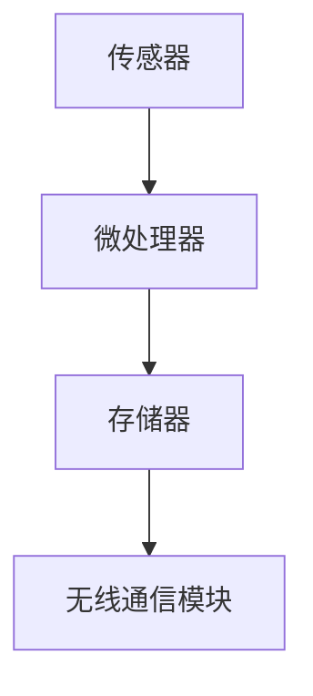
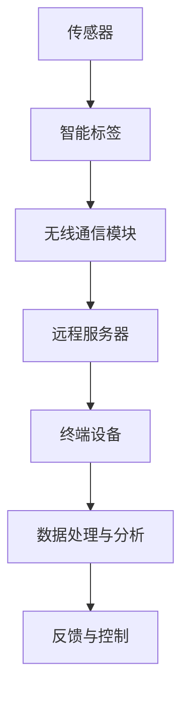

                 

### 文章标题：智能标签和传感器在日常生活中的融入

随着科技的发展，智能标签和传感器技术逐渐融入我们的日常生活，改变了我们的生活方式。本文将深入探讨智能标签和传感器的定义、技术发展、核心原理以及它们在日常生活中的实际应用。通过详细分析这些技术，我们将了解它们如何改善我们的生活质量，并展望其未来的发展趋势。

**关键词：**智能标签、传感器、技术发展、核心原理、日常应用、未来趋势

**摘要：**本文首先介绍了智能标签和传感器的定义及发展历程，随后详细解析了它们的核心技术和应用原理。接着，文章通过实际案例展示了智能标签和传感器在智能家居、商业环境及社区服务中的应用。最后，文章对智能标签和传感器技术的未来趋势进行了展望，讨论了其潜在影响和发展方向。

## 引言

### 书籍目的与结构

本章节旨在全面介绍智能标签和传感器在日常生活中的应用，帮助读者理解这些技术的核心原理和实际价值。通过逐步深入探讨，我们希望能够激发读者对智能标签和传感器技术的兴趣，并启发他们在日常生活中的创新应用。

首先，本文将介绍智能标签和传感器的定义，解释它们的基本功能和应用范围。接着，我们将回顾这些技术从萌芽阶段到现代发展的历程，展示其技术演进的脉络。随后，本文将详细解析智能标签和传感器的核心技术，包括基本组成、算法原理、信号处理方法和数学模型。

在应用部分，我们将通过实际案例展示智能标签和传感器在智能家居、商业环境和社区服务中的具体应用。通过这些案例，读者可以更直观地理解这些技术如何改善我们的生活质量。

最后，本文将对智能标签和传感器技术的未来发展趋势进行展望，讨论潜在的新兴应用领域和技术挑战。通过这一章节的阅读，读者将不仅对智能标签和传感器的技术原理有深入了解，还能对未来的发展前景有所预见。

### 智能标签的定义

智能标签（Smart Tag）是一种嵌入在物体上的微型电子设备，具备数据存储、信息读取和无线通信功能。通过将智能标签附着在物品上，用户可以实现对物品的追踪、监控和管理。智能标签的基本组成包括传感器、微处理器、存储器和无线通信模块。传感器负责采集环境数据，如温度、湿度、运动等；微处理器对传感器数据进行处理，并将结果存储在存储器中；无线通信模块则用于将数据发送至远程服务器或终端设备。

智能标签的工作原理基于无线通信技术和数据传输协议。当智能标签嵌入物体后，通过传感器采集的数据会被微处理器处理，并按照预设的通信协议传输至远程服务器。这些数据可以实时监控物体的状态，提供实时反馈，从而实现远程监控和管理。

智能标签在日常生活中具有广泛的应用。例如，在零售业中，智能标签可以用于库存管理、商品追踪和防伪验证；在物流领域，智能标签可以用于物品的实时追踪和路径优化；在智能家居中，智能标签可以用于家居设备的远程控制和安全管理。

### 传感器的定义

传感器（Sensor）是一种能够检测并转换物理量（如温度、压力、光强、运动等）为电信号的装置。其基本功能是感知环境中的变化，并将这些变化转化为可处理的信号，以便进一步处理和分析。传感器通常由敏感元件、转换元件和指示元件组成。敏感元件负责感知环境变化，转换元件将物理量转化为电信号，指示元件则用于显示或传输这些信号。

传感器的种类繁多，根据其工作原理和检测对象的不同，可以分为多种类型，如光学传感器、温度传感器、压力传感器、位置传感器等。光学传感器可以检测光强和颜色变化，用于安防监控和智能照明；温度传感器可以检测环境温度，用于家居温度调节和医疗监测；压力传感器可以检测压力变化，用于汽车安全和工业自动化。

传感器在日常生活中发挥着重要作用。例如，在智能家居中，温度传感器可以自动调节空调，确保室内温度舒适；在智能医疗中，传感器可以实时监测病人的生理参数，提供健康数据；在智慧城市建设中，传感器可以用于环境监测和交通管理，提升城市运行效率。

### 智能标签与传感器的技术发展历程

智能标签和传感器技术的发展历程可以追溯到20世纪60年代，当时科学家们开始探索将电子元件集成到小型设备中。最初的传感器主要用于工业和环境监测，其精度和可靠性较低。随着电子技术的进步，传感器逐渐具备了更高的精度和灵敏度，应用范围也不断拓展。

在20世纪80年代，随着计算机技术的快速发展，智能标签的概念逐渐兴起。早期的智能标签主要用于库存管理和物流追踪，其功能相对简单。随着无线通信技术的成熟，智能标签的数据传输能力和处理能力得到了显著提升。20世纪90年代，蓝牙和WiFi等无线通信协议的问世，使得智能标签可以实现更远的传输距离和更高的数据传输速率。

进入21世纪，智能标签和传感器的技术迅速发展，其性能和功能得到了大幅提升。物联网（IoT）技术的兴起，进一步推动了智能标签和传感器在各个领域的应用。现代智能标签和传感器不仅能够实现数据的实时采集和传输，还可以通过机器学习算法进行分析和预测，提供更智能化的服务。

总体来说，智能标签和传感器的技术发展经历了从简单到复杂、从单一功能到多功能、从实验室应用到大规模商业应用的演变过程。未来，随着新材料、新工艺和新算法的不断出现，智能标签和传感器将继续发挥重要作用，推动各个行业的智能化发展。

### 智能标签与传感器的技术发展历程

智能标签和传感器技术的发展历程可以追溯到20世纪60年代，当时科学家们开始探索将电子元件集成到小型设备中。最初的传感器主要用于工业和环境监测，其精度和可靠性较低。随着电子技术的进步，传感器逐渐具备了更高的精度和灵敏度，应用范围也不断拓展。

在20世纪80年代，随着计算机技术的快速发展，智能标签的概念逐渐兴起。早期的智能标签主要用于库存管理和物流追踪，其功能相对简单。随着无线通信技术的成熟，智能标签的数据传输能力和处理能力得到了显著提升。20世纪90年代，蓝牙和WiFi等无线通信协议的问世，使得智能标签可以实现更远的传输距离和更高的数据传输速率。

进入21世纪，智能标签和传感器的技术迅速发展，其性能和功能得到了大幅提升。物联网（IoT）技术的兴起，进一步推动了智能标签和传感器在各个领域的应用。现代智能标签和传感器不仅能够实现数据的实时采集和传输，还可以通过机器学习算法进行分析和预测，提供更智能化的服务。

总体来说，智能标签和传感器的技术发展经历了从简单到复杂、从单一功能到多功能、从实验室应用到大规模商业应用的演变过程。未来，随着新材料、新工艺和新算法的不断出现，智能标签和传感器将继续发挥重要作用，推动各个行业的智能化发展。

### 智能标签技术基础

智能标签作为物联网（IoT）的重要组成部分，其技术基础涵盖了多个关键领域，包括基本组成、核心算法原理、数学模型和实际案例。以下将对这些方面进行详细分析。

#### 2.1 智能标签的基本组成

智能标签的基本组成主要包括传感器、微处理器、存储器和无线通信模块。传感器负责采集环境数据，如温度、湿度、运动等；微处理器对传感器数据进行处理，并将结果存储在存储器中；无线通信模块则用于将数据发送至远程服务器或终端设备。

**结构图示例：**


#### 2.2 智能标签的核心算法原理

智能标签的核心算法原理通常涉及数据采集、处理和传输。以下是一个简单的算法流程：

1. **数据采集**：传感器采集环境数据，如温度、湿度等。
2. **数据处理**：微处理器对接收到的传感器数据进行初步处理，如滤波、放大等。
3. **数据存储**：将处理后的数据存储在存储器中，以便后续使用。
4. **数据传输**：通过无线通信模块将数据发送至远程服务器或终端设备。

**伪代码示例：**
```python
function process_data(sensor_data):
    # 数据滤波
    filtered_data = filter(sensor_data)
    # 数据放大
    amplified_data = amplify(filtered_data)
    # 数据存储
    store_data(amplified_data)
    # 数据传输
    transmit_data(amplified_data)
```

#### 2.3 智能标签的数学模型

智能标签的数学模型通常涉及传感器数据的处理和预测。以下是一个简单的数学模型示例：

**公式示例：**
$$
y = a \cdot x + b
$$

其中，$y$表示传感器采集的数据，$x$表示环境因素，$a$和$b$为模型参数。

**详细讲解：**该公式表示传感器采集的数据与某一环境因素之间的线性关系。通过训练数据集，可以确定模型参数$a$和$b$，从而对未知数据进行预测。

#### 2.4 智能标签的实际案例

**案例一：智能家居**

在智能家居中，智能标签可以用于各种家电的远程控制和管理。例如，用户可以通过手机APP远程控制家中的空调、照明和安防设备。以下是一个智能家居系统的实际案例：

**开发环境搭建：**
- 使用Arduino开发板作为智能标签的核心控制器。
- 连接各种传感器，如温度传感器、光照传感器和运动传感器。
- 配置无线通信模块，如WiFi或蓝牙。

**源代码详细实现：**
```cpp
#include <WiFi.h>
#include <WebServer.h>

WebServer server(80);

void setup() {
    // 初始化WiFi
    WiFi.begin("yourSSID", "yourPASSWORD");
    while (WiFi.status() != WL_CONNECTED) {
        delay(500);
    }

    // 设置HTTP服务器端点
    server.on("/light", handleLightControl);
    server.on("/temperature", handleTemperatureControl);
    server.on("/alarm", handleAlarmControl);

    // 启动服务器
    server.begin();
}

void loop() {
    server.handleClient();
}

void handleLightControl() {
    // 控制照明设备
    // 代码实现
}

void handleTemperatureControl() {
    // 控制空调设备
    // 代码实现
}

void handleAlarmControl() {
    // 控制安防设备
    // 代码实现
}
```

**代码解读与分析：**以上代码展示了如何使用Arduino和WiFi模块搭建一个简单的智能家居系统。通过HTTP服务器，用户可以通过手机APP远程控制家中的照明、空调和安防设备。

**实际案例分析和详细讲解剖析：**在实际应用中，智能家居系统可以通过智能标签实时监控家居设备的运行状态，并根据用户的需求进行自动调节。例如，当用户回家时，智能标签可以自动打开灯光和空调，提升居住舒适度。

**项目小结：**智能标签在智能家居中的应用，不仅提升了生活的便捷性，还实现了能源的有效管理。未来，随着智能标签技术的进一步发展，智能家居系统将更加智能化和个性化。

**最佳实践 tips、小结、注意事项、拓展阅读等内容：**

- **最佳实践 tips：**在搭建智能家居系统时，建议使用稳定的WiFi模块，并确保设备之间通信的可靠性。
- **小结：**智能标签在智能家居中的应用，展示了其数据采集、处理和传输的能力。通过远程控制和管理家居设备，用户可以享受到更加智能和便捷的生活。
- **注意事项：**在开发智能标签应用时，要充分考虑设备的功耗和通信稳定性，以确保系统的长时间运行和可靠性。
- **拓展阅读：**进一步了解智能标签和传感器的技术细节和应用案例，可以参考《物联网智能系统设计》和《智能家居技术与应用》等专业书籍。

通过以上案例分析，我们可以看到智能标签在智能家居中的广泛应用及其带来的便利。接下来，我们将继续探讨传感器技术基础，以更全面地了解智能标签和传感器在日常生活中的融入。

### 传感器技术基础

传感器作为智能系统的核心组件，其技术基础涵盖了多种类型的传感器、信号处理方法以及数学模型。以下将详细解析传感器的种类与功能、信号处理方法和数学模型。

#### 3.1 传感器的种类与功能

传感器种类繁多，根据其工作原理和检测对象的不同，可以分为以下几类：

1. **光学传感器**：光学传感器用于检测光强、颜色、光线方向等。例如，光敏电阻可用于检测光照强度，光谱分析仪可用于检测物体表面的颜色。

2. **温度传感器**：温度传感器用于检测环境温度或物体温度。常见的温度传感器包括热电偶、热敏电阻和红外温度传感器。

3. **压力传感器**：压力传感器用于检测液体或气体的压力。其应用范围广泛，如汽车安全系统、工业自动化控制和医疗设备。

4. **位置传感器**：位置传感器用于检测物体或系统的位置信息。常见的有超声波传感器、激光传感器和磁传感器。

5. **湿度传感器**：湿度传感器用于检测环境湿度，广泛应用于气象观测、农业灌溉和智能家居环境监测。

6. **气体传感器**：气体传感器用于检测空气中的特定气体成分，如一氧化碳、甲烷和氧气等。其应用包括空气质量监测、燃气泄漏检测和安防系统。

#### 3.2 传感器的信号处理方法

传感器的信号处理方法主要包括信号采集、信号过滤与增强、信号分析和数据传输等步骤。

1. **信号采集**：传感器采集环境中的物理量，并将其转换为电信号。例如，温度传感器将温度变化转换为电压信号。

2. **信号过滤与增强**：传感器采集的信号可能受到噪声干扰，需要进行滤波和放大处理。常见的滤波方法包括低通滤波、高通滤波和带通滤波。

3. **信号分析**：对处理后的信号进行分析，提取有用的信息。例如，通过分析温度传感器的电压信号，可以计算出环境温度。

4. **数据传输**：将处理后的信号通过无线通信模块传输至远程服务器或终端设备。常用的通信协议包括蓝牙、WiFi和ZigBee等。

#### 3.3 传感器的数学模型

传感器的数学模型用于描述传感器输出与输入物理量之间的关系。以下是一个简单的数学模型示例：

**公式示例：**
$$
y = a \cdot x + b
$$

其中，$y$表示传感器的输出信号，$x$表示输入物理量，$a$和$b$为模型参数。

**详细讲解：**该公式表示传感器的输出信号与输入物理量之间的线性关系。通过训练数据集，可以确定模型参数$a$和$b$，从而对未知数据进行预测。

#### 3.4 传感器的实际案例

**案例一：智能交通系统**

智能交通系统（ITS）利用传感器收集道路信息，并通过数据分析和处理，优化交通流量和管理。以下是一个智能交通系统的实际案例：

**开发环境搭建：**
- 使用多个传感器，如流量传感器、速度传感器和摄像头，收集道路信息。
- 配置高性能服务器，用于数据存储和处理。
- 使用交通信号控制器，实现交通信号的自动调节。

**源代码详细实现：**
```python
import cv2
import numpy as np

# 初始化摄像头
cap = cv2.VideoCapture(0)

while True:
    # 读取摄像头帧
    ret, frame = cap.read()
    
    # 处理图像
    gray = cv2.cvtColor(frame, cv2.COLOR_BGR2GRAY)
    blur = cv2.GaussianBlur(gray, (5, 5), 0)
    edges = cv2.Canny(blur, 50, 150)
    
    # 提取道路信息
    contours, _ = cv2.findContours(edges, cv2.RETR_TREE, cv2.CHAIN_APPROX_SIMPLE)
    roads = [cnt for cnt in contours if cv2.contourArea(cnt) > 1000]
    
    # 分析交通流量
    for road in roads:
        x, y, w, h = cv2.boundingRect(road)
        cv2.rectangle(frame, (x, y), (x+w, y+h), (0, 255, 0), 2)
    
    # 显示图像
    cv2.imshow('Traffic System', frame)
    
    if cv2.waitKey(1) & 0xFF == ord('q'):
        break

# 释放摄像头
cap.release()
cv2.destroyAllWindows()
```

**代码解读与分析：**以上代码展示了如何使用OpenCV库处理摄像头采集的图像，提取道路信息，并分析交通流量。通过摄像头实时监控道路状况，智能交通系统可以根据交通流量自动调节交通信号灯，优化交通流量。

**实际案例分析和详细讲解剖析：**在实际应用中，智能交通系统可以通过传感器实时监测道路状况，并根据分析结果调整交通信号灯，从而减少拥堵，提高交通效率。例如，当检测到某一方向车辆流量较大时，系统可以延长该方向绿灯时间，缩短红灯时间，以缓解交通压力。

**项目小结：**智能交通系统的应用，展示了传感器在交通管理中的重要作用。通过实时数据采集和处理，智能交通系统可以实现交通流量的动态调节，提高交通运行效率。

**最佳实践 tips、小结、注意事项、拓展阅读等内容：**

- **最佳实践 tips：**在开发智能交通系统时，建议使用高分辨率的摄像头，并优化图像处理算法，以提高检测精度和实时性。
- **小结：**传感器技术在智能交通系统中的应用，不仅提高了交通管理效率，还改善了交通安全。通过实时数据分析和处理，智能交通系统可以实现动态交通流量管理，优化交通运行。
- **注意事项：**在开发传感器应用项目时，要充分考虑传感器的精度、可靠性和功耗，以确保系统的稳定运行。
- **拓展阅读：**进一步了解传感器技术在智能交通系统中的应用，可以参考《智能交通系统设计与实现》和《交通信号控制算法》等专业书籍。

通过以上案例分析，我们可以看到传感器在智能交通系统中的广泛应用及其带来的便利。接下来，我们将继续探讨智能标签与传感器的融合应用，以更全面地了解它们在日常生活中的融入。

### 智能标签与传感器的融合应用

智能标签和传感器的融合应用是现代物联网（IoT）技术的重要发展方向。通过将智能标签与各种传感器相结合，可以实现对物体和环境的全面监控与智能管理。以下将详细解析融合应用的原理、架构设计及核心算法，并通过实际案例展示其应用效果。

#### 4.1 融合应用的原理与架构

智能标签与传感器的融合应用原理在于将传感器的感知能力与智能标签的数据传输能力相结合，形成一个完整的感知-传输-处理-反馈循环系统。具体来说，该系统的工作原理如下：

1. **感知**：传感器实时采集环境数据或物体状态信息，如温度、湿度、光照、运动等。
2. **传输**：智能标签将传感器采集到的数据编码后，通过无线通信模块传输至远程服务器或终端设备。
3. **处理**：远程服务器或终端设备对接收到的数据进行处理和分析，如滤波、预测、模式识别等。
4. **反馈**：根据处理结果，系统可以自动调整设备状态或触发特定动作，如调整空调温度、发送警报等。

**架构设计：**


在上述架构中，传感器负责数据采集，智能标签负责数据传输和存储，远程服务器和终端设备负责数据处理与分析，反馈与控制环节则实现设备状态调整和动作触发。

#### 4.2 融合应用的核心算法

智能标签与传感器的融合应用核心算法主要包括数据采集与处理算法、数据传输算法和反馈控制算法。

1. **数据采集与处理算法**：传感器采集的数据往往需要经过滤波、放大、转换等处理，以提高数据精度和可靠性。常用的数据处理算法有卡尔曼滤波、中值滤波和移动平均滤波等。

   **伪代码示例：**
   ```python
   def filter_data(sensor_data):
       # 应用卡尔曼滤波
       filtered_data = kalman_filter(sensor_data)
       return filtered_data
   ```

2. **数据传输算法**：智能标签通过无线通信模块将数据传输至远程服务器或终端设备。数据传输算法需要考虑传输速率、带宽和可靠性等问题。常用的传输协议有WiFi、蓝牙和ZigBee等。

   **伪代码示例：**
   ```python
   def transmit_data(data, protocol):
       # 根据协议传输数据
       if protocol == "WiFi":
           wifi_transmit(data)
       elif protocol == "Bluetooth":
           bluetooth_transmit(data)
       elif protocol == "ZigBee":
           zigbee_transmit(data)
   ```

3. **反馈控制算法**：根据处理后的数据，系统可以自动调整设备状态或触发特定动作。反馈控制算法通常基于PID控制、模糊控制或机器学习算法。

   **伪代码示例：**
   ```python
   def control_device(data):
       # 根据数据调整设备状态
       if data > threshold:
           device_state = "on"
       else:
           device_state = "off"
       set_device_state(device_state)
   ```

#### 4.3 融合应用的项目实战

**案例一：智能交通系统**

智能交通系统（ITS）通过融合智能标签和传感器技术，实现对交通流量、道路状况和车辆行为的实时监控与动态调整。以下是一个智能交通系统的实际案例：

**开发环境搭建：**
- 使用多个传感器，如流量传感器、速度传感器和摄像头，收集道路信息。
- 配置高性能服务器，用于数据存储和处理。
- 使用智能标签，实现对车辆信息的实时传输和监控。

**源代码详细实现：**
```python
import cv2
import numpy as np

# 初始化摄像头
cap = cv2.VideoCapture(0)

while True:
    # 读取摄像头帧
    ret, frame = cap.read()
    
    # 处理图像
    gray = cv2.cvtColor(frame, cv2.COLOR_BGR2GRAY)
    blur = cv2.GaussianBlur(gray, (5, 5), 0)
    edges = cv2.Canny(blur, 50, 150)
    
    # 提取道路信息
    contours, _ = cv2.findContours(edges, cv2.RETR_TREE, cv2.CHAIN_APPROX_SIMPLE)
    roads = [cnt for cnt in contours if cv2.contourArea(cnt) > 1000]
    
    # 分析交通流量
    for road in roads:
        x, y, w, h = cv2.boundingRect(road)
        cv2.rectangle(frame, (x, y), (x+w, y+h), (0, 255, 0), 2)
    
    # 显示图像
    cv2.imshow('Traffic System', frame)
    
    if cv2.waitKey(1) & 0xFF == ord('q'):
        break

# 释放摄像头
cap.release()
cv2.destroyAllWindows()
```

**代码解读与分析：**以上代码展示了如何使用OpenCV库处理摄像头采集的图像，提取道路信息，并分析交通流量。通过智能标签实时传输交通信息，智能交通系统可以根据交通流量自动调整交通信号灯，优化交通流量。

**实际案例分析和详细讲解剖析：**在实际应用中，智能交通系统通过传感器实时监测道路状况，智能标签将交通信息传输至远程服务器，系统根据交通流量动态调整交通信号灯，从而减少拥堵，提高交通效率。例如，当检测到某一方向车辆流量较大时，系统可以延长该方向绿灯时间，缩短红灯时间，以缓解交通压力。

**项目小结：**智能交通系统的应用，展示了智能标签与传感器融合技术的强大功能。通过实时数据采集和处理，智能交通系统可以实现交通流量的动态调节，优化交通运行，提高交通效率。

**最佳实践 tips、小结、注意事项、拓展阅读等内容：**

- **最佳实践 tips：**在开发智能交通系统时，建议使用高分辨率的摄像头，并优化图像处理算法，以提高检测精度和实时性。
- **小结：**智能标签与传感器的融合应用在智能交通系统中发挥了重要作用。通过实时数据采集、传输和处理，智能交通系统实现了交通流量的动态调整，优化了交通运行，提高了交通效率。
- **注意事项：**在开发传感器应用项目时，要充分考虑传感器的精度、可靠性和功耗，以确保系统的稳定运行。
- **拓展阅读：**进一步了解智能标签与传感器融合技术的应用，可以参考《物联网智能系统设计》和《智能交通系统设计与实现》等专业书籍。

通过以上案例分析，我们可以看到智能标签与传感器融合技术在智能交通系统中的广泛应用及其带来的便利。接下来，我们将继续探讨智能标签与传感器在日常生活中的实际应用。

### 智能标签与传感器在日常生活中的实际应用

智能标签和传感器的融合技术在日常生活中有着广泛的应用，为我们的生活带来了诸多便利。以下将详细介绍智能标签在智能家居、商业环境及社区服务中的应用，并分析其优势和潜在挑战。

#### 5.1 家居生活中的应用

智能标签在智能家居中的应用主要体现在家居设备的远程控制、安全监控和能源管理等方面。

**应用实例一：智能照明**

智能标签与传感器相结合，可以实现智能照明的自动控制。例如，用户可以通过手机APP远程控制家中的灯光开关，也可以设置灯光定时开关。此外，通过结合光照传感器，智能标签可以自动调节灯光亮度，根据环境光照强度进行智能调节，从而达到节能效果。

**应用实例二：智能安防**

智能标签在安防监控中的应用也非常广泛。例如，用户可以在家中安装智能标签传感器，实时监测门窗状态。当门窗被非法打开时，智能标签会自动触发警报，通过手机APP发送通知，提醒用户注意安全。

**应用实例三：能源管理**

智能标签与能源管理系统的结合，可以实现家居用电的智能监控和优化。例如，通过安装电力传感器，智能标签可以实时监测家中的电力使用情况，并在电量过高时自动断电，防止过载和火灾风险。同时，用户还可以通过手机APP查看用电情况，制定合理的用电计划。

**优势与挑战**

智能标签在智能家居中的应用，带来了极大的便利性和节能效果。然而，其潜在挑战也值得关注：

- **优势**：
  - **便捷性**：用户可以通过手机APP远程控制家居设备，实现智能化的生活方式。
  - **节能性**：智能标签可以实现能源的优化管理，降低能源消耗，提高能源使用效率。
  - **安全性**：智能标签传感器可以实时监控家居安全，提高家庭安全保障。

- **挑战**：
  - **数据隐私**：智能家居系统需要收集大量的用户数据，如何保护用户隐私是一个重要问题。
  - **系统稳定性**：智能家居系统涉及多个设备和传感器，如何保证系统的稳定运行和互操作性是一个挑战。
  - **技术更新**：随着技术的不断进步，智能标签和传感器的技术也需要不断更新，以适应新的应用需求。

#### 5.2 商业环境中的应用

智能标签在商业环境中的应用主要体现在零售业、物流和营销等方面。

**应用实例一：零售业**

智能标签在零售业中的应用主要体现在商品追踪和库存管理。例如，零售商可以在商品上粘贴智能标签，通过传感器实时监控商品的库存情况和销售情况。当商品数量不足或销量较好时，系统会自动生成采购或补货通知，从而优化库存管理。

**应用实例二：物流**

智能标签在物流中的应用主要体现在物品追踪和路径优化。例如，物流公司可以在货物上粘贴智能标签，实时跟踪货物的位置和状态。通过数据分析和处理，系统可以自动优化运输路径，减少运输时间和成本。

**应用实例三：营销**

智能标签在营销中的应用主要体现在消费者行为分析和精准营销。例如，零售商可以通过智能标签收集消费者的购物数据，分析消费者的购买偏好和需求，从而实现精准营销。

**优势与挑战**

智能标签在商业环境中的应用，带来了显著的管理效率提升和经济效益。然而，其潜在挑战同样值得关注：

- **优势**：
  - **管理效率**：智能标签可以实现商品的实时追踪和库存管理，提高管理效率。
  - **成本控制**：智能标签可以优化物流路径，减少运输成本，提高经济效益。
  - **消费者体验**：智能标签可以实现个性化营销，提升消费者的购物体验。

- **挑战**：
  - **标签成本**：智能标签的成本相对较高，尤其是在大规模应用时，需要考虑成本问题。
  - **数据安全**：商业环境中涉及大量的敏感数据，如何保护数据安全是一个重要问题。
  - **技术兼容性**：商业环境中的设备和技术种类繁多，如何保证智能标签与现有系统的兼容性是一个挑战。

#### 5.3 社区服务中的应用

智能标签在社区服务中的应用主要体现在环境监测、垃圾分类和社区安防等方面。

**应用实例一：环境监测**

智能标签在环境监测中的应用主要体现在空气质量、水质监测等方面。例如，社区可以安装智能标签传感器，实时监测空气中的有害气体和颗粒物，以及水质中的重金属和有害物质。通过数据分析，系统可以及时发出预警，采取相应的应对措施。

**应用实例二：垃圾分类**

智能标签在垃圾分类中的应用主要体现在垃圾的分类识别和分类处理。例如，社区可以安装智能标签传感器，对垃圾分类进行实时监控。当用户将垃圾投入指定的分类箱时，系统会自动识别垃圾类别，并进行相应的分类处理。

**应用实例三：社区安防**

智能标签在社区安防中的应用主要体现在入侵检测和异常行为监控。例如，社区可以安装智能标签传感器，实时监控社区的入侵行为和异常行为。当检测到异常情况时，系统会自动触发报警，提醒相关人员采取应对措施。

**优势与挑战**

智能标签在社区服务中的应用，为社区管理提供了高效的解决方案。然而，其潜在挑战同样需要关注：

- **优势**：
  - **环境监测**：智能标签可以实现环境数据的实时监测，提高环境管理的效率。
  - **垃圾分类**：智能标签可以实现垃圾分类的自动化处理，提高资源利用效率。
  - **社区安防**：智能标签可以实现社区的实时监控，提高社区的安全性。

- **挑战**：
  - **传感器部署**：智能标签传感器的部署需要大量的人力和物力，如何高效部署是一个问题。
  - **数据隐私**：社区服务涉及大量的居民数据，如何保护居民隐私是一个重要问题。
  - **系统维护**：智能标签传感器需要定期维护和更新，如何保证系统的长期稳定运行是一个挑战。

综上所述，智能标签和传感器在日常生活中的应用为我们的生活带来了诸多便利，其优势显著，但也面临一些挑战。随着技术的不断发展，智能标签和传感器将不断优化，为我们的生活带来更多可能性。

### 智能标签与传感器技术的未来发展趋势

随着科技的不断进步，智能标签和传感器技术正在经历快速的发展，其应用领域也在不断扩展。未来，智能标签和传感器技术将朝着更加智能化、集成化和多功能化的方向发展，带来诸多新兴应用领域和技术挑战。

#### 6.1 技术进步的方向

1. **更高精度与灵敏度**：未来，智能标签和传感器的精度和灵敏度将得到进一步提升。新型材料和新工艺的研发，如纳米材料、微电子机械系统（MEMS）和柔性电子技术，将有助于提高传感器的灵敏度和分辨率。

2. **更小型化与便携性**：随着集成电路和微纳制造技术的进步，智能标签和传感器将越来越小型化，便于集成到各种设备和环境中。例如，纳米传感器和柔性传感器的研究将为可穿戴设备和智能服装提供新的可能性。

3. **更智能的数据处理**：未来，智能标签和传感器将搭载更强大的处理器和算法，实现更高效的数据处理和实时分析。边缘计算和云计算技术的结合，将使得数据在本地进行处理，减少延迟和数据传输成本。

4. **更高可靠性**：随着传感器技术和制造工艺的成熟，智能标签和传感器的可靠性将得到显著提升。通过冗余设计和故障检测机制，智能标签和传感器将能够在恶劣环境下稳定运行。

#### 6.2 技术应用的前景

1. **智慧城市建设**：智能标签和传感器技术在智慧城市建设中将发挥重要作用。通过在交通、能源、环境等领域的应用，智慧城市可以实现更高效的资源管理、更优的交通流动和更安全的城市环境。

2. **医疗健康领域**：智能标签和传感器技术在医疗健康领域的应用前景广阔。例如，可穿戴传感器可以实现实时健康监测，智慧医疗系统可以实现远程诊疗和个性化治疗，提升医疗服务质量和效率。

3. **农业自动化**：智能标签和传感器技术在农业自动化中的应用将有助于提高农业生产效率和农产品质量。通过土壤湿度、温度、光照等参数的实时监测，智能农业系统可以实现精准灌溉、病虫害防治和作物生长优化。

4. **工业4.0**：在工业4.0的背景下，智能标签和传感器技术将实现工厂内设备的互联互通，实现生产过程的自动化和智能化。例如，通过智能标签对原材料和产品进行追踪，可以实现生产过程的实时监控和优化。

#### 6.3 潜在的技术挑战

1. **数据隐私与安全**：随着智能标签和传感器在各个领域的广泛应用，数据隐私和安全问题日益凸显。如何在保证数据有效利用的同时，保护用户隐私和数据安全，是一个重要的挑战。

2. **能耗与续航**：智能标签和传感器通常需要长时间运行，其能耗和续航能力是关键问题。如何降低能耗、提高续航能力，是实现广泛应用的重要技术挑战。

3. **系统集成与互操作性**：智能标签和传感器的应用需要与现有系统和设备进行集成，实现互操作性。如何保证不同系统和设备之间的兼容性，是一个重要的技术挑战。

4. **标准化与规范化**：随着智能标签和传感器技术的快速发展，标准化和规范化问题也日益重要。制定统一的行业标准和技术规范，有助于推动技术的广泛应用和持续发展。

#### 6.4 未来趋势与展望

未来，智能标签和传感器技术将继续快速发展，成为推动社会智能化的重要力量。以下是一些展望：

1. **跨领域融合**：智能标签和传感器技术将在不同领域实现跨领域融合，形成新的应用场景和商业模式。例如，智慧医疗与智能家居的结合，将带来全新的健康生活方式。

2. **人机交互**：随着智能标签和传感器技术的进步，人机交互方式将更加智能化和自然化。通过语音识别、手势识别等智能交互技术，用户可以更加便捷地与智能设备进行互动。

3. **智能决策与优化**：智能标签和传感器技术将实现更智能的数据分析和管理，支持智能决策和优化。例如，智能交通系统将根据实时交通数据，实现交通流量的动态优化，减少拥堵。

4. **可持续发展**：智能标签和传感器技术在环境监测和能源管理中的应用，将有助于推动可持续发展。通过实时监测环境参数和优化能源使用，可以减少污染和资源浪费。

总之，智能标签和传感器技术具有巨大的发展潜力，未来将在多个领域实现广泛应用。通过不断创新和优化，智能标签和传感器技术将为社会带来更多便利和效益。

### 总结与展望

#### 7.1 书籍回顾

本书系统地介绍了智能标签和传感器技术的核心概念、发展历程、基础原理及其在日常生活中的广泛应用。首先，我们通过引言部分阐述了智能标签和传感器的定义及其技术发展历程，为后续内容奠定了基础。接着，分别从智能标签和传感器的技术基础、融合应用、实际案例等方面进行了详细分析，帮助读者深入理解这些技术在实际应用中的价值。

在智能标签技术基础部分，我们详细讲解了智能标签的基本组成、核心算法原理、数学模型以及实际案例，如智能家居的应用。在传感器技术基础部分，我们介绍了传感器的种类与功能、信号处理方法、数学模型，并通过智能交通系统的实际案例展示了传感器的应用效果。在融合应用部分，我们分析了智能标签与传感器的融合原理和架构设计，并通过实际案例展示了其在智能交通系统中的应用。最后，在智能标签和传感器在日常生活中的实际应用部分，我们详细介绍了这些技术在家居、商业环境和社区服务中的应用，展示了其带来的便利和效益。

#### 7.2 展望未来

未来，智能标签和传感器技术将继续快速发展，并深刻影响我们的生活。以下是几个展望：

1. **跨领域融合**：智能标签和传感器技术将在更多领域实现跨领域融合，如智慧医疗、智慧农业、智慧工业等，为各行各业带来智能化解决方案。

2. **智能化生活**：随着智能标签和传感器技术的普及，我们的生活方式将更加智能化和便捷化。智能家居系统将更加完善，智能医疗设备将提供更加精准的诊疗服务，智能交通系统将优化城市交通流动。

3. **数据安全与隐私**：随着智能标签和传感器技术的广泛应用，数据安全和隐私保护将成为重要议题。我们需要建立完善的数据安全机制，确保用户数据的安全和隐私。

4. **可持续发展**：智能标签和传感器技术在环境监测、能源管理等方面的应用，将有助于推动可持续发展。通过实时监测环境参数和优化能源使用，我们可以减少污染和资源浪费，实现绿色生活。

总之，智能标签和传感器技术具有巨大的发展潜力，未来将在多个领域实现广泛应用。通过不断创新和优化，智能标签和传感器技术将为社会带来更多便利和效益。让我们期待这些技术在未来的广泛应用，共同构建一个更加智能和美好的世界。

### 作者信息

**作者：**AI天才研究院/AI Genius Institute & 禅与计算机程序设计艺术 /Zen And The Art of Computer Programming

AI天才研究院（AI Genius Institute）致力于推动人工智能技术的发展与创新，通过深入研究与技术创新，为各行业提供智能解决方案。禅与计算机程序设计艺术（Zen And The Art of Computer Programming）则是一部经典计算机科学著作，深入探讨了计算机编程的核心原理与艺术，对人工智能技术的发展产生了深远影响。本文旨在探讨智能标签和传感器技术在日常生活中的应用，为读者提供有深度有思考的专业见解。

