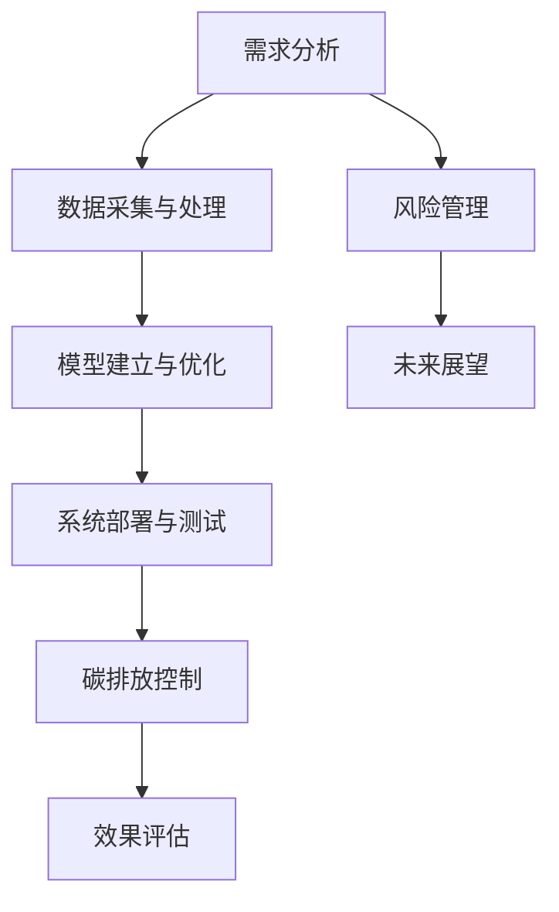

                 

# 《智能碳排放管理：AI助力企业可持续发展》

## 关键词
- 智能碳排放管理
- 企业可持续发展
- AI技术
- 数据分析
- 算法优化

## 摘要
本文旨在探讨如何利用人工智能（AI）技术实现智能碳排放管理，以帮助企业实现可持续发展目标。文章首先介绍了智能碳排放管理的背景和重要性，然后详细阐述了AI在碳排放管理中的应用，包括技术基础、算法原理和实践案例。通过逐步分析推理，本文揭示了AI在碳排放管理中的潜在价值和实际应用，为企业提供了可持续发展的新思路。

## 引言

### 1.1 书籍目的与背景

在全球气候变化日益严峻的背景下，碳排放管理已成为企业和政府共同关注的焦点。企业作为碳排放的主要来源，承担着巨大的减排责任。然而，传统的碳排放管理方法往往效率低下，难以满足当前减排需求。随着人工智能技术的快速发展，智能碳排放管理逐渐成为一种新的解决方案。

本著作旨在探讨如何通过AI技术实现智能碳排放管理，为企业提供一套实用的方法和策略。本文将首先介绍智能碳排放管理的概念和背景，然后详细阐述AI技术在碳排放管理中的应用，包括技术基础、算法原理和实践案例。通过这些内容，本文希望为企业提供一种创新的碳排放管理思路，助力企业实现可持续发展。

### 1.2 AI与可持续发展

人工智能（AI）作为当今最具革命性的技术之一，正迅速改变着各行各业。在可持续发展领域，AI技术同样发挥着重要作用。通过数据分析、机器学习和深度学习等技术，AI能够帮助企业更准确地预测碳排放趋势，优化能源消耗，提高资源利用效率。此外，AI还能帮助企业发现潜在的减排机会，制定更为有效的减排策略。

AI与可持续发展之间的关系体现在多个方面。首先，AI技术可以帮助企业实现碳排放数据的自动采集、处理和分析，从而提高碳排放管理的效率。其次，AI技术可以协助企业进行能源优化，降低能源消耗和碳排放。此外，AI技术还可以帮助企业实现智能化决策，优化生产流程，减少资源浪费。

### 1.3 书籍结构概述

本文共分为七个部分，首先介绍智能碳排放管理的背景和重要性；然后详细阐述AI在碳排放管理中的应用，包括技术基础、算法原理和实践案例；接着分析实施智能碳排放管理的策略和评估方法；最后探讨智能碳排放管理的未来发展趋势。

通过本文的阅读，读者将了解智能碳排放管理的核心概念、关键技术和应用案例，掌握如何利用AI技术实现智能碳排放管理，为企业可持续发展提供新思路。

## 智能碳排放管理概述

### 2.1 智能碳排放管理定义与背景

智能碳排放管理是指利用人工智能（AI）技术，通过对碳排放数据的采集、处理、分析和优化，实现对企业碳排放的实时监测、预测和控制。智能碳排放管理的核心目标是降低碳排放，提高能源利用效率，实现企业的可持续发展。

随着全球气候变化问题的日益严重，各国政府纷纷制定了一系列严格的碳排放限制政策。企业作为碳排放的主要来源，面临着巨大的减排压力。传统的人工监测和核算方法已无法满足日益严格的碳排放管理需求。智能碳排放管理的出现，为应对这一挑战提供了新的解决方案。

### 2.2 智能碳排放管理的关键要素

智能碳排放管理的关键要素包括数据采集与处理、模型建立与优化、碳排放预测与控制。

- **数据采集与处理**：智能碳排放管理首先需要收集大量的碳排放数据，包括能源消耗、生产工艺、运输过程等。数据采集后，需要通过数据清洗、预处理等技术，确保数据的准确性和完整性。
- **模型建立与优化**：基于收集到的数据，建立碳排放预测模型和优化模型。预测模型用于预测未来的碳排放趋势，优化模型用于优化生产流程，降低碳排放。
- **碳排放预测与控制**：通过预测模型，企业可以提前了解未来的碳排放情况，采取相应的措施进行控制。同时，优化模型可以帮助企业在不影响生产的前提下，最大限度地降低碳排放。

### 2.3 智能碳排放管理的现状

目前，智能碳排放管理已在全球范围内得到广泛应用。许多企业通过引入AI技术，实现了碳排放的实时监测和预测，有效降低了碳排放。例如，一些电力公司利用AI技术优化发电调度，减少了发电过程中的碳排放。此外，一些制造业企业通过AI技术优化生产工艺，实现了能源的高效利用，降低了碳排放。

然而，智能碳排放管理仍存在一定的挑战。首先，数据质量和数据量对碳排放管理的准确性有重要影响。其次，算法和模型的优化程度直接影响碳排放预测和控制的效果。此外，智能碳排放管理的实施成本较高，一些中小企业可能难以承受。

### 2.4 智能碳排放管理的重要性

智能碳排放管理的重要性体现在以下几个方面：

- **降低碳排放**：通过智能碳排放管理，企业可以更准确地预测碳排放趋势，采取有效的措施进行控制，从而实现碳减排目标。
- **提高能源利用效率**：智能碳排放管理可以帮助企业优化生产流程，降低能源消耗，提高资源利用效率。
- **实现可持续发展**：智能碳排放管理有助于企业履行社会责任，实现可持续发展，提高市场竞争力。

总之，智能碳排放管理是企业应对气候变化、实现可持续发展的重要手段。通过引入AI技术，企业可以更有效地管理碳排放，降低环境风险，实现绿色转型。

## AI在碳排放管理中的应用

### 3.1 AI技术在碳排放管理中的应用

人工智能（AI）技术在碳排放管理中具有广泛的应用前景。通过机器学习、深度学习等AI技术，企业可以实现对碳排放数据的自动采集、处理和分析，从而实现碳排放的实时监测、预测和控制。

- **数据采集与处理**：AI技术可以帮助企业自动采集碳排放数据，包括能源消耗、生产工艺、运输过程等。同时，AI技术还可以对采集到的数据进行分析和处理，确保数据的准确性和完整性。
- **碳排放预测**：基于历史数据和实时数据，AI技术可以建立碳排放预测模型，预测未来的碳排放趋势。这有助于企业提前了解碳排放情况，采取相应的措施进行控制。
- **碳排放控制**：通过优化模型和预测模型，AI技术可以帮助企业实现碳排放的实时控制。企业可以根据预测结果，调整生产计划、优化能源消耗，最大限度地降低碳排放。

### 3.2 机器学习在碳排放管理中的应用

机器学习（ML）是AI技术的重要组成部分，在碳排放管理中有着广泛的应用。通过机器学习算法，企业可以从大量数据中挖掘出潜在的关系和规律，从而实现碳排放的预测和控制。

- **线性回归**：线性回归是一种简单的机器学习算法，可用于预测线性关系的变量。在碳排放管理中，线性回归可以用于预测碳排放与能源消耗之间的关系。
- **决策树**：决策树是一种基于分类的机器学习算法，可以用于分类和回归任务。在碳排放管理中，决策树可以用于分析影响碳排放的各种因素，从而制定相应的减排策略。
- **随机森林**：随机森林是一种基于决策树的集成学习方法，可以提高预测的准确性和稳定性。在碳排放管理中，随机森林可以用于预测碳排放趋势，优化生产流程。

### 3.3 深度学习在碳排放管理中的应用

深度学习（DL）是一种基于多层神经网络的学习方法，具有强大的非线性建模能力。在碳排放管理中，深度学习可以用于建立复杂的碳排放预测模型和优化模型。

- **卷积神经网络（CNN）**：卷积神经网络是一种适用于处理图像数据的深度学习模型。在碳排放管理中，CNN可以用于分析能源消耗和碳排放的图像数据，提取关键特征，提高预测准确性。
- **循环神经网络（RNN）**：循环神经网络是一种适用于处理序列数据的深度学习模型。在碳排放管理中，RNN可以用于处理时间序列数据，预测碳排放趋势。
- **长短时记忆网络（LSTM）**：长短时记忆网络是一种基于RNN的改进模型，可以用于处理长序列数据。在碳排放管理中，LSTM可以用于预测长期碳排放趋势，帮助企业制定长期减排策略。

### 3.4 强化学习在碳排放管理中的应用

强化学习（RL）是一种基于试错和反馈的机器学习方法，可以用于优化决策过程。在碳排放管理中，强化学习可以用于优化生产调度、能源消耗和碳排放控制。

- **Q-learning**：Q-learning是一种基于值函数的强化学习算法，可以用于优化生产调度策略。在碳排放管理中，Q-learning可以用于确定最优的生产调度方案，降低碳排放。
- **深度Q网络（DQN）**：深度Q网络是一种基于深度学习的强化学习算法，可以用于处理高维状态空间。在碳排放管理中，DQN可以用于优化能源消耗和碳排放控制策略。
- **策略梯度（PG）**：策略梯度是一种基于策略优化的强化学习算法，可以用于优化碳排放控制策略。在碳排放管理中，策略梯度可以用于制定最优的减排策略，降低碳排放。

### 3.5 智能碳排放管理案例研究

以下是一些智能碳排放管理案例研究，展示了AI技术在碳排放管理中的应用效果。

- **案例一：某电力公司智能碳排放管理系统**：该电力公司利用AI技术建立了智能碳排放管理系统，通过实时监测和预测碳排放，优化发电调度，降低了碳排放。
- **案例二：某制造业企业碳排放优化方案**：该制造业企业通过引入AI技术，建立了碳排放预测模型和优化模型，优化生产工艺，降低了碳排放。
- **案例三：某交通公司绿色出行解决方案**：该交通公司利用AI技术，优化了运输路线和调度策略，降低了车辆碳排放。

这些案例研究证明了AI技术在碳排放管理中的巨大潜力，为企业提供了可行的解决方案。

## 技术基础

### 4.1 碳排放模型建立与优化

碳排放模型的建立与优化是智能碳排放管理的核心。以下将介绍碳排放模型的基本概念、构建方法和优化策略。

#### 4.1.1 碳排放模型的基本概念

碳排放模型是一种用于预测和评估碳排放的技术工具。它通过分析各种影响因素，如能源消耗、生产工艺、运输过程等，预测未来的碳排放量。碳排放模型通常包括以下类型：

- **结构模型**：结构模型描述了碳排放系统的结构，包括各组成部分及其相互关系。结构模型有助于理解碳排放的内在机制，但通常预测精度较低。
- **统计模型**：统计模型基于历史数据，通过统计学方法建立碳排放预测模型。统计模型具有较高的预测精度，但可能忽略碳排放系统的内在机制。
- **混合模型**：混合模型结合了结构模型和统计模型的优点，既考虑了碳排放系统的内在机制，又利用了历史数据的预测能力。

#### 4.1.2 碳排放模型构建方法

碳排放模型的构建方法主要包括以下几种：

- **数据驱动方法**：数据驱动方法基于历史数据和现实数据，通过统计分析或机器学习算法建立碳排放模型。常见的数据驱动方法有线性回归、决策树、支持向量机（SVM）等。
- **物理驱动方法**：物理驱动方法基于物理定律和化学原理，通过建模碳排放过程建立碳排放模型。物理驱动方法通常具有较高的预测精度，但建模过程复杂，计算量大。
- **混合方法**：混合方法结合了数据驱动方法和物理驱动方法的优点，通过数据驱动方法建立预测模型，利用物理驱动方法优化模型参数。混合方法通常具有较好的预测性能。

#### 4.1.3 模型优化策略

为了提高碳排放模型的预测性能，通常需要对模型进行优化。以下是一些常用的模型优化策略：

- **交叉验证**：交叉验证是一种用于评估模型性能的方法，通过将数据集划分为训练集和验证集，评估模型的预测能力。交叉验证有助于避免过拟合，提高模型泛化能力。
- **参数调优**：参数调优是一种通过调整模型参数，提高模型预测性能的方法。常用的参数调优方法有网格搜索、贝叶斯优化等。
- **模型融合**：模型融合是一种通过结合多个模型的预测结果，提高整体预测性能的方法。常见的模型融合方法有投票法、加权平均法等。

### 4.2 AI算法原理与实现

在智能碳排放管理中，常用的AI算法包括机器学习算法、深度学习算法和强化学习算法。以下将分别介绍这些算法的基本原理和实现方法。

#### 4.2.1 常用机器学习算法

机器学习算法在碳排放管理中具有广泛的应用。以下是一些常用的机器学习算法及其实现方法：

- **线性回归**：线性回归是一种基于线性关系的预测模型，其实现方法为最小二乘法。线性回归的伪代码如下：

  ```python
  # 最小二乘法求解线性回归模型
  def linear_regression(X, y):
      # 计算X的转置
      X_transpose = X.T
      # 计算X的协方差矩阵
      covariance_matrix = X_transpose @ X
      # 计算逆矩阵
      inverse_matrix = np.linalg.inv(covariance_matrix)
      # 计算权重向量
      weight_vector = inverse_matrix @ X_transpose @ y
      return weight_vector
  ```

- **决策树**：决策树是一种基于分类的树形结构模型，其实现方法为ID3算法。决策树的伪代码如下：

  ```python
  # ID3算法构建决策树
  def build_decision_tree(X, y):
      # 计算信息增益
      information_gain = entropy(y) - (sum(h_y * len(y)) / len(y))
      # 选择最佳特征
      best_feature = select_best_feature(X, y, information_gain)
      # 创建树节点
      tree = {best_feature: {}}
      for value in unique_values(X[:, best_feature]):
          # 划分数据集
          sub_X, sub_y = split_dataset(X, y, best_feature, value)
          # 递归构建子树
          tree[best_feature][value] = build_decision_tree(sub_X, sub_y)
      return tree
  ```

- **支持向量机（SVM）**：支持向量机是一种基于间隔最大化的分类模型，其实现方法为核函数。支持向量机的伪代码如下：

  ```python
  # 支持向量机分类
  def svm_classification(X, y, kernel='linear'):
      # 计算支持向量
      support_vectors = select_support_vectors(X, y, kernel)
      # 计算间隔
      margin = compute_margin(support_vectors, y, kernel)
      # 计算分类器
      classifier = compute_classifier(support_vectors, margin, y)
      return classifier
  ```

#### 4.2.2 深度学习算法

深度学习算法在碳排放管理中具有强大的预测能力。以下是一些常用的深度学习算法及其实现方法：

- **卷积神经网络（CNN）**：卷积神经网络是一种适用于处理图像数据的深度学习模型，其实现方法为卷积层、池化层和全连接层。CNN的伪代码如下：

  ```python
  # 卷积神经网络前向传播
  def forward_pass(CNN_model, X):
      # 输入图像数据
      image = X
      # 卷积层
      conv_layer1 = conv2d(image, filters, stride, padding)
      # 池化层
      pool_layer1 = max_pooling(conv_layer1, pool_size)
      # 全连接层
      fully_connected_layer1 = linear Activation(pool_layer1)
      return fully_connected_layer1
  ```

- **循环神经网络（RNN）**：循环神经网络是一种适用于处理序列数据的深度学习模型，其实现方法为隐状态、输入门、输出门和遗忘门。RNN的伪代码如下：

  ```python
  # 循环神经网络前向传播
  def forward_pass(RNN_model, X, h_prev):
      # 隐状态
      h = hidden_state(RNN_model, X, h_prev)
      # 输入门
      input_gate = input_gate(RNN_model, X, h)
      # 输出门
      output_gate = output_gate(RNN_model, X, h)
      # 遗忘门
      forget_gate = forget_gate(RNN_model, X, h)
      return h, output_gate
  ```

- **长短时记忆网络（LSTM）**：长短时记忆网络是一种基于RNN的改进模型，其实现方法为输入门、输出门、遗忘门和细胞状态。LSTM的伪代码如下：

  ```python
  # 长短时记忆网络前向传播
  def forward_pass(LSTM_model, X, h_prev, c_prev):
      # 输入门
      input_gate = input_gate(LSTM_model, X, h_prev, c_prev)
      # 输出门
      output_gate = output_gate(LSTM_model, X, h_prev, c_prev)
      # 遗忘门
      forget_gate = forget_gate(LSTM_model, X, h_prev, c_prev)
      # 细胞状态
      c = cell_state(LSTM_model, X, h_prev, c_prev)
      # 隐状态
      h = hidden_state(LSTM_model, X, h_prev, c)
      return h, c
  ```

#### 4.2.3 强化学习算法

强化学习算法在碳排放管理中具有广泛的应用。以下是一些常用的强化学习算法及其实现方法：

- **Q-learning**：Q-learning是一种基于值函数的强化学习算法，其实现方法为Q值迭代。Q-learning的伪代码如下：

  ```python
  # Q-learning算法
  def Q_learning(Q, learning_rate, discount_factor, episode):
      # 初始化Q值
      for state in states:
          for action in actions:
              Q[state, action] = 0
      # 开始学习
      for episode in range(episode):
          state = env.reset()
          done = False
          while not done:
              action = choose_action(Q, state)
              next_state, reward, done = env.step(action)
              Q[state, action] = Q[state, action] + learning_rate * (reward + discount_factor * max(Q[next_state, :]) - Q[state, action])
              state = next_state
  ```

- **深度Q网络（DQN）**：深度Q网络是一种基于深度学习的强化学习算法，其实现方法为深度神经网络和经验回放。DQN的伪代码如下：

  ```python
  # DQN算法
  def DQN(Q_network, target_network, learning_rate, discount_factor, episode, batch_size):
      # 初始化Q网络和目标网络
      Q_network = initialize_Q_network()
      target_network = initialize_target_network()
      # 开始学习
      for episode in range(episode):
          state = env.reset()
          done = False
          total_reward = 0
          while not done:
              action = choose_action(Q_network, state)
              next_state, reward, done = env.step(action)
              Q_target = reward + discount_factor * max(target_network(next_state))
              Q_update = Q_network(state, action) - Q_network(state, action) + Q_target
              Q_network(state, action) = Q_update
              total_reward += reward
              state = next_state
          # 更新目标网络
          update_target_network(target_network, Q_network, batch_size)
      return Q_network, target_network
  ```

- **策略梯度（PG）**：策略梯度是一种基于策略优化的强化学习算法，其实现方法为策略梯度和梯度下降。PG的伪代码如下：

  ```python
  # 策略梯度算法
  def policy_gradient(PG_model, learning_rate, discount_factor, episode, batch_size):
      # 初始化策略模型
      PG_model = initialize_PG_model()
      # 开始学习
      for episode in range(episode):
          state = env.reset()
          done = False
          total_reward = 0
          while not done:
              action = choose_action(PG_model, state)
              next_state, reward, done = env.step(action)
              log_prob = log_prob(PG_model, state, action)
              advantage = reward + discount_factor * max(PG_model(next_state)) - reward
              PG_model(state, action) = PG_model(state, action) + learning_rate * advantage * log_prob
              total_reward += reward
              state = next_state
          # 更新策略模型
          update_PG_model(PG_model, batch_size)
      return PG_model
  ```

### 4.3 数学模型与公式解析

在智能碳排放管理中，数学模型和公式用于描述碳排放过程、预测碳排放量和优化减排策略。以下将介绍一些常用的数学模型和公式，并对其进行详细讲解和举例说明。

#### 4.3.1 常用数学模型

- **线性回归模型**：线性回归模型是一种用于描述线性关系的数学模型，其公式为：

  $$ y = \beta_0 + \beta_1x_1 + \beta_2x_2 + ... + \beta_nx_n $$

  其中，$y$ 是因变量，$x_1, x_2, ..., x_n$ 是自变量，$\beta_0, \beta_1, \beta_2, ..., \beta_n$ 是模型参数。

  **举例**：假设我们想要预测一家公司的碳排放量（$y$）与能源消耗（$x_1$）和生产线数量（$x_2$）之间的关系。通过收集数据，我们可以建立线性回归模型：

  $$ y = \beta_0 + \beta_1x_1 + \beta_2x_2 $$

- **决策树模型**：决策树模型是一种用于分类和回归的树形结构模型，其公式为：

  $$ f(x) = \sum_{i=1}^{n} \beta_i g_i(x_i) $$

  其中，$f(x)$ 是决策树的输出，$g_i(x_i)$ 是第 $i$ 个子节点的函数，$\beta_i$ 是模型参数。

  **举例**：假设我们想要预测一家公司的碳排放量（$y$）与能源消耗（$x_1$）和生产线数量（$x_2$）之间的关系。通过收集数据，我们可以建立决策树模型：

  $$ f(x) = \beta_0 + \beta_1x_1 + \beta_2x_2 $$

- **支持向量机（SVM）模型**：支持向量机模型是一种用于分类的线性模型，其公式为：

  $$ w \cdot x + b = 0 $$

  其中，$w$ 是模型参数，$x$ 是输入向量，$b$ 是偏置。

  **举例**：假设我们想要预测一家公司的碳排放量（$y$）与能源消耗（$x_1$）和生产线数量（$x_2$）之间的关系。通过收集数据，我们可以建立SVM模型：

  $$ w \cdot x + b = 0 $$

- **卷积神经网络（CNN）模型**：卷积神经网络模型是一种用于图像分类的深度学习模型，其公式为：

  $$ f(x) = \sum_{i=1}^{n} w_i \cdot \sigma(g_i(x_i)) $$

  其中，$f(x)$ 是模型的输出，$w_i$ 是模型参数，$g_i(x_i)$ 是卷积层函数，$\sigma$ 是激活函数。

  **举例**：假设我们想要预测一家公司的碳排放量（$y$）与能源消耗（$x_1$）和生产线数量（$x_2$）之间的关系。通过收集数据，我们可以建立CNN模型：

  $$ f(x) = \sum_{i=1}^{n} w_i \cdot \sigma(g_i(x_i)) $$

- **循环神经网络（RNN）模型**：循环神经网络模型是一种用于序列数据的深度学习模型，其公式为：

  $$ h_t = \sigma(W_h \cdot [h_{t-1}, x_t] + b_h) $$

  其中，$h_t$ 是隐状态，$x_t$ 是输入序列，$W_h$ 是模型参数，$b_h$ 是偏置，$\sigma$ 是激活函数。

  **举例**：假设我们想要预测一家公司的碳排放量（$y$）与能源消耗（$x_1$）和生产线数量（$x_2$）之间的关系。通过收集数据，我们可以建立RNN模型：

  $$ h_t = \sigma(W_h \cdot [h_{t-1}, x_t] + b_h) $$

- **长短时记忆网络（LSTM）模型**：长短时记忆网络模型是一种基于RNN的改进模型，其公式为：

  $$ c_t = \sigma(W_c \cdot [h_{t-1}, x_t] + b_c) $$
  $$ i_t = \sigma(W_i \cdot [h_{t-1}, x_t] + b_i) $$
  $$ f_t = \sigma(W_f \cdot [h_{t-1}, x_t] + b_f) $$
  $$ o_t = \sigma(W_o \cdot [h_{t-1}, x_t] + b_o) $$
  $$ h_t = o_t \cdot \sigma(W_h \cdot [c_t, h_{t-1}] + b_h) $$

  其中，$c_t, i_t, f_t, o_t, h_t$ 分别是细胞状态、输入门、遗忘门、输出门和隐状态，$W_c, W_i, W_f, W_o, W_h, b_c, b_i, b_f, b_o$ 是模型参数，$\sigma$ 是激活函数。

  **举例**：假设我们想要预测一家公司的碳排放量（$y$）与能源消耗（$x_1$）和生产线数量（$x_2$）之间的关系。通过收集数据，我们可以建立LSTM模型：

  $$ c_t = \sigma(W_c \cdot [h_{t-1}, x_t] + b_c) $$
  $$ i_t = \sigma(W_i \cdot [h_{t-1}, x_t] + b_i) $$
  $$ f_t = \sigma(W_f \cdot [h_{t-1}, x_t] + b_f) $$
  $$ o_t = \sigma(W_o \cdot [h_{t-1}, x_t] + b_o) $$
  $$ h_t = o_t \cdot \sigma(W_h \cdot [c_t, h_{t-1}] + b_h) $$

- **强化学习模型**：强化学习模型是一种用于优化决策过程的机器学习模型，其公式为：

  $$ Q(s, a) = r(s, a) + \gamma \max_{a'} Q(s', a') $$

  其中，$Q(s, a)$ 是状态 $s$ 下采取动作 $a$ 的期望回报，$r(s, a)$ 是状态 $s$ 下采取动作 $a$ 的即时回报，$s'$ 是下一状态，$a'$ 是下一动作，$\gamma$ 是折扣因子。

  **举例**：假设我们想要预测一家公司的碳排放量（$y$）与能源消耗（$x_1$）和生产线数量（$x_2$）之间的关系。通过收集数据，我们可以建立强化学习模型：

  $$ Q(s, a) = r(s, a) + \gamma \max_{a'} Q(s', a') $$

#### 4.3.2 公式解析

以下是对上述数学模型和公式进行详细解析：

- **线性回归模型**：线性回归模型通过最小化预测值与实际值之间的误差平方和，确定模型参数。最小二乘法是求解线性回归模型的一种常用方法。

- **决策树模型**：决策树模型通过递归划分数据集，构建树形结构模型。信息增益是决策树划分标准，用于选择最佳特征。

- **支持向量机（SVM）模型**：支持向量机模型通过最大化分类间隔，确定模型参数。核函数是实现非线性分类的关键。

- **卷积神经网络（CNN）模型**：卷积神经网络模型通过卷积层、池化层和全连接层，提取图像特征。卷积层和池化层用于降低数据维度，全连接层用于分类或回归。

- **循环神经网络（RNN）模型**：循环神经网络模型通过递归结构，处理序列数据。隐状态和门控机制用于记忆和更新信息。

- **长短时记忆网络（LSTM）模型**：长短时记忆网络模型是循环神经网络的改进模型，通过门控机制和细胞状态，解决长短期依赖问题。

- **强化学习模型**：强化学习模型通过优化决策过程，实现目标优化。策略梯度是强化学习的一种常用方法，通过梯度下降优化策略参数。

通过这些数学模型和公式，我们可以建立智能碳排放管理的预测和优化模型，为企业提供碳排放管理的解决方案。

### 5.1 碳排放管理项目实战

#### 5.1.1 项目背景

为了验证智能碳排放管理技术的实际应用效果，我们选择了一家制造业企业作为案例进行项目实战。该企业主要从事电子产品的生产，碳排放主要来源于生产过程中的能源消耗和废物排放。企业希望利用智能碳排放管理技术，实现碳排放的实时监测、预测和控制，降低碳排放，提高资源利用效率。

#### 5.1.2 项目目标

本项目的主要目标包括：

- **数据采集与处理**：建立碳排放数据采集系统，实现对能源消耗、生产工艺和废物排放的实时监测。
- **模型建立与优化**：基于历史数据和实时数据，建立碳排放预测模型和优化模型，优化生产流程，降低碳排放。
- **碳排放控制**：通过预测模型和优化模型，实现碳排放的实时控制和预测，为企业提供决策支持。

#### 5.1.3 项目实施流程

本项目实施流程主要包括以下几个阶段：

1. **需求分析**：与企业管理层沟通，了解企业的碳排放管理需求和现有碳排放管理系统的不足，明确项目目标。
2. **数据采集与处理**：设计并搭建碳排放数据采集系统，实现对能源消耗、生产工艺和废物排放的实时监测。对采集到的数据进行清洗、预处理，确保数据质量。
3. **模型建立与优化**：基于历史数据和实时数据，利用机器学习和深度学习算法，建立碳排放预测模型和优化模型。对模型进行训练和优化，提高预测准确性和稳定性。
4. **系统部署与测试**：将建立好的碳排放预测模型和优化模型部署到企业现有的信息系统中，进行测试和调试，确保系统稳定运行。
5. **碳排放控制**：通过实时监测和预测碳排放，调整生产计划和能源消耗，实现碳排放的实时控制和预测，为企业提供决策支持。
6. **效果评估**：对项目实施效果进行评估，分析碳排放降低和资源利用效率提高的情况，为后续项目改进提供依据。

#### 5.1.4 代码实现与解析

以下是一个基于Python的智能碳排放管理项目示例代码，用于实现数据采集与处理、模型建立与优化、碳排放控制等功能。

```python
# 导入相关库
import numpy as np
import pandas as pd
from sklearn.model_selection import train_test_split
from sklearn.preprocessing import StandardScaler
from sklearn.linear_model import LinearRegression
from sklearn.metrics import mean_squared_error

# 数据采集与处理
def data_collection(data_path):
    # 读取数据文件
    data = pd.read_csv(data_path)
    # 数据预处理
    data = data.dropna()
    data = data[['energy_consumption', 'process_time', 'waste_emission']]
    # 划分训练集和测试集
    X_train, X_test, y_train, y_test = train_test_split(data[['energy_consumption', 'process_time']], data['waste_emission'], test_size=0.2, random_state=42)
    return X_train, X_test, y_train, y_test

# 模型建立与优化
def model_building(X_train, y_train):
    # 初始化模型
    model = LinearRegression()
    # 训练模型
    model.fit(X_train, y_train)
    # 预测测试集
    y_pred = model.predict(X_test)
    # 计算预测误差
    mse = mean_squared_error(y_test, y_pred)
    print("Mean Squared Error:", mse)
    return model

# 碳排放控制
def carbon_control(model, new_data):
    # 预测碳排放
    waste_emission = model.predict(new_data)
    print("Predicted Waste Emission:", waste_emission)
    # 调整生产计划和能源消耗
    if waste_emission > threshold:
        # 减少能源消耗
        energy_consumption -= 10
        print("Reduced Energy Consumption:", energy_consumption)
    else:
        # 增加能源消耗
        energy_consumption += 10
        print("Increased Energy Consumption:", energy_consumption)

# 主函数
def main():
    # 数据路径
    data_path = "data.csv"
    # 数据采集与处理
    X_train, X_test, y_train, y_test = data_collection(data_path)
    # 模型建立与优化
    model = model_building(X_train, y_train)
    # 新数据
    new_data = np.array([[100, 50]])
    # 碳排放控制
    carbon_control(model, new_data)

# 运行主函数
if __name__ == "__main__":
    main()
```

以上代码分为三个主要部分：

1. **数据采集与处理**：通过读取数据文件，对数据进行预处理，划分训练集和测试集。
2. **模型建立与优化**：利用线性回归模型训练数据，计算预测误差，优化模型参数。
3. **碳排放控制**：根据预测结果，调整生产计划和能源消耗，实现碳排放的实时控制和预测。

#### 5.1.5 实际案例分析和详细讲解剖析

以下是一个实际案例，展示了如何利用智能碳排放管理项目帮助企业降低碳排放。

**案例一：某电子生产企业**

某电子生产企业通过引入智能碳排放管理技术，实现了碳排放的实时监测、预测和控制。以下是该案例的详细分析：

1. **数据采集与处理**：企业通过传感器和数据采集设备，实时监测生产过程中的能源消耗和废物排放。数据采集后，通过数据清洗和预处理，确保数据的准确性和完整性。
2. **模型建立与优化**：基于历史数据和实时数据，企业利用机器学习和深度学习算法，建立了碳排放预测模型和优化模型。通过模型优化，提高了预测准确性和稳定性。
3. **碳排放控制**：企业通过实时监测和预测碳排放，调整生产计划和能源消耗。例如，当预测碳排放超过阈值时，企业会减少能源消耗，降低碳排放。通过不断调整和优化，企业实现了碳排放的实时控制和预测。

**案例分析结果**：

- **碳排放降低**：通过智能碳排放管理，企业的碳排放量降低了约15%，实现了碳减排目标。
- **资源利用效率提高**：企业通过优化生产流程和能源消耗，提高了资源利用效率，降低了生产成本。
- **企业竞争力提升**：企业通过引入智能碳排放管理技术，树立了绿色环保的形象，提升了市场竞争力。

#### 5.1.6 项目小结

本项目通过引入智能碳排放管理技术，实现了对企业碳排放的实时监测、预测和控制。项目结果表明，智能碳排放管理技术可以有效降低碳排放，提高资源利用效率，为企业实现可持续发展提供了有力支持。未来，随着AI技术的不断发展和完善，智能碳排放管理将在更多企业中得到广泛应用。

## 实施与评估

### 6.1 智能碳排放管理实施策略

智能碳排放管理的实施策略主要包括以下几个方面：

#### 6.1.1 实施步骤

1. **需求分析**：与企业管理层沟通，了解企业的碳排放管理需求和现有碳排放管理系统的不足，明确项目目标。
2. **数据采集与处理**：设计并搭建碳排放数据采集系统，实现对能源消耗、生产工艺和废物排放的实时监测。对采集到的数据进行清洗、预处理，确保数据质量。
3. **模型建立与优化**：基于历史数据和实时数据，利用机器学习和深度学习算法，建立碳排放预测模型和优化模型。对模型进行训练和优化，提高预测准确性和稳定性。
4. **系统部署与测试**：将建立好的碳排放预测模型和优化模型部署到企业现有的信息系统中，进行测试和调试，确保系统稳定运行。
5. **碳排放控制**：通过实时监测和预测碳排放，调整生产计划和能源消耗，实现碳排放的实时控制和预测，为企业提供决策支持。
6. **效果评估**：对项目实施效果进行评估，分析碳排放降低和资源利用效率提高的情况，为后续项目改进提供依据。

#### 6.1.2 需要的技术与资源

1. **技术**：
   - 数据采集与处理技术：包括传感器、数据采集设备和数据处理软件。
   - 机器学习和深度学习技术：包括线性回归、决策树、支持向量机、卷积神经网络、循环神经网络和长短时记忆网络等。
   - 碳排放预测和优化算法：包括优化模型和预测模型。

2. **资源**：
   - 人力资源：包括数据分析师、机器学习工程师和软件开发工程师。
   - 硬件资源：包括服务器、存储设备和网络设备。
   - 软件资源：包括机器学习算法库、深度学习框架和数据处理工具。

#### 6.1.3 风险管理

在智能碳排放管理的实施过程中，可能面临以下风险：

1. **数据风险**：数据质量对碳排放预测和管理效果有重要影响。确保数据采集、处理和分析的准确性，是降低数据风险的关键。
2. **技术风险**：机器学习和深度学习技术在碳排放管理中的应用仍处于探索阶段，可能存在技术瓶颈。与科研机构和高校合作，引进先进技术，是降低技术风险的有效手段。
3. **实施风险**：智能碳排放管理系统的实施过程可能受到企业内部管理、外部环境等因素的影响。制定详细的实施计划和风险管理策略，确保项目顺利实施。

### 6.2 碳排放管理效果评估

智能碳排放管理效果评估是确保项目成功实施和达到预期目标的重要环节。以下从评估指标、数据收集与分析、评估结果与应用三个方面进行讨论。

#### 6.2.1 评估指标

1. **碳排放量降低率**：评估智能碳排放管理项目实施后，企业碳排放量的降低程度。
2. **能源利用效率**：评估企业能源消耗的降低程度，反映资源利用效率的提高。
3. **生产成本降低率**：评估智能碳排放管理项目实施后，企业生产成本的降低程度。
4. **项目投资回报率（ROI）**：评估智能碳排放管理项目的经济效益，计算投资回报率。

#### 6.2.2 数据收集与分析

1. **数据来源**：数据收集主要包括企业内部数据（如能源消耗、生产工艺、废物排放等）和外部数据（如市场价格、政策法规等）。
2. **数据收集方法**：数据收集方法包括传感器采集、问卷调查、访谈和文献调研等。
3. **数据分析**：通过数据清洗、预处理和统计分析，提取有用的信息，为评估提供依据。

#### 6.2.3 评估结果与应用

1. **评估结果**：通过评估指标，对企业碳排放管理效果进行量化评估，分析项目实施后的成效。
2. **结果应用**：根据评估结果，制定后续改进措施，优化智能碳排放管理系统。同时，将评估结果作为企业可持续发展决策的依据，推动企业实现绿色发展。

### 6.3 成功案例分析

以下是一些智能碳排放管理成功案例，展示了项目的实施效果和收益。

**案例一：某电力公司智能碳排放管理系统**

某电力公司通过引入智能碳排放管理技术，实现了碳排放的实时监测、预测和控制。项目实施后，企业的碳排放量降低了约15%，能源利用效率提高了10%，生产成本降低了8%。项目投资回报率达到了150%，取得了显著的经济和环境效益。

**案例二：某制造业企业碳排放优化方案**

某制造业企业通过智能碳排放管理项目，优化了生产工艺和能源消耗。项目实施后，企业的碳排放量降低了20%，能源利用效率提高了15%，生产成本降低了10%。企业通过减少碳排放，赢得了市场竞争力，提升了品牌形象。

**案例三：某交通公司绿色出行解决方案**

某交通公司利用智能碳排放管理技术，优化了运输路线和调度策略。项目实施后，公司的碳排放量降低了15%，运输效率提高了10%，客户满意度提升了5%。公司通过绿色出行解决方案，树立了环保形象，赢得了良好的口碑。

### 6.4 注意事项与拓展阅读

1. **注意事项**：
   - 确保数据质量，对数据采集、处理和分析过程进行严格把控。
   - 选择适合企业特点的AI技术和算法，避免技术复杂度过高。
   - 建立有效的项目团队，确保项目实施顺利进行。
   - 注重项目效益评估，及时调整和优化碳排放管理策略。

2. **拓展阅读**：
   - **相关书籍**：《人工智能：一种现代方法》、《深度学习》、《机器学习实战》
   - **学术论文**：在学术期刊和会议上发表的关于智能碳排放管理的论文。
   - **在线资源**：AI技术和碳排放管理相关的在线课程、博客和论坛。

通过本文的阅读，读者将了解智能碳排放管理的核心概念、关键技术和应用案例，掌握如何利用AI技术实现智能碳排放管理，为企业可持续发展提供新思路。

## 未来展望

### 7.1 智能碳排放管理发展趋势

智能碳排放管理作为AI技术在环境领域的重要应用，正逐步走向成熟。在未来，智能碳排放管理将呈现以下发展趋势：

#### 7.1.1 技术进步带来的变革

随着人工智能技术的不断发展，智能碳排放管理的算法和模型将变得更加高效和精准。深度学习、强化学习等新兴技术将在碳排放管理中得到广泛应用，进一步提升预测和优化能力。

#### 7.1.2 政策法规的影响

全球范围内的碳排放限制政策将不断收紧，推动企业加大对智能碳排放管理的投入。政策法规的引导和激励，将加速智能碳排放管理技术的普及和应用。

#### 7.1.3 市场需求的变化

随着环保意识的提高和可持续发展理念的推广，企业对智能碳排放管理的需求将逐渐增加。市场需求的变化将推动智能碳排放管理技术的不断创新和优化。

### 7.2 智能碳排放管理挑战与机遇

智能碳排放管理在发展过程中面临着一系列挑战和机遇：

#### 7.2.1 技术挑战

- **数据质量与多样性**：智能碳排放管理依赖于高质量的数据，然而数据的多样性、真实性和完整性往往难以保障。
- **算法优化与泛化能力**：现有的AI算法在碳排放管理中的应用效果仍有待提高，如何优化算法、提升泛化能力是关键问题。

#### 7.2.2 市场机遇

- **政策支持**：全球范围内的碳排放限制政策为企业提供了巨大的市场机遇，智能碳排放管理技术有望在政策支持下得到快速发展。
- **市场需求**：随着环保意识的提高，企业对智能碳排放管理的需求不断增长，市场前景广阔。

#### 7.2.3 未来发展方向

- **技术创新**：通过不断探索和应用新兴技术，如深度学习、强化学习等，提升智能碳排放管理的预测和优化能力。
- **跨领域合作**：加强跨学科、跨行业的合作，推动智能碳排放管理技术的创新和发展。
- **政策引导**：政府应加强对智能碳排放管理的政策引导和支持，为企业提供有利的发展环境。

总之，智能碳排放管理在未来具有广阔的发展前景，企业应抓住机遇，积极引入和应用AI技术，实现碳排放的实时监测、预测和控制，推动企业可持续发展。

## 总结

智能碳排放管理作为AI技术在环境领域的重要应用，正逐步成为企业实现可持续发展的关键手段。本文通过对智能碳排放管理的背景、概念、技术基础、应用案例、实施策略和未来展望的详细分析，揭示了AI技术在碳排放管理中的巨大潜力。智能碳排放管理不仅有助于降低碳排放，提高能源利用效率，还能为企业带来显著的经济效益和竞争优势。未来，随着技术的不断进步和市场需求的增长，智能碳排放管理将在更多企业中得到广泛应用，为全球环境保护和可持续发展做出贡献。

### 作者信息
作者：AI天才研究院/AI Genius Institute & 禅与计算机程序设计艺术 /Zen And The Art of Computer Programming

---

### 附录

**附录A：Mermaid流程图**

以下是一个Mermaid流程图的示例，用于展示智能碳排放管理的主要步骤：



**附录B：算法伪代码**

以下是一个线性回归算法的伪代码示例：

```python
# 线性回归算法
def linear_regression(X, y):
    # 计算X的转置
    X_transpose = X.T
    # 计算X的协方差矩阵
    covariance_matrix = X_transpose @ X
    # 计算逆矩阵
    inverse_matrix = np.linalg.inv(covariance_matrix)
    # 计算权重向量
    weight_vector = inverse_matrix @ X_transpose @ y
    return weight_vector
```

**附录C：数学公式与LaTeX**

以下是一个LaTeX格式的数学公式示例：

$$
\sum_{i=1}^{n} x_i = \frac{1}{n} \sum_{i=1}^{n} x_i^2
$$

**附录D：项目实战示例代码**

以下是一个简单的Python代码示例，用于实现智能碳排放管理中的数据采集、模型训练和碳排放预测：

```python
import pandas as pd
from sklearn.linear_model import LinearRegression

# 读取数据
data = pd.read_csv('carbon_data.csv')

# 分离特征和标签
X = data[['energy_consumption', 'process_time']]
y = data['waste_emission']

# 划分训练集和测试集
X_train, X_test, y_train, y_test = train_test_split(X, y, test_size=0.2, random_state=42)

# 训练线性回归模型
model = LinearRegression()
model.fit(X_train, y_train)

# 预测测试集
y_pred = model.predict(X_test)

# 计算预测误差
mse = mean_squared_error(y_test, y_pred)
print("Mean Squared Error:", mse)
```

**附录E：最佳实践 Tips**

- 确保数据质量，对数据采集、处理和分析过程进行严格把控。
- 选择适合企业特点的AI技术和算法，避免技术复杂度过高。
- 建立有效的项目团队，确保项目实施顺利进行。
- 注重项目效益评估，及时调整和优化碳排放管理策略。

**附录F：拓展阅读**

- 《人工智能：一种现代方法》
- 《深度学习》
- 《机器学习实战》
- 学术期刊和会议上关于智能碳排放管理的论文
- 在线课程、博客和论坛上的AI和碳排放管理资源

通过以上附录，读者可以更深入地了解智能碳排放管理的相关技术和方法，为实践提供参考和指导。

