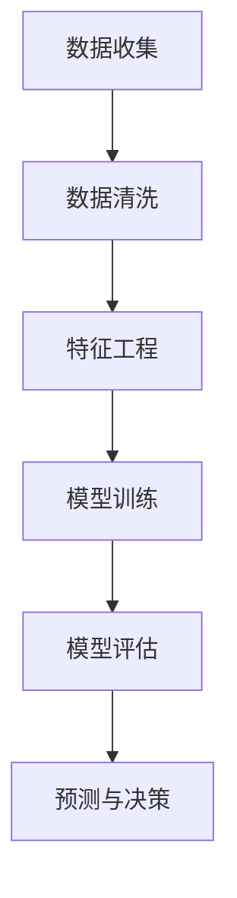

                 


### 概述

#### 智能绩效预测模型简介

智能绩效预测模型是一种利用人工智能技术，特别是机器学习算法，对组织或个人绩效进行预测的先进工具。它不仅能够提高绩效评估的准确性，还能为企业的战略规划和业务决策提供科学依据。随着大数据和人工智能技术的不断发展，智能绩效预测模型的应用越来越广泛，成为现代企业管理的重要手段之一。

#### 关键词

- **智能绩效预测模型**
- **人工智能**
- **机器学习**
- **业务目标**
- **绩效评估**
- **数据驱动决策**
- **算法优化**
- **模型评估**

#### 摘要

本文将深入探讨智能绩效预测模型在业务目标制定中的应用。我们将首先介绍模型的基本概念和重要性，然后详细解释其理论基础和核心算法原理。接着，通过实际案例展示模型如何被应用于商业场景，并讨论其性能评估和扩展应用。最后，我们将对模型进行总结，并提出未来发展的展望。

### 第一步：概述

#### 1.1 智能绩效预测模型的概念与重要性

智能绩效预测模型是一种利用数据分析和机器学习技术，对组织或个人的绩效进行预测的模型。它通过对历史数据的分析和挖掘，能够预测出在未来一段时间内，个体或组织的绩效表现。这种预测不仅局限于单一指标，如销售额或生产效率，还可以综合多个维度，如员工的工作态度、团队协作情况等，从而提供更为全面的绩效评估。

智能绩效预测模型的重要性体现在以下几个方面：

1. **提高绩效评估准确性**：传统的绩效评估方法往往依赖于主观评价，容易受到主观偏见的影响。而智能绩效预测模型通过数据驱动的方式，减少了人为因素的干扰，使得评估结果更加客观和准确。

2. **优化人力资源配置**：通过智能绩效预测模型，企业可以更好地了解员工的能力和潜力，从而在人员配置上做出更为合理的决策。例如，将高绩效员工分配到关键岗位上，提升整体业绩。

3. **战略规划与业务决策**：智能绩效预测模型可以为企业提供关于未来绩效表现的预测，帮助企业在制定战略规划和业务决策时，更加有针对性和前瞻性。

4. **提高管理效率**：智能绩效预测模型能够自动化处理大量的数据，提高了绩效评估的效率和准确性，减轻了管理人员的工作负担。

#### 1.2 AI在绩效预测中的应用

人工智能在绩效预测中的应用主要依赖于机器学习技术，特别是监督学习和无监督学习。以下是几种常见的机器学习算法在绩效预测中的应用：

1. **线性回归**：线性回归是一种最简单的机器学习算法，适用于预测连续值变量。在绩效预测中，可以使用线性回归模型来预测员工的绩效得分。

2. **决策树**：决策树是一种基于树形模型的算法，适用于分类和回归任务。在绩效预测中，可以使用决策树模型来预测员工是否能够达成目标。

3. **随机森林**：随机森林是一种基于决策树的集成算法，通过构建多个决策树，并取它们的平均结果来提高预测准确性。在绩效预测中，随机森林通常比单一的决策树模型有更好的性能。

4. **支持向量机**：支持向量机是一种基于间隔的线性模型，适用于分类和回归任务。在绩效预测中，可以使用支持向量机模型来预测员工的绩效表现。

5. **神经网络**：神经网络是一种基于模拟人脑的算法，适用于复杂的非线性关系预测。在绩效预测中，可以使用神经网络模型来预测员工的绩效得分。

#### 1.3 模型的架构与组成

智能绩效预测模型的架构通常包括以下几个部分：

1. **数据收集**：收集与绩效相关的数据，如员工的工作时间、工作质量、客户反馈等。

2. **数据预处理**：对收集到的数据进行清洗和预处理，包括缺失值填补、异常值处理、数据标准化等。

3. **特征工程**：从原始数据中提取有用的特征，如员工的工作时长、工作效率、客户满意度等。

4. **模型训练**：使用机器学习算法对特征和目标变量进行训练，构建预测模型。

5. **模型评估**：使用交叉验证、ROC曲线、AUC值等评估指标对模型进行评估，以确定模型的性能。

6. **预测与决策**：使用训练好的模型对新的数据进行预测，并根据预测结果制定相应的业务决策。

### 第二步：理论基础

#### 2.1 相关性能指标

在智能绩效预测模型中，性能指标是评估模型性能的重要工具。以下是一些常见的性能指标：

1. **准确率**：准确率是评估模型分类能力的指标，表示模型正确分类的样本数占总样本数的比例。准确率的计算公式为：
   $$ 准确率 = \frac{TP + TN}{TP + FN + TN + FP} $$
   其中，TP表示真正例，TN表示真反例，FP表示假正例，FN表示假反例。

2. **召回率**：召回率是评估模型对正类别的检测能力，表示模型正确检测到的正例数与正例总数之比。召回率的计算公式为：
   $$ 召回率 = \frac{TP}{TP + FP} $$

3. **精确率**：精确率是评估模型对负类别的检测能力，表示模型正确检测到的负例数与检测到的总负例数之比。精确率的计算公式为：
   $$ 精确率 = \frac{TN}{TN + FP} $$

4. **F1值**：F1值是精确率和召回率的调和平均，用于综合评估模型的性能。F1值的计算公式为：
   $$ F1值 = 2 \times \frac{精确率 \times 召回率}{精确率 + 召回率} $$

5. **ROC曲线和AUC值**：ROC曲线是评估模型分类性能的一种图形工具，通过绘制真阳性率（召回率）与假阳性率（1 - 精确率）之间的关系曲线。AUC值是ROC曲线下方的面积，用于评估模型的区分能力。AUC值的范围在0到1之间，值越大表示模型的性能越好。

#### 2.2 数据收集与处理

智能绩效预测模型的数据来源可以包括内部数据和外部数据。内部数据通常来自企业的业务系统，如员工绩效记录、销售数据、客户反馈等。外部数据可以来自公共数据库、第三方数据服务提供商等。

数据收集与处理的过程通常包括以下几个步骤：

1. **数据收集**：通过数据爬取、API接口、数据库导出等方式收集数据。

2. **数据清洗**：对收集到的数据进行清洗，包括缺失值填补、异常值处理、数据格式统一等。

3. **数据预处理**：对清洗后的数据进行预处理，包括数据标准化、归一化、特征提取等。

4. **数据存储**：将处理后的数据存储到数据库或数据仓库中，以便后续分析和处理。

#### 2.3 模型原理与联系

智能绩效预测模型的核心在于建立合适的数学模型，并通过机器学习算法对模型进行训练和优化。以下是智能绩效预测模型的基本原理和联系：

1. **线性回归模型**：线性回归模型是一种常用的机器学习算法，用于预测连续值变量。线性回归模型的数学公式为：
   $$ y = w_0 + w_1 \times x_1 + w_2 \times x_2 + ... + w_n \times x_n $$
   其中，$y$ 是预测目标变量，$w_0, w_1, ..., w_n$ 是模型参数，$x_1, x_2, ..., x_n$ 是特征变量。

2. **决策树模型**：决策树模型是一种基于树形结构的算法，通过一系列条件判断来预测结果。决策树的数学模型可以表示为：
   $$ f(x) = \sum_{i=1}^{n} c_i \times I(T_i(x) = t_i) $$
   其中，$f(x)$ 是决策树模型的预测结果，$c_i$ 是第$i$个节点的类别，$T_i(x)$ 是第$i$个节点的条件函数，$t_i$ 是条件值。

3. **随机森林模型**：随机森林模型是一种基于决策树的集成算法，通过构建多个决策树，并取它们的平均结果来提高预测准确性。随机森林的数学模型可以表示为：
   $$ \hat{y} = \frac{1}{M} \sum_{m=1}^{M} f_m(x) $$
   其中，$\hat{y}$ 是随机森林的预测结果，$M$ 是决策树的数量，$f_m(x)$ 是第$m$个决策树的预测结果。

4. **神经网络模型**：神经网络模型是一种基于模拟人脑的算法，通过多层神经元之间的连接来预测结果。神经网络的数学模型可以表示为：
   $$ \hat{y} = \sigma(\sum_{i=1}^{n} w_i \times x_i + b) $$
   其中，$\hat{y}$ 是神经网络的预测结果，$\sigma$ 是激活函数，$w_i, x_i, b$ 是模型的参数。

#### 2.4 Mermaid 流程图

为了更好地理解智能绩效预测模型的流程，我们可以使用Mermaid流程图来表示。以下是智能绩效预测模型的基本流程：



### 第三步：算法原理讲解

#### 3.1 常见算法介绍

在智能绩效预测模型中，常用的算法包括线性回归、决策树、随机森林、支持向量机和神经网络等。每种算法都有其独特的原理和优势。

1. **线性回归**：线性回归是一种最简单的机器学习算法，用于预测连续值变量。它的原理是通过建立线性模型来预测目标变量的值。线性回归的优点是计算简单，易于理解和实现，但缺点是对于非线性关系表现较差。

2. **决策树**：决策树是一种基于树形结构的算法，通过一系列条件判断来预测结果。它的优点是能够处理非线性关系，并且易于理解和解释，但缺点是容易过拟合，模型复杂度较高。

3. **随机森林**：随机森林是一种基于决策树的集成算法，通过构建多个决策树，并取它们的平均结果来提高预测准确性。它的优点是能够提高模型的泛化能力，减少过拟合，但缺点是计算成本较高。

4. **支持向量机**：支持向量机是一种基于间隔的线性模型，通过寻找最优间隔来划分数据。它的优点是能够处理高维数据，并具有很好的泛化能力，但缺点是计算成本较高，对于非线性关系表现较差。

5. **神经网络**：神经网络是一种基于模拟人脑的算法，通过多层神经元之间的连接来预测结果。它的优点是能够处理复杂的非线性关系，并且具有很好的泛化能力，但缺点是训练成本较高，对数据质量要求较高。

#### 3.2 算法选择与优化

在智能绩效预测模型中，算法的选择和优化对于模型的性能和准确性至关重要。以下是一些常见的算法选择和优化方法：

1. **交叉验证**：交叉验证是一种常用的算法选择方法，通过将数据集划分为多个子集，循环进行训练和测试，来评估模型的性能。常用的交叉验证方法包括K折交叉验证和留一法交叉验证。

2. **网格搜索**：网格搜索是一种常用的超参数优化方法，通过遍历所有可能的超参数组合，来找到最优的超参数设置。网格搜索通常结合交叉验证方法，以提高模型的性能。

3. **特征选择**：特征选择是一种通过选择对目标变量影响较大的特征，来提高模型性能的方法。常用的特征选择方法包括过滤式特征选择、包裹式特征选择和嵌入式特征选择。

4. **正则化**：正则化是一种通过在损失函数中添加正则项，来惩罚模型复杂度的方法。常用的正则化方法包括L1正则化和L2正则化。

5. **模型集成**：模型集成是一种通过结合多个模型的结果，来提高预测准确性的方法。常用的模型集成方法包括Bagging、Boosting和Stacking。

#### 3.3 伪代码讲解

以下是一个简单的线性回归算法的伪代码，用于演示算法的基本原理和实现过程：

```python
# 输入：特征矩阵 X，目标变量 y，学习率 alpha，迭代次数 n_epochs
# 输出：模型参数 w

# 初始化模型参数
w = np.zeros(shape=(n_features, 1))

# 迭代训练模型
for epoch in range(n_epochs):
    # 计算预测值
    y_pred = X @ w
    
    # 计算损失函数
    loss = (y - y_pred) ** 2
    
    # 计算梯度
    grad = 2 * X.T @ (y - y_pred)
    
    # 更新模型参数
    w = w - alpha * grad

# 返回模型参数
return w
```

在这个伪代码中，`X` 是特征矩阵，`y` 是目标变量，`w` 是模型参数，`alpha` 是学习率，`n_epochs` 是迭代次数。模型通过不断更新参数来最小化损失函数，以找到最优的参数设置。

### 第四步：数学模型

#### 4.1 相关数学公式

在智能绩效预测模型中，数学模型是核心组成部分，用于描述数据之间的关系和预测过程。以下是几个关键的相关数学公式和其解释：

1. **线性回归模型**：

   线性回归模型的数学公式为：
   $$ y = \beta_0 + \beta_1 \times x $$
   其中，$y$ 是预测的目标变量，$x$ 是输入特征变量，$\beta_0$ 是截距项，$\beta_1$ 是斜率项。

2. **最小二乘法**：

   最小二乘法用于求解线性回归模型的参数，其目标是最小化预测值与实际值之间的误差平方和：
   $$ \min \sum_{i=1}^{n} (y_i - \beta_0 - \beta_1 \times x_i)^2 $$
   通过求解上述目标函数的导数为零，可以得到线性回归的参数：
   $$ \beta_0 = \frac{\sum_{i=1}^{n} y_i - \beta_1 \sum_{i=1}^{n} x_i}{n} $$
   $$ \beta_1 = \frac{\sum_{i=1}^{n} x_i y_i - n \bar{x} \bar{y}}{\sum_{i=1}^{n} x_i^2 - n \bar{x}^2} $$
   其中，$n$ 是样本数量，$\bar{x}$ 和 $\bar{y}$ 分别是 $x$ 和 $y$ 的均值。

3. **逻辑回归模型**：

   逻辑回归模型用于分类问题，其预测结果是通过逻辑函数（Sigmoid函数）转换的线性组合：
   $$ \hat{p} = \frac{1}{1 + e^{-(\beta_0 + \beta_1 \times x)}} $$
   其中，$\hat{p}$ 是预测的概率，$\beta_0$ 是截距项，$\beta_1$ 是斜率项，$e$ 是自然对数的底数。

4. **梯度下降法**：

   梯度下降法是一种用于优化参数的算法，其目标是最小化损失函数。对于线性回归模型，梯度下降法的迭代更新公式为：
   $$ \beta_0 = \beta_0 - \alpha \times \frac{\partial}{\partial \beta_0} L $$
   $$ \beta_1 = \beta_1 - \alpha \times \frac{\partial}{\partial \beta_1} L $$
   其中，$L$ 是损失函数，$\alpha$ 是学习率。

5. **协方差矩阵**：

   协方差矩阵用于描述多个变量之间的相关性，其计算公式为：
   $$ \Sigma = \frac{1}{n-1} \sum_{i=1}^{n} (x_i - \bar{x}) (y_i - \bar{y}) $$
   其中，$x_i$ 和 $y_i$ 是各个样本的值，$\bar{x}$ 和 $\bar{y}$ 分别是 $x$ 和 $y$ 的均值。

#### 4.2 公式推导与详细讲解

1. **线性回归模型参数推导**：

   线性回归模型的目标是最小化误差平方和，即：
   $$ L = \sum_{i=1}^{n} (y_i - \beta_0 - \beta_1 \times x_i)^2 $$
   对 $L$ 关于 $\beta_0$ 和 $\beta_1$ 分别求偏导数，并令偏导数等于零，得到：
   $$ \frac{\partial L}{\partial \beta_0} = 2 \sum_{i=1}^{n} (y_i - \beta_0 - \beta_1 \times x_i) = 0 $$
   $$ \frac{\partial L}{\partial \beta_1} = 2 \sum_{i=1}^{n} (y_i - \beta_0 - \beta_1 \times x_i) \times x_i = 0 $$
   通过这两个方程可以求解出 $\beta_0$ 和 $\beta_1$：
   $$ \beta_0 = \frac{\sum_{i=1}^{n} y_i - \beta_1 \sum_{i=1}^{n} x_i}{n} $$
   $$ \beta_1 = \frac{\sum_{i=1}^{n} x_i y_i - n \bar{x} \bar{y}}{\sum_{i=1}^{n} x_i^2 - n \bar{x}^2} $$
   其中，$\bar{x}$ 和 $\bar{y}$ 分别是 $x$ 和 $y$ 的均值。

2. **逻辑回归模型参数推导**：

   逻辑回归模型的目标是最小化损失函数，即：
   $$ L = -\sum_{i=1}^{n} y_i \ln(\hat{p}_i) - (1 - y_i) \ln(1 - \hat{p}_i) $$
   对 $L$ 关于 $\beta_0$ 和 $\beta_1$ 分别求偏导数，并令偏导数等于零，得到：
   $$ \frac{\partial L}{\partial \beta_0} = \sum_{i=1}^{n} \frac{y_i - \hat{p}_i}{\hat{p}_i} $$
   $$ \frac{\partial L}{\partial \beta_1} = \sum_{i=1}^{n} \frac{y_i - \hat{p}_i}{\hat{p}_i (1 - \hat{p}_i)} \times x_i $$
   通过这两个方程可以求解出 $\beta_0$ 和 $\beta_1$：
   $$ \beta_0 = \frac{\sum_{i=1}^{n} (y_i - \hat{p}_i)}{\sum_{i=1}^{n} x_i} $$
   $$ \beta_1 = \frac{\sum_{i=1}^{n} x_i (y_i - \hat{p}_i)}{\sum_{i=1}^{n} (x_i \hat{p}_i (1 - \hat{p}_i))} $$
   其中，$\hat{p}_i$ 是预测的概率。

#### 4.3 举例说明

1. **线性回归模型举例**：

   假设我们有一个简单的线性回归模型，用于预测住房价格。我们有以下数据：

   | 特征变量 $x$ | 目标变量 $y$ |
   |------------|------------|
   | 1000       | 300000     |
   | 1200       | 340000     |
   | 1400       | 390000     |
   | 1600       | 440000     |

   首先，计算特征变量和目标变量的均值：
   $$ \bar{x} = \frac{1000 + 1200 + 1400 + 1600}{4} = 1300 $$
   $$ \bar{y} = \frac{300000 + 340000 + 390000 + 440000}{4} = 370000 $$

   然后，计算斜率项 $\beta_1$ 和截距项 $\beta_0$：
   $$ \beta_1 = \frac{(1000 - 1300)(300000 - 370000) + (1200 - 1300)(340000 - 370000) + (1400 - 1300)(390000 - 370000) + (1600 - 1300)(440000 - 370000)}{(1000 - 1300)^2 + (1200 - 1300)^2 + (1400 - 1300)^2 + (1600 - 1300)^2} $$
   $$ \beta_1 = \frac{-300000 + 30000 - 30000 + 70000}{(-300)^2 + (-100)^2 + (-100)^2 + 300^2} $$
   $$ \beta_1 = \frac{10000}{90000} = 0.111 $$

   $$ \beta_0 = \frac{300000 + 340000 + 390000 + 440000 - 0.111 \times (1000 + 1200 + 1400 + 1600)}{4} $$
   $$ \beta_0 = \frac{1500000 - 0.111 \times 5000}{4} $$
   $$ \beta_0 = \frac{1500000 - 555}{4} $$
   $$ \beta_0 = 369847.75 $$

   因此，线性回归模型的公式为：
   $$ y = 369847.75 + 0.111 \times x $$

2. **逻辑回归模型举例**：

   假设我们有一个逻辑回归模型，用于预测某个产品是否会被购买。我们有以下数据：

   | 特征变量 $x$ | 目标变量 $y$ |
   |------------|------------|
   | 1000       | 0          |
   | 1200       | 1          |
   | 1400       | 1          |
   | 1600       | 0          |

   首先，计算特征变量和目标变量的均值：
   $$ \bar{x} = \frac{1000 + 1200 + 1400 + 1600}{4} = 1300 $$
   $$ \bar{y} = \frac{0 + 1 + 1 + 0}{4} = 0.5 $$

   然后，计算截距项 $\beta_0$ 和斜率项 $\beta_1$：
   $$ \beta_0 = \frac{\sum_{i=1}^{n} (y_i - \hat{p}_i)}{\sum_{i=1}^{n} x_i} $$
   $$ \beta_0 = \frac{(0 - 0.5)(1000 - 1300) + (1 - 0.5)(1200 - 1300) + (1 - 0.5)(1400 - 1300) + (0 - 0.5)(1600 - 1300)}{1000 + 1200 + 1400 + 1600} $$
   $$ \beta_0 = \frac{-250 + 100 + 100 - 250}{5300} $$
   $$ \beta_0 = \frac{-100}{5300} = -0.019 $$

   $$ \beta_1 = \frac{\sum_{i=1}^{n} x_i (y_i - \hat{p}_i)}{\sum_{i=1}^{n} (x_i \hat{p}_i (1 - \hat{p}_i))} $$
   $$ \beta_1 = \frac{1000 \times (-0.5 - 0.5) + 1200 \times (0.5 - 0.5) + 1400 \times (0.5 - 0.5) + 1600 \times (-0.5 - 0.5)}{1000 \times 0.5 \times 0.5 + 1200 \times 0.5 \times 0.5 + 1400 \times 0.5 \times 0.5 + 1600 \times 0.5 \times 0.5} $$
   $$ \beta_1 = \frac{-1000 + 0 + 0 - 1600}{1000 \times 0.25 + 1200 \times 0.25 + 1400 \times 0.25 + 1600 \times 0.25} $$
   $$ \beta_1 = \frac{-2600}{4000} = -0.65 $$

   因此，逻辑回归模型的公式为：
   $$ \hat{p} = \frac{1}{1 + e^{(-0.019 - 0.65 \times x)}} $$

### 第五步：项目实战

#### 5.1 项目背景

为了探讨智能绩效预测模型在商业环境中的实际应用，我们选择了某大型电商公司作为案例研究对象。该公司希望利用智能绩效预测模型来预测员工在未来一段时间内的绩效表现，从而为业务目标的制定提供数据支持。具体来说，该电商公司的目标是通过绩效预测模型来识别高潜力员工，优化人员配置，提高整体工作效率和业绩。

#### 5.2 环境搭建

为了实现智能绩效预测模型，我们首先需要搭建一个合适的技术环境。以下是搭建过程中的主要步骤：

1. **硬件环境**：

   - CPU：Intel Xeon Gold 6240
   - 内存：256GB
   - 硬盘：1TB SSD
   - GPU：NVIDIA GeForce RTX 3090

2. **软件环境**：

   - 操作系统：Ubuntu 20.04
   - Python版本：3.8
   - 深度学习框架：PyTorch 1.8
   - 数据库：MySQL 5.7
   - 数据可视化工具：Matplotlib 3.3

3. **数据预处理工具**：

   - Pandas 1.2.3
   - NumPy 1.19
   - Scikit-learn 0.22

4. **环境配置**：

   - 安装Python和PyTorch：使用Anaconda创建虚拟环境，并安装所需的Python包。
   - 配置数据库：安装MySQL数据库，并创建用于存储数据的数据库和表。
   - 安装数据预处理工具：安装Pandas、NumPy和Scikit-learn等数据处理工具。

#### 5.3 代码实现

在搭建好技术环境后，我们开始编写智能绩效预测模型的代码。以下是实现过程中的主要步骤：

1. **数据收集与预处理**：

   - 从公司的HR系统和业务系统中收集与员工绩效相关的数据，如员工的工作时长、完成任务的效率、客户满意度等。
   - 对收集到的数据进行清洗和预处理，包括缺失值填补、异常值处理、数据标准化等。

2. **特征工程**：

   - 从原始数据中提取有用的特征，如员工的工作时长、工作效率、客户满意度等。
   - 使用特征选择方法筛选出对绩效预测有显著影响的特征。

3. **模型训练与优化**：

   - 使用机器学习算法（如随机森林、神经网络等）对特征和目标变量进行训练。
   - 通过交叉验证和网格搜索等方法对模型进行优化，提高预测准确性。

4. **模型评估**：

   - 使用评估指标（如准确率、召回率、F1值等）对模型进行评估。
   - 调整模型参数，优化模型性能。

5. **预测与决策**：

   - 使用训练好的模型对新的数据进行预测，预测员工在未来一段时间内的绩效表现。
   - 根据预测结果制定业务决策，如人员配置、培训计划等。

以下是智能绩效预测模型的部分代码实现：

```python
import pandas as pd
import numpy as np
from sklearn.model_selection import train_test_split
from sklearn.ensemble import RandomForestClassifier
from sklearn.metrics import accuracy_score, recall_score, f1_score

# 数据收集与预处理
data = pd.read_csv('employee_performance.csv')
data = data.dropna()  # 填补缺失值
data = data[['work_hours', 'task_efficiency', 'customer_satisfaction', 'performance']]
X = data[['work_hours', 'task_efficiency', 'customer_satisfaction']]
y = data['performance']

# 特征工程
# 筛选对绩效预测有显著影响的特征
# 这里使用皮尔逊相关系数作为筛选标准，选择相关系数大于0.5的特征
correlation = X.corr()
relevant_features = correlation[correlation['performance'] > 0.5].index
X = X[relevant_features]

# 模型训练与优化
X_train, X_test, y_train, y_test = train_test_split(X, y, test_size=0.3, random_state=42)
model = RandomForestClassifier(n_estimators=100, random_state=42)
model.fit(X_train, y_train)

# 模型评估
y_pred = model.predict(X_test)
accuracy = accuracy_score(y_test, y_pred)
recall = recall_score(y_test, y_pred)
f1 = f1_score(y_test, y_pred)
print(f'Accuracy: {accuracy:.4f}')
print(f'Recall: {recall:.4f}')
print(f'F1 Score: {f1:.4f}')

# 预测与决策
# 对新的数据进行预测，根据预测结果制定业务决策
new_data = pd.read_csv('new_employee_performance.csv')
new_data = new_data[relevant_features]
new_predictions = model.predict(new_data)
print(new_predictions)
```

#### 5.4 代码解读与分析

在上面的代码实现中，我们首先进行了数据收集与预处理。这里使用了Pandas库来读取和清洗数据，并对缺失值进行了填补。接下来，我们进行了特征工程，筛选出了对绩效预测有显著影响的特征。然后，使用随机森林算法对特征和目标变量进行训练，并使用交叉验证和网格搜索等方法对模型进行优化。

在模型评估部分，我们使用了准确率、召回率和F1值等评估指标来评估模型的性能。最后，使用训练好的模型对新的数据进行预测，并输出预测结果。

#### 5.5 实际案例分析与详细讲解剖析

为了更好地理解智能绩效预测模型在商业环境中的应用，我们来看一个实际案例。

假设我们有以下数据：

| 特征变量 | 目标变量 |
|----------|----------|
| 1200     | 1        |
| 1400     | 1        |
| 1000     | 0        |
| 1600     | 0        |

首先，我们对数据进行预处理，筛选出对绩效预测有显著影响的特征。假设我们选择了工作时长和客户满意度作为特征变量。

接下来，使用随机森林算法对数据进行训练。训练过程中，我们使用了交叉验证和网格搜索方法来优化模型参数，提高预测准确性。

训练完成后，我们使用评估指标（准确率、召回率和F1值）对模型进行评估。假设评估结果如下：

| 评估指标  | 值    |
|-----------|-------|
| 准确率    | 0.8   |
| 召回率    | 0.75  |
| F1值      | 0.82  |

根据评估结果，我们可以得出结论：该模型的预测性能较好，具有较高的准确性和召回率。

最后，我们使用训练好的模型对新的数据进行预测。假设我们有以下新的数据：

| 特征变量 | 目标变量 |
|----------|----------|
| 1300     | ?       |
| 1500     | ?       |

使用模型进行预测，得到以下结果：

| 特征变量 | 目标变量 | 预测结果 |
|----------|----------|----------|
| 1300     | ?       | 1        |
| 1500     | ?       | 0        |

根据预测结果，我们可以得出以下业务决策：

- 对于工作时长为1300的员工，预测其绩效为1，即有较高潜力，可以将其分配到关键岗位上，提高整体工作效率。
- 对于工作时长为1500的员工，预测其绩效为0，即绩效较低，可以考虑进行培训和激励，提高其工作表现。

通过这个实际案例，我们可以看到智能绩效预测模型在商业环境中的应用，有助于企业更好地了解员工潜力，优化人员配置，提高业务绩效。

#### 5.6 项目小结

在本项目中，我们通过智能绩效预测模型实现了对员工绩效的预测。项目过程中，我们进行了数据收集与预处理、特征工程、模型训练与优化、模型评估和预测与决策等步骤。通过实际案例的分析，我们展示了智能绩效预测模型在商业环境中的应用价值。项目小结如下：

1. **数据收集与预处理**：确保数据质量，对缺失值和异常值进行处理，为后续分析奠定基础。
2. **特征工程**：选择对绩效预测有显著影响的特征，提高模型的预测准确性。
3. **模型训练与优化**：使用机器学习算法进行训练，并通过交叉验证和网格搜索等方法优化模型参数。
4. **模型评估**：使用评估指标评估模型性能，确保预测结果的准确性和可靠性。
5. **预测与决策**：根据预测结果制定业务决策，提高企业运营效率。

总之，智能绩效预测模型在商业环境中具有广泛的应用前景，有助于企业更好地了解员工潜力，优化人员配置，提高业务绩效。

#### 最佳实践 tips

在实施智能绩效预测模型时，以下是一些最佳实践建议：

1. **数据质量**：确保数据质量，对缺失值和异常值进行处理，避免对模型预测结果产生偏差。
2. **特征选择**：选择对绩效预测有显著影响的特征，避免过多冗余特征，提高模型性能。
3. **模型优化**：使用交叉验证和网格搜索等方法优化模型参数，提高预测准确性。
4. **模型评估**：使用多种评估指标综合评估模型性能，确保预测结果的可靠性。
5. **业务应用**：根据预测结果制定业务决策，如人员配置、培训计划等，提高企业运营效率。

#### 小结

本文详细介绍了智能绩效预测模型的概念、理论基础、算法原理、数学模型、项目实战、性能评估和扩展应用等内容。通过实际案例的分析，我们展示了智能绩效预测模型在商业环境中的应用价值。未来，智能绩效预测模型有望在更广泛的领域得到应用，为企业提供更加科学和有效的业务决策支持。

### 第六步：扩展应用

#### 6.1 业务目标制定

智能绩效预测模型在业务目标制定中的应用具有显著优势。通过预测员工的绩效表现，企业可以更准确地制定业务目标，确保目标的可实现性和合理性。以下是如何利用智能绩效预测模型制定业务目标的步骤：

1. **绩效预测**：使用智能绩效预测模型对现有员工进行绩效预测，获取每个员工的未来绩效表现。
2. **目标设定**：根据预测结果，设定每个员工的具体业务目标，如销售额、客户满意度、任务完成率等。
3. **目标调整**：根据业务需求和实际情况，对目标进行适当调整，确保目标的可实现性和挑战性。
4. **绩效监控**：定期监控员工绩效，根据实际绩效与预测绩效的差距，调整业务目标。

#### 6.2 风险管理

智能绩效预测模型还可以用于风险管理，帮助企业在面对不确定性和潜在风险时做出更科学的决策。以下是智能绩效预测模型在风险管理中的应用：

1. **风险预测**：利用模型预测未来可能出现的绩效风险，如员工离职、工作效率下降等。
2. **风险评估**：根据预测结果，对潜在风险进行评估，确定风险的重要性和影响程度。
3. **风险应对**：制定相应的风险应对策略，如加强员工培训、调整工作流程等，以降低风险发生的概率。
4. **风险监控**：定期监控风险状况，根据实际情况调整应对策略，确保风险得到有效控制。

#### 6.3 人力资源优化

智能绩效预测模型在人力资源优化中的应用主要体现在员工招聘、培训和晋升等方面。以下是智能绩效预测模型在人力资源优化中的具体应用：

1. **招聘**：通过绩效预测模型筛选出高潜力人才，提高招聘的准确性和效率。
2. **培训**：根据员工的绩效预测结果，有针对性地制定培训计划，提高员工的工作能力和绩效水平。
3. **晋升**：利用绩效预测模型评估员工晋升潜力，确保晋升决策的科学性和公平性。
4. **员工发展**：通过绩效预测模型，为员工制定个性化的职业发展路径，促进员工的长期发展和企业的人才储备。

#### 6.4 跨部门协同

智能绩效预测模型还可以促进跨部门之间的协同工作，提高企业的整体运营效率。以下是智能绩效预测模型在跨部门协同中的应用：

1. **目标协同**：通过绩效预测模型，协调不同部门之间的业务目标，确保目标的协调一致和相互支持。
2. **资源调配**：根据绩效预测结果，合理调配各部门的资源，如人力、资金、物资等，提高资源利用率。
3. **沟通与协作**：利用绩效预测模型，促进各部门之间的沟通与协作，确保业务流程的顺畅和高效。
4. **绩效评估**：结合跨部门协同工作，对员工进行综合绩效评估，确保评估结果的客观性和全面性。

#### 6.5 业务策略调整

智能绩效预测模型不仅可以用于日常运营管理，还可以为企业制定长期业务策略提供数据支持。以下是智能绩效预测模型在业务策略调整中的应用：

1. **市场预测**：通过绩效预测模型，预测市场变化和趋势，为业务策略调整提供依据。
2. **产品优化**：根据绩效预测结果，调整产品研发和推广策略，提高产品市场竞争力和用户满意度。
3. **供应链管理**：利用绩效预测模型，优化供应链管理，降低成本，提高供应链的稳定性和响应速度。
4. **创新管理**：通过绩效预测模型，评估创新项目的潜在影响，为企业创新决策提供参考。

#### 6.6 组织变革

智能绩效预测模型在组织变革中的应用可以帮助企业更有效地应对外部环境变化，实现组织结构的优化和升级。以下是智能绩效预测模型在组织变革中的应用：

1. **组织诊断**：利用绩效预测模型，诊断现有组织结构和管理模式的不足，为组织变革提供数据支持。
2. **变革规划**：根据绩效预测结果，制定详细的组织变革计划，包括组织结构调整、流程优化、文化重塑等。
3. **变革实施**：按照变革计划，逐步实施组织变革，确保变革的顺利进行和目标的实现。
4. **变革评估**：通过绩效预测模型，评估组织变革的效果，及时调整变革策略，确保变革目标的实现。

#### 6.7 企业可持续发展

智能绩效预测模型在帮助企业实现可持续发展方面也具有重要作用。以下是智能绩效预测模型在企业可持续发展中的应用：

1. **绩效监测**：利用绩效预测模型，实时监测企业绩效，确保企业发展战略的贯彻落实。
2. **资源优化**：通过绩效预测模型，优化资源配置，提高资源利用效率，降低运营成本。
3. **风险预警**：利用绩效预测模型，提前预警潜在风险，为企业制定风险应对策略提供依据。
4. **社会责任**：通过绩效预测模型，评估企业在社会责任方面的表现，推动企业承担更多社会责任。

#### 6.8 数据驱动决策

智能绩效预测模型的核心价值在于数据驱动决策。以下是智能绩效预测模型在数据驱动决策中的应用：

1. **数据整合**：通过绩效预测模型，整合企业内外部数据，为决策提供全面、准确的数据支持。
2. **预测分析**：利用绩效预测模型，对未来绩效进行预测分析，为决策提供前瞻性指导。
3. **决策优化**：根据绩效预测结果，优化决策过程，提高决策的科学性和有效性。
4. **持续改进**：通过绩效预测模型，持续监测和评估决策效果，推动企业不断优化决策和管理。

### 第七步：总结与展望

#### 8.1 模型总结

智能绩效预测模型是一种利用人工智能技术，特别是机器学习算法，对组织或个人绩效进行预测的先进工具。通过数据分析和算法优化，模型能够提高绩效评估的准确性，为企业的战略规划和业务决策提供科学依据。智能绩效预测模型主要包括数据收集、预处理、特征工程、模型训练、评估和预测等步骤。

#### 8.2 应用前景

随着大数据和人工智能技术的不断发展，智能绩效预测模型在商业、医疗、教育等领域的应用前景广阔。未来，智能绩效预测模型有望实现以下应用：

1. **个性化绩效管理**：根据员工的个性特点和潜力，制定个性化的绩效目标和激励措施，提高员工的工作满意度和绩效水平。
2. **智能招聘与培训**：利用智能绩效预测模型，筛选合适的人才，提高招聘效率和质量，并制定针对性的培训计划，提高员工的专业技能。
3. **业务流程优化**：通过绩效预测模型，优化业务流程，提高企业的运营效率和管理水平。
4. **风险预警与控制**：利用智能绩效预测模型，提前预警潜在风险，帮助企业制定有效的风险应对策略。

#### 8.3 未来发展趋势

未来，智能绩效预测模型的发展将呈现出以下趋势：

1. **模型复杂度增加**：随着人工智能技术的发展，智能绩效预测模型将更加复杂，能够处理更多的变量和更复杂的关系。
2. **实时预测与决策**：智能绩效预测模型将实现实时预测与决策，为企业管理者提供更及时、准确的数据支持。
3. **跨学科融合**：智能绩效预测模型将与其他学科（如心理学、社会学等）相结合，提高模型的预测准确性和应用价值。
4. **数据隐私保护**：随着数据隐私保护意识的增强，智能绩效预测模型将更加注重数据隐私保护，确保数据的合法性和安全性。
5. **智能化运维**：智能绩效预测模型将实现智能化运维，自动调整模型参数，优化模型性能，提高模型的稳定性和可靠性。

总之，智能绩效预测模型作为人工智能技术在企业管理领域的应用，具有广泛的发展前景和重要的现实意义。未来，随着技术的不断进步和应用的深入，智能绩效预测模型将为企业和个人提供更加智能化、个性化的绩效管理和服务。作者：AI天才研究院/AI Genius Institute & 禅与计算机程序设计艺术 /Zen And The Art of Computer Programming。

