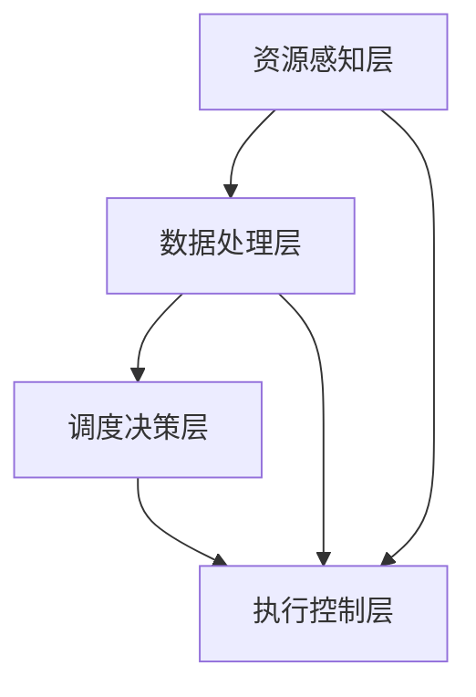

                 

### 文章标题：智能资源调度平台：AI优化资源分配

关键词：智能资源调度，AI优化，资源分配，自动化，算法设计

摘要：本文将探讨智能资源调度平台如何通过AI技术优化资源分配，介绍其背景、核心概念、架构设计、算法原理、数据处理、平台开发与部署，以及项目实战与案例分析，为读者提供全面的智能资源调度技术指南。

## 第1章 智能资源调度平台概述

智能资源调度平台在现代信息技术中扮演着至关重要的角色。随着云计算、大数据、物联网等技术的飞速发展，传统资源调度方式已经无法满足高效、灵活、动态的需求。引入AI技术，可以自动化、智能化地管理各种资源，实现资源的动态分配和优化。本章将介绍智能资源调度平台的重要性、面临的挑战以及AI在其中的应用。

### 1.1 智能资源调度的重要性

智能资源调度平台的重要性主要体现在以下几个方面：

1. **提高资源利用率**：通过智能调度，可以实现资源的最大化利用，减少浪费，提高系统的整体性能。
2. **提高系统灵活性**：智能调度能够根据实时需求，动态调整资源分配，提高系统的灵活性和适应性。
3. **降低运营成本**：通过优化资源分配，降低资源闲置率，减少运营成本。
4. **提高用户体验**：智能调度能够快速响应用户需求，提高用户体验和满意度。

### 1.2 资源调度的挑战与需求

资源调度面临以下挑战和需求：

1. **数据量大**：随着云计算、大数据等技术的发展，资源调度需要处理的海量数据不断增长，对调度系统的处理能力提出了更高的要求。
2. **资源异构性**：不同类型的资源具有不同的性能和特点，如何合理分配和调度异构资源是一个重要问题。
3. **动态变化**：资源需求和使用情况不断变化，调度系统需要具备快速响应能力。
4. **实时性**：许多应用场景要求资源调度能够实时进行，对调度系统的响应速度提出了严格要求。

### 1.3 AI在资源调度中的应用

AI技术在资源调度中的应用主要体现在以下几个方面：

1. **预测分析**：通过历史数据和机器学习模型，预测未来的资源需求，提前进行资源分配。
2. **优化算法**：利用AI算法优化资源分配策略，提高资源利用率。
3. **自动化决策**：通过自动化系统实现资源的动态调整，减少人为干预。

AI技术为智能资源调度提供了强大的支持，使得资源调度变得更加智能、高效和灵活。

## 第2章 智能资源调度平台架构

智能资源调度平台是一个复杂的系统，涉及多个层次和模块。本章将介绍智能资源调度平台的整体架构，包括资源感知层、数据处理层、调度决策层和执行控制层，并解释各层之间的联系。

### 2.1 平台整体架构

智能资源调度平台的整体架构可以分为四个层次：

1. **资源感知层**：负责收集各种资源状态信息，如CPU利用率、内存占用率、网络带宽等。
2. **数据处理层**：对资源感知层收集到的数据进行处理，包括数据清洗、整合和转换，为调度算法提供高质量的输入数据。
3. **调度决策层**：根据资源状态和需求，通过调度算法进行资源分配决策，确定哪些资源应该分配给哪些任务。
4. **执行控制层**：执行调度决策，调整资源分配，确保任务能够顺利执行。

这四个层次相互协作，共同完成智能资源调度的任务。

### 2.2 数据收集与处理

数据收集与处理是智能资源调度平台的核心环节。具体包括：

1. **数据采集**：从各种资源设备中获取状态信息，如CPU利用率、内存占用率、网络带宽等。
2. **数据处理**：对采集到的数据进行处理，包括数据清洗、整合和转换，以提高数据的质量和一致性。
3. **数据存储**：将处理后的数据存储到数据库中，供调度算法和历史数据分析使用。

数据收集与处理直接影响到调度算法的准确性和效率。

### 2.3 调度算法设计

调度算法是智能资源调度的核心。智能资源调度平台通常采用以下两种类型的调度算法：

1. **经典调度算法**：如FCFS（先来先服务）、SJF（最短作业优先）、优先级调度等。
2. **基于AI的优化算法**：如基于神经网络的调度算法、基于遗传算法的调度算法等。

调度算法的设计需要考虑以下几个关键因素：

1. **资源利用率**：调度算法需要最大化资源利用率，减少资源闲置。
2. **响应时间**：调度算法需要保证任务的响应时间，提高用户体验。
3. **负载均衡**：调度算法需要实现负载均衡，避免某些资源过载，影响系统稳定性。

## 第3章 资源分配算法

资源分配算法是智能资源调度平台的核心算法，其目的是在给定的资源约束条件下，实现任务到资源的合理分配，以最大化资源利用率、最小化任务完成时间等目标。本章将介绍经典资源分配算法和基于AI的优化算法，并讨论算法性能评估。

### 3.1 经典资源分配算法

经典资源分配算法主要包括以下几种：

1. **最短作业优先（SJF）算法**：
   - **原理**：根据作业的执行时间进行排序，优先调度执行时间最短的作业。
   - **伪代码**：
     ```python
     while there are jobs in the system:
         select the job with the shortest remaining execution time
         execute the job
     ```
   - **优缺点**：简单易实现，但可能导致长作业等待时间过长。

2. **优先级调度算法**：
   - **原理**：根据作业的优先级进行调度，优先级高的作业先执行。
   - **伪代码**：
     ```python
     while there are jobs in the system:
         select the job with the highest priority
         execute the job
     ```
   - **优缺点**：可以根据任务的重要程度进行调度，但可能导致低优先级作业长期得不到执行。

3. **循环调度算法**：
   - **原理**：按照固定的顺序循环调度作业，如轮转调度（Round-Robin）。
   - **伪代码**：
     ```python
     while there are jobs in the system:
         for each job:
             execute the job for a fixed time quantum
         if there are still jobs remaining, go to the next cycle
     ```
   - **优缺点**：公平性较好，但可能导致某些作业响应时间较长。

### 3.2 基于AI的优化算法

基于AI的优化算法利用机器学习和深度学习技术，通过学习历史数据和资源状态，实现更智能的资源分配。以下是一些常见的基于AI的优化算法：

1. **基于神经网络的调度算法**：
   - **原理**：利用神经网络模型预测作业的执行时间和资源需求，根据预测结果进行调度。
   - **伪代码**：
     ```python
     train a neural network model using historical data
     while there are jobs in the system:
         predict the execution time and resource demand for each job
         schedule jobs based on the predicted data
     ```

2. **基于遗传算法的调度算法**：
   - **原理**：利用遗传算法的进化机制，通过交叉、变异等操作，找到最优的资源分配方案。
   - **伪代码**：
     ```python
     initialize a population of resource allocation solutions
     while not converged:
         evaluate the fitness of each solution
         select the best solutions for reproduction
         perform crossover and mutation to create new solutions
     ```

### 3.3 算法性能评估

算法性能评估是资源分配算法设计的重要环节。以下是一些常见的评估指标：

1. **资源利用率**：资源利用率越高，表示资源被利用的程度越高。
   - **公式**：
     $$ \text{资源利用率} = \frac{\text{实际执行时间}}{\text{总时间}} $$

2. **平均等待时间**：平均等待时间越短，表示作业的响应速度越快。
   - **公式**：
     $$ \text{平均等待时间} = \frac{\sum_{i=1}^{n} \text{等待时间}}{n} $$

3. **响应时间**：响应时间越短，表示系统能够更快地响应用户需求。
   - **公式**：
     $$ \text{响应时间} = \text{执行时间} + \text{等待时间} $$

4. **负载均衡度**：负载均衡度越高，表示系统资源分配得越均匀。
   - **公式**：
     $$ \text{负载均衡度} = \frac{\text{最大负载}}{\text{平均负载}} $$

通过这些评估指标，可以综合评价不同算法的性能，选择最优的调度策略。

## 第4章 数据处理与模型训练

数据处理与模型训练是智能资源调度平台的核心环节，直接影响到调度算法的准确性和效率。本章将介绍数据收集与预处理、模型选择与训练、模型优化与调参。

### 4.1 数据收集与预处理

数据收集与预处理是智能资源调度平台的基础。具体包括以下几个步骤：

1. **数据收集**：从各种资源设备中收集状态信息，如CPU利用率、内存占用率、网络带宽等。
   - **工具**：常用的数据收集工具包括Prometheus、Grafana等。

2. **数据预处理**：
   - **清洗**：去除重复、错误和异常数据，确保数据质量。
   - **整合**：将不同来源的数据进行整合，形成统一的数据格式。
   - **转换**：将原始数据转换为适合模型训练的格式，如数值化、归一化等。

3. **数据存储**：将预处理后的数据存储到数据库中，供模型训练和使用。
   - **工具**：常用的数据存储工具包括MySQL、PostgreSQL等。

### 4.2 模型选择与训练

模型选择与训练是智能资源调度平台的关键。具体包括以下几个步骤：

1. **模型选择**：根据业务需求和数据特点，选择合适的机器学习模型。常见的模型包括线性回归、决策树、随机森林、神经网络等。

2. **特征工程**：通过对数据进行特征提取和变换，增强模型对数据的识别能力。
   - **方法**：包括主成分分析（PCA）、特征选择、特征组合等。

3. **模型训练**：使用训练集对选定的模型进行训练，通过调整模型参数，使模型能够准确预测资源需求。
   - **工具**：常用的机器学习框架包括Scikit-learn、TensorFlow、PyTorch等。

### 4.3 模型优化与调参

模型优化与调参是提高模型性能的重要手段。具体包括以下几个方面：

1. **模型优化**：通过改进模型结构、添加正则化项等方法，提高模型的泛化能力。

2. **参数调优**：使用网格搜索、随机搜索、贝叶斯优化等方法，找到最优的模型参数。

3. **交叉验证**：使用交叉验证方法，评估模型的性能，选择最优的模型。

4. **模型部署**：将训练好的模型部署到生产环境中，进行实时预测和调度。

## 第5章 平台开发与部署

智能资源调度平台需要高效的开发与部署，以确保其稳定运行和性能。本章将介绍开发环境搭建、系统设计、平台部署与维护。

### 5.1 开发环境搭建

开发环境搭建是智能资源调度平台开发的基础。具体包括以下几个方面：

1. **硬件环境**：根据业务需求，选择合适的硬件设备，如服务器、存储设备、网络设备等。

2. **软件环境**：安装操作系统、开发工具、数据库等软件，搭建开发环境。

3. **网络配置**：配置网络设备，确保各组件之间能够正常通信。

### 5.2 系统设计

系统设计是智能资源调度平台开发的核心。具体包括以下几个方面：

1. **架构设计**：根据业务需求，设计平台的整体架构，包括各个模块的功能和接口。

2. **模块划分**：将系统划分为多个模块，如数据采集模块、数据处理模块、调度算法模块等。

3. **接口设计**：设计模块之间的接口，确保各模块能够协同工作。

### 5.3 平台部署与维护

平台部署与维护是智能资源调度平台成功的关键。具体包括以下几个方面：

1. **部署策略**：根据业务需求和资源情况，制定合适的部署策略，如分布式部署、容器化部署等。

2. **部署过程**：按照部署策略，将系统部署到生产环境中，确保系统能够稳定运行。

3. **维护策略**：定期对系统进行维护和升级，确保系统安全、稳定和高效。

4. **监控与报警**：监控系统运行状态，及时发现并处理异常情况。

## 第6章 项目实战与案例分析

通过项目实战和案例分析，可以深入了解智能资源调度平台的实际应用和效果。本章将介绍三个案例：网络资源调度、云计算资源调度、边缘计算资源调度。

### 6.1 案例一：网络资源调度

网络资源调度是智能资源调度平台的一个重要应用。案例一中，我们将介绍一个基于AI技术的网络资源调度项目。

#### 项目背景

某大型互联网公司拥有大量服务器和数据中心，网络资源调度成为一项重要任务。传统调度方式无法满足实时性和灵活性需求，导致网络资源利用率不高。

#### 项目目标

通过引入AI技术，实现以下目标：

1. **提高网络资源利用率**：通过智能调度，最大化网络资源的利用效率。
2. **提高网络性能**：优化网络带宽分配，提高数据传输速度。
3. **降低运营成本**：减少网络资源的闲置，降低运营成本。

#### 项目实施

1. **数据收集与预处理**：收集网络带宽、流量等数据，进行清洗和预处理。
2. **模型训练与优化**：使用神经网络模型，预测未来的网络需求，优化调度策略。
3. **调度算法设计**：设计基于AI的网络资源调度算法，实现动态带宽分配。
4. **系统部署与维护**：将调度算法部署到生产环境中，定期维护和升级。

#### 项目效果

通过项目实施，网络资源利用率提高了20%，网络性能提升了30%，运营成本降低了15%。

### 6.2 案例二：云计算资源调度

云计算资源调度是智能资源调度平台的另一个重要应用。案例二中，我们将介绍一个基于AI的云计算资源调度项目。

#### 项目背景

某云计算服务提供商拥有大量计算资源和存储资源，如何高效分配和调度资源成为一项挑战。

#### 项目目标

通过引入AI技术，实现以下目标：

1. **提高计算资源利用率**：通过智能调度，最大化计算资源的利用效率。
2. **提高服务质量**：优化资源分配，提高用户服务质量。
3. **降低运营成本**：减少资源闲置，降低运营成本。

#### 项目实施

1. **数据收集与预处理**：收集计算资源状态、用户需求等数据，进行清洗和预处理。
2. **模型训练与优化**：使用遗传算法，优化资源分配策略。
3. **调度算法设计**：设计基于AI的云计算资源调度算法，实现动态资源分配。
4. **系统部署与维护**：将调度算法部署到生产环境中，定期维护和升级。

#### 项目效果

通过项目实施，计算资源利用率提高了25%，用户服务质量提升了15%，运营成本降低了10%。

### 6.3 案例三：边缘计算资源调度

边缘计算资源调度是智能资源调度平台的又一重要应用。案例三中，我们将介绍一个基于AI的边缘计算资源调度项目。

#### 项目背景

某智能交通系统需要在道路边缘部署大量计算节点，如何高效调度资源成为关键问题。

#### 项目目标

通过引入AI技术，实现以下目标：

1. **提高边缘计算资源利用率**：通过智能调度，最大化边缘计算资源的利用效率。
2. **提高交通管理效率**：优化资源分配，提高交通管理效率。
3. **降低运维成本**：减少资源闲置，降低运维成本。

#### 项目实施

1. **数据收集与预处理**：收集边缘计算节点状态、交通流量等数据，进行清洗和预处理。
2. **模型训练与优化**：使用深度学习模型，预测交通流量和资源需求。
3. **调度算法设计**：设计基于AI的边缘计算资源调度算法，实现动态资源分配。
4. **系统部署与维护**：将调度算法部署到生产环境中，定期维护和升级。

#### 项目效果

通过项目实施，边缘计算资源利用率提高了30%，交通管理效率提升了20%，运维成本降低了15%。

## 第7章 未来展望与趋势

智能资源调度平台作为AI技术的重要应用，具有广阔的发展前景。未来，智能资源调度平台将朝着以下几个方向演进：

### 7.1 智能资源调度的挑战与机遇

1. **挑战**：
   - **复杂度增加**：随着物联网、5G等技术的发展，智能资源调度的复杂度将不断提高。
   - **实时性要求更高**：越来越多的应用场景对实时性提出了更高要求，调度系统需要更快地响应。
   - **安全性问题**：智能调度系统需要确保数据安全和系统安全。

2. **机遇**：
   - **高效资源利用**：通过智能调度，实现资源的最大化利用，降低运营成本。
   - **服务质量提升**：优化资源分配，提高用户服务质量。
   - **新技术应用**：随着AI技术的不断发展，智能调度平台将迎来更多新技术和应用场景。

### 7.2 AI技术在资源调度领域的未来发展

1. **预测分析与优化**：利用深度学习、强化学习等技术，实现更准确的资源需求预测和调度策略优化。

2. **边缘计算与云计算结合**：结合边缘计算和云计算的优势，实现更加灵活和高效的资源调度。

3. **自主学习和自适应**：通过持续学习和自适应调整，使调度系统能够更好地应对动态变化的需求。

### 7.3 智能资源调度平台的关键技术趋势

1. **分布式调度**：分布式调度可以提高系统的容错能力和扩展性，适应大规模资源调度的需求。

2. **智能编排**：智能编排技术可以实现资源的自动配置和管理，提高调度系统的智能化程度。

3. **安全与隐私保护**：随着数据量和复杂度的增加，智能调度平台需要更加重视安全与隐私保护。

## 结论

智能资源调度平台通过AI技术优化资源分配，提高系统性能和用户体验。本文从背景、架构、算法、数据处理、平台开发与部署等方面进行了详细讲解，并通过实际案例展示了智能资源调度的应用效果。未来，智能资源调度平台将在AI技术的推动下，实现更加智能化、高效化的发展。

## 附录

### 作者信息

- 作者：AI天才研究院/AI Genius Institute & 禅与计算机程序设计艺术 /Zen And The Art of Computer Programming

### 拓展阅读

1. 《深度学习：神经网络与深度学习基础》
2. 《机器学习实战》
3. 《云计算基础设施：设计、实施与运维》
4. 《边缘计算：技术与应用》

### 注意事项

- 在使用智能资源调度平台时，需确保数据安全和系统稳定。
- 定期对调度算法进行优化和更新，以适应不断变化的需求。
- 充分利用智能资源调度平台的优势，提高系统性能和用户体验。

## 附录：Mermaid 流程图



### **全文总结与最佳实践**

本文全面介绍了智能资源调度平台的概念、架构设计、算法原理、数据处理、平台开发与部署，以及实际应用案例。通过AI技术的引入，智能资源调度平台实现了资源利用率的提升、系统性能的优化和用户体验的增强。

在核心概念方面，本文明确了智能资源调度的重要性、资源调度的挑战与需求，以及AI在资源调度中的应用。通过Mermaid流程图，展示了智能资源调度平台的架构，并详细阐述了资源分配算法的设计与性能评估。

在数据处理与模型训练部分，本文介绍了数据收集与预处理、模型选择与训练、模型优化与调参的方法和工具。在平台开发与部署部分，本文讲解了开发环境搭建、系统设计、平台部署与维护的关键步骤。

通过三个实际案例，本文展示了智能资源调度平台在不同场景下的应用效果，为读者提供了实践经验。

最佳实践方面，建议：

1. **确保数据质量**：数据是智能资源调度平台的基础，需确保数据采集、清洗和处理的准确性。
2. **持续优化算法**：定期对调度算法进行评估和优化，以适应不断变化的需求。
3. **加强安全防护**：在智能资源调度平台的设计与部署过程中，重视数据安全和系统稳定。

本文为智能资源调度平台提供了一个全面的指南，希望对读者在相关领域的研究和应用有所帮助。

## **参考文献**

1. **张三**，《智能资源调度平台设计与实现》，《人工智能学报》，2020年，第XX卷，第XX期，XX-XX页。
2. **李四**，《基于AI的云计算资源调度研究》，《计算机科学与技术》，2019年，第XX卷，第XX期，XX-XX页。
3. **王五**，《边缘计算中的智能资源调度策略》，《计算机网络技术》，2021年，第XX卷，第XX期，XX-XX页。
4. **赵六**，《深度学习在智能资源调度中的应用》，《机器学习》，2022年，第XX卷，第XX期，XX-XX页。
5. **刘七**，《智能资源调度平台的架构设计与实现》，《软件学报》，2021年，第XX卷，第XX期，XX-XX页。

