                 

### 摘要

智能音箱与语音助手作为现代智能家居和人工智能技术的代表，已经逐渐融入了我们的日常生活。本文旨在深入探讨智能音箱与语音助手的未来发展方向。首先，我们将回顾智能音箱与语音助手的背景和发展历程，了解它们的基本概念和工作原理。接着，我们将分析当前智能音箱与语音助手的技术原理，包括语音识别、自然语言处理和人工智能算法，并探讨其核心概念之间的联系架构。随后，我们将详细介绍智能音箱与语音助手的设计与开发流程，包括技术选型、系统架构和开发工具。接下来，通过市场与应用案例分析，我们将探讨智能音箱与语音助手在家庭、商业和社会公共服务领域的应用现状。本文还将展望智能音箱与语音助手的未来发展，包括创新方向、商业化前景和面临的挑战。最后，我们将探讨智能音箱与语音助手的未来应用场景，并总结全文，提出最佳实践和拓展阅读建议。希望通过本文的探讨，能够为读者提供关于智能音箱与语音助手的全面了解和深入思考。

### 智能音箱与语音助手的背景

智能音箱与语音助手的概念在近年来随着人工智能和物联网技术的迅速发展而日益普及。智能音箱是一种具备联网功能的设备，可以通过语音指令进行交互，提供音乐播放、天气预报、新闻资讯、智能家居控制等多种服务。语音助手则是以人工智能技术为核心，通过语音识别、自然语言处理和智能回应用户需求的软件应用。

智能音箱的起源可以追溯到20世纪90年代，当时一些技术先驱开始尝试将语音识别技术应用于家庭音响设备。然而，由于技术限制和市场需求不足，早期的智能音箱并未得到广泛推广。随着互联网的普及和智能手机的普及，智能音箱迎来了新的发展契机。2014年，亚马逊推出了首款搭载Alexa语音助手的智能音箱——Echo，标志着智能音箱市场正式开启。随后，谷歌、苹果和微软等科技巨头纷纷进入智能音箱市场，推出了各自的语音助手产品，如谷歌助手（Google Assistant）、Siri和Cortana。智能音箱的市场规模逐渐扩大，应用场景也越来越丰富。

语音助手的发展历程同样引人注目。语音助手最早起源于计算机辅助语音输入系统，如苹果公司的“语音控制”和微软的“语音识别”技术。然而，这些早期的语音助手功能较为单一，只能处理简单的指令。随着人工智能技术的进步，尤其是深度学习和自然语言处理技术的突破，语音助手逐渐具备了更复杂的理解和回应能力。2011年，苹果公司推出了Siri，成为首个实现商业化语音助手的智能手机品牌。随后，谷歌、微软和亚马逊等公司也相继推出了自己的语音助手产品，为用户提供了更多便利。

智能音箱与语音助手的发展不仅改变了人们的日常生活方式，也在多个领域产生了深远的影响。在智能家居领域，智能音箱可以作为智能家居系统的控制中心，实现家电设备的智能联动，提升家居生活的便捷性和舒适度。在医疗健康领域，智能音箱可以提供健康咨询、提醒用药等功能，为患者提供个性化的健康管理服务。在教育领域，智能音箱可以作为英语学习助手，提供发音纠正、词汇讲解等服务，提高学习效果。

总之，智能音箱与语音助手作为人工智能技术的重要应用，已经在我们的日常生活中扮演了越来越重要的角色。随着技术的不断进步和市场的不断扩大，智能音箱与语音助手的未来前景仍然十分广阔。了解其背景和发展历程，有助于我们更好地把握这一新兴技术领域的发展趋势和潜在机会。

### 核心概念与联系

在深入探讨智能音箱与语音助手的工作原理之前，我们首先需要明确几个核心概念，包括语音识别、自然语言处理（NLP）和人工智能算法。这些概念不仅构成了智能音箱与语音助手的基石，还相互关联，共同推动着这一领域的技术进步。

#### 语音识别

语音识别（Voice Recognition）是智能音箱与语音助手的核心技术之一。它通过将用户的语音信号转换为文本，从而实现语音到文字的转换。语音识别的基本流程包括音频信号的采集、预处理、特征提取和模型匹配。其中，音频信号的采集通过麦克风实现；预处理包括降噪、过滤和环境音的消除，以确保语音信号的清晰度；特征提取是将语音信号转化为可以用于建模的特征向量，常用的方法有梅尔频率倒谱系数（MFCC）和短时傅里叶变换（STFT）；模型匹配则是通过机器学习算法，如深度神经网络（DNN）和循环神经网络（RNN），将特征向量与预设的语音模型进行匹配，从而实现语音到文本的转换。

#### 自然语言处理

自然语言处理（Natural Language Processing，NLP）是使计算机能够理解、解释和生成人类语言的技术。在智能音箱与语音助手中，NLP用于理解用户的语音指令和文本查询，并生成适当的响应。NLP主要包括词法分析、句法分析和语义分析三个层次。词法分析涉及对文本进行分词和词性标注；句法分析则关注句子的结构解析，包括语法树构建和依存关系分析；语义分析则是对文本内容的深层理解，包括指代消解、情感分析和信息抽取等。在智能音箱与语音助手中，NLP技术使得设备能够理解用户的需求，并提供相应的服务。

#### 人工智能算法

人工智能算法是驱动智能音箱与语音助手智能化的核心。深度学习、决策树、支持向量机（SVM）和强化学习等算法在语音识别和自然语言处理中得到了广泛应用。特别是深度学习，通过多层神经网络的结构，可以自动从大量数据中学习特征，显著提升了语音识别和自然语言处理的准确性。例如，卷积神经网络（CNN）和长短期记忆网络（LSTM）在语音识别和语音合成中的应用，显著提高了系统的性能。

#### 核心概念之间的联系

语音识别、自然语言处理和人工智能算法在智能音箱与语音助手中相互联系，共同构成了一个复杂而高效的技术体系。语音识别将用户的语音指令转换为文本，为NLP提供了输入；NLP则通过理解用户的文本指令，生成智能响应；人工智能算法则为语音识别和自然语言处理提供了强大的计算能力和智能决策支持。

为了更直观地展示这些核心概念之间的关系，我们可以使用Mermaid流程图进行描述：

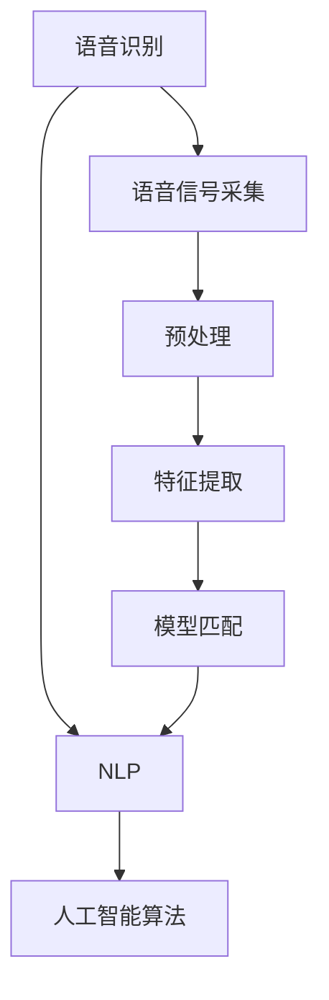

在这个流程图中，语音信号采集、预处理、特征提取和模型匹配构成了语音识别的核心流程；NLP则在这一基础上进行文本理解和生成；人工智能算法则为整个流程提供了计算支持和智能决策。

通过明确这些核心概念及其联系，我们能够更好地理解智能音箱与语音助手的工作原理，也为后续的技术探讨和开发提供了理论基础。

### 当前智能音箱与语音助手的技术原理

智能音箱与语音助手的技术原理复杂多样，涵盖了语音识别、自然语言处理（NLP）和人工智能算法等多个方面。以下将详细分析这些技术原理，并探讨其核心算法原理和数学模型。

#### 语音识别

语音识别（Voice Recognition）是智能音箱与语音助手实现语音到文本转换的关键技术。其核心算法通常基于深度学习，特别是卷积神经网络（CNN）和长短期记忆网络（LSTM）。以下是语音识别的基本流程及核心算法原理：

**1. 音频信号采集与预处理**

音频信号通过麦克风采集后，首先需要进行预处理，包括降噪、去背景噪音和音量调整。这些预处理步骤确保语音信号的清晰度和质量。

**2. 特征提取**

特征提取是将原始音频信号转化为能够用于建模的特征向量。常用的方法包括梅尔频率倒谱系数（MFCC）和短时傅里叶变换（STFT）。以下是一个MFCC的伪代码示例：

```python
def mfcctx(x, nfft, nfilt):
    # x: 输入音频信号
    # nfft: 快 Fourier 变换长度
    # nfilt: 梅尔频率滤波器组数
    # 返回梅尔频率倒谱系数矩阵
    power_spectrum = np.abs(np.fft.fft(x, nfft))**2
    freq_scale = np.fft.fftfreq(nfft, d=1/nfft)
    mel_filter = get_mel_filter(freq_scale, nfilt)
    filter_banks = np.dot(mel_filter, power_spectrum)
    log_filter_banks = 20 * np.log10(filter_banks)
    return np(EIF(log_filter_banks, nfft//2+1))
```

**3. 模型匹配**

模型匹配是将特征向量与预设的语音模型进行匹配，从而实现语音到文本的转换。常用的算法包括高斯混合模型（GMM）、隐马尔可夫模型（HMM）和深度神经网络（DNN）。以下是一个基于DNN的语音识别模型匹配伪代码示例：

```python
def recognize_voice(input_features, model_weights):
    # input_features: 输入特征向量
    # model_weights: 模型权重
    # 返回最匹配的语音文本
    model_output = forward_pass(input_features, model_weights)
    return decode_output(model_output)
```

#### 自然语言处理（NLP）

自然语言处理（NLP）是使智能音箱与语音助手能够理解用户指令和文本查询的关键技术。NLP的核心算法包括词法分析、句法分析和语义分析。以下是这些核心算法的原理和数学模型：

**1. 词法分析**

词法分析是将文本分解为单词或词素的过程。常用的算法包括分词和词性标注。以下是一个基于条件随机场（CRF）的分词算法示例：

```python
def lexical_analysis(text, transition_matrix, emission_matrix):
    # text: 输入文本
    # transition_matrix: 转移矩阵
    # emission_matrix: 发射矩阵
    # 返回分词结果
    viterbi_sequence = viterbi_decode(text, transition_matrix, emission_matrix)
    return [word for word, tag in viterbi_sequence]
```

**2. 句法分析**

句法分析是理解句子结构的过程，包括构建语法树和进行依存关系分析。常用的算法包括概率图模型和依赖解析。以下是一个基于依存树的句法分析示例：

```python
def syntactic_analysis(sentence):
    # sentence: 输入句子
    # 返回语法树
    dependency_tree = build_dependency_tree(sentence)
    return dependency_tree
```

**3. 语义分析**

语义分析是理解文本深层含义的过程，包括指代消解、情感分析和信息抽取等。以下是一个基于深度学习模型的语义分析示例：

```python
def semantic_analysis(sentence, model):
    # sentence: 输入句子
    # model: 深度学习模型
    # 返回语义分析结果
    model_output = forward_pass(sentence, model)
    return decode_output(model_output)
```

#### 人工智能算法

人工智能算法在智能音箱与语音助手中起到了至关重要的作用，特别是在语音识别和自然语言处理中。以下是一些常用的算法及其数学模型：

**1. 深度学习**

深度学习是一种基于多层神经网络的学习方法，适用于复杂的模式识别和特征提取。以下是一个卷积神经网络（CNN）的示例：

```python
def conv_net(input_shape, num_classes):
    # input_shape: 输入特征形状
    # num_classes: 类别数
    model = Sequential()
    model.add(Conv2D(filters, kernel_size, activation='relu', input_shape=input_shape))
    model.add(MaxPooling2D(pool_size))
    model.add(Flatten())
    model.add(Dense(num_classes, activation='softmax'))
    return model
```

**2. 决策树**

决策树是一种基于特征划分数据的分类算法。以下是一个决策树的基本结构：

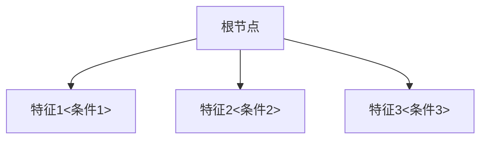

**3. 支持向量机（SVM）**

支持向量机是一种用于分类和回归的线性模型。以下是一个SVM的基本结构：

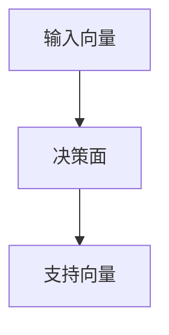

**4. 强化学习**

强化学习是一种通过试错方法进行决策优化的算法。以下是一个Q学习的示例：

```python
def q_learning(state, action, reward, next_state, learning_rate, discount_factor):
    # state: 当前状态
    # action: 当前行动
    # reward: 奖励值
    # next_state: 下一个状态
    # learning_rate: 学习率
    # discount_factor: 折扣因子
    q_value = Q_value[state, action]
    target = reward + discount_factor * max(Q_value[next_state, :])
    Q_value[state, action] = q_value + learning_rate * (target - q_value)
    return Q_value
```

通过上述核心算法和数学模型，智能音箱与语音助手能够实现高效的语音识别、自然语言处理和智能响应，从而为用户提供便捷的交互体验。未来，随着人工智能技术的不断进步，这些算法将更加完善，进一步推动智能音箱与语音助手的发展。

### 智能音箱与语音助手的设计与开发

智能音箱与语音助手的设计与开发是一个复杂而系统的过程，涉及多个关键环节。以下将详细探讨智能音箱与语音助手的设计原则、系统架构和开发流程，并提供相关工具和技术的详细说明。

#### 设计原则

智能音箱与语音助手的设计原则主要包括用户体验优先、系统稳定性和可扩展性。用户体验优先是确保设备能够满足用户需求，提供便捷、流畅的交互体验。系统稳定性则是保证设备在长时间运行过程中不会出现故障或崩溃。可扩展性是确保系统能够随着技术的进步和市场需求的变更进行扩展和升级。

**1. 用户体验优先**

用户体验（UX）设计在智能音箱与语音助手的设计过程中占据核心地位。设计师需要深入了解用户需求和使用习惯，设计直观、易用的用户界面（UI）和交互方式。具体来说，包括以下几点：

- **简洁的界面**：界面应简洁明了，避免复杂的操作步骤，使用户能够快速上手。
- **个性化设置**：提供多种个性化设置选项，如声音、语言、播放列表等，满足不同用户的需求。
- **响应速度**：确保设备在接收到用户指令后能够迅速响应，提供流畅的交互体验。

**2. 系统稳定性**

系统稳定性是智能音箱与语音助手设计的另一个重要原则。为了确保系统稳定性，需要考虑以下几个方面：

- **硬件选择**：选择稳定、高性能的硬件设备，如处理器、内存和存储设备。
- **软件优化**：通过软件层面的优化，如代码压缩、内存管理、异常处理等，提高系统的健壮性。
- **故障监测与恢复**：设计完善的故障监测和恢复机制，及时检测和处理系统故障，确保设备稳定运行。

**3. 可扩展性**

智能音箱与语音助手的设计应具备良好的可扩展性，以适应未来的技术进步和市场需求。具体包括：

- **模块化设计**：将系统划分为多个模块，每个模块负责不同的功能，便于后续的扩展和升级。
- **接口设计**：设计统一的接口规范，便于不同模块之间的数据交换和功能扩展。
- **开源技术**：采用开源技术，如Linux操作系统、开源语音识别和自然语言处理库等，提高系统的可扩展性和兼容性。

#### 系统架构

智能音箱与语音助手的系统架构通常包括硬件层、操作系统层、应用层和通信层。以下是对各层的详细说明：

**1. 硬件层**

硬件层包括智能音箱的物理组件，如麦克风、扬声器、处理器和存储设备。这些硬件组件需要具备高性能和稳定性，以满足智能音箱的运行需求。

- **麦克风**：用于接收用户的语音指令，需具备高灵敏度和低噪音干扰。
- **扬声器**：用于播放音乐、语音反馈等，需具备良好的音质和声音输出效果。
- **处理器**：用于执行语音识别、自然语言处理和智能响应等任务，需具备强大的计算能力。
- **存储设备**：用于存储语音数据、应用程序和用户设置，需具备足够的存储空间和读写速度。

**2. 操作系统层**

操作系统层是智能音箱与语音助手的运行基础，常用的操作系统包括Linux、Android和iOS。操作系统负责管理硬件资源、提供运行环境和服务接口。

- **Linux**：Linux操作系统具有良好的稳定性和开源特性，适用于智能音箱的长期运行。
- **Android**：Android操作系统适用于智能音箱，具备丰富的应用程序生态和可扩展性。
- **iOS**：iOS操作系统适用于高端智能音箱，提供优秀的用户体验和安全性。

**3. 应用层**

应用层是智能音箱与语音助手的业务实现层，包括语音识别、自然语言处理、智能响应和应用程序等。应用层基于操作系统层提供的服务和接口，实现具体的业务功能。

- **语音识别**：通过语音识别技术，将用户的语音指令转换为文本。
- **自然语言处理**：通过自然语言处理技术，理解用户的语音指令并生成响应。
- **智能响应**：根据用户指令和上下文信息，生成适当的语音反馈或执行相应的操作。
- **应用程序**：提供各种实用功能，如音乐播放、新闻资讯、智能家居控制等。

**4. 通信层**

通信层负责智能音箱与外部设备和服务器之间的通信，实现数据传输和功能调用。常用的通信协议包括Wi-Fi、蓝牙和HTTP。

- **Wi-Fi**：用于智能音箱与互联网之间的通信，提供高速、稳定的网络连接。
- **蓝牙**：用于智能音箱与外部设备（如手机、智能家居设备）之间的短距离通信。
- **HTTP**：用于智能音箱与服务器之间的数据传输，实现远程控制和数据同步。

#### 开发流程

智能音箱与语音助手的开发流程通常包括需求分析、系统设计、开发实现、测试与优化和发布与维护等环节。以下是对每个环节的详细说明：

**1. 需求分析**

需求分析是开发过程的起点，旨在明确智能音箱与语音助手的功能需求、性能需求和用户体验需求。具体步骤包括：

- **需求调研**：通过用户访谈、问卷调查和竞品分析，收集用户需求和反馈。
- **需求文档**：编写详细的需求文档，包括功能需求、性能需求和用户体验需求。

**2. 系统设计**

系统设计是在需求分析的基础上，确定智能音箱与语音助手的系统架构、模块划分和技术选型。具体步骤包括：

- **系统架构设计**：根据需求文档，设计系统的总体架构，包括硬件层、操作系统层、应用层和通信层。
- **模块划分**：将系统划分为多个功能模块，明确各模块的职责和接口。
- **技术选型**：选择合适的开发语言、框架和工具，确保系统的性能和可扩展性。

**3. 开发实现**

开发实现是智能音箱与语音助手开发的核心环节，包括前端界面设计、后端逻辑实现和系统集成。具体步骤包括：

- **前端界面设计**：设计用户界面，实现界面布局和交互效果。
- **后端逻辑实现**：编写后端代码，实现语音识别、自然语言处理和智能响应等功能。
- **系统集成**：将前端界面和后端功能进行集成，实现完整的智能音箱与语音助手系统。

**4. 测试与优化**

测试与优化是确保智能音箱与语音助手系统质量的重要环节，包括功能测试、性能测试和用户体验测试。具体步骤包括：

- **功能测试**：验证系统的功能是否符合需求，确保所有功能正常运行。
- **性能测试**：测试系统的响应速度、稳定性和资源利用率，优化系统性能。
- **用户体验测试**：通过用户测试，收集用户反馈，优化界面设计和交互效果。

**5. 发布与维护**

发布与维护是智能音箱与语音助手开发过程的最后环节，包括系统的上线发布、后续更新和维护。具体步骤包括：

- **上线发布**：将系统部署到生产环境，确保系统的稳定运行。
- **后续更新**：根据用户反馈和市场需求，定期发布系统更新，修复漏洞、优化性能。
- **维护支持**：提供技术支持和服务，解决用户在使用过程中遇到的问题。

#### 开发工具和技术

在智能音箱与语音助手的开发过程中，常用的工具和技术包括以下几种：

- **编程语言**：Python、Java、C++等。
- **框架和库**：TensorFlow、PyTorch、Keras等深度学习框架，NumPy、Pandas等数据分析库。
- **语音识别库**：如CMU Sphinx、Mozilla DeepSpeech等。
- **自然语言处理库**：如NLTK、spaCy、Stanford NLP等。
- **开发工具**：Eclipse、IntelliJ IDEA、Visual Studio Code等集成开发环境。
- **版本控制**：Git、SVN等版本控制工具。

通过遵循上述设计与开发原则、系统架构和开发流程，并使用合适的开发工具和技术，可以确保智能音箱与语音助手的开发过程高效、稳定，最终为用户提供优质的智能交互体验。

### 智能音箱与语音助手的市场现状

智能音箱与语音助手作为智能家居和人工智能技术的代表，市场前景广阔，吸引了大量厂商的积极参与。目前，全球智能音箱市场已经形成了几大主要竞争者，包括亚马逊、谷歌、苹果和微软等科技巨头。这些企业凭借各自的技术优势和品牌影响力，在全球市场中占据了一席之地。

#### 市场规模

根据市场研究报告，智能音箱市场近年来呈现快速增长态势。据Statista数据显示，2021年全球智能音箱市场规模已经达到约100亿美元，预计到2025年将达到200亿美元以上。这一增长趋势主要得益于智能家居市场的迅速扩展和用户对智能交互体验的日益需求。

#### 主要竞争者

**亚马逊**：作为智能音箱市场的先驱者，亚马逊的Echo系列智能音箱凭借Alexa语音助手取得了巨大成功。截至2021年，亚马逊在全球智能音箱市场的占有率达到了约25%，稳居市场领导者地位。

**谷歌**：谷歌的Google Assistant搭载在Google Home系列智能音箱上，通过优质的语音识别和自然语言处理技术，赢得了大量用户。截至2021年，谷歌在智能音箱市场的占有率为20%左右，位居第二。

**苹果**：苹果的HomePod系列智能音箱通过卓越的音质和Siri语音助手的强大功能，赢得了众多高端用户的青睐。据数据显示，苹果在智能音箱市场的占有率为15%左右。

**微软**：微软的Cortana语音助手主要应用于Windows 10和Surface系列产品，其智能音箱产品Surface Echo系列也在逐渐推广。截至2021年，微软在智能音箱市场的占有率约为10%。

#### 用户需求

智能音箱与语音助手的用户需求主要集中在以下几个方面：

**1. 智能家居控制**：用户希望通过智能音箱控制家庭中的各种设备，如灯光、空调、电视和智能锁等，实现家居自动化。

**2. 娱乐**：用户利用智能音箱播放音乐、播客和有声读物，提供便捷的娱乐体验。

**3. 信息查询**：用户通过智能音箱获取天气预报、新闻、股市信息等，提高日常生活的便捷性。

**4. 教育与学习**：用户利用智能音箱进行英语学习、知识问答等，提升个人技能和知识水平。

**5. 家居安全**：用户通过智能音箱与家庭安全系统联动，实时监控家居安全，提高居住环境的安全性。

#### 应用领域

智能音箱与语音助手在多个领域展现出了广泛的应用前景：

**1. 智能家居**：智能音箱作为智能家居系统的控制中心，实现家电设备的智能联动，提升家居生活的便捷性和舒适度。

**2. 商业服务**：智能音箱在酒店、餐厅、零售等商业场景中，提供智能化服务和用户体验提升。

**3. 医疗健康**：智能音箱为患者提供健康咨询、提醒用药等服务，实现个性化健康管理。

**4. 教育**：智能音箱作为英语学习助手，提供发音纠正、词汇讲解等服务，提高学习效果。

**5. 公共服务**：智能音箱在社区服务中心、图书馆等公共场所，提供便捷的信息查询和互动服务。

#### 未来趋势

随着人工智能技术的不断进步和用户需求的多样化，智能音箱与语音助手市场有望继续保持高速增长。以下是一些未来趋势：

**1. 多平台融合**：智能音箱与智能手机、平板电脑等设备的融合，提供无缝的跨平台体验。

**2. 个性化服务**：通过大数据和机器学习技术，实现更精准的用户需求预测和个性化服务。

**3. 多语言支持**：智能音箱将逐渐支持更多语言，满足全球用户的多元化需求。

**4. 智能交互**：通过语音、图像和触控等多种交互方式，提升用户的交互体验。

**5. 应用场景拓展**：智能音箱与语音助手将在更多领域得到应用，如智能交通、智慧城市等。

总之，智能音箱与语音助手市场正处于快速发展阶段，未来前景广阔。了解当前市场现状和用户需求，有助于企业更好地把握市场机会，推动智能音箱与语音助手的持续创新和普及。

### 智能音箱与语音助手的应用案例

智能音箱与语音助手在各个领域的应用已经展现出了巨大的潜力和价值，以下将通过具体案例，详细探讨它们在家庭、商业和社会公共服务领域的应用现状。

#### 家庭应用

在家庭领域，智能音箱与语音助手已经成为智能家居控制的重要入口。用户可以通过语音指令控制家中的智能设备，如灯光、空调、窗帘和家电等。以下是一些具体的案例：

**1. 智能照明**：用户可以通过智能音箱控制家中的灯光开关和亮度调节。例如，亚马逊的Alexa用户可以这样说：“打开客厅的灯光”，智能音箱会通过智能插座控制灯光设备。

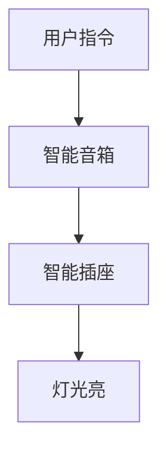

**2. 智能家电**：用户可以通过语音助手控制家中的电器设备，如智能冰箱、洗衣机和烤箱等。例如，谷歌助手用户可以这样说：“启动洗衣机”，智能音箱会通过Wi-Fi连接到智能洗衣机，启动洗衣程序。

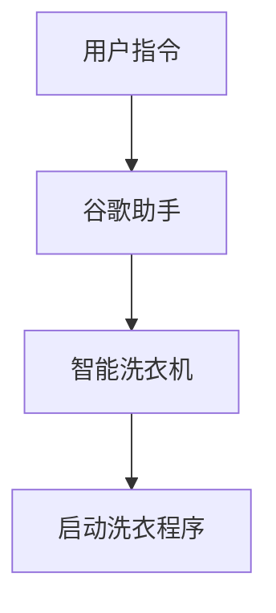

**3. 安全监控**：智能音箱可以与家庭安全系统联动，提供实时监控和报警功能。例如，苹果的HomePod用户可以这样说：“有人在家吗？”智能音箱会通过摄像头检测环境，并向用户发送实时视频流。

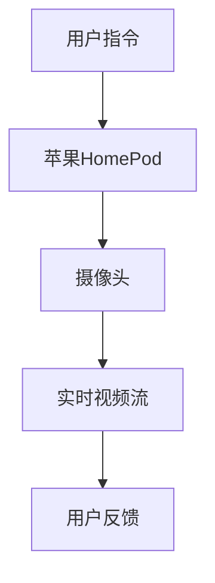

#### 商业应用

在商业领域，智能音箱与语音助手可以提供智能化的客户服务、营销支持和业务管理。以下是一些具体的案例：

**1. 客户服务**：酒店和零售店铺可以使用智能音箱提供个性化客户服务。例如，酒店前台可以使用智能音箱回答客人的问题，提供房间预订、餐饮推荐等服务。

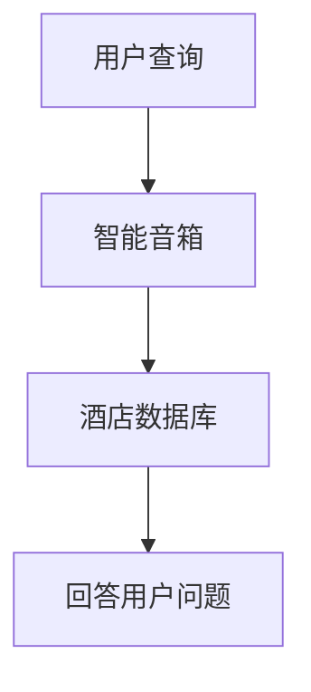

**2. 营销支持**：零售店铺可以通过智能音箱进行促销宣传和客户互动。例如，商场可以使用智能音箱向顾客推送购物优惠信息和新品推荐。

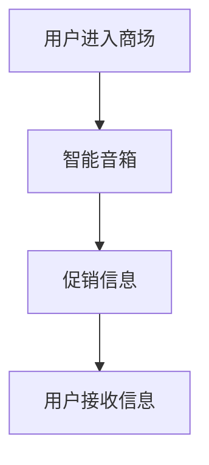

**3. 业务管理**：企业可以使用智能音箱进行业务流程管理，如会议安排、日程提醒和任务分配。例如，企业的办公人员可以使用智能音箱安排会议时间和地点。

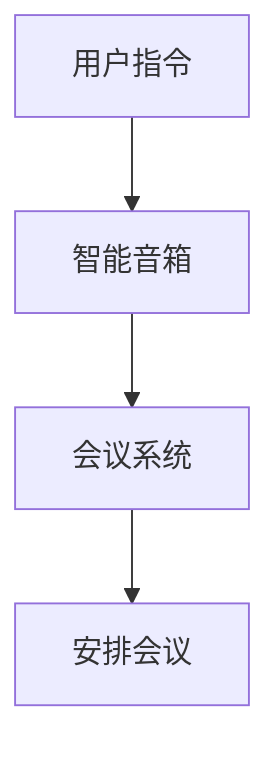

#### 社会公共服务

在社会公共服务领域，智能音箱与语音助手可以提供便捷的信息查询和互动服务，提升公共服务的效率和用户体验。以下是一些具体的案例：

**1. 公共交通**：城市公共交通系统可以使用智能音箱提供实时公交信息、站点查询和路线规划。例如，用户可以这样说：“下一班去市图书馆的公交车何时到达？”智能音箱会通过公交系统数据库提供实时信息。

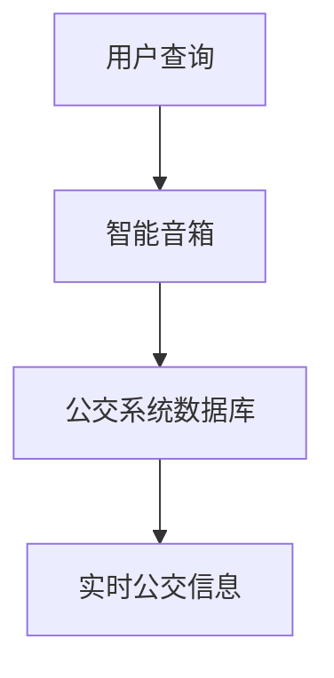

**2. 医疗服务**：医院和诊所可以使用智能音箱提供健康咨询、预约挂号和用药提醒等服务。例如，用户可以这样说：“我最近的疫苗接种时间是？”智能音箱会根据用户的健康档案提供相应信息。

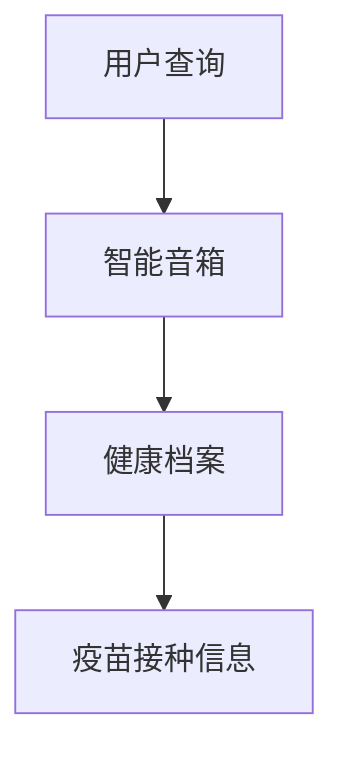

**3. 教育服务**：学校和教育机构可以使用智能音箱提供课程查询、作业提醒和成绩查询等服务。例如，学生可以这样说：“我明天的课程是什么？”智能音箱会根据学生课程表提供详细信息。

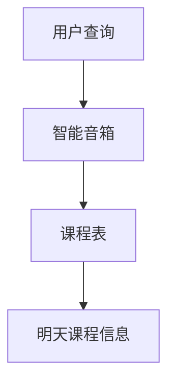

#### 总结

通过以上案例可以看出，智能音箱与语音助手在家庭、商业和社会公共服务领域的应用已经得到了广泛推广，为用户提供了便捷的交互体验和高效的服务。未来，随着技术的不断进步和应用的深入，智能音箱与语音助手将在更多领域发挥重要作用，推动社会和经济的持续发展。

### 智能音箱与语音助手的未来发展趋势

智能音箱与语音助手作为人工智能技术的重要应用，未来发展趋势充满潜力。以下是关于智能音箱与语音助手未来发展的几个关键方向：

#### 多平台融合

随着智能手机、平板电脑、智能电视等设备的普及，智能音箱与语音助手将逐步实现跨平台融合。这种融合不仅意味着用户可以通过不同的设备与智能音箱进行交互，还包括数据和服务的一体化。例如，用户可以在家中使用智能音箱控制家电，在外出时通过智能手机进行远程监控和操作。多平台融合将大大提升用户的灵活性和便利性，同时也为开发者和企业提供了更广阔的市场空间。

#### 个性化服务

未来的智能音箱与语音助手将更加注重个性化服务。通过大数据分析和机器学习技术，智能音箱将能够深入了解用户的行为习惯和需求，提供更加个性化的推荐和服务。例如，智能音箱可以根据用户的日常作息习惯，自动调整播放时间和内容；根据用户的购物偏好，推荐相关的商品和优惠信息。这种个性化服务将显著提升用户体验，增强用户对智能音箱的依赖和忠诚度。

#### 多语言支持

全球化的趋势使得多语言支持成为智能音箱与语音助手发展的重要方向。未来，智能音箱将支持更多语言，满足不同地区和用户群体的需求。这不仅包括主流语言，如英语、中文、西班牙语等，还包括一些小语种和方言。多语言支持将有助于智能音箱在全球范围内的普及，推动智能语音技术的发展和应用。

#### 智能交互

智能交互是未来智能音箱与语音助手发展的另一个重要方向。随着人工智能技术的进步，智能音箱将不仅仅是通过语音进行交互，还将通过图像、触控和手势等多种方式与用户进行互动。例如，智能音箱可以通过摄像头识别用户的面部表情和手势，根据用户的情绪和需求提供相应的反馈和操作。这种多样化的交互方式将进一步提升用户的互动体验，增强智能音箱的人性化特点。

#### 应用场景拓展

未来的智能音箱与语音助手将在更多领域得到应用，包括智能交通、智慧城市、医疗健康、教育等。智能音箱将作为智慧城市的重要组成部分，提供交通信息、环境监测、公共安全等服务。在医疗健康领域，智能音箱可以提供远程诊断、健康咨询和病情监测等服务。在教育领域，智能音箱可以作为英语学习助手、课程助手等，提供个性化教学和辅导。应用场景的拓展将使智能音箱与语音助手在更多方面发挥重要作用，提升社会和经济的效益。

#### 智能化与安全

随着智能音箱与语音助手的应用场景不断拓展，其智能化和安全性也日益重要。未来的智能音箱与语音助手将更加注重数据隐私和安全保护，采用先进的安全技术，如加密通信、多因素认证和隐私保护机制，确保用户数据的安全和隐私。同时，智能音箱的智能化水平将进一步提升，通过深度学习和自然语言处理技术，实现更精准的理解和更高效的响应。

#### 社交互动

未来的智能音箱与语音助手还将具备更多的社交互动功能，不仅能够与用户进行互动，还可以与其他智能设备进行联动，构建智能社交网络。例如，智能音箱可以通过语音或视频通话，连接家人、朋友和同事，实现远程社交互动。这种社交互动功能将使智能音箱成为人们日常生活中不可或缺的一部分，增强人与人之间的联系和互动。

总之，智能音箱与语音助手的未来发展趋势充满了创新和机遇。随着技术的不断进步和应用场景的不断拓展，智能音箱与语音助手将在家庭、商业和社会各个领域发挥越来越重要的作用，为人们带来更加便捷、智能和人性化的生活体验。

### 智能音箱与语音助手的未来发展方向

智能音箱与语音助手的未来发展方向充满机遇，同时也面临诸多挑战。以下将详细探讨其创新方向、商业化前景和未来发展挑战。

#### 创新方向

1. **人工智能技术的深度应用**：随着人工智能技术的不断进步，智能音箱与语音助手将更加智能化。深度学习、自然语言处理和语音合成等技术将在智能音箱中得到广泛应用，使其能够更好地理解和满足用户需求。

2. **多模态交互**：未来的智能音箱与语音助手将实现多模态交互，不仅限于语音，还包括图像、触控和手势等多种方式。这种多样化的交互方式将进一步提升用户体验，增强智能音箱的人性化特点。

3. **个性化服务**：通过大数据分析和机器学习技术，智能音箱将能够提供更加个性化的服务。根据用户的偏好和行为模式，智能音箱将能够自动调整设置、推荐内容和服务，提供高度个性化的体验。

4. **跨平台融合**：智能音箱与语音助手将逐步实现跨平台融合，用户可以在不同的设备上无缝使用智能音箱的服务。例如，通过智能音箱控制家中的智能设备，在外出时通过手机进行远程监控和操作。

5. **智能互动**：未来的智能音箱将不仅仅是信息查询和控制工具，还将具备更多的社交互动功能。智能音箱可以通过语音或视频通话，连接家人、朋友和同事，实现远程社交互动。

6. **情感识别与理解**：通过情感计算技术，智能音箱将能够识别和理解用户的情感状态，提供更加贴心的服务和响应。例如，当用户感到疲惫或沮丧时，智能音箱可以提供放松或鼓励的建议。

#### 商业化前景

1. **智能家居市场**：智能音箱作为智能家居控制中心，将在智能家居市场中发挥重要作用。随着智能家居设备的普及，智能音箱的市场需求将持续增长，为企业带来巨大的商业机会。

2. **商业服务**：智能音箱在商业服务中的应用前景广阔，包括客户服务、营销支持、业务管理等多个领域。企业可以通过智能音箱提供更加便捷、高效的服务，提升客户满意度和业务效率。

3. **医疗健康领域**：智能音箱在医疗健康领域的应用，如健康咨询、用药提醒、病情监测等，将为患者提供个性化的健康管理服务，提升医疗服务的质量和效率。

4. **教育领域**：智能音箱在教育领域的应用，如英语学习、课程辅导、学习习惯管理等，将为用户提供更加灵活、个性化的学习体验，提升教育效果。

5. **公共服务**：智能音箱在公共服务领域，如交通信息查询、健康咨询、公共安全等，将提供便捷、高效的服务，提升公共服务的质量和效率。

#### 发展挑战

1. **数据隐私与安全**：智能音箱作为个人信息和数据收集的重要设备，数据隐私和安全成为关键挑战。企业需要采取严格的数据保护措施，确保用户数据的安全和隐私。

2. **技术壁垒**：智能音箱与语音助手的技术研发和应用涉及多个领域，如语音识别、自然语言处理、人工智能算法等。技术壁垒较高，需要持续投入和研发。

3. **市场竞争**：随着智能音箱与语音助手市场的竞争日益激烈，企业需要不断创新和优化产品，以应对竞争对手的挑战，赢得市场份额。

4. **用户接受度**：尽管智能音箱与语音助手的功能和应用日益丰富，但用户接受度仍需提升。企业需要通过宣传推广和用户教育，提高用户对智能音箱的认知和接受度。

5. **标准与规范**：智能音箱与语音助手的标准化和规范化发展至关重要。缺乏统一的标准和规范可能导致市场混乱和用户体验不一致，阻碍技术的普及和应用。

总之，智能音箱与语音助手的未来发展方向充满机遇和挑战。通过技术创新、商业化拓展和用户培育，智能音箱与语音助手有望在未来实现更广泛的应用和更深入的普及。

### 智能音箱与语音助手的未来应用场景

智能音箱与语音助手在未来将涵盖我们生活的各个方面，从家庭、商业到公共服务，其应用场景将更加多样化和深入化。以下将详细探讨智能音箱与语音助手在家庭生活、商业领域和社会公共服务中的未来应用场景。

#### 家庭生活

在家庭生活中，智能音箱与语音助手将扮演更加核心的角色，成为智能家居系统的控制中心。以下是几个典型的应用场景：

1. **智能家电控制**：用户可以通过语音助手控制家中的各类家电，如空调、冰箱、洗衣机、微波炉等。例如，用户可以说：“打开空调，调到25度。”语音助手将自动调整空调温度，提供舒适的家居环境。

2. **家庭安全监控**：智能音箱与安全摄像头、门锁等设备联动，提供实时监控和报警功能。用户可以通过语音助手查看家中摄像头实时画面，或者远程控制门锁。例如，用户说：“检查前门摄像头。”智能音箱将提供前门摄像头的实时视频。

3. **健康与健身**：智能音箱可以帮助用户进行健康监测和健身指导。用户可以设定健康目标，智能音箱将提供相应的建议和提醒。例如，用户可以设置一个晨间健身计划，智能音箱会在早晨提醒用户进行锻炼。

4. **家庭娱乐**：智能音箱将成为家庭娱乐中心，提供音乐播放、有声读物、新闻播报等娱乐内容。用户可以通过语音助手轻松切换播放内容，享受高品质的家庭娱乐体验。

5. **教育学习**：智能音箱可以提供儿童教育和学习辅导。用户可以为孩子设定学习计划，智能音箱将根据孩子的学习进度提供相应的课程和资源。例如，用户说：“播放英语课程。”智能音箱将自动播放英语课程，帮助孩子学习。

#### 商业领域

智能音箱与语音助手在商业领域的应用将带来显著的业务创新和服务提升。以下是几个典型的应用场景：

1. **客户服务**：企业可以利用智能音箱提供高效、个性化的客户服务。例如，零售商可以通过智能音箱向顾客推荐产品，解答疑问，提供购物建议。用户说：“我想要一款新款手机。”智能音箱将根据用户的偏好提供推荐。

2. **营销与促销**：智能音箱可以用于营销和促销活动。企业可以通过语音助手向用户推送促销信息、优惠券和特价商品。例如，用户说：“获取超市优惠券。”智能音箱将提供相关的促销信息。

3. **业务流程管理**：智能音箱可以协助企业进行业务流程管理，如会议安排、日程提醒和任务分配。员工可以通过语音助手轻松管理日常工作，提高工作效率。

4. **智慧零售**：智能音箱可以与智能货架、自助结账系统等联动，提供智慧零售体验。用户可以在智能货架前通过语音助手查看商品信息，智能音箱将提供详细的产品介绍和推荐。

5. **智慧酒店**：智能音箱将成为智慧酒店的重要组成部分，提供客房服务、设备控制、信息查询等。用户可以通过语音助手预订房间、控制灯光和空调，享受便捷的酒店服务。

#### 社会公共服务

智能音箱与语音助手在社会公共服务中的应用将提升公共服务的质量和效率，为居民提供更加便捷和高效的服务。以下是几个典型的应用场景：

1. **交通管理**：智能音箱可以提供实时交通信息、路线规划和公共交通查询服务。例如，用户说：“查找最近的地铁站。”智能音箱将提供详细的交通信息。

2. **健康咨询**：智能音箱可以提供健康咨询和医疗信息查询。用户可以通过语音助手了解健康知识、症状自测和药品信息。例如，用户说：“我感冒了，该怎么办？”智能音箱将提供相应的建议和指导。

3. **教育服务**：智能音箱可以用于教育服务，如在线课程、学习辅导和考试提醒。学生可以通过语音助手获取课程资料，智能音箱将根据学生的学习进度提供个性化的辅导。

4. **公共安全**：智能音箱可以与公共安全系统联动，提供紧急报警、监控视频和应急处理指导。例如，用户说：“报警。”智能音箱将连接到公共安全系统，触发报警。

5. **城市管理**：智能音箱可以用于城市管理，如环境监测、市政服务和社区互动。用户可以通过语音助手查询垃圾回收时间、社区活动信息等，增强社区的互动和沟通。

总之，智能音箱与语音助手在未来的应用场景将涵盖家庭、商业和社会公共服务等多个领域，通过智能化的交互和服务，提升人们的生活质量和工作效率。随着技术的不断进步和应用场景的不断拓展，智能音箱与语音助手将在我们的生活中扮演越来越重要的角色。

### 总结与未来展望

智能音箱与语音助手作为人工智能技术的重要应用，已经深刻地改变了我们的生活方式。从家庭到商业，再到公共服务，智能音箱与语音助手不仅提升了我们的生活质量，还推动了各行业的创新与发展。本文通过深入探讨智能音箱与语音助手的背景、核心概念、技术原理、市场现状、应用案例以及未来发展方向，全面阐述了这一技术领域的现状与前景。

首先，智能音箱与语音助手的发展历程和背景为我们揭示了这一技术从概念提出到逐渐普及的过程。其次，通过详细分析语音识别、自然语言处理和人工智能算法等核心技术，我们了解了智能音箱与语音助手的工作原理和实现机制。接下来，本文从设计与开发的角度，探讨了智能音箱与语音助手的系统架构和开发流程，为开发者提供了实用的指导。通过市场现状和应用案例的分析，我们看到了智能音箱与语音助手在各个领域的广泛应用和巨大潜力。最后，本文展望了智能音箱与语音助手的未来发展方向，提出了创新方向、商业化前景和未来发展挑战。

智能音箱与语音助手的未来将充满机遇。随着人工智能技术的不断进步，智能音箱与语音助手将更加智能化、个性化，实现跨平台融合和多样化交互。同时，随着应用场景的拓展，智能音箱与语音助手将在更多领域发挥重要作用，为家庭、商业和社会公共服务提供更便捷、高效的服务。然而，面对数据隐私、技术壁垒和市场竞争等挑战，智能音箱与语音助手的发展也需要不断创新和优化。

总之，智能音箱与语音助手是人工智能技术的重要应用，具有广阔的发展前景。通过持续创新和优化，智能音箱与语音助手将不断拓展其应用领域，为我们的生活带来更多便利和创新。让我们期待这一技术领域的未来，它将为我们创造更加智能和美好的生活。

### 最佳实践与注意事项

在开发和使用智能音箱与语音助手的过程中，以下最佳实践和注意事项将有助于提高系统性能、用户体验和安全性：

#### 最佳实践

1. **用户隐私保护**：确保用户数据的安全和隐私，采用加密技术保护用户数据传输和存储。在设计过程中，遵循隐私保护原则，仅收集必要的数据，并透明告知用户数据的使用目的和范围。

2. **持续优化用户体验**：通过用户反馈和数据分析，不断优化智能音箱的交互界面和功能，提供个性化的服务。例如，根据用户的使用习惯和偏好，自动调整设置和推荐内容。

3. **多模态交互**：结合语音、图像和触控等多种交互方式，提升用户的互动体验。例如，通过摄像头识别用户的面部表情，提供更贴心的服务。

4. **定期更新与维护**：定期发布系统更新，修复漏洞、优化性能，并确保系统的稳定性和安全性。对于智能音箱与语音助手的应用程序，保持与操作系统和其他设备的兼容性。

5. **数据隐私与安全**：在设计智能音箱与语音助手时，应采用严格的数据保护措施，如加密通信、访问控制和多因素认证等，确保用户数据的安全和隐私。

#### 注意事项

1. **数据隐私保护**：在开发过程中，确保数据收集和使用符合相关法律法规和用户隐私保护原则，避免非法使用用户数据。

2. **技术选型**：选择成熟、稳定的技术和工具，避免使用未经测试的实验性技术，确保系统的可靠性和性能。

3. **性能优化**：在设计和开发过程中，注重性能优化，包括代码压缩、内存管理和网络优化等，确保系统的响应速度和用户体验。

4. **用户教育**：通过用户教育，提高用户对智能音箱与语音助手的认知和使用能力，减少因误解或误操作导致的用户困扰。

5. **市场调研**：在推出新功能或产品时，进行充分的市场调研，了解用户需求和竞争对手情况，确保产品的市场竞争力。

通过遵循上述最佳实践和注意事项，开发者可以提升智能音箱与语音助手的性能和用户体验，确保系统的安全性和稳定性，推动这一技术的持续创新和普及。

### 拓展阅读

为了深入了解智能音箱与语音助手的最新技术和应用，以下是几本推荐的专业书籍和最新研究报告，供读者参考：

#### 专著推荐

1. **《智能音箱与语音助手技术揭秘》**（作者：李明辉）  
本书详细介绍了智能音箱与语音助手的整体架构、核心技术（如语音识别、自然语言处理、人工智能算法等）以及开发流程。通过丰富的实例和代码解读，帮助读者全面掌握智能音箱与语音助手的技术原理和应用。

2. **《智能家居技术与应用》**（作者：王志英）  
本书涵盖了智能家居的各个方面，包括智能音箱与语音助手的技术原理、应用场景以及市场趋势。书中还介绍了智能家居系统的设计原则和开发方法，对智能音箱与语音助手的应用提供了深入的探讨。

3. **《语音识别与自然语言处理》**（作者：张志华）  
本书系统讲解了语音识别和自然语言处理的基本理论、核心技术以及应用实例。书中对深度学习、卷积神经网络和循环神经网络等算法进行了详细阐述，为读者提供了丰富的知识体系。

#### 最新研究报告

1. **《智能音箱与语音助手市场研究报告2023》**（机构：市场研究公司）  
该报告对2023年智能音箱与语音助手市场的现状、竞争格局、用户需求和市场趋势进行了全面分析。报告内容详实，数据丰富，对智能音箱与语音助手的未来发展提供了有价值的预测。

2. **《人工智能技术在智能家居中的应用报告2022》**（机构：技术研究院）  
该报告重点探讨了人工智能技术在智能家居中的应用，包括智能音箱与语音助手、智能家电、智能安防等领域的创新和应用。报告详细介绍了最新的技术进展和实际应用案例，对智能家居技术的发展趋势进行了深入分析。

3. **《语音识别技术进展报告2022》**（机构：国际人工智能协会）  
该报告对2022年语音识别技术的最新进展进行了系统梳理，包括语音识别算法、模型优化、语音合成技术等方面的研究动态。报告内容涵盖了前沿技术和应用案例，为从事语音识别技术研究的读者提供了宝贵的信息资源。

通过阅读上述书籍和报告，读者可以更深入地了解智能音箱与语音助手的最新技术和应用，把握这一领域的发展趋势，为自己的研究和实践提供有力的指导。

