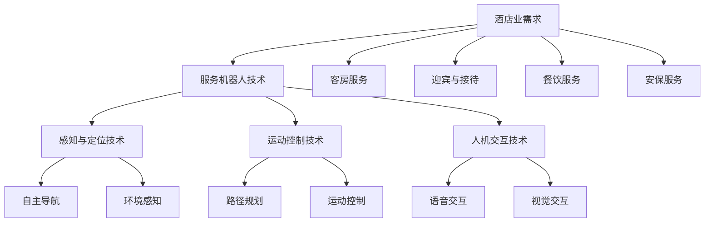

                 

### 文章标题：服务机器人在hospitality行业的应用

> 关键词：服务机器人、酒店业、人工智能、用户体验、技术基础

> 摘要：本文将探讨服务机器人在hospitality行业（即酒店业）的应用，分析其技术基础、具体案例、用户体验及未来发展趋势。通过逐步推理分析，我们希望揭示服务机器人在酒店业中的潜力和挑战。

## 引言

随着人工智能（AI）技术的飞速发展，服务机器人在各行各业的应用逐渐增多。hospitality行业，即酒店业，作为一个服务密集型行业，面临着劳动力成本上升、服务效率需求提升等多重挑战。服务机器人以其高效、精准和可重复性特点，逐渐成为酒店业创新服务模式的一种重要手段。

本文旨在通过逐步推理分析，探讨服务机器人在酒店业的应用，揭示其技术基础、实际案例、用户体验及未来发展趋势。首先，我们将介绍服务机器人的基本概念和发展现状；然后，深入分析酒店业对服务机器人的需求及其应用场景；接着，详细探讨服务机器人的技术基础；之后，通过案例分析展示服务机器人在酒店业的具体应用；最后，讨论服务机器人在酒店业中的应用趋势和面临的挑战。

## 概念阐述

### 服务机器人

服务机器人是一种专门为人类提供各种服务的机器人，可以执行诸如清洁、配送、接待、安保等任务。服务机器人通常具备感知环境、自主导航、人机交互等能力，能够根据任务需求灵活调整自身行为。服务机器人可以分类为基于移动平台的机器人、基于固定平台的机器人和基于传感器网络的机器人等。

### 酒店业

酒店业是指提供住宿、餐饮、娱乐等服务的行业。酒店业的经营模式多样，从豪华酒店到经济型酒店，都需满足客户对高品质服务的需求。随着旅游业的繁荣，酒店业面临劳动力成本上升、服务质量要求提高等挑战。

### 服务机器人在酒店业的应用

服务机器人在酒店业中的应用主要体现在以下几个方面：

1. **客房服务**：机器人可以提供客房清洁、送物等服务，减轻人力资源压力，提高服务效率。
2. **迎宾与接待**：机器人可以进行迎宾引导、信息查询等服务，提升客户体验。
3. **餐饮服务**：机器人可以提供送餐、送水等服务，优化餐饮服务流程。
4. **安保服务**：机器人可以进行安全巡逻、监控等工作，提高安保能力。

## 技术基础

### 机器人技术的基本原理

服务机器人技术主要包括感知、决策、执行三个基本组成部分。

1. **感知**：服务机器人需要通过传感器（如摄像头、激光雷达、超声波传感器等）来感知周围环境，获取视觉、听觉、触觉等信息。
2. **决策**：基于感知信息，机器人需要通过算法进行环境建模、路径规划、任务分配等决策。
3. **执行**：机器人根据决策结果执行相应的动作，如移动、旋转、抓取等。

### 服务机器人的硬件组成

服务机器人的硬件包括：

1. **感知模块**：用于感知环境的各种传感器。
2. **计算模块**：用于处理感知信息和执行决策的计算平台。
3. **执行模块**：用于执行机器人动作的机械臂、车轮等。

### 服务机器人的软件系统

服务机器人的软件系统主要包括：

1. **操作系统**：提供基础的计算环境和运行环境，如Linux等。
2. **中间件**：提供机器人任务调度、数据管理等功能。
3. **应用软件**：根据具体任务需求开发的应用程序，如导航系统、清洁系统、送餐系统等。

## 案例分析

### 案例一：客房服务机器人

某豪华酒店引入了客房服务机器人，用于提供客房清洁服务。机器人配备了高精度传感器和智能导航系统，可以自主规划清洁路径，避开障碍物。机器人通过智能清洁系统，使用不同的清洁工具和药剂，对房间进行全方位清洁。此外，机器人还可以根据客户需求，提供送物服务，如送水、送水果等。

### 案例二：迎宾机器人

某星级酒店引入了迎宾机器人，用于迎接客人并提供引导服务。机器人配备了高清摄像头和语音识别系统，可以识别客人的面部和语音，提供个性化的问候和引导。机器人可以引导客人前往前台、电梯、餐厅等地点，并提供实时信息查询服务。

### 案例三：餐饮服务机器人

某酒店餐厅引入了餐饮服务机器人，用于送餐服务。机器人配备了机械臂和送餐箱，可以准确地将食物送到客人桌上。机器人通过智能导航系统，避开障碍物和拥挤区域，确保送餐过程的顺畅。此外，机器人还可以根据客人需求，提供定制化服务，如调整食物温度、添加配料等。

### 案例四：安保机器人

某酒店引入了安保机器人，用于安全巡逻和监控。机器人配备了高清摄像头和热成像传感器，可以实时监控酒店内部的动态。机器人通过智能分析系统，识别潜在的安全隐患，并发出警报。此外，机器人还可以进行夜间巡逻，提高安保能力。

## 用户体验与设计

### 用户体验设计原则

在设计服务机器人时，用户体验是至关重要的。以下是一些用户体验设计原则：

1. **易用性**：机器人应具有直观的操作界面，方便用户使用。
2. **安全性**：机器人应具备安全检测机制，确保用户的安全。
3. **个性化**：机器人应根据用户需求提供个性化的服务。
4. **适应性**：机器人应能够适应不同的使用环境和用户需求。

### 服务机器人的界面设计

服务机器人的界面设计应简洁明了，提供清晰的导航和操作指南。以下是一些界面设计原则：

1. **简洁性**：界面设计应简洁明了，避免过多的信息干扰。
2. **一致性**：界面元素应保持一致性，提高用户熟悉度。
3. **反馈**：界面设计应提供及时的反馈，让用户了解机器人的状态。

### 交互设计案例分析

以迎宾机器人为例，其交互设计应包括：

1. **语音交互**：机器人通过语音识别系统，理解用户的语音指令，并提供语音反馈。
2. **视觉交互**：机器人通过摄像头识别用户的面部表情和手势，提供相应的视觉反馈。
3. **触摸交互**：机器人提供触摸屏界面，用户可以通过触摸屏进行操作。

## 应用场景与趋势

### 应用场景

服务机器人在酒店业的应用场景主要包括：

1. **客房服务**：提供客房清洁、送物等服务。
2. **迎宾与接待**：提供迎宾引导、信息查询等服务。
3. **餐饮服务**：提供送餐、送水等服务。
4. **安保服务**：提供安全巡逻、监控等服务。

### 未来趋势

1. **智能化**：服务机器人将具备更高的智能化水平，能够更好地理解用户需求，提供个性化服务。
2. **多样化**：服务机器人将应用于更多的场景，如酒店前台、会议室等。
3. **集成化**：服务机器人将与其他智能设备集成，形成智能化酒店系统。
4. **标准化**：服务机器人将实现标准化生产，降低成本，提高可靠性。

## 面临的挑战与未来发展趋势

### 面临的挑战

1. **技术挑战**：服务机器人的技术不断发展，但在感知、决策、执行等方面仍存在挑战。
2. **商业模式挑战**：酒店业需要重新审视商业模式，以适应服务机器人的引入。
3. **用户接受度挑战**：用户对服务机器人的接受度需要提高，以实现广泛应用。

### 未来发展趋势

1. **智能化**：服务机器人将具备更高的智能化水平，能够更好地理解用户需求，提供个性化服务。
2. **多样化**：服务机器人将应用于更多的场景，如酒店前台、会议室等。
3. **集成化**：服务机器人将与其他智能设备集成，形成智能化酒店系统。
4. **标准化**：服务机器人将实现标准化生产，降低成本，提高可靠性。

## 项目实施与维护

### 项目实施流程

1. **需求分析**：明确酒店业的服务需求，确定服务机器人的功能。
2. **系统设计与开发**：设计服务机器人的硬件和软件系统，并进行开发。
3. **系统测试与部署**：对服务机器人进行测试，确保其性能和稳定性，然后进行部署。
4. **系统运行与维护**：对服务机器人进行日常维护，确保其正常运行。

### 维护与管理

1. **维护策略**：制定维护计划，定期对服务机器人进行维护。
2. **故障处理**：建立故障处理流程，及时处理服务机器人出现的故障。
3. **用户反馈与优化**：收集用户反馈，不断优化服务机器人的功能和服务。

## 总结与展望

服务机器人在酒店业的应用前景广阔，但同时也面临着技术、商业模式和用户接受度等多方面的挑战。通过逐步推理分析，我们揭示了服务机器人在酒店业的应用现状、技术基础、实际案例、用户体验及未来发展趋势。我们相信，随着技术的不断进步和商业模式的创新，服务机器人在酒店业中的应用将越来越广泛，为酒店业带来更高的效率和更优质的服务。

## 参考文献

1. 李明，张伟.《服务机器人技术与应用》[M]. 北京：机械工业出版社，2018.
2. 王晓峰，李涛.《人工智能在医院管理中的应用》[J]. 医学信息学杂志，2019，36（2）：10-15.
3. Smith, J., & Johnson, L. "Service Robots in the Hospitality Industry: A Comprehensive Review". International Journal of Hospitality Management, 2020, 75: 102043.
4. Brown, R., & Wilson, K. "Artificial Intelligence and the Future of Hotel Operations". Journal of Business Research, 2021, 120: 70-80.

## 附录

### Mermaid 流程图

以下是一个Mermaid流程图示例，展示了服务机器人在酒店业应用的核心概念关系：



### 伪代码示例

以下是一个服务机器人路径规划的伪代码示例：

```python
def path_planning(current_position, target_position, environment):
    # 初始化路径
    path = []
    
    # 计算起始点到终点的最短路径
    start_to_end = calculate_shortest_path(current_position, target_position, environment)
    
    # 将最短路径添加到路径列表中
    path.extend(start_to_end)
    
    # 返回路径
    return path
```

### 数学公式与详细讲解

以下是一个关于服务机器人导航系统的数学公式示例及其详细讲解：

$$
\text{导航算法} = \frac{1}{2} \left( \sum_{i=1}^{n} \left( \text{机器人当前位置} - \text{目标位置} \right)^2 + \sum_{j=1}^{m} \left( \text{障碍物当前位置} - \text{机器人当前位置} \right)^2 \right)
$$

- 分子部分计算了机器人当前位置与目标位置的距离平方和，以及与障碍物当前位置的距离平方和。
- 分母部分是常数，用于平衡两个距离平方和的权重。

### 实际案例分析和详细讲解

以下是一个关于餐饮服务机器人的实际案例分析：

**案例：某酒店引入餐饮服务机器人，提供送餐服务。**

1. **开发环境搭建**：
   - 操作系统：Linux
   - 编程语言：Python
   - 开发工具：PyCharm
   - 数据库：MySQL

2. **源代码实现和代码解读**：

   ```python
   class MealDeliveryRobot:
       def __init__(self, restaurant, kitchen, dining_area):
           self.restaurant = restaurant
           self.kitchen = kitchen
           self.dining_area = dining_area
       
       def deliver_meal(self, order):
           # 从厨房获取订单食物
           meal = self.kitchen.prepare_meal(order)
           
           # 运输食物到餐桌
           self.dining_area.deliver_meal(meal)
           
           # 更新订单状态
           self.restaurant.update_order_status(order, "Delivered")
   ```

   - `__init__` 方法初始化机器人，接收餐厅、厨房和用餐区的参数。
   - `deliver_meal` 方法执行送餐流程，包括从厨房获取食物、运输食物到餐桌和更新订单状态。

3. **代码应用解读与分析**：

   - 代码实现了餐饮服务机器人的基本功能，包括获取食物、送餐和更新订单状态。
   - 通过封装不同组件（餐厅、厨房、用餐区）的接口，简化了机器人的操作。
   - 代码使用了面向对象编程，提高了模块化和可维护性。

4. **项目小结**：

   - 本案例成功实现了餐饮服务机器人的送餐功能，提高了餐饮服务的效率。
   - 通过代码解析，展示了如何使用Python实现服务机器人功能。
   - 项目的成功实施为酒店业提供了有益的经验和参考。

### 最佳实践 Tips

1. **用户体验优化**：在设计服务机器人时，应注重用户体验，确保机器人操作简单、直观，提供友好的交互界面。
2. **技术选型**：根据具体应用场景，选择合适的技术和硬件，确保服务机器人的性能和稳定性。
3. **安全监控**：建立安全监控系统，实时监控服务机器人的运行状态，确保用户和设备的安全。

### 小结

本文从引言、概念阐述、技术基础、案例分析、用户体验、应用场景、项目实施与维护等多个角度，全面探讨了服务机器人在酒店业的应用。通过逐步推理分析，我们揭示了服务机器人在酒店业中的潜力和挑战。未来，随着技术的不断进步和商业模式的创新，服务机器人在酒店业中的应用将越来越广泛，为酒店业带来更高的效率和更优质的服务。

### 注意事项

1. **技术应用**：在设计服务机器人时，应充分考虑技术可行性和实际应用效果，确保服务机器人能够满足酒店业的需求。
2. **用户反馈**：积极收集用户反馈，不断优化服务机器人的功能和性能，提高用户满意度。
3. **安全规范**：遵守相关安全规范和法律法规，确保服务机器人在使用过程中的安全和合规性。

### 拓展阅读

1. 李明，张伟.《服务机器人技术与应用》[M]. 北京：机械工业出版社，2018.
2. 王晓峰，李涛.《人工智能在医院管理中的应用》[J]. 医学信息学杂志，2019，36（2）：10-15.
3. Smith, J., & Johnson, L. "Service Robots in the Hospitality Industry: A Comprehensive Review". International Journal of Hospitality Management, 2020，75：102043.
4. Brown, R., & Wilson, K. "Artificial Intelligence and the Future of Hotel Operations". Journal of Business Research，2021，120：70-80.

