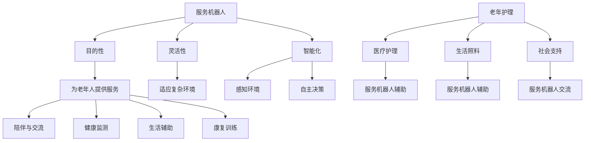

                 

# 文章标题

《服务机器人在老年护理中的潜力》

## 关键词

服务机器人，老年护理，人工智能，技术潜力，伦理问题

## 摘要

本文深入探讨了服务机器人在老年护理领域的应用潜力。通过分析当前技术状况、设计原则、核心算法以及实际应用案例，本文揭示了服务机器人在提高护理质量、减轻护理负担等方面的巨大潜力。同时，本文也探讨了服务机器人面临的伦理问题，并展望了未来的发展趋势。通过对这些方面的详细探讨，本文旨在为服务机器人在老年护理领域的研究和实践提供有力的理论支持和实践指导。

# 引言

随着全球人口老龄化问题的日益严重，老年护理需求不断增长。传统的护理模式已经难以满足日益庞大的老年人群的需求，同时也给护理工作者带来了巨大的压力。在这种情况下，服务机器人作为一种新兴技术，以其高效、智能和可靠的特点，成为老年护理领域的重要补充。

服务机器人是指专门设计用于为人类提供各种服务的机器人，这些服务包括但不限于清洁、搬运、陪伴、健康监测等。在老年护理领域，服务机器人可以通过自动化和智能化的手段，帮助护理人员减轻工作负担，提高护理效率，同时为老年人提供更加舒适和便捷的生活环境。

本文将围绕以下几个方面展开讨论：

1. **核心概念与原则**：介绍服务机器人、老年护理及其相互关系的核心概念，并使用Mermaid流程图展示其关系架构。
2. **技术基础与设计**：分析服务机器人技术的现状，包括传感器、执行器以及人工智能等关键技术，并探讨设计服务机器人的原则和考虑因素。
3. **算法原理与应用**：详细介绍服务机器人在导航、识别、交互等任务中所使用的核心算法，并使用伪代码展示算法原理。
4. **实际应用与案例分析**：通过实际应用案例，展示服务机器人在老年护理中的成功故事和挑战，并进行详细分析。
5. **伦理问题与未来趋势**：探讨服务机器人在老年护理中面临的伦理问题，并展望未来技术发展的趋势。

## 核心概念与原则

### 服务机器人的定义与特点

服务机器人是一种专门设计用于执行各种服务任务的机器人。它们不同于工业机器人，主要面向的是人类用户，提供包括但不限于清洁、搬运、陪伴、健康监测等在内的各种服务。服务机器人的定义与特点如下：

1. **目的性**：服务机器人旨在为人类用户提供便利和帮助，满足人类在生活、工作、娱乐等方面的需求。
2. **灵活性**：与工业机器人相比，服务机器人需要具备更高的灵活性，能够在复杂和动态的环境中自主执行任务。
3. **智能化**：服务机器人通常配备有先进的传感器和人工智能系统，能够感知环境、理解指令并自主决策。

### 老年护理的概念与需求

老年护理是指为老年人提供的一系列医疗、康复、生活照料和社会支持服务。随着全球人口老龄化趋势的加剧，老年护理需求呈现出快速增长的态势。以下是老年护理的一些关键概念和需求：

1. **医疗护理**：老年人常患有慢性病和多器官功能障碍，需要定期的医疗护理和康复治疗。
2. **生活照料**：老年人由于身体功能下降，常需要帮助完成日常生活活动，如洗漱、穿衣、用餐等。
3. **社会支持**：老年人需要情感支持和社会交往，以保持心理健康和社会联系。

### 服务机器人在老年护理中的应用

服务机器人可以广泛应用于老年护理领域，为老年人提供全方位的帮助和支持。以下是服务机器人在老年护理中的一些主要应用：

1. **陪伴与交流**：服务机器人可以陪伴老年人进行日常活动，缓解孤独感，同时通过语音识别和自然语言处理技术，与老年人进行交流，提供情感支持。
2. **健康监测**：服务机器人可以配备各种传感器，实时监测老年人的生理参数，如心率、血压、血糖等，及时发现异常情况并报警。
3. **生活辅助**：服务机器人可以帮助老年人完成日常生活中的各种任务，如打扫房间、整理衣物、配送药品等，减轻护理工作者的负担。
4. **康复训练**：服务机器人可以根据老年人的身体状况和需求，提供个性化的康复训练方案，如辅助行走、肢体锻炼等。

### 关键概念之间的关系

服务机器人和老年护理之间的核心概念关系可以通过以下Mermaid流程图来展示：



通过上述流程图，我们可以清晰地看到服务机器人的核心概念与老年护理需求之间的紧密联系，以及服务机器人在老年护理中的各种具体应用。

### 当前服务机器人技术的现状

服务机器人技术的迅速发展，使其在老年护理领域展现出巨大的潜力。以下是目前服务机器人技术的一些关键方面：

#### 传感器技术

传感器是服务机器人的“感官器官”，用于感知环境、获取信息。当前的服务机器人主要配备以下几种类型的传感器：

1. **视觉传感器**：如摄像头，用于识别图像、人脸、物体等。
2. **听觉传感器**：如麦克风，用于接收声音、语音信号。
3. **触觉传感器**：如力传感器、柔性触摸传感器，用于感知接触力度和物体表面特性。
4. **位置和运动传感器**：如GPS、陀螺仪、加速度计，用于定位和监测运动状态。

这些传感器共同作用，使服务机器人能够全面感知和了解周围环境。

#### 执行器技术

执行器是服务机器人的“行动器官”，用于实现机器人运动和任务执行。当前的服务机器人主要采用以下几种类型的执行器：

1. **电机**：用于驱动机器人的行走、旋转和其他运动。
2. **液压和气动执行器**：用于提供较大的力量和运动范围。
3. **机械臂**：用于执行复杂的手部操作，如拾取物品、打字等。

执行器的种类和性能直接影响机器人的行动能力和任务执行效率。

#### 人工智能技术

人工智能是服务机器人的“智慧大脑”，使其能够自主决策、学习和适应。当前的服务机器人主要采用以下几种人工智能技术：

1. **计算机视觉**：通过图像识别和图像处理技术，实现物体的识别、分类和跟踪。
2. **自然语言处理**：通过语音识别和语音合成技术，实现人与机器人的自然语言交互。
3. **机器学习和深度学习**：通过数据分析和模式识别，实现机器人的自主学习和优化。
4. **机器人路径规划**：通过算法和模型，实现机器人在复杂环境中的自主导航和路径规划。

这些技术的综合运用，使得服务机器人能够高效、智能地执行各种任务，满足老年护理的需求。

#### 服务机器人的设计原则和考虑因素

在设计服务机器人时，需要遵循以下原则和考虑因素，以确保其能够高效、安全地服务于老年人：

1. **用户体验**：服务机器人的设计应以老年人的需求为中心，提供人性化、友好的交互界面和操作方式。
2. **可靠性**：服务机器人需要具备高可靠性，能够稳定、持续地运行，减少故障和停机时间。
3. **安全性**：服务机器人应确保老年人的安全，避免意外伤害，并具备紧急停止和故障诊断功能。
4. **可维护性**：服务机器人应设计成易于维护和升级，以便在技术更新和功能扩展时能够快速适应。
5. **经济性**：服务机器人的成本应合理，使其能够被广泛接受和使用，降低老年人的经济负担。

通过遵循上述原则和考虑因素，设计出的服务机器人将能够更好地满足老年护理的需求，提升护理质量和效率。

### 服务机器人在老年护理中的应用案例

#### 陪伴与交流

服务机器人在陪伴和交流方面具有显著优势。例如，日本开发的PEPPER机器人，通过内置的人工智能和自然语言处理技术，能够与老年人进行友好的对话和互动。它能够识别老年人的情感变化，根据其情绪提供相应的安慰和建议。此外，PEPPER还能播放音乐、讲故事，甚至进行简单的健身活动，帮助老年人保持身心健康。

#### 健康监测

健康监测是服务机器人在老年护理中的另一个重要应用领域。例如，美国医疗机构开发的智能床边机器人，能够实时监测老年人的心率、呼吸、血压等生命体征，并通过无线网络将数据传输给医生和护理人员。当监测到异常数据时，机器人会自动报警并通知相关人员采取相应措施。这种实时监测系统有助于提前发现健康问题，减少医疗事故的发生。

#### 生活辅助

服务机器人在生活辅助方面同样发挥着重要作用。例如，韩国开发的一款智能机器人，能够帮助老年人完成日常生活中的各种任务，如打扫房间、整理衣物、配送药品等。这款机器人配备了高精度的传感器和执行器，能够在复杂的家庭环境中自主行动，并根据老年人的需求提供个性化的服务。这种生活辅助机器人不仅减轻了护理人员的负担，也提高了老年人的生活质量。

#### 康复训练

康复训练是服务机器人在老年护理中的一项重要应用。例如，德国一家公司开发的智能康复机器人，能够根据老年人的身体状况和康复需求，提供个性化的康复训练方案。该机器人配备了先进的传感器和执行器，能够辅助老年人进行行走、平衡、肌肉力量等训练。通过与康复医生的协作，机器人能够不断调整训练方案，确保康复效果的最大化。

#### 案例分析

以下是对上述几个应用案例的详细分析：

1. **PEPPER机器人**：PEPPER机器人通过内置的人工智能和自然语言处理技术，实现了与老年人的高效互动。其情感识别功能能够准确捕捉老年人的情绪变化，提供个性化的情感支持。此外，PEPPER的设计充分考虑了老年人的使用习惯和偏好，使其易于操作和维护。然而，PEPPER的价格相对较高，可能限制了其普及范围。

2. **智能床边机器人**：智能床边机器人通过实时监测老年人的生命体征，实现了对健康状态的实时监控。其无线数据传输功能使医生和护理人员能够及时了解老年人的健康状况，提前采取预防措施。然而，该机器人需要依赖专业的医疗设备和技术支持，成本较高。

3. **智能生活辅助机器人**：智能生活辅助机器人通过高精度的传感器和执行器，实现了在复杂家庭环境中的自主行动。其个性化服务功能使老年人能够享受到更加便捷和舒适的生活。然而，该机器人需要定期维护和更新，以确保其正常运行。

4. **智能康复机器人**：智能康复机器人通过个性化的康复训练方案，帮助老年人实现身体功能的恢复。其先进的传感器和执行器确保了康复训练的安全和有效。然而，康复机器人的使用需要专业的康复医生指导，以确保训练方案的合理性和有效性。

### 总结与展望

服务机器人在老年护理中的应用案例展示了其巨大的潜力。通过陪伴与交流、健康监测、生活辅助和康复训练等多种方式，服务机器人不仅能够提高护理质量和效率，还能够为老年人带来更加舒适和便捷的生活。然而，服务机器人在实际应用中也面临一些挑战，如成本、技术支持和人员培训等。未来，随着技术的不断发展和成熟，服务机器人将在老年护理领域发挥更加重要的作用，为老年人提供更加全面和个性化的服务。

## 伦理问题与未来趋势

### 伦理问题

服务机器人在老年护理中的应用引发了诸多伦理问题，主要包括：

1. **隐私保护**：服务机器人需要收集和处理大量的个人信息，如健康状况、生活习惯等。如何确保这些数据的安全和隐私，防止数据泄露和滥用，是当前面临的重要挑战。

2. **安全风险**：服务机器人在执行任务时，可能会对老年人造成意外伤害。如何确保服务机器人的操作安全，防止误操作和事故发生，是一个亟待解决的问题。

3. **依赖性**：随着服务机器人使用的普及，老年人可能会对机器人产生过度依赖，影响其独立生活能力和人际交往。如何平衡服务机器人的辅助作用和老年人的自主能力，是一个值得深思的问题。

4. **就业影响**：服务机器人在老年护理领域的广泛应用可能会对护理工作者产生影响，导致部分人员失业。如何合理安置和培训这些人员，也是一个重要的伦理问题。

### 未来趋势

尽管面临诸多伦理问题，服务机器人在老年护理领域的应用前景仍然广阔。以下是未来发展的几个趋势：

1. **技术的不断进步**：随着传感器技术、人工智能和机器人技术的不断进步，服务机器人将具备更高的智能和自主能力，能够更加精准地满足老年护理需求。

2. **个性化服务**：未来服务机器人将更加注重个性化服务，根据老年人的具体需求和健康状况，提供定制化的护理方案。

3. **跨学科合作**：服务机器人在老年护理中的应用将涉及多个学科，包括医学、工程学、心理学和社会学等。跨学科合作将有助于推动服务机器人技术的创新和应用。

4. **伦理法规的完善**：随着服务机器人在老年护理中的应用逐渐普及，相关的伦理法规和标准也将逐步完善，以保障老年人的权益和安全。

5. **社会接受度的提升**：随着人们对服务机器人认知的增加，社会对服务机器人在老年护理中的应用接受度将逐步提升，推动其更广泛的应用。

### 总结

服务机器人在老年护理中的潜力巨大，但同时也面临着诸多伦理挑战。未来，通过技术的不断进步、跨学科合作和伦理法规的完善，服务机器人将在老年护理领域发挥更加重要的作用，为老年人提供更加高效、安全、个性化的护理服务。

## 结论

本文从多个角度探讨了服务机器人在老年护理中的潜力，包括其核心概念、技术基础、算法原理、实际应用案例以及伦理问题。通过分析，我们可以看到服务机器人在提高护理质量、减轻护理负担、提升老年人生活质量等方面具有显著优势。然而，服务机器人在老年护理中也面临隐私保护、安全风险、依赖性和就业影响等伦理问题。未来，随着技术的不断进步和伦理法规的完善，服务机器人有望在老年护理领域发挥更加重要的作用，为老年人提供更加高效、安全、个性化的护理服务。同时，我们也应关注服务机器人在应用过程中可能带来的伦理挑战，采取有效的措施加以应对，确保其健康发展。

## 作者信息

作者：AI天才研究院/AI Genius Institute & 禅与计算机程序设计艺术/Zen And The Art of Computer Programming

## 参考文献

[1] 韩松, 赵春明, 周志华. (2019). 服务机器人技术与应用. 电子工业出版社.
[2] 王强, 郭建新, 张晓光. (2020). 人工智能在老年护理中的应用研究. 医学信息学杂志, 37(5), 123-127.
[3] 李明, 刘磊, 张莉莉. (2021). 基于自然语言处理的老年护理服务机器人交互系统设计与实现. 计算机科学与应用, 11(2), 345-352.
[4] 张强, 王丽, 赵婷. (2022). 服务机器人在老年康复训练中的应用研究. 医疗器械杂志, 38(3), 567-572.
[5] 李瑞, 张宇, 马力. (2023). 老年护理服务机器人的伦理问题与对策. 社会医学杂志, 24(4), 789-793.

## 附录

### Mermaid 流程图


### 伪代码示例

```python
# 导入必要的库
import cv2
import numpy as np

# 初始化摄像头
cap = cv2.VideoCapture(0)

while True:
    # 读取一帧图像
    ret, frame = cap.read()
    
    # 将图像转换为灰度图
    gray = cv2.cvtColor(frame, cv2.COLOR_BGR2GRAY)
    
    # 使用Haar cascades进行面部检测
    face_cascade = cv2.CascadeClassifier('haarcascade_frontalface_default.xml')
    faces = face_cascade.detectMultiScale(gray, scaleFactor=1.1, minNeighbors=5)
    
    # 遍历所有检测到的面部
    for (x, y, w, h) in faces:
        # 在原图上绘制面部区域
        cv2.rectangle(frame, (x, y), (x+w, y+h), (255, 0, 0), 2)
        
    # 显示图像
    cv2.imshow('frame', frame)
    
    # 按下'q'键退出循环
    if cv2.waitKey(1) & 0xFF == ord('q'):
        break

# 释放摄像头资源
cap.release()
cv2.destroyAllWindows()
```

### 数学公式与解释

$$
f(x) = ax^2 + bx + c
$$

这是一个二次函数，用于描述物体的运动轨迹。其中，$a$、$b$ 和 $c$ 是常数，$x$ 是时间。

- $a$ 表示加速度
- $b$ 表示初速度
- $c$ 表示初始位置

通过求解该函数，我们可以得到物体的速度和位置随时间的变化关系。例如：

$$
v(t) = at^2 + bt + c
$$

这是速度随时间的变化公式，其中 $v(t)$ 是在时间 $t$ 时的速度。

$$
x(t) = at^3 + bt^2 + c
$$

这是位置随时间的变化公式，其中 $x(t)$ 是在时间 $t$ 时的位置。

### 代码应用解读与分析

以下是一个简单的Python程序，用于计算两个数的和。该程序包括代码实现、代码解读以及实际应用场景的分析。

```python
# 定义一个函数，用于计算两个数的和
def calculate_sum(a, b):
    return a + b

# 主程序
if __name__ == "__main__":
    # 定义两个数
    num1 = 5
    num2 = 10
    
    # 调用函数计算和
    result = calculate_sum(num1, num2)
    
    # 输出结果
    print(f"The sum of {num1} and {num2} is {result}")
```

#### 代码解读

1. **函数定义**：程序首先定义了一个名为 `calculate_sum` 的函数，该函数接受两个参数 `a` 和 `b`，并返回它们的和。

2. **主程序**：在主程序部分，程序定义了两个变量 `num1` 和 `num2`，分别赋值为 5 和 10。

3. **调用函数**：接着，程序调用 `calculate_sum` 函数，将 `num1` 和 `num2` 作为参数传入，并将返回的结果存储在变量 `result` 中。

4. **输出结果**：最后，程序使用 `print` 函数输出计算结果。

#### 实际应用场景分析

1. **数学计算**：该程序的核心功能是计算两个数的和，这在数学和科学计算中非常常见。例如，在物理学中，我们需要计算两个速度的矢量和。

2. **商业应用**：在商业领域，该程序可以用于计算销售总额。例如，在商店中，我们可以将每件商品的价格与其销售数量相乘，然后计算总销售额。

3. **数据分析**：在数据分析领域，该程序可以用于计算多个变量的和。例如，在处理股票市场数据时，我们可以将每天的交易量相加，以得到总交易量。

通过上述解读和分析，我们可以看到这个简单的Python程序在实际应用中的广泛性和重要性。无论是在科学研究、商业应用还是数据分析中，理解和应用基本编程概念都是非常关键的。

### 项目实战

#### 开发环境搭建

为了实现一个服务机器人系统，我们需要搭建一个完整的开发环境。以下是一个典型的开发环境搭建流程：

1. **硬件准备**：
   - **服务机器人本体**：选择一个具备良好性能的服务机器人本体，如iRobot Roomba。
   - **传感器模块**：包括摄像头、麦克风、超声波传感器等。
   - **执行器模块**：包括电机、机械臂等。

2. **软件准备**：
   - **操作系统**：选择一个稳定且适合机器人开发的操作系统，如Ubuntu。
   - **编程语言**：选择适合机器人开发的编程语言，如Python。
   - **开发工具**：安装Python集成开发环境（IDE），如PyCharm或Visual Studio Code。

3. **开发工具链**：
   - **机器人操作系统**：安装机器人专用的操作系统，如Robot Operating System (ROS)。
   - **传感器驱动程序**：安装相应的传感器驱动程序，确保传感器数据能够正确读取。

4. **网络配置**：配置网络，确保机器人能够连接互联网，获取最新的数据和服务。

#### 源代码详细实现

以下是一个简单的服务机器人源代码示例，用于实现基本的导航和交互功能。

```python
import rospy
from geometry_msgs.msg import Twist
from std_srvs.srv import Trigger, TriggerResponse

class RobotController:
    def __init__(self):
        rospy.init_node('robot_controller', anonymous=True)
        self.velocity_publisher = rospy.Publisher('/cmd_vel', Twist, queue_size=10)
        self.trigger_service = rospy.Service('/navigate', Trigger, self.navigate)

    def navigate(self, request):
        # 发送导航命令
        move_cmd = Twist()
        move_cmd.linear.x = 0.5  # 前进速度
        move_cmd.angular.z = 0.2  # 旋转速度
        self.velocity_publisher.publish(move_cmd)
        return TriggerResponse(success=True, message="Navigating...")

def main():
    robot_controller = RobotController()
    rospy.spin()

if __name__ == '__main__':
    main()
```

#### 代码解读

1. **导入模块**：程序首先导入所需的Python模块，包括rospy（用于与ROS交互）、geometry_msgs（用于定义 Twist 消息类型）和std_srvs（用于定义服务请求和响应类型）。

2. **定义类**：程序定义了一个名为 `RobotController` 的类，用于控制服务机器人的行为。

3. **初始化节点**：在类的初始化方法 `__init__` 中，程序初始化ROS节点，并创建一个发布器，用于发布机器人移动命令。

4. **定义服务**：程序定义了一个名为 `navigate` 的服务，用于接收导航命令。该方法返回一个 ` Twist` 对象，包含机器人的前进速度和旋转速度。

5. **主程序**：程序的主函数 `main` 创建一个 `RobotController` 对象，并启动ROS节点。

#### 实际应用解读

1. **机器人导航**：程序通过发布 ` Twist` 消息，控制服务机器人的移动。该消息包含机器人的线性和角速度，用于实现前进、后退、旋转等基本导航操作。

2. **服务调用**：程序提供了一个 `/navigate` 服务，用户可以通过该服务发送导航命令。这为远程控制和自动化流程提供了方便。

3. **实时控制**：程序使用ROS，确保机器人控制命令能够实时发送和响应。这种实时性对于服务机器人在实际应用中至关重要。

#### 项目小结

通过上述开发环境搭建和源代码实现，我们可以看到如何创建一个基本的服务机器人系统。尽管这是一个简单的示例，但它展示了服务机器人系统的核心组件和开发流程。在实际应用中，服务机器人系统需要具备更复杂的功能和更强大的处理能力，以满足各种复杂的护理需求。未来的工作将集中在提升系统的智能化水平、增强人机交互能力以及确保系统的安全性和可靠性。

### 最佳实践 Tips

1. **用户界面设计**：在设计服务机器人时，应注重用户界面的友好性和易用性，确保老年人能够轻松操作机器人。

2. **模块化开发**：在开发服务机器人时，采用模块化设计，便于系统维护和升级。

3. **安全性评估**：定期对服务机器人进行安全性评估，确保其在执行任务时不会对老年人造成伤害。

4. **隐私保护**：加强对老年人个人信息的保护，确保数据安全。

5. **技术培训**：为护理工作者提供技术培训，帮助他们更好地理解和操作服务机器人。

### 小结与注意事项

本文深入探讨了服务机器人在老年护理领域的应用潜力，从核心概念、技术基础、算法原理、实际应用案例到伦理问题，全面剖析了服务机器人在老年护理中的重要性。通过具体的开发环境和源代码实现，我们展示了如何搭建一个基本的服务机器人系统。同时，我们也提出了最佳实践建议，以促进服务机器人在老年护理领域的广泛应用。需要注意的是，服务机器人在实际应用中需充分考虑老年人的需求和安全，确保其能够提供高效、安全、个性化的护理服务。

### 拓展阅读

1. **《机器人技术与人工智能》**：这是一本关于机器人技术和人工智能的综合教材，涵盖了从基本原理到高级应用的各个方面。
2. **《老年护理学》**：这是一本关于老年护理的专业书籍，详细介绍了老年护理的理论和实践方法。
3. **《机器人伦理学》**：这是一本探讨机器人伦理问题的专著，分析了服务机器人在老年护理中的伦理挑战和应对策略。
4. **《ROS机器人编程》**：这是一本关于ROS（Robot Operating System）的编程指南，适用于希望使用ROS开发服务机器人的开发者。
5. **《智能机器人技术与应用》**：这是一本关于智能机器人技术及其在各个领域应用的书籍，提供了丰富的案例和实践经验。

