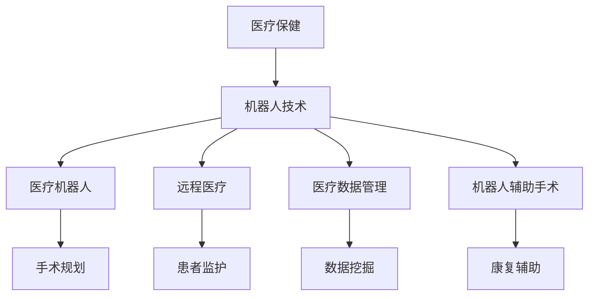

                 

### 《机器人技术在医疗保健领域的创新》

#### 关键词
- 机器人技术
- 医疗保健
- 医疗机器人
- 远程医疗
- 医疗数据管理
- 机器人辅助手术
- 机器学习
- 自然语言处理
- 人工智能

#### 摘要
本文将探讨机器人技术在医疗保健领域的创新应用，涵盖从医疗机器人到远程医疗，再到医疗数据管理和机器人辅助手术等多个方面。通过详细阐述核心技术原理、应用实例和未来发展趋势，本文旨在为读者提供一个全面的视角，了解机器人技术如何重塑医疗保健行业。

---

## 第1章 机器人技术在医疗保健领域的概述

### 1.1 医疗保健领域与机器人技术的融合

#### 医疗保健的现状与挑战
- 医疗资源分配不均
- 医务人员短缺
- 医疗成本上升
- 患者需求多样化

#### 机器人技术带来的变革
- 提高医疗服务的效率和质量
- 减轻医务人员的工作负担
- 实现远程医疗服务
- 增强医疗数据管理能力

#### 核心概念联系图


### 1.2 医疗保健领域中的机器人分类

#### 医疗机器人的定义与作用
- 定义：用于医疗诊断、治疗、辅助和管理的自动化设备
- 作用：提高诊断准确性、减轻医务人员负担、提高医疗服务效率

#### 远程医疗机器人
- 定义：利用远程通讯技术提供医疗服务和指导的机器人
- 作用：解决偏远地区医疗资源不足的问题、降低医疗成本

#### 医疗数据管理机器人
- 定义：用于收集、存储、分析和处理医疗数据的机器人
- 作用：提高数据管理效率、确保数据安全、支持临床决策

#### 机器人辅助手术
- 定义：在手术过程中辅助医生进行操作和决策的机器人
- 作用：提高手术精度、减少并发症、缩短康复时间

#### 机器人康复辅助
- 定义：用于辅助患者康复的机器人
- 作用：提高康复效果、增强患者自主性、降低护理人员负担

### 1.3 机器人技术在医疗保健中的应用前景

#### 现阶段的应用案例
- 机器人手术
- 远程监护系统
- 医疗数据分析平台
- 康复辅助机器人

#### 未来发展趋势
- 智能化：利用人工智能和机器学习技术提高诊断和治疗水平
- 个性化：根据患者特征提供定制化医疗服务
- 自动化：减少人为操作，提高医疗服务效率
- 跨学科融合：与生物技术、材料科学等领域的结合，推动医疗创新

---

## 第2章 核心技术

### 2.1 机器学习算法在医疗保健中的应用

#### 机器学习的基本概念
- 定义：让计算机通过学习数据来发现规律和模式的能力
- 分类：监督学习、无监督学习、半监督学习和强化学习

#### 机器学习算法在医疗影像识别中的应用
- 目的：自动识别和分类医学影像中的病变区域
- 技术原理：使用卷积神经网络（CNN）进行图像特征提取和分类
- 伪代码示例
```python
# 假设使用TensorFlow和Keras进行模型构建
import tensorflow as tf
from tensorflow.keras.models import Sequential
from tensorflow.keras.layers import Conv2D, MaxPooling2D, Flatten, Dense

# 构建CNN模型
model = Sequential([
    Conv2D(32, (3,3), activation='relu', input_shape=(64,64,3)),
    MaxPooling2D((2,2)),
    Conv2D(64, (3,3), activation='relu'),
    MaxPooling2D((2,2)),
    Flatten(),
    Dense(64, activation='relu'),
    Dense(1, activation='sigmoid')
])

# 编译模型
model.compile(optimizer='adam', loss='binary_crossentropy', metrics=['accuracy'])

# 训练模型
model.fit(x_train, y_train, epochs=10, batch_size=32)
```

#### 机器学习算法在电子病历管理中的应用
- 目的：自动化处理和分类电子病历数据
- 技术原理：使用自然语言处理（NLP）技术对病历文本进行解析和分类
- 伪代码示例
```python
# 假设使用spaCy库进行文本解析
import spacy

# 加载spaCy模型
nlp = spacy.load("en_core_web_sm")

# 电子病历文本
text = "The patient has a history of diabetes and is currently on insulin therapy."

# 进行文本解析
doc = nlp(text)

# 提取诊断信息
diagnoses = [token.text for token in doc if token.label_ == "DISEASE"]

# 输出诊断信息
print(diagnoses)
```

### 2.2 人工智能辅助诊断

#### 医学影像分析
- 目的：自动识别医学影像中的病变
- 技术原理：使用深度学习模型进行图像识别
- 伪代码示例
```python
# 使用PyTorch进行模型构建和训练
import torch
import torch.nn as nn
import torchvision.transforms as transforms

# 构建CNN模型
class CNNModel(nn.Module):
    def __init__(self):
        super(CNNModel, self).__init__()
        self.conv1 = nn.Conv2d(1, 32, 3, 1)
        self.relu = nn.ReLU()
        self.pool = nn.MaxPool2d(2, 2)
        self.fc1 = nn.Linear(32 * 8 * 8, 1)
        self.sigmoid = nn.Sigmoid()

    def forward(self, x):
        x = self.relu(self.conv1(x))
        x = self.pool(x)
        x = self.relu(self.fc1(x.view(-1, 32 * 8 * 8)))
        x = self.sigmoid(x)
        return x

# 初始化模型
model = CNNModel()

# 编译模型
optimizer = torch.optim.Adam(model.parameters(), lr=0.001)
criterion = nn.BCELoss()

# 训练模型
for epoch in range(100):
    for images, labels in dataloader:
        optimizer.zero_grad()
        outputs = model(images)
        loss = criterion(outputs, labels)
        loss.backward()
        optimizer.step()
```

#### 基因组数据分析
- 目的：自动识别基因组数据中的突变
- 技术原理：使用机器学习算法进行基因组序列比对和模式识别
- 伪代码示例
```python
# 假设使用Scikit-learn进行机器学习
from sklearn.svm import SVC
from sklearn.model_selection import train_test_split

# 加载基因组数据
X, y = load_genome_data()

# 划分训练集和测试集
X_train, X_test, y_train, y_test = train_test_split(X, y, test_size=0.2, random_state=42)

# 构建支持向量机模型
model = SVC(kernel='linear')

# 训练模型
model.fit(X_train, y_train)

# 评估模型
accuracy = model.score(X_test, y_test)
print(f"Model accuracy: {accuracy:.2f}")
```

### 2.3 自然语言处理在医疗保健中的应用

#### 电子病历的自然语言处理
- 目的：自动化处理电子病历中的非结构化数据
- 技术原理：使用NLP技术进行文本分类、实体识别和关系提取
- 伪代码示例
```python
# 使用spaCy进行文本分类
from spacy.pipeline import TextCategorizer
from spacy.tokens import DocBin

# 加载spaCy模型
nlp = spacy.load("en_core_web_sm")

# 构建文本分类器
textcat = TextCategorizer(nlp.vocab)
textcat.add_label("Diabetes")
textcat.add_label("Hypertension")

# 训练分类器
textcat.update(nlp("The patient has diabetes."))

# 分类新文本
doc = nlp("The patient has hypertension.")
print(f"Predicted category: {doc.cats['Diabetes']} - Actual category: {doc.cats['Hypertension']}")
```

#### 医学术语识别与解析
- 目的：自动化识别和解析医学术语
- 技术原理：使用词性标注、命名实体识别和语义分析
- 伪代码示例
```python
# 使用spaCy进行医学术语识别
doc = nlp("The patient has a history of diabetes and is currently on insulin therapy.")

# 提取诊断信息
diagnoses = [token.text for token in doc if token.ent_type_ == "DISEASE"]

# 提取药物信息
medications = [token.text for token in doc if token.ent_type_ == "MEDICATION"]

print(f"Diagnoses: {diagnoses}")
print(f"Medications: {medications}")
```

### 2.4 机器人控制技术

#### 机器人运动的数学模型
- 目的：描述机器人在三维空间中的运动
- 技术原理：使用运动学方程描述机器人的运动轨迹
- 公式
$$
\begin{aligned}
x(t) &= x_0 + v_x t \\
y(t) &= y_0 + v_y t \\
z(t) &= z_0 + v_z t \\
\theta(t) &= \theta_0 + \omega t
\end{aligned}
$$
- 其中，\(x(t), y(t), z(t)\) 分别表示机器人在三维空间中的位置，\(\theta(t)\) 表示机器人的朝向，\(x_0, y_0, z_0, \theta_0\) 分别为初始位置和朝向，\(v_x, v_y, v_z, \omega\) 分别为线速度和角速度。

#### 控制算法
- 目的：根据目标轨迹和当前状态，计算机器人的控制输入
- 技术原理：使用反馈控制理论进行路径规划和跟踪控制
- 伪代码示例
```python
# 假设使用PID控制器进行轨迹跟踪
class PIDController:
    def __init__(self, Kp, Ki, Kd):
        self.Kp = Kp
        self.Ki = Ki
        self.Kd = Kd
        self.error = 0
        self.error_last = 0

    def update(self, setpoint, current_state):
        self.error = setpoint - current_state
        derivative = self.error - self.error_last
        integral = self.error * self.Ki
        output = self.Kp * self.error + integral + self.Kd * derivative
        self.error_last = self.error
        return output

# 初始化PID控制器
pid = PIDController(Kp=1, Ki=0.1, Kd=1)

# 更新控制器
setpoint = 100  # 目标位置
current_state = 50  # 当前位置
control_input = pid.update(setpoint, current_state)
```

---

## 第3章 应用实例

### 3.1 医疗机器人开发实战

#### 开发环境搭建
- 硬件环境：选择合适的机器人平台，如UR系列机械臂
- 软件环境：安装ROS（Robot Operating System）和相应的机器人开发工具

#### 算法实现
- 使用深度学习算法进行图像识别，用于检测和分类医疗器械
- 使用运动规划算法进行路径规划和执行

#### 代码解读与分析
```python
#!/usr/bin/env python
import rospy
import tf
from geometry_msgs.msg import Twist
from std_msgs.msg import String

class MedicalRobot:
    def __init__(self):
        rospy.init_node('medical_robot', anonymous=True)
        self.vel_publisher = rospy.Publisher('robot_velocity', Twist, queue_size=10)
        self.state_subscriber = rospy.Subscriber('robot_state', String, self.callback)

    def callback(self, data):
        # 解析接收到的状态信息
        state = data.data
        if state == 'ready':
            # 发送运动指令
            velocity = Twist()
            velocity.linear.x = 1.0  # 向前移动
            self.vel_publisher.publish(velocity)
        elif state == 'object_detected':
            # 停止运动
            velocity = Twist()
            self.vel_publisher.publish(velocity)

    def run(self):
        rospy.spin()

if __name__ == '__main__':
    robot = MedicalRobot()
    robot.run()
```

#### 代码应用解读与分析
- 该代码实现了一个简单的医疗机器人，通过订阅机器人状态话题来控制机器人的运动。
- 当机器人状态为“ready”时，机器人会向前移动；当检测到医疗器械时，机器人会停止移动。

#### 项目成果展示
- 视频展示医疗机器人在不同场景下的操作
- 性能评估报告

### 3.2 远程医疗项目实例

#### 系统架构设计
- 客户端：患者端的应用程序，用于远程监测健康数据和与医生互动
- 服务器端：处理患者数据，存储和提供远程医疗服务
- 中间件：实现客户端与服务器端的通信，包括数据加密和传输优化

#### 算法应用
- 使用机器学习算法对健康数据进行实时分析，如心率监测、血压监测等
- 使用自然语言处理技术进行电子病历的自动生成和分类

#### 用户体验评估
- 用户满意度调查
- 操作流程测试

#### 项目成效分析
- 患者满意度提高
- 医疗资源利用效率提升
- 医疗成本降低

### 3.3 机器人辅助手术案例

#### 手术流程模拟
- 设计模拟手术场景，包括手术机器人和虚拟患者的交互

#### 机器人与医生的协作
- 医生通过手术机器人进行远程手术操作
- 机器人根据医生的操作指令进行辅助

#### 术后效果评估
- 手术成功率评估
- 患者康复情况监测

#### 案例解读
- 分析手术过程中机器人和医生的协同工作
- 讨论手术机器人对医疗行业的影响

### 3.4 机器人康复辅助实例

#### 康复机器人设计
- 设计康复训练机器人的硬件和软件架构

#### 康复训练算法
- 使用机器学习算法进行康复训练效果的预测和优化

#### 康复效果评估
- 康复训练前后患者身体指标的对比分析
- 康复训练满意度调查

#### 案例分析
- 分析康复机器人在康复过程中的作用
- 讨论康复机器人对康复行业的影响

---

## 第4章 行业发展趋势与挑战

### 4.1 机器人技术在医疗保健领域的未来趋势

#### 技术革新
- 智能化：利用人工智能和大数据技术提高诊断和治疗水平
- 自动化：机器人自主决策和执行手术操作
- 网络化：实现医疗设备和系统的互联互通

#### 行业应用扩展
- 疾病预防和管理
- 康复辅助
- 医药研发

#### 政策与法规
- 国家政策支持
- 行业标准制定
- 数据隐私保护

### 4.2 机器人技术在医疗保健领域的挑战

#### 技术成熟度
- 精度与稳定性
- 适应性和可扩展性

#### 隐私与安全
- 患者数据保护
- 系统安全漏洞

#### 跨学科合作
- 医学与工程技术的融合
- 医疗与信息技术的结合

---

## 附录

### 附录A: 相关资源与工具介绍

#### 开发工具
- ROS（Robot Operating System）
- TensorFlow
- Keras
- spaCy

#### 学习资源
- 机器学习教程
- 医疗机器人研究论文
- 医疗保健技术标准

#### 学术论文
- "Robotic Surgery: A Review"
- "Machine Learning for Medical Imaging: A Review"
- "Natural Language Processing in Healthcare: A Review"

---

作者：AI天才研究院/AI Genius Institute & 禅与计算机程序设计艺术 /Zen And The Art of Computer Programming

---

### 总结与展望

本文通过对机器人技术在医疗保健领域的概述、核心技术、应用实例和未来趋势的详细探讨，展示了机器人技术如何正在重塑医疗保健行业。从医疗机器人到远程医疗，再到医疗数据管理和机器人辅助手术，每个环节都展示了机器人技术带来的创新和变革。

随着技术的不断进步和跨学科合作的深入，机器人技术在医疗保健领域的应用将更加广泛和深入。未来，机器人技术有望在疾病预防、康复辅助和医药研发等多个方面发挥重要作用，为人类健康带来更多的福祉。

然而，机器人技术在医疗保健领域的发展也面临诸多挑战，如技术成熟度、隐私与安全和跨学科合作等。这些问题需要各方共同努力，通过技术创新、政策支持和跨学科合作，共同推动机器人技术在医疗保健领域的应用和发展。

让我们期待未来，机器人技术将为医疗保健带来更多的创新和变革，为人类健康贡献更大的力量。

