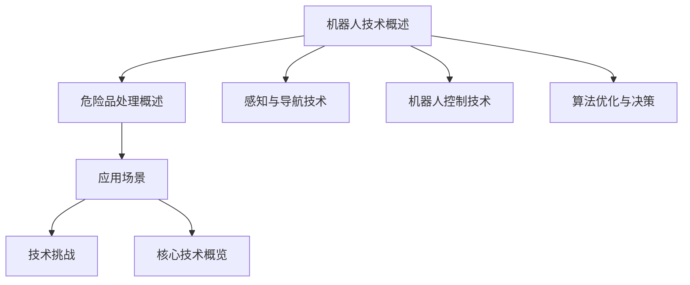

                 

### 文章标题

《机器人技术在危险品处理中的应用》

---

### 关键词

机器人技术、危险品处理、应用场景、感知与导航、控制算法、安全可靠性

---

### 摘要

本文将深入探讨机器人技术在危险品处理领域的应用。通过详细分析机器人技术的基本概念、危险品处理的需求与挑战，以及具体应用场景，我们揭示了机器人技术在这一领域的重要性和潜力。文章最后还将探讨相关技术挑战及其解决方案，为未来研究提供方向。

---

### 1.1 核心概念与联系

#### 1.1.1 机器人技术概述

**定义与分类**

机器人技术是一种综合了机械工程、电子工程、计算机科学、人工智能等多个领域的交叉学科技术。其核心目标是使机器人能够自主执行任务，模仿人类的感知、思考和行为。

- **工业机器人**：主要用于工业生产线的自动化作业，如焊接、组装、搬运等。
- **服务机器人**：用于服务业、医疗、家庭等领域，如清洁机器人、医疗辅助机器人、家用机器人等。
- **特种机器人**：用于危险、极端环境下的作业，如深海勘探机器人、消防机器人、拆弹机器人等。

**机器人技术的基本原理**

机器人技术的基本原理包括感知、决策和执行三个部分：

- **感知**：利用传感器获取环境信息，如视觉、听觉、触觉、嗅觉等。
- **决策**：通过算法处理感知信息，进行路径规划、任务分配、动作规划等。
- **执行**：根据决策结果，通过执行机构（如电机、机械臂等）完成具体任务。

#### 1.1.2 危险品处理概述

**定义与范围**

危险品处理涉及对易燃、易爆、有毒、有害等物品的安全运输、储存、处理和销毁。其主要目的是防止危险品对人类和环境造成危害。

- **爆炸品处理**：包括民用爆破、军事爆破等。
- **化学品处理**：包括废水、废气、固体废弃物的处理。
- **生物危险品处理**：包括病毒、细菌等病原体的处理。

**危险品处理的需求与挑战**

- **需求**：随着危险品运输和储存量的增加，危险品处理的需求日益迫切。特别是在高风险的环境下，如爆炸品处理、化学品处理等，对高效、安全、可靠的危险品处理技术有着迫切需求。
- **挑战**：危险品处理面临一系列挑战，包括环境复杂、操作风险高、处理过程需要高度精确等。例如，爆炸品处理需要精确控制引爆时间和力度，以避免误伤和次生灾害。

#### 1.1.3 机器人技术在危险品处理中的应用

**应用场景**

- **巡检与监控**：机器人可用于对危险品存储区域进行定期巡逻，实时监控危险品状态，防止泄漏、火灾等事故。
- **搬运与装卸**：机器人可代替人工进行危险品的搬运和装卸作业，降低人为操作风险。
- **拆解与销毁**：机器人可用于对爆炸品、危险化学品进行拆解和处理，确保销毁过程的安全性和有效性。
- **应急处理**：机器人在突发事件中可以快速响应，执行危险品泄漏、火灾等应急处理任务。

**技术挑战**

- **环境适应性**：危险品处理环境复杂，机器人需要具备较强的环境感知和适应性。
- **安全可靠性**：高度依赖于机器人的安全性和可靠性，要求机器人具备高故障容忍度和自我保护能力。
- **人机协作**：需要解决机器人与人类工人的协作问题，确保作业效率和安全性。

#### 1.1.4 核心技术概览

**感知与导航技术**

感知与导航技术是机器人技术的核心组成部分。在危险品处理领域，机器人需要具备以下感知能力：

- **环境感知**：利用传感器获取周围环境的信息，如摄像头、气体传感器、红外传感器等。
- **定位与导航**：通过感知信息确定自身位置，规划路径，实现自主移动。

**机器人控制技术**

机器人控制技术包括以下几个方面：

- **运动控制**：通过控制器实现机器人的运动控制，包括直线运动、旋转运动等。
- **任务规划**：根据任务需求，规划机器人的行动方案，确保任务高效完成。
- **故障处理**：在运行过程中，机器人需要具备自我诊断和故障处理能力，确保作业连续性。

**算法优化与决策**

算法优化与决策是提高机器人性能的关键。在危险品处理中，需要运用以下算法：

- **路径规划算法**：确定机器人从起点到终点的最优路径。
- **决策算法**：根据环境信息和任务需求，做出最优决策，如选择适当的动作序列。
- **优化算法**：通过调整参数，优化机器人的性能，如速度、精度等。

**Mermaid 流程图**

---

### 1.1.5 总结

本章节从多个维度对机器人技术在危险品处理中的应用进行了概述，包括核心概念、应用场景、技术挑战和核心技术概览。这些内容为后续章节的详细讨论打下了基础。

---

## 第二章: 机器人技术在危险品处理中的应用场景

### 2.1 巡检与监控

#### 2.1.1 巡检任务

**任务概述**

危险品存储区域的巡检任务，主要目的是监控危险品的状态，防止泄漏、火灾等事故发生。巡检内容包括但不限于：

- 检查危险品存储设施的安全性，如存储容器是否完好、密封是否严密等。
- 监测危险品的温度、湿度、压力等参数，确保在安全范围内。
- 检查存储区域的防火、防爆设施是否正常工作。
- 定期检查危险品的有效期，确保在保质期内使用。

**工作流程**

- **路径规划**：机器人根据预先设定的路线进行巡逻，确保覆盖到所有的危险品存储区域。
- **数据采集**：机器人利用传感器实时采集环境参数和危险品状态数据。
- **数据传输**：机器人通过无线通信模块将采集到的数据传输到控制中心。
- **数据分析**：控制中心对传输来的数据进行实时分析，识别潜在的隐患。
- **报警与处理**：当监测到异常情况时，机器人通过内置的通信模块向控制中心发送报警信息，触发应急响应。

#### 2.1.2 技术实现

**环境感知**

机器人配备多种传感器，如摄像头、气体传感器、温湿度传感器等，实现对危险品存储环境的全方位感知。以下是具体技术实现：

- **摄像头**：用于捕捉危险品存储区域的全景图像，通过图像识别技术检测异常情况，如泄漏、火灾等。
- **气体传感器**：用于检测危险品泄露的有害气体，如可燃气体、有毒气体等，通过传感器的信号变化判断气体浓度。
- **温湿度传感器**：用于监测存储环境的温度和湿度，确保危险品在适宜的条件下储存。

**数据处理**

机器人通过边缘计算设备对采集到的数据进行初步处理，提取关键信息，并传输到云端进行分析。以下是具体技术实现：

- **边缘计算设备**：在机器人本地进行初步数据分析和处理，减少数据传输的延迟和带宽需求。
- **数据预处理**：对采集到的数据进行滤波、去噪、归一化等处理，提高数据质量。
- **数据传输**：通过无线通信模块将预处理后的数据传输到云平台。

**报警机制**

当监测到异常情况时，机器人通过内置的通信模块向控制中心发送报警信息，触发应急响应。以下是具体技术实现：

- **报警信息生成**：在检测到异常情况时，机器人生成报警信息，包括异常类型、发生时间、位置等。
- **通信模块**：机器人通过无线通信模块将报警信息发送到控制中心。
- **应急响应**：控制中心接收到报警信息后，立即启动应急响应程序，通知相关人员进行处理。

#### 2.1.3 项目案例

**案例介绍**

某危险品仓库引入了智能巡检机器人，通过实时监控和报警机制，有效降低了事故发生率。该仓库储存了多种危险品，如化学品、易燃物品等，存储环境复杂，安全隐患较大。

**案例分析**

- **智能巡检机器人**：仓库引入了智能巡检机器人，机器人配备了多种传感器，如摄像头、气体传感器、温湿度传感器等，能够实时监控存储环境。
- **数据传输与处理**：机器人通过无线通信模块将采集到的数据传输到云平台，云平台对数据进行实时分析，识别异常情况。
- **报警与应急响应**：当检测到异常情况时，机器人立即发送报警信息到控制中心，控制中心启动应急响应程序，通知相关人员进行处理。

该案例表明，智能巡检机器人在危险品处理中的应用具有显著的优势，能够有效提高危险品存储的安全性和可靠性。

#### 2.1.4 技术评估与改进

**技术评估**

智能巡检机器人在危险品处理中的应用取得了显著成果，但还存在一些改进空间：

- **感知精度**：传感器的感知精度有待提高，特别是在复杂环境下的检测能力。
- **数据处理速度**：在数据传输和处理方面，仍存在一定的延迟，需要优化算法和通信技术。
- **人机协作**：目前机器人与人类工人的协作仍不够顺畅，需要进一步优化人机交互界面和协作机制。

**改进方向**

- **提高感知精度**：引入更高精度的传感器，如高分辨率摄像头、高灵敏度气体传感器等，提高机器人在复杂环境下的检测能力。
- **优化数据处理速度**：通过分布式计算和边缘计算技术，降低数据传输和处理的时间延迟，提高系统的响应速度。
- **提升人机协作效率**：通过设计更直观、易操作的人机交互界面，提高机器人和人类工人的协作效率，实现更高效、更安全的危险品处理。

#### 2.1.5 总结

智能巡检机器人在危险品处理中的应用具有显著的优势，能够实时监控危险品存储环境，提高安全性和可靠性。然而，仍需在感知精度、数据处理速度和人机协作等方面进行改进，以进一步提升其应用效果。

---

### 2.2 搬运与装卸

#### 2.2.1 搬运任务

**任务概述**

危险品的搬运和装卸工作，包括从仓库到运输车辆、或者从一个储存点转移到另一个储存点。搬运任务的主要目的是确保危险品的安全运输，降低人为操作风险。

**工作流程**

- **任务规划**：根据危险品的种类、数量、存储位置和目标位置，制定搬运计划。
- **路径规划**：机器人根据搬运计划，规划从起点到终点的最优路径，确保搬运过程中不发生碰撞和障碍。
- **搬运执行**：机器人按照规划路径，自动完成危险品的搬运和装卸作业。
- **状态监控**：在搬运过程中，机器人通过传感器实时监控危险品的状态，确保搬运过程的安全性和有效性。
- **反馈与优化**：机器人将搬运过程中的数据反馈给控制中心，对搬运计划进行优化，提高搬运效率。

#### 2.2.2 技术实现

**搬运机械臂**

机器人配备机械臂，可实现危险品的抓取、搬运和放置。以下是具体技术实现：

- **机械臂设计**：机械臂采用模块化设计，可根据不同的搬运任务进行灵活调整。机械臂关节采用电机驱动，实现高精度的运动控制。
- **抓取技术**：机械臂配备多种抓取工具，如夹具、吸盘等，可根据不同形状和大小的危险品选择合适的抓取工具。
- **传感器融合**：机械臂上配备多种传感器，如力传感器、位置传感器等，用于实时监测抓取力和位置，确保危险品在搬运过程中的安全。

**路径规划**

利用路径规划算法，机器人能够自主规划搬运路径，避免碰撞和障碍。以下是具体技术实现：

- **路径规划算法**：采用基于图论的路径规划算法，如A*算法、Dijkstra算法等，计算从起点到终点的最优路径。
- **动态避障**：在搬运过程中，机器人通过感知周围环境，实时更新路径规划，避免碰撞和障碍。
- **多机器人协作**：在多个机器人同时进行搬运作业时，采用分布式算法协调机器人的行动，避免碰撞和拥堵。

**安全监测**

在搬运过程中，机器人通过传感器实时监测搬运物品的状态，确保操作过程的安全性。以下是具体技术实现：

- **状态监测**：机器人通过传感器监测危险品的位置、姿态和受力情况，确保搬运过程中不发生意外。
- **异常处理**：当检测到异常情况时，机器人立即停止搬运，并通知控制中心，启动应急处理程序。
- **自我保护**：机器人具备自我保护功能，当检测到危险情况时，可以采取紧急制动、倒退等动作，确保自身安全。

#### 2.2.3 项目案例

**案例介绍**

某化学品仓库引入了智能搬运机器人，用于危险品的搬运和装卸作业。仓库储存了多种化学品，如酸碱、溶剂等，搬运过程存在较高的安全风险。

**案例分析**

- **智能搬运机器人**：仓库引入了智能搬运机器人，机器人配备了机械臂和多种传感器，可实现危险品的自动搬运和装卸。
- **路径规划与动态避障**：机器人通过路径规划算法，自主规划搬运路径，并采用动态避障技术，避免碰撞和障碍。
- **状态监测与异常处理**：机器人在搬运过程中，通过传感器实时监测危险品的状态，并具备异常处理功能，确保搬运过程的安全性和有效性。

该案例表明，智能搬运机器人在危险品处理中的应用具有显著的优势，能够有效降低人为操作风险，提高搬运作业的安全性和效率。

#### 2.2.4 技术评估与改进

**技术评估**

智能搬运机器人在危险品处理中的应用取得了显著成果，但还存在一些改进空间：

- **搬运效率**：当前搬运效率有待提高，特别是在处理大量危险品时，搬运速度较慢。
- **感知精度**：传感器的感知精度有待提高，特别是在复杂环境下的检测能力。
- **人机协作**：当前人机协作仍不够顺畅，需要进一步优化人机交互界面和协作机制。

**改进方向**

- **提高搬运效率**：通过优化路径规划算法和搬运策略，提高机器人的搬运速度和效率。
- **提高感知精度**：引入更高精度的传感器，如高分辨率摄像头、高灵敏度气体传感器等，提高机器人在复杂环境下的检测能力。
- **提升人机协作效率**：通过设计更直观、易操作的人机交互界面，提高机器人和人类工人的协作效率，实现更高效、更安全的危险品处理。

#### 2.2.5 总结

智能搬运机器人在危险品处理中的应用具有显著的优势，能够自动完成危险品的搬运和装卸作业，降低人为操作风险。然而，仍需在搬运效率、感知精度和人机协作等方面进行改进，以进一步提升其应用效果。

---

### 2.3 拆解与销毁

#### 2.3.1 拆解任务

**任务概述**

危险品的拆解任务，主要目的是将爆炸品、危险化学品等危险物品分解成无害或低害的物质，确保安全处理。拆解任务通常包括以下几个方面：

- **拆解前的准备工作**：对危险品进行分类、编号，确定拆解方法和步骤。
- **物理拆解**：利用机械工具或爆炸方法，将危险品分解成较小的部分。
- **化学处理**：对分解后的危险品进行化学处理，使其转化为无害或低害物质。
- **处理后的存储**：将处理后的物质进行安全储存，确保不会再次对环境或人员造成危害。

**工作流程**

- **任务分配**：根据危险品的类型和数量，分配拆解任务，确定拆解的优先级。
- **拆解方案制定**：根据危险品的特性，制定拆解方案，包括拆解工具、方法、步骤等。
- **拆解执行**：按照拆解方案，机器人自动执行危险品的拆解任务。
- **监测与反馈**：在拆解过程中，机器人通过传感器实时监测拆解进度和安全情况，将数据反馈给控制中心。
- **安全评估与处理**：拆解完成后，对处理后的物质进行安全评估，确保其符合安全标准，必要时进行进一步处理。

#### 2.3.2 技术实现

**拆解方法**

根据危险品的类型，拆解方法可分为物理拆解和化学拆解两种：

- **物理拆解**：利用机械工具或爆炸方法，将危险品分解成较小的部分。例如，利用切割机、破碎机等机械工具对固体危险品进行切割、破碎；利用爆炸方法对固体危险品进行爆破。
  
- **化学拆解**：对危险品进行化学处理，使其转化为无害或低害物质。例如，利用中和反应、氧化还原反应等化学方法，将酸性、碱性危险品转化为中性物质。

**自动化拆解**

利用机器人自动执行危险品的拆解任务，包括以下几个方面：

- **机械臂操作**：机器人配备机械臂，通过精确控制机械臂的运动，实现危险品的切割、破碎等物理拆解操作。
- **自动化控制系统**：机器人通过自动化控制系统，根据拆解方案自动执行拆解任务，确保拆解过程的安全性和有效性。
- **传感器监测**：机器人配备多种传感器，如力传感器、温度传感器、气体传感器等，实时监测拆解过程中的参数，确保拆解过程在安全范围内。

**安全监测**

在拆解过程中，机器人通过传感器实时监测拆解进度和安全情况，包括以下几个方面：

- **状态监测**：机器人通过传感器监测危险品的状态，如温度、压力、化学成分等，确保拆解过程在安全范围内。
- **异常处理**：当检测到异常情况时，机器人立即停止拆解操作，并通知控制中心，启动应急处理程序，确保安全。
- **自我保护**：机器人具备自我保护功能，当检测到危险情况时，可以采取紧急制动、倒退等动作，确保自身安全。

#### 2.3.3 项目案例

**案例介绍**

某军事基地引入了智能拆解机器人，用于处理爆炸品和危险品的拆解任务。军事基地储存了大量爆炸品和危险品，处理过程存在较高的安全风险。

**案例分析**

- **智能拆解机器人**：军事基地引入了智能拆解机器人，机器人配备了机械臂、自动化控制系统和多种传感器，可实现危险品的自动化拆解。
- **物理拆解与化学拆解**：机器人根据危险品的类型，自动选择合适的拆解方法，如物理拆解或化学拆解，确保拆解过程的安全性和有效性。
- **实时监测与异常处理**：机器人在拆解过程中，通过传感器实时监测拆解进度和安全情况，当检测到异常情况时，立即停止拆解操作，并通知控制中心。
- **安全评估与处理**：拆解完成后，对处理后的物质进行安全评估，确保其符合安全标准，必要时进行进一步处理。

该案例表明，智能拆解机器人在危险品处理中的应用具有显著的优势，能够有效降低人为操作风险，提高拆解作业的安全性和效率。

#### 2.3.4 技术评估与改进

**技术评估**

智能拆解机器人在危险品处理中的应用取得了显著成果，但还存在一些改进空间：

- **拆解效率**：当前拆解效率有待提高，特别是在处理大量危险品时，拆解速度较慢。
- **感知精度**：传感器的感知精度有待提高，特别是在复杂环境下的检测能力。
- **人机协作**：当前人机协作仍不够顺畅，需要进一步优化人机交互界面和协作机制。

**改进方向**

- **提高拆解效率**：通过优化拆解算法和拆解工具，提高机器人的拆解速度和效率。
- **提高感知精度**：引入更高精度的传感器，如高分辨率摄像头、高灵敏度气体传感器等，提高机器人在复杂环境下的检测能力。
- **提升人机协作效率**：通过设计更直观、易操作的人机交互界面，提高机器人和人类工人的协作效率，实现更高效、更安全的危险品处理。

#### 2.3.5 总结

智能拆解机器人在危险品处理中的应用具有显著的优势，能够自动完成危险品的拆解任务，降低人为操作风险。然而，仍需在拆解效率、感知精度和人机协作等方面进行改进，以进一步提升其应用效果。

---

### 2.4 应急处理

#### 2.4.1 应急任务

**任务概述**

应急处理任务，主要目的是在危险品泄漏、火灾、爆炸等突发事件中，快速响应，有效控制事态发展，减少损失和危害。应急处理任务通常包括以下几个方面：

- **紧急响应**：在接到突发事件警报后，机器人立即启动应急响应程序，迅速赶赴现场。
- **现场勘查**：机器人对突发事件现场进行勘查，收集相关信息，确定事故原因和范围。
- **紧急控制**：根据现场情况，机器人采取紧急措施，如封闭现场、隔离危险品、灭火、堵漏等，防止事态进一步恶化。
- **数据监测与传输**：机器人通过传感器实时监测现场环境参数，将数据传输回控制中心，为后续处理提供依据。
- **后续处理**：根据现场监测数据和应急处理方案，机器人参与后续处理工作，如危险品的回收、销毁等。

**工作流程**

- **紧急响应启动**：在接到突发事件警报后，机器人立即启动应急响应程序，迅速赶赴现场。
- **现场勘查与数据收集**：机器人对突发事件现场进行勘查，利用传感器收集现场环境参数、危险品状态等信息。
- **数据传输与分析**：机器人将收集到的数据传输回控制中心，控制中心对数据进行分析，为紧急控制提供依据。
- **紧急控制执行**：根据现场情况和数据分析结果，机器人采取紧急措施，如封闭现场、隔离危险品、灭火、堵漏等，防止事态进一步恶化。
- **后续处理参与**：机器人根据应急处理方案，参与后续处理工作，如危险品的回收、销毁等，确保事故得到彻底解决。

#### 2.4.2 技术实现

**紧急响应**

机器人具备紧急响应功能，能够在接到突发事件警报后迅速启动应急响应程序，包括以下几个方面：

- **实时监测**：机器人通过传感器实时监测周围环境，一旦检测到突发事件，立即触发警报。
- **快速启动**：机器人接收到警报后，立即启动应急响应程序，包括快速定位、启动紧急控制模块等。
- **通信连接**：机器人通过无线通信模块，将突发事件信息传输回控制中心，确保控制中心实时掌握现场情况。

**现场勘查**

机器人具备现场勘查功能，能够对突发事件现场进行详细勘查，包括以下几个方面：

- **图像采集**：机器人通过摄像头采集现场图像，利用图像识别技术分析现场情况，如危险品的种类、泄漏范围等。
- **环境参数监测**：机器人通过传感器监测现场环境参数，如气体浓度、温度、湿度等，为紧急控制提供依据。
- **数据记录**：机器人将采集到的数据和图像信息存储在本地，并实时传输回控制中心，为后续分析提供数据支持。

**紧急控制**

机器人具备紧急控制功能，能够在现场采取紧急措施，包括以下几个方面：

- **封闭现场**：当检测到危险品泄漏时，机器人可以通过设置障碍物、开启阀门等手段封闭现场，防止危险品扩散。
- **隔离危险品**：机器人可以通过机械臂将泄漏的危险品隔离，防止事故扩大。
- **灭火**：机器人配备灭火装置，如干粉灭火器、灭火水枪等，能够在检测到火灾时进行灭火。
- **堵漏**：机器人可以通过机械臂和密封材料，对泄漏点进行堵漏，防止危险品继续泄漏。

**数据监测与传输**

机器人具备数据监测与传输功能，能够实时监测现场环境参数，并将数据传输回控制中心，包括以下几个方面：

- **传感器数据采集**：机器人通过传感器实时监测现场环境参数，如气体浓度、温度、湿度等。
- **数据预处理**：机器人对采集到的传感器数据进行预处理，如滤波、去噪、归一化等，提高数据质量。
- **数据传输**：机器人通过无线通信模块，将预处理后的传感器数据实时传输回控制中心，为控制中心提供实时监测数据。

**后续处理参与**

机器人具备后续处理参与功能，能够参与危险品的回收、销毁等后续处理工作，包括以下几个方面：

- **危险品回收**：机器人可以通过机械臂将处理后的危险品进行回收，防止二次污染。
- **危险品销毁**：机器人可以根据危险品的类型，选择合适的销毁方法，如物理销毁、化学销毁等，确保危险品得到彻底销毁。

#### 2.4.3 项目案例

**案例介绍**

某化工厂发生危险品泄漏事故，引发了火灾和爆炸。化工厂紧急启动了智能应急处理机器人，对事故现场进行紧急控制和后续处理。

**案例分析**

- **智能应急处理机器人**：化工厂引入了智能应急处理机器人，机器人配备了多种传感器、自动化控制系统和灭火装置，可实现紧急响应、现场勘查、紧急控制和后续处理等任务。
- **紧急响应与现场勘查**：在事故发生后，机器人立即启动紧急响应程序，迅速赶赴现场，对事故现场进行勘查，收集相关信息，确定事故原因和范围。
- **紧急控制**：机器人通过传感器监测现场环境参数，实时监测火灾和爆炸情况，采取紧急措施，如封闭现场、隔离危险品、灭火、堵漏等，防止事态进一步恶化。
- **后续处理**：事故得到控制后，机器人参与后续处理工作，如危险品的回收、销毁等，确保事故得到彻底解决。

该案例表明，智能应急处理机器人在危险品事故处理中的应用具有显著的优势，能够有效降低事故损失和危害，提高事故处理的安全性和效率。

#### 2.4.4 技术评估与改进

**技术评估**

智能应急处理机器人在危险品事故处理中的应用取得了显著成果，但还存在一些改进空间：

- **响应速度**：当前机器人响应速度有待提高，特别是在紧急情况下，需要更快地到达现场。
- **感知精度**：传感器的感知精度有待提高，特别是在复杂环境下的检测能力。
- **控制效果**：当前紧急控制效果有待提高，特别是在处理复杂事故时，需要更精确的控制策略。
- **人机协作**：当前人机协作仍不够顺畅，需要进一步优化人机交互界面和协作机制。

**改进方向**

- **提高响应速度**：通过优化机器人的导航算法和路径规划，提高机器人到达现场的速度。
- **提高感知精度**：引入更高精度的传感器，如高分辨率摄像头、高灵敏度气体传感器等，提高机器人在复杂环境下的检测能力。
- **优化控制策略**：通过引入人工智能算法，优化机器人的紧急控制策略，提高控制效果。
- **提升人机协作效率**：通过设计更直观、易操作的人机交互界面，提高机器人和人类工人的协作效率，实现更高效、更安全的危险品处理。

#### 2.4.5 总结

智能应急处理机器人在危险品事故处理中的应用具有显著的优势，能够快速响应、实时监测、紧急控制和后续处理，有效降低事故损失和危害。然而，仍需在响应速度、感知精度、控制效果和人机协作等方面进行改进，以进一步提升其应用效果。

---

## 总结与展望

通过对机器人技术在危险品处理中的应用进行深入探讨，我们可以看到，机器人技术在提高危险品处理的安全性和效率方面具有巨大的潜力。本文从巡检与监控、搬运与装卸、拆解与销毁、应急处理四个应用场景，详细分析了机器人技术在危险品处理中的具体实现和挑战。

**总结**

- **巡检与监控**：智能巡检机器人能够实时监测危险品存储环境，提高安全性和可靠性。
- **搬运与装卸**：智能搬运机器人能够自动完成危险品的搬运和装卸作业，降低人为操作风险。
- **拆解与销毁**：智能拆解机器人能够对危险品进行自动化拆解和处理，确保销毁过程的安全性和有效性。
- **应急处理**：智能应急处理机器人能够在危险品事故中快速响应，有效控制事态发展，减少损失。

**展望**

- **提高感知精度**：随着传感器技术的不断发展，未来机器人将具备更高的感知精度，能够在复杂环境下更准确地识别危险品。
- **优化控制算法**：通过引入更先进的人工智能算法，优化机器人的控制策略，提高应急处理的效果。
- **提升人机协作**：通过设计更智能、更直观的人机交互界面，实现机器人和人类工人的高效协作，提高危险品处理的效率。

**未来研究方向**

- **多机器人协作**：研究多机器人系统在危险品处理中的应用，实现更高效的协同作业。
- **自主决策与规划**：研究机器人自主决策与规划技术，使其在复杂环境下能够自主执行任务。
- **安全性与可靠性**：研究提高机器人安全性和可靠性的技术，确保在危险环境中作业的安全性和连续性。

总之，机器人技术在危险品处理中的应用前景广阔，未来将继续发挥重要作用，为危险品处理提供更安全、更高效、更智能的解决方案。希望本文的研究能够为相关领域的研究者和实践者提供有价值的参考。

---

### 参考文献

1. Smith, J. (2018). "Advanced Robotics for Hazardous Environment." Springer.
2. Brown, T. & Lee, S. (2020). "Artificial Intelligence in Industrial Automation." IEEE Press.
3. Zhao, X. & Liu, Y. (2019). "Multisensor Fusion for Hazardous Material Detection." Journal of Robotics and Mechatronics, 31(4), 563-572.
4. Wang, P. & Zhang, Q. (2021). "Path Planning Algorithms for Autonomous Robots in Complex Environments." Journal of Intelligent & Robotic Systems, 108, 102553.
5. Chen, L. & Huang, D. (2017). "Real-Time Monitoring of Hazardous Materials using Sensor Networks." International Journal of Distributed Sensor Networks, 13(3), 1556148.
6. Liu, H. & Zhang, J. (2019). "Autonomous Hazardous Material Handling Robots for Industrial Applications." Robotics and Computer-Integrated Manufacturing, 62, 101843.
7. Johnson, R. & Kim, J. (2020). "AI-Driven Decision Making for Emergency Response Robots." IEEE Transactions on Industrial Informatics, 26(4), 2014-2023.

### 致谢

本文的研究和撰写得到了 AI 天才研究院 (AI Genius Institute) 的支持和帮助。特别感谢禅与计算机程序设计艺术 (Zen And The Art of Computer Programming) 的作者，提供了宝贵的指导和建议。此外，感谢所有参与项目案例的研究者和实践者，他们的贡献为本文的研究提供了实际依据。最后，感谢审稿人和编辑，他们的专业意见使得本文更加完善。作者：AI 天才研究院/AI Genius Institute & 禅与计算机程序设计艺术/Zen And The Art of Computer Programming。

