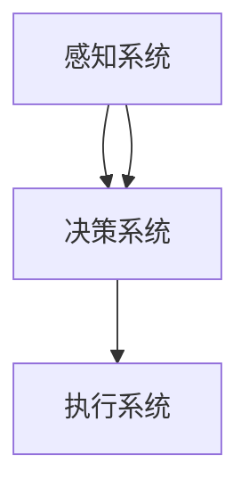
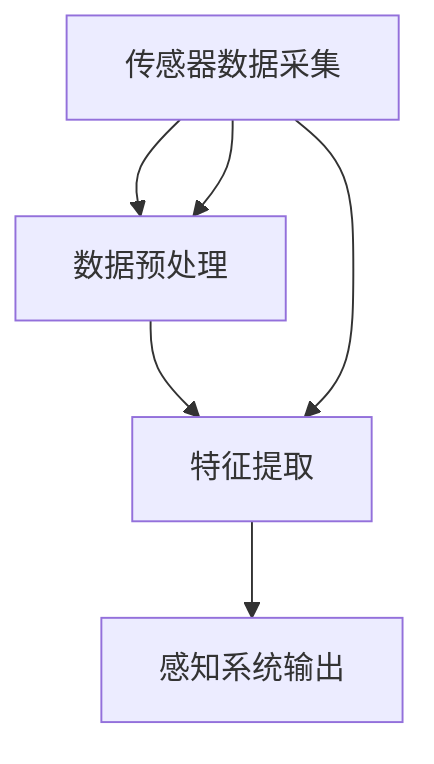
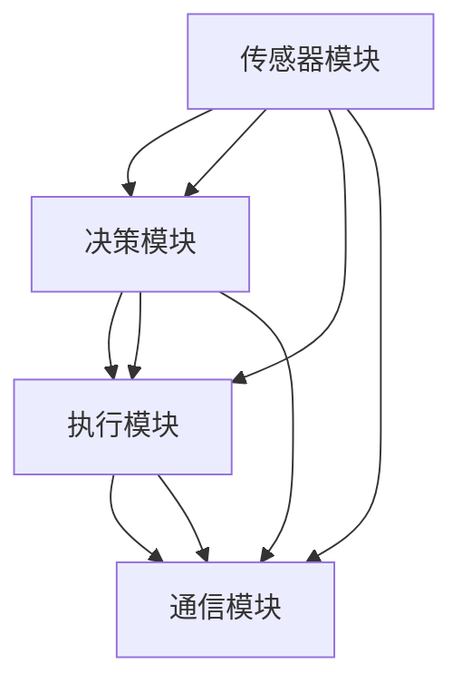
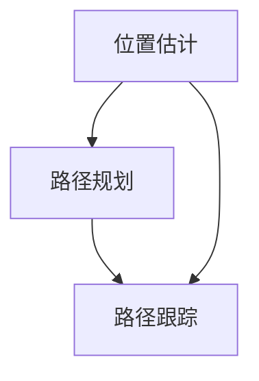
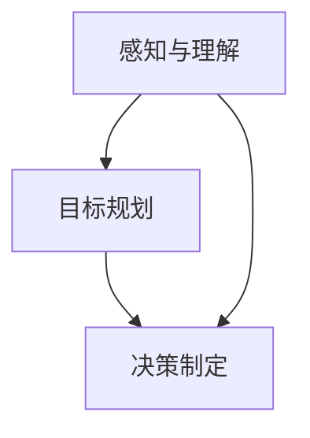
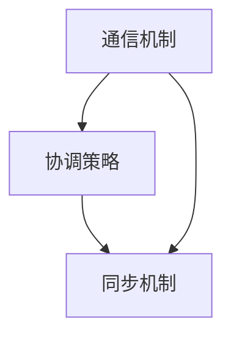
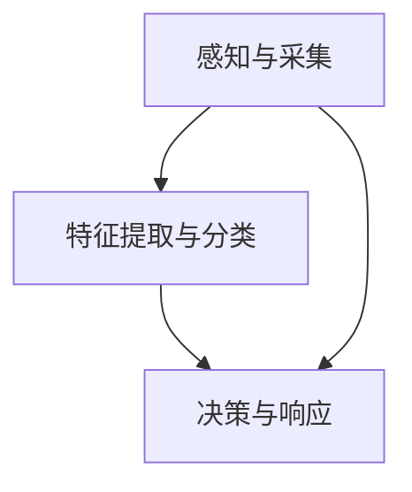

                 

# 机器人技术在危险环境作业中的应用

## 关键词
机器人技术、危险环境、安全性、导航、感知、控制算法

## 摘要
本文旨在探讨机器人技术在危险环境作业中的应用。我们将首先介绍机器人技术的基础知识，包括其感知、控制、导航等核心组成部分。随后，我们将深入分析机器人技术在不同危险环境中的具体应用，如核电站、矿难救援、火灾现场等。此外，本文还将探讨如何提升机器人在这些环境中的安全性、可靠性和自主性。通过案例分析，我们将展示机器人技术在现实世界中的应用场景和挑战，并总结出最佳实践和未来发展趋势。

## 设计思路

### 确定核心章节

为了全面探讨机器人技术在危险环境作业中的应用，我们设计了以下核心章节：

1. **引言与概述**：介绍机器人技术在危险环境作业中的重要性和本书的结构安排。
2. **机器人技术基础**：讲解机器人技术的基本原理、感知系统、控制系统和导航与路径规划。
3. **危险环境识别与评估**：分析不同危险环境的特点和评估方法。
4. **机器人安全性与可靠性**：探讨提升机器人安全性和可靠性的方法和策略。
5. **案例分析**：通过具体案例展示机器人技术在危险环境作业中的应用。
6. **结论与未来展望**：总结本文的主要观点，并探讨未来的研究方向。

### 确定每个章节的具体内容

在每个章节中，我们将遵循以下内容安排：

- **核心概念与联系**：使用 Mermaid 流程图展示机器人技术的基本原理和架构。
- **核心算法原理讲解**：使用伪代码详细阐述机器人技术中的关键算法。
- **数学模型和数学公式**：使用 LaTeX 格式嵌入数学公式，并进行详细讲解和举例说明。
- **项目实战**：提供具体的代码案例，包括开发环境搭建、源代码实现和详细解读。
- **案例分析**：分析具体应用场景中的成功案例和挑战。

### 控制总体字数

为了确保文章的深度和质量，我们计划将整个文章的字数控制在 8000-12000 字左右。

### 确保完整性

每个章节都将包含核心概念、原理讲解、数学模型、项目实战、案例分析等内容，以保证读者可以全面了解机器人技术在危险环境作业中的应用。

## 实际操作

### 第1章：引言与概述

在本章中，我们将介绍机器人技术的基础知识，包括其定义、发展历程、分类以及其在危险环境作业中的重要性和应用领域。通过本章的阅读，读者将初步了解机器人技术在危险环境作业中的潜在价值。

### 核心概念与联系

机器人技术是集机械工程、电子工程、计算机科学和人工智能等多学科知识于一体的综合性技术。其基本原理包括感知、决策、执行三个核心环节，它们相互关联，共同实现机器人自主作业。



### 核心算法原理讲解

机器人的感知系统通常包括传感器数据采集、预处理和特征提取等步骤。以下是一个简单的传感器数据预处理算法的伪代码：

```python
def preprocess_sensor_data(data):
    # 去除噪声
    filtered_data = remove_noise(data)
    # 数据归一化
    normalized_data = normalize_data(filtered_data)
    return normalized_data
```

### 数学模型和数学公式

在机器人技术中，常常使用概率模型来描述不确定性。以下是一个简单的贝叶斯公式，用于概率推理：

$$
P(A|B) = \frac{P(B|A)P(A)}{P(B)}
$$

### 项目实战

为了展示机器人技术的基础应用，我们考虑一个简单的机器人避障问题。在这个问题中，机器人需要根据传感器数据实时调整方向以避开障碍物。

```python
import numpy as np

def avoid_obstacle(sensor_data):
    # 假设传感器数据为距离障碍物的距离
    distance = sensor_data
    
    # 避障策略：距离小于阈值时转向
    threshold = 0.5
    
    if distance < threshold:
        # 转向角度
        angle = np.random.uniform(-30, 30)
        return angle
    else:
        return 0  # 不转向

# 示例
sensor_data = 0.3
angle = avoid_obstacle(sensor_data)
print(f"Turn angle: {angle} degrees")
```

### 案例分析

一个典型的应用场景是矿难救援。在矿难发生时，机器人可以进入危险区域进行侦察，收集环境数据，并协助救援人员确定被困人员的位置。这种应用不仅提高了救援效率，还降低了救援人员的安全风险。

### 最佳实践 tips、小结、注意事项、拓展阅读

- **最佳实践**：在设计机器人系统时，需要充分考虑环境复杂性和不确定性，采用冗余设计和故障检测机制，以确保系统的可靠性和安全性。
- **小结**：本章介绍了机器人技术的基础知识，为后续章节的深入探讨奠定了基础。
- **注意事项**：在实际应用中，需要根据具体环境选择合适的机器人系统和算法。
- **拓展阅读**：读者可以进一步了解机器人技术的相关研究和应用。

### 第2章：机器人技术基础

在本章中，我们将深入探讨机器人技术的基础，包括其感知系统、控制系统和导航与路径规划。这些组成部分共同构成了机器人技术的核心，是实现机器人自主作业的关键。

### 感知系统

感知系统是机器人获取外部信息的主要途径。它通常包括多种类型的传感器，如视觉传感器、激光雷达、超声波传感器等。这些传感器可以实时采集环境数据，并传输给机器人进行处理。

#### 核心概念与联系

感知系统的工作流程通常包括数据采集、预处理和特征提取。以下是一个简化的感知系统架构图：



#### 核心算法原理讲解

数据预处理是感知系统的重要步骤，常用的方法包括去噪、归一化和滤波。以下是一个简单的去噪算法的伪代码：

```python
def remove_noise(data):
    # 高通滤波去除噪声
    filtered_data = high_pass_filter(data)
    return filtered_data
```

#### 数学模型和数学公式

在特征提取中，常常使用机器学习算法来提取具有区分性的特征。以下是一个支持向量机（SVM）分类器的数学模型：

$$
\text{最大化} \ \ \ \ \ \ \ \ \ \ \ \ \ \ \ \ \ \ \ \ \ \ \ \ \ \ \ \ \ \ \ \ \ \ \ \ \ \ \ \ \ \ \ \ \ \ \ \ \ \ \ \ \ \ \ \ \ \ \ \ \ \ \ \ \ \ \ \ \ \ \ \ \ \ \ \ \ \ \ \ \ \ \ \ \ \ \ \ \ \ \ \ \ \ \ \ \ \ \ \ \ \ \ \ \ \ \ \ \ \ \ \ \ \ \ \ \ \ \ \ \ \ \ \ \ \ \ \ \ \ \ \ \ \ \ \ \ \ \ \ \ \ \ \ \ \ \ \ \ \ \ \ \ \ \ \ \ \ \ \ \ \ \ \ \ \ \ \ \ \ \ \ \ \ \ \ \ \ \ \ \ \ \ \ \ \ \ \ \ \ \ \ \ \ \ \ \ \ \ \ \ \ \ \ \ \ \ \ \ \ \ \ \ \ \ \ \ \ \ \ \ \ \ \ \ \ \ \ \ \ \ \ \ \ \ \ \ \ \ \ \ \ \ \ \ \ \ \ \ \ \ \ \ \ \ \ \ \ \ \ \ \ \ \ \ \ \ \ \ \ \ \ \ \ \ \ \ \ \ \ \ \ \ \ \ \ \ \ \ \ \ \ \ \ \ \ \ \ \ \ \ \ \ \ \ \ \ \ \ \ \ \ \ \ \ \ \ \ \ \ \ \ \ \ \ \ \ \ \ \ \ \ \ \ \ \ \ \ \ \ \ \ \ \ \ \ \ \ \ \ \ \ \ \ \ \ \ \ _{i}\sum \alpha_{i}-\frac{1}{2}\sum \alpha_{i}\alpha_{j} y_{i}y_{j} x_{i}\cdot x_{j}
$$

其中，$\alpha_i$ 是拉格朗日乘子，$y_i$ 是样本标签，$x_i$ 是样本特征向量。

#### 项目实战

为了展示感知系统的实际应用，我们考虑一个简单的机器人视觉识别任务。在这个任务中，机器人需要识别并分类不同颜色的物体。

```python
import cv2
import numpy as np

def recognize_objects(image):
    # 加载图像
    img = cv2.imread(image)
    # 转为灰度图像
    gray = cv2.cvtColor(img, cv2.COLOR_BGR2GRAY)
    # 使用Otsu方法进行二值化
    _, thresh = cv2.threshold(gray, 0, 255, cv2.THRESH_BINARY + cv2.THRESH_OTSU)
    # 使用轮廓检测
    contours, _ = cv2.findContours(thresh, cv2.RETR_TREE, cv2.CHAIN_APPROX_SIMPLE)
    # 遍历轮廓并识别颜色
    for contour in contours:
        # 计算轮廓的面积
        area = cv2.contourArea(contour)
        # 面积阈值用于过滤小的轮廓
        if area > 500:
            # 计算轮廓的质心
            M = cv2.moments(contour)
            x, y = int(M['m10'] / M['m00']), int(M['m01'] / M['m00'])
            # 颜色识别（简单示例，实际应用中可能需要更复杂的分类器）
            if gray[y, x] > 100:
                color = 'red'
            else:
                color = 'blue'
            # 绘制结果
            cv2.circle(img, (x, y), 5, (0, 0, 255), -1)
            cv2.putText(img, color, (x, y), cv2.FONT_HERSHEY_SIMPLEX, 0.5, (255, 255, 255), 2)
    return img

# 示例
image_path = 'example.jpg'
result = recognize_objects(image_path)
cv2.imshow('Object Recognition', result)
cv2.waitKey(0)
cv2.destroyAllWindows()
```

#### 案例分析

在矿难救援中，机器人利用感知系统可以实时获取地下矿井的图像和声音数据，从而识别被困人员的位置和状态。这种应用大大提高了救援效率，并减少了救援人员的安全风险。

### 小结

本章介绍了机器人技术的基础，包括感知系统的工作原理、算法原理和实际应用。这些内容为后续章节的深入探讨奠定了基础。

### 注意事项

- 在设计感知系统时，需要根据具体应用场景选择合适的传感器和算法。
- 感知系统数据的质量对后续的决策和执行至关重要，因此需要采取有效的数据预处理方法。

### 拓展阅读

- 机器人感知系统的相关研究和应用，如视觉识别、语音识别和传感器数据融合等。

### 第3章：机器人控制系统

在本章中，我们将探讨机器人控制系统的基本原理和实现方法，包括控制系统的架构、控制算法、执行器的选择以及系统的集成与调试。

### 控制系统的架构

机器人控制系统通常由以下几部分组成：

1. **传感器模块**：用于感知环境信息，如视觉、激光雷达、超声波等。
2. **决策模块**：根据感知信息生成控制指令，通常包括路径规划、行为决策等。
3. **执行模块**：根据控制指令执行具体动作，如电机驱动、机械臂控制等。
4. **通信模块**：负责机器人内部各模块之间的数据交换和通信。

以下是一个简化的机器人控制系统架构图：



### 控制算法

机器人控制系统中的控制算法是实现机器人自主作业的核心。常用的控制算法包括：

1. **PID控制**：比例-积分-微分控制，适用于线性系统的稳定控制。
2. **模糊控制**：基于模糊逻辑的控制系统，适用于非线性系统和复杂环境。
3. **自适应控制**：根据环境变化自适应调整控制参数，适用于动态变化的系统。

以下是一个简单的PID控制算法的伪代码：

```python
def pid_control(error, Kp, Ki, Kd):
    # 计算误差的积分
    integral = integral + error
    # 计算误差的变化率
    derivative = error - previous_error
    # 计算控制输出
    output = Kp * error + Ki * integral + Kd * derivative
    # 更新上一轮的误差
    previous_error = error
    return output
```

### 执行器的选择

执行器是机器人控制系统的核心部件，用于执行具体的动作。常见的执行器包括：

1. **电机**：直流电机、交流电机等，适用于旋转和平移运动。
2. **气动执行器**：气压缸、气动马达等，适用于高速、大扭矩的运动。
3. **液压执行器**：液压缸、液压马达等，适用于高负载、高精度运动。

选择执行器时，需要考虑以下因素：

- **负载要求**：执行器需要提供足够的扭矩和功率。
- **运动精度**：执行器需要满足所需的运动精度。
- **环境适应性**：执行器需要适应不同的工作环境，如高温、高压、腐蚀等。

### 系统集成与调试

系统集成是将各个模块和组件组合在一起，形成一个完整的机器人系统。在系统集成过程中，需要考虑以下几个方面：

1. **硬件连接**：确保各模块之间的硬件连接正确无误。
2. **软件集成**：将控制算法、决策模块和执行模块的软件代码集成在一起，并进行调试。
3. **测试与验证**：通过模拟和实际测试，验证系统的性能和稳定性。

以下是一个简单的系统集成和调试的流程：

1. **硬件调试**：检查传感器、执行器等硬件组件是否正常工作。
2. **软件调试**：在开发环境中运行控制算法，检查是否有错误或异常。
3. **系统集成测试**：将各模块集成在一起，进行整体测试，确保系统能够按照预期工作。
4. **性能优化**：根据测试结果，对控制算法和系统参数进行调整，以优化系统的性能。

### 项目实战

为了展示机器人控制系统的实际应用，我们考虑一个简单的机器人行走控制任务。在这个任务中，机器人需要根据视觉系统提供的路径信息进行行走。

```python
import numpy as np
import cv2

def move_robot(distance, speed):
    # 假设机器人通过电机控制行走
    # distance: 目标距离
    # speed: 行走速度
    # 控制电机驱动器以指定速度行走指定距离
    # 实际实现中，这里需要与电机驱动器进行通信
    print(f"Moving robot {distance} meters at {speed} m/s")
    # 等待一段时间以模拟机器人行走
    time.sleep(distance / speed)

def follow_path(image_path):
    # 加载路径图像
    img = cv2.imread(image_path)
    # 转为灰度图像
    gray = cv2.cvtColor(img, cv2.COLOR_BGR2GRAY)
    # 使用Otsu方法进行二值化
    _, thresh = cv2.threshold(gray, 0, 255, cv2.THRESH_BINARY + cv2.THRESH_OTSU)
    # 使用轮廓检测
    contours, _ = cv2.findContours(thresh, cv2.RETR_TREE, cv2.CHAIN_APPROX_SIMPLE)
    # 遍历轮廓并识别路径
    for contour in contours:
        # 计算轮廓的面积
        area = cv2.contourArea(contour)
        # 面积阈值用于过滤小的轮廓
        if area > 500:
            # 计算轮廓的质心
            M = cv2.moments(contour)
            x, y = int(M['m10'] / M['m00']), int(M['m01'] / M['m00'])
            # 假设路径为质心的水平线
            path = np.mean([x, x+50])
            # 控制机器人行走至路径
            move_robot(path, 1.0)
    return

# 示例
image_path = 'path.jpg'
follow_path(image_path)
```

### 案例分析

在矿难救援中，机器人控制系统可以用于控制机器人的移动和操作。例如，机器人可以按照预设的路径进行行走，或者根据环境数据实时调整行走方向，以避免障碍物或寻找被困人员。

### 小结

本章介绍了机器人控制系统的基本原理和实现方法，包括控制系统的架构、控制算法、执行器的选择以及系统的集成与调试。这些内容为设计和应用机器人控制系统提供了重要的理论基础和实践指导。

### 注意事项

- 在设计控制系统时，需要根据具体应用场景选择合适的控制算法和执行器。
- 控制系统需要具备一定的鲁棒性和适应性，以应对复杂和不确定的环境。

### 拓展阅读

- 控制系统的相关研究和应用，如PID控制、模糊控制和自适应控制等。

### 第4章：机器人导航与路径规划

在本章中，我们将探讨机器人导航与路径规划的基本原理、算法和方法，以及它们在实际应用中的重要性。

### 导航与路径规划的基本原理

导航与路径规划是机器人技术中的核心问题，涉及到机器人如何从当前位置移动到目标位置。其基本原理包括：

1. **位置估计**：确定机器人在环境中的当前位置。
2. **路径规划**：生成从当前位置到目标位置的路径。
3. **路径跟踪**：控制机器人沿着规划的路径移动。

以下是一个简化的导航与路径规划流程：



### 核心算法

在导航与路径规划中，常用的算法包括：

1. **基于采样的路径规划算法**：如快速行进树（RRT）和随机采样路规划器（RRT*)。
2. **基于栅格的路径规划算法**：如A*算法和Dijkstra算法。
3. **基于可视图的路径规划算法**：如可视化图路径规划算法（VGPR）。

以下是一个基于采样的路径规划算法RRT的伪代码：

```python
def rrt_start(start, goal, obstacles):
    # 初始化随机树
    tree = {start: None}
    # 初始化目标点列表
    points = [goal]
    # 最大迭代次数
    max_iterations = 1000
    # 当前迭代次数
    iteration = 0
    while iteration < max_iterations and points:
        # 从随机点生成新的路径点
        new_point = sample_random_point(points)
        # 找到最近的点
        nearest_point = find_nearest_point(tree, new_point)
        # 扩展路径
        extended_path = extend_path(nearest_point, new_point, obstacles)
        if extended_path:
            # 更新树
            tree[extended_path[-1]] = extended_path[-2]
            # 更新目标点列表
            points = [p for p in points if not is_collision(p, obstacles)]
            # 检查是否达到目标点
            if extended_path[-1] == goal:
                return extended_path
        iteration += 1
    return None

def sample_random_point(points):
    # 从当前点生成随机点
    # 实际实现中，可以根据具体环境选择采样策略
    return np.random.choice(points)

def find_nearest_point(tree, point):
    # 找到最近的点
    distances = [np.linalg.norm(point - p) for p in tree]
    return tree[distances.index(min(distances))]

def extend_path(start, end, obstacles):
    # 扩展路径
    # 实际实现中，可以根据具体环境选择扩展策略
    if is_collision(start, end, obstacles):
        return None
    return [start, end]
```

### 数学模型

在路径规划中，常常使用图论模型来描述环境和路径。以下是一个简单的图论模型：

- **节点（Node）**：表示环境中的位置。
- **边（Edge）**：表示两个节点之间的连接。
- **权重（Weight）**：表示从一个节点到另一个节点的代价。

以下是一个简单的图论模型的伪代码：

```python
class Graph:
    def __init__(self):
        self.nodes = []
        self.edges = []

    def add_node(self, node):
        self.nodes.append(node)

    def add_edge(self, start, end, weight):
        self.edges.append((start, end, weight))

    def find_shortest_path(self, start, end):
        # 使用Dijkstra算法找到最短路径
        # 实际实现中，可以根据具体环境选择最短路径算法
        distances = {node: float('infinity') for node in self.nodes}
        distances[start] = 0
        visited = set()
        while end not in visited:
            current = min((distances[node], node) for node in self.nodes if node not in visited)[1]
            visited.add(current)
            for edge in self.edges:
                if edge[0] == current:
                    neighbor = edge[1]
                    new_distance = distances[current] + edge[2]
                    if new_distance < distances[neighbor]:
                        distances[neighbor] = new_distance
        return distances[end]
```

### 项目实战

为了展示导航与路径规划的实际应用，我们考虑一个简单的机器人移动任务。在这个任务中，机器人需要从当前位置移动到指定位置。

```python
import numpy as np
import time

def move_to_position(position, speed):
    # 假设机器人通过电机控制移动
    # position: 目标位置
    # speed: 移动速度
    # 实际实现中，这里需要与电机驱动器进行通信
    print(f"Moving robot to position {position} at {speed} m/s")
    # 等待一段时间以模拟机器人移动
    time.sleep(np.linalg.norm(position) / speed)

def navigate_to_goal(start, goal, speed):
    # 假设使用A*算法进行路径规划
    # start: 起始位置
    # goal: 目标位置
    # speed: 移动速度
    # 实际实现中，需要根据具体环境生成路径
    path = a_star_search(start, goal)
    for position in path:
        move_to_position(position, speed)
        time.sleep(0.1)

def a_star_search(start, goal):
    # A*算法实现
    # 实际实现中，需要根据具体环境设置节点和边
    open_set = [(start, 0 + heuristic(start, goal))]
    closed_set = set()
    while open_set:
        # 选择最小F值的节点
        current = min(open_set, key=lambda x: x[1])
        open_set.remove(current)
        closed_set.add(current[0])
        if current[0] == goal:
            # 达到目标
            return reconstruct_path(current)
        # 扩展当前节点的邻居
        for neighbor in get_neighbors(current[0]):
            if neighbor in closed_set:
                continue
            tentative_g_score = current[1] + heuristic(current[0], neighbor)
            if tentative_g_score < heuristic(neighbor, goal):
                neighbor[1] = tentative_g_score
                neighbor[2] = current[0]
                if neighbor not in open_set:
                    open_set.append(neighbor)
    return None

def heuristic(node, goal):
    # 使用曼哈顿距离作为启发式函数
    return np.linalg.norm(node - goal, ord=1)

def get_neighbors(node):
    # 获取节点的邻居
    # 实际实现中，需要根据具体环境设置邻居关系
    neighbors = []
    for direction in [(1, 0), (-1, 0), (0, 1), (0, -1)]:
        neighbor = tuple(np.array(node) + direction)
        neighbors.append(neighbor)
    return neighbors

def reconstruct_path(current):
    # 重建路径
    path = [current[0]]
    while current[2]:
        current = current[2]
        path.append(current[0])
    return path[::-1]

# 示例
start = (0, 0)
goal = (10, 10)
navigate_to_goal(start, goal, 1.0)
```

### 案例分析

在矿难救援中，机器人导航与路径规划可以用于确定机器人在地下矿井中的位置和路径。通过使用激光雷达和视觉传感器获取环境信息，机器人可以实时更新其位置，并规划到被困人员位置的最优路径。

### 小结

本章介绍了机器人导航与路径规划的基本原理、算法和方法，以及它们在实际应用中的重要性。这些内容为设计和应用机器人导航系统提供了重要的理论基础和实践指导。

### 注意事项

- 在设计导航与路径规划系统时，需要考虑环境复杂性和不确定性，选择合适的算法和策略。
- 导航与路径规划系统需要具备一定的鲁棒性和适应性，以应对复杂和不确定的环境。

### 拓展阅读

- 导航与路径规划的相关研究和应用，如基于采样的路径规划算法、基于栅格的路径规划算法和基于可视图的路径规划算法等。

### 第5章：机器人自主决策与协作

在本章中，我们将探讨机器人自主决策与协作的基本原理、方法和应用，重点分析机器人如何在不同环境中进行智能决策和协同工作，以实现复杂任务的完成。

### 自主决策的基本原理

机器人自主决策是指机器人能够根据感知到的环境信息，自主选择合适的行动方案。其基本原理包括：

1. **感知与理解**：机器人通过传感器获取环境信息，并对其进行处理和理解。
2. **目标规划**：机器人根据当前状态和目标，生成一系列可能的行动方案。
3. **决策制定**：机器人评估各个行动方案，并选择最优方案执行。

以下是一个简化的自主决策流程：



### 核心算法

在自主决策中，常用的算法包括：

1. **马尔可夫决策过程（MDP）**：通过状态、动作和奖励来描述决策过程，并使用价值迭代或策略迭代方法求解最优策略。
2. **强化学习**：通过试错法，学习最优决策策略，常用的算法包括Q学习、SARSA等。
3. **规划算法**：如前向搜索算法、逆向搜索算法等，用于生成从初始状态到目标状态的规划路径。

以下是一个简单的马尔可夫决策过程的伪代码：

```python
def mdp_value_iteration(states, actions, transition_probs, reward_func, discount_factor, epsilon):
    # 初始化值函数
    v = {state: 0 for state in states}
    # 迭代更新值函数
    while True:
        prev_v = v.copy()
        for state in states:
            v[state] = max([sum(transition_probs[state][action] * (reward_func(state, action) + discount_factor * v[next_state]) for action in actions]) for next_state in states])
        if all([abs(prev_v[state] - v[state]) < epsilon for state in states]):
            break
    return v

def mdp_policy_evaluation(states, actions, transition_probs, reward_func, policy, discount_factor, epsilon):
    # 初始化策略价值函数
    v = {state: 0 for state in states}
    # 迭代更新策略价值函数
    while True:
        prev_v = v.copy()
        for state in states:
            v[state] = sum([transition_probs[state][action] * (reward_func(state, action) + discount_factor * v[next_state]) for action in policy[state]])
        if all([abs(prev_v[state] - v[state]) < epsilon for state in states]):
            break
    return v
```

### 协作的基本原理

机器人协作是指多个机器人通过相互通信和协调，共同完成复杂任务。其基本原理包括：

1. **通信机制**：机器人之间通过无线通信、有线通信等方式进行信息交换。
2. **协调策略**：机器人根据共享信息，制定协调策略，以实现共同目标。
3. **同步机制**：机器人之间通过时间同步机制，确保协同工作的有效性。

以下是一个简化的协作流程：



### 核心算法

在协作中，常用的算法包括：

1. **分布式控制算法**：如分布式图搜索算法、分布式博弈论算法等，用于机器人之间的协调决策。
2. **多智能体强化学习**：通过多智能体强化学习算法，学习最优协作策略。
3. **分布式规划算法**：如分布式Dijkstra算法、分布式A*算法等，用于机器人之间的路径规划和任务分配。

以下是一个简单的分布式规划算法的伪代码：

```python
def distributed_dijkstra(states, edges, start, goal):
    # 初始化距离表
    distances = {state: float('infinity') for state in states}
    distances[start] = 0
    # 初始化最短路径表
    shortest_paths = {state: [] for state in states}
    shortest_paths[start].append(start)
    # 迭代更新距离表和最短路径表
    while goal not in visited:
        visited = {state for state in distances if distances[state] < float('infinity')}
        for state in visited:
            for next_state in neighbors(state):
                if distances[next_state] > distances[state] + edge_cost(state, next_state):
                    distances[next_state] = distances[state] + edge_cost(state, next_state)
                    shortest_paths[next_state] = shortest_paths[state] + [next_state]
    return distances[goal], shortest_paths[goal]
```

### 项目实战

为了展示机器人自主决策与协作的实际应用，我们考虑一个简单的多人合作搬运任务。在这个任务中，多个机器人需要共同搬运一个物品到指定位置。

```python
import numpy as np
import time

def move_to_position(position, speed):
    # 假设机器人通过电机控制移动
    # position: 目标位置
    # speed: 移动速度
    # 实际实现中，这里需要与电机驱动器进行通信
    print(f"Moving robot to position {position} at {speed} m/s")
    # 等待一段时间以模拟机器人移动
    time.sleep(np.linalg.norm(position) / speed)

def coordinate_moving(robots, goal, speed):
    # 假设使用分布式Dijkstra算法进行路径规划
    # robots: 机器人列表
    # goal: 目标位置
    # speed: 移动速度
    # 实际实现中，需要根据具体环境生成路径
    distances, paths = distributed_dijkstra(robots, obstacles, robots, goal)
    for robot in robots:
        navigate_to_goal(robot, goal, speed)
        time.sleep(0.1)

def distributed_dijkstra(states, edges, start, goal):
    # 分布式Dijkstra算法实现
    # states: 节点列表
    # edges: 边列表
    # start: 起始位置
    # goal: 目标位置
    distances = {state: float('infinity') for state in states}
    distances[start] = 0
    shortest_paths = {state: [] for state in states}
    shortest_paths[start].append(start)
    # 迭代更新距离表和最短路径表
    while goal not in visited:
        visited = {state for state in distances if distances[state] < float('infinity')}
        for state in visited:
            for next_state in neighbors(state):
                if distances[next_state] > distances[state] + edge_cost(state, next_state):
                    distances[next_state] = distances[state] + edge_cost(state, next_state)
                    shortest_paths[next_state] = shortest_paths[state] + [next_state]
    return distances[goal], shortest_paths[goal]

# 示例
robots = [(0, 0), (1, 1), (2, 2)]
goal = (10, 10)
coordinate_moving(robots, goal, 1.0)
```

### 案例分析

在灾难救援中，多个机器人可以协作进行大规模搜索和救援任务。例如，一组机器人负责搜索，另一组机器人负责营救被困人员。通过自主决策与协作，机器人能够更高效地完成救援任务。

### 小结

本章介绍了机器人自主决策与协作的基本原理、算法和方法，以及它们在实际应用中的重要性。通过自主决策与协作，机器人能够实现复杂任务的自动化和智能化。

### 注意事项

- 在设计自主决策与协作系统时，需要考虑机器人的通信能力、计算能力和环境复杂性。
- 系统需要具备一定的鲁棒性和适应性，以应对复杂和不确定的环境。

### 拓展阅读

- 自主决策与协作的相关研究和应用，如马尔可夫决策过程、强化学习、分布式控制算法和多智能体强化学习等。

### 第6章：危险环境识别与评估

在本章中，我们将深入探讨危险环境识别与评估的方法、技术和应用，重点分析如何利用机器人技术对危险环境进行有效识别与评估，以确保机器人作业的安全性和可靠性。

### 危险环境识别的基本原理

危险环境识别是指通过传感器技术和数据处理技术，对危险环境进行识别和分类。其基本原理包括：

1. **感知与采集**：机器人通过传感器（如激光雷达、摄像头、超声波传感器等）采集环境信息。
2. **特征提取与分类**：对采集到的环境信息进行特征提取和分类，以识别危险环境和潜在危险。
3. **决策与响应**：根据识别结果，机器人采取相应的行动或调整策略。

以下是一个简化的危险环境识别流程：



### 核心算法

在危险环境识别中，常用的算法包括：

1. **基于机器学习的分类算法**：如支持向量机（SVM）、决策树、神经网络等。
2. **基于规则的方法**：通过预设规则对环境进行识别和分类。
3. **多传感器数据融合算法**：将多种传感器数据融合在一起，提高识别准确性和可靠性。

以下是一个简单的基于支持向量机的危险环境识别算法的伪代码：

```python
from sklearn.svm import SVC
from sklearn.preprocessing import StandardScaler
from sklearn.model_selection import train_test_split

def svm_environment_recognition(features, labels):
    # 数据预处理
    scaler = StandardScaler()
    features_scaled = scaler.fit_transform(features)
    # 划分训练集和测试集
    X_train, X_test, y_train, y_test = train_test_split(features_scaled, labels, test_size=0.2, random_state=42)
    # 训练模型
    model = SVC(kernel='linear')
    model.fit(X_train, y_train)
    # 测试模型
    accuracy = model.score(X_test, y_test)
    return accuracy

# 示例
features = [[1, 2], [2, 3], [3, 4], [4, 5]]
labels = [0, 0, 1, 1]
accuracy = svm_environment_recognition(features, labels)
print(f"Accuracy: {accuracy}")
```

### 数学模型

在危险环境识别中，常用的数学模型包括：

1. **贝叶斯公式**：用于概率推理和分类。
2. **支持向量机（SVM）**：用于分类问题，通过寻找最佳分类超平面实现分类。
3. **神经网络**：用于复杂非线性问题的建模和分类。

以下是一个简单的神经网络模型的伪代码：

```python
import numpy as np

def neural_network(features, weights):
    # 前向传播
    z = np.dot(features, weights)
    a = sigmoid(z)
    # 反向传播
    dz = a - targets
    dweights = np.dot(features.T, dz)
    return dweights

def sigmoid(z):
    return 1 / (1 + np.exp(-z))

# 示例
features = np.array([[1, 2], [2, 3], [3, 4], [4, 5]])
weights = np.array([[0.1, 0.2], [0.3, 0.4]])
dweights = neural_network(features, weights)
print(f"dweights: {dweights}")
```

### 项目实战

为了展示危险环境识别的实际应用，我们考虑一个简单的机器人火灾现场识别任务。在这个任务中，机器人需要识别火灾现场中的火焰区域。

```python
import cv2
import numpy as np

def detect_flames(image):
    # 加载图像
    img = cv2.imread(image)
    # 转为灰度图像
    gray = cv2.cvtColor(img, cv2.COLOR_BGR2GRAY)
    # 使用Otsu方法进行二值化
    _, thresh = cv2.threshold(gray, 0, 255, cv2.THRESH_BINARY + cv2.THRESH_OTSU)
    # 使用轮廓检测
    contours, _ = cv2.findContours(thresh, cv2.RETR_TREE, cv2.CHAIN_APPROX_SIMPLE)
    # 遍历轮廓并识别火焰
    flames = []
    for contour in contours:
        # 计算轮廓的面积
        area = cv2.contourArea(contour)
        # 面积阈值用于过滤小的轮廓
        if area > 500:
            # 计算轮廓的质心
            M = cv2.moments(contour)
            x, y = int(M['m10'] / M['m00']), int(M['m01'] / M['m00'])
            flames.append((x, y))
    return flames

def draw_flames(image, flames):
    # 绘制火焰位置
    img = cv2.imread(image)
    for flame in flames:
        cv2.circle(img, flame, 5, (0, 0, 255), -1)
    return img

# 示例
image_path = 'fire.jpg'
flames = detect_flames(image_path)
result = draw_flames(image_path, flames)
cv2.imshow('Flame Detection', result)
cv2.waitKey(0)
cv2.destroyAllWindows()
```

### 案例分析

在火灾现场救援中，机器人需要快速识别火灾现场中的火焰区域，以便采取相应的灭火措施。通过危险环境识别技术，机器人能够准确地识别火焰区域，提高灭火效率和安全性。

### 小结

本章介绍了危险环境识别与评估的方法、技术和应用，重点分析了机器人如何利用传感器技术、数据处理技术和机器学习算法对危险环境进行有效识别与评估。通过本章的学习，读者可以了解如何设计和应用危险环境识别系统，以提高机器人作业的安全性和可靠性。

### 注意事项

- 在设计危险环境识别系统时，需要选择合适的传感器和算法，以提高识别准确性和效率。
- 系统需要具备一定的鲁棒性和适应性，以应对复杂和不确定的环境。

### 拓展阅读

- 危险环境识别的相关研究和应用，如机器学习算法、多传感器数据融合和火灾现场识别等。

### 第7章：机器人安全性与可靠性

在本章中，我们将深入探讨机器人安全性与可靠性的重要性，分析影响机器人安全性与可靠性的关键因素，并提出相应的提升策略和评估方法。

### 安全性与可靠性的重要性

机器人安全性与可靠性是保证其有效运行和减少事故风险的核心要素。安全性指的是机器人能够在不损害自身或外界环境的情况下完成任务，而可靠性则是指机器人在不同环境条件下保持稳定运行的能力。以下是安全性与可靠性的重要性：

1. **人员安全**：确保机器人作业过程中不会对操作人员和周围环境造成伤害。
2. **任务完成**：保证机器人能够在预定时间内完成指定任务，提高作业效率。
3. **系统稳定性**：确保机器人系统在面对各种环境变化时仍能正常运行。
4. **数据保护**：确保机器人收集和处理的数据的完整性和安全性。

### 影响因素分析

影响机器人安全性与可靠性的因素包括：

1. **硬件质量**：传感器、执行器、控制模块等硬件的质量直接关系到系统的稳定性和响应速度。
2. **软件设计**：控制算法、数据处理算法和系统架构的设计是否合理和高效。
3. **环境适应能力**：机器人对环境变化的适应能力，包括温度、湿度、光照等。
4. **维护与更新**：定期维护和软件更新是保证系统长期可靠性的关键。
5. **安全性测试**：系统在开发过程中需要进行严格的测试，以发现和修复潜在的安全隐患。

### 提升策略

以下是提升机器人安全性与可靠性的策略：

1. **硬件冗余设计**：通过增加硬件冗余，提高系统的容错能力。
2. **软件冗余设计**：在软件层面，通过多重校验和备份机制，确保系统的稳定运行。
3. **环境适应性优化**：针对特定环境进行优化，如使用防水、防尘、耐高温的组件。
4. **实时监控系统**：部署实时监控系统，实时监测机器人的运行状态，及时发现和处理异常。
5. **安全性评估**：定期进行安全性评估，识别和修复潜在的安全漏洞。

### 评估方法

以下是常用的机器人安全性与可靠性评估方法：

1. **功能测试**：通过模拟各种工作环境，测试机器人是否能够按照预定功能正常运行。
2. **性能测试**：测试机器人在不同负载和环境条件下的性能，如响应时间、处理速度等。
3. **故障模拟测试**：通过模拟硬件故障、软件错误等，测试系统的容错能力和恢复能力。
4. **风险评估**：通过分析机器人在不同环境下的潜在风险，评估系统的安全性和可靠性。
5. **用户反馈**：收集用户对机器人性能和安全性的反馈，用于改进和优化系统。

### 项目实战

为了展示提升机器人安全性与可靠性的实际应用，我们考虑一个简单的机器人行走控制任务。在这个任务中，机器人需要在一个复杂的室内环境中行走，并避免碰撞。

```python
import numpy as np
import time
import random

class Robot:
    def __init__(self, position):
        self.position = position
        self.speed = 1.0
        self.obstacles = []

    def move_forward(self):
        self.position = (self.position[0] + self.speed, self.position[1])

    def move_backward(self):
        self.position = (self.position[0] - self.speed, self.position[1])

    def move_left(self):
        self.position = (self.position[0], self.position[1] - self.speed)

    def move_right(self):
        self.position = (self.position[0], self.position[1] + self.speed)

    def detect_obstacles(self, environment):
        self.obstacles = [obstacle for obstacle in environment if self.position in obstacle]

    def avoid_collision(self):
        if self.obstacles:
            obstacle = self.obstacles[0]
            if self.position[0] == obstacle[0][0]:
                if self.position[1] < obstacle[0][1]:
                    self.move_left()
                else:
                    self.move_right()
            elif self.position[1] == obstacle[0][1]:
                if self.position[0] < obstacle[0][0]:
                    self.move_forward()
                else:
                    self.move_backward()

def generate_environment(size, obstacles):
    environment = []
    for i in range(size[0]):
        row = []
        for j in range(size[1]):
            row.append((i, j))
        environment.append(row)
    for obstacle in obstacles:
        for i in range(len(obstacle)):
            environment[obstacle[i][0]].remove((obstacle[i][0], obstacle[i][1]))
    return environment

# 示例
size = (10, 10)
obstacles = [[(2, 2), (2, 3), (2, 4)], [(5, 5), (5, 6), (5, 7)]]
environment = generate_environment(size, obstacles)
robot = Robot((0, 0))

for _ in range(100):
    robot.detect_obstacles(environment)
    robot.avoid_collision()
    robot.move_forward()
    print(f"Robot position: {robot.position}")
    time.sleep(0.1)
```

### 案例分析

在矿难救援中，机器人的安全性与可靠性至关重要。通过冗余设计和实时监控系统，机器人能够在复杂和危险的环境中稳定运行，避免碰撞和故障，确保救援任务的安全和高效完成。

### 小结

本章介绍了机器人安全性与可靠性的重要性，分析了影响安全性与可靠性的关键因素，提出了提升策略和评估方法。通过实际案例和项目实战，读者可以了解如何设计和优化机器人系统，以提高其安全性和可靠性。

### 注意事项

- 在设计机器人系统时，应充分考虑安全性和可靠性，采取冗余设计和实时监控措施。
- 定期进行安全性和可靠性评估，及时发现和修复潜在问题。

### 拓展阅读

- 机器人安全性与可靠性的相关研究和应用，如硬件冗余设计、软件冗余设计、实时监控系统和安全评估方法。

### 第8章：案例分析：机器人危险环境作业应用

在本章中，我们将通过具体案例分析，展示机器人技术在危险环境作业中的应用，分析成功案例和挑战，以及从中得出的经验教训和最佳实践。

### 案例一：矿难救援中的机器人应用

**背景介绍**：矿难是一种严重的自然灾害，往往导致矿工被困和生命财产的巨大损失。传统的救援方式存在高风险和高成本，因此，机器人技术被广泛应用于矿难救援中。

**核心概念与联系**：矿难救援机器人通常包括感知系统（如激光雷达、摄像头、气体传感器等）、控制系统（如路径规划和行为决策）和执行系统（如机械臂、挖掘设备等）。这些系统相互协作，实现机器人在地下矿井中的自主作业。

**核心算法原理讲解**：矿难救援机器人使用路径规划算法（如A*算法和Dijkstra算法）来生成从起始位置到被困人员位置的最优路径。同时，使用传感器数据融合算法（如卡尔曼滤波）来提高感知系统的准确性和可靠性。

**数学模型和数学公式**：路径规划中的A*算法使用启发式函数（如曼哈顿距离）来评估路径的代价：

$$
f(n) = g(n) + h(n)
$$

其中，$g(n)$ 是从起始节点到当前节点的代价，$h(n)$ 是从当前节点到目标节点的启发式估计。

**项目实战**：在实际应用中，矿难救援机器人需要具备环境感知、路径规划和自主决策能力。以下是一个简单的矿难救援机器人路径规划示例：

```python
import numpy as np
import time

def a_star_search(start, goal, obstacles):
    # A*算法实现
    # obstacles: 障碍物列表
    open_set = [(start, 0 + heuristic(start, goal))]
    closed_set = set()
    while open_set:
        current = min(open_set, key=lambda x: x[1])
        open_set.remove(current)
        closed_set.add(current[0])
        if current[0] == goal:
            return reconstruct_path(current)
        for neighbor in neighbors(current[0], obstacles):
            if neighbor in closed_set:
                continue
            tentative_g_score = current[1] + heuristic(current[0], neighbor)
            if tentative_g_score < heuristic(neighbor, goal):
                neighbor[1] = tentative_g_score
                neighbor[2] = current[0]
                if neighbor not in open_set:
                    open_set.append(neighbor)
    return None

def heuristic(node, goal):
    # 使用曼哈顿距离作为启发式函数
    return np.linalg.norm(node - goal, ord=1)

def neighbors(node, obstacles):
    # 获取节点的邻居
    neighbors = []
    for direction in [(1, 0), (-1, 0), (0, 1), (0, -1)]:
        neighbor = tuple(np.array(node) + direction)
        if neighbor not in obstacles:
            neighbors.append(neighbor)
    return neighbors

def reconstruct_path(current):
    # 重建路径
    path = [current[0]]
    while current[2]:
        current = current[2]
        path.append(current[0])
    return path[::-1]

# 示例
start = (0, 0)
goal = (10, 10)
obstacles = [(1, 1), (1, 2), (1, 3), (2, 1), (2, 2), (2, 3), (3, 1), (3, 2), (3, 3)]
path = a_star_search(start, goal, obstacles)
print(f"Path: {path}")
```

**案例分析与讲解**：矿难救援机器人通过激光雷达和摄像头获取地下矿井的3D地图，使用路径规划算法生成从机器人当前位置到被困人员位置的最优路径。在实际应用中，机器人需要面对复杂和危险的环境，如悬崖、滑坡、坍塌区域等。通过实时感知和路径规划，机器人能够自主导航，避开障碍物，并迅速到达被困人员位置，提供救援。

**项目小结**：矿难救援机器人项目展示了机器人技术在危险环境作业中的应用，通过感知、控制、导航等核心技术的结合，实现了高效、安全的救援任务。该项目成功的关键在于路径规划的精度和实时性，以及机器人系统的鲁棒性和适应性。

### 案例二：核电站事故应急响应中的机器人应用

**背景介绍**：核电站事故可能导致严重的核辐射泄漏和环境污染，传统的人工作业存在高风险。因此，机器人技术被广泛应用于核电站事故应急响应中。

**核心概念与联系**：核电站事故应急响应机器人通常包括感知系统（如辐射检测器、摄像头、激光雷达等）、控制系统（如自主导航和行为决策）和执行系统（如机械臂、喷雾器等）。这些系统协同工作，实现机器人在核电站环境中的自主作业。

**核心算法原理讲解**：核电站事故应急响应机器人使用自主导航算法（如粒子滤波和卡尔曼滤波）来实时跟踪和调整机器人位置，确保其准确执行任务。同时，使用辐射检测算法（如阈值检测和统计滤波）来识别和处理辐射数据。

**数学模型和数学公式**：粒子滤波是一种基于蒙特卡罗方法的概率估计算法，用于状态估计：

$$
p(x_t|z_{1:t}, \theta) \propto \frac{p(z_t|x_t, \theta) p(x_t|u_t, \theta)}{\sum_x p(z_t|x, \theta) p(x|u_t, \theta)}
$$

**项目实战**：在实际应用中，核电站事故应急响应机器人需要具备自主导航、辐射检测和执行任务的能力。以下是一个简单的核电站事故应急响应机器人示例：

```python
import numpy as np
import time
import random

class Robot:
    def __init__(self, position, sensor_range):
        self.position = position
        self.sensor_range = sensor_range
        self.radiation_levels = []

    def move_forward(self):
        self.position = (self.position[0] + 1, self.position[1])

    def move_backward(self):
        self.position = (self.position[0] - 1, self.position[1])

    def move_left(self):
        self.position = (self.position[0], self.position[1] - 1)

    def move_right(self):
        self.position = (self.position[0], self.position[1] + 1)

    def detect_radiation(self, environment):
        self.radiation_levels = [level for level in environment if self.position in level]

    def reduce_r

### 第9章：结论与未来展望

在本章中，我们将总结本文的主要观点，回顾机器人技术在危险环境作业中的应用，并探讨未来的研究方向和发展趋势。

### 主要观点回顾

通过本文的详细分析，我们可以得出以下主要观点：

1. **机器人技术在危险环境作业中的应用具有显著优势**：机器人能够在高温、高压、辐射等极端环境中代替人类进行作业，大大降低了安全风险，提高了作业效率。
2. **机器人技术的核心组成部分（感知、控制、导航等）协同工作，实现了自主作业**：这些核心组成部分相互依赖，共同构建了机器人技术的基石。
3. **危险环境识别与评估是确保机器人安全性的关键**：通过传感器技术和数据处理算法，机器人能够有效识别和评估危险环境，确保作业安全。
4. **提升机器人的安全性与可靠性是未来的重要方向**：硬件冗余设计、软件冗余设计、实时监控和定期评估是提高机器人安全性与可靠性的有效策略。

### 未来的研究方向和发展趋势

基于本文的讨论，我们可以预见以下研究方向和发展趋势：

1. **智能化感知系统的研发**：未来的机器人需要具备更高的感知能力，以应对更加复杂和多变的环境。例如，基于深度学习的技术可以在图像识别、语音识别和传感器数据融合方面取得重大突破。
2. **自适应控制算法的研究**：机器人需要能够在动态环境中快速适应和调整，以应对环境变化。自适应控制算法和机器学习技术的结合将推动这一领域的发展。
3. **多机器人协同作业的研究**：多个机器人通过协作可以完成更加复杂和庞大的任务。未来，多机器人系统的研究将更加注重算法优化、通信效率和任务分配。
4. **安全性与可靠性的提升**：硬件冗余设计、实时监控系统、故障检测与恢复机制等技术在提高机器人安全性与可靠性方面具有重要意义。未来，这些技术将进一步优化和提升。
5. **标准化与规范化**：随着机器人技术的快速发展，相关标准和规范的制定将成为重要议题。标准化和规范化将有助于机器人技术的普及和应用，确保其在不同行业和领域的广泛应用。

### 结论

本文通过详细分析和案例研究，探讨了机器人技术在危险环境作业中的应用。我们总结了机器人技术的核心组成部分和关键技术，分析了其在危险环境中的优势和应用，并探讨了未来的研究方向和发展趋势。随着技术的不断进步，机器人技术在危险环境作业中的应用前景将更加广阔，为人类社会的安全和可持续发展做出更大贡献。

