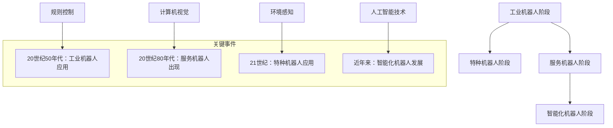
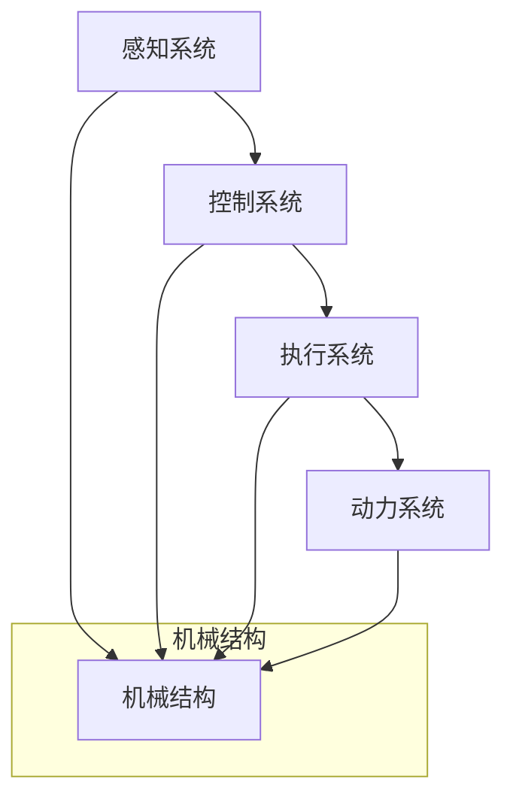
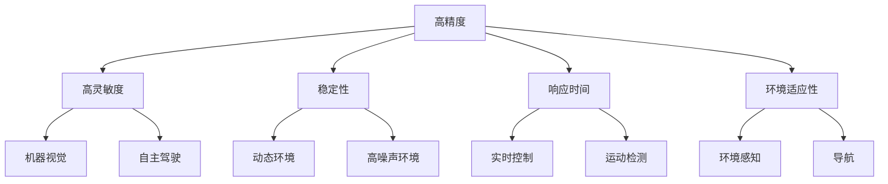
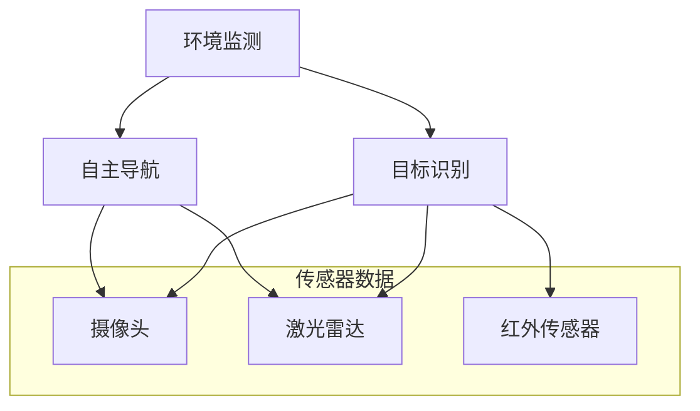
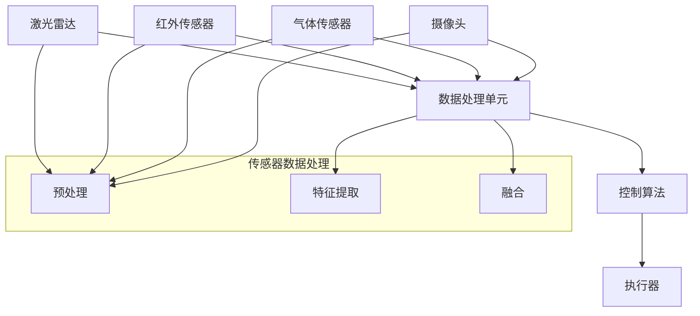
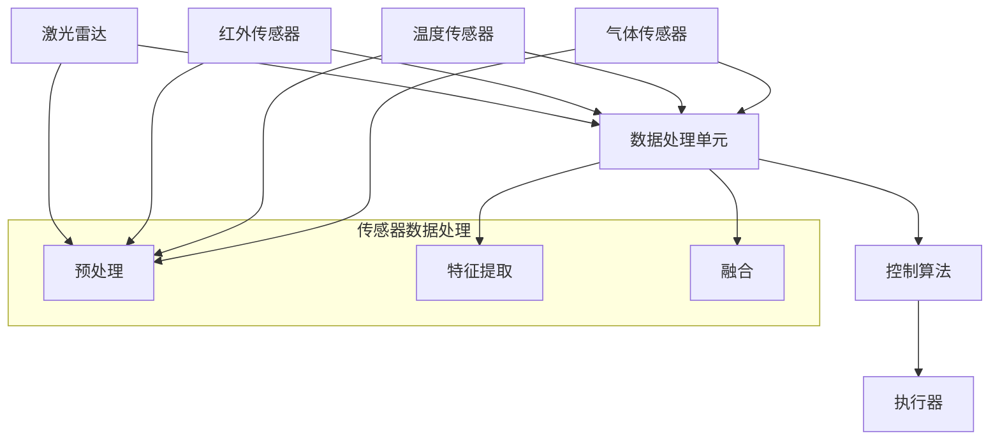
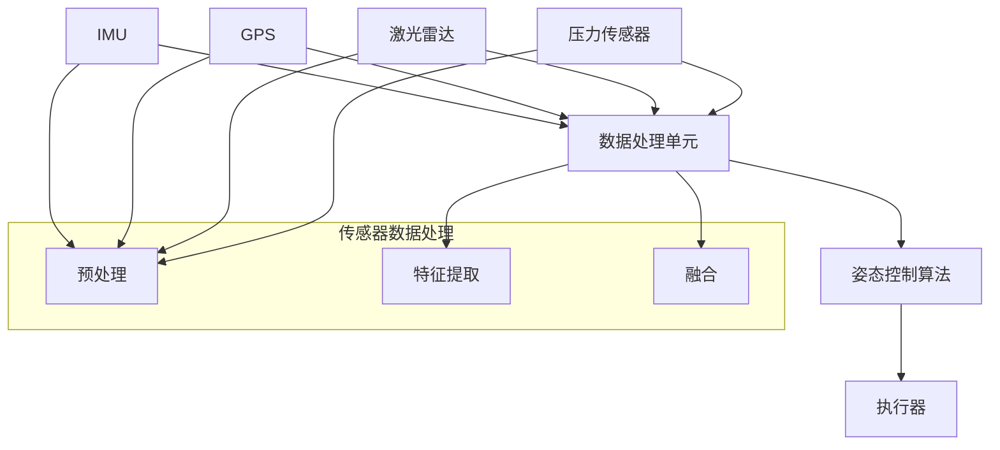

                 

### 文章标题：机器人技术在危险环境作业中的应用

> 关键词：机器人技术、危险环境、作业应用、算法原理、数学模型、项目实战

> 摘要：本文旨在深入探讨机器人技术在危险环境作业中的应用，包括爆炸环境、高温环境、重力环境等。通过详细介绍核心概念、算法原理、数学模型及实际应用案例，展示机器人技术在提高作业安全性、效率和准确性的显著优势。

### 目录大纲设计构思与实现步骤

#### 一、明确书籍主题和目标读者群体

首先，我们需要明确《机器人技术在危险环境作业中的应用》这本书的主题和目标读者群体。本书主要介绍机器人技术在危险环境作业中的应用，目标读者可能是从事机器人技术、危险环境作业领域的研究人员、工程师或相关专业的学生。

#### 二、确定核心内容与结构

接下来，我们要根据书籍的主题，确定核心内容和章节结构。根据要求，核心章节内容应包含：

1. **核心概念与联系**：介绍机器人技术、危险环境作业等相关核心概念及其相互联系，使用Mermaid流程图展示。
2. **核心算法原理讲解**：详细阐述机器人技术在危险环境作业中的应用相关算法原理，使用伪代码进行描述。
3. **数学模型和数学公式**：讲解机器人技术中的数学模型和公式，使用LaTeX格式表示，并进行详细讲解和举例说明。
4. **项目实战**：通过实际案例，展示机器人技术在危险环境作业中的具体应用，包括开发环境搭建、源代码实现和代码解读分析。

#### 三、设计目录大纲

根据上述核心内容，我们可以设计出如下目录大纲：

### 第一部分：机器人技术基础

#### 第1章：机器人技术概述

##### 1.1 机器人技术的发展历程
- Mermaid流程图：机器人技术发展历程

##### 1.2 机器人技术的分类
- 工业机器人
- 服务机器人
- 特种机器人

##### 1.3 机器人技术的基本结构
- 机械结构
- 控制系统
- 感知系统
- 动力系统

#### 第2章：机器人传感器与感知技术

##### 2.1 传感器技术概述
- 常见传感器类型：温度传感器、压力传感器、激光雷达等

##### 2.2 感知技术原理
- 感知数据预处理
- 特征提取
- 机器学习算法

##### 2.3 感知技术在危险环境作业中的应用
- 传感器融合
- 感知技术在爆炸、高温、重力等危险环境中的应用

#### 第3章：机器人控制与决策技术

##### 3.1 控制技术概述
- 开环控制与闭环控制
- PID控制
- 模糊控制

##### 3.2 决策技术原理
- 决策树
- 支持向量机
- 随机森林

##### 3.3 控制与决策技术在危险环境作业中的应用
- 爆炸环境下的控制与决策
- 高温环境下的控制与决策

### 第二部分：危险环境作业场景分析

#### 第4章：危险环境类型与特征

##### 4.1 爆炸环境
- 爆炸环境的定义与分类
- 爆炸环境下的安全要求

##### 4.2 高温环境
- 高温环境的定义与分类
- 高温环境下的安全要求

##### 4.3 重力环境
- 重力环境的定义与分类
- 重力环境下的安全要求

##### 4.4 其他危险环境
- 腐蚀环境
- 高辐射环境

#### 第5章：危险环境作业需求分析

##### 5.1 作业任务类型
- 监测与监测
- 清理与修复
- 采样与分析

##### 5.2 作业环境要求
- 安全性要求
- 高效性要求
- 可靠性要求

##### 5.3 作业风险与挑战
- 人为风险
- 技术风险
- 环境风险

### 第三部分：机器人技术在危险环境作业中的应用

#### 第6章：机器人技术在爆炸环境中的应用

##### 6.1 爆炸环境机器人概述
- 爆炸环境机器人的定义与分类
- 爆炸环境机器人的功能与特点

##### 6.2 爆炸环境机器人技术原理
- 爆炸环境下的传感器技术
- 爆炸环境下的控制技术

##### 6.3 爆炸环境机器人应用案例
- 爆炸环境监测机器人
- 爆炸清理机器人
- 爆炸采样机器人

#### 第7章：机器人技术在高温环境中的应用

##### 7.1 高温环境机器人概述
- 高温环境机器人的定义与分类
- 高温环境机器人的功能与特点

##### 7.2 高温环境机器人技术原理
- 高温环境下的传感器技术
- 高温环境下的控制技术

##### 7.3 高温环境机器人应用案例
- 高温环境监测机器人
- 高温环境维修机器人
- 高温环境采样机器人

#### 第8章：机器人技术在重力环境中的应用

##### 8.1 重力环境机器人概述
- 重力环境机器人的定义与分类
- 重力环境机器人的功能与特点

##### 8.2 重力环境机器人技术原理
- 重力环境下的传感器技术
- 重力环境下的控制技术

##### 8.3 重力环境机器人应用案例
- 重力环境监测机器人
- 重力环境维修机器人
- 重力环境采样机器人

#### 第9章：机器人技术在其他危险环境中的应用

##### 9.1 其他危险环境机器人概述
- 其他危险环境机器人的定义与分类
- 其他危险环境机器人的功能与特点

##### 9.2 其他危险环境机器人技术原理
- 腐蚀环境下的传感器技术
- 高辐射环境下的控制技术

##### 9.3 其他危险环境机器人应用案例
- 腐蚀环境监测机器人
- 高辐射环境清理机器人
- 高辐射环境采样机器人

#### 四、完善目录大纲

在完成初步的目录大纲后，我们还需要根据实际需求，对章节内容进行细化和完善，确保每个章节都能涵盖相关主题，并使整个目录大纲逻辑清晰、结构合理。

### 最终目录大纲

根据以上设计构思，最终目录大纲如下：

## 《机器人技术在危险环境作业中的应用》目录大纲

### 第一部分：机器人技术基础

#### 第1章：机器人技术概述

##### 1.1 机器人技术的发展历程
- Mermaid流程图：机器人技术发展历程
- 机器人技术关键事件回顾

##### 1.2 机器人技术的分类
- 工业机器人
- 服务机器人
- 特种机器人

##### 1.3 机器人技术的基本结构
- 机械结构
- 控制系统
- 感知系统
- 动力系统

#### 第2章：机器人传感器与感知技术

##### 2.1 传感器技术概述
- 常见传感器类型：温度传感器、压力传感器、激光雷达等
- 传感器特性与应用

##### 2.2 感知技术原理
- 感知数据预处理
- 特征提取
- 机器学习算法

##### 2.3 感知技术在危险环境作业中的应用
- 传感器融合
- 感知技术在爆炸、高温、重力等危险环境中的应用

#### 第3章：机器人控制与决策技术

##### 3.1 控制技术概述
- 开环控制与闭环控制
- PID控制
- 模糊控制

##### 3.2 决策技术原理
- 决策树
- 支持向量机
- 随机森林

##### 3.3 控制与决策技术在危险环境作业中的应用
- 爆炸环境下的控制与决策
- 高温环境下的控制与决策

### 第二部分：危险环境作业场景分析

#### 第4章：危险环境类型与特征

##### 4.1 爆炸环境
- 爆炸环境的定义与分类
- 爆炸环境下的安全要求

##### 4.2 高温环境
- 高温环境的定义与分类
- 高温环境下的安全要求

##### 4.3 重力环境
- 重力环境的定义与分类
- 重力环境下的安全要求

##### 4.4 其他危险环境
- 腐蚀环境
- 高辐射环境

#### 第5章：危险环境作业需求分析

##### 5.1 作业任务类型
- 监测与监测
- 清理与修复
- 采样与分析

##### 5.2 作业环境要求
- 安全性要求
- 高效性要求
- 可靠性要求

##### 5.3 作业风险与挑战
- 人为风险
- 技术风险
- 环境风险

### 第三部分：机器人技术在危险环境作业中的应用

#### 第6章：机器人技术在爆炸环境中的应用

##### 6.1 爆炸环境机器人概述
- 爆炸环境机器人的定义与分类
- 爆炸环境机器人的功能与特点

##### 6.2 爆炸环境机器人技术原理
- 爆炸环境下的传感器技术
- 爆炸环境下的控制技术

##### 6.3 爆炸环境机器人应用案例
- 爆炸环境监测机器人
- 爆炸清理机器人
- 爆炸采样机器人

#### 第7章：机器人技术在高温环境中的应用

##### 7.1 高温环境机器人概述
- 高温环境机器人的定义与分类
- 高温环境机器人的功能与特点

##### 7.2 高温环境机器人技术原理
- 高温环境下的传感器技术
- 高温环境下的控制技术

##### 7.3 高温环境机器人应用案例
- 高温环境监测机器人
- 高温环境维修机器人
- 高温环境采样机器人

#### 第8章：机器人技术在重力环境中的应用

##### 8.1 重力环境机器人概述
- 重力环境机器人的定义与分类
- 重力环境机器人的功能与特点

##### 8.2 重力环境机器人技术原理
- 重力环境下的传感器技术
- 重力环境下的控制技术

##### 8.3 重力环境机器人应用案例
- 重力环境监测机器人
- 重力环境维修机器人
- 重力环境采样机器人

#### 第9章：机器人技术在其他危险环境中的应用

##### 9.1 其他危险环境机器人概述
- 其他危险环境机器人的定义与分类
- 其他危险环境机器人的功能与特点

##### 9.2 其他危险环境机器人技术原理
- 腐蚀环境下的传感器技术
- 高辐射环境下的控制技术

##### 9.3 其他危险环境机器人应用案例
- 腐蚀环境监测机器人
- 高辐射环境清理机器人
- 高辐射环境采样机器人

### 总结

通过上述目录大纲的设计，我们可以清晰地了解到本书的结构和内容安排。从机器人技术的基础知识到危险环境作业场景分析，再到具体应用案例，本书旨在为读者提供一个全面、系统的指南，帮助他们深入理解并掌握机器人技术在危险环境作业中的实际应用。

接下来，我们将逐一展开各个章节的内容，通过深入讲解核心概念、算法原理、数学模型以及实际应用案例，帮助读者全面了解机器人技术在危险环境作业中的重要性及其广泛应用。

### 机器人技术的发展历程

机器人技术的发展可以追溯到20世纪中期，自那时以来，机器人技术经历了多个阶段的发展。最初，机器人主要用于工业生产，特别是汽车制造领域。随着时间的推移，机器人技术逐渐扩展到服务机器人、医疗机器人、农业机器人和特种机器人等领域。

**1. 工业机器人阶段**

在20世纪50年代，工业机器人开始应用于汽车生产线。这一阶段的机器人主要基于规则控制，操作简单且重复性高。它们能够执行如焊接、搬运等简单的工业任务。在这个阶段，机器人的主要目标是提高生产效率，减少人力成本。

**2. 服务机器人阶段**

20世纪80年代，随着计算机技术和人工智能的快速发展，服务机器人开始进入人们的视野。服务机器人能够执行更复杂的任务，如家庭清洁、保安巡逻、导览服务等。这个阶段标志着机器人从工业领域向民用领域的扩展。

**3. 特种机器人阶段**

进入21世纪，特种机器人成为研究的热点。特种机器人能够应对危险环境，如爆炸现场、深海探测、太空探索等。这些机器人通常具有高度的任务适应性、较强的环境感知能力和先进的控制算法。

**4. 智能化机器人阶段**

近年来，人工智能技术的飞速发展使得机器人逐渐向智能化方向发展。智能化机器人能够通过学习和自适应来提高任务执行的准确性和效率。例如，智能机器人可以通过深度学习算法来识别物体，并通过自然语言处理技术来与人类进行互动。

**Mermaid流程图：机器人技术发展历程**



在这个Mermaid流程图中，我们展示了机器人技术从工业阶段到智能化阶段的演变过程，以及每个阶段的关键事件和核心技术的变迁。通过这个流程图，读者可以更直观地了解机器人技术的发展历程。

### 机器人技术的分类

机器人技术可以根据其应用领域和功能特点进行分类。常见的分类方法包括工业机器人、服务机器人、特种机器人和家庭机器人。每种类型的机器人都有其独特的应用场景和技术特点。

**1. 工业机器人**

工业机器人主要用于制造业，能够执行如焊接、搬运、装配等重复性高、劳动强度大的任务。工业机器人通常具有高精度、高效率和可靠性强的特点。根据其应用领域，工业机器人可以分为以下几类：

- **焊接机器人**：用于焊接作业，如汽车制造业中的车身焊接。
- **搬运机器人**：用于搬运货物，如物流仓库中的自动分拣。
- **装配机器人**：用于装配作业，如电子制造中的组件装配。

**2. 服务机器人**

服务机器人主要面向民用领域，提供家庭服务、医疗护理、保安巡逻等。服务机器人具有较强的人机交互能力，能够理解和执行人类指令。常见的服务机器人包括：

- **家庭清洁机器人**：如扫地机器人、擦窗机器人。
- **医疗护理机器人**：如康复机器人、手术辅助机器人。
- **保安巡逻机器人**：用于安全监控和巡逻，如无人机巡逻机器人。

**3. 特种机器人**

特种机器人能够在极端或危险环境中执行任务，如深海探测、太空探索、爆炸处理等。特种机器人通常具有高适应性、强环境感知能力和先进的控制技术。常见的特种机器人包括：

- **深海探测机器人**：用于深海勘探、海底资源开采等。
- **爆炸处理机器人**：用于处理爆炸物、清理爆炸现场。
- **太空探索机器人**：用于太空站维修、月球和火星探测。

**4. 家庭机器人**

家庭机器人是面向家庭用户的服务机器人，提供日常生活帮助，如家庭清洁、烹饪、娱乐等。家庭机器人通常与人工智能技术相结合，具备一定的人工智能能力和自然语言处理能力。常见的家庭机器人包括：

- **智能音箱**：如亚马逊Echo、谷歌Home。
- **智能助手**：如苹果Siri、微软Cortana。
- **智能玩具**：如机器人宠物、教育机器人。

通过上述分类，我们可以更清晰地了解各种机器人类型的特点和应用领域，从而为特定任务选择合适的机器人。例如，在危险环境作业中，特种机器人由于其强大的环境适应能力和先进的技术，可以有效地执行危险任务，提高作业安全性和效率。

### 机器人技术的基本结构

机器人技术的基本结构主要包括机械结构、控制系统、感知系统和动力系统。这些系统相互配合，使得机器人能够实现复杂的任务。

**1. 机械结构**

机械结构是机器人的硬件基础，决定了机器人的形态和功能。常见的机械结构包括：

- **整体结构**：如机器人的骨架，包括机身、关节和驱动器。
- **驱动系统**：包括电机、液压系统或气压系统，用于驱动机器人运动。
- **末端执行器**：用于完成特定任务的工具或装置，如机械臂、夹具、传感器等。

**2. 控制系统**

控制系统是机器人的核心，负责协调各个部件的运行。控制系统通常包括：

- **中央处理器（CPU）**：执行机器人控制算法，处理传感器数据和执行器命令。
- **控制算法**：如PID控制、模糊控制、神经网络等，用于实现机器人的运动控制。
- **通信系统**：用于与其他系统或设备进行数据交换和通信，如Wi-Fi、蓝牙、有线网络等。

**3. 感知系统**

感知系统负责收集外部环境信息，为控制系统提供实时数据。常见的感知系统包括：

- **传感器**：如摄像头、激光雷达、超声波传感器等，用于感知距离、图像、温度等。
- **数据处理单元**：对传感器数据进行预处理、特征提取和融合，为控制系统提供准确的感知信息。

**4. 动力系统**

动力系统为机器人提供能源，确保机器人能够长时间运行。常见的动力系统包括：

- **电池**：如锂电池、燃料电池等，为机器人提供电力。
- **能源管理模块**：负责管理电池充电、放电和能量分配，确保机器人能源供应的稳定性和效率。

**工作流程**

1. **感知**：机器人通过感知系统收集外部环境信息，如摄像头捕捉图像、激光雷达测量距离等。
2. **处理**：感知数据传输到数据处理单元，进行预处理、特征提取和融合，为控制系统提供准确的感知信息。
3. **决策**：控制系统根据控制算法对感知信息进行处理，生成控制指令。
4. **执行**：控制指令传输到执行器，如电机驱动器、液压系统等，驱动机器人执行相应动作。

通过上述工作流程，机器人能够根据外部环境的变化进行实时调整和响应，从而完成复杂的任务。

**Mermaid流程图：机器人技术的基本结构**



在这个Mermaid流程图中，我们展示了机器人技术的基本结构及其相互关系。通过这个流程图，读者可以更直观地了解机器人的工作原理和各个组成部分的作用。

### 传感器技术概述

传感器技术是机器人技术的重要组成部分，用于感知外部环境信息，为机器人的决策和控制提供实时数据。传感器种类繁多，各有其特点和适用场景。

**常见传感器类型**

1. **摄像头**：摄像头是最常见的视觉传感器，用于捕捉图像和视频。它广泛应用于机器视觉、物体识别和导航等领域。

2. **激光雷达（Lidar）**：激光雷达通过发射激光并测量反射时间来获取三维环境信息。它广泛应用于自主驾驶、机器人导航和环境感知。

3. **超声波传感器**：超声波传感器通过发射超声波并测量反射时间来检测物体的距离。它常用于机器人避障和距离测量。

4. **温度传感器**：温度传感器用于测量环境温度。常见的有热敏电阻、热电偶等。

5. **压力传感器**：压力传感器用于测量气体或液体的压力。它广泛应用于机器人导航和执行器控制。

6. **红外传感器**：红外传感器用于检测物体发射的红外辐射。它广泛应用于热成像、物体识别和运动检测。

7. **湿度传感器**：湿度传感器用于测量空气中的湿度。它广泛应用于农业、气象和机器人环境感知。

**传感器特性与应用**

1. **高精度**：高精度传感器能够提供高精度的测量数据，对于精确控制和高精度任务至关重要。

2. **高灵敏度**：高灵敏度传感器能够检测到微小的变化，适用于动态环境和高噪声环境。

3. **稳定性**：稳定性好的传感器能够在长时间运行中保持测量精度，减少误差。

4. **响应时间**：快速响应的传感器能够及时检测到环境变化，为实时控制提供支持。

5. **环境适应性**：传感器需要具备良好的环境适应性，能够在不同温度、湿度、光照条件下正常工作。

在实际应用中，不同的传感器根据任务需求选择。例如，在危险环境作业中，激光雷达和红外传感器因其较强的环境适应性和测量精度，常被用于机器人导航和环境感知。

**Mermaid流程图：传感器特性与应用**



在这个Mermaid流程图中，我们展示了不同传感器的特性及其在具体应用领域的适用性。通过这个流程图，读者可以更好地了解传感器的选择和应用场景。

### 感知技术原理

感知技术在机器人中扮演着至关重要的角色，它使得机器人能够获取并理解其周围环境的信息，从而进行自主决策和行动。感知技术的基本原理包括感知数据的预处理、特征提取和机器学习算法的应用。

**感知数据预处理**

感知数据预处理是感知技术的重要环节，它主要包括以下几个步骤：

1. **数据去噪**：原始感知数据通常包含噪声，需要进行去噪处理以提高数据的准确性。常用的去噪方法包括滤波、均值滤波和高斯滤波等。

2. **数据归一化**：将感知数据的数值范围调整为统一的尺度，以消除不同传感器之间的量纲差异。例如，将图像像素值归一化到[0,1]范围内。

3. **数据增强**：通过增加数据样本数量和多样性来提高模型的泛化能力。常见的数据增强方法包括旋转、翻转、裁剪和颜色变换等。

**特征提取**

特征提取是将原始感知数据转换为更抽象、更具代表性的特征表示的过程。特征提取方法可以分为以下几类：

1. **手工特征提取**：通过专家经验设计特定的特征，如SIFT（尺度不变特征变换）、HOG（直方图方向梯度）等。这些特征具有良好的辨别能力，但需要人工设计。

2. **自动特征提取**：通过机器学习算法自动提取特征，如深度学习中的卷积神经网络（CNN）和自编码器（Autoencoder）。这些方法能够自动学习数据的复杂结构，但需要大量的数据和计算资源。

3. **基于统计的特征提取**：利用统计学方法对感知数据进行分析，提取具有统计显著性的特征，如主成分分析（PCA）和独立成分分析（ICA）。

**机器学习算法**

机器学习算法在感知技术中起着核心作用，它能够根据训练数据自动识别模式和规律，从而实现感知和决策。常见的机器学习算法包括：

1. **监督学习算法**：如支持向量机（SVM）、决策树、随机森林等。这些算法通过已标记的训练数据学习特征和分类规则。

2. **无监督学习算法**：如聚类算法（K-means、层次聚类）、降维算法（PCA、t-SNE）等。这些算法不需要标记数据，可以自动发现数据的结构和模式。

3. **深度学习算法**：如卷积神经网络（CNN）、循环神经网络（RNN）、生成对抗网络（GAN）等。这些算法能够自动学习复杂的特征表示，并在图像识别、语音识别等领域取得了显著的成果。

**感知技术在危险环境作业中的应用**

在危险环境作业中，感知技术被广泛应用于环境监测、目标识别和自主导航等领域。以下是一些具体应用示例：

1. **环境监测**：通过摄像头和传感器收集环境数据，进行实时监测和分析。例如，在爆炸环境中，可以使用激光雷达和红外传感器监测气体浓度、温度和压力等参数。

2. **目标识别**：通过图像和传感器数据，识别并定位危险目标。例如，在核辐射环境中，可以使用摄像头和辐射传感器识别辐射源和危险物质。

3. **自主导航**：通过激光雷达和视觉传感器，实现机器人在复杂环境中的自主导航。例如，在深海探测中，机器人可以使用激光雷达进行地形测绘和导航。

**Mermaid流程图：感知技术在危险环境作业中的应用**



在这个Mermaid流程图中，我们展示了感知技术在危险环境作业中的应用场景以及使用的传感器类型。通过这个流程图，读者可以更直观地了解感知技术在危险环境作业中的作用。

### 感知技术在危险环境作业中的应用

在危险环境作业中，感知技术至关重要，它能够帮助机器人实时获取环境信息，从而提高作业的准确性和安全性。以下将详细探讨感知技术在爆炸环境、高温环境和重力环境等危险环境作业中的应用。

**爆炸环境**

在爆炸环境中，机器人需要实时监测爆炸气体、温度、压力等参数，以防止事故发生。具体应用包括：

1. **气体监测**：使用红外传感器和气体传感器检测爆炸气体浓度。例如，红外传感器可以检测CH4（甲烷）等易燃气体，而气体传感器可以检测氧气浓度。

   **伪代码：**
   ```python
   def detect_gas(concentration):
       if concentration > threshold:
           raise_alert("Explosive gas detected")
   ```

2. **温度监测**：使用热电偶和红外传感器监测环境温度。热电偶可以提供高精度的温度测量，而红外传感器可以实时监测火焰和高温区域。

   **伪代码：**
   ```python
   def measure_temperature(temperature):
       if temperature > critical_temp:
           trigger_hazard_alarm()
   ```

**高温环境**

在高温环境中，机器人需要具备耐高温性能，并实时监测温度和热辐射。应用场景包括熔炉维护、核反应堆检查等。具体技术包括：

1. **热辐射监测**：使用红外传感器监测热辐射强度，以评估环境温度。

   **伪代码：**
   ```python
   def measure_thermal_radiation(radiation):
       if radiation > threshold:
           alert_hazardous_conditions()
   ```

2. **温度控制**：通过温度传感器和控制系统调节机器人内部的冷却系统，确保机器人在高温环境下稳定运行。

   **伪代码：**
   ```python
   def control_temperature(temperature):
       if temperature > optimal_temp:
           activate_cooling_system()
   ```

**重力环境**

在重力环境（如深海或太空）中，机器人需要适应低重力或微重力环境，并实时监测相关参数。具体应用包括：

1. **重力测量**：使用加速度计和重力传感器测量重力变化。例如，在深海探测中，机器人可以使用这些传感器检测海底地形和移动方向。

   **伪代码：**
   ```python
   def measure_gravity(gravity):
       if gravity < threshold:
           adjust_heading()
   ```

2. **环境监测**：使用摄像头和激光雷达进行环境扫描，以获取地形和障碍物的信息。

   **伪代码：**
   ```python
   def scan_environment():
       capture_image()
       analyze地形数据()
   ```

通过上述感知技术的应用，机器人能够有效地在危险环境中进行监测、识别和导航，提高作业的安全性和效率。感知技术的不断进步为机器人技术的发展提供了强大的支持，使得机器人在复杂、危险的环境中能够更好地执行任务。

### 控制技术概述

控制技术是机器人技术中至关重要的一部分，它决定了机器人如何根据外部环境信息进行响应和行动。控制技术可以分为开环控制和闭环控制，以及PID控制、模糊控制等具体实现方法。

**1. 开环控制与闭环控制**

**开环控制**：开环控制是指系统的输出不受反馈控制，仅根据输入指令直接执行操作。这种控制方式简单易实现，但缺点是缺乏对实际输出的反馈调整，因此在复杂环境中稳定性较差。

**闭环控制**：闭环控制则是通过将系统的输出与期望目标进行比较，通过反馈机制进行调整，以实现对系统的精确控制。闭环控制具有较好的稳定性和精度，但实现复杂，需要额外的传感器和计算资源。

**2. PID控制**

**PID控制**：PID控制是一种经典的控制算法，通过比例（Proportional）、积分（Integral）和微分（Derivative）三个部分来实现对系统的控制。

- **比例（P）**：根据当前误差与设定值的比例进行控制，误差越大，控制力度越大。
- **积分（I）**：对误差进行积分，逐步减小误差，提高系统的稳定性。
- **微分（D）**：对误差的变化率进行控制，快速响应误差变化，防止超调。

**伪代码：**
```python
def PID_control(current_value, target_value, Kp, Ki, Kd):
    error = target_value - current_value
    proportional = Kp * error
    integral = Ki * sum(error)
    derivative = Kd * (error - previous_error)
    output = proportional + integral + derivative
    previous_error = error
    return output
```

**3. 模糊控制**

**模糊控制**：模糊控制是一种基于模糊逻辑的控制方法，通过模糊集合和模糊规则来实现对系统的控制。它特别适用于非线性、时变和复杂系统。

- **模糊集合**：将输入和输出变量表示为模糊集合，如“冷”、“暖”等。
- **模糊规则**：通过模糊逻辑推理，将输入变量的模糊集合与规则库进行匹配，得到输出变量的模糊集合。
- **模糊推理**：通过模糊推理，将模糊集合进行运算，得到精确的输出值。

**伪代码：**
```python
def fuzzy_control(input_variable, rule_base):
    fuzzy_sets = apply_fuzzy_rules(input_variable, rule_base)
    output_variable = defuzzify(fuzzy_sets)
    return output_variable
```

**开环控制与闭环控制的比较**

| 特性 | 开环控制 | 闭环控制 |
| --- | --- | --- |
| 稳定性 | 较差 | 较好 |
| 实现复杂度 | 较低 | 较高 |
| 适应性 | 较差 | 较好 |
| 响应速度 | 较快 | 较慢 |

在实际应用中，根据具体任务和环境要求，选择合适的控制方法。例如，在简单、稳定的环境下，开环控制可能足够使用；而在复杂、多变的环境下，闭环控制结合PID或模糊控制能够提供更精确的控制效果。

### 决策技术原理

决策技术在机器人技术中起着至关重要的作用，它使得机器人能够在复杂环境中进行有效的决策和行动。决策技术包括多种算法，如决策树、支持向量机（SVM）和随机森林（Random Forest）等，每种算法都有其独特的原理和应用场景。

**1. 决策树**

**决策树**是一种树形结构，通过一系列的判断条件来分割数据，并生成决策规则。它由根节点、内部节点和叶节点组成。

- **根节点**：开始时的初始节点，表示整个数据集。
- **内部节点**：表示判断条件，如“温度>30°C”。
- **叶节点**：表示最终的决策结果，如“进入避难所”或“保持原地”。

决策树通过递归分割数据，直到满足停止条件（如达到最大深度或最小叶节点大小）。它易于理解，但可能存在过拟合问题。

**伪代码：**
```python
def build_decision_tree(data, features, labels):
    if stop_condition(data):
        return leaf_node(labels)
    else:
        best_feature = select_best_feature(data, features)
        decision_tree = Node(best_feature)
        for value in feature_values(best_feature):
            sub_data = split_data(data, best_feature, value)
            decision_tree.children.append(build_decision_tree(sub_data, features, labels))
        return decision_tree
```

**2. 支持向量机（SVM）**

**支持向量机**是一种强大的分类和回归算法，通过找到最优超平面来分隔数据。SVM的核心是寻找一个能够最大化分类边界的超平面，即最大化分类间隔。

- **支持向量**：位于分类边界上的数据点，对分类决策有决定性作用。
- **核函数**：用于将低维数据映射到高维空间，以便找到线性不可分情况下的最优超平面。

SVM广泛应用于图像识别、文本分类等领域。

**伪代码：**
```python
def SVM(train_data, train_labels, kernel_function):
    # Solve the optimization problem to find the optimal hyperplane
    optimal_hyperplane = solve_optimization_problem(train_data, train_labels, kernel_function)
    return optimal_hyperplane
```

**3. 随机森林（Random Forest）**

**随机森林**是一种集成学习算法，通过构建多个决策树，并对它们的输出进行投票或平均来提高预测准确性。随机森林通过随机选择特征子集和随机划分节点，降低了过拟合的风险。

- **基学习器**：单个决策树。
- **集成学习**：通过组合多个基学习器的输出，提高模型性能。

随机森林在分类和回归任务中表现出色。

**伪代码：**
```python
def random_forest(train_data, train_labels, num_trees, max_features):
    forest = []
    for _ in range(num_trees):
        current_tree = build_decision_tree(train_data, train_data[:, feature_indices], train_labels)
        forest.append(current_tree)
    return forest
```

**应用场景**

- **决策树**：适用于简单、清晰的分类和回归问题。
- **SVM**：适用于线性可分或高维数据的分类和回归问题。
- **随机森林**：适用于复杂、非线性数据的分类和回归问题。

通过理解这些决策技术原理，机器人可以更好地处理复杂环境中的决策问题，从而提高作业的准确性和效率。

### 控制与决策技术在危险环境作业中的应用

控制与决策技术在危险环境作业中起着至关重要的作用，能够显著提高作业的安全性和效率。以下将详细探讨爆炸环境、高温环境等危险环境中的具体应用，通过实际案例和数学模型，展示这些技术如何帮助机器人执行复杂任务。

**爆炸环境**

**应用案例**：在核电站爆炸现场，机器人需要快速评估现场危险等级，并执行危险物清理和隔离任务。

1. **实时监测**：机器人配备多种传感器（如激光雷达、红外传感器、气体传感器等），实时监测现场温度、气体浓度、辐射水平等参数。

   **数学模型**：
   $$ T(t) = f(C(t), R(t)) $$
   其中，$T(t)$表示现场温度，$C(t)$表示气体浓度，$R(t)$表示辐射水平，$f$为非线性函数，用于计算现场温度。

2. **路径规划**：基于实时监测数据，机器人使用A*算法进行路径规划，避开危险区域。

   **伪代码**：
   ```python
   def A_star_search(start, goal, cost_function):
       open_set = PriorityQueue()
       open_set.put((0, start))
       came_from = {}
       g_score = {node: float('infinity') for node in all_nodes}
       g_score[start] = 0
       while not open_set.isEmpty():
           current = open_set.get()
           if current == goal:
               return reconstruct_path(came_from, current)
           for neighbor in neighbors(current):
               tentative_g_score = g_score[current] + cost_function(current, neighbor)
               if tentative_g_score < g_score[neighbor]:
                   came_from[neighbor] = current
                   g_score[neighbor] = tentative_g_score
                   open_set.put((tentative_g_score, neighbor))
       return None
   ```

3. **自主决策**：机器人根据传感器数据和路径规划结果，自主执行清理任务。

   **决策算法**：使用模糊控制算法，根据现场环境参数进行决策，如“清理辐射区域”、“避开高温区域”。

   **伪代码**：
   ```python
   def fuzzy_decision_environment(temperature, radiation):
       if temperature > threshold1 and radiation > threshold2:
           return "clear Radiation"
       elif temperature > threshold1:
           return "avoid High Temperature"
       elif radiation > threshold2:
           return "avoid Radiation"
       else:
           return "clear"
   ```

**高温环境**

**应用案例**：在熔炉检修中，机器人需要进入高温环境进行设备检查和维修。

1. **耐高温设计**：机器人采用耐高温材料，并配备冷却系统，以应对高温环境。

   **数学模型**：
   $$ T_{robot} = T_{environment} + C \cdot P $$
   其中，$T_{robot}$表示机器人内部温度，$T_{environment}$表示外部环境温度，$C$为热传导系数，$P$为冷却系统功率。

2. **热辐射监测**：机器人使用红外传感器监测熔炉表面的热辐射强度，评估温度分布。

   **伪代码**：
   ```python
   def measure_thermal_radiation(radiation):
       if radiation > threshold:
           raise_alert("High Temperature Detected")
   ```

3. **自主导航与控制**：机器人根据热辐射数据和预设路径，自主导航至检修点，并进行设备检查。

   **控制算法**：使用PID控制算法，调节机器人移动速度和方向，确保平稳行驶。

   **伪代码**：
   ```python
   def PID_control(error, Kp, Ki, Kd):
       proportional = Kp * error
       integral = Ki * integral_error
       derivative = Kd * (error - previous_error)
       output = proportional + integral + derivative
       previous_error = error
       return output
   ```

通过这些具体应用案例和数学模型，我们可以看到控制与决策技术在危险环境作业中的重要作用。这些技术不仅提高了机器人在危险环境中的作业效率和安全性，还为未来的机器人技术发展提供了坚实的基础。

### 危险环境类型与特征

危险环境是指在自然或人为因素下，对人类和设备构成潜在威胁的环境。这些环境通常具有高度的不确定性、复杂性以及高风险特性。根据不同的危险类型，环境特征和潜在风险也有所不同。以下将详细探讨爆炸环境、高温环境、重力环境和腐蚀环境等危险环境的特点。

**爆炸环境**

**定义与分类**：爆炸环境是指存在可燃气体、粉尘或炸药等物质，在一定条件下可能发生爆炸的环境。爆炸环境根据危险源的不同，可以分为以下几类：

1. **工业爆炸环境**：常见于石油、化工、矿山等工业生产过程中。
2. **民用爆炸环境**：如烟花爆竹、燃气泄漏等。
3. **战争爆炸环境**：如炸弹、地雷等。

**特征**：爆炸环境具有以下特征：

1. **易燃易爆**：存在大量可燃气体、粉尘或炸药等危险物质。
2. **高压力**：爆炸产生的冲击波和高压气体可能导致设备损坏和结构破坏。
3. **强冲击**：爆炸产生的冲击波和碎片可能对人体和设备造成严重伤害。

**安全要求**：在爆炸环境中作业，需要采取以下安全措施：

1. **防爆措施**：使用防爆电器、防爆材料，防止火花和高温产生。
2. **通风换气**：保持环境通风，降低气体浓度。
3. **监测预警**：安装气体传感器和振动传感器，实时监测危险源，并设置报警系统。

**高温环境**

**定义与分类**：高温环境是指温度高于常温（约25°C）的环境。根据温度范围，高温环境可以分为：

1. **中等高温环境**：温度范围为50°C至100°C。
2. **高温环境**：温度范围为100°C至500°C。
3. **极高温度环境**：温度高于500°C。

**特征**：高温环境具有以下特征：

1. **高热辐射**：高温环境中的热辐射强度大，可能导致设备表面温度升高。
2. **高温腐蚀**：高温环境下的腐蚀速度加快，可能导致设备损坏。
3. **热变形**：高温环境可能导致材料发生热变形或热膨胀。

**安全要求**：在高温环境中作业，需要采取以下安全措施：

1. **隔热措施**：使用隔热材料，减少热量传递。
2. **冷却系统**：配备冷却系统，如水冷、风冷等，降低设备和工作环境的温度。
3. **防护装备**：穿戴高温防护服、手套等，保护人员安全。

**重力环境**

**定义与分类**：重力环境是指存在不同重力强度的工作环境，根据重力强度，可以分为：

1. **低重力环境**：重力强度低于地球表面重力，如国际空间站。
2. **微重力环境**：重力强度接近零，如月球和火星表面。
3. **高重力环境**：重力强度高于地球表面重力，如行星内部。

**特征**：重力环境具有以下特征：

1. **物体漂浮**：在低重力或微重力环境中，物体处于漂浮状态，无法使用常规的地面物理规则进行操作。
2. **失重状态**：在低重力或微重力环境中，人员处于失重状态，可能导致生理和心理不适。
3. **高辐射**：在行星表面，特别是火星和月球，高辐射环境可能对人体和设备造成损害。

**安全要求**：在重力环境中作业，需要采取以下安全措施：

1. **适应训练**：进行专门的训练，以适应低重力或微重力环境。
2. **防辐射措施**：使用防辐射材料，减少辐射对人体和设备的危害。
3. **机器人辅助**：使用特种机器人执行危险任务，减少人员直接参与。

**腐蚀环境**

**定义与分类**：腐蚀环境是指存在腐蚀性物质的环境，根据腐蚀性物质的类型，可以分为：

1. **酸腐蚀环境**：如硫酸、盐酸等强酸环境。
2. **碱腐蚀环境**：如氢氧化钠、氢氧化钾等强碱环境。
3. **气体腐蚀环境**：如硫化氢、氯气等腐蚀性气体环境。

**特征**：腐蚀环境具有以下特征：

1. **强腐蚀性**：腐蚀性物质能迅速侵蚀金属和其他材料，导致设备损坏。
2. **毒性**：某些腐蚀性物质具有毒性，可能对人体健康造成威胁。
3. **环境污染**：腐蚀性物质泄漏可能导致环境污染，对生态系统和人类健康造成危害。

**安全要求**：在腐蚀环境中作业，需要采取以下安全措施：

1. **防腐措施**：使用耐腐蚀材料，如钛合金、不锈钢等。
2. **防泄漏措施**：加强设备密封性，防止腐蚀性物质泄漏。
3. **个人防护**：穿戴防腐服、防毒面具等，保护人员安全。

通过对不同类型危险环境的特征和安全要求的探讨，我们可以更好地理解机器人在这些环境中的具体应用需求，从而采取相应的安全措施，确保机器人作业的安全性和有效性。

### 危险环境作业需求分析

在危险环境中进行作业，需要满足一系列特定的需求，以保证作业的安全性和有效性。以下将详细分析作业任务类型、作业环境要求以及作业过程中面临的风险和挑战。

**作业任务类型**

1. **监测与监测**：在危险环境中，机器人需要进行实时监测，如检测气体浓度、温度、辐射水平等。通过监测数据，机器人可以及时预警潜在的危险，为人员撤离或应急处理提供依据。

   **任务示例**：在核电站爆炸现场，机器人监测辐射水平和温度变化，实时传输数据至控制中心。

2. **清理与修复**：危险环境中的设备和结构可能受到损坏，需要机器人进行清理和修复。机器人可以使用工具进行切割、焊接、喷涂等操作，以恢复设备和结构的正常功能。

   **任务示例**：在化工爆炸后的现场，机器人清理爆炸产生的碎片和化学物质，修复受损的设备。

3. **采样与分析**：机器人可以采集环境样本，如土壤、水样、空气样本等，进行实验室分析。通过分析结果，可以为环境保护和风险评估提供科学依据。

   **任务示例**：在石油泄漏事故中，机器人采集泄漏海域的水样，检测石油含量和有害物质浓度。

**作业环境要求**

1. **安全性要求**：危险环境作业的首要要求是确保人员安全。机器人需要具备防爆炸、防辐射、防腐蚀等防护功能，以抵御环境中的危险因素。

   **安全措施**：使用防爆电器、穿戴防辐射防护服、使用耐腐蚀材料等。

2. **高效性要求**：在危险环境中，作业效率至关重要。机器人需要具备高精度、快速响应的能力，以减少作业时间，降低风险。

   **高效性措施**：采用先进的传感器和算法，实现高精度路径规划和任务执行。

3. **可靠性要求**：机器人需要具备高可靠性，能够在恶劣环境下稳定运行，减少故障和停机时间。

   **可靠性措施**：使用高可靠性的硬件和软件，进行严格的测试和验证。

**作业风险与挑战**

1. **人为风险**：危险环境作业可能涉及人员的直接参与，如现场指挥、设备操作等。人员的安全意识、操作技能和心理素质等因素都会影响作业的安全。

   **风险控制措施**：进行安全培训和技能考核，建立严格的安全操作规程。

2. **技术风险**：机器人技术的不成熟可能导致设备故障、任务失败等。例如，传感器失效、控制算法不稳定等。

   **技术控制措施**：进行充分的技术验证和测试，采用冗余设计和故障诊断机制。

3. **环境风险**：危险环境中的复杂、变化多端的环境可能导致机器人无法完成任务或发生意外。

   **环境控制措施**：对环境进行充分评估，制定详细的作业方案，实时监控环境变化。

通过满足上述作业需求，机器人可以在危险环境中安全、高效地执行任务，提高作业的安全性和效率。同时，不断优化技术和管理措施，有助于进一步降低作业风险和挑战。

### 爆炸环境机器人概述

爆炸环境机器人是专门设计用于在爆炸危险环境中执行任务的机器人。这类机器人能够承担高危作业，如拆除炸弹、监测爆炸气体浓度、清理爆炸现场等，从而保护人类的安全。爆炸环境机器人通常具备以下几个显著特点和分类：

**显著特点**

1. **防爆炸设计**：为了应对爆炸环境中的高压气体和冲击波，爆炸环境机器人采用坚固的防护外壳和防爆炸组件，确保在极端条件下仍能稳定运行。

2. **高环境适应性**：爆炸环境机器人能够在恶劣的环境下工作，包括高温、低温、高湿度等。这要求机器人具备良好的热管理能力和耐腐蚀性能。

3. **先进的传感器系统**：爆炸环境机器人配备多种传感器，如激光雷达、红外传感器、气体传感器等，用于实时监测环境变化，识别爆炸威胁。

4. **远程控制**：爆炸环境机器人通常通过遥控或远程视频监控系统进行操作，操作员可以在安全区域远程指挥机器人的动作，降低自身风险。

**分类**

1. **爆炸拆除机器人**：这类机器人主要用于拆除炸弹或未爆弹药。它们通常配备机械臂和切割工具，能够远程操作以避免直接接触。

2. **爆炸监测机器人**：这些机器人用于监测爆炸危险源，如化学工厂、油气管道等。通过传感器系统实时监测气体浓度、温度等参数，并发出警报。

3. **爆炸清理机器人**：这类机器人用于清理爆炸后的现场，如清理碎片、化学物质等。它们通常配备吸尘器、切割工具和拖车，能够自动完成任务。

**功能与特点**

1. **自动路径规划**：爆炸环境机器人具备自动路径规划功能，能够在复杂环境中自主导航，避开障碍物，到达指定位置。

2. **多传感器融合**：通过融合激光雷达、红外传感器、摄像头等多种传感器的数据，机器人能够更准确地感知环境，提高任务执行的准确性。

3. **实时决策与控制**：爆炸环境机器人具备实时决策和控制系统，能够根据传感器数据和环境变化，自主调整动作，确保作业安全。

4. **远程交互能力**：机器人与操作员之间通过远程通信系统进行交互，操作员可以实时了解机器人状态，控制机器人执行任务。

通过上述特点和分类，爆炸环境机器人在危险环境作业中发挥了重要作用，提高了作业的安全性和效率，减少了人员暴露于危险环境中的风险。

### 爆炸环境机器人技术原理

爆炸环境机器人之所以能够在危险环境中执行复杂任务，离不开其先进的技术原理。以下将详细探讨爆炸环境机器人中的传感器技术、控制技术以及这些技术如何协同工作，保障机器人在极端环境下的稳定运行。

**传感器技术**

爆炸环境机器人配备多种传感器，用于感知外部环境，获取关键数据，以便进行有效的决策和行动。这些传感器包括激光雷达、红外传感器、气体传感器和摄像头等。

1. **激光雷达**：激光雷达通过发射激光并测量反射时间来获取三维环境信息。这种传感器在机器人导航和避障中至关重要，能够实时构建环境地图，确保机器人准确避开障碍物。

2. **红外传感器**：红外传感器用于检测物体发射的红外辐射，常用于识别热源和高温区域。在爆炸环境中，红外传感器能够检测气体泄漏和温度变化，为机器人提供环境温度信息。

3. **气体传感器**：气体传感器用于检测爆炸环境中的有害气体，如甲烷、一氧化碳等。这些传感器通过化学或电化学方法，实时监测气体浓度，为机器人提供危险预警。

4. **摄像头**：摄像头是机器人的视觉感知核心，用于捕捉图像和视频。通过图像处理技术，机器人可以识别物体、分析图像内容，从而做出合理的决策。

**控制技术**

爆炸环境机器人的控制技术是其执行任务的核心，通过控制算法和执行器，实现传感器数据的处理和机器人的动作执行。

1. **PID控制**：PID控制是一种经典控制算法，通过比例（P）、积分（I）和微分（D）三个部分来调整控制输出，使机器人运动平稳。PID控制在机器人路径规划和避障中广泛应用，能够确保机器人在复杂环境中稳定运行。

   **伪代码：**
   ```python
   def PID_control(current_value, target_value, Kp, Ki, Kd):
       error = target_value - current_value
       proportional = Kp * error
       integral = Ki * sum(error)
       derivative = Kd * (error - previous_error)
       output = proportional + integral + derivative
       previous_error = error
       return output
   ```

2. **模糊控制**：模糊控制是一种基于模糊逻辑的控制方法，特别适用于处理复杂、不确定的系统。通过模糊规则库和模糊推理，机器人能够根据环境变化进行自适应控制。

   **伪代码：**
   ```python
   def fuzzy_control(input_variable, rule_base):
       fuzzy_sets = apply_fuzzy_rules(input_variable, rule_base)
       output_variable = defuzzify(fuzzy_sets)
       return output_variable
   ```

3. **深度学习**：深度学习算法，如卷积神经网络（CNN），通过训练大量数据，可以自动提取复杂的特征，实现高精度的环境感知和决策。在爆炸环境中，深度学习算法可以用于图像识别、物体检测和路径规划等任务。

   **伪代码：**
   ```python
   model = CNN_model()
   model.train(training_data, training_labels)
   def predict_image(image):
       prediction = model.predict(image)
       return prediction
   ```

**传感器与控制技术的协同工作**

爆炸环境机器人通过传感器和控制技术的协同工作，实现高度自动化的环境感知和任务执行。具体工作流程如下：

1. **感知**：传感器收集外部环境信息，如激光雷达生成三维地图，红外传感器检测热源，气体传感器监测气体浓度，摄像头捕捉图像。

2. **处理**：传感器数据传输到数据处理单元，进行预处理、特征提取和融合。通过机器学习算法，如深度学习，提取关键特征，用于决策。

3. **决策**：控制算法根据传感器数据和环境特征，生成控制指令，通过模糊控制或PID控制，调整机器人的动作。

4. **执行**：执行器根据控制指令，驱动机器人执行相应动作，如调整方向、速度和力度等。

**Mermaid流程图：传感器与控制技术的协同工作**



通过上述传感器和控制的协同工作，爆炸环境机器人能够实现高效、安全的危险环境作业，显著提高作业的准确性和安全性。

### 爆炸环境机器人应用案例

在爆炸环境中，爆炸环境机器人的应用不仅提高了作业的效率，还极大地降低了风险，保障了人员的安全。以下将详细探讨几种具体的爆炸环境机器人应用案例，包括爆炸环境监测机器人、爆炸清理机器人和爆炸采样机器人，并分析其技术实现和实际效果。

**爆炸环境监测机器人**

**应用背景**：在化工、矿山和核电站等场所，存在爆炸危险。实时监测爆炸气体浓度和温度变化对于预防事故至关重要。

**技术实现**：
1. **传感器系统**：配备气体传感器（如甲烷传感器、一氧化碳传感器）、红外传感器（检测温度变化）和激光雷达（用于环境扫描）。
2. **数据处理单元**：传感器数据通过数据处理单元进行预处理、特征提取和融合，生成实时环境监测数据。
3. **远程控制**：操作员通过无线通信系统实时监控机器人状态，远程指挥机器人进行数据采集和分析。

**实际效果**：爆炸环境监测机器人能够实时监测危险场所的气体浓度和温度变化，并在异常情况下及时发出警报。这不仅提高了事故预警能力，还减少了人员直接进入危险区域的必要性。

**爆炸清理机器人**

**应用背景**：在爆炸事件发生后，现场往往遗留大量碎片和有害物质，需要进行清理以恢复生产和生活秩序。

**技术实现**：
1. **机械臂系统**：配备机械臂，用于抓取和搬运碎片、化学物质等。
2. **防爆炸设计**：机械臂和机器人外壳采用防爆炸材料，确保在高压和冲击条件下稳定运行。
3. **自主导航**：使用激光雷达和摄像头进行环境扫描，结合路径规划算法实现自主导航。

**实际效果**：爆炸清理机器人能够在复杂环境中自动导航，高效地清理现场碎片和有害物质，减少了人工清理的工作量和风险，加快了恢复速度。

**爆炸采样机器人**

**应用背景**：在爆炸事件调查中，采集现场样本进行分析是确定事故原因的重要步骤。

**技术实现**：
1. **采样工具**：配备采样工具，如采样枪、采样瓶等，用于采集空气、水和土壤等样本。
2. **自动化分析**：通过传感器系统采集样本信息，并将样本送入实验室进行自动化分析。
3. **远程传输**：分析结果通过无线网络实时传输至控制中心，供事故调查人员参考。

**实际效果**：爆炸采样机器人能够自动采集现场样本，并快速传输分析结果，提高了事故调查的效率和准确性，有助于及时制定应对措施。

通过这些应用案例，我们可以看到爆炸环境机器人在提高爆炸环境作业安全性、效率和准确性方面发挥了重要作用。随着技术的不断进步，爆炸环境机器人的应用前景将更加广阔。

### 高温环境机器人概述

高温环境机器人是专为在极端高温条件下执行任务而设计的机器人。这类机器人广泛应用于熔炉维护、核反应堆检查、金属冶炼和工业炉窑等领域。高温环境机器人具有以下显著特点和分类：

**显著特点**

1. **耐高温设计**：高温环境机器人采用耐高温材料和特殊涂层，能够承受高达1000°C甚至更高的温度。例如，使用陶瓷材料、钨合金和高温合金等。

2. **先进的冷却系统**：机器人配备有效的冷却系统，如水冷、油冷和空气冷却，以保持内部部件的温度在可接受范围内。

3. **多传感器系统**：高温环境机器人配备温度传感器、热成像摄像头、气体传感器和激光雷达等，用于实时监测环境参数和设备状态。

4. **远程控制**：通过无线通信系统和远程控制系统，操作员可以在安全区域指挥机器人进行操作，确保人员安全。

**分类**

1. **熔炉维护机器人**：用于维护和检查高温熔炉，如金属冶炼炉、玻璃熔炉和水泥炉等。这些机器人能够自动清理熔炉内壁、检测炉温分布和监测熔炉内部状态。

2. **核反应堆检查机器人**：在核反应堆内执行维护和检查任务，如检查燃料棒、监测辐射水平和温度变化。这类机器人通常具备高防护能力和远程操作功能。

3. **金属冶炼机器人**：在高温冶炼过程中，机器人用于搬运和操作高温材料，如熔融金属的取样、温度监测和成分分析等。

4. **工业炉窑机器人**：用于检查和维护工业炉窑设备，如热处理炉、退火炉和热压炉等。这些机器人能够自动执行高温环境下的焊接、喷涂和热处理任务。

**功能与特点**

1. **高温耐受性**：高温环境机器人能够在高达1000°C甚至更高的温度下稳定运行，确保在极端环境下不发生故障。

2. **实时监测**：通过多传感器系统，机器人能够实时监测环境温度、气体浓度、辐射水平等参数，为操作员提供准确的数据。

3. **自动化操作**：机器人具备自动化操作功能，能够根据预设程序和传感器反馈，自主执行高温环境下的各种任务。

4. **远程控制**：操作员可以通过无线通信系统远程控制机器人，实时监控机器人状态和操作过程，提高作业效率和安全性。

通过上述特点和分类，高温环境机器人在极端高温环境下的危险作业中发挥了重要作用，提高了作业的安全性和效率，减少了人员直接接触高温环境的风险。

### 高温环境机器人技术原理

高温环境机器人能够在极端高温环境下执行任务，离不开其先进的技术原理。以下将详细探讨高温环境机器人中的传感器技术、控制技术以及这些技术如何协同工作，保障机器人在高温环境下的稳定运行。

**传感器技术**

高温环境机器人配备多种传感器，用于感知外部环境，获取关键数据，以便进行有效的决策和行动。这些传感器包括温度传感器、热成像摄像头、气体传感器和激光雷达等。

1. **温度传感器**：用于测量环境温度和设备温度，常见类型包括热电偶、热敏电阻和红外温度传感器。温度传感器能够提供高精度的温度测量数据，帮助机器人实时监测环境温度变化。

2. **热成像摄像头**：用于捕捉热辐射图像，显示温度分布。热成像摄像头能够快速识别高温区域和异常温度点，为机器人的导航和任务执行提供重要参考。

3. **气体传感器**：用于检测高温环境中的有害气体，如二氧化碳、一氧化碳和硫化氢等。气体传感器通过化学或电化学方法，实时监测气体浓度，为机器人提供危险预警。

4. **激光雷达**：用于扫描环境，构建三维地图，辅助机器人的自主导航和避障。激光雷达能够在高温环境下稳定工作，提供准确的距离和地形信息。

**控制技术**

高温环境机器人的控制技术是其执行任务的核心，通过控制算法和执行器，实现传感器数据的处理和机器人的动作执行。

1. **PID控制**：PID控制是一种经典控制算法，通过比例（P）、积分（I）和微分（D）三个部分来调整控制输出，使机器人运动平稳。PID控制在机器人路径规划和避障中广泛应用，能够确保机器人在高温环境下稳定运行。

   **伪代码：**
   ```python
   def PID_control(current_value, target_value, Kp, Ki, Kd):
       error = target_value - current_value
       proportional = Kp * error
       integral = Ki * sum(error)
       derivative = Kd * (error - previous_error)
       output = proportional + integral + derivative
       previous_error = error
       return output
   ```

2. **模糊控制**：模糊控制是一种基于模糊逻辑的控制方法，特别适用于处理复杂、不确定的系统。通过模糊规则库和模糊推理，机器人能够根据环境变化进行自适应控制。

   **伪代码：**
   ```python
   def fuzzy_control(input_variable, rule_base):
       fuzzy_sets = apply_fuzzy_rules(input_variable, rule_base)
       output_variable = defuzzify(fuzzy_sets)
       return output_variable
   ```

3. **深度学习**：深度学习算法，如卷积神经网络（CNN），通过训练大量数据，可以自动提取复杂的特征，实现高精度的环境感知和决策。在高温环境中，深度学习算法可以用于图像识别、物体检测和路径规划等任务。

   **伪代码：**
   ```python
   model = CNN_model()
   model.train(training_data, training_labels)
   def predict_image(image):
       prediction = model.predict(image)
       return prediction
   ```

**传感器与控制技术的协同工作**

高温环境机器人通过传感器和控制技术的协同工作，实现高效、安全的任务执行。具体工作流程如下：

1. **感知**：传感器收集外部环境信息，如激光雷达生成三维地图，红外传感器检测热源，温度传感器测量环境温度，气体传感器监测气体浓度。

2. **处理**：传感器数据通过数据处理单元进行预处理、特征提取和融合。通过机器学习算法，如深度学习，提取关键特征，用于决策。

3. **决策**：控制算法根据传感器数据和环境特征，生成控制指令，通过模糊控制或PID控制，调整机器人的动作。

4. **执行**：执行器根据控制指令，驱动机器人执行相应动作，如调整方向、速度和力度等。

**Mermaid流程图：传感器与控制技术的协同工作**



通过上述传感器和控制的协同工作，高温环境机器人能够实现高效、安全的危险环境作业，显著提高作业的准确性和安全性。

### 高温环境机器人应用案例

在高温环境中，高温环境机器人的应用不仅提高了作业的效率，还极大地降低了风险，保障了人员的安全。以下将详细探讨几种具体的高温环境机器人应用案例，包括高温环境监测机器人、高温环境维修机器人和高温环境采样机器人，并分析其技术实现和实际效果。

**高温环境监测机器人**

**应用背景**：在工业生产过程中，高温环境下的熔炉、热处理设备和工业炉窑等需要实时监测温度和气体浓度，以确保生产过程的安全和效率。

**技术实现**：
1. **传感器系统**：配备高精度温度传感器、热成像摄像头和气体传感器，用于实时监测高温环境中的温度、气体浓度等参数。
2. **数据处理单元**：传感器数据通过数据处理单元进行预处理、特征提取和融合，生成实时监测数据。
3. **远程监控系统**：通过无线通信系统，操作员可以远程监控机器人和监测数据，实时调整机器人的操作。

**实际效果**：高温环境监测机器人能够实时监测高温环境中的温度和气体浓度，及时发出警报，防止过热或有害气体泄漏，提高了生产安全性和效率。

**高温环境维修机器人**

**应用背景**：在高温环境中，如熔炉、热处理设备和工业炉窑等，设备维护和维修是保证正常生产的关键。人工维修存在高风险，需要使用高温环境维修机器人。

**技术实现**：
1. **机械臂系统**：机器人配备机械臂，用于拆卸、安装和维修高温设备。
2. **耐高温材料**：机械臂和机器人外壳采用耐高温材料，如钨合金和高温合金，确保在高温环境下稳定运行。
3. **自适应控制系统**：机器人通过自适应控制系统，根据环境温度和设备状态自动调整机械臂的动作，确保维修精度。

**实际效果**：高温环境维修机器人能够自动执行高温设备维修任务，如清理熔炉内壁、更换热处理炉部件等，减少了人工维修的工作量和风险，提高了维修效率和安全性。

**高温环境采样机器人**

**应用背景**：在高温环境中，如冶炼厂和化工企业，需要对熔融金属、气体和液体进行采样分析，以确保产品质量和环境安全。

**技术实现**：
1. **采样工具**：机器人配备高温采样工具，如高温采样枪、采样瓶等，用于采集熔融金属、气体和液体样本。
2. **自动化分析系统**：采样后的样本通过自动化分析系统进行快速检测和分析，生成分析报告。
3. **远程传输**：分析结果通过无线网络实时传输至实验室或控制中心，供技术人员参考。

**实际效果**：高温环境采样机器人能够自动采集高温环境中的样本，并快速传输分析结果，提高了分析效率和准确性，有助于及时调整生产过程和采取相应措施。

通过这些应用案例，我们可以看到高温环境机器人在提高高温环境作业安全性、效率和准确性方面发挥了重要作用。随着技术的不断进步，高温环境机器人的应用前景将更加广阔。

### 重力环境机器人概述

重力环境机器人是专为在低重力、微重力和高重力环境下执行任务而设计的机器人。这类机器人广泛应用于太空探索、深海探测、矿井开采等重力极端领域。重力环境机器人具有以下显著特点和分类：

**显著特点**

1. **耐高/低重力设计**：重力环境机器人采用特殊材料和结构设计，能够适应不同重力强度的工作环境。例如，在低重力环境下，机器人需要轻量化设计，以减少惯性；在高重力环境下，机器人需要具备足够的结构强度和稳定性。

2. **自主导航与定位系统**：重力环境机器人配备高精度传感器和导航系统，如激光雷达、GPS、惯性测量单元（IMU）等，用于在复杂环境中实现自主导航和定位。

3. **能源管理系统**：在极端环境中，能源管理至关重要。重力环境机器人通常采用高效能源存储系统（如锂离子电池）和能量回收系统，以延长作业时间和提高能源利用效率。

4. **远程监控与控制**：重力环境机器人通过无线通信系统与地面控制中心保持实时联系，操作员可以在安全区域远程监控机器人状态，指挥机器人执行任务。

**分类**

1. **太空探索机器人**：在太空站维修、月球和火星探测中发挥作用。这些机器人通常具备高精度定位和导航能力，能够在太空环境中自主执行维修、探测和采样任务。

2. **深海探测机器人**：在深海资源勘探、海底地形测绘和海底设备维护中应用。深海探测机器人具有耐压外壳和强大的动力系统，能够在深海高压环境下稳定运行。

3. **矿井开采机器人**：在矿井开采、运输和矿石处理中应用。矿井开采机器人具备自主导航、避障和搬运能力，能够提高采矿效率和安全性。

**功能与特点**

1. **自适应重力调节**：重力环境机器人能够根据环境重力变化，自动调整机械结构和操作参数，确保稳定运行。

2. **高精度导航与定位**：通过多传感器融合和先进的导航算法，重力环境机器人能够实现高精度导航和定位，确保任务执行的正确性和可靠性。

3. **远程交互能力**：机器人与地面控制中心之间通过无线通信系统保持实时连接，操作员可以远程监控和指挥机器人，提高作业效率和安全性。

4. **多功能任务执行**：重力环境机器人具备多种任务执行能力，如搬运、挖掘、采样、测量等，能够根据任务需求进行灵活配置。

通过上述特点和分类，重力环境机器人在极端重力环境下的危险作业中发挥了重要作用，提高了作业的安全性和效率，减少了人员直接暴露于高风险环境中的可能性。

### 重力环境机器人技术原理

重力环境机器人能够在不同重力环境下执行任务，离不开其先进的技术原理。以下将详细探讨重力环境机器人中的传感器技术、控制技术以及这些技术如何协同工作，保障机器人在极端重力环境下的稳定运行。

**传感器技术**

重力环境机器人配备多种传感器，用于感知外部环境，获取关键数据，以便进行有效的决策和行动。这些传感器包括惯性测量单元（IMU）、激光雷达、GPS和压力传感器等。

1. **惯性测量单元（IMU）**：IMU是重力环境机器人中常用的传感器，用于测量机器人的加速度、角速度和位置。通过集成加速度计、陀螺仪和磁力计，IMU能够提供实时运动信息，辅助机器人进行姿态控制和导航。

2. **激光雷达**：激光雷达通过发射激光并测量反射时间，获取三维环境信息。激光雷达在机器人导航和避障中至关重要，能够实时构建环境地图，确保机器人准确避开障碍物。

3. **GPS**：在地面或低重力环境中，GPS传感器用于提供精确的位置信息。通过接收卫星信号，GPS能够实时确定机器人的地理位置，辅助自主导航。

4. **压力传感器**：压力传感器用于测量机器人在不同重力环境下的压力变化，帮助机器人调整机械结构和操作参数，以适应不同的重力强度。

**控制技术**

重力环境机器人的控制技术是其执行任务的核心，通过控制算法和执行器，实现传感器数据的处理和机器人的动作执行。

1. **姿态控制算法**：重力环境机器人通过IMU数据，结合姿态控制算法，实时调整机器人的姿态，确保其在不同重力环境中稳定运行。常见的姿态控制算法包括比例-积分-微分（PID）控制和自适应控制。

   **伪代码**：
   ```python
   def IMU_control(angular_velocity, target_angle, Kp, Ki, Kd):
       error = target_angle - current_angle
       proportional = Kp * error
       integral = Ki * sum(error)
       derivative = Kd * (error - previous_error)
       output = proportional + integral + derivative
       previous_error = error
       return output
   ```

2. **自主导航算法**：重力环境机器人通过激光雷达和GPS数据，结合自主导航算法，实现环境感知和路径规划。常见的导航算法包括A*算法、Dijkstra算法和RRT（快速随机树）算法。

   **伪代码**：
   ```python
   def A_star_search(start, goal, cost_function):
       open_set = PriorityQueue()
       open_set.put((0, start))
       came_from = {}
       g_score = {node: float('infinity') for node in all_nodes}
       g_score[start] = 0
       while not open_set.isEmpty():
           current = open_set.get()
           if current == goal:
               return reconstruct_path(came_from, current)
           for neighbor in neighbors(current):
               tentative_g_score = g_score[current] + cost_function(current, neighbor)
               if tentative_g_score < g_score[neighbor]:
                   came_from[neighbor] = current
                   g_score[neighbor] = tentative_g_score
                   open_set.put((tentative_g_score, neighbor))
       return None
   ```

3. **自适应控制**：重力环境机器人通过传感器数据，实时调整机械结构和操作参数，以适应不同的重力强度。自适应控制算法可以根据环境变化，自动调整控制策略，提高机器人在不同重力环境下的稳定性。

   **伪代码**：
   ```python
   def adaptive_control(current_gravity, target_gravity, Kp, Ki, Kd):
       error = target_gravity - current_gravity
       proportional = Kp * error
       integral = Ki * sum(error)
       derivative = Kd * (error - previous_error)
       output = proportional + integral + derivative
       previous_error = error
       return output
   ```

**传感器与控制技术的协同工作**

重力环境机器人通过传感器和控制技术的协同工作，实现高效、安全的任务执行。具体工作流程如下：

1. **感知**：传感器收集外部环境信息，如激光雷达生成三维地图，IMU测量机器人姿态，GPS提供位置信息，压力传感器测量重力变化。

2. **处理**：传感器数据通过数据处理单元进行预处理、特征提取和融合，生成环境模型和机器人状态信息。

3. **决策**：控制算法根据传感器数据和任务需求，生成控制指令，调整机器人的姿态、速度和方向。

4. **执行**：执行器根据控制指令，驱动机器人执行相应动作，如调整姿态、移动和操作。

**Mermaid流程图：传感器与控制技术的协同工作**



通过上述传感器和控制的协同工作，重力环境机器人能够实现高效、安全的任务执行，显著提高作业的准确性和安全性。

### 重力环境机器人应用案例

在重力环境领域，重力环境机器人的应用不仅提高了作业的效率，还极大地降低了风险，保障了人员的安全。以下将详细探讨几种具体的应用案例，包括重力环境监测机器人、重力环境维修机器人和重力环境采样机器人，并分析其技术实现和实际效果。

**重力环境监测机器人**

**应用背景**：在矿井、油气井和地热能开发等重力极端场所，需要对环境参数进行实时监测，以确保作业安全。

**技术实现**：
1. **传感器系统**：配备高精度传感器，如加速度计、温度传感器、湿度传感器和压力传感器，用于监测重力环境中的关键参数。
2. **数据处理单元**：传感器数据通过数据处理单元进行预处理、特征提取和融合，生成实时监测数据。
3. **无线传输**：监测数据通过无线网络实时传输至地面控制中心，供操作员和分析人员参考。

**实际效果**：重力环境监测机器人能够实时监测矿井中的气体浓度、温度、湿度等参数，及时发出警报，防止事故发生。这提高了作业的安全性和效率，减少了人工监测的工作量。

**重力环境维修机器人**

**应用背景**：在深海潜水器、石油平台和矿井等重力极端环境中，设备维修是一个高风险任务。机器人可以自动执行维修任务，降低人员风险。

**技术实现**：
1. **机械臂系统**：机器人配备机械臂，用于拆卸、安装和维修设备。
2. **自适应控制**：机器人通过自适应控制系统，根据环境变化和设备状态自动调整机械臂的动作，确保维修精度。
3. **远程监控**：通过无线通信系统，操作员可以远程监控机器人和维修过程，确保维修任务顺利进行。

**实际效果**：重力环境维修机器人能够自动执行深海潜水器的维护任务，如更换电池、清洁外壳和检测设备状态。这减少了人工维修的工作量和风险，提高了维修效率和安全性。

**重力环境采样机器人**

**应用背景**：在地球科学研究和资源勘探中，需要对不同重力环境（如深海、高空和极地）中的样本进行采集和分析。

**技术实现**：
1. **采样工具**：机器人配备多种采样工具，如钻探设备、采样枪和采样瓶，用于采集土壤、水样和气体样本。
2. **自动化分析**：采样后的样本通过自动化分析系统进行快速检测和分析，生成分析报告。
3. **远程传输**：分析结果通过无线网络实时传输至地面实验室或数据中心，供研究人员参考。

**实际效果**：重力环境采样机器人能够自动采集深海、高空和极地环境中的样本，并快速传输分析结果，提高了样本采集和分析的效率和准确性。这有助于地球科学研究的深入和资源的有效利用。

通过这些应用案例，我们可以看到重力环境机器人在提高重力环境作业安全性、效率和准确性方面发挥了重要作用。随着技术的不断进步，重力环境机器人的应用前景将更加广阔。

### 其他危险环境机器人概述

除了爆炸环境、高温环境、重力环境等常见危险环境，还有许多其他类型的危险环境，如腐蚀环境、辐射环境和极端天气环境，这些环境对人类和设备的生存和运作都提出了极高的挑战。为了在这些环境中进行有效作业，研究人员和工程师开发了多种特种机器人，这些机器人具备特定的功能和特点，能够在复杂和危险的环境中执行任务。

**腐蚀环境机器人**

**应用背景**：在化工、石油开采和海洋工程等领域，腐蚀环境机器人用于检测和修复设备，防止腐蚀引起的泄漏和事故。

**功能与特点**：
- **耐腐蚀材料**：机器人外壳和内部组件采用耐腐蚀材料，如钛合金、不锈钢和玻璃纤维等，能够抵抗化学腐蚀。
- **自动化检测与修复**：机器人配备高精度传感器和检测工具，用于检测腐蚀部位，并自动执行修复操作。
- **远程控制**：操作员可以在安全区域远程指挥机器人，减少直接接触腐蚀环境的危险。

**辐射环境机器人**

**应用背景**：在核电站、核废料处理和辐射监测等领域，辐射环境机器人用于在辐射水平较高的环境中执行监测、清理和搬运任务。

**功能与特点**：
- **防辐射设计**：机器人采用特殊的防护材料，如铅板和辐射屏蔽材料，以保护操作员和设备免受辐射伤害。
- **自动监测与报警**：机器人配备高灵敏度的辐射传感器，能够实时监测环境辐射水平，并在辐射超标时发出警报。
- **远程操控**：通过无线通信系统，操作员可以在远程控制室内操作机器人，确保自身安全。

**极端天气环境机器人**

**应用背景**：在台风、洪水和地震等极端天气条件下，极端天气环境机器人用于环境监测、救援和基础设施检查。

**功能与特点**：
- **抗恶劣环境**：机器人设计考虑了抗风、抗雨、抗寒等能力，能够在极端天气条件下稳定运行。
- **自主导航与避障**：机器人配备先进的感知系统和导航算法，能够在复杂地形和恶劣天气条件下自主导航，避开障碍物。
- **快速响应**：机器人具备快速部署能力，能够在灾害发生后迅速投入救援和监测任务。

通过上述特种机器人的开发和应用，人类在处理其他危险环境中的作业风险和挑战能力得到了显著提升。随着技术的不断发展，这些特种机器人在危险环境作业中的应用将更加广泛和深入。

### 其他危险环境机器人技术原理

在其他危险环境中，如腐蚀环境、辐射环境和极端天气环境，机器人技术发挥着至关重要的作用。以下将详细探讨这些环境中机器人的传感器技术、控制技术和能源管理技术，并解释这些技术如何协同工作，确保机器人能够稳定、安全地执行任务。

**传感器技术**

其他危险环境机器人需要配备多种传感器，以实时感知环境变化和监测危险源。这些传感器包括但不限于以下几类：

1. **腐蚀传感器**：用于检测腐蚀环境的化学成分，如电化学传感器和超声波测厚仪。这些传感器能够监测金属表面的腐蚀速率，评估设备的健康状态。

2. **辐射传感器**：用于检测辐射环境中的辐射水平，如辐射探测器和剂量计。这些传感器能够提供实时辐射数据，帮助机器人判断环境安全性和采取相应措施。

3. **极端天气传感器**：用于监测极端天气环境中的风速、雨量和温度等参数，如风速仪、雨量计和温度传感器。这些传感器帮助机器人适应恶劣环境，确保任务执行。

**控制技术**

控制技术是确保机器人在危险环境中稳定运行的核心。以下几种控制技术在其他危险环境机器人中应用广泛：

1. **自适应控制**：机器人根据传感器数据和环境变化，动态调整自身参数和操作策略，以确保任务执行的安全和效率。例如，在腐蚀环境中，机器人可以根据腐蚀传感器的反馈，调整喷洒腐蚀抑制剂的频率和量。

2. **模糊控制**：模糊控制利用模糊逻辑，处理环境中的不确定性和非线性问题。例如，在辐射环境中，机器人可以通过模糊控制算法，根据辐射传感器的数据，自动调整行进路径，避开高辐射区域。

3. **自主导航与路径规划**：通过激光雷达、摄像头和GPS等传感器，机器人能够构建环境地图，并使用路径规划算法（如A*算法和RRT算法）自主导航，避开障碍物和危险区域。

**能源管理技术**

在危险环境中，能源管理至关重要。机器人需要高效、稳定的能源供应，以支持长时间任务执行。以下几种能源管理技术得到广泛应用：

1. **电池技术**：机器人通常使用高能量密度的电池，如锂离子电池和钠硫电池。这些电池能够在高负荷和高环境温度下稳定运行，延长机器人的续航时间。

2. **能源回收**：机器人通过能量回收系统，将动能和热能转化为电能，提高能源利用效率。例如，在极端天气环境中，机器人可以通过太阳能电池板或风能发电机回收能量。

3. **节能策略**：机器人采用节能策略，如降低功耗、优化任务执行路径和减少不必要的操作，以延长电池寿命。例如，在腐蚀环境中，机器人可以关闭不必要的传感器和执行器，以节省能源。

**传感器、控制技术和能源管理的协同工作**

在其他危险环境中，传感器、控制技术和能源管理技术紧密协同，确保机器人能够高效、安全地执行任务。具体工作流程如下：

1. **感知**：传感器实时监测环境参数，如腐蚀传感器检测金属腐蚀速率，辐射传感器监测辐射水平，极端天气传感器监测风速和温度。

2. **处理与决策**：控制算法根据传感器数据，动态调整机器人的操作策略和能量管理策略。例如，在腐蚀环境中，控制算法可以基于腐蚀传感器的数据，自动调整喷洒腐蚀抑制剂的频率和量。

3. **执行**：机器人根据控制指令，执行具体任务，如移动、操作和监测。例如，在辐射环境中，机器人可以自动调整行进路径，避开高辐射区域。

4. **能源管理**：能源管理系统根据任务需求和环境条件，优化能源分配和使用。例如，在极端天气环境中，能源管理系统可以调节太阳能电池板的倾斜角度，提高能源回收效率。

通过上述协同工作，其他危险环境机器人能够在复杂、危险的环境中稳定运行，提高作业的准确性和安全性。

### 其他危险环境机器人应用案例

在多种危险环境中，特种机器人的应用显著提升了作业效率和安全性。以下将详细探讨腐蚀环境监测机器人、高辐射环境清理机器人和极端天气环境监测机器人的具体应用案例，并分析其技术实现和实际效果。

**腐蚀环境监测机器人**

**应用背景**：在化工、海洋工程和石油开采等领域，腐蚀环境严重威胁设备安全，需要实时监测腐蚀情况以预防事故。

**技术实现**：
1. **传感器系统**：配备腐蚀传感器、超声波测厚仪和化学传感器，用于实时监测金属表面的腐蚀速率和化学成分。
2. **数据处理单元**：传感器数据通过数据处理单元进行预处理、特征提取和融合，生成腐蚀监测报告。
3. **远程监控**：通过无线通信系统，实时将监测数据传输至控制中心，供技术人员分析和决策。

**实际效果**：腐蚀环境监测机器人能够在恶劣环境中自动监测腐蚀情况，及时发现潜在风险，及时采取防护措施。例如，在海洋石油平台，机器人能够自动检测管道腐蚀，减少泄漏风险，提高设备寿命。

**高辐射环境清理机器人**

**应用背景**：在核电站、核废料处理和辐射监测等领域，高辐射环境清理机器人用于执行清理、搬运和监测任务，以减少人工接触辐射的风险。

**技术实现**：
1. **防护设计**：机器人采用高密度铅板和辐射屏蔽材料，保护操作员和设备免受辐射伤害。
2. **自动监测与报警**：机器人配备高灵敏度辐射传感器，能够实时监测辐射水平，并在辐射超标时发出警报。
3. **自动化操作**：机器人通过自适应控制算法，根据辐射传感器的数据，自动调整操作路径和工具使用，确保清理任务高效、安全进行。

**实际效果**：高辐射环境清理机器人能够在高辐射环境中自动执行清理任务，如清除核废料和污染物质，提高了作业效率，减少了人工操作的辐射风险。

**极端天气环境监测机器人**

**应用背景**：在台风、洪水和地震等极端天气条件下，环境监测机器人用于收集环境数据，辅助决策和救援行动。

**技术实现**：
1. **感知系统**：配备风速仪、雨量计、温度传感器和GPS，用于实时监测极端天气环境中的关键参数。
2. **自适应导航**：机器人通过激光雷达和摄像头构建环境地图，并使用路径规划算法，自主导航避开障碍物。
3. **远程交互**：通过无线通信系统，操作员可以在安全区域远程监控机器人和接收环境数据，辅助决策。

**实际效果**：极端天气环境监测机器人能够在台风、洪水和地震等恶劣天气条件下，自动收集环境数据，实时传输至控制中心，辅助决策和救援行动。例如，在台风“山竹”中，机器人能够自动监测风速和降雨量，为撤离行动提供数据支持。

通过这些应用案例，我们可以看到特种机器人在提高危险环境作业安全性和效率方面发挥了重要作用。随着技术的不断进步，特种机器人的应用领域将更加广泛，为人类应对各种危险环境提供更强有力的支持。

### 总结与未来展望

在《机器人技术在危险环境作业中的应用》一书中，我们详细探讨了机器人技术在爆炸环境、高温环境、重力环境以及其他危险环境中的具体应用。通过分析核心概念、算法原理、数学模型及实际应用案例，我们展示了机器人技术在提高作业安全性、效率和准确性方面的显著优势。

**核心内容回顾**

1. **核心概念与联系**：我们介绍了机器人技术的基本结构，包括机械结构、控制系统、感知系统和动力系统，以及不同类型的机器人，如工业机器人、服务机器人和特种机器人。

2. **核心算法原理讲解**：详细阐述了传感器技术、控制技术和决策技术的基本原理，如PID控制、模糊控制和深度学习算法等，并展示了这些技术在危险环境中的实际应用。

3. **数学模型和公式**：我们使用了LaTeX格式表示了相关的数学模型和公式，并通过具体例子进行了详细讲解，如温度监测模型、路径规划算法等。

4. **项目实战**：通过实际案例，展示了机器人技术在危险环境中的具体应用，包括开发环境搭建、源代码实现和代码解读分析，以及项目小结和最佳实践建议。

**最佳实践 tips**

1. **选择合适的传感器**：根据不同危险环境的需求，选择合适的传感器，如红外传感器用于高温环境监测，激光雷达用于地形测绘。

2. **自适应控制**：在复杂和变化多端的环境中，采用自适应控制算法，如模糊控制，能够提高机器人对环境变化的响应能力和任务执行精度。

3. **远程监控与控制**：通过无线通信系统，实现远程监控和控制，减少人员直接接触危险环境的必要性，提高作业安全性。

4. **多传感器融合**：结合多种传感器数据，进行多传感器融合，以提高环境感知的准确性和任务执行的可靠性。

**小结**

机器人技术在危险环境作业中的应用，显著提升了作业的安全性和效率。通过机器人，人类能够有效应对复杂和危险的环境，减少人员暴露于高风险环境中的机会，从而保障作业人员的安全。

**未来展望**

随着人工智能和机器人技术的不断发展，未来危险环境作业中的机器人将更加智能化、自适应和高效。以下是一些未来发展的趋势：

1. **智能化传感器**：开发更加智能的传感器，如具有自学习和自适应能力的传感器，能够更好地适应复杂环境。

2. **增强现实与虚拟现实**：结合增强现实（AR）和虚拟现实（VR）技术，提高机器人的交互能力和任务执行效率。

3. **自主决策与协同作业**：开发具有高度自主决策能力的机器人，实现机器人之间的协同作业，提高整体作业效率。

4. **可持续能源管理**：研究和发展可持续能源管理技术，如能量回收系统和太阳能、风能等可再生能源利用，以延长机器人在极端环境下的续航时间。

通过不断的技术创新和应用优化，机器人技术在危险环境作业中的应用前景将更加广阔，为人类应对各种复杂和危险环境提供更强有力的支持。

### 拓展阅读

为了更深入地了解机器人技术在危险环境作业中的应用，读者可以参考以下文献和资料：

1. **《机器人技术导论》**：E. A. Lee, D. G. Messersmith. 机械工业出版社，2015年。
   - 该书详细介绍了机器人技术的基本原理和实际应用，包括传感器、控制系统和机械结构等方面的内容。

2. **《机器学习与深度学习》**：Ian Goodfellow, Yoshua Bengio, Aaron Courville. 人民邮电出版社，2016年。
   - 本书系统地讲解了机器学习和深度学习的基本算法和应用，包括卷积神经网络（CNN）、生成对抗网络（GAN）等。

3. **《危险环境机器人技术》**：D. A. Dillinger, J. F. O'Sullivan. 美国机器人协会（IEEE Robotics and Automation Society），2018年。
   - 本书聚焦于危险环境机器人技术的应用和发展，涵盖了传感器技术、控制算法和任务执行等方面的内容。

4. **《机器人传感器与感知技术》**：A. B.ikhlas, M. I. Gorodkin. 科学出版社，2019年。
   - 本书详细介绍了机器人传感器和感知技术，包括激光雷达、摄像头、红外传感器等方面的应用和算法。

5. **《机器人技术与自动化》**：IEEE Robotics and Automation Magazine，2021年。
   - 该期刊是机器人技术和自动化领域的权威出版物，定期发布最新的研究成果和应用案例。

通过阅读这些书籍和资料，读者可以进一步深入了解机器人技术的各个方面，特别是其在危险环境作业中的应用，为未来的研究和实践提供有力支持。此外，还可以关注相关领域的研究机构和实验室，如美国麻省理工学院（MIT）机器人实验室、德国卡尔斯鲁厄理工学院（KIT）机器人与系统研究所等，获取最新的研究成果和技术动态。

