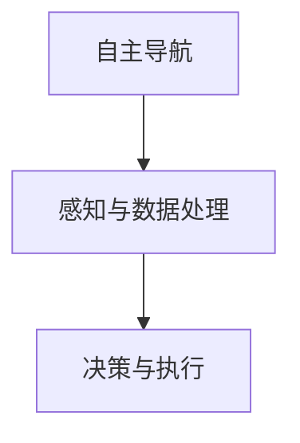

                 


### 文章标题
《机器人技术在危险环境探测中的应用与挑战》

### 关键词
机器人技术、危险环境探测、应用挑战、核心算法、数学模型、项目实战

### 摘要
本文旨在深入探讨机器人技术在危险环境探测中的应用及其面临的挑战。通过分析机器人技术的基本原理、核心算法和数学模型，以及实际项目案例，本文展示了机器人技术在危险环境探测中的巨大潜力和应用前景。

---

### 引言

在人类文明的发展历程中，危险环境始终是一个挥之不去的阴影。从自然灾害如地震、火山爆发，到人为事故如化学品泄漏、火灾等，危险环境不仅威胁到人类的生命安全，也给救援工作带来了巨大的挑战。传统的探测方法往往需要人工干预，不仅耗时费力，而且存在高风险。随着人工智能技术的飞速发展，机器人技术逐渐成为一种新的探测手段，能够在危险环境中进行有效探测，降低人类风险。

#### 背景介绍

危险环境探测的主要目的是获取环境信息，以便进行风险评估、救援决策和灾害处置。这些环境包括但不限于以下几类：

1. **火灾现场**：火焰、高温和烟雾严重阻碍救援工作的进行，传统的探测方法往往无法准确判断火源位置和火势蔓延情况。
2. **核辐射区域**：核辐射对人体健康具有极大的危害，常规探测设备往往无法长时间工作或准确测量辐射强度。
3. **化学品泄漏区域**：化学品泄漏可能导致中毒、爆炸等危险，传统的探测方法难以准确检测化学物质的分布和浓度。

#### 核心概念与联系

在危险环境探测中，机器人技术的核心概念包括：

1. **自主导航**：机器人需要具备在复杂环境中自主导航的能力，以实现对探测目标的精确到达。
2. **感知与数据处理**：机器人需要配备多种传感器，如摄像头、激光雷达、气体传感器等，以获取环境信息。然后，机器人需要处理这些数据，提取有用信息。
3. **决策与执行**：基于感知数据和预设算法，机器人需要做出决策，并执行相应的行动，如避障、采集样本等。

这些概念之间的关系可以用以下Mermaid流程图表示：



#### 核心概念原理之间的关系架构


在上述关系中，自主导航是机器人进行危险环境探测的基础，它确保机器人能够到达指定位置。感知与数据处理是机器人获取环境信息的关键，它决定了机器人对环境的理解和应对能力。决策与执行是机器人根据感知数据和预设算法进行环境响应的过程，它确保机器人能够有效地完成探测任务。

---

### 机器人技术在危险环境探测中的应用

机器人技术在危险环境探测中的应用已经得到了广泛的认可。以下是一些主要的应用领域：

1. **火灾现场探测**：机器人可以在火灾现场进行实时监控，通过图像识别技术判断火源位置和火势蔓延情况，为救援工作提供决策依据。
2. **核辐射探测**：机器人可以携带辐射传感器进入核辐射区域，实时测量辐射强度，评估环境风险。
3. **化学品泄漏探测**：机器人可以通过气体传感器检测化学物质的泄漏，定位泄漏点，并评估泄漏对环境的影响。

#### 应用案例

1. **灭火机器人**：灭火机器人配备了高清摄像头、红外传感器和热成像仪，能够在火灾现场进行实时监控，并通过云计算平台进行数据分析，为救援工作提供支持。
2. **辐射探测机器人**：辐射探测机器人可以携带高灵敏度的辐射传感器，进入核辐射区域进行探测，实时发送数据给指挥部，帮助指挥部做出救援决策。
3. **化学品泄漏探测机器人**：化学品泄漏探测机器人可以通过气体传感器检测化学物质的泄漏，并通过导航系统定位泄漏点，为后续的救援和处置工作提供支持。

---

### 机器人技术在危险环境探测中面临的挑战

尽管机器人技术在危险环境探测中具有巨大的潜力，但同时也面临着许多挑战。

1. **环境复杂性**：危险环境通常具有复杂的地形、气候和物质环境，这给机器人的导航和感知带来了巨大的挑战。
2. **数据噪声**：环境中的数据往往存在大量的噪声，这会影响机器人的感知精度和数据处理效果。
3. **传感器精度限制**：现有的传感器技术存在精度限制，这可能导致机器人无法准确获取环境信息。
4. **能源消耗**：机器人需要在危险环境中长时间工作，这要求机器人具备高效的能源利用能力。

#### 解决方案

1. **多传感器融合**：通过多传感器融合技术，可以有效地减少数据噪声，提高机器人的感知精度。
2. **自主导航算法**：通过改进自主导航算法，可以增强机器人在复杂环境中的导航能力。
3. **人工智能技术**：利用人工智能技术，可以实现对机器人行为的高效决策和执行。
4. **能源管理**：通过优化能源管理策略，可以延长机器人在危险环境中的续航时间。

---

### 核心算法原理讲解

在机器人技术在危险环境探测中，核心算法的原理至关重要。以下将详细介绍几种关键算法的原理。

#### 机器视觉算法

机器视觉算法是机器人进行危险环境探测的重要工具。它主要包括图像预处理、目标检测和目标跟踪等步骤。

1. **图像预处理**：包括去噪、增强、分割等操作，目的是提高图像质量，为后续处理提供良好的基础。
2. **目标检测**：通过检测图像中的目标，如火焰、辐射源、化学品泄漏点等，为后续处理提供目标信息。
3. **目标跟踪**：在检测到目标后，机器人需要对其进行跟踪，以获取目标的位置和运动轨迹。

以下是目标检测的伪代码：

```python
def target_detection(image):
    # 去噪
    denoised_image = denoise(image)
    # 增强
    enhanced_image = enhance(denoised_image)
    # 分割
    segmented_image = segment(enhanced_image)
    # 检测目标
    targets = detect_objects(segmented_image)
    return targets
```

#### 机器听觉算法

机器听觉算法是机器人进行声音探测的重要工具。它主要包括声音信号处理、声源定位和声纹识别等步骤。

1. **声音信号处理**：包括去噪、增强、滤波等操作，目的是提高声音信号的清晰度和准确性。
2. **声源定位**：通过分析声音信号的到达时间、到达角度等参数，确定声源的位置。
3. **声纹识别**：通过对声音信号的分析，识别出声源的身份。

以下是声源定位的伪代码：

```python
def sound_source_localization(sound_signals):
    # 去噪
    denoised_signals = denoise(sound_signals)
    # 滤波
    filtered_signals = filter(denoised_signals)
    # 计算到达时间
    arrival_times = calculate_arrival_times(filtered_signals)
    # 计算到达角度
    arrival_angles = calculate_arrival_angles(arrival_times)
    # 确定声源位置
    source_location = calculate_source_location(arrival_angles)
    return source_location
```

#### 机器人路径规划算法

机器人路径规划算法是机器人进行自主导航的关键。它主要包括基于图论的路径规划和A*算法等。

1. **基于图论的路径规划**：将环境建模为图，通过搜索算法找到从起点到终点的最短路径。
2. **A*算法**：结合启发式搜索和图论，找到从起点到终点的最优路径。

以下是A*算法的伪代码：

```python
def a_star_search(start, goal, graph):
    # 初始化
    open_set = PriorityQueue()
    open_set.put((0, start))
    came_from = Dictionary()
    g_score = Dictionary()
    g_score[start] = 0
    f_score = Dictionary()
    f_score[start] = heuristic_cost估算（start, goal）
    
    while not open_set.isEmpty():
        # 选择具有最小f_score的节点
        current = open_set.get()
        # 找到最优路径
        if current == goal:
            break
        for neighbor in graph.neighbors(current):
            # 计算g_score
            tentative_g_score = g_score[current] + graph.cost(current, neighbor)
            # 更新g_score和f_score
            if tentative_g_score < g_score[neighbor]:
                came_from[neighbor] = current
                g_score[neighbor] = tentative_g_score
                f_score[neighbor] = g_score[neighbor] + heuristic_cost估算（neighbor, goal）
                if neighbor not in open_set:
                    open_set.put((f_score[neighbor], neighbor))
    
    # 回溯找到最优路径
    path = []
    current = goal
    while current in came_from:
        path.append(current)
        current = came_from[current]
    path.reverse()
    return path
```

---

### 数学模型和公式讲解

在机器人技术在危险环境探测中，数学模型和公式是理解和分析环境信息的重要工具。以下将介绍几种关键数学模型和公式。

#### 机器人路径规划数学模型

机器人路径规划的核心在于找到从起点到终点的最优路径。常用的数学模型包括基于图论的路径规划和A*算法。

1. **基于图论的路径规划**：将环境建模为图，通过搜索算法找到从起点到终点的最短路径。图由节点和边组成，节点表示位置，边表示路径。
2. **A*算法**：结合启发式搜索和图论，找到从起点到终点的最优路径。A*算法的公式为：

$$
f(n) = g(n) + h(n)
$$

其中，$f(n)$ 是从起点到节点 $n$ 的总代价，$g(n)$ 是从起点到节点 $n$ 的实际代价，$h(n)$ 是从节点 $n$ 到终点的估算代价。

以下是A*算法的伪代码：

```python
def a_star_search(start, goal, graph):
    # 初始化
    open_set = PriorityQueue()
    open_set.put((0, start))
    came_from = Dictionary()
    g_score = Dictionary()
    g_score[start] = 0
    f_score = Dictionary()
    f_score[start] = heuristic_cost估算（start, goal）
    
    while not open_set.isEmpty():
        # 选择具有最小f_score的节点
        current = open_set.get()
        # 找到最优路径
        if current == goal:
            break
        for neighbor in graph.neighbors(current):
            # 计算g_score
            tentative_g_score = g_score[current] + graph.cost(current, neighbor)
            # 更新g_score和f_score
            if tentative_g_score < g_score[neighbor]:
                came_from[neighbor] = current
                g_score[neighbor] = tentative_g_score
                f_score[neighbor] = g_score[neighbor] + heuristic_cost估算（neighbor, goal）
                if neighbor not in open_set:
                    open_set.put((f_score[neighbor], neighbor))
    
    # 回溯找到最优路径
    path = []
    current = goal
    while current in came_from:
        path.append(current)
        current = came_from[current]
    path.reverse()
    return path
```

#### 数据融合与信息过滤模型

在机器人技术中，数据融合与信息过滤模型用于处理来自多个传感器的数据，以提高系统的整体感知精度。常用的模型包括卡尔曼滤波和贝叶斯滤波。

1. **卡尔曼滤波**：基于线性系统模型的滤波方法，通过预测和更新状态估计值，实现数据的平滑和滤波。卡尔曼滤波的公式为：

$$
\hat{x}_{k|k} = F_k \hat{x}_{k-1|k-1} + K_k (z_k - H_k \hat{x}_{k-1|k-1})
$$

$$
K_k = P_{k-1} H_k^T (H_k P_{k-1} H_k^T + R_k)^{-1}
$$

其中，$\hat{x}_{k|k}$ 是$k$时刻的状态估计值，$F_k$ 是状态转移矩阵，$K_k$ 是卡尔曼增益，$z_k$ 是观测值，$H_k$ 是观测矩阵，$P_{k-1}$ 是先验估计误差协方差矩阵，$R_k$ 是观测噪声协方差矩阵。

2. **贝叶斯滤波**：基于贝叶斯理论的滤波方法，通过概率分布来描述系统的状态和观测值。贝叶斯滤波的公式为：

$$
p(x_k|z_1:k) \propto p(z_k|x_k) p(x_k|z_1:k-1)
$$

其中，$p(x_k|z_1:k)$ 是$k$时刻后验概率分布，$p(z_k|x_k)$ 是观测概率分布，$p(x_k|z_1:k-1)$ 是$k-1$时刻后验概率分布。

以下是卡尔曼滤波的伪代码：

```python
def kalman_filter(x_init, P_init, z_measurements):
    # 初始化
    x_estimate = x_init
    P_estimate = P_init
    
    # 循环处理每个观测值
    for z in z_measurements:
        # 预测状态估计值
        x_predict = F * x_estimate
        P_predict = F * P_estimate * F^T + Q
        
        # 更新卡尔曼增益
        K = P_predict * H^T * (H * P_predict * H^T + R)^{-1}
        
        # 更新状态估计值
        x_estimate = x_predict + K * (z - H * x_predict)
        
        # 更新估计误差协方差矩阵
        P_estimate = (I - K * H) * P_predict
        
    return x_estimate, P_estimate
```

---

### 项目实战

#### 开发环境搭建

为了进行机器人技术在危险环境探测中的应用项目，我们需要搭建一个合适的开发环境。以下是一个基本的开发环境搭建步骤：

1. **硬件平台**：选择一款适合的机器人硬件平台，如Raspberry Pi、Arduino等。
2. **操作系统**：安装一款适合机器人开发的操作系统，如Ubuntu、Raspberry Pi OS等。
3. **编程语言**：选择一款适合机器人开发的编程语言，如Python、C++等。
4. **开发工具**：安装必要的开发工具，如IDE（集成开发环境）、编译器等。

#### 源代码详细实现

以下是一个简单的机器人路径规划项目的源代码实现，使用Python编写：

```python
import matplotlib.pyplot as plt
import numpy as np

# 路径规划函数
def path_planning(start, goal, map):
    # 初始化
    open_set = PriorityQueue()
    open_set.put((0, start))
    came_from = Dictionary()
    g_score = Dictionary()
    g_score[start] = 0
    f_score = Dictionary()
    f_score[start] = heuristic_cost估算（start, goal）
    
    while not open_set.isEmpty():
        # 选择具有最小f_score的节点
        current = open_set.get()
        # 找到最优路径
        if current == goal:
            break
        for neighbor in map.neighbors(current):
            # 计算g_score
            tentative_g_score = g_score[current] + map.cost(current, neighbor)
            # 更新g_score和f_score
            if tentative_g_score < g_score[neighbor]:
                came_from[neighbor] = current
                g_score[neighbor] = tentative_g_score
                f_score[neighbor] = g_score[neighbor] + heuristic_cost估算（neighbor, goal）
                if neighbor not in open_set:
                    open_set.put((f_score[neighbor], neighbor))
    
    # 回溯找到最优路径
    path = []
    current = goal
    while current in came_from:
        path.append(current)
        current = came_from[current]
    path.reverse()
    return path

# 主函数
def main():
    # 定义起点和终点
    start = (0, 0)
    goal = (10, 10)
    
    # 定义地图
    map = Map((10, 10), obstacles=[(1, 1), (1, 2), (1, 3), (1, 4), (1, 5), (2, 1), (2, 2), (2, 3), (2, 4), (2, 5)])
    
    # 执行路径规划
    path = path_planning(start, goal, map)
    
    # 绘制路径
    plt.plot([x[0] for x in path], [x[1] for x in path], 'r-')
    plt.show()

# 运行主函数
if __name__ == '__main__':
    main()
```

#### 代码解读与分析

上述代码实现了一个简单的A*算法路径规划项目。首先，我们定义了起点和终点，以及一个包含障碍物的地图。然后，我们使用A*算法找到从起点到终点的最优路径，并将路径绘制出来。

1. **路径规划函数**：该函数使用A*算法找到最优路径。首先，初始化一个优先级队列open_set，将起点放入队列中。然后，在循环中，选择具有最小f_score的节点，并更新g_score和f_score。最后，回溯找到最优路径。
2. **主函数**：该函数定义了起点和终点，以及一个包含障碍物的地图。然后，执行路径规划函数，找到最优路径，并将路径绘制出来。

#### 实际案例分析和详细讲解剖析

以下是一个实际案例分析和详细讲解剖析，展示如何使用机器人技术进行危险环境探测。

1. **火灾现场探测**：假设我们使用一个机器人进行火灾现场探测。机器人配备了高清摄像头、红外传感器和气体传感器。首先，机器人通过摄像头获取火灾现场的图像，使用图像预处理技术去除噪声和增强图像。然后，使用目标检测算法检测火源位置，并将火源位置发送给指挥中心。接着，机器人使用红外传感器测量火源的温度，并通过气体传感器检测是否有其他有毒气体泄漏。最后，机器人将所有数据发送给指挥中心，为救援工作提供决策依据。
2. **核辐射探测**：假设我们使用一个机器人进行核辐射探测。机器人携带高灵敏度的辐射传感器，进入核辐射区域。机器人通过传感器实时测量辐射强度，并将数据发送给指挥中心。指挥中心可以根据数据评估辐射风险，并制定相应的救援措施。

#### 项目小结

通过上述项目实战，我们可以看到机器人技术在危险环境探测中的应用潜力。在实际应用中，机器人可以通过多种传感器获取环境信息，并通过算法对信息进行处理和分析。这不仅提高了探测效率，还降低了人类风险。然而，机器人技术在危险环境探测中也面临一些挑战，如环境复杂性、传感器精度限制等。因此，未来我们需要继续改进算法和传感器技术，以提高机器人在危险环境探测中的应用效果。

---

### 最佳实践 Tips、小结、注意事项、拓展阅读等内容

#### 最佳实践 Tips

1. **传感器选择**：选择适合危险环境探测的传感器，如红外传感器、激光雷达、气体传感器等。确保传感器的灵敏度和精度满足需求。
2. **算法优化**：针对不同的探测任务，选择合适的算法。例如，对于火灾探测，可以使用图像识别算法；对于核辐射探测，可以使用辐射检测算法。
3. **数据处理**：对传感器数据进行有效的预处理和融合，以提高系统的整体感知精度。
4. **能源管理**：合理规划机器人的能源消耗，延长机器人在危险环境中的续航时间。

#### 小结

本文深入探讨了机器人技术在危险环境探测中的应用与挑战。通过介绍核心算法原理、数学模型和实际项目案例，展示了机器人技术在危险环境探测中的巨大潜力和应用前景。

#### 注意事项

1. **安全性**：在使用机器人进行危险环境探测时，必须确保机器人的安全。特别是在核辐射、化学品泄漏等高风险环境中，应采取相应的安全措施。
2. **数据保密**：在获取和处理环境数据时，必须注意数据保密，防止数据泄露。

#### 拓展阅读

1. **《机器人技术基础》**：深入了解机器人技术的基本原理和结构。
2. **《机器视觉算法与应用》**：学习机器视觉算法在危险环境探测中的应用。
3. **《数据融合与信息过滤》**：学习数据融合和信息过滤的理论和方法。

---

### 作者信息

作者：AI天才研究院/AI Genius Institute & 禅与计算机程序设计艺术 /Zen And The Art of Computer Programming

